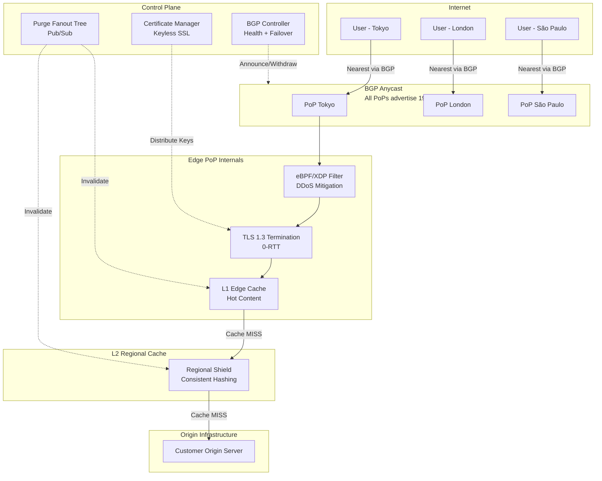

# System Design: Building a Global Edge CDN

## Speaker Intro

This handbook is written from the perspective of a **Principal Network Architect** who has designed, scaled, and operated global Content Delivery Networks serving tens of millions of requests per second across 300+ points of presence. The content draws from first-hand experience building edge platforms at the intersection of BGP routing, kernel-bypass networking, cryptographic protocol optimization, and distributed cache coordination.

## Who This Is For

- **Infrastructure engineers** who have deployed applications *behind* a CDN but have never looked inside one—and want to understand the machinery that makes sub-50 ms global latency possible.
- **Network engineers** moving beyond static configurations into programmable, software-defined edge platforms where every millisecond and every packet matters.
- **Security engineers** responsible for absorbing volumetric DDoS attacks and who need to understand why traditional firewalls collapse at terabit scale—and what replaces them.
- **Backend architects** evaluating build-vs-buy for edge infrastructure and who need a mental model of the full stack: from BGP announcement to cache hit to TLS termination.
- **Anyone who has typed `curl -I` and wondered** how a response came back from a server 40 ms away when the origin is on another continent.

## Prerequisites

| Concept | Where to Learn |
|---|---|
| Intermediate Rust (ownership, traits, `async`) | [Async Rust](../async-book/src/SUMMARY.md) |
| TCP/IP fundamentals (3-way handshake, sockets) | [Tokio Internals](../tokio-internals-book/src/SUMMARY.md) |
| Linux networking basics (`iptables`, sockets, `netstat`) | [Hardware Sympathy](../hardware-sympathy-book/src/SUMMARY.md) |
| Basic cryptography (symmetric vs asymmetric, certificates) | Any TLS/PKI primer |
| Familiarity with HTTP caching headers (`Cache-Control`, `ETag`) | MDN Web Docs |

## How to Use This Book

| Emoji | Meaning |
|---|---|
| 🟢 | **Architecture** — foundational design decisions, protocol mechanics, and topology |
| 🟡 | **Caching** — production-grade cache design, TLS optimization, and consistency patterns |
| 🔴 | **Kernel Networking** — eBPF/XDP, packet-level processing, and extreme-scale defense |

Each chapter solves **one critical layer** of a global edge CDN, from bottom (routing) to top (application-layer caching and security). Read them in order—later chapters assume the routing and TLS infrastructure from earlier chapters exist.

## The System We Are Building

> Design a **global edge CDN** capable of serving **10 million requests per second** across **300+ points of presence**, with **sub-50 ms time-to-first-byte** for cached content, **instant global cache purge** (< 2 seconds), and the ability to **absorb 1+ Tbps DDoS attacks** without impacting legitimate traffic.

| Requirement | Target |
|---|---|
| Points of Presence (PoPs) | 300+ cities, 100+ countries |
| Requests per second (global) | ≥ 10 M |
| Cache hit ratio | ≥ 95% at L1 edge |
| Time-to-first-byte (cache hit) | < 50 ms (p95) |
| TLS handshake | 1-RTT (TLS 1.3), 0-RTT for repeat visitors |
| Global purge latency | < 2 seconds |
| DDoS absorption | ≥ 1 Tbps volumetric, ≥ 100 M pps |
| Origin shield effectiveness | ≤ 1% of requests reach origin |

## Pacing Guide

| Chapter | Topic | Time | Checkpoint |
|---|---|---|---|
| Ch 0 | Introduction & Problem Statement | 30 min | Understand the design canvas |
| Ch 1 | BGP Anycast and Global Routing | 5–7 hours | Anycast topology designed, failover understood |
| Ch 2 | TLS Termination at the Edge | 5–7 hours | TLS 1.3 0-RTT flow, keyless SSL architecture |
| Ch 3 | The Cache Hierarchy and Thundering Herds | 6–8 hours | Multi-tier cache with coalescing implemented |
| Ch 4 | Cache Invalidation | 5–7 hours | Sub-2-second global purge pipeline designed |
| Ch 5 | Volumetric DDoS Mitigation with eBPF | 7–9 hours | XDP program filtering at line rate |

**Total: ~28–38 hours** of focused study.

## Table of Contents

### Part I: Global Routing & Connectivity

- **Chapter 1 — BGP Anycast and Global Routing 🟢** — How 100 servers around the world share one IP address. Configuring BGP so the internet automatically routes users to the nearest data center. Handling failover when a PoP goes dark.

- **Chapter 2 — TLS Termination at the Edge 🟡** — Why the speed of light mandates edge termination. Collapsing the TCP+TLS handshake from 3 round-trips to 1 (or zero). Distributing SSL certificates to thousands of edge nodes without exposing private keys via Keyless SSL.

### Part II: Caching Architecture

- **Chapter 3 — The Cache Hierarchy and Thundering Herds 🟡** — Designing L1 (edge) and L2 (regional) cache tiers. Using consistent hashing to route within a PoP. Request coalescing to ensure 1,000 simultaneous requests for an expired asset generate exactly *one* origin fetch.

- **Chapter 4 — Cache Invalidation (The Hardest Problem) 🔴** — Purging a cached file across 300+ PoPs in under 2 seconds. A fan-out pub/sub tree that propagates invalidation commands globally. Versioned URLs vs. active purge vs. soft purge trade-offs.

### Part III: Security & Resilience

- **Chapter 5 — Volumetric DDoS Mitigation with eBPF 🔴** — Surviving a 1 Tbps attack. Why `iptables` melts your CPU at 10 M pps. Writing XDP programs in C loaded via eBPF to inspect and drop malicious packets on the NIC before the kernel network stack is involved.

## Architecture Overview

## Companion Guides

| Guide | Relevance |
|---|---|
| [Async Rust](../async-book/src/SUMMARY.md) | `async` I/O underpins every edge proxy |
| [Tokio Internals](../tokio-internals-book/src/SUMMARY.md) | The event loop powering TLS termination |
| [Hardware Sympathy](../hardware-sympathy-book/src/SUMMARY.md) | CPU cache lines, NUMA, and NIC queues |
| [Unsafe & FFI](../unsafe-ffi-book/src/SUMMARY.md) | Calling eBPF/XDP C programs from Rust |
| [Zero-Copy Networking](../zero-copy-book/src/SUMMARY.md) | Kernel-bypass techniques for the data plane |
| [Distributed Message Broker](../system-design-book/src/SUMMARY.md) | The pub/sub backbone for purge fanout |
