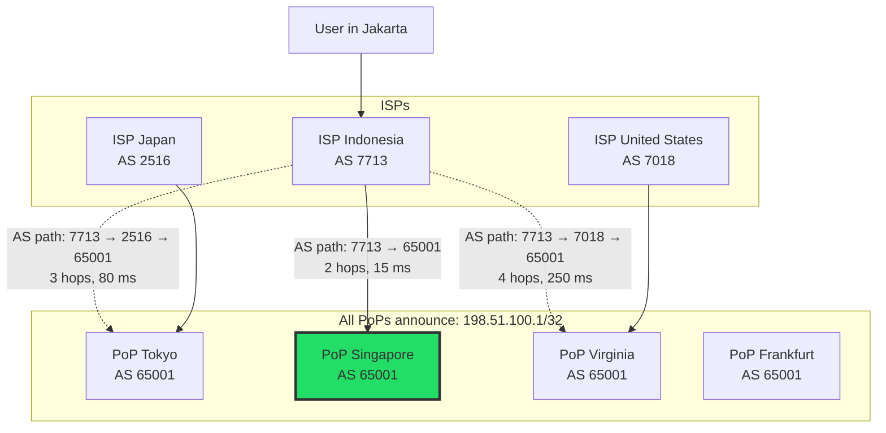
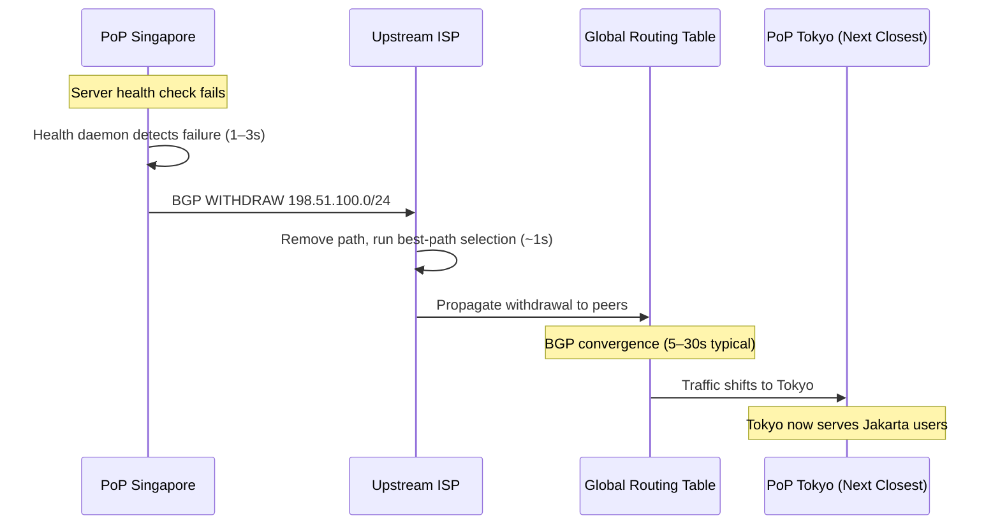
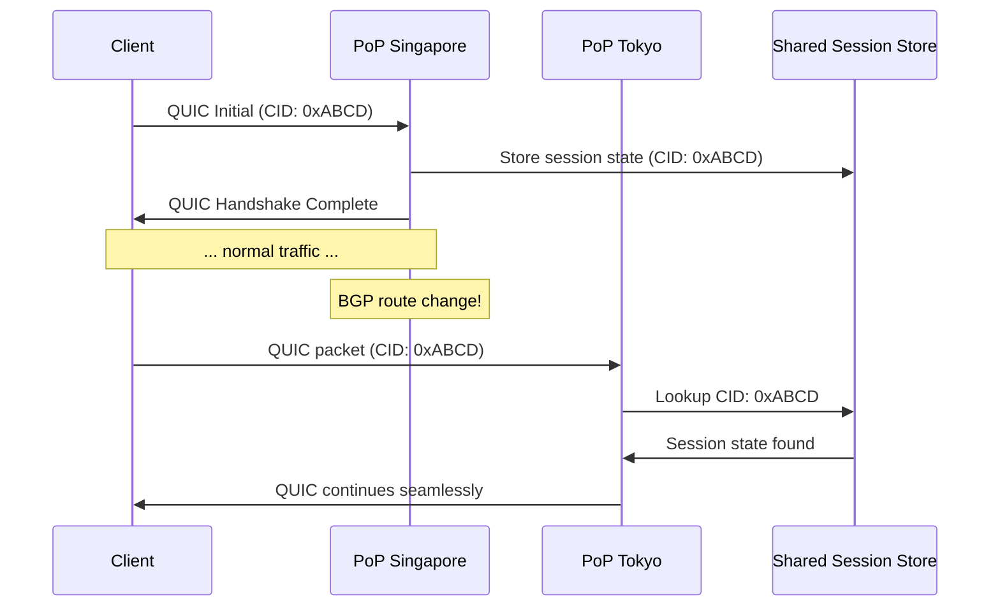
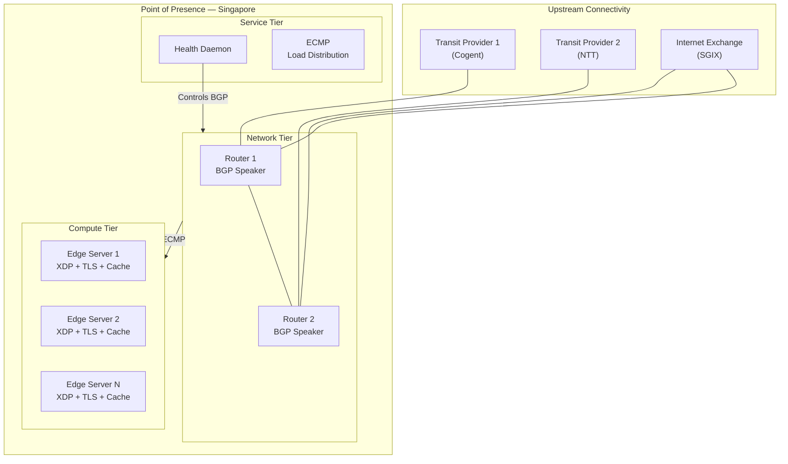

# 1. BGP Anycast and Global Routing 🟢

> **The Problem:** Your CDN has 300 Points of Presence (PoPs) spread across six continents. A user in Jakarta types `cdn.example.com` into their browser. How does the internet know to send that request to your Singapore PoP (15 ms away) instead of your Virginia PoP (250 ms away)? And when that Singapore PoP catches fire at 3 AM, how does traffic silently shift to Tokyo (60 ms) without a single DNS TTL expiring?

---

## Unicast vs Anycast: The Core Insight

In traditional **unicast** routing, every server has a unique IP address. DNS maps a hostname to one (or a few) of those addresses. The problem: DNS-based load balancing is slow—clients cache DNS responses for minutes or hours, and failover requires waiting for TTLs to expire.

**Anycast** flips the model entirely: *every* PoP advertises the *same* IP address to the internet via BGP. The routing infrastructure itself—millions of routers operated by thousands of ISPs—selects the "closest" server based on real-time network topology.

| Property | Unicast + DNS | BGP Anycast |
|---|---|---|
| IP address per PoP | Unique (e.g., 10 different IPs) | Identical (one IP, 300 PoPs) |
| Routing decision | DNS resolver (application layer) | BGP routers (network layer) |
| Failover speed | DNS TTL (30s–300s typical) | BGP convergence (~3–90s) |
| Granularity | Per-resolver (not per-user) | Per-router hop (per-AS path) |
| Protocol support | Any (TCP, UDP, QUIC) | Any (operates at IP layer) |
| Sticky sessions | Natural (same IP) | Fragile (route changes = new PoP) |



The Indonesian ISP's router has **three** valid routes to `198.51.100.1/32`. It selects Singapore because of the **shortest AS path** (fewest autonomous system hops). This decision is invisible to the application—no DNS trickery, no client-side logic.

---

## How BGP Anycast Actually Works

### BGP in 60 Seconds

The Border Gateway Protocol (BGP) is the routing protocol of the internet. Every Autonomous System (AS)—an ISP, cloud provider, or CDN—uses BGP to announce which IP prefixes it can reach. Routers exchange these announcements and build a table of the "best" path to every prefix.

**BGP path selection** (simplified) evaluates routes in this order:

1. **Highest Local Preference** — Operator-configured weight (used within an AS).
2. **Shortest AS Path** — Fewest AS hops to the destination.
3. **Lowest Origin Type** — IGP < EGP < Incomplete.
4. **Lowest MED** — Multi-Exit Discriminator (hint from the announcing AS).
5. **eBGP over iBGP** — Prefer externally-learned routes.
6. **Nearest IGP next-hop** — Lowest interior metric ("hot potato" routing).
7. **Tiebreakers** — Router ID, peer IP, etc.

For anycast, rule **#2 (shortest AS path)** and rule **#6 (nearest next-hop)** do most of the heavy lifting: traffic naturally flows to the topologically closest PoP.

### Announcing an Anycast Prefix

Every PoP runs a BGP speaker (e.g., BIRD, FRRouting, or GoBGP) that announces the same prefix to upstream transit providers and Internet Exchange Points (IXPs).

**BIRD configuration at each PoP:**

```
# /etc/bird/bird.conf — identical at every PoP (except router_id)
router id 10.0.42.1;        # Unique loopback per PoP

protocol static anycast_routes {
    # The global anycast prefix — same everywhere
    route 198.51.100.0/24 blackhole;
}

filter export_anycast {
    if net = 198.51.100.0/24 then {
        bgp_community.add((65001, 100));   # Tag: anycast route
        accept;
    }
    reject;
}

protocol bgp upstream_transit_1 {
    local as 65001;
    neighbor 169.254.0.1 as 174;           # Cogent
    export filter export_anycast;
    import all;
}

protocol bgp ixp_peer_1 {
    local as 65001;
    neighbor 206.81.80.1 as 6939;          # Hurricane Electric @ IXP
    export filter export_anycast;
    import all;
}
```

Key design points:

- **`route ... blackhole`**: We announce the prefix but locally blackhole it—the actual traffic handling is done by the edge proxy, not the kernel routing table.
- **Same prefix at every PoP**: This is what makes it anycast. ISP routers see multiple paths to `198.51.100.0/24` and pick the "best" one.
- **BGP communities**: Tags like `(65001, 100)` let us signal intent to upstream providers (e.g., "do not export to peers" for traffic engineering).

---

## Health Checking and Automated Failover

Anycast gives us automatic failover *for free*—if a PoP stops announcing its BGP routes, upstream routers remove that path and traffic shifts to the next-closest PoP. The critical question is: **how fast?**

### The BGP Withdrawal Timeline



### The Three Failover Strategies

| Strategy | Failover Time | Mechanism |
|---|---|---|
| **BGP Withdrawal** | 5–90 seconds | PoP stops announcing prefix; BGP converges |
| **BGP Community Poisoning** | 3–30 seconds | Announce prefix with `NO_EXPORT` community to drain |
| **Prepend + Withdrawal** | 2–15 seconds | First prepend AS path (make route worse), then withdraw |

### Building a Health Daemon

The health daemon is the most critical piece of software in the entire CDN. It monitors local service health and controls BGP announcements:

```rust
use std::time::Duration;
use tokio::time;

/// Health check targets — all must pass for the PoP to be "healthy."
struct HealthConfig {
    /// Local edge proxy must respond to synthetic requests.
    proxy_endpoint: String,
    /// DNS resolver must be functional.
    dns_endpoint: String,
    /// Minimum healthy backends in the local pool.
    min_healthy_backends: usize,
    /// Consecutive failures before withdrawing BGP routes.
    failure_threshold: u32,
    /// Check interval.
    interval: Duration,
}

#[derive(Debug, Clone, Copy, PartialEq, Eq)]
enum PopHealth {
    Healthy,
    Degraded,  // Some checks failing — prepend AS path
    Critical,  // All checks failing — withdraw BGP route
}

struct HealthDaemon {
    config: HealthConfig,
    consecutive_failures: u32,
    bgp_client: BirdControlClient,
}

impl HealthDaemon {
    async fn run(&mut self) {
        let mut interval = time::interval(self.config.interval);
        loop {
            interval.tick().await;
            let health = self.check_all().await;
            match health {
                PopHealth::Healthy => {
                    self.consecutive_failures = 0;
                    self.bgp_client.announce_normal().await;
                }
                PopHealth::Degraded => {
                    self.consecutive_failures += 1;
                    // Make route less preferred — traffic starts draining
                    self.bgp_client.announce_with_prepend(3).await;
                }
                PopHealth::Critical => {
                    self.consecutive_failures += 1;
                    if self.consecutive_failures >= self.config.failure_threshold {
                        // Full withdrawal — traffic shifts to next PoP
                        self.bgp_client.withdraw().await;
                    }
                }
            }
        }
    }

    async fn check_all(&self) -> PopHealth {
        let (proxy_ok, dns_ok, backends) = tokio::join!(
            self.check_proxy(),
            self.check_dns(),
            self.count_healthy_backends(),
        );

        if proxy_ok && dns_ok && backends >= self.config.min_healthy_backends {
            PopHealth::Healthy
        } else if proxy_ok && backends > 0 {
            PopHealth::Degraded
        } else {
            PopHealth::Critical
        }
    }

    async fn check_proxy(&self) -> bool { /* HTTP GET to local proxy */ todo!() }
    async fn check_dns(&self) -> bool { /* DNS query to local resolver */ todo!() }
    async fn count_healthy_backends(&self) -> usize { /* Pool health */ todo!() }
}

/// Thin wrapper around the BIRD control socket.
struct BirdControlClient { /* birdc connection */ }

impl BirdControlClient {
    async fn announce_normal(&self) {
        // birdc: enable protocol anycast_routes
    }
    async fn announce_with_prepend(&self, _times: u32) {
        // birdc: reconfigure with increased AS path length
    }
    async fn withdraw(&self) {
        // birdc: disable protocol anycast_routes
    }
}
```

The three-state model (`Healthy → Degraded → Critical`) is crucial. Jumping straight to withdrawal on the first failure would cause unnecessary traffic shifts (and potentially cascading failures if multiple PoPs flap simultaneously).

---

## Anycast and TCP: The Statefulness Problem

Here is the elephant in the room: **TCP is stateful, but anycast is not.**

A TCP connection is identified by a 4-tuple: `(src_ip, src_port, dst_ip, dst_port)`. If a BGP route change causes a user's packets to shift from PoP A to PoP B *mid-connection*, PoP B has no knowledge of that TCP session. The connection resets.

### When This Matters (and When It Doesn't)

| Protocol | Impact of Route Change | Mitigation |
|---|---|---|
| **DNS (UDP)** | None — each query is independent | Anycast is *perfect* for DNS |
| **HTTP/1.1 short-lived** | Rare — connections are brief | Acceptable: client retries |
| **HTTP/2 long-lived** | Noticeable — streams reset, must reconnect | QUIC migration or connection draining |
| **QUIC/HTTP3** | Transparent — QUIC has connection migration built in | Native solution |

### QUIC Connection Migration

QUIC solves the anycast statefulness problem natively. A QUIC connection is identified by a **Connection ID** (not the IP 4-tuple). If a route change sends packets to a different PoP, the new PoP can—if it has access to a shared session store—resume the connection seamlessly.



In practice, most CDNs accept occasional TCP resets during route changes (they are rare—a few times per day at most) and rely increasingly on QUIC for seamless migration.

---

## Traffic Engineering: Beyond Shortest Path

Raw BGP anycast sends traffic to the topologically closest PoP. But "closest by AS hops" ≠ "lowest latency" ≠ "best user experience." Traffic engineering gives you knobs to override BGP's default decisions.

### BGP Communities for Traffic Steering

BGP communities are metadata tags attached to route announcements. Upstream providers publish action communities that let you control how your routes propagate:

| Community | Effect |
|---|---|
| `(174:990)` | Cogent: do not announce to any peer |
| `(174:991)` | Cogent: do not announce to customers |
| `(6939:666)` | Hurricane Electric: blackhole this prefix |
| `(65001:100)` | Internal: standard anycast route |
| `(65001:200)` | Internal: deprioritized (draining PoP) |
| `(65001:666)` | Internal: blackhole (DDoS mitigation) |

### AS Path Prepending

By artificially lengthening the AS path for a specific PoP's announcements, you make that PoP less preferred. This is the simplest traffic engineering lever:

```
# Make Frankfurt less preferred (drain 50% traffic)
filter export_anycast_deprioritized {
    if net = 198.51.100.0/24 then {
        # Original path: [65001]
        # Prepended path: [65001 65001 65001]  — looks 3x farther away
        bgp_path.prepend(65001);
        bgp_path.prepend(65001);
        accept;
    }
    reject;
}
```

### Selective Anycast: Regional Prefixes

For fine-grained control, announce **different prefixes** in different regions while keeping a global anycast prefix as a fallback:

```
Announcement Strategy:
  Global:     198.51.100.0/24   → All PoPs (anycast fallback)
  Europe:     198.51.100.0/25   → Frankfurt, London, Amsterdam only
  Asia:       198.51.100.128/25 → Tokyo, Singapore, Mumbai only
```

Because BGP prefers **more-specific prefixes** (longest prefix match), European ISPs will route to the `/25` announced only from European PoPs. If all European PoPs fail, traffic falls back to the global `/24`.

---

## PoP Architecture: Inside an Anycast Node

A single Point of Presence is not a single server—it is a micro data center optimized for edge workloads:



### ECMP: Distributing Traffic Within a PoP

Equal-Cost Multi-Path (ECMP) routing distributes incoming anycast traffic across multiple edge servers. The router hashes the packet's 5-tuple `(proto, src_ip, src_port, dst_ip, dst_port)` to select a next-hop server.

**Critical property:** ECMP is *flow-consistent*—all packets in the same TCP connection go to the same server. This preserves TCP session affinity within a PoP even though traffic distribution is stateless.

```
# Router ECMP configuration (pseudocode)
route 198.51.100.0/24 {
    next-hop 10.0.42.1 weight 1;  # Edge Server 1
    next-hop 10.0.42.2 weight 1;  # Edge Server 2
    next-hop 10.0.42.3 weight 1;  # Edge Server 3
    hash-policy: 5-tuple;
}
```

---

## Real-World Anycast: Case Study — 1.1.1.1

Cloudflare's `1.1.1.1` DNS resolver is the canonical example of anycast at scale:

- **One IP address** served from **300+ cities** worldwide.
- Every PoP announces `1.1.1.0/24` via BGP to local ISPs and IXPs.
- Traffic naturally reaches the nearest PoP—no DNS-based geo-steering needed.
- UDP-based DNS is a *perfect* anycast workload (stateless, short-lived).
- During a PoP failure, upstream routers converge in seconds—users experience at most one dropped query before retrying and reaching the next PoP.

For a CDN serving HTTP over TCP, the same anycast prefix carries web traffic. The tradeoff (TCP state vs. routing flexibility) is acceptable because:

1. Most HTTP connections are short-lived (< 30 seconds).
2. Route changes are infrequent (a few per day per PoP).
3. QUIC adoption is eliminating the problem entirely.

---

## Monitoring and Observability

You cannot operate an anycast network without visibility into how traffic is actually flowing.

### Essential Metrics

| Metric | Source | Alert Threshold |
|---|---|---|
| BGP session state | BIRD/FRR status | Any session `DOWN` |
| Announced prefix count | BGP RIB export | Drops below expected |
| Traffic per PoP (pps/bps) | SNMP/sFlow on routers | > 2σ deviation from baseline |
| Latency per source-AS | Synthetic probes | p50 > 50 ms |
| ECMP distribution skew | Per-server RX packet counters | > 20% imbalance |
| BGP convergence time | Looking Glass / RIPE RIS | > 60 seconds |

### Catchment Maps

A **catchment map** shows which users are routed to which PoP. Build them by:

1. Running `traceroute` probes from RIPE Atlas anchors worldwide to your anycast IP.
2. Mapping each probe's source AS to the PoP that answered.
3. Visualizing on a world map—each PoP's "catchment area" is the set of ASes it serves.

Catchment maps reveal **sub-optimal routing**: if users in Indonesia are hitting your Virginia PoP, you either need a closer PoP, better peering with Indonesian ISPs, or community-based traffic engineering to steer them correctly.

---

## Common Pitfalls

### 1. The /32 Announcement Trap

Some operators try to announce a single `/32` (one IP) via BGP. Many ISPs filter prefixes longer than `/24`—your announcement will be silently dropped. **Always announce at least a `/24`.**

### 2. Anycast with Long-Lived TCP

If your workload requires multi-minute TCP connections (WebSockets, gRPC streaming), pure anycast will cause pain. Solutions:

- **QUIC** with connection migration and shared session state.
- **Anycast for DNS/discovery + unicast for the session**: The initial connection uses anycast to reach the nearest PoP, which then redirects the client to a unicast IP for the long-lived session.

### 3. Cascading Failures

When one PoP goes down, its traffic shifts to neighboring PoPs. If those PoPs are already at 80% capacity, the sudden 20–30% traffic increase can push them over, causing a domino effect.

**Mitigation:** Capacity plan for **N-1** (or **N-2**) PoP failures. Every PoP should run at ≤ 60% capacity under normal conditions so it can absorb a neighbor's traffic.

### 4. BGP Route Oscillation

If a health daemon is too aggressive (low thresholds, fast checks), it can cause rapid BGP announce/withdraw cycles—*route flapping*. Upstream ISPs implement **route flap damping** that penalizes unstable routes, potentially blackholing your PoP for *minutes* after repeated flaps.

**Mitigation:** Use exponential backoff in the health daemon. Require 3+ consecutive failures before withdrawal, and 5+ consecutive successes before re-announcement.

---

> **Key Takeaways**
>
> 1. **Anycast lets every PoP share one IP.** BGP routers automatically send traffic to the topologically closest PoP—no DNS steering required.
> 2. **Failover is automatic but not instant.** BGP convergence takes 5–90 seconds. Use a graduated health daemon (`Healthy → Degraded → Critical`) to minimize unnecessary withdrawals.
> 3. **TCP and anycast are uneasy allies.** Route changes break TCP connections. QUIC's connection migration is the long-term fix; short-lived HTTP connections make it acceptable today.
> 4. **Traffic engineering requires active control.** AS path prepending, BGP communities, and selective regional prefixes give you knobs to override BGP's default shortest-path behavior.
> 5. **Capacity plan for N-2 failures.** Anycast failover shifts load to neighbors. If neighbors can't absorb it, you get cascading failures.
> 6. **Never announce more specific than /24.** ISP prefix filters will silently drop longer prefixes.
