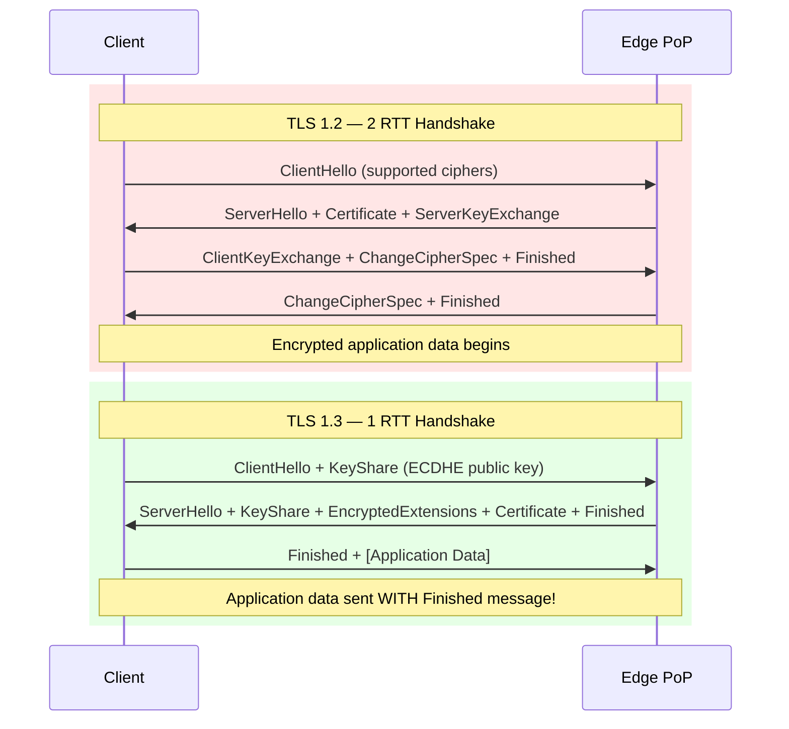
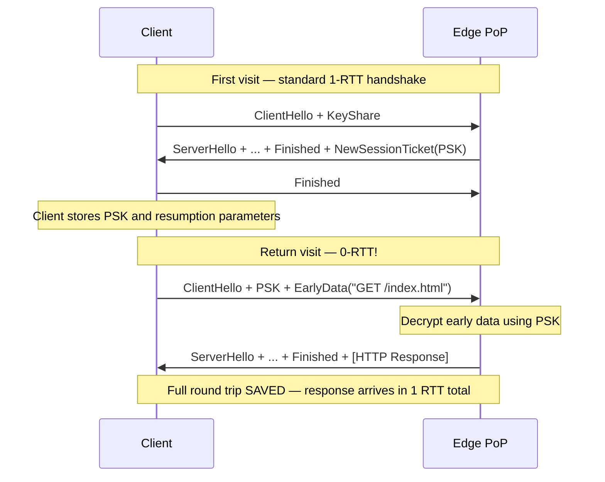
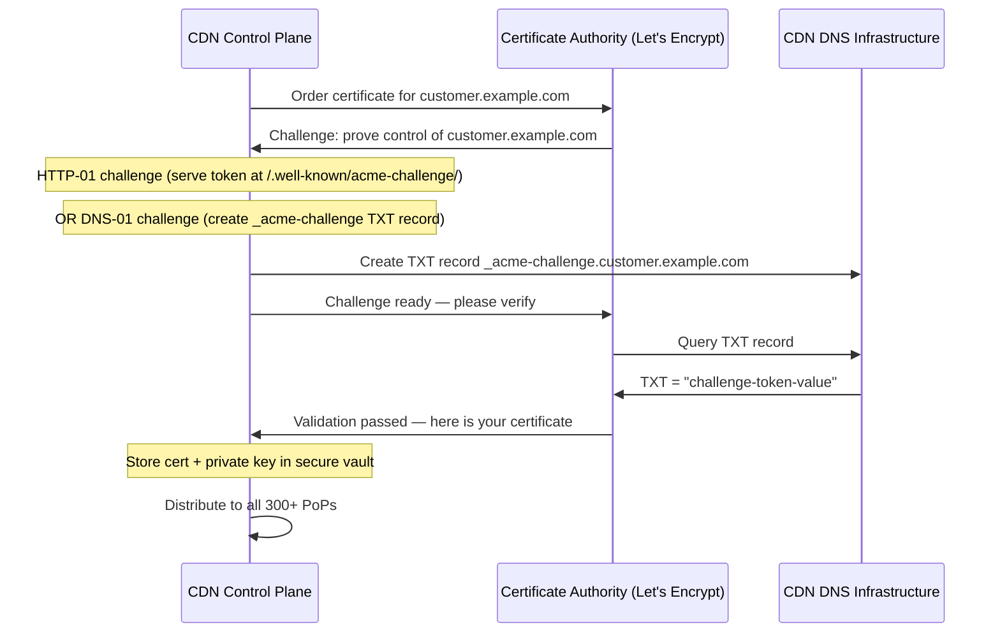
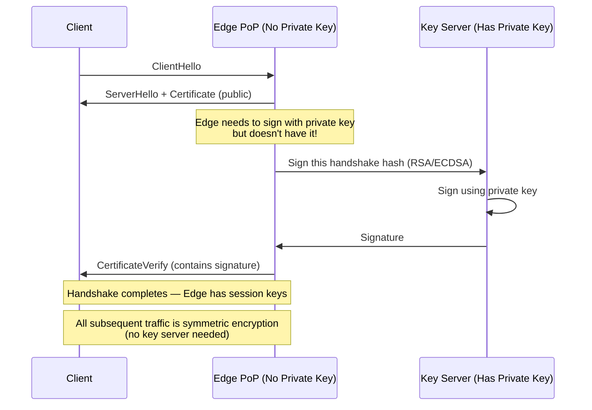
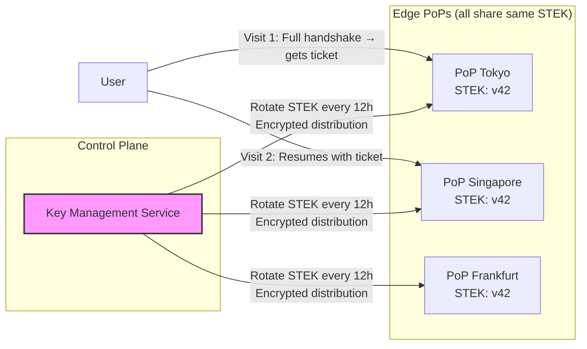
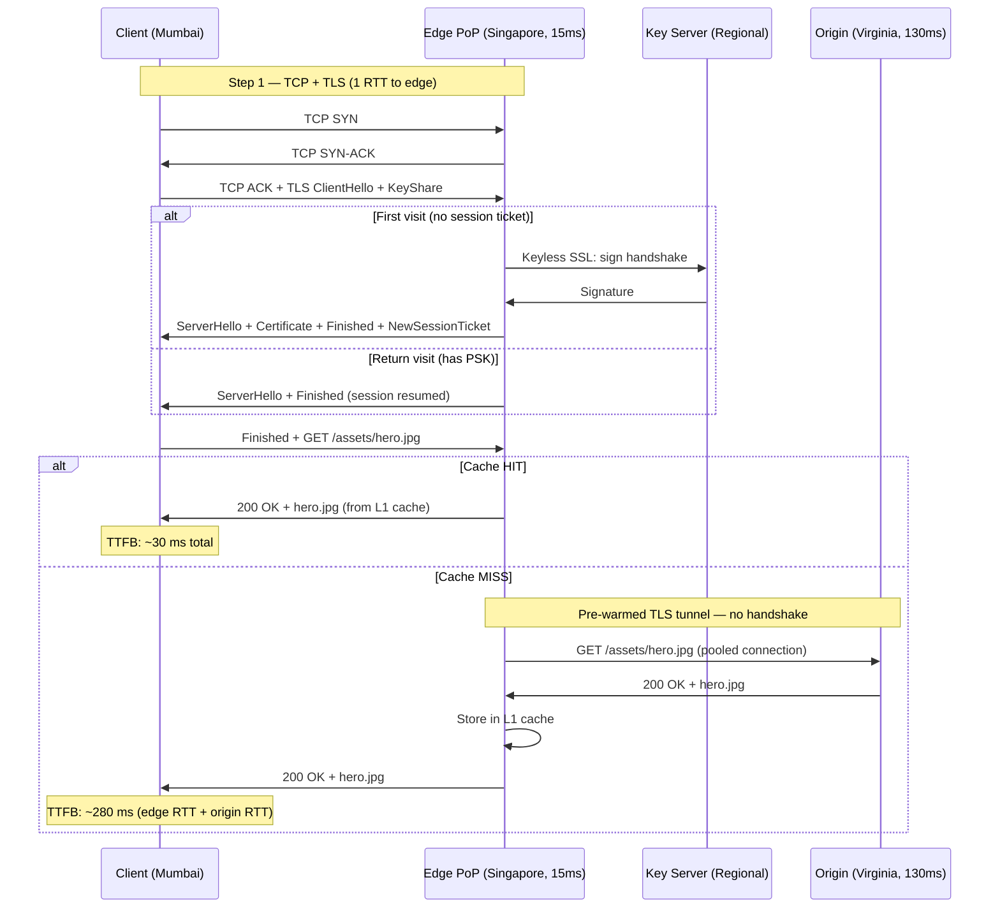

# 2. TLS Termination at the Edge 🟡

> **The Problem:** Your origin server is in Virginia. A user in Mumbai clicks a link. Before a single byte of content can flow, the browser must complete a TCP handshake (1 RTT, ~150 ms) *and* a TLS handshake (1–2 more RTTs, ~150–300 ms). That's 300–450 ms of staring at a blank screen—*before* the HTTP request is even sent. The speed of light is the enemy, and the only way to win is to move TLS termination to within 20 ms of the user.

---

## Why Edge Termination Is Non-Negotiable

The speed of light in fiber is approximately **200,000 km/s** (about ⅔ the speed of light in vacuum). A round trip from Mumbai to Virginia covers ~26,000 km of fiber, yielding a **minimum physical RTT of ~130 ms**. No protocol optimization can break this floor.

| Connection Step | Round Trips | Mumbai → Virginia (130 ms RTT) | Mumbai → Singapore Edge (15 ms RTT) |
|---|---|---|---|
| TCP SYN/SYN-ACK | 1 RTT | 130 ms | 15 ms |
| TLS 1.2 Handshake | 2 RTT | 260 ms | 30 ms |
| TLS 1.3 Handshake | 1 RTT | 130 ms | 15 ms |
| TLS 1.3 0-RTT | 0 RTT | 0 ms | 0 ms |
| HTTP Request/Response | 1 RTT | 130 ms | 15 ms |
| **Total (TLS 1.2)** | **4 RTT** | **650 ms** | **75 ms** |
| **Total (TLS 1.3)** | **2 RTT** | **260 ms** | **30 ms** |
| **Total (TLS 1.3 + 0-RTT)** | **1 RTT** | **130 ms** | **15 ms** |

By terminating TLS at the Singapore edge (15 ms from Mumbai) instead of Virginia (130 ms), the user's time-to-first-byte drops from **650 ms to 75 ms** with TLS 1.2—a **8.7× improvement**. With TLS 1.3 + 0-RTT, the gap is **130 ms vs 15 ms**.

The edge-to-origin connection can then use a persistent, pre-warmed TCP+TLS tunnel—no handshake overhead for cache misses.

---

## The TLS 1.3 Handshake: From 3 RTTs to 1

TLS 1.3 (RFC 8446) fundamentally restructured the handshake to eliminate an entire round trip compared to TLS 1.2.

### TLS 1.2 vs TLS 1.3 Handshake Comparison



The TLS 1.3 breakthrough: the client speculatively sends its **key share** (Diffie-Hellman public key) in the very first message. If the server supports the same group, the handshake completes in **one round trip**. There is no renegotiation, no RSA key transport, no ChangeCipherSpec—every unnecessary message was removed.

### Key Differences

| Feature | TLS 1.2 | TLS 1.3 |
|---|---|---|
| Handshake RTTs | 2 | 1 |
| Key exchange | RSA or ECDHE (negotiated) | ECDHE only (mandatory PFS) |
| Cipher suites | ~37 combinations | 5 AEAD-only suites |
| 0-RTT resumption | Not possible | Supported (with replay caveats) |
| Certificate encryption | Plaintext (leaks identity) | Encrypted (privacy) |
| Renegotiation | Supported | Removed |
| Compression | Optional | Removed (mitigates CRIME) |

---

## Zero-RTT Resumption: Sending Data Before the Handshake

TLS 1.3's most aggressive optimization: **0-RTT resumption**. A returning client can send encrypted application data (e.g., an HTTP GET) in the *very first packet*—before the handshake completes.

### How 0-RTT Works



On the first visit, the server issues a **Pre-Shared Key (PSK)** via a `NewSessionTicket` message. On subsequent visits, the client encrypts application data using this PSK and sends it alongside the `ClientHello`.

### The Replay Attack Problem

0-RTT data has a critical security limitation: **it is not replay-protected**. An attacker who captures a 0-RTT `ClientHello` can replay it, causing the server to process the early data again.

| Request Type | Safe for 0-RTT? | Reason |
|---|---|---|
| `GET /static/image.png` | ✅ Yes | Idempotent, safe to replay |
| `GET /api/account/balance` | ⚠️ Cautious | Idempotent but may leak timing info |
| `POST /api/payment` | ❌ No | Non-idempotent, replay = double charge |
| `DELETE /api/resource/123` | ❌ No | Non-idempotent |

**CDN rule:** Only accept 0-RTT for `GET` and `HEAD` requests to cacheable resources. Reject early data for anything that modifies state.

```rust
/// Decide whether to accept 0-RTT early data.
fn should_accept_early_data(request_hint: &EarlyDataHint) -> bool {
    match request_hint.method {
        // Only accept 0-RTT for safe, idempotent methods
        Method::GET | Method::HEAD => true,
        // Reject all state-modifying methods — replay risk
        _ => false,
    }
}
```

---

## Certificate Management at Scale

A CDN terminates TLS for *millions* of customer domains. Each domain needs a valid X.509 certificate. Managing this at scale introduces three hard problems:

1. **Issuance:** Obtaining certificates for millions of domains automatically.
2. **Distribution:** Pushing certificates (and private keys) to 300+ PoPs.
3. **Security:** Ensuring private keys are never exposed if an edge server is compromised.

### Automated Certificate Issuance with ACME

The ACME protocol (RFC 8555), pioneered by Let's Encrypt, enables fully automated certificate issuance:



**DNS-01 challenges** are preferred for CDNs because:
- They work for wildcard certificates (`*.example.com`).
- The CDN already controls DNS for customers using its nameservers.
- No need to intercept HTTP traffic to a specific path.

### The Certificate Distribution Problem

Once issued, certificates must reach every PoP within minutes. A centralized certificate store (e.g., HashiCorp Vault) distributes certificates through an encrypted push pipeline:

| Approach | Latency | Security | Complexity |
|---|---|---|---|
| Pull on TLS handshake (lazy) | +50–200 ms first request | Keys in central vault only | Low |
| Push to all PoPs (eager) | 0 ms (pre-loaded) | Keys on every edge server | Medium |
| Keyless SSL (keys never leave vault) | +5–10 ms per handshake | Keys *never* on edge | High |

---

## Keyless SSL: Private Keys That Never Leave the Vault

The most paranoid certificate architecture: the private key **never exists on any edge server**. During the TLS handshake, the edge server forwards the cryptographic operation that requires the private key to a centralized key server.

### How Keyless SSL Works



**Key insight:** The private key is only needed for **one operation** during the handshake—signing the transcript hash (ECDSA/RSA) or decrypting the premaster secret (RSA key transport, TLS 1.2 only). After the handshake, all traffic uses symmetric session keys derived on the edge server.

### Performance Impact

| Operation | With Local Key | With Keyless SSL | Delta |
|---|---|---|---|
| ECDSA P-256 sign | ~0.1 ms | ~5–10 ms (network hop) | +5–10 ms |
| RSA-2048 sign | ~1 ms | ~5–10 ms (network hop) | +4–9 ms |
| Amortized (with session resumption) | 0 ms | 0 ms | None |
| TLS 1.3 0-RTT | 0 ms | 0 ms | None |

The penalty only applies to **full handshakes** (first visit, no session ticket). With TLS 1.3 session resumption and 0-RTT, most returning users never trigger a key server round trip.

### Keyless SSL in Rust

```rust
use std::sync::Arc;
use tokio::net::TcpStream;

/// A TLS signer that delegates private key operations to a remote key server.
struct KeylessSSLSigner {
    /// Connection pool to key servers (multiple for HA).
    key_server_pool: Arc<KeyServerPool>,
    /// SKI (Subject Key Identifier) to route to the correct key.
    ski: [u8; 20],
}

impl KeylessSSLSigner {
    /// Called by the TLS library when a signature is needed during handshake.
    async fn sign(&self, hash: &[u8], scheme: SignatureScheme) -> Result<Vec<u8>, Error> {
        let request = KeylessRequest {
            ski: self.ski,
            operation: match scheme {
                SignatureScheme::ECDSA_NISTP256_SHA256 => Operation::EcdsaSign,
                SignatureScheme::RSA_PSS_SHA256 => Operation::RsaPssSign,
                _ => return Err(Error::UnsupportedScheme),
            },
            payload: hash.to_vec(),
        };

        // Send to key server — this is the only network hop
        let response = self.key_server_pool.send(request).await?;
        Ok(response.signature)
    }
}

struct KeyServerPool { /* Round-robin pool of key server connections */ }
struct KeylessRequest {
    ski: [u8; 20],
    operation: Operation,
    payload: Vec<u8>,
}
enum Operation { EcdsaSign, RsaPssSign }
struct KeylessResponse { signature: Vec<u8> }
struct Error;
enum SignatureScheme { ECDSA_NISTP256_SHA256, RSA_PSS_SHA256 }
```

---

## TLS Session Resumption Across PoPs

When a user reconnects (or their anycast route changes), we want to avoid a full handshake. TLS 1.3 session tickets enable this—but the ticket must be valid at *any* PoP the user might reach.

### Shared Ticket Encryption Keys (STEKs)

TLS session tickets are encrypted by the server using a **Session Ticket Encryption Key (STEK)**. For cross-PoP resumption, all PoPs must share the same STEK.



**STEK rotation security:**

| Parameter | Recommended Value | Rationale |
|---|---|---|
| STEK lifetime | 12–24 hours | Balance between resumption rate and forward secrecy |
| Rotation overlap | 2 STEKs active (current + previous) | Clients with old tickets can still resume |
| Distribution encryption | AES-256-GCM, per-PoP key wrapping | STEKs are crown jewels—compromise = decrypt all resumed sessions |
| Storage | In-memory only, never on disk | Prevent persistence after rotation |

```rust
use std::time::{Duration, Instant};

/// Manages session ticket encryption keys with automatic rotation.
struct STEKManager {
    current: EncryptionKey,
    previous: Option<EncryptionKey>,
    rotation_interval: Duration,
    last_rotation: Instant,
}

struct EncryptionKey {
    key: [u8; 32],       // AES-256 key
    version: u64,
    created_at: Instant,
}

impl STEKManager {
    /// Try to decrypt a session ticket, checking both current and previous keys.
    fn decrypt_ticket(&self, ticket: &[u8]) -> Option<SessionState> {
        // Try current key first
        if let Some(state) = self.try_decrypt(&self.current, ticket) {
            return Some(state);
        }
        // Fall back to previous key (for tickets issued before rotation)
        if let Some(ref prev) = self.previous {
            return self.try_decrypt(prev, ticket);
        }
        None // Full handshake required
    }

    /// Rotate keys — called by control plane on schedule.
    fn rotate(&mut self, new_key: [u8; 32], version: u64) {
        let new = EncryptionKey {
            key: new_key,
            version,
            created_at: Instant::now(),
        };
        self.previous = Some(std::mem::replace(&mut self.current, new));
        self.last_rotation = Instant::now();
    }

    fn try_decrypt(&self, _key: &EncryptionKey, _ticket: &[u8]) -> Option<SessionState> {
        todo!() // AES-256-GCM decrypt + deserialize
    }
}

struct SessionState { /* cipher suite, master secret, ALPN, etc. */ }
```

---

## OCSP Stapling: Eliminating CA Round Trips

Without OCSP stapling, the browser must contact the Certificate Authority during the handshake to check if the certificate has been revoked. This adds **50–300 ms** of latency.

With **OCSP stapling**, the edge server periodically fetches the OCSP response from the CA and includes ("staples") it in the TLS handshake. The browser gets revocation status without any extra network calls.

| Approach | Extra Latency | Privacy | Reliability |
|---|---|---|---|
| No OCSP check | 0 ms | N/A | No revocation checking |
| Browser fetches OCSP | 50–300 ms | CA sees user's browsing | CA outage = soft-fail (insecure) |
| OCSP Stapling | 0 ms | User invisible to CA | Edge fetches in background |
| OCSP Must-Staple | 0 ms | User invisible to CA | Hard-fail if staple missing |

**Implementation:** Every edge server runs a background task that fetches fresh OCSP responses every few hours and caches them in memory.

```rust
use std::time::Duration;

struct OCSPStapler {
    /// Cached OCSP response, ready to staple into handshakes.
    cached_response: Option<OCSPResponse>,
    /// Certificate for which we fetch OCSP.
    certificate: Certificate,
    /// OCSP responder URL (extracted from certificate's AIA extension).
    responder_url: String,
    /// Refresh interval (typically response validity / 2).
    refresh_interval: Duration,
}

impl OCSPStapler {
    async fn refresh_loop(&mut self) {
        loop {
            match self.fetch_ocsp_response().await {
                Ok(response) => {
                    let next_refresh = response.next_update / 2;
                    self.cached_response = Some(response);
                    tokio::time::sleep(next_refresh).await;
                }
                Err(_) => {
                    // Retry sooner on failure — don't let staple expire
                    tokio::time::sleep(Duration::from_secs(60)).await;
                }
            }
        }
    }

    async fn fetch_ocsp_response(&self) -> Result<OCSPResponse, Error> {
        todo!() // HTTP POST to self.responder_url with DER-encoded OCSP request
    }

    /// Called during TLS handshake to get the stapled response.
    fn get_staple(&self) -> Option<&[u8]> {
        self.cached_response.as_ref().map(|r| r.der_bytes.as_slice())
    }
}

struct OCSPResponse { der_bytes: Vec<u8>, next_update: Duration }
struct Certificate;
struct Error;
```

---

## Cipher Suite Selection and Performance

Not all cipher suites are equal. The edge server's cipher preference order directly impacts handshake latency and CPU cost.

### TLS 1.3 Cipher Suites (Only 5)

| Cipher Suite | Key Exchange | Bulk Encryption | Performance |
|---|---|---|---|
| `TLS_AES_128_GCM_SHA256` | ECDHE | AES-128-GCM | ⚡ Fastest on AES-NI hardware |
| `TLS_AES_256_GCM_SHA384` | ECDHE | AES-256-GCM | Fast on AES-NI hardware |
| `TLS_CHACHA20_POLY1305_SHA256` | ECDHE | ChaCha20-Poly1305 | ⚡ Fastest on mobile (no AES-NI) |
| `TLS_AES_128_CCM_SHA256` | ECDHE | AES-128-CCM | IoT-oriented |
| `TLS_AES_128_CCM_8_SHA256` | ECDHE | AES-128-CCM-8 | IoT-oriented (short tag) |

**CDN cipher preference:**

```
# Prefer AES-GCM on servers (AES-NI available)
# Clients without AES-NI (mobile ARM) will negotiate ChaCha20
TLS_AES_128_GCM_SHA256
TLS_AES_256_GCM_SHA384
TLS_CHACHA20_POLY1305_SHA256
```

### ECDSA vs RSA: Signature Performance

| Algorithm | Sign Time | Verify Time | Signature Size | Certificate Size |
|---|---|---|---|---|
| RSA-2048 | ~1.0 ms | ~0.05 ms | 256 bytes | ~1.2 KB |
| RSA-4096 | ~6.0 ms | ~0.15 ms | 512 bytes | ~2.0 KB |
| ECDSA P-256 | ~0.1 ms | ~0.3 ms | 64 bytes | ~0.5 KB |
| Ed25519 | ~0.05 ms | ~0.1 ms | 64 bytes | ~0.4 KB |

**Prefer ECDSA P-256 for CDN certificates:** 10× faster signing than RSA-2048, 60% smaller certificates (less data on the wire), and strong 128-bit security.

---

## Edge-to-Origin Connection Pooling

After terminating the client's TLS connection, the edge server must communicate with the origin. A naive implementation opens a new TCP+TLS connection for every cache miss—adding 200–400 ms.

**Solution:** Maintain a persistent, pre-warmed pool of TLS connections from every PoP to every origin.

```rust
use std::collections::HashMap;
use std::sync::Arc;
use tokio::sync::RwLock;

/// Per-origin connection pool, shared across all request handlers at a PoP.
struct OriginConnectionPool {
    /// Map from origin hostname to a pool of persistent TLS connections.
    pools: Arc<RwLock<HashMap<String, Pool>>>,
    /// Maximum connections per origin per PoP.
    max_conns_per_origin: usize,
}

struct Pool {
    /// Idle connections ready to use.
    idle: Vec<TlsConnection>,
    /// Number of in-flight connections.
    active: usize,
}

struct TlsConnection { /* rustls::ClientConnection wrapping TcpStream */ }

impl OriginConnectionPool {
    /// Get or create a connection to the specified origin.
    async fn get_connection(&self, origin: &str) -> Result<TlsConnection, Error> {
        let mut pools = self.pools.write().await;
        let pool = pools.entry(origin.to_string()).or_insert_with(|| Pool {
            idle: Vec::new(),
            active: 0,
        });

        // Reuse an idle connection if available
        if let Some(conn) = pool.idle.pop() {
            pool.active += 1;
            return Ok(conn);
        }

        // Create a new connection if under limit
        if pool.active < self.max_conns_per_origin {
            pool.active += 1;
            drop(pools); // Release lock before network I/O
            let conn = self.create_connection(origin).await?;
            return Ok(conn);
        }

        Err(Error) // Pool exhausted — apply backpressure
    }

    async fn create_connection(&self, _origin: &str) -> Result<TlsConnection, Error> {
        todo!() // TCP connect + TLS handshake to origin
    }
}

struct Error;
```

---

## Putting It All Together: Full Request Flow



---

> **Key Takeaways**
>
> 1. **The speed of light is the bottleneck.** A 130 ms RTT to a distant origin becomes 650 ms for a TLS 1.2 handshake. Edge termination within 15 ms of the user collapses this to 75 ms.
> 2. **TLS 1.3 saves one full round trip** by sending key shares in the ClientHello. 0-RTT resumption eliminates the handshake entirely for returning visitors—but only for idempotent requests.
> 3. **Never accept 0-RTT for `POST`/`DELETE`.** Early data is not replay-protected. Restrict to `GET`/`HEAD` for cacheable resources.
> 4. **Keyless SSL separates signing from serving.** Private keys never exist on edge servers. The performance penalty (~5–10 ms per full handshake) is amortized by session resumption.
> 5. **Share STEKs across all PoPs** so session tickets work regardless of which PoP the user reaches. Rotate every 12–24 hours with a 2-key overlap window.
> 6. **OCSP stapling is mandatory.** Without it, browsers add 50–300 ms to verify certificate revocation. Fetch OCSP responses in the background and staple them into every handshake.
> 7. **Prefer ECDSA P-256 over RSA.** 10× faster signing, 60% smaller certificates, and equivalent security.
> 8. **Pool edge-to-origin connections.** A pre-warmed TLS tunnel eliminates the 200–400 ms handshake penalty on every cache miss.
