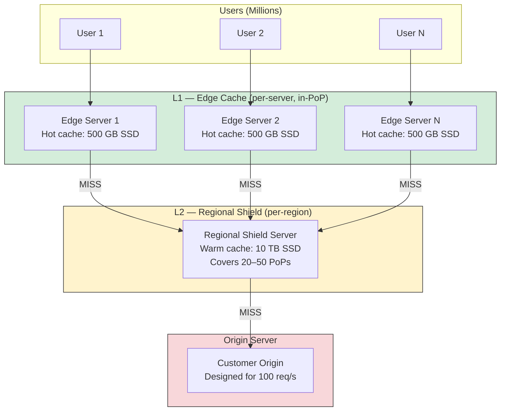
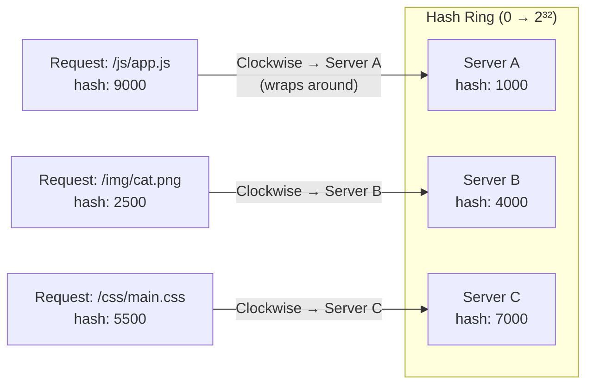
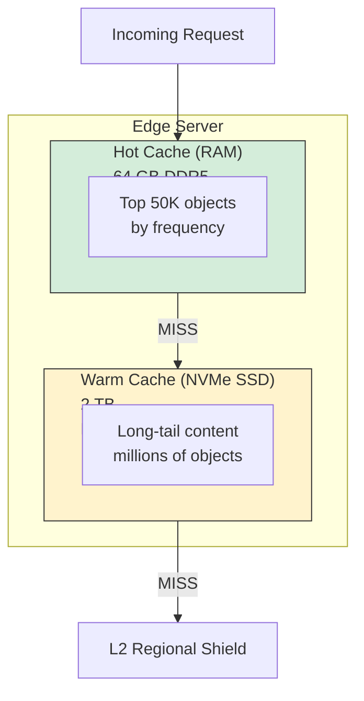

# 3. The Cache Hierarchy and Thundering Herds 🟡

> **The Problem:** Your CDN has 300 PoPs, each with 50 edge servers. A popular news article goes viral. Within one second, 1,000 users across Singapore request `cdn.example.com/article/breaking-news`. The asset's cache TTL just expired. Without careful design, all 1,000 requests stampede to the origin server simultaneously—a **thundering herd** that can bring down the origin. Meanwhile, each of your 15,000 edge servers worldwide independently decides the cache has expired and fires its own origin request: 15,000 simultaneous requests for the same file. The origin was designed for 100 req/s. It is now receiving 15,000.

---

## The Multi-Tier Cache Architecture

A flat cache (every edge server independently caches everything) wastes memory and multiplies origin load. A tiered architecture creates a funnel that dramatically reduces the number of requests reaching the origin.



### Cache Tier Comparison

| Property | L1 Edge Cache | L2 Regional Shield | Origin |
|---|---|---|---|
| Location | Same server as TLS termination | 1–3 per continent | Customer's data center |
| Latency (from L1) | 0 ms (local memory/SSD) | 5–30 ms (intra-region) | 50–200 ms (cross-region) |
| Storage per node | 500 GB – 2 TB SSD | 10–50 TB SSD | N/A |
| Hit ratio (typical) | 85–95% | 95–99% | N/A (always "hits") |
| Request volume | 10 M req/s (global) | ~500 K req/s | ~5 K req/s |
| Content | Hot tail (popular items) | Warm long tail | Full catalog |

The **multiplicative effect** of two tiers: if L1 has a 90% hit rate and L2 has a 95% hit rate on L1 misses, only **0.5%** of total requests reach the origin:

$$\text{Origin load} = (1 - 0.90) \times (1 - 0.95) = 0.10 \times 0.05 = 0.005 = 0.5\%$$

For 10 million req/s at the edge, the origin sees only **50,000 req/s**.

---

## Consistent Hashing: Routing Within a PoP

A PoP has 50 edge servers. If each server independently caches content, the same asset is duplicated 50 times, and the effective cache size is 1/50th of the total storage. **Consistent hashing** ensures each unique URL maps to exactly one server (or a small subset), maximizing the effective cache capacity.

### How Consistent Hashing Works

1. Hash each server's ID onto a ring (0 to 2³²-1).
2. Hash the request URL onto the same ring.
3. Walk clockwise from the URL's position to find the first server.
4. That server is the **cache owner** for this URL.



### Virtual Nodes for Balance

With only 3 physical servers, the hash ring is unbalanced—one server might own 60% of the key space. **Virtual nodes** solve this by mapping each physical server to 100–200 points on the ring:

```rust
use std::collections::BTreeMap;
use std::hash::{Hash, Hasher};
use std::collections::hash_map::DefaultHasher;

struct ConsistentHashRing {
    ring: BTreeMap<u64, String>,  // hash position → server ID
    virtual_nodes_per_server: usize,
}

impl ConsistentHashRing {
    fn new(virtual_nodes: usize) -> Self {
        Self {
            ring: BTreeMap::new(),
            virtual_nodes_per_server: virtual_nodes,
        }
    }

    /// Add a server with `virtual_nodes_per_server` positions on the ring.
    fn add_server(&mut self, server_id: &str) {
        for i in 0..self.virtual_nodes_per_server {
            let key = format!("{server_id}#vn{i}");
            let hash = self.hash(&key);
            self.ring.insert(hash, server_id.to_string());
        }
    }

    /// Remove a server and all its virtual nodes.
    fn remove_server(&mut self, server_id: &str) {
        self.ring.retain(|_, v| v != server_id);
    }

    /// Find the server responsible for this cache key.
    fn get_server(&self, cache_key: &str) -> Option<&str> {
        if self.ring.is_empty() {
            return None;
        }
        let hash = self.hash(cache_key);
        // Walk clockwise: find first entry >= hash, or wrap to the start
        let server = self.ring.range(hash..)
            .next()
            .or_else(|| self.ring.iter().next())
            .map(|(_, id)| id.as_str());
        server
    }

    fn hash(&self, key: &str) -> u64 {
        let mut hasher = DefaultHasher::new();
        key.hash(&mut hasher);
        hasher.finish()
    }
}
```

**Why consistent hashing matters for CDNs:** When server 17 fails, only the keys assigned to server 17 need to be remapped. With simple modulo hashing (`hash % N`), changing `N` remaps *every* key—causing a complete cache flush.

| Event | Consistent Hashing | Modulo Hashing |
|---|---|---|
| 1 server removed (50 → 49) | ~2% keys remapped | ~98% keys remapped |
| 1 server added (50 → 51) | ~2% keys remapped | ~98% keys remapped |
| 10 servers removed (50 → 40) | ~20% keys remapped | ~100% keys remapped |

---

## Request Coalescing: Taming the Thundering Herd

The most critical pattern in CDN cache design. When a cached object expires and 1,000 requests arrive simultaneously, **only one** request should fetch from the origin (or L2). The other 999 wait and share the result.

### The Problem in Detail

```mermaid
sequenceDiagram
    participant R1 as Request 1
    participant R2 as Request 2
    participant R3 as Request 1000
    participant Cache as Edge Cache
    participant Origin as Origin

    Note over R1,R3: Asset just expired — 1,000 requests arrive in <100ms

    rect rgb(255, 230, 230)
        Note over Cache: WITHOUT Request Coalescing
        R1->>Cache: GET /hero.jpg → MISS
        R2->>Cache: GET /hero.jpg → MISS
        R3->>Cache: GET /hero.jpg → MISS
        Cache->>Origin: GET /hero.jpg (×1000!)
        Note over Origin: Origin overloaded — 1000× expected load
    end

    rect rgb(230, 255, 230)
        Note over Cache: WITH Request Coalescing
        R1->>Cache: GET /hero.jpg → MISS (becomes "flight leader")
        R2->>Cache: GET /hero.jpg → MISS (coalesced — waits on R1)
        R3->>Cache: GET /hero.jpg → MISS (coalesced — waits on R1)
        Cache->>Origin: GET /hero.jpg (×1 only!)
        Origin->>Cache: 200 OK + hero.jpg
        Cache->>R1: 200 OK
        Cache->>R2: 200 OK (shared response)
        Cache->>R3: 200 OK (shared response)
    end
```



### Implementation: The "In-Flight" Map

The core data structure is a concurrent map from cache key to an in-flight request. The first request for a given key becomes the **flight leader**; subsequent requests subscribe to the leader's result.

```rust
use std::collections::HashMap;
use std::sync::Arc;
use tokio::sync::{Mutex, broadcast};

/// Response from origin, shared among coalesced requests.
#[derive(Clone, Debug)]
struct CachedResponse {
    status: u16,
    headers: Vec<(String, String)>,
    body: Arc<Vec<u8>>,
}

/// Tracks in-flight origin fetches to prevent thundering herds.
struct RequestCoalescer {
    /// Map from cache key to a broadcast sender.
    /// The flight leader holds the sender; waiters subscribe to it.
    in_flight: Mutex<HashMap<String, broadcast::Sender<CachedResponse>>>,
}

impl RequestCoalescer {
    fn new() -> Self {
        Self {
            in_flight: Mutex::new(HashMap::new()),
        }
    }

    /// Attempt to fetch a resource, coalescing with any in-flight request
    /// for the same cache key.
    async fn fetch_coalesced(
        &self,
        cache_key: &str,
        origin_fetch: impl AsyncOriginFetch,
    ) -> Result<CachedResponse, FetchError> {
        // Phase 1: Check if someone is already fetching this key.
        {
            let in_flight = self.in_flight.lock().await;
            if let Some(sender) = in_flight.get(cache_key) {
                // Another request is in flight — subscribe and wait.
                let mut receiver = sender.subscribe();
                drop(in_flight); // Release lock while waiting
                return receiver.recv().await.map_err(|_| FetchError::Cancelled);
            }
        }

        // Phase 2: We are the flight leader. Register ourselves.
        let (tx, _) = broadcast::channel(1);
        {
            let mut in_flight = self.in_flight.lock().await;
            in_flight.insert(cache_key.to_string(), tx.clone());
        }

        // Phase 3: Fetch from origin.
        let result = origin_fetch.fetch(cache_key).await;

        // Phase 4: Broadcast result to all waiters and clean up.
        {
            let mut in_flight = self.in_flight.lock().await;
            in_flight.remove(cache_key);
        }

        match result {
            Ok(response) => {
                // Broadcast to all waiting requests (ignore errors — no receivers is fine)
                let _ = tx.send(response.clone());
                Ok(response)
            }
            Err(e) => Err(e),
        }
    }
}

trait AsyncOriginFetch {
    async fn fetch(&self, cache_key: &str) -> Result<CachedResponse, FetchError>;
}

#[derive(Debug)]
enum FetchError {
    OriginError,
    Cancelled,
}
```

### Coalescing Across the Full Stack

Request coalescing should happen at **every tier**:

| Tier | Coalescing Scope | Effect |
|---|---|---|
| L1 Edge Server | Per-server | 1,000 concurrent requests → 1 fetch to L2 |
| L1 PoP (via consistent hashing) | Per-PoP | 50 edge servers → 1 server fetches from L2 |
| L2 Regional Shield | Per-region | 20 PoPs → 1 fetch to origin |
| **Net effect** | Global | 1,000,000 requests → 1 origin fetch |

---

## Cache Key Design

The cache key determines *what* is considered the same content. A poorly designed cache key either stores too many duplicates (wasting space) or incorrectly serves shared content to different users (a security bug).

### Standard Cache Key Components

```
cache_key = hash(
    scheme,          // "https"
    host,            // "cdn.example.com"
    path,            // "/assets/hero.jpg"
    sorted_query,    // "?size=large&v=42"
    vary_headers,    // Accept-Encoding: gzip
)
```

### What to Include (and Exclude)

| Component | Include? | Rationale |
|---|---|---|
| Scheme (HTTP/HTTPS) | ✅ Yes | Different content policies |
| Host header | ✅ Yes | CDN serves many domains |
| URL path | ✅ Yes | Obviously |
| Query string | ✅ Yes (sorted) | `/page?a=1&b=2` == `/page?b=2&a=1` |
| `Accept-Encoding` | ✅ Yes (via Vary) | gzip vs brotli are different byte streams |
| `Cookie` header | ❌ Usually No | Destroys hit rate — every user is unique |
| `User-Agent` | ❌ No | Too many variants; use `Vary: Accept` for content negotiation |
| Client IP | ❌ Never | per-user caching = no caching |

### Vary Header Handling

The HTTP `Vary` header tells the cache which request headers affect the response:

```
# Origin response:
Vary: Accept-Encoding

# This means:
#   GET /page (Accept-Encoding: gzip) → cache variant A
#   GET /page (Accept-Encoding: br)   → cache variant B
#   GET /page (no encoding)           → cache variant C
```

**CDN optimization:** Normalize the `Accept-Encoding` header before using it as a cache key component. Clients send wildly different strings (`gzip, deflate, br`, `br;q=1.0, gzip;q=0.8`, etc.) that all mean the same thing.

```rust
/// Normalize Accept-Encoding for cache key stability.
fn normalize_accept_encoding(raw: &str) -> &'static str {
    let lower = raw.to_lowercase();
    if lower.contains("br") {
        "br"           // Prefer Brotli
    } else if lower.contains("gzip") {
        "gzip"         // Fall back to gzip
    } else {
        "identity"     // No compression
    }
}
```

---

## Stale-While-Revalidate: Serving Stale Content During Refresh

Instead of blocking all requests while revalidating expired content, serve the stale cached version immediately and refresh in the background.

```
Cache-Control: max-age=60, stale-while-revalidate=300
```

This means:
- **0–60 seconds:** Serve from cache (fresh).
- **60–360 seconds:** Serve stale content immediately, trigger background revalidation.
- **360+ seconds:** Cache entry truly expired—block and fetch from origin.

### Timeline Comparison

| Time Since Cached | Without SWR | With SWR |
|---|---|---|
| t = 30s | Cache HIT (fresh) | Cache HIT (fresh) |
| t = 61s | Cache MISS → block → origin fetch (200ms) | Cache HIT (stale) + background refresh |
| t = 62s | Still waiting on origin... | Cache HIT (freshly revalidated!) |
| t = 361s | Cache MISS → block → origin fetch | Cache MISS → block → origin fetch |

```rust
use std::time::{Duration, Instant};

struct CacheEntry {
    response: CachedResponse,
    cached_at: Instant,
    max_age: Duration,
    stale_while_revalidate: Duration,
    /// Flag to prevent multiple simultaneous background revalidations.
    revalidation_in_progress: bool,
}

#[derive(Debug)]
enum CacheFreshness {
    Fresh,                       // Within max-age
    StaleButServeable,           // Within stale-while-revalidate window
    Expired,                     // Beyond all grace periods
}

impl CacheEntry {
    fn freshness(&self) -> CacheFreshness {
        let age = self.cached_at.elapsed();
        if age <= self.max_age {
            CacheFreshness::Fresh
        } else if age <= self.max_age + self.stale_while_revalidate {
            CacheFreshness::StaleButServeable
        } else {
            CacheFreshness::Expired
        }
    }
}

/// Serve request with stale-while-revalidate support.
async fn serve_with_swr(
    cache: &mut CacheEntry,
    origin: &impl AsyncOriginFetch,
    cache_key: &str,
) -> CachedResponse {
    match cache.freshness() {
        CacheFreshness::Fresh => {
            // Fast path — serve directly
            cache.response.clone()
        }
        CacheFreshness::StaleButServeable => {
            // Serve stale immediately
            let stale_response = cache.response.clone();

            // Trigger background revalidation (only once)
            if !cache.revalidation_in_progress {
                cache.revalidation_in_progress = true;
                let key = cache_key.to_string();
                tokio::spawn(async move {
                    // Fetch fresh content from origin and update cache
                    // (simplified — real implementation updates shared cache)
                    let _ = origin.fetch(&key).await;
                });
            }

            stale_response
        }
        CacheFreshness::Expired => {
            // Must block and fetch fresh content
            origin.fetch(cache_key).await.unwrap_or_else(|_| cache.response.clone())
        }
    }
}
```

---

## Cache Admission and Eviction Policies

Not all content should be cached. A 50 GB video file that is requested once should not evict thousands of popular 10 KB images.

### Admission Policy

| Strategy | Description | When to Use |
|---|---|---|
| **Cache-on-first-miss** | Cache everything on first request | Simple, high memory footprint |
| **Cache-on-second-hit** | Only cache after 2+ requests in a window | Filters one-time content |
| **Size threshold** | Skip objects > N MB | Prevent large objects from thrashing cache |
| **Content-type filter** | Only cache images, JS, CSS — skip HTML | Personalized HTML is uncacheable |

**Recommended combination for CDN L1:**

```
IF request_count >= 2 OR content_type IN (image/*, font/*, application/javascript)
AND response_size <= 50 MB
AND Cache-Control does NOT contain "no-store" or "private"
THEN admit to L1 cache
```

### Eviction: LRU vs LFU vs W-TinyLFU

| Algorithm | Hit Ratio | Memory Overhead | Scan Resistance |
|---|---|---|---|
| LRU (Least Recently Used) | Good | Low (doubly-linked list) | ❌ Poor (one scan evicts hot items) |
| LFU (Least Frequently Used) | Better | Medium (frequency counters) | ✅ Good (frequency protects hot items) |
| **W-TinyLFU** | Best | Low (Count-Min Sketch) | ✅ Excellent |

**W-TinyLFU** (used by Caffeine/Java, adaptable to Rust) combines:
1. A **window LRU** (1% of cache) that admits new items temporarily.
2. A **frequency sketch** (Count-Min Sketch) that estimates access frequency with minimal memory.
3. A **main segmented LRU** (99% of cache) that only admits items from the window if they have higher estimated frequency than the eviction candidate.

```rust
/// Simplified W-TinyLFU admission decision.
struct TinyLFU {
    /// Count-Min Sketch for frequency estimation.
    /// Uses 4 hash functions and a compact counter array.
    counters: Vec<Vec<u8>>,  // [4 rows][width columns]
    width: usize,
}

impl TinyLFU {
    fn estimate_frequency(&self, key_hash: u64) -> u8 {
        // Return the minimum counter across all 4 rows (Count-Min Sketch)
        self.counters.iter().enumerate().map(|(i, row)| {
            let idx = ((key_hash.wrapping_mul(i as u64 + 1)) as usize) % self.width;
            row[idx]
        }).min().unwrap_or(0)
    }

    fn increment(&mut self, key_hash: u64) {
        for (i, row) in self.counters.iter_mut().enumerate() {
            let idx = ((key_hash.wrapping_mul(i as u64 + 1)) as usize) % self.width;
            row[idx] = row[idx].saturating_add(1);
        }
    }

    /// Should we admit `candidate` (new item) by evicting `victim` (existing)?
    fn should_admit(&self, candidate_hash: u64, victim_hash: u64) -> bool {
        self.estimate_frequency(candidate_hash) > self.estimate_frequency(victim_hash)
    }
}
```

---

## Negative Caching: Caching Errors

If the origin returns a `404 Not Found` or `503 Service Unavailable`, should we cache that response? **Yes—briefly.** Without negative caching, a missing file generates an origin request on *every* single user request.

| Status Code | Cache? | TTL | Rationale |
|---|---|---|---|
| `200 OK` | ✅ | Per Cache-Control | Standard |
| `301 Moved Permanently` | ✅ | Long (1 hour+) | Permanent redirect |
| `302/307 Temporary Redirect` | ⚠️ | Short (30s) | May change |
| `404 Not Found` | ✅ | Short (30–60s) | Prevent origin hammering |
| `429 Too Many Requests` | ✅ | Short (10–30s) | Origin is overloaded |
| `500 Internal Server Error` | ❌ | No | May be transient |
| `502/503/504` | ✅ | Very short (5–10s) | Reduce origin load during outage |

---

## Cache Storage Engine: Memory vs SSD

Edge servers use a two-level local cache:



| Property | RAM Cache | SSD Cache |
|---|---|---|
| Capacity | 64–256 GB | 1–8 TB |
| Read latency | < 1 µs | ~50–100 µs |
| Items stored | ~50K–500K (hot head) | Millions (long tail) |
| Eviction | W-TinyLFU | LRU (less critical) |
| Durability | Lost on restart | Survives restart |

### SSD-Friendly Cache Layout

Random small reads kill SSD performance. Optimize with:

1. **Object packing:** Store small objects (< 64 KB) contiguously in larger blocks. Read the entire block and extract the target object.
2. **Alignment:** Align objects to 4 KB boundaries (SSD page size) to avoid read amplification.
3. **Separation by size:** Small objects in packed blocks, large objects (> 1 MB) get individual files.
4. **Avoid small random writes:** Batch cache insertions and write in 2 MB chunks.

```rust
/// SSD cache block layout for small objects.
/// Each block is 2 MB and contains multiple packed objects.
struct CacheBlock {
    /// Block header: bitmap of occupied slots + index of contained objects.
    header: BlockHeader,
    /// Packed object data — variable length, 4KB-aligned.
    data: [u8; 2 * 1024 * 1024],
}

struct BlockHeader {
    /// Number of objects in this block.
    count: u32,
    /// Index: cache_key_hash → (offset_in_block, length)
    index: Vec<(u64, u32, u32)>,
}
```

---

## Monitoring Cache Performance

| Metric | Formula | Target | Alert |
|---|---|---|---|
| L1 hit ratio | `L1_hits / total_requests` | ≥ 90% | < 85% |
| L2 hit ratio | `L2_hits / L1_misses` | ≥ 95% | < 90% |
| Origin req/s | `L2_misses` | ≤ 5K/s | > 10K/s |
| Coalescing ratio | `coalesced / total_misses` | ≥ 50% for popular content | < 20% |
| Eviction rate | `evictions_per_second` | Stable | Spike = cache thrashing |
| Stale serve rate | `SWR_serves / total_serves` | < 5% | > 15% |
| p99 cache read latency | Histogram | < 1 ms (RAM), < 5 ms (SSD) | > 10 ms |

---

> **Key Takeaways**
>
> 1. **Two cache tiers reduce origin load by 99.5%.** L1 (edge) catches 90%, L2 (regional shield) catches 95% of the remainder. The origin sees only 0.5% of total traffic.
> 2. **Consistent hashing maximizes effective cache size.** Within a PoP, route each URL to exactly one server. When a server fails, only ~2% of keys remap (vs. 98% with modulo hashing).
> 3. **Request coalescing is non-negotiable.** Without it, a thundering herd of 1,000 simultaneous requests for an expired asset generates 1,000 origin fetches. With it: exactly one.
> 4. **Coalesce at every tier.** Per-server, per-PoP (via consistent hashing), and per-region (at L2). The global multiplication factor goes from millions to one.
> 5. **Stale-while-revalidate eliminates blocking on expired content.** Serve stale immediately, refresh in the background. Users never see latency spikes at TTL boundaries.
> 6. **Cache admission matters as much as eviction.** Cache-on-second-hit filters one-shot content. Size thresholds prevent large objects from thrashing. W-TinyLFU gives the best hit ratio with minimal memory overhead.
> 7. **Normalize cache keys aggressively.** Sort query parameters, normalize `Accept-Encoding`, and never include per-user data (cookies, IPs) unless explicitly configured.
