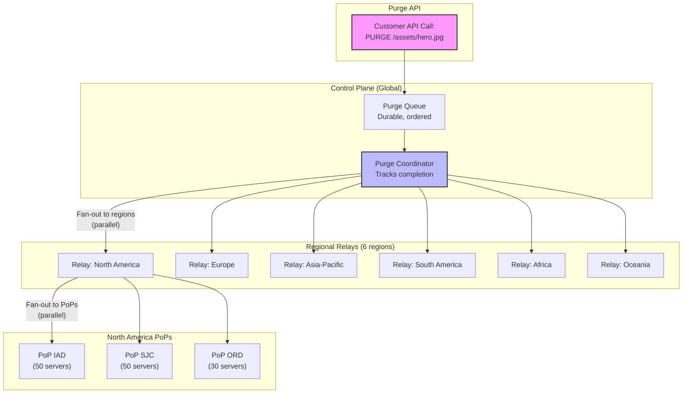
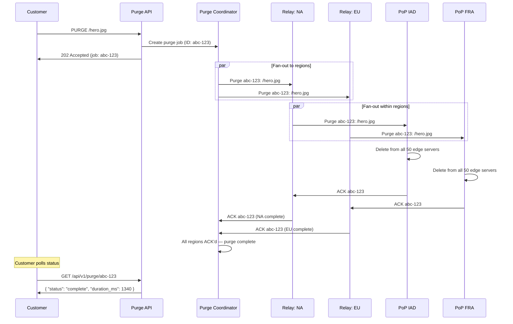
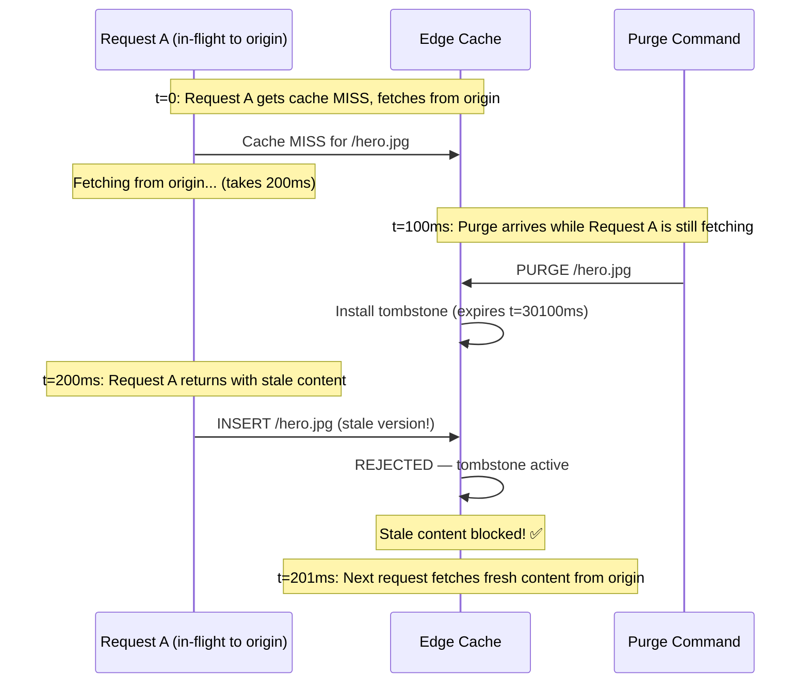
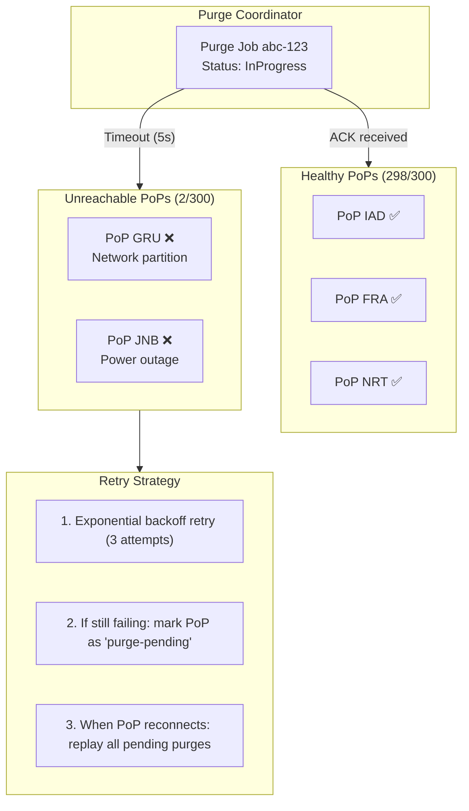

# 4. Cache Invalidation (The Hardest Problem) 🔴

> **The Problem:** Your customer published a breaking news article with a factual error. They need it replaced *now*—not in 60 seconds when the TTL expires, not after some DNS propagation delay. They need every cached copy, across 300 PoPs and 15,000 edge servers worldwide, purged in under 2 seconds. And when they purge, they need a guarantee: no user anywhere on earth will receive the stale content after the purge completes. This is the problem Phil Karlton called one of the two hardest things in computer science.

---

## Why Cache Invalidation Is Hard

The fundamental tension: **caching exists to avoid coordination**, but **invalidation requires global coordination**. Every design choice in Chapters 1–3 optimized for independence—each PoP operates autonomously, each edge server makes local decisions. Now we must impose a globally consistent state change across 15,000 independent caches in under 2 seconds.

| Challenge | Why It's Hard |
|---|---|
| Scale | 300 PoPs × 50 servers = 15,000 caches to invalidate |
| Latency | 2-second SLA for global purge |
| Consistency | No stale content served after purge acknowledgment |
| Reliability | Must work even if PoPs are partitioned or degraded |
| Throughput | Must handle 10,000+ purge requests per minute |
| Wildcards | `purge /images/*` must invalidate millions of keys |

---

## The Three Invalidation Strategies

Before diving into the purge pipeline, understand the three fundamental approaches to cache invalidation:

### Strategy Comparison

| Strategy | Mechanism | Latency | Complexity | Best For |
|---|---|---|---|---|
| **TTL Expiration** | Content expires after `max-age` | TTL duration (seconds–hours) | None | Predictable content lifecycle |
| **Versioned URLs** | Change URL when content changes | 0 (new URL = cache miss) | Build pipeline | Static assets (JS, CSS, images) |
| **Active Purge** | Explicitly delete from all caches | < 2 seconds | High (this chapter) | Breaking news, legal takedown, security |

### 1. TTL Expiration (Passive)

The simplest approach: set `Cache-Control: max-age=60` and wait. After 60 seconds, caches revalidate. No coordination needed.

**Limitation:** You cannot force content to expire faster than the TTL. If you set `max-age=3600` and discover a security vulnerability in a JavaScript file, users will serve the vulnerable version for up to an hour.

### 2. Versioned URLs (Content-Addressable)

Embed a version identifier in the URL:

```
/assets/app.a1b2c3d4.js     ← hash of file contents
/assets/hero.v42.jpg          ← version counter
```

Set `Cache-Control: max-age=31536000, immutable` (cache forever). When content changes, the HTML references a new URL. The old URL is never requested again—no invalidation needed.

**Limitation:** Only works for assets referenced from HTML/CSS. Doesn't work for the HTML itself, API responses, or any URL that users bookmark or link to directly.

### 3. Active Purge (This Chapter's Focus)

Explicitly command every cache to delete a specific key (or pattern). Required when:
- Content must be updated faster than the TTL allows.
- Legal/compliance takedowns (DMCA, GDPR right to erasure).
- Security incidents (compromised assets).
- Editorial corrections (news articles, pricing errors).

---

## The Purge Fan-Out Architecture

Active purge requires a **fan-out tree** that propagates invalidation commands from a single API call to every edge server in under 2 seconds.



### The Three-Level Fan-Out

| Level | Count | Fan-Out | Latency Budget |
|---|---|---|---|
| **Global** → Regional Relays | 1 → 6 | 6× | ~200 ms (cross-continent) |
| **Regional** → PoPs | 6 → 300 | ~50× per region | ~100 ms (intra-region) |
| **PoP** → Edge Servers | 300 → 15,000 | ~50× per PoP | ~50 ms (intra-PoP, local network) |

**Total propagation time:** ~350 ms for the command to reach every edge server. Add ~100 ms for cache lookup and deletion, plus ~200 ms for acknowledgment rollup. **Well under 2 seconds.**

---

## The Purge API

The customer-facing purge API must be simple, idempotent, and auditable.

### API Design

```
POST /api/v1/purge
Authorization: Bearer <token>
Content-Type: application/json

{
    "type": "exact",                          // or "prefix", "wildcard", "tag"
    "targets": [
        "https://cdn.example.com/assets/hero.jpg",
        "https://cdn.example.com/assets/logo.png"
    ]
}
```

### Purge Types

| Type | Example | What It Invalidates | Performance |
|---|---|---|---|
| **Exact** | `/assets/hero.jpg` | One specific cache key | O(1) per server |
| **Prefix** | `/assets/images/` | All keys starting with prefix | O(N) scan or prefix tree |
| **Wildcard** | `/assets/*.jpg` | Pattern-matched keys | O(N) scan |
| **Tag/Surrogate-Key** | `tag:product-123` | All objects tagged with this key | O(1) index lookup |

### Surrogate Keys: The Scalable Approach

Instead of purging by URL pattern (which requires scanning), tag assets with **surrogate keys** at cache time:

```
# Origin response:
HTTP/1.1 200 OK
Cache-Control: max-age=3600
Surrogate-Key: product-123 category-electronics homepage
Content-Type: text/html
```

Now the customer can purge all content related to `product-123` with a single API call—regardless of URL structure:

```
POST /api/v1/purge
{ "type": "tag", "targets": ["product-123"] }
```

This invalidates every cached object carrying the `product-123` surrogate key: the product page, its images, the category listing that includes it, and the homepage snippet.

```rust
use std::collections::{HashMap, HashSet};
use std::sync::Arc;
use tokio::sync::RwLock;

/// Surrogate key index: maps tags to the set of cache keys tagged with them.
struct SurrogateKeyIndex {
    /// tag → set of cache keys
    tag_to_keys: Arc<RwLock<HashMap<String, HashSet<String>>>>,
    /// cache_key → set of tags (for cleanup on eviction)
    key_to_tags: Arc<RwLock<HashMap<String, HashSet<String>>>>,
}

impl SurrogateKeyIndex {
    /// Called when storing a new object in the cache.
    async fn index(&self, cache_key: &str, surrogate_keys: &[String]) {
        let mut t2k = self.tag_to_keys.write().await;
        let mut k2t = self.key_to_tags.write().await;

        for tag in surrogate_keys {
            t2k.entry(tag.clone())
                .or_default()
                .insert(cache_key.to_string());
        }
        k2t.insert(
            cache_key.to_string(),
            surrogate_keys.iter().cloned().collect(),
        );
    }

    /// Purge by surrogate key — returns all cache keys to invalidate.
    async fn purge_by_tag(&self, tag: &str) -> Vec<String> {
        let mut t2k = self.tag_to_keys.write().await;
        let mut k2t = self.key_to_tags.write().await;

        let keys = t2k.remove(tag).unwrap_or_default();

        // Clean up reverse index
        for key in &keys {
            if let Some(tags) = k2t.get_mut(key) {
                tags.remove(tag);
                if tags.is_empty() {
                    k2t.remove(key);
                }
            }
        }

        keys.into_iter().collect()
    }

    /// Called when an object is evicted from cache (cleanup index).
    async fn remove(&self, cache_key: &str) {
        let mut t2k = self.tag_to_keys.write().await;
        let mut k2t = self.key_to_tags.write().await;

        if let Some(tags) = k2t.remove(cache_key) {
            for tag in tags {
                if let Some(keys) = t2k.get_mut(&tag) {
                    keys.remove(cache_key);
                    if keys.is_empty() {
                        t2k.remove(&tag);
                    }
                }
            }
        }
    }
}
```

---

## The Purge Coordinator: Tracking Global Completion

The purge coordinator is responsible for:
1. Assigning a unique ID to each purge request.
2. Fanning out to all regional relays in parallel.
3. Collecting acknowledgments from every PoP.
4. Declaring the purge "complete" only when every PoP has confirmed.
5. Timing out and retrying if a PoP doesn't respond.



### Purge Job State Machine

```rust
use std::collections::HashSet;
use std::time::Instant;

#[derive(Debug, Clone, PartialEq, Eq)]
enum PurgeStatus {
    Pending,            // Created, not yet fanned out
    InProgress,         // Fanned out, waiting for ACKs
    Complete,           // All PoPs acknowledged
    PartialFailure,     // Some PoPs failed — retrying
    Failed,             // Retry budget exhausted
}

struct PurgeJob {
    id: String,
    target: PurgeTarget,
    status: PurgeStatus,
    created_at: Instant,
    /// PoPs that have acknowledged the purge.
    acked_pops: HashSet<String>,
    /// Total number of PoPs that must acknowledge.
    total_pops: usize,
    /// Number of retry attempts for failed PoPs.
    retry_count: u32,
    max_retries: u32,
}

enum PurgeTarget {
    Exact(Vec<String>),
    Prefix(String),
    Wildcard(String),
    Tag(Vec<String>),
}

impl PurgeJob {
    fn receive_ack(&mut self, pop_id: &str) {
        self.acked_pops.insert(pop_id.to_string());
        if self.acked_pops.len() == self.total_pops {
            self.status = PurgeStatus::Complete;
        }
    }

    fn pending_pops(&self, all_pops: &[String]) -> Vec<String> {
        all_pops.iter()
            .filter(|p| !self.acked_pops.contains(*p))
            .cloned()
            .collect()
    }

    fn is_timed_out(&self, timeout: std::time::Duration) -> bool {
        self.created_at.elapsed() > timeout
    }
}
```

---

## Soft Purge vs Hard Purge

Two flavors of invalidation with different trade-offs:

| Property | Hard Purge | Soft Purge |
|---|---|---|
| Action | Delete cached object entirely | Mark as stale (force revalidation) |
| Cache miss on next request? | ✅ Yes — must fetch from origin | ❌ No — serves stale while revalidating |
| Origin load spike? | ✅ Yes (thundering herd risk) | ❌ Minimal (background revalidate) |
| Guarantee of fresh content? | ✅ Immediate | ⚠️ Brief stale window (~100ms) |
| Use case | Security incident, legal takedown | Content update, editorial correction |

### Soft Purge Implementation

A soft purge doesn't delete the cache entry—it sets the entry's TTL to 0, triggering `stale-while-revalidate` behavior (Chapter 3). The next request serves the stale content immediately and revalidates in the background.

```rust
use std::time::Instant;

struct CacheEntry {
    response: Vec<u8>,
    headers: Vec<(String, String)>,
    cached_at: Instant,
    max_age: std::time::Duration,
    stale_while_revalidate: std::time::Duration,
    /// Set to true by a soft purge — forces revalidation on next access.
    force_revalidate: bool,
}

enum PurgeMode {
    /// Delete the entry entirely — next request is a cold miss.
    Hard,
    /// Mark as stale — next request serves stale + revalidates in background.
    Soft,
}

fn execute_purge(cache: &mut HashMap<String, CacheEntry>, key: &str, mode: PurgeMode) {
    match mode {
        PurgeMode::Hard => {
            cache.remove(key);
        }
        PurgeMode::Soft => {
            if let Some(entry) = cache.get_mut(key) {
                entry.force_revalidate = true;
            }
        }
    }
}

use std::collections::HashMap;
```

---

## Wildcard Purge: The Performance Trap

Exact purges are O(1)—look up the key, delete it. Wildcard purges (`/images/*.jpg`) are O(N)—you must scan every key in the cache to check for matches.

### Approaches to Wildcard Purge

| Approach | Time Complexity | Space Overhead | Latency |
|---|---|---|---|
| Full scan | O(N) per server | None | Slow for large caches (millions of keys) |
| Prefix trie index | O(K) where K = keys matching prefix | O(N) extra for trie | Fast for prefix matches |
| Surrogate keys (recommended) | O(1) lookup + O(M) delete | O(N) extra for index | Fast and predictable |
| Bloom filter pre-check | O(1) check, O(N) scan if positive | Small (bits per key) | Avoids unnecessary scans |

**Recommendation:** Avoid wildcard purge patterns entirely. Use **surrogate keys** instead. Tag every asset at cache time, and purge by tag. This converts an O(N) scan into an O(1) index lookup.

```
# Instead of:
PURGE /products/shoes/*.jpg     ← O(N) scan, slow

# Do this at cache time:
Surrogate-Key: product-shoes product-shoes-images

# Then purge:
PURGE tag:product-shoes-images  ← O(1) index lookup
```

---

## Consistency Guarantees: Read-After-Purge

The most dangerous consistency bug: a customer issues a purge, receives confirmation, then a user *still* receives stale content. This happens when:

1. A purge command arrives at an edge server.
2. The server deletes the cache entry.
3. A coalesced request (from before the purge) completes and *re-inserts* the stale content.

### The Purge Tombstone

To prevent read-after-purge violations, insert a **tombstone** instead of simply deleting:

```rust
use std::time::{Duration, Instant};

enum CacheValue {
    /// Normal cached content.
    Present(CacheEntry),
    /// Purge tombstone — reject any insertion of this key until expiry.
    Tombstone { purge_id: String, expires_at: Instant },
}

struct Cache {
    entries: HashMap<String, CacheValue>,
}

impl Cache {
    /// Execute a purge: replace entry with a tombstone.
    fn purge(&mut self, key: &str, purge_id: &str) {
        self.entries.insert(key.to_string(), CacheValue::Tombstone {
            purge_id: purge_id.to_string(),
            // Tombstone lives for 30 seconds — long enough for any in-flight
            // request to complete without re-inserting stale data.
            expires_at: Instant::now() + Duration::from_secs(30),
        });
    }

    /// Attempt to insert a cache entry. Rejected if a tombstone exists.
    fn insert(&mut self, key: &str, entry: CacheEntry) -> bool {
        match self.entries.get(key) {
            Some(CacheValue::Tombstone { expires_at, .. }) => {
                if Instant::now() < *expires_at {
                    // Tombstone still active — reject insertion of stale data
                    return false;
                }
                // Tombstone expired — allow insertion
                self.entries.insert(key.to_string(), CacheValue::Present(entry));
                true
            }
            _ => {
                self.entries.insert(key.to_string(), CacheValue::Present(entry));
                true
            }
        }
    }

    /// Look up a cache entry. Tombstones are treated as misses.
    fn get(&self, key: &str) -> Option<&CacheEntry> {
        match self.entries.get(key) {
            Some(CacheValue::Present(entry)) => Some(entry),
            _ => None,
        }
    }
}

use std::collections::HashMap;
```

### The Purge-Before-Fill Ordering Guarantee



---

## Purge Reliability: Handling Failures

### What Happens When a PoP Is Unreachable?



### The Purge Ledger

Every PoP maintains a **purge ledger**—a monotonically increasing sequence number of purge commands it has processed. When a PoP recovers from an outage, it reports its last-seen sequence number. The coordinator replays all purges since that point.

```rust
/// Coordinator-side purge tracking per PoP.
struct PopPurgeState {
    pop_id: String,
    /// Last purge sequence number acknowledged by this PoP.
    last_acked_seq: u64,
    /// Is this PoP currently reachable?
    reachable: bool,
    /// Pending purges (not yet acknowledged).
    pending: Vec<PurgeCommand>,
}

struct PurgeCommand {
    seq: u64,
    target: PurgeTarget,
    mode: PurgeMode,
    issued_at: Instant,
}

impl PopPurgeState {
    /// Called when a PoP reconnects after an outage.
    fn on_reconnect(&mut self, pop_last_seq: u64, all_purges: &[PurgeCommand]) {
        self.reachable = true;
        // Replay all purges the PoP missed
        self.pending = all_purges.iter()
            .filter(|p| p.seq > pop_last_seq)
            .cloned()
            .collect();
    }
}

use std::time::Instant;
```

---

## Purge at Scale: Performance Optimization

### Batching

Purge commands issued within a short window (e.g., 50 ms) are batched into a single fan-out message. This reduces network overhead when a customer issues 1,000 individual purge calls in rapid succession.

```rust
use std::time::Duration;
use tokio::time;

struct PurgeBatcher {
    /// Accumulate purge targets during the batch window.
    pending: Vec<PurgeTarget>,
    /// Batch window duration.
    window: Duration,
}

impl PurgeBatcher {
    async fn add_and_maybe_flush(
        &mut self,
        target: PurgeTarget,
        flush_fn: impl AsyncFlush,
    ) {
        self.pending.push(target);

        // If this is the first item, start the batch timer
        if self.pending.len() == 1 {
            time::sleep(self.window).await;
        }

        // Flush the entire batch
        if !self.pending.is_empty() {
            let batch = std::mem::take(&mut self.pending);
            flush_fn.flush(batch).await;
        }
    }
}

trait AsyncFlush {
    async fn flush(&self, targets: Vec<PurgeTarget>);
}
```

### Compression

A purge message containing 10,000 URL strings can be large. Compress the payload with zstd before transmitting to regional relays—URLs have high redundancy (shared domain prefixes) and compress well.

---

## Versioned URLs vs Active Purge: When to Use Each

| Scenario | Versioned URLs | Active Purge |
|---|---|---|
| Static assets (JS, CSS, fonts) | ✅ Best — `app.a1b2c3.js` | Unnecessary |
| Images with stable URLs | ❌ Users bookmark URLs | ✅ Purge when updated |
| API responses | ❌ URLs are dynamic | ✅ Purge by surrogate key |
| HTML pages | ❌ SEO requires stable URLs | ✅ Purge on publish |
| Legal/DMCA takedown | ❌ Cannot change past URLs | ✅ Immediate purge |
| Security incident | ❌ Cannot change URLs fast enough | ✅ Emergency purge |
| Price change on e-commerce | ❌ URLs are stable | ✅ Purge by product tag |

**The pragmatic answer:** Use versioned URLs for static assets (set `immutable, max-age=1y`). Use active purge for everything else (set `max-age=60, stale-while-revalidate=300` as a safety net, and purge actively when content changes).

---

## Monitoring and Alerting

| Metric | Target | Alert |
|---|---|---|
| Purge P50 latency (global complete) | < 1 second | > 2 seconds |
| Purge P99 latency (global complete) | < 2 seconds | > 5 seconds |
| Purge failure rate | < 0.01% | > 0.1% |
| Purge backlog (pending jobs) | < 100 | > 1,000 |
| PoPs with pending purges | 0 | > 0 for > 5 minutes |
| Tombstone eviction rate | N/A | Tombstones never expire (bug) |
| Stale content served after purge | 0 | > 0 (read-after-purge violation) |

---

> **Key Takeaways**
>
> 1. **The three invalidation strategies are complementary.** Use TTL for predictable content lifecycles, versioned URLs for static assets, and active purge for everything else.
> 2. **A three-level fan-out (global → regional → PoP) delivers sub-2-second global purge.** Each level adds ~100–200 ms; the total propagation fits well within the 2-second SLA.
> 3. **Surrogate keys are the scalable alternative to wildcard purges.** Tag assets at cache time and purge by tag. O(1) index lookup beats O(N) scan of millions of keys.
> 4. **Tombstones prevent read-after-purge violations.** After purging a key, insert a short-lived tombstone that blocks re-insertion of stale content from in-flight requests.
> 5. **Soft purge reduces origin load.** Instead of deleting (which causes a thundering herd on re-fetch), mark as stale and let `stale-while-revalidate` handle the refresh gracefully.
> 6. **The purge ledger handles PoP failures.** Each PoP tracks a monotonic sequence number. After an outage, the coordinator replays missed purges—no stale content survives.
> 7. **Batch purge commands.** Accumulate requests within a 50 ms window and fan out once, reducing network overhead for burst purge patterns.
