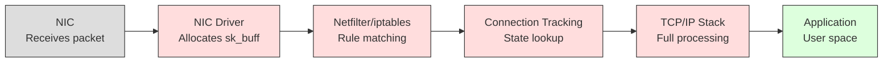
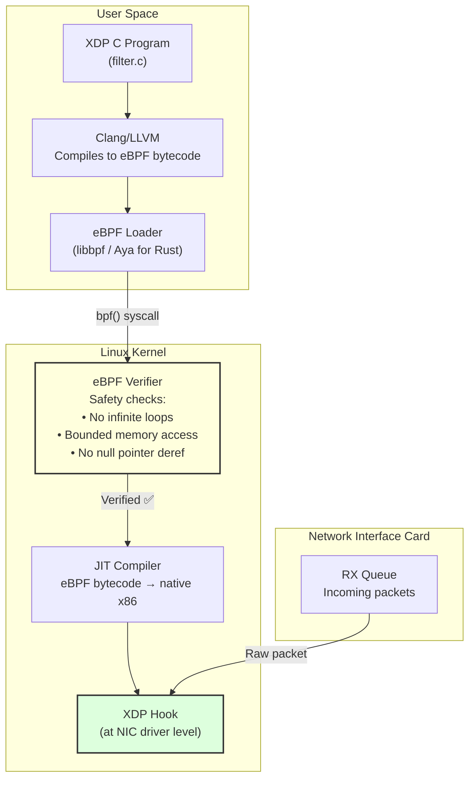
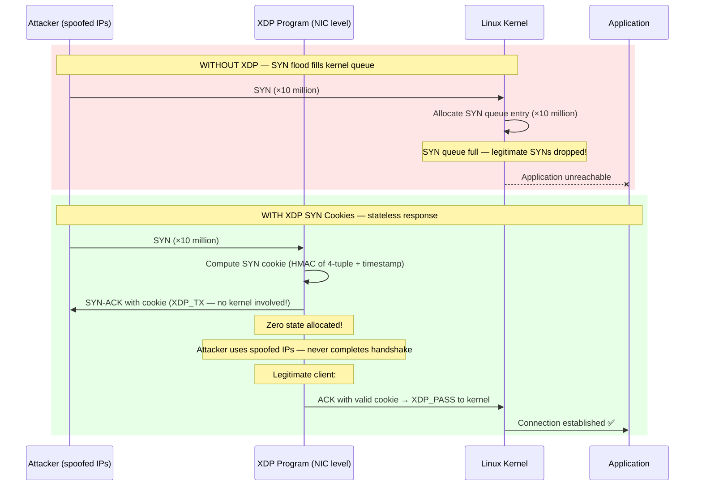
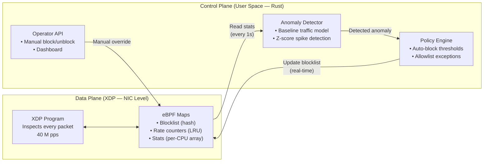
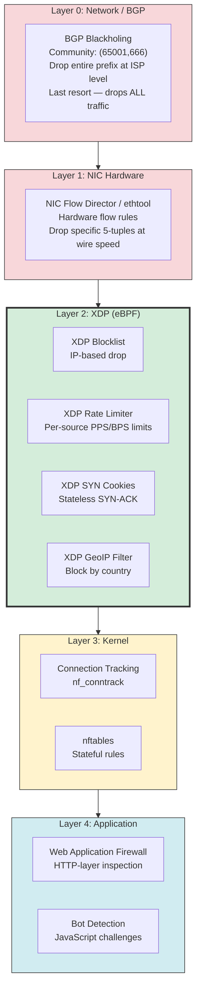

# 5. Volumetric DDoS Mitigation with eBPF 🔴

> **The Problem:** It's 2 AM. Your monitoring dashboard turns red. Incoming traffic at your Frankfurt PoP spikes from 50 Gbps to 900 Gbps in under 30 seconds. A botnet of 500,000 compromised IoT devices is flooding your anycast prefix with a mix of UDP amplification, SYN floods, and DNS reflection attacks. Your edge servers have 100 Gbps NICs each. The aggregate attack exceeds 1 Terabit per second. The Linux kernel's network stack—designed for generality, not defense—can process about 1–3 million packets per second with `iptables`. The attack is generating **100 million packets per second** per server. You need to drop 99% of those packets before the kernel even sees them.

---

## Why Traditional Firewalls Fail at Scale

The Linux kernel network stack was designed for correctness and generality, not for dropping 100 million packets per second. Every packet that enters the kernel traverses a deep processing pipeline:



Every red box is CPU work. For **every single packet**, the kernel:

1. **Allocates an `sk_buff`** (socket buffer) — a ~240-byte structure with metadata (`~100 ns`).
2. **Traverses Netfilter hooks** — walks chains of iptables rules linearly (`~500 ns` for 100 rules).
3. **Connection tracking** — hash table lookup to maintain state (`~200 ns`).
4. **IP/TCP processing** — checksum validation, routing lookup, options parsing.
5. **Context switches** to user space — if the packet reaches the application.

| Component | Cost per Packet | At 100 M pps |
|---|---|---|
| `sk_buff` allocation | ~100 ns | 10 seconds of CPU per second |
| `iptables` (100 rules) | ~500 ns | 50 seconds of CPU per second |
| Connection tracking | ~200 ns | 20 seconds of CPU per second |
| **Total kernel overhead** | **~1–2 µs** | **100–200 CPU-seconds per second** |

A server with 64 CPU cores has 64 CPU-seconds per second. Processing 100 M pps through iptables requires **100+ CPU-seconds per second**—more than the server has. The firewall itself becomes the bottleneck. **The server freezes.**

### The Performance Hierarchy

```
Standard iptables:          ~1–3 M pps    (kernel network stack)
nftables (optimized):       ~3–5 M pps    (improved kernel path)
                            ─────────────── kernel boundary ───────────────
XDP (eBPF):                 ~20–40 M pps  (driver level, no sk_buff)
DPDK (kernel bypass):       ~50–100 M pps (full kernel bypass, user-space driver)
Hardware offload (SmartNIC): ~100+ M pps   (packet processing on NIC ASIC)
```

**XDP is the sweet spot for CDN DDoS mitigation:** 10–40× faster than iptables, runs in the kernel (no special hardware), programmable in C/Rust, and doesn't require a full kernel bypass like DPDK.

---

## eBPF and XDP: The Architecture

### eBPF in 60 Seconds

eBPF (extended Berkeley Packet Filter) is a **sandboxed virtual machine inside the Linux kernel**. It allows loading custom programs that run at specific kernel hook points—without modifying the kernel itself or loading kernel modules.



**Key eBPF safety guarantees:**
- **No infinite loops:** The verifier proves that all loops are bounded.
- **Bounded memory access:** Cannot read/write arbitrary kernel memory.
- **No blocking:** eBPF programs cannot sleep, allocate memory, or call most kernel functions.
- **Limited program size:** 1 million verified instructions (as of kernel 5.2+).

### XDP: eXpress Data Path

XDP is an eBPF hook point at the **earliest possible stage** of packet processing—inside the NIC driver, before the kernel allocates an `sk_buff`. An XDP program receives a raw packet buffer and returns one of three verdicts:

| Verdict | Action | Use Case |
|---|---|---|
| `XDP_DROP` | Drop the packet silently | Malicious traffic, DDoS |
| `XDP_PASS` | Send to normal kernel stack | Legitimate traffic |
| `XDP_TX` | Send back out the same NIC | SYN cookies, DNS reflection response |
| `XDP_REDIRECT` | Forward to another NIC/CPU | Load balancing |
| `XDP_ABORTED` | Drop + trace error | Debugging |

### XDP Modes

| Mode | Speed | Requirements |
|---|---|---|
| **Native XDP** (`XDP_DRV`) | Fastest (~40 M pps) | NIC driver support (Intel, Mellanox) |
| **Offloaded XDP** (`XDP_HW`) | Wire speed (~100+ M pps) | SmartNIC hardware (Netronome) |
| **Generic XDP** (`XDP_SKB`) | Slow (~5–10 M pps) | Any NIC (development only) |

---

## Writing an XDP DDoS Filter

### Program 1: Dropping Known-Bad Source IPs

The simplest XDP filter: maintain a hash map (eBPF map) of blocked IPs. Drop any packet from a blocked source.

**Standard iptables (slow):**

```bash
# Adding 10,000 blocked IPs to iptables — O(N) per packet!
for ip in $(cat blocked_ips.txt); do
    iptables -A INPUT -s "$ip" -j DROP
done
# Every packet walks ALL 10,000 rules linearly.
```

**eBPF/XDP bypass (fast):**

```c
// xdp_blocklist.c — XDP program for IP blocklist
#include <linux/bpf.h>
#include <linux/if_ether.h>
#include <linux/ip.h>
#include <bpf/bpf_helpers.h>

// eBPF hash map: blocked source IPs → drop count
struct {
    __uint(type, BPF_MAP_TYPE_HASH);
    __uint(max_entries, 1000000);      // 1 million blocked IPs
    __type(key, __u32);                // IPv4 address (4 bytes)
    __type(value, __u64);              // Drop counter
} blocked_ips SEC(".maps");

SEC("xdp")
int xdp_blocklist(struct xdp_md *ctx) {
    void *data = (void *)(long)ctx->data;
    void *data_end = (void *)(long)ctx->data_end;

    // Parse Ethernet header
    struct ethhdr *eth = data;
    if ((void *)(eth + 1) > data_end)
        return XDP_PASS;

    // Only process IPv4
    if (eth->h_proto != __constant_htons(ETH_P_IP))
        return XDP_PASS;

    // Parse IP header
    struct iphdr *ip = (void *)(eth + 1);
    if ((void *)(ip + 1) > data_end)
        return XDP_PASS;

    // Look up source IP in blocked list — O(1) hash lookup!
    __u32 src_ip = ip->saddr;
    __u64 *drop_count = bpf_map_lookup_elem(&blocked_ips, &src_ip);

    if (drop_count) {
        // IP is in blocklist — drop and increment counter
        __sync_fetch_and_add(drop_count, 1);
        return XDP_DROP;
    }

    // IP not blocked — pass to kernel
    return XDP_PASS;
}

char _license[] SEC("license") = "GPL";
```

**Performance comparison:**

| Method | Lookup Complexity | At 1 M Blocked IPs | Throughput |
|---|---|---|---|
| `iptables` linear chain | O(N) per packet | ~1 ms per packet | ~1 K pps |
| `ipset` hash | O(1) per packet | ~500 ns per packet | ~2 M pps |
| **XDP eBPF map** | **O(1) per packet** | **~50 ns per packet** | **~40 M pps** |

---

### Program 2: SYN Flood Mitigation with SYN Cookies

A SYN flood sends millions of TCP SYN packets from spoofed IPs, exhausting the server's SYN queue (connection tracking table). The defense: **SYN cookies**—respond to SYNs without allocating any state.



The XDP SYN cookie program:

```c
// xdp_syn_cookie.c — Stateless SYN cookie responder
#include <linux/bpf.h>
#include <linux/if_ether.h>
#include <linux/ip.h>
#include <linux/tcp.h>
#include <bpf/bpf_helpers.h>

// Secret key for HMAC (rotated periodically from user space)
struct {
    __uint(type, BPF_MAP_TYPE_ARRAY);
    __uint(max_entries, 1);
    __type(key, __u32);
    __type(value, __u64);
} cookie_secret SEC(".maps");

// Rate tracking: per-source SYN count in the last second
struct {
    __uint(type, BPF_MAP_TYPE_LRU_HASH);
    __uint(max_entries, 100000);
    __type(key, __u32);            // Source IP
    __type(value, __u64);          // SYN count
} syn_rate SEC(".maps");

// Threshold: if a source sends more than 100 SYNs/sec, activate SYN cookies
#define SYN_RATE_THRESHOLD 100

static __always_inline __u32 compute_syn_cookie(
    __u32 src_ip, __u32 dst_ip,
    __u16 src_port, __u16 dst_port,
    __u64 secret
) {
    // Simplified — production uses SipHash or HMAC-SHA256
    __u64 hash = src_ip;
    hash = hash * 31 + dst_ip;
    hash = hash * 31 + src_port;
    hash = hash * 31 + dst_port;
    hash ^= secret;
    return (__u32)(hash & 0xFFFFFFFF);
}

SEC("xdp")
int xdp_syn_cookie(struct xdp_md *ctx) {
    void *data = (void *)(long)ctx->data;
    void *data_end = (void *)(long)ctx->data_end;

    // Parse Ethernet + IP + TCP headers
    struct ethhdr *eth = data;
    if ((void *)(eth + 1) > data_end) return XDP_PASS;
    if (eth->h_proto != __constant_htons(ETH_P_IP)) return XDP_PASS;

    struct iphdr *ip = (void *)(eth + 1);
    if ((void *)(ip + 1) > data_end) return XDP_PASS;
    if (ip->protocol != IPPROTO_TCP) return XDP_PASS;

    struct tcphdr *tcp = (void *)ip + (ip->ihl * 4);
    if ((void *)(tcp + 1) > data_end) return XDP_PASS;

    // Only intercept SYN packets (no ACK)
    if (!(tcp->syn && !tcp->ack)) return XDP_PASS;

    // Track SYN rate per source IP
    __u32 src_ip = ip->saddr;
    __u64 *count = bpf_map_lookup_elem(&syn_rate, &src_ip);
    __u64 new_count = count ? *count + 1 : 1;
    bpf_map_update_elem(&syn_rate, &src_ip, &new_count, BPF_ANY);

    // Only activate SYN cookies above rate threshold
    if (new_count < SYN_RATE_THRESHOLD)
        return XDP_PASS;  // Low rate — let kernel handle normally

    // Compute SYN cookie
    __u32 key = 0;
    __u64 *secret = bpf_map_lookup_elem(&cookie_secret, &key);
    if (!secret) return XDP_PASS;

    __u32 cookie = compute_syn_cookie(
        ip->saddr, ip->daddr,
        tcp->source, tcp->dest,
        *secret
    );

    // === Build SYN-ACK response (swap src/dst, set cookie as ISN) ===
    // Swap Ethernet MACs
    unsigned char tmp_mac[ETH_ALEN];
    __builtin_memcpy(tmp_mac, eth->h_dest, ETH_ALEN);
    __builtin_memcpy(eth->h_dest, eth->h_source, ETH_ALEN);
    __builtin_memcpy(eth->h_source, tmp_mac, ETH_ALEN);

    // Swap IP addresses
    __u32 tmp_ip = ip->saddr;
    ip->saddr = ip->daddr;
    ip->daddr = tmp_ip;

    // Swap TCP ports, set SYN-ACK flags, embed cookie as sequence number
    __u16 tmp_port = tcp->source;
    tcp->source = tcp->dest;
    tcp->dest = tmp_port;
    tcp->ack_seq = __constant_htonl(__builtin_bswap32(tcp->seq) + 1);
    tcp->seq = __constant_htonl(cookie);
    tcp->syn = 1;
    tcp->ack = 1;

    // Recalculate checksums (simplified — real impl updates incrementally)
    ip->check = 0;
    tcp->check = 0;

    // Send the SYN-ACK back out the same NIC — never enters kernel!
    return XDP_TX;
}

char _license[] SEC("license") = "GPL";
```

---

### Program 3: UDP Amplification Mitigation

DNS and NTP amplification attacks send small spoofed-source requests to open resolvers/NTP servers, which return large responses to the victim. The attack traffic is typically UDP on well-known ports.

```c
// xdp_udp_filter.c — Rate-limit UDP traffic from amplification ports
#include <linux/bpf.h>
#include <linux/if_ether.h>
#include <linux/ip.h>
#include <linux/udp.h>
#include <bpf/bpf_helpers.h>

// Per-source rate counter (sliding window)
struct rate_info {
    __u64 packet_count;
    __u64 byte_count;
    __u64 window_start;    // nanoseconds
};

struct {
    __uint(type, BPF_MAP_TYPE_LRU_HASH);
    __uint(max_entries, 500000);
    __type(key, __u32);                 // Source IP
    __type(value, struct rate_info);
} udp_rate SEC(".maps");

// Ports commonly used in amplification attacks
#define DNS_PORT    53
#define NTP_PORT    123
#define MEMCD_PORT  11211
#define SSDP_PORT   1900

// Rate limits
#define MAX_UDP_PPS_PER_SOURCE   1000    // packets per second
#define WINDOW_NS                1000000000ULL  // 1 second in nanoseconds

static __always_inline int is_amplification_port(__u16 port) {
    return (port == DNS_PORT || port == NTP_PORT ||
            port == MEMCD_PORT || port == SSDP_PORT);
}

SEC("xdp")
int xdp_udp_ratelimit(struct xdp_md *ctx) {
    void *data = (void *)(long)ctx->data;
    void *data_end = (void *)(long)ctx->data_end;

    struct ethhdr *eth = data;
    if ((void *)(eth + 1) > data_end) return XDP_PASS;
    if (eth->h_proto != __constant_htons(ETH_P_IP)) return XDP_PASS;

    struct iphdr *ip = (void *)(eth + 1);
    if ((void *)(ip + 1) > data_end) return XDP_PASS;
    if (ip->protocol != IPPROTO_UDP) return XDP_PASS;

    struct udphdr *udp = (void *)ip + (ip->ihl * 4);
    if ((void *)(udp + 1) > data_end) return XDP_PASS;

    __u16 src_port = __builtin_bswap16(udp->source);

    // Only rate-limit UDP from known amplification source ports
    if (!is_amplification_port(src_port))
        return XDP_PASS;

    // Rate-limit per source IP
    __u32 src_ip = ip->saddr;
    __u64 now = bpf_ktime_get_ns();

    struct rate_info *info = bpf_map_lookup_elem(&udp_rate, &src_ip);
    if (info) {
        // Check if we're in the same window
        if (now - info->window_start < WINDOW_NS) {
            info->packet_count++;
            if (info->packet_count > MAX_UDP_PPS_PER_SOURCE) {
                return XDP_DROP;  // Rate exceeded — drop
            }
        } else {
            // New window — reset counters
            info->window_start = now;
            info->packet_count = 1;
            info->byte_count = 0;
        }
    } else {
        // First packet from this source in current window
        struct rate_info new_info = {
            .packet_count = 1,
            .byte_count = (data_end - data),
            .window_start = now,
        };
        bpf_map_update_elem(&udp_rate, &src_ip, &new_info, BPF_ANY);
    }

    return XDP_PASS;
}

char _license[] SEC("license") = "GPL";
```

---

## Loading XDP Programs from Rust with Aya

[Aya](https://aya-rs.dev/) is a pure-Rust eBPF library that lets you write both the user-space loader and (optionally) the eBPF program itself in Rust.

```rust
use aya::{
    Bpf,
    programs::{Xdp, XdpFlags},
    maps::HashMap,
};
use std::net::Ipv4Addr;

/// Load and attach an XDP program, then manage the blocklist from user space.
async fn setup_xdp_filter(interface: &str) -> anyhow::Result<Bpf> {
    // Load the compiled eBPF bytecode
    let mut bpf = Bpf::load_file("xdp_blocklist.o")?;

    // Get the XDP program and attach it to the network interface
    let program: &mut Xdp = bpf.program_mut("xdp_blocklist")
        .unwrap()
        .try_into()?;
    program.load()?;
    program.attach(interface, XdpFlags::DRV_MODE)?; // Native mode
    println!("XDP program attached to {interface} in driver mode");

    Ok(bpf)
}

/// Add an IP to the XDP blocklist (takes effect immediately — no reload needed).
fn block_ip(bpf: &mut Bpf, ip: Ipv4Addr) -> anyhow::Result<()> {
    let mut blocked_ips: HashMap<_, u32, u64> =
        HashMap::try_from(bpf.map_mut("blocked_ips").unwrap())?;
    let ip_u32 = u32::from(ip);
    blocked_ips.insert(ip_u32, 0_u64, 0)?; // Insert with counter = 0
    println!("Blocked {ip} — drops will be counted in real time");
    Ok(())
}

/// Remove an IP from the blocklist.
fn unblock_ip(bpf: &mut Bpf, ip: Ipv4Addr) -> anyhow::Result<()> {
    let mut blocked_ips: HashMap<_, u32, u64> =
        HashMap::try_from(bpf.map_mut("blocked_ips").unwrap())?;
    let ip_u32 = u32::from(ip);
    blocked_ips.remove(&ip_u32)?;
    println!("Unblocked {ip}");
    Ok(())
}

/// Read real-time drop statistics from the XDP program.
fn get_drop_stats(bpf: &Bpf) -> anyhow::Result<Vec<(Ipv4Addr, u64)>> {
    let blocked_ips: HashMap<_, u32, u64> =
        HashMap::try_from(bpf.map("blocked_ips").unwrap())?;
    let mut stats = Vec::new();
    for item in blocked_ips.iter() {
        let (ip, count) = item?;
        stats.push((Ipv4Addr::from(ip), count));
    }
    stats.sort_by(|a, b| b.1.cmp(&a.1)); // Sort by drops descending
    Ok(stats)
}
```

### The Update Loop: Dynamic Threat Response

The XDP program runs statically once loaded, but the **eBPF maps** can be updated from user space in real time without reloading the program. This enables a dynamic feedback loop:



```rust
use std::time::Duration;
use tokio::time;

/// Anomaly detection loop — reads XDP stats and auto-blocks attackers.
async fn anomaly_detection_loop(bpf: &mut Bpf) -> anyhow::Result<()> {
    let mut baseline_pps: f64 = 0.0;
    let alpha = 0.1; // Exponential moving average smoothing

    loop {
        time::sleep(Duration::from_secs(1)).await;

        // Read per-CPU packet counters from XDP
        let current_pps = read_total_pps(bpf)?;

        // Update baseline with exponential moving average
        baseline_pps = alpha * current_pps as f64 + (1.0 - alpha) * baseline_pps;

        // Detect anomaly: current traffic > 5× baseline
        if current_pps as f64 > baseline_pps * 5.0 && baseline_pps > 1000.0 {
            println!(
                "ALERT: Traffic spike detected! Current: {current_pps} pps, \
                 Baseline: {baseline_pps:.0} pps"
            );

            // Identify top source IPs by packet rate
            let top_sources = get_top_sources(bpf, 100)?;
            for (ip, pps) in top_sources {
                if pps > 10_000 {
                    // Auto-block sources sending > 10K pps
                    block_ip(bpf, ip)?;
                    println!("Auto-blocked {ip} ({pps} pps)");
                }
            }
        }
    }
}

fn read_total_pps(_bpf: &Bpf) -> anyhow::Result<u64> { todo!() }
fn get_top_sources(_bpf: &Bpf, _top_n: usize) -> anyhow::Result<Vec<(std::net::Ipv4Addr, u64)>> {
    todo!()
}
```

---

## Multi-Layer Defense Architecture

A CDN doesn't rely on a single XDP program. Defense is layered:



| Layer | Speed | Intelligence | Use Case |
|---|---|---|---|
| **BGP Blackhole** | Instant (ISP-level) | None (drops everything) | Survival: attack exceeds link capacity |
| **NIC Hardware** | Wire speed | Minimal (5-tuple only) | Known attack patterns |
| **XDP/eBPF** | 20–40 M pps | Moderate (IP, port, rate, geo) | Volumetric DDoS (primary defense) |
| **Kernel (nftables)** | 3–5 M pps | High (connection state) | Stateful filtering |
| **Application (WAF)** | ~100 K req/s | Very high (HTTP body, headers) | Application-layer attacks |

---

## Attack Types and XDP Countermeasures

| Attack | Volume | XDP Countermeasure |
|---|---|---|
| **SYN Flood** | 50–200 M pps | XDP SYN cookies (stateless SYN-ACK via `XDP_TX`) |
| **UDP Amplification** (DNS, NTP, memcached) | 500 Gbps–1.5 Tbps | Rate-limit UDP from amplification ports |
| **ACK Flood** | 20–100 M pps | Validate against connection tracking map |
| **GRE/IP-in-IP Flood** | 100+ Gbps | Drop encapsulated protocols not expected |
| **DNS Query Flood** | 10–50 M qps | Rate-limit + respond with TC (truncated) bit |
| **Carpet Bombing** (spread across /24) | 100+ Gbps | Per-prefix aggregate rate limiting |

---

## Observability: Seeing What XDP Drops

eBPF programs are silent by default—dropped packets vanish without a trace. Observability requires explicit instrumentation.

### Per-CPU Counters

```c
// Per-CPU array for lock-free statistics
struct stats {
    __u64 packets_passed;
    __u64 packets_dropped;
    __u64 bytes_passed;
    __u64 bytes_dropped;
};

struct {
    __uint(type, BPF_MAP_TYPE_PERCPU_ARRAY);
    __uint(max_entries, 1);
    __type(key, __u32);
    __type(value, struct stats);
} xdp_stats SEC(".maps");

// In the XDP program, after every decision:
static __always_inline void update_stats(
    struct xdp_md *ctx, int action
) {
    __u32 key = 0;
    struct stats *s = bpf_map_lookup_elem(&xdp_stats, &key);
    if (!s) return;

    __u64 bytes = ctx->data_end - ctx->data;
    if (action == XDP_DROP) {
        s->packets_dropped++;
        s->bytes_dropped += bytes;
    } else {
        s->packets_passed++;
        s->bytes_passed += bytes;
    }
}
```

From user space, read and aggregate across all CPUs:

```rust
use aya::maps::PerCpuArray;

struct XdpStats {
    packets_passed: u64,
    packets_dropped: u64,
    bytes_passed: u64,
    bytes_dropped: u64,
}

fn read_xdp_stats(bpf: &Bpf) -> anyhow::Result<XdpStats> {
    let stats: PerCpuArray<_, XdpStats> =
        PerCpuArray::try_from(bpf.map("xdp_stats").unwrap())?;

    let per_cpu_values = stats.get(&0, 0)?;

    // Sum across all CPUs
    let mut total = XdpStats {
        packets_passed: 0,
        packets_dropped: 0,
        bytes_passed: 0,
        bytes_dropped: 0,
    };
    for cpu_stats in per_cpu_values.iter() {
        total.packets_passed += cpu_stats.packets_passed;
        total.packets_dropped += cpu_stats.packets_dropped;
        total.bytes_passed += cpu_stats.bytes_passed;
        total.bytes_dropped += cpu_stats.bytes_dropped;
    }

    Ok(total)
}
```

### Essential Monitoring Dashboard

| Metric | Source | Alert |
|---|---|---|
| Total PPS (passed + dropped) | XDP per-CPU counters | > 2× baseline |
| Drop rate (%) | `dropped / total` | > 50% sustained |
| Top blocked IPs | eBPF blocklist map | New entries appearing |
| SYN cookie rate | SYN cookie counter | > 100 K/s |
| XDP program latency (ns) | `bpf_prog_run` tracing | > 200 ns average |
| Map utilization (%) | `map.len() / max_entries` | > 80% |
| CPU utilization per core | `mpstat` / perf | > 80% on any core |

---

## Production Deployment Checklist

### 1. Test in Generic Mode First

```bash
# Attach in generic (slow but safe) mode for testing
ip link set dev eth0 xdpgeneric obj xdp_blocklist.o sec xdp

# Verify it's attached
ip link show eth0
# → ... xdpgeneric ...

# Switch to native (fast) mode after testing
ip link set dev eth0 xdpdrv obj xdp_blocklist.o sec xdp
```

### 2. Always Have a Detach Path

```bash
# Emergency detach — removes XDP program, restores normal traffic flow
ip link set dev eth0 xdp off
```

Build this into your runbook. If the XDP program has a bug, you need to remove it in seconds.

### 3. Pin Maps for Persistence

eBPF maps are destroyed when the loader process exits. **Pin maps to bpffs** so they persist across process restarts:

```rust
// Pin the blocklist map so it survives loader restarts
use aya::maps::HashMap;
use std::path::Path;

fn pin_maps(bpf: &mut Bpf) -> anyhow::Result<()> {
    let map = bpf.map_mut("blocked_ips").unwrap();
    map.pin(Path::new("/sys/fs/bpf/blocked_ips"))?;
    Ok(())
}
```

### 4. Capacity Plan for Map Sizes

| Map | Type | Max Entries | Memory per Entry | Total Memory |
|---|---|---|---|---|
| Blocklist | Hash | 1,000,000 | ~64 bytes | ~64 MB |
| Rate counters | LRU Hash | 500,000 | ~32 bytes | ~16 MB |
| Stats | Per-CPU Array | 1 | ~32 bytes × N CPUs | ~2 KB |
| SYN rate | LRU Hash | 100,000 | ~16 bytes | ~1.6 MB |

---

> **Key Takeaways**
>
> 1. **`iptables` cannot handle DDoS at scale.** At 100 M pps, the per-packet overhead (sk_buff allocation, linear rule traversal, connection tracking) exceeds the server's total CPU budget. The firewall becomes the bottleneck.
> 2. **XDP processes packets before the kernel network stack.** No `sk_buff` allocation, no Netfilter traversal. A single core can filter 5–10 M pps; a 16-core server can handle 40+ M pps.
> 3. **eBPF maps enable real-time updates without reloading.** Block an IP, update a rate limit, or change a policy—all from user space, taking effect on the next packet.
> 4. **SYN cookies at XDP level stop SYN floods with zero state.** The `XDP_TX` verdict sends back a SYN-ACK containing a cryptographic cookie, entirely within the NIC driver. Spoofed sources never complete the handshake.
> 5. **Defense must be layered.** XDP handles volumetric attacks (L3/L4). Kernel nftables handles stateful filtering. Application WAFs handle L7 attacks. BGP blackholing is the last resort when link capacity is exceeded.
> 6. **Observability is mandatory.** XDP drops are invisible by default. Instrument with per-CPU counters, export to Prometheus, and alert on anomalies. You cannot defend what you cannot see.
> 7. **Always have an emergency detach.** `ip link set dev eth0 xdp off` must be in every operator's muscle memory. A buggy XDP program can drop all traffic—including your SSH session.
