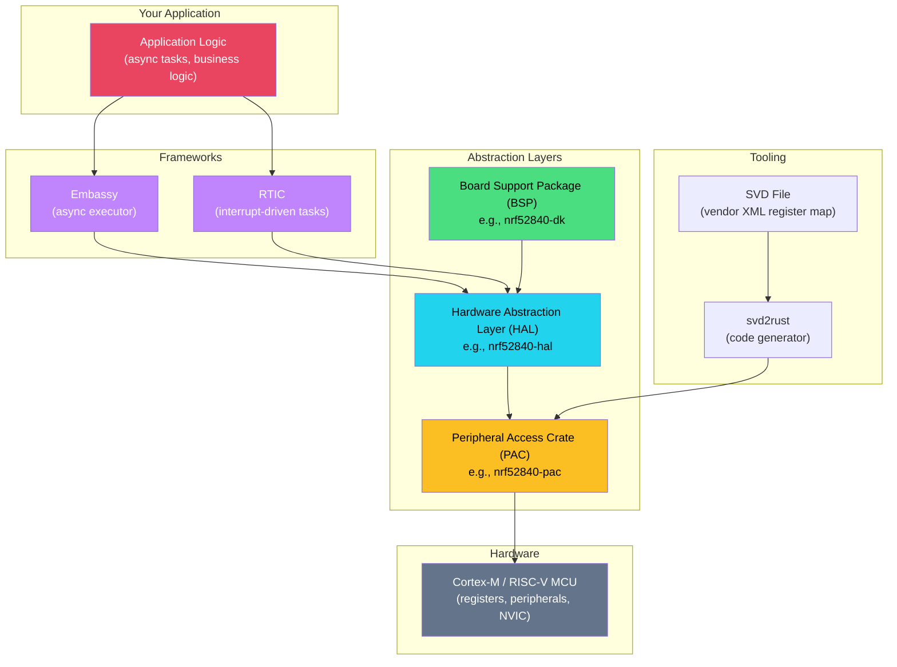

# Bare-Metal Rust: `no_std`, HALs, and Embedded Systems

## Speaker Intro

I'm a firmware architecture lead and embedded Rust contributor with two decades of production experience spanning ARM Cortex-M, RISC-V, and DSP platforms. I've shipped tens of millions of units running C firmware — from automotive ECUs to medical devices — and spent the last several years migrating those toolchains to Rust. I maintain HAL crates, contribute to the `embedded-hal` trait ecosystem, and have debugged more hard faults in GDB than I care to admit. This guide distills everything I've learned about writing bare-metal Rust that *actually ships*.

## What This Book Covers

This is a deep-dive engineering guide to **embedded Rust** — programming microcontrollers where there is **no operating system**, **no heap by default**, and **no runtime safety net**. We go from `#![no_std]` fundamentals through memory-mapped I/O, interrupt-driven concurrency, and culminate in a production-grade async firmware image built with Embassy.

This is not a "blinky LED" tutorial. This is the guide you hand to a principal engineer on day one of an embedded Rust migration.

## Who This Is For

- **Embedded C/C++ veterans** who are tired of use-after-free, buffer overflows, and `volatile` misuse — and want the compiler to catch these at build time.
- **Backend / systems Rust developers** moving into IoT, robotics, or hardware — comfortable with ownership and lifetimes, but unfamiliar with linker scripts, interrupt vectors, and clock trees.
- **Technical leads evaluating Rust** for safety-critical or resource-constrained firmware and need a rigorous understanding of the ecosystem maturity.

## Prerequisites

| Concept | Where to Learn |
|---|---|
| Rust ownership, borrowing, lifetimes | *The Rust Programming Language* (The Book) |
| `unsafe` Rust, raw pointers, FFI | [Unsafe Rust & FFI](../unsafe-ffi-book/src/SUMMARY.md) companion guide |
| Async/await, `Future`, `Poll` | [Async Rust](../async-book/src/SUMMARY.md) companion guide |
| Bitwise operations (`&`, `\|`, `<<`, `>>`, `^`) | Any C or systems programming reference |
| Hexadecimal notation, memory addresses | Any computer architecture course |
| Basic electronics: GPIO, I2C, SPI, UART | Datasheets, or *The Art of Electronics* (Horowitz & Hill) |

## How to Use This Book

| Symbol | Meaning |
|---|---|
| 🟢 | **Foundational** — start here, even if you've written embedded C for years |
| 🟡 | **Intermediate** — requires the preceding chapters |
| 🔴 | **Advanced** — deep internals, production patterns, expert-level |
| 💥 | Code that compiles but causes a **hardware fault** or silent bug |
| ✅ | The idiomatic, safe fix |

Read Part I sequentially — it builds a conceptual foundation that every subsequent chapter depends on. Parts II–IV can be read based on your immediate needs, but the capstone (Chapter 7) assumes all prior material.

## Pacing Guide

| Chapters | Topic | Time | Checkpoint |
|---|---|---|---|
| 0–1 | `no_std` foundations, panic handling | 2–3 hours | Can build and flash a `no_std` binary |
| 2–3 | MMIO, volatile, PAC/HAL/BSP stack | 4–6 hours | Can toggle a GPIO pin via HAL traits |
| 4–5 | Interrupts, critical sections, RTIC | 4–6 hours | Can handle a button interrupt with shared state |
| 6 | Embassy async executor | 3–5 hours | Can run concurrent async tasks on bare metal |
| 7 | Capstone: Sensor Node | 6–8 hours | Full production firmware image |
| Appendix | Reference card | — | Quick-reference for daily work |

**Total estimated time:** 20–30 hours for a thorough pass.

## Table of Contents

### Part I: Stripping Away the OS (`no_std`)
1. **Surviving Without `std`** 🟢 — What `#![no_std]` means, `core` vs `alloc` vs `std`, panic handling without an OS.
2. **Memory-Mapped I/O and Volatile** 🟡 — How CPUs talk to hardware, why LLVM optimizes away your register writes, and how to fix it.
3. **The Embedded Rust Ecosystem Stack** 🟡 — SVD files, `svd2rust`, PACs, HALs, BSPs, and the `embedded-hal` trait universe.

### Part II: Concurrency Without an OS
4. **Interrupts and Critical Sections** 🟡 — NVIC, interrupt handlers, global mutable state, `cortex_m::interrupt::Mutex`.
5. **Real-Time Interrupt-Driven Concurrency (RTIC)** 🔴 — Zero-cost, priority-based, compile-time-verified task scheduling.

### Part III: The Future of Embedded (Async/Await)
6. **Async on Bare Metal with Embassy** 🔴 — Why Tokio can't run here, how Embassy polls futures via WFE, `embassy-time`, `embassy-net`.

### Part IV: Production Capstone
7. **Capstone: The Async Environmental Sensor Node** 🔴 — A production-grade, low-power nRF52/STM32 firmware image with I2C sensors, async tasks, channels, and deep sleep.

### Appendices
- **Summary and Reference Card** — Bitwise cheat sheet, `embedded-hal` trait reference, RTIC macro syntax, `probe-rs` and `defmt` debugging tools.

## The Embedded Rust Landscape

## Companion Guides

This book is designed to work alongside these Rust Training titles:

| Guide | Relevance |
|---|---|
| [Unsafe Rust & FFI](../unsafe-ffi-book/src/SUMMARY.md) | Ch 2 relies on `unsafe` raw pointer access for MMIO. Ch 5 uses unsafe for interrupt handler registration. |
| [Async Rust: From Futures to Production](../async-book/src/SUMMARY.md) | Ch 6 assumes you understand `Future`, `Poll`, `Waker`. Embassy is an async runtime — just not Tokio. |
| [Rust Memory Management](../memory-management-book/src/SUMMARY.md) | Understanding stack vs heap, `'static` lifetimes, and `MaybeUninit` is critical for `no_std` development. |
| [Concurrency in Rust](../concurrency-book/src/SUMMARY.md) | Interrupt-driven concurrency (Ch 4–5) is the embedded analog of OS-thread concurrency. |
| [Rust Smart Pointers & Memory Architecture](../smart-pointers-book/src/SUMMARY.md) | Struct layout, alignment, and `repr(C)` matter enormously when mapping Rust types to hardware registers. |
