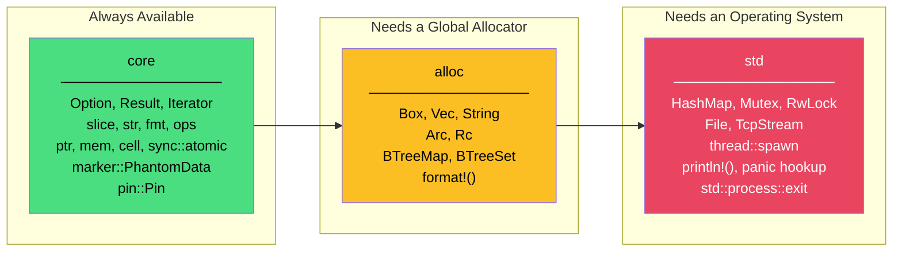

# 1. Surviving Without `std` 🟢

> **What you'll learn:**
> - What `#![no_std]` actually strips away, and what remains in `core`.
> - The three-layer split: `core` → `alloc` → `std`, and which layer provides what.
> - How to handle panics when there is no OS to catch them.
> - How to write a minimal `#![no_std]` binary that can run on a bare-metal target.

---

## The Three Layers of Rust's Standard Library

When you write `use std::collections::HashMap;` in a desktop application, you're implicitly depending on an operating system. The `std` crate provides file I/O, networking, threads, heap allocation, and OS-level panic infrastructure. **None of that exists on a microcontroller.**

Rust's standard library is actually three concentric layers:



| Layer | Requires | Key Types | Embedded Availability |
|---|---|---|---|
| `core` | Nothing — freestanding | `Option`, `Result`, `Iterator`, `&str`, atomics, `Pin` | ✅ Always |
| `alloc` | A global allocator (`#[global_allocator]`) | `Box`, `Vec`, `String`, `Arc`, `Rc`, `format!()` | ⚠️ Optional — you must provide a heap |
| `std` | An OS (POSIX, Windows, etc.) | `HashMap`, `Mutex`, threads, files, networking | ❌ Not available |

### What `#![no_std]` Actually Does

The `#![no_std]` attribute tells the compiler: **"Do not link the `std` crate. I only get `core`."**

```rust
// Desktop Rust (implicit: #![std])
fn main() {
    println!("Hello from an OS!"); // Uses std::io, which calls write(2)
}
```

```rust
// Bare-metal Rust
#![no_std]
#![no_main] // We don't have a C runtime to call main()

use core::panic::PanicInfo;

#[panic_handler]
fn panic(_info: &PanicInfo) -> ! {
    loop {} // Hang forever — no OS to report to
}
```

Two attributes, two consequences:

| Attribute | What It Removes | What You Must Provide |
|---|---|---|
| `#![no_std]` | The `std` crate, `println!`, `HashMap`, OS bindings | A `#[panic_handler]` function |
| `#![no_main]` | The C runtime startup (`crt0`) that calls `main()` | A `#[entry]` point (via `cortex-m-rt` or similar) |

---

## Panic Handling on Bare Metal

When a panic occurs on a desktop, Rust unwinds the stack (or aborts), prints a backtrace, and exits. On bare metal, there is no `stderr`, no backtrace infrastructure, and no process to exit. **You must tell the compiler what to do.**

### Strategy 1: Halt (Production)

```rust
use core::panic::PanicInfo;

#[panic_handler]
fn panic(_info: &PanicInfo) -> ! {
    // In production firmware, halting is often the safest option.
    // A watchdog timer (WDT) can then reset the device.
    loop {
        core::hint::spin_loop(); // Signal to the CPU: "I'm spinning"
    }
}
```

The `panic-halt` crate does exactly this — add `panic_halt` as a dependency and you're done:

```toml
# Cargo.toml
[dependencies]
panic-halt = "1.0"
```

```rust
#![no_std]
#![no_main]

use panic_halt as _; // Links the panic handler — that's it
```

### Strategy 2: Semihosting (Debug Only)

During development with a debugger attached (e.g., via `probe-rs` or OpenOCD), you can route panic messages to the host's terminal through the debug probe:

```rust
use panic_semihosting as _; // Prints panic message via debug probe
```

> ⚠️ **Never use semihosting in production.** If no debugger is attached, a semihosting call triggers a `HardFault` — your firmware will crash.

### Strategy 3: `defmt` (Modern Best Practice)

The `defmt` ("deferred formatting") framework is the gold standard for embedded Rust logging. It encodes log messages as integer tokens at compile time and decodes them on the host — resulting in near-zero overhead:

```rust
use defmt_rtt as _; // Transport: Real-Time Transfer (RTT)
use panic_probe as _; // Breakpoint on panic + defmt message

#[entry]
fn main() -> ! {
    defmt::info!("Booting firmware v{}", env!("CARGO_PKG_VERSION"));
    // ...
    loop {}
}
```

| Strategy | Crate | Overhead | Use Case |
|---|---|---|---|
| Halt / infinite loop | `panic-halt` | Zero | Production, safety-critical |
| Semihosting print | `panic-semihosting` | High (blocks CPU) | Early bring-up with debugger |
| `defmt` + probe | `panic-probe` + `defmt-rtt` | Near zero | Development and CI testing |
| Abort | `panic = "abort"` in profile | Zero | When you want minimal binary size |

---

## A Minimal `no_std` Binary

Let's build the smallest possible bare-metal binary for a Cortex-M microcontroller:

```rust
// src/main.rs
#![no_std]
#![no_main]

use cortex_m_rt::entry;
use panic_halt as _;

#[entry]
fn main() -> ! {
    // The `!` return type means "this function never returns."
    // On bare metal, main() is an infinite event loop.
    loop {
        cortex_m::asm::wfi(); // Wait For Interrupt — CPU sleeps until an interrupt fires
    }
}
```

```toml
# Cargo.toml
[package]
name = "bare-metal-hello"
version = "0.1.0"
edition = "2021"

[dependencies]
cortex-m = "0.7"
cortex-m-rt = "0.7"
panic-halt = "1.0"
```

```toml
# .cargo/config.toml — tells Cargo which target to cross-compile for
[build]
target = "thumbv7em-none-eabihf"  # Cortex-M4F with hardware float

[target.thumbv7em-none-eabihf]
runner = "probe-rs run --chip nRF52840_xxAA"  # Flash and run via debug probe
rustflags = ["-C", "link-arg=-Tlink.x"]       # Use cortex-m-rt's linker script
```

### What `cortex-m-rt` Does For You

The `cortex-m-rt` crate provides:

1. **A linker script (`link.x`)** that defines the memory layout (Flash, RAM, stack).
2. **A reset vector** — the first function the CPU executes after power-on.
3. **Stack pointer initialization** — sets `SP` to the top of RAM.
4. **`.bss` zeroing and `.data` initialization** — copies initialized data from Flash to RAM.
5. **The `#[entry]` macro** — marks your function as the post-initialization entry point.

Without this crate, you'd have to write all of the above in assembly and linker scripts manually — exactly as you would in C with a startup `.s` file.

---

## `core` Is More Powerful Than You Think

Developers new to `no_std` often panic (pun intended) when they lose `std`. But `core` provides a surprisingly rich toolkit:

| What You Need | `core` Equivalent |
|---|---|
| Dynamic arrays | `heapless::Vec<T, N>` (fixed-capacity, stack-allocated) |
| Strings | `heapless::String<N>`, or `&str` slices |
| Formatting | `core::fmt::Write` trait + `write!()` macro |
| Hashing | `core::hash` (you provide a `Hasher`) |
| Atomics | `core::sync::atomic::{AtomicBool, AtomicU32, ...}` |
| Sorting | `[T]::sort_unstable()` — works on slices |
| Math | `core::f32` / `core::f64` (requires `libm` on soft-float targets) |
| Smart pointers | `core::cell::{Cell, RefCell}`, `core::pin::Pin` |
| Error handling | `Result<T, E>`, `Option<T>`, the `?` operator |

The `heapless` crate is your best friend in `no_std`:

```rust
use heapless::Vec;
use heapless::String;

// A Vec that holds up to 16 elements, entirely on the stack
let mut readings: Vec<u16, 16> = Vec::new();
readings.push(1023).unwrap(); // Returns Err if full
readings.push(512).unwrap();

// A String with a 64-byte buffer
let mut msg: String<64> = String::new();
core::fmt::write(&mut msg, format_args!("Temp: {}°C", 23)).unwrap();
```

---

## Using `alloc` Without `std`

Sometimes you genuinely need heap allocation — for variable-length buffers, or crates that require `Vec`. You can use `alloc` without `std` by providing a global allocator:

```rust
#![no_std]
#![no_main]

extern crate alloc;

use alloc::vec::Vec;
use alloc::string::String;
use embedded_alloc::LlffHeap as Heap;

#[global_allocator]
static HEAP: Heap = Heap::empty();

use cortex_m_rt::entry;
use panic_halt as _;

#[entry]
fn main() -> ! {
    // Initialize the heap with a static buffer
    {
        const HEAP_SIZE: usize = 4096;
        static mut HEAP_MEM: [u8; HEAP_SIZE] = [0; HEAP_SIZE];
        #[allow(static_mut_refs)]
        unsafe { HEAP.init(HEAP_MEM.as_ptr() as usize, HEAP_SIZE) }
    }

    // Now you can use Vec, String, Box, etc.
    let mut data: Vec<u8> = Vec::with_capacity(256);
    data.push(42);

    loop {
        cortex_m::asm::wfi();
    }
}
```

> ⚠️ **Heap allocation on embedded is controversial.** Allocation can fail at runtime (OOM), fragment memory, and introduce unpredictable latency. Many safety-critical standards (MISRA, DO-178C) prohibit dynamic allocation. **Prefer `heapless` collections unless you have a compelling reason.**

---

## Cross-Compilation Targets

Bare-metal Rust targets have the form `<arch>-none-<abi>`:

| Target Triple | Architecture | FPU | Common MCUs |
|---|---|---|---|
| `thumbv6m-none-eabi` | Cortex-M0/M0+ | No | nRF51, STM32F0, RP2040 |
| `thumbv7m-none-eabi` | Cortex-M3 | No | STM32F1, LPC1768 |
| `thumbv7em-none-eabi` | Cortex-M4/M7 | No (soft float) | STM32F4 (no FPU use) |
| `thumbv7em-none-eabihf` | Cortex-M4F/M7F | Yes (hard float) | nRF52840, STM32F4, STM32H7 |
| `thumbv8m.main-none-eabihf` | Cortex-M33 | Yes | nRF9160, STM32L5 |
| `riscv32imac-unknown-none-elf` | RISC-V 32-bit | No | ESP32-C3 |

Install a target with:

```bash
rustup target add thumbv7em-none-eabihf
```

---

<details>
<summary><strong>🏋️ Exercise: Your First <code>no_std</code> Binary</strong> (click to expand)</summary>

**Challenge:** Create a `no_std` binary that:
1. Uses `#![no_std]` and `#![no_main]`.
2. Uses `panic-halt` as the panic handler.
3. Defines an `#[entry]` function using `cortex-m-rt`.
4. Inside the entry function, creates a `heapless::Vec<u16, 8>`, pushes the values `[10, 20, 30]`, and computes their sum using `.iter().sum::<u16>()`.
5. Stores the sum in a `static AtomicU16` so it can be inspected with a debugger.
6. Enters an infinite `wfi()` loop.

**Bonus:** Configure `.cargo/config.toml` for `thumbv7em-none-eabihf`.

<details>
<summary>🔑 Solution</summary>

```rust
// src/main.rs
#![no_std]
#![no_main]

use core::sync::atomic::{AtomicU16, Ordering};
use cortex_m_rt::entry;
use heapless::Vec;
use panic_halt as _;

/// Stores the computed sum — visible in a debugger via:
///   `print RESULT` or `monitor read 0x2000_0000` (address varies)
static RESULT: AtomicU16 = AtomicU16::new(0);

#[entry]
fn main() -> ! {
    // Stack-allocated vector with capacity 8
    let mut readings: Vec<u16, 8> = Vec::new();

    // Push values — unwrap is safe here because we know capacity > 3
    readings.push(10).unwrap();
    readings.push(20).unwrap();
    readings.push(30).unwrap();

    // Compute the sum using core's Iterator trait
    let sum: u16 = readings.iter().sum();

    // Store atomically so the optimizer can't elide it
    RESULT.store(sum, Ordering::SeqCst);

    // Enter low-power sleep
    loop {
        cortex_m::asm::wfi();
    }
}
```

```toml
# Cargo.toml
[package]
name = "no-std-exercise"
version = "0.1.0"
edition = "2021"

[dependencies]
cortex-m = "0.7"
cortex-m-rt = "0.7"
panic-halt = "1.0"
heapless = "0.8"
```

```toml
# .cargo/config.toml
[build]
target = "thumbv7em-none-eabihf"

[target.thumbv7em-none-eabihf]
rustflags = ["-C", "link-arg=-Tlink.x"]
```

Verify it compiles:
```bash
cargo build --release
```

Inspect the result in GDB:
```bash
probe-rs gdb --chip nRF52840_xxAA
(gdb) print RESULT
# $1 = core::sync::atomic::AtomicU16 { v: 60 }
```

</details>
</details>

---

> **Key Takeaways**
> - `#![no_std]` removes the OS dependency. You get `core` (always), `alloc` (optional, with a heap), but never `std`.
> - You **must** provide a `#[panic_handler]` — `panic-halt` for production, `defmt` + `panic-probe` for development.
> - `#![no_main]` means you're responsible for startup. `cortex-m-rt` provides the linker script, reset vector, and `#[entry]` macro.
> - `heapless` gives you `Vec`, `String`, and more — all stack-allocated, all `no_std` compatible.
> - Prefer static allocation over heap allocation. When you need a heap, `embedded-alloc` can provide one, but be aware of fragmentation and OOM risks.

> **See also:**
> - [Ch 2: Memory-Mapped I/O and Volatile](ch02-memory-mapped-io-and-volatile.md) — now that you can build a `no_std` binary, let's talk to hardware.
> - [Unsafe Rust & FFI](../unsafe-ffi-book/src/SUMMARY.md) — the `unsafe` blocks we'll use for MMIO in the next chapter.
> - [Rust Memory Management](../memory-management-book/src/SUMMARY.md) — deep dive on stack vs heap, `'static`, and `MaybeUninit`.
