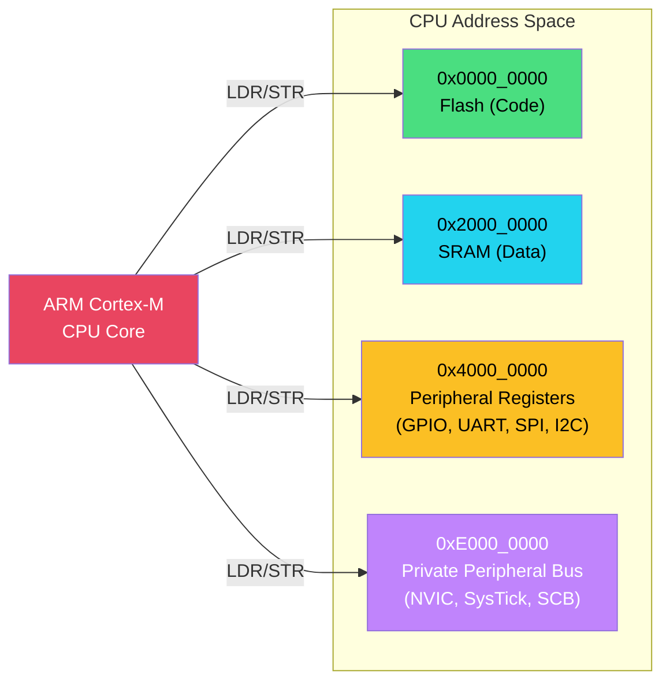

# 2. Memory-Mapped I/O and Volatile 🟡

> **What you'll learn:**
> - How CPUs communicate with peripherals through memory-mapped registers.
> - Why LLVM's optimizer silently breaks hardware access through normal pointer dereferencing.
> - How to use `core::ptr::read_volatile` and `write_volatile` correctly and why they require `unsafe`.
> - The critical difference between C's `volatile` keyword and Rust's volatile access functions.

---

## How CPUs Talk to Hardware

On a microcontroller, peripherals (GPIO pins, UART controllers, SPI buses, timers) don't have special CPU instructions. Instead, they are **mapped into the same address space as RAM.** Writing to address `0x5000_0504` doesn't store a value in memory — it configures the direction of a GPIO port on an nRF52840.

This is **Memory-Mapped I/O (MMIO)**: the CPU reads and writes to specific memory addresses, and the peripheral's hardware logic reacts to those accesses.



### A Concrete Example: nRF52840 GPIO

The nRF52840 datasheet tells us:

| Register | Address | Description |
|---|---|---|
| `GPIO.DIR` | `0x5000_0514` | Direction register (0 = input, 1 = output) |
| `GPIO.OUT` | `0x5000_0504` | Output value (0 = low, 1 = high) |
| `GPIO.IN` | `0x5000_0510` | Input value (read-only) |
| `GPIO.DIRSET` | `0x5000_0518` | Set individual bits in DIR (write-1-to-set) |
| `GPIO.OUTSET` | `0x5000_0508` | Set individual bits in OUT (write-1-to-set) |
| `GPIO.OUTCLR` | `0x5000_050C` | Clear individual bits in OUT (write-1-to-clear) |

To turn on an LED connected to pin 13, you need to:
1. Set bit 13 of `GPIO.DIRSET` to configure pin 13 as output.
2. Set bit 13 of `GPIO.OUTCLR` to drive the pin low (LEDs on nRF DKs are active-low).

---

## The Optimization Trap

Here's where desktop programmers get burned. Consider this "obvious" code:

```rust
// 💥 HARDWARE FAULT: This code compiles but DOES NOT WORK
fn blink_led_broken() {
    let gpio_outset = 0x5000_0508 as *mut u32;
    let gpio_outclr = 0x5000_050C as *mut u32;

    unsafe {
        // Turn LED on
        *gpio_outset = 1 << 13;

        // Delay (busy-wait)
        for _ in 0..1_000_000 {
            core::hint::black_box(()); // try to prevent optimization
        }

        // Turn LED off
        *gpio_outclr = 1 << 13;
    }
}
```

**What goes wrong:** LLVM sees two writes to different pointers where the intermediate value is never read. It's free to:
- **Reorder** the writes.
- **Eliminate** the first write entirely (dead store elimination).
- **Merge** the delay loop into nothing.

The compiler does not know that these addresses are peripheral registers with **side effects**. From LLVM's perspective, `0x5000_0508` is just a random memory address with no observers.

### C's Solution: The `volatile` Keyword

In C, you'd write:

```c
// C — volatile pointer prevents optimization
volatile uint32_t *gpio_outset = (volatile uint32_t *)0x50000508;
*gpio_outset = (1 << 13);  // Compiler MUST emit this store instruction
```

C's `volatile` is a **type qualifier** — it attaches to the pointer and affects every access through that pointer. This works, but it's error-prone: forget `volatile` on one cast, and you get a silent hardware bug.

### Rust's Solution: Volatile Accessor Functions

Rust doesn't have a `volatile` type qualifier. Instead, it provides **explicit functions** that force the compiler to emit the load/store:

```rust
// ✅ FIX: Volatile access — compiler MUST emit these instructions
fn blink_led_correct() {
    let gpio_dirset = 0x5000_0518 as *mut u32;
    let gpio_outset = 0x5000_0508 as *mut u32;
    let gpio_outclr = 0x5000_050C as *mut u32;

    unsafe {
        // Configure pin 13 as output
        core::ptr::write_volatile(gpio_dirset, 1 << 13);

        // Turn LED on (active-low: clear the pin)
        core::ptr::write_volatile(gpio_outclr, 1 << 13);

        // Busy-wait delay
        for _ in 0..1_000_000u32 {
            core::ptr::read_volatile(0x2000_0000 as *const u32); // dummy volatile read
        }

        // Turn LED off (set the pin high)
        core::ptr::write_volatile(gpio_outset, 1 << 13);
    }
}
```

| Aspect | C `volatile` | Rust Volatile |
|---|---|---|
| Syntax | `volatile uint32_t *p; *p = val;` | `core::ptr::write_volatile(p, val)` |
| Scope | Type qualifier — all accesses through `p` | Per-access — each call is explicitly volatile |
| Forgettable? | Yes — one cast without `volatile` → silent bug | Harder — you choose `write_volatile` or `write` each time |
| Requires `unsafe`? | No (C doesn't have `unsafe`) | Yes — raw pointer dereference |
| Ordering guarantees | Volatile-to-volatile ordering only | Same — no cross-volatile/non-volatile ordering guarantee |

> **Key insight:** Rust's approach forces you to be *explicit* about every volatile access. There's no way to accidentally use a non-volatile write through a volatile pointer.

---

## The `unsafe` Connection

Every `read_volatile` / `write_volatile` call requires `unsafe`, because you're dereferencing a raw pointer. This is exactly the territory covered in the [Unsafe Rust & FFI](../unsafe-ffi-book/src/SUMMARY.md) companion guide.

The `unsafe` contract here is:

1. **The pointer must be valid** — it must point to a mapped peripheral register.
2. **The pointer must be aligned** — peripheral registers on ARM are naturally aligned to 4 bytes.
3. **The access must be appropriately sized** — writing a `u8` to a 32-bit register may not do what you expect (some peripherals ignore byte-lane writes).

```rust
// This is the safety contract you're asserting with every volatile access:
unsafe {
    // SAFETY:
    // - 0x5000_0508 is the nRF52840 GPIO P0 OUTSET register (datasheet §6.8.2).
    // - The address is valid and 4-byte aligned.
    // - We are writing a full 32-bit word.
    core::ptr::write_volatile(0x5000_0508 as *mut u32, 1 << 13);
}
```

---

## Register Access Patterns

Hardware registers commonly use specific bit manipulation patterns. Mastering these is essential:

### Read-Modify-Write

Many registers require you to change specific bits without disturbing others:

```rust
unsafe fn set_bit(reg: *mut u32, bit: u32) {
    // Read the current value
    let current = core::ptr::read_volatile(reg);
    // Set the desired bit
    core::ptr::write_volatile(reg, current | (1 << bit));
}

unsafe fn clear_bit(reg: *mut u32, bit: u32) {
    let current = core::ptr::read_volatile(reg);
    core::ptr::write_volatile(reg, current & !(1 << bit));
}

unsafe fn modify_field(reg: *mut u32, mask: u32, shift: u32, value: u32) {
    let current = core::ptr::read_volatile(reg);
    let cleared = current & !mask;          // Clear the field
    let new_val = cleared | (value << shift); // Set the new value
    core::ptr::write_volatile(reg, new_val);
}
```

> 💥 **Race condition warning:** Read-modify-write on a peripheral register is NOT atomic. If an interrupt fires between the read and the write, it may modify the same register, and your write will clobber the interrupt's changes. We address this in [Ch 4: Interrupts and Critical Sections](ch04-interrupts-and-critical-sections.md).

### Write-1-to-Set / Write-1-to-Clear

Many ARM peripherals provide **set** and **clear** registers that avoid the read-modify-write race. Writing a `1` to a specific bit sets (or clears) it without affecting other bits:

```rust
// ✅ Atomic-safe: no read-modify-write needed
unsafe {
    // Set pin 13 high (OUTSET register — write-1-to-set)
    core::ptr::write_volatile(0x5000_0508 as *mut u32, 1 << 13);

    // Set pin 13 low (OUTCLR register — write-1-to-clear)
    core::ptr::write_volatile(0x5000_050C as *mut u32, 1 << 13);
}
```

### Write-Only, Read-Only, and Reserved Bits

| Register Type | Read Behavior | Write Behavior | Common Example |
|---|---|---|---|
| Read-Write (RW) | Returns current value | Sets new value | Configuration registers |
| Read-Only (RO) | Returns peripheral state | Write is ignored | Status, input registers |
| Write-Only (WO) | Returns undefined value | Triggers action | Command, clear registers |
| Write-1-to-Clear (W1C) | Returns status flags | Writing `1` clears the flag | Interrupt pending flags |

> ⚠️ **Never read a write-only register.** The value you get back is undefined — it may be 0, may be garbage, or may trigger a bus fault on some architectures.

---

## Building a Minimal Register Abstraction

Writing raw addresses everywhere is error-prone. Let's build a thin type-safe wrapper:

```rust
/// A volatile register at a fixed memory address.
/// This is essentially what PAC crates generate for you (Ch 3).
#[repr(transparent)]
pub struct ReadWrite<T: Copy> {
    value: T,
}

impl ReadWrite<u32> {
    /// Read the register value.
    #[inline(always)]
    pub fn read(&self) -> u32 {
        // SAFETY: `self` points to a memory-mapped register.
        // The caller of the constructor guaranteed the address is valid.
        unsafe { core::ptr::read_volatile(self as *const Self as *const u32) }
    }

    /// Write a value to the register.
    #[inline(always)]
    pub fn write(&self, val: u32) {
        // SAFETY: Same as above.
        unsafe { core::ptr::write_volatile(self as *const Self as *mut u32, val) }
    }

    /// Read, modify specific bits, write back.
    #[inline(always)]
    pub fn modify<F: FnOnce(u32) -> u32>(&self, f: F) {
        let val = self.read();
        self.write(f(val));
    }
}

/// A register block for GPIO Port 0.
#[repr(C)]
pub struct GpioPort {
    _reserved0: [u32; 321],  // Padding to reach offset 0x504
    pub out: ReadWrite<u32>,     // 0x504 — output value
    pub outset: ReadWrite<u32>,  // 0x508 — write-1-to-set
    pub outclr: ReadWrite<u32>,  // 0x50C — write-1-to-clear
    pub in_: ReadWrite<u32>,     // 0x510 — input value
    pub dir: ReadWrite<u32>,     // 0x514 — direction
    pub dirset: ReadWrite<u32>,  // 0x518 — write-1-to-set direction
    pub dirclr: ReadWrite<u32>,  // 0x51C — write-1-to-clear direction
}

// Usage:
fn configure_led() {
    let gpio = unsafe { &*(0x5000_0000 as *const GpioPort) };
    gpio.dirset.write(1 << 13);   // Pin 13 = output
    gpio.outclr.write(1 << 13);   // Drive low (LED on, active-low)
}
```

This is a simplified version of what `svd2rust` generates automatically — which we'll explore in [Chapter 3](ch03-embedded-rust-ecosystem-stack.md).

---

<details>
<summary><strong>🏋️ Exercise: Blink an LED with Raw Volatile Access</strong> (click to expand)</summary>

**Challenge:** Write a bare-metal `no_std` program that:
1. Configures GPIO pin 13 as an output using `DIRSET` at `0x5000_0518`.
2. In an infinite loop:
   a. Turns the LED **on** by writing to `OUTCLR` at `0x5000_050C`.
   b. Busy-waits for approximately 500ms (use a `for` loop with `read_volatile` to prevent optimization).
   c. Turns the LED **off** by writing to `OUTSET` at `0x5000_0508`.
   d. Busy-waits again for 500ms.
3. All volatile accesses must have a `// SAFETY:` comment.

**Bonus:** Read the `IN` register at `0x5000_0510` and check if a button on pin 11 is pressed (active-low). Only blink if the button is held down.

<details>
<summary>🔑 Solution</summary>

```rust
#![no_std]
#![no_main]

use cortex_m_rt::entry;
use panic_halt as _;

// nRF52840 GPIO P0 register addresses
const GPIO_OUT:    *mut u32 = 0x5000_0504 as *mut u32;
const GPIO_OUTSET: *mut u32 = 0x5000_0508 as *mut u32;
const GPIO_OUTCLR: *mut u32 = 0x5000_050C as *mut u32;
const GPIO_IN:     *const u32 = 0x5000_0510 as *const u32;
const GPIO_DIRSET: *mut u32 = 0x5000_0518 as *mut u32;
const GPIO_PIN_CNF_11: *mut u32 = (0x5000_0700 + 11 * 4) as *mut u32;

const LED_PIN: u32 = 13;
const BUTTON_PIN: u32 = 11;

/// Busy-wait delay. The volatile read prevents the optimizer from
/// eliding the loop. Approximate timing depends on clock speed.
fn delay(cycles: u32) {
    for _ in 0..cycles {
        // SAFETY: Reading from a valid RAM address.
        // The volatile qualifier prevents loop elimination.
        unsafe { core::ptr::read_volatile(0x2000_0000 as *const u32) };
    }
}

#[entry]
fn main() -> ! {
    // SAFETY: GPIO_DIRSET is the nRF52840 P0 direction-set register.
    // Writing 1 to bit 13 configures pin 13 as output.
    unsafe { core::ptr::write_volatile(GPIO_DIRSET, 1 << LED_PIN) };

    // Configure pin 11 as input with pull-up
    // PIN_CNF: bits 1:0 = 0 (input), bits 3:2 = 3 (pull-up)
    // SAFETY: PIN_CNF_11 is the pin configuration register for P0.11.
    unsafe { core::ptr::write_volatile(GPIO_PIN_CNF_11, 0b0000_1100) };

    loop {
        // SAFETY: GPIO_IN is the P0 input register. Bit 11 = button state.
        let button_pressed = unsafe {
            core::ptr::read_volatile(GPIO_IN) & (1 << BUTTON_PIN) == 0 // active-low
        };

        if button_pressed {
            // LED ON (active-low: clear the output pin)
            // SAFETY: OUTCLR is the P0 output-clear register. Write-1-to-clear.
            unsafe { core::ptr::write_volatile(GPIO_OUTCLR, 1 << LED_PIN) };

            delay(500_000);

            // LED OFF (set the output pin high)
            // SAFETY: OUTSET is the P0 output-set register. Write-1-to-set.
            unsafe { core::ptr::write_volatile(GPIO_OUTSET, 1 << LED_PIN) };

            delay(500_000);
        } else {
            // Ensure LED is off when button not pressed
            unsafe { core::ptr::write_volatile(GPIO_OUTSET, 1 << LED_PIN) };
        }
    }
}
```

</details>
</details>

---

> **Key Takeaways**
> - Microcontroller peripherals are accessed through **memory-mapped registers** — specific addresses where reads and writes have hardware side effects.
> - LLVM aggressively optimizes pointer accesses. Without `volatile`, your register writes **will be elided or reordered**, causing silent hardware bugs.
> - Rust uses `core::ptr::read_volatile()` and `write_volatile()` instead of C's `volatile` type qualifier. This makes every volatile access explicit and intentional.
> - Every volatile access requires `unsafe` — you're asserting that the address is valid, aligned, and appropriately sized.
> - Read-modify-write on peripheral registers is vulnerable to **interrupt-driven race conditions**. Prefer write-1-to-set/clear registers, or use critical sections (Ch 4).

> **See also:**
> - [Ch 3: The Embedded Rust Ecosystem Stack](ch03-embedded-rust-ecosystem-stack.md) — the type-safe wrappers that eliminate raw address manipulation.
> - [Ch 4: Interrupts and Critical Sections](ch04-interrupts-and-critical-sections.md) — solving read-modify-write races.
> - [Unsafe Rust & FFI](../unsafe-ffi-book/src/SUMMARY.md) — deep dive on raw pointers, `unsafe` contracts, and soundness.
