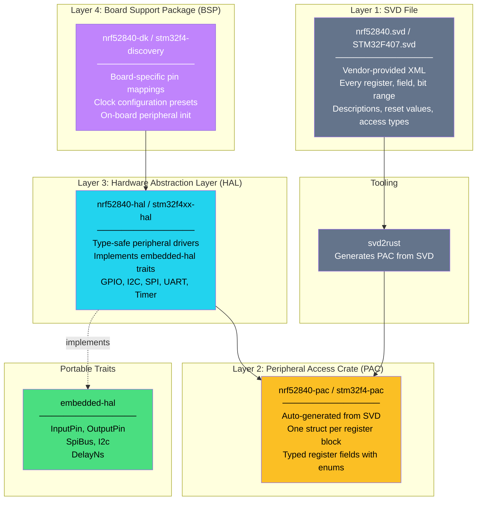

# 3. The Embedded Rust Ecosystem Stack 🟡

> **What you'll learn:**
> - How vendor SVD files describe a chip's every register, and how `svd2rust` converts them into type-safe Rust code.
> - The four-layer abstraction stack: SVD → PAC → HAL → BSP, and what each layer provides.
> - How `embedded-hal` traits enable portable drivers that work across any microcontroller.
> - How to navigate the ecosystem and choose the right crates for your chip.

---

## The Problem: Every Chip Is Different

In the previous chapter, we wrote to raw addresses like `0x5000_0508`. That works — but it's:
- **Error-prone:** One typo in an address is a silent hardware bug.
- **Unportable:** The same peripheral (e.g., GPIO) lives at different addresses on different chips.
- **Undiscoverable:** There's no autocomplete, no documentation, no type safety.

The Embedded Rust ecosystem solves this with a **layered abstraction stack** that starts from the vendor's own register description and builds up to portable, type-safe driver APIs.



---

## Layer 1: SVD Files — The Chip's Blueprint

Every ARM Cortex-M chip vendor (Nordic, ST, NXP, etc.) publishes a **System View Description (SVD)** file — an XML document that describes every peripheral, register, field, and bit in the chip.

Here's a snippet from the nRF52840 SVD:

```xml
<peripheral>
  <name>P0</name>
  <description>GPIO Port 0</description>
  <baseAddress>0x50000000</baseAddress>
  <registers>
    <register>
      <name>OUT</name>
      <description>Write GPIO port</description>
      <addressOffset>0x504</addressOffset>
      <size>32</size>
      <access>read-write</access>
      <fields>
        <field>
          <name>PIN13</name>
          <description>Pin 13</description>
          <bitRange>[13:13]</bitRange>
          <enumeratedValues>
            <enumeratedValue><name>Low</name><value>0</value></enumeratedValue>
            <enumeratedValue><name>High</name><value>1</value></enumeratedValue>
          </enumeratedValues>
        </field>
        <!-- ... 31 more pin fields ... -->
      </fields>
    </register>
  </registers>
</peripheral>
```

This file is the single source of truth. Every bit is documented, every access type is specified.

---

## Layer 2: PAC — Auto-Generated Type-Safe Registers

The `svd2rust` tool reads the SVD file and generates a Rust crate with:
- One **struct** per register block (e.g., `P0`, `UARTE0`, `SPIM0`).
- **Methods** on each register for `.read()`, `.write()`, and `.modify()`.
- **Enums** for every documented field value.
- **Compile-time enforcement** of read/write permissions.

### Before (Raw Volatile — Chapter 2)

```rust
// 💥 Manual, error-prone, no type safety
unsafe {
    core::ptr::write_volatile(0x5000_0518 as *mut u32, 1 << 13);
    core::ptr::write_volatile(0x5000_050C as *mut u32, 1 << 13);
}
```

### After (PAC — Type-Safe)

```rust
// ✅ Auto-generated, type-safe, documented
use nrf52840_pac::Peripherals;

let p = unsafe { Peripherals::steal() };

// Configure pin 13 as output
p.p0.dirset.write(|w| unsafe { w.bits(1 << 13) });

// Turn LED on (active-low)
p.p0.outclr.write(|w| unsafe { w.bits(1 << 13) });
```

Or, using the named field API:

```rust
// Even better: field-level access with enums
p.p0.pin_cnf[13].write(|w| {
    w.dir().output()    // Direction: output
     .input().disconnect()  // Disconnect input buffer
     .pull().disabled()     // No pull-up/down
     .drive().s0s1()        // Standard 0, standard 1 drive
     .sense().disabled()    // No pin sensing
});

p.p0.outclr.write(|w| w.pin13().set_bit()); // LED on
p.p0.outset.write(|w| w.pin13().set_bit()); // LED off
```

### What PACs Give You

| Feature | Raw Volatile | PAC |
|---|---|---|
| Autocomplete | ❌ Memorize addresses | ✅ Full IDE support |
| Type safety | ❌ Everything is `*mut u32` | ✅ Enums for every field value |
| Read-only enforcement | ❌ Can write to RO registers | ✅ Compiler error on write to RO |
| Documentation | ❌ Open the datasheet | ✅ Inline docs from SVD |
| Bug surface | Huge — wrong address, wrong bits | Small — mostly logic errors |

### Generating Your Own PAC

```bash
# Install svd2rust
cargo install svd2rust

# Generate Rust code from an SVD file
svd2rust -i nrf52840.svd --target cortex-m

# This generates a lib.rs and a build.rs in the current directory
# Typically, PACs are published as crates (e.g., nrf52840-pac on crates.io)
```

Most developers use **pre-built PAC crates** from crates.io:

| Chip Family | PAC Crate |
|---|---|
| nRF52840 | `nrf52840-pac` |
| STM32F4 | `stm32f4` (with feature flags per chip) |
| STM32H7 | `stm32h7` |
| RP2040 | `rp2040-pac` |
| ESP32-C3 | `esp32c3` |

---

## Layer 3: HAL — Ergonomic, Safe Peripheral Drivers

A PAC gives you type-safe register access — but you still need to know the correct initialization sequence for each peripheral (clock enable → pin configuration → peripheral setup → enable). That's the HAL's job.

A HAL crate wraps the PAC and provides **high-level, safe APIs** for each peripheral:

```rust
use nrf52840_hal as hal;
use hal::gpio::Level;
use hal::prelude::*;

#[entry]
fn main() -> ! {
    let p = hal::pac::Peripherals::take().unwrap();
    let port0 = hal::gpio::p0::Parts::new(p.P0);

    // Configure pin 13 as a push-pull output, initially high (LED off)
    let mut led = port0.p0_13.into_push_pull_output(Level::High);

    loop {
        led.set_low().unwrap();   // LED on (active-low)
        cortex_m::asm::delay(8_000_000); // ~0.5s at 16MHz
        led.set_high().unwrap();  // LED off
        cortex_m::asm::delay(8_000_000);
    }
}
```

No raw pointers. No `unsafe`. No register addresses. The HAL handles clock initialization, pin configuration, and provides methods that map to hardware actions.

### The `embedded-hal` Traits

The magic of the HAL layer is the [`embedded-hal`](https://docs.rs/embedded-hal/latest/embedded_hal/) crate — a set of **traits** that define a common interface for peripherals:

```rust
// From embedded-hal — these traits are chip-independent
pub trait OutputPin {
    type Error;
    fn set_low(&mut self) -> Result<(), Self::Error>;
    fn set_high(&mut self) -> Result<(), Self::Error>;
}

pub trait I2c {
    type Error;
    fn write(&mut self, address: u8, bytes: &[u8]) -> Result<(), Self::Error>;
    fn read(&mut self, address: u8, buffer: &mut [u8]) -> Result<(), Self::Error>;
    fn write_read(&mut self, addr: u8, bytes: &[u8], buffer: &mut [u8]) -> Result<(), Self::Error>;
}

pub trait SpiBus {
    type Error;
    fn transfer(&mut self, read: &mut [u8], write: &[u8]) -> Result<(), Self::Error>;
}

pub trait DelayNs {
    fn delay_ns(&mut self, ns: u32);
    fn delay_ms(&mut self, ms: u32) { /* default impl */ }
}
```

Every HAL crate implements these traits. This means **sensor drivers can be written once and work on any chip:**

```rust
// A BME280 driver that works on ANY microcontroller with I2C
// It depends on `embedded-hal`, not on any specific chip
pub struct Bme280<I2C> {
    i2c: I2C,
    address: u8,
}

impl<I2C: embedded_hal::i2c::I2c> Bme280<I2C> {
    pub fn new(i2c: I2C, address: u8) -> Self {
        Self { i2c, address }
    }

    pub fn read_temperature(&mut self) -> Result<f32, I2C::Error> {
        let mut buf = [0u8; 3];
        self.i2c.write_read(self.address, &[0xFA], &mut buf)?;
        // Parse temperature from raw bytes (simplified)
        let raw = ((buf[0] as i32) << 12) | ((buf[1] as i32) << 4) | ((buf[2] as i32) >> 4);
        Ok(raw as f32 / 100.0)
    }
}
```

### The `embedded-hal` Trait Map

| Trait | Peripheral | Common Implementations |
|---|---|---|
| `OutputPin` / `InputPin` | GPIO | Every HAL |
| `I2c` | I2C / TWI | Sensors, EEPROMs, RTCs |
| `SpiBus` / `SpiDevice` | SPI | Flash, displays, ADCs |
| `serial::Write` / `Read` | UART | Debug logging, GPS modules |
| `Pwm` | PWM / Timer | Motor control, LED dimming |
| `DelayNs` | Timers / SysTick | Timing, debouncing |
| `adc::OneShot` | ADC | Analog sensor reading |

---

## Layer 4: BSP — Board-Specific Convenience

A Board Support Package (BSP) wraps the HAL with board-specific knowledge: which pins are connected to LEDs, buttons, sensors, and connectors on a specific development board.

```rust
// Without BSP: you need the schematic to know pin mappings
let led1 = port0.p0_13.into_push_pull_output(Level::High); // Is it pin 13? 17? 20?
let button1 = port0.p0_11.into_pullup_input();              // Which pin is the button?

// With BSP: board-level names
use nrf52840_dk_bsp as bsp;
let board = bsp::Board::take().unwrap();
let mut led1 = board.leds.led_1;  // Just "LED 1"
let button1 = board.buttons.button_1;  // Just "Button 1"
```

| Layer | Crate Example | Abstraction Level | Portability |
|---|---|---|---|
| PAC | `nrf52840-pac` | Register-level | Chip-specific |
| HAL | `nrf52840-hal` | Peripheral-level | Chip-family-specific |
| BSP | `nrf52840-dk` | Board-level | Board-specific |
| Driver | `bme280` | Device-level | Universal (via `embedded-hal`) |

---

## Choosing the Right Layer

**Rule of thumb:** Use the highest abstraction that meets your needs, and drop down only when necessary.

```
Start here → BSP → Does it expose what you need?
                 ├─ Yes → Use the BSP
                 └─ No → Drop to HAL → Does it have the peripheral driver?
                                       ├─ Yes → Use the HAL
                                       └─ No → Drop to PAC → Write your own register sequence
                                                              └─ PAC missing the register?
                                                                 → Raw volatile (Ch 2)
```

### Real-World Example: Ecosystem Navigation

Suppose you're building firmware for an **nRF52840-DK** board that reads an I2C temperature sensor.

```toml
# Cargo.toml — typical embedded project dependencies
[dependencies]
# Layer 4: BSP (optional — use if you want board-level pin names)
nrf52840-dk-bsp = "0.13"

# Layer 3: HAL (always needed)
nrf52840-hal = { version = "0.18", features = ["rt"] }

# Layer 2: PAC (pulled in transitively by the HAL, but listed for clarity)
nrf52840-pac = "0.12"

# Runtime
cortex-m = { version = "0.7", features = ["critical-section-single-core"] }
cortex-m-rt = "0.7"

# Panic handler
panic-halt = "1.0"

# Portable sensor driver
bme280 = "0.5"

# embedded-hal traits (pulled in transitively, but useful for trait imports)
embedded-hal = "1.0"
```

---

<details>
<summary><strong>🏋️ Exercise: Blink with a HAL</strong> (click to expand)</summary>

**Challenge:** Rewrite the LED blinker from Chapter 2 using the HAL instead of raw volatile access.

1. Use `nrf52840-hal` (or `stm32f4xx-hal` if that's your target).
2. Take ownership of the `Peripherals` singleton via `pac::Peripherals::take()`.
3. Split the GPIO port into individual pins.
4. Configure pin 13 as a push-pull output.
5. Toggle the LED in a loop using `set_low()` / `set_high()`.
6. Use `cortex_m::asm::delay()` for timing.

**Bonus:** Also configure a button pin as an input with pull-up, and only blink when the button is pressed.

<details>
<summary>🔑 Solution</summary>

```rust
#![no_std]
#![no_main]

use cortex_m_rt::entry;
use nrf52840_hal as hal;
use hal::gpio::Level;
use hal::prelude::*;
use panic_halt as _;

#[entry]
fn main() -> ! {
    // Take the PAC peripherals singleton — returns None if already taken
    let p = hal::pac::Peripherals::take().unwrap();

    // Split GPIO Port 0 into individual typed pins
    let port0 = hal::gpio::p0::Parts::new(p.P0);

    // LED on pin 13: push-pull output, initially high (LED off, active-low)
    let mut led = port0.p0_13.into_push_pull_output(Level::High);

    // Button on pin 11: input with internal pull-up
    let button = port0.p0_11.into_pullup_input();

    loop {
        // is_low() returns true when button is pressed (active-low)
        if button.is_low().unwrap() {
            // Blink sequence
            led.set_low().unwrap();            // LED on
            cortex_m::asm::delay(8_000_000);   // ~500ms at 16MHz default clock
            led.set_high().unwrap();           // LED off
            cortex_m::asm::delay(8_000_000);
        } else {
            // Ensure LED is off when button not pressed
            led.set_high().unwrap();
        }
    }
}
```

**Key observations:**
- Zero `unsafe` blocks — the HAL handles all volatile register access internally.
- Pin types change with configuration: `p0_13` starts as a `Disconnected` type, becomes `Output<PushPull>` after `into_push_pull_output()`. You can't accidentally read an output pin as if it were an input.
- Error handling through `Result` — `.unwrap()` is acceptable here because GPIO operations are infallible on this platform.

</details>
</details>

---

> **Key Takeaways**
> - The Embedded Rust ecosystem is a **four-layer stack**: SVD → PAC → HAL → BSP. Each layer adds type safety and ergonomics.
> - `svd2rust` auto-generates PAC crates from vendor SVD files, giving you type-safe register access with IDE autocomplete.
> - HAL crates wrap PACs with safe, high-level APIs and implement `embedded-hal` traits.
> - `embedded-hal` traits make **portable drivers** possible — write a sensor driver once, run it on any chip.
> - Use the highest abstraction layer that meets your needs. Drop to lower layers only when necessary.
> - The BSPs provide board-level convenience (named LEDs, buttons) but lock you to a specific PCB design.

> **See also:**
> - [Ch 2: Memory-Mapped I/O and Volatile](ch02-memory-mapped-io-and-volatile.md) — the raw access that PACs abstract over.
> - [Ch 4: Interrupts and Critical Sections](ch04-interrupts-and-critical-sections.md) — using these peripherals safely with interrupts.
> - [Rust API Design & Error Architecture](../api-design-book/src/SUMMARY.md) — the trait-based design principles behind `embedded-hal`.
> - [Rust's Type System & Traits](../type-system-traits-book/src/SUMMARY.md) — understanding the trait system that makes portable drivers possible.
