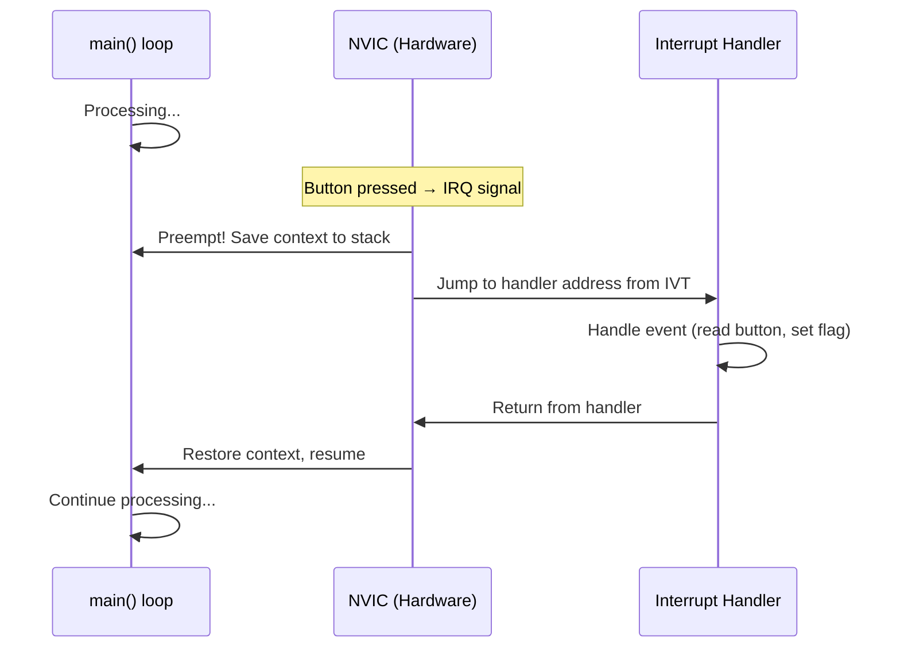

# 4. Interrupts and Critical Sections 🟡

> **What you'll learn:**
> - What hardware interrupts are and how the ARM Nested Vectored Interrupt Controller (NVIC) dispatches them.
> - Why sharing mutable state between `main()` and interrupt handlers is the central concurrency problem on bare metal.
> - How to use `cortex_m::interrupt::Mutex<RefCell<T>>` to safely share state across interrupt contexts.
> - The cost of critical sections and when they become a problem.

---

## The Problem: Hardware Doesn't Wait

On a desktop, you poll for input or spawn threads. On a microcontroller, **hardware tells you when something happens** — a button press, a byte arriving on UART, a timer expiring, a DMA transfer completing. These notifications are called **interrupts.**

When an interrupt fires:
1. The CPU **suspends** whatever it's currently executing (even mid-instruction on some architectures).
2. The CPU **saves context** (registers) onto the stack.
3. The CPU **looks up the handler address** in the **Interrupt Vector Table (IVT)** — a table of function pointers at the start of Flash.
4. The CPU **jumps to the handler**, executes it.
5. The CPU **restores context** and resumes the interrupted code.



### The NVIC (Nested Vectored Interrupt Controller)

ARM Cortex-M processors include a built-in interrupt controller called the **NVIC**. Key features:

| Feature | Description |
|---|---|
| **Vectored** | Each interrupt has a dedicated handler — no polling needed to determine the source |
| **Nested** | Higher-priority interrupts can preempt lower-priority handlers |
| **Priority levels** | Configurable (typically 0–255, with 0 = highest priority) |
| **Enable/Disable** | Each interrupt can be individually enabled, disabled, or pending |
| **Tail-chaining** | Back-to-back interrupts skip the context save/restore overhead |

### Registering an Interrupt Handler

Using `cortex-m-rt`, you register handlers with the `#[interrupt]` attribute:

```rust
use cortex_m_rt::entry;
use nrf52840_pac::{self as pac, interrupt};
use panic_halt as _;

#[entry]
fn main() -> ! {
    let p = pac::Peripherals::take().unwrap();

    // Configure GPIOTE channel 0 for pin 11 (button), event on falling edge
    p.gpiote.config[0].write(|w| unsafe {
        w.mode().event()
         .psel().bits(11)
         .polarity().hi_to_lo()
    });
    p.gpiote.intenset.write(|w| w.in0().set());

    // Enable the GPIOTE interrupt in the NVIC
    unsafe { pac::NVIC::unmask(pac::Interrupt::GPIOTE) };

    loop {
        cortex_m::asm::wfi(); // Sleep until interrupt
    }
}

#[interrupt]
fn GPIOTE() {
    // This runs when the button is pressed.
    // But how do we communicate with main()?
    // ... 🤔
}
```

---

## The Shared State Problem

Here's where things get dangerous. Suppose you want the interrupt handler to increment a counter that `main()` reads:

```rust
// 💥 HARDWARE FAULT: Data Race — this is UNSOUND
static mut COUNTER: u32 = 0; // Mutable global 😱

#[interrupt]
fn GPIOTE() {
    unsafe {
        COUNTER += 1; // Read-modify-write: load, add, store
        // 💥 What if main() reads COUNTER between the load and store?
        // 💥 What if a HIGHER-priority interrupt also accesses COUNTER?
    }
}

#[entry]
fn main() -> ! {
    loop {
        let count = unsafe { COUNTER }; // 💥 May read a torn value
        // ... use count ...
    }
}
```

**This is a data race.** Even though embedded Rust is single-core, interrupts create **logical concurrency** — the handler can preempt `main()` at any point. If `main()` is in the middle of reading `COUNTER` when the interrupt fires and modifies it, you get a **torn read** or a lost update.

> 🔑 **Key insight:** On bare metal, "concurrency" doesn't mean "multiple cores." It means "my code can be interrupted at any instruction boundary." This is the embedded equivalent of multi-threaded access — and it requires the same discipline.

### Why `static mut` Is Almost Always Wrong

Rust correctly identifies `static mut` access as `unsafe`. The compiler is telling you: "I can't verify that this is safe — you're on your own." On bare metal, `static mut` with interrupts is almost never safe without additional synchronization.

---

## Solution 1: Disable Interrupts (Critical Sections)

The simplest solution: **turn off interrupts while accessing shared state.** If interrupts can't fire, there's no preemption, and no data race.

```rust
// ✅ FIX: Critical Section — disable interrupts around shared access
use cortex_m::interrupt;

static mut COUNTER: u32 = 0;

#[interrupt]
fn GPIOTE() {
    // Inside an interrupt handler, we're already at interrupt priority.
    // On single-core Cortex-M, we're safe here (no preemption from same/lower priority).
    // But for safety, we still use a critical section if higher-priority interrupts exist.
    interrupt::free(|_cs| {
        unsafe { COUNTER += 1; }
    });
}

#[entry]
fn main() -> ! {
    loop {
        let count = interrupt::free(|_cs| {
            unsafe { COUNTER }
        });
        // Use count safely — interrupts were disabled during the read
    }
}
```

`cortex_m::interrupt::free` disables **all maskable interrupts** (sets the `PRIMASK` register), runs the closure, then re-enables them. This guarantees atomicity.

### The Cost of Critical Sections

| Aspect | Impact |
|---|---|
| Latency | All interrupts are delayed for the duration of the critical section |
| Duration | Must be as short as possible — microseconds, not milliseconds |
| Nesting | `interrupt::free` is reentrant (idempotent on Cortex-M) |
| Real-time | Long critical sections can cause missed interrupts (overrun) |

---

## Solution 2: The `Mutex<RefCell<T>>` Pattern

Using `static mut` is ergonomically painful and easy to misuse. The Embedded Rust community standardized on a pattern using `cortex_m::interrupt::Mutex` (which wraps data behind a critical section) and `RefCell` (which provides interior mutability):

```rust
use core::cell::RefCell;
use cortex_m::interrupt::{self, Mutex};
use nrf52840_pac::{self as pac, interrupt as pac_interrupt};
use cortex_m_rt::entry;
use panic_halt as _;

// Shared state: a counter protected by a critical-section Mutex
static COUNTER: Mutex<RefCell<u32>> = Mutex::new(RefCell::new(0));

// We also need to share the GPIOTE peripheral to clear the event flag
static GPIOTE: Mutex<RefCell<Option<pac::GPIOTE>>> = Mutex::new(RefCell::new(None));

#[entry]
fn main() -> ! {
    let p = pac::Peripherals::take().unwrap();

    // Configure GPIOTE (same as before)
    p.gpiote.config[0].write(|w| unsafe {
        w.mode().event()
         .psel().bits(11)
         .polarity().hi_to_lo()
    });
    p.gpiote.intenset.write(|w| w.in0().set());

    // Move the GPIOTE peripheral into the shared Mutex
    interrupt::free(|cs| {
        GPIOTE.borrow(cs).replace(Some(p.gpiote));
    });

    // Enable the interrupt
    unsafe { pac::NVIC::unmask(pac::Interrupt::GPIOTE) };

    loop {
        // Read the counter inside a critical section
        let count = interrupt::free(|cs| {
            *COUNTER.borrow(cs).borrow()
        });

        // Do something with count...
        if count >= 10 {
            // 10 button presses — do something
        }

        cortex_m::asm::wfi();
    }
}

#[pac_interrupt]
fn GPIOTE() {
    interrupt::free(|cs| {
        // Increment the counter
        let mut counter = COUNTER.borrow(cs).borrow_mut();
        *counter += 1;

        // Clear the event flag (REQUIRED — otherwise the interrupt fires forever)
        if let Some(gpiote) = GPIOTE.borrow(cs).borrow().as_ref() {
            gpiote.events_in[0].write(|w| w);
        }
    });
}
```

### Anatomy of the Pattern

```
Mutex<RefCell<Option<T>>>
  │      │       │
  │      │       └── Option: because we initialize the peripheral in main()
  │      │            and the static must be initialized at compile time
  │      │
  │      └── RefCell: provides interior mutability (&self → &mut T)
  │           Panics on double-borrow, but inside a critical section
  │           there's only one execution context, so this is safe.
  │
  └── Mutex: requires a CriticalSection token to access
       This token is only available inside interrupt::free(),
       which disables interrupts — preventing concurrent access.
```

### Why `Option<T>`?

Peripheral singletons are created at runtime (`Peripherals::take()` returns them). But `static` variables must be initialized at compile time. The `Option` lets us start with `None` and `.replace(Some(peripheral))` at runtime inside a critical section.

---

## Solution 3: Atomics (When Applicable)

For simple shared values (counters, flags), `core::sync::atomic` types provide lock-free, interrupt-safe access without disabling interrupts:

```rust
use core::sync::atomic::{AtomicU32, AtomicBool, Ordering};

static COUNTER: AtomicU32 = AtomicU32::new(0);
static BUTTON_PRESSED: AtomicBool = AtomicBool::new(false);

#[interrupt]
fn GPIOTE() {
    COUNTER.fetch_add(1, Ordering::Relaxed);
    BUTTON_PRESSED.store(true, Ordering::Release);
    // ... clear event flag using other mechanism ...
}

#[entry]
fn main() -> ! {
    loop {
        if BUTTON_PRESSED.swap(false, Ordering::Acquire) {
            let count = COUNTER.load(Ordering::Relaxed);
            // Handle button press...
        }
        cortex_m::asm::wfi();
    }
}
```

| Approach | Use When | Overhead |
|---|---|---|
| `AtomicU32` / `AtomicBool` | Simple counters, flags | Zero (single instruction on ARM) |
| `Mutex<RefCell<T>>` | Complex state, peripheral sharing | Interrupt disable/enable (~6 cycles) |
| `static mut` + manual critical section | Never (use the above instead) | Error-prone, footgun |

---

## The `critical-section` Crate

The embedded ecosystem recently standardized on the [`critical-section`](https://docs.rs/critical-section/latest/critical_section/) crate, which provides a platform-agnostic critical section API. HAL crates provide the implementation:

```rust
use critical_section::Mutex;
use core::cell::RefCell;

static COUNTER: Mutex<RefCell<u32>> = Mutex::new(RefCell::new(0));

// Works the same way, but portable across all platforms
fn increment() {
    critical_section::with(|cs| {
        let mut counter = COUNTER.borrow_ref_mut(cs);
        *counter += 1;
    });
}
```

Enable it in your HAL crate:

```toml
[dependencies]
cortex-m = { version = "0.7", features = ["critical-section-single-core"] }
```

---

<details>
<summary><strong>🏋️ Exercise: Button-Driven LED Toggle with Interrupt</strong> (click to expand)</summary>

**Challenge:** Build a bare-metal application that:
1. Configures a GPIO pin as output (LED) and another as input (button).
2. Sets up a GPIOTE interrupt on the button's falling edge.
3. Inside the interrupt handler, toggles an `AtomicBool` flag.
4. In `main()`, checks the flag and toggles the LED state accordingly.
5. Uses `wfi()` to sleep between events — no busy-waiting.

**Requirements:**
- Must NOT use `static mut`.
- Must clear the GPIOTE event flag in the handler (otherwise infinite interrupt).
- Use the `Mutex<RefCell<Option<GPIOTE>>>` pattern for sharing the GPIOTE peripheral.

<details>
<summary>🔑 Solution</summary>

```rust
#![no_std]
#![no_main]

use core::cell::RefCell;
use core::sync::atomic::{AtomicBool, Ordering};
use cortex_m::interrupt::{self, Mutex};
use cortex_m_rt::entry;
use nrf52840_hal as hal;
use hal::gpio::Level;
use hal::prelude::*;
use nrf52840_pac::{self as pac, interrupt as pac_interrupt};
use panic_halt as _;

/// Flag: set by ISR, consumed by main loop.
/// AtomicBool is safe to access from both contexts without a critical section.
static TOGGLE_FLAG: AtomicBool = AtomicBool::new(false);

/// GPIOTE peripheral — shared between main and ISR.
/// Protected by critical-section Mutex because we need mutable access
/// to clear event flags.
static GPIOTE_PERIPH: Mutex<RefCell<Option<pac::GPIOTE>>> =
    Mutex::new(RefCell::new(None));

#[entry]
fn main() -> ! {
    let p = pac::Peripherals::take().unwrap();
    let port0 = hal::gpio::p0::Parts::new(p.P0);

    // LED on pin 13 — push-pull output, initially off (high = off for active-low)
    let mut led = port0.p0_13.into_push_pull_output(Level::High);

    // Button on pin 11 — input with pull-up
    let _button = port0.p0_11.into_pullup_input();

    // Configure GPIOTE channel 0: pin 11, event mode, hi-to-lo (falling edge)
    p.gpiote.config[0].write(|w| unsafe {
        w.mode().event()
         .psel().bits(11)
         .polarity().hi_to_lo()
    });

    // Enable interrupt for GPIOTE channel 0 events
    p.gpiote.intenset.write(|w| w.in0().set());

    // Share GPIOTE peripheral with the interrupt handler
    interrupt::free(|cs| {
        GPIOTE_PERIPH.borrow(cs).replace(Some(p.gpiote));
    });

    // Unmask the GPIOTE interrupt in the NVIC
    unsafe { pac::NVIC::unmask(pac::Interrupt::GPIOTE) };

    // Track current LED state locally (no need to share — only main touches it)
    let mut led_on = false;

    loop {
        // Check if the ISR set the toggle flag
        if TOGGLE_FLAG.swap(false, Ordering::Acquire) {
            led_on = !led_on;
            if led_on {
                led.set_low().unwrap(); // LED on (active-low)
            } else {
                led.set_high().unwrap(); // LED off
            }
        }

        // Sleep until the next interrupt — microamps of power consumption
        cortex_m::asm::wfi();
    }
}

#[pac_interrupt]
fn GPIOTE() {
    // Signal main loop to toggle
    TOGGLE_FLAG.store(true, Ordering::Release);

    // CRITICAL: Clear the event flag, otherwise this interrupt fires forever
    interrupt::free(|cs| {
        if let Some(gpiote) = GPIOTE_PERIPH.borrow(cs).borrow().as_ref() {
            gpiote.events_in[0].write(|w| w); // Writing 0 clears the event
        }
    });
}
```

**Key design decisions:**
- `AtomicBool` for the flag — zero-cost, no critical section needed for a simple flag.
- `Mutex<RefCell<Option<GPIOTE>>>` for the peripheral — needed to clear event flags in the ISR.
- `wfi()` in the main loop — the CPU sleeps at microamps instead of busy-spinning at milliamps.
- LED state tracked locally in `main()` — no need to share what only one context accesses.

</details>
</details>

---

> **Key Takeaways**
> - Hardware interrupts create **logical concurrency** even on single-core MCUs. The interrupt handler preempts `main()` at any instruction boundary.
> - `static mut` with interrupts is a **data race**. Never use it without synchronization.
> - **Critical sections** (`interrupt::free`) disable all maskable interrupts, providing exclusive access. Keep them short.
> - The `Mutex<RefCell<Option<T>>>` pattern is the standard way to share peripheral access between `main()` and interrupt handlers.
> - **Atomics** (`AtomicBool`, `AtomicU32`) are zero-cost alternatives for simple shared values.
> - Always **clear interrupt event flags** in the handler — forgetting this causes an infinite interrupt storm.

> **See also:**
> - [Ch 5: RTIC](ch05-rtic.md) — a framework that replaces manual critical sections with compile-time priority analysis.
> - [Ch 6: Embassy](ch06-async-bare-metal-embassy.md) — async/await as an alternative concurrency model.
> - [Concurrency in Rust](../concurrency-book/src/SUMMARY.md) — the OS-thread analog of interrupt-driven concurrency.
> - [Unsafe Rust & FFI](../unsafe-ffi-book/src/SUMMARY.md) — understanding the `unsafe` contracts in interrupt registration.
