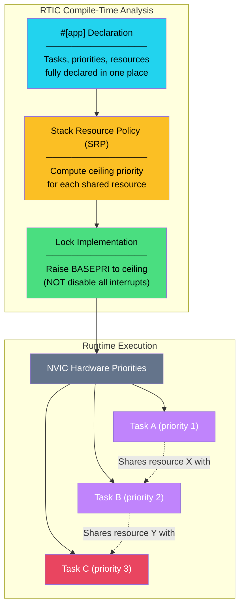

# 5. Real-Time Interrupt-Driven Concurrency (RTIC) 🔴

> **What you'll learn:**
> - How RTIC uses hardware interrupt priorities to replace manual critical sections with zero-cost, compile-time-verified resource locking.
> - The RTIC programming model: tasks, resources, shared and local state, and monotonic timers.
> - How the Stack Resource Policy (SRP) guarantees deadlock-free execution at compile time.
> - When to use RTIC vs. manual interrupts vs. Embassy async.

---

## Why RTIC Exists

In Chapter 4, we shared state using `Mutex<RefCell<Option<T>>>` and `interrupt::free()`. This works, but it has serious limitations:

| Problem | Consequence |
|---|---|
| `interrupt::free` disables **all** interrupts | Higher-priority tasks are blocked — violates real-time guarantees |
| Manual `Option<T>` dance | Peripheral moved at runtime, accessed via `.borrow()` — boilerplate-heavy |
| No compile-time deadlock analysis | You can accidentally create priority inversions or forget critical sections |
| Resource relationships invisible | Who accesses what is scattered across `static` declarations and handlers |

RTIC solves all of these. It's a concurrency framework that leverages the **hardware NVIC priority system** to provide fine-grained, zero-cost locking — and it verifies the entire system at compile time.



---

## The Stack Resource Policy (SRP)

RTIC implements the **Stack Resource Policy**, a well-studied real-time scheduling algorithm. The core idea:

1. Every **task** has a **hardware priority** (assigned by you).
2. Every **shared resource** has a **ceiling priority** — the maximum priority of any task that accesses it.
3. When a task accesses a shared resource, RTIC **raises the CPU's priority** to the resource's ceiling — just enough to prevent any other task that could access the same resource from running.
4. When the access is done, priority is restored.

This is **not** "disable all interrupts." It's "temporarily raise my priority so that only tasks that *don't* touch this resource can preempt me." Higher-priority tasks that use *different* resources still run unimpeded.

### Comparison: Critical Section vs. RTIC Lock

| Aspect | `interrupt::free` (Ch 4) | RTIC `lock()` |
|---|---|---|
| Scope | Disables **all** maskable interrupts | Raises priority to resource ceiling only |
| Impact on unrelated tasks | Blocked | **Not blocked** |
| Real-time guarantees | Violated | Preserved |
| Deadlock possible? | No (all interrupts off) | No (SRP is deadlock-free by construction) |
| Compile-time verified? | No | Yes |
| Overhead | ~6 cycles (PRIMASK) | ~4 cycles (BASEPRI write) |

---

## RTIC by Example

### A Complete RTIC Application

```rust
#![no_std]
#![no_main]

use panic_halt as _;
use rtic::app;

#[app(device = nrf52840_pac, peripherals = true, dispatchers = [SWI0_EGU0])]
mod app {
    use cortex_m::asm;
    use nrf52840_hal as hal;
    use hal::gpio::{p0::Parts, Level, Output, PushPull};
    use hal::prelude::*;

    // ── Shared Resources ──────────────────────────────────────
    // These are accessible from multiple tasks (via `lock()`)
    #[shared]
    struct Shared {
        counter: u32,
    }

    // ── Local Resources ───────────────────────────────────────
    // These are owned by a single task (no locking needed)
    #[local]
    struct Local {
        led: hal::gpio::p0::P0_13<Output<PushPull>>,
    }

    // ── Init ──────────────────────────────────────────────────
    // Runs once at startup, before any interrupts are enabled.
    // Returns the initial resource values.
    #[init]
    fn init(cx: init::Context) -> (Shared, Local) {
        let port0 = Parts::new(cx.device.P0);
        let led = port0.p0_13.into_push_pull_output(Level::High);

        // Configure GPIOTE for button on pin 11 (falling edge)
        cx.device.gpiote.config[0].write(|w| unsafe {
            w.mode().event()
             .psel().bits(11)
             .polarity().hi_to_lo()
        });
        cx.device.gpiote.intenset.write(|w| w.in0().set());

        (
            Shared { counter: 0 },
            Local { led },
        )
    }

    // ── Idle ──────────────────────────────────────────────────
    // Runs when no tasks are executing. Replaces the infinite loop in main().
    #[idle]
    fn idle(_cx: idle::Context) -> ! {
        loop {
            asm::wfi(); // Sleep until interrupt
        }
    }

    // ── Hardware Task: Button Press ───────────────────────────
    // Bound to the GPIOTE interrupt, runs at priority 1.
    #[task(binds = GPIOTE, shared = [counter], priority = 1)]
    fn button_press(mut cx: button_press::Context) {
        // Lock the shared counter — raises BASEPRI to the ceiling of `counter`
        cx.shared.counter.lock(|counter| {
            *counter += 1;
        });

        // Clear the GPIOTE event flag
        // Access device peripherals through the PAC
        unsafe {
            (*nrf52840_pac::GPIOTE::ptr())
                .events_in[0]
                .write(|w| w);
        }

        // Spawn the software task to update the LED
        update_led::spawn().ok();
    }

    // ── Software Task: Update LED ─────────────────────────────
    // Software tasks run on "dispatcher" interrupts (SWI0_EGU0 here).
    // They're not bound to a specific hardware event.
    #[task(local = [led], shared = [counter], priority = 2)]
    async fn update_led(mut cx: update_led::Context) {
        let count = cx.shared.counter.lock(|counter| *counter);

        // Toggle LED every other press
        if count % 2 == 1 {
            cx.local.led.set_low().unwrap();    // LED on
        } else {
            cx.local.led.set_high().unwrap();   // LED off
        }
    }
}
```

### Dissecting the RTIC Macros

| Attribute | Purpose |
|---|---|
| `#[app(device = ..., peripherals = true)]` | Declares an RTIC application with a PAC and peripheral access in `init` |
| `dispatchers = [SWI0_EGU0]` | Names free interrupts that RTIC uses to run software tasks |
| `#[shared] struct Shared` | Declares resources accessible from multiple tasks (locked access) |
| `#[local] struct Local` | Declares resources owned by a single task (no locking) |
| `#[init]` | Runs once at power-on; returns initial `(Shared, Local)` |
| `#[idle]` | Runs when no tasks are active; must be `-> !` |
| `#[task(binds = IRQ, shared = [...], priority = N)]` | Hardware task — bound to an interrupt |
| `#[task(shared = [...], priority = N)]` | Software task — dispatched via `spawn()` |
| `cx.shared.X.lock(\|x\| ...)` | Lock a shared resource — raises BASEPRI to ceiling |
| `cx.local.Y` | Access a local resource — no locking, direct access |

---

## How RTIC Computes Ceilings

Consider three tasks sharing two resources:

```rust
#[shared]
struct Shared {
    sensor_data: [u8; 32],  // Accessed by task_a (pri=1) and task_b (pri=2)
    config: Config,          // Accessed by task_b (pri=2) and task_c (pri=3)
}

#[task(binds = TIMER0, shared = [sensor_data], priority = 1)]
fn task_a(cx: task_a::Context) { /* ... */ }

#[task(binds = TIMER1, shared = [sensor_data, config], priority = 2)]
fn task_b(cx: task_b::Context) { /* ... */ }

#[task(binds = TIMER2, shared = [config], priority = 3)]
fn task_c(cx: task_c::Context) { /* ... */ }
```

RTIC computes:

| Resource | Accessed by | Ceiling Priority |
|---|---|---|
| `sensor_data` | task_a (1), task_b (2) | **2** |
| `config` | task_b (2), task_c (3) | **3** |

When `task_a` (priority 1) locks `sensor_data`:
- BASEPRI is raised to **2** (the ceiling of `sensor_data`).
- `task_b` (priority 2) **cannot preempt** — because BASEPRI = 2 blocks priority ≤ 2.
- `task_c` (priority 3) **can still preempt** — because it doesn't touch `sensor_data`.

This is the power of SRP: **maximum concurrency with minimum blocking.**

### Ceiling Lock vs. Global Disable

```
                Time →

  Priority 3  ┊     ┃task_c┃          ← CAN run (doesn't use sensor_data)
  Priority 2  ┊ ████████████████████  ← BLOCKED (same ceiling as lock)
  Priority 1  ┊ ▓▓▓lock(sensor)▓▓▓   ← task_a holding lock
              ┊─────────────────────

  vs. interrupt::free():

  Priority 3  ┊ ████████████████████  ← BLOCKED (all interrupts disabled!)
  Priority 2  ┊ ████████████████████  ← BLOCKED
  Priority 1  ┊ ▓▓▓▓▓▓▓▓▓▓▓▓▓▓▓▓▓▓  ← holding critical section
```

---

## Software Tasks and `spawn()`

RTIC's software tasks are not bound to hardware interrupts. Instead, they run on **dispatcher interrupts** — unused hardware interrupts that RTIC repurposes.

```rust
// Declare available dispatchers (unused interrupts the chip has)
#[app(device = nrf52840_pac, dispatchers = [SWI0_EGU0, SWI1_EGU1])]
mod app {
    // A software task — async, spawnable
    #[task(priority = 1)]
    async fn process_data(cx: process_data::Context) {
        // This task runs when another task calls:
        //   process_data::spawn().ok();
    }

    #[task(priority = 2)]
    async fn log_output(cx: log_output::Context) {
        // Higher priority software task
    }
}
```

Software tasks are ideal for **deferred processing** — handle the urgent part in the hardware ISR, then spawn a lower-priority software task for the heavy lifting.

---

## Monotonic Timers and Scheduling

RTIC v2 integrates with monotonic timers for time-based task scheduling:

```rust
use rtic_monotonics::systick::prelude::*;

// Initialize SysTick as the monotonic timer source
systick_monotonic!(Mono, 1_000); // 1 kHz tick rate

#[app(device = nrf52840_pac, dispatchers = [SWI0_EGU0])]
mod app {
    use super::*;

    #[init]
    fn init(cx: init::Context) -> (Shared, Local) {
        // Start the monotonic timer
        Mono::start(cx.core.SYST, 64_000_000); // 64 MHz system clock

        // Spawn the periodic blink task
        blink::spawn().ok();

        (Shared {}, Local {})
    }

    #[task(priority = 1)]
    async fn blink(cx: blink::Context) {
        loop {
            // Toggle LED...
            defmt::info!("Blink!");

            // Sleep for 500ms — yields to other tasks, not busy-wait
            Mono::delay(500.millis()).await;
        }
    }
}
```

---

## When to Use RTIC vs. Alternatives

| Criteria | Manual ISR (Ch 4) | RTIC | Embassy (Ch 6) |
|---|---|---|---|
| Complexity | Low | Medium | Medium-High |
| Real-time guarantees | Weak (global disable) | Strong (SRP, priority ceiling) | Cooperative (no preemption guarantees) |
| Hard-real-time suitable? | No | **Yes** | No (soft real-time) |
| Learning curve | Low | Medium | Medium |
| Deadlock-free guarantee | ❌ (manual discipline) | ✅ (compile-time SRP) | ✅ (single-threaded executor) |
| Async/await support | ❌ | ✅ (RTIC v2) | ✅ (native) |
| Power management | Manual WFI | Manual WFI | Automatic WFE |
| Best for | Simple 1–2 interrupt apps | Hard-real-time, multi-priority | Complex async I/O, networking |

---

<details>
<summary><strong>🏋️ Exercise: Multi-Priority RTIC Application</strong> (click to expand)</summary>

**Challenge:** Build an RTIC application with three tasks:

1. **`button_handler`** (hardware task, binds to GPIOTE, priority 1):
   - Increments a shared `press_count: u32`.
   - Spawns `process_reading`.

2. **`timer_tick`** (hardware task, binds to TIMER0, priority 2):
   - Reads `press_count` and logs it (via `defmt::info!` or just stores it).
   - Fires every 1 second.

3. **`process_reading`** (software task, priority 1):
   - Reads `press_count` and resets it to 0.

**Questions to answer:**
- What is the ceiling priority of `press_count`?
- Can `timer_tick` preempt `button_handler`?
- Can `timer_tick` preempt `process_reading` while it holds the lock on `press_count`?

<details>
<summary>🔑 Solution</summary>

```rust
#![no_std]
#![no_main]

use panic_halt as _;
use rtic::app;

#[app(device = nrf52840_pac, peripherals = true, dispatchers = [SWI0_EGU0])]
mod app {
    use cortex_m::asm;

    #[shared]
    struct Shared {
        /// Shared by button_handler (pri=1), timer_tick (pri=2), process_reading (pri=1)
        /// Ceiling = max(1, 2, 1) = 2
        press_count: u32,
    }

    #[local]
    struct Local {
        last_reported: u32,
    }

    #[init]
    fn init(cx: init::Context) -> (Shared, Local) {
        // Configure GPIOTE for button (same as previous chapters)
        cx.device.gpiote.config[0].write(|w| unsafe {
            w.mode().event()
             .psel().bits(11)
             .polarity().hi_to_lo()
        });
        cx.device.gpiote.intenset.write(|w| w.in0().set());

        // Configure TIMER0 for 1-second periodic interrupt
        let timer = &cx.device.TIMER0;
        timer.mode.write(|w| w.mode().timer());
        timer.prescaler.write(|w| unsafe { w.prescaler().bits(4) }); // 16MHz / 2^4 = 1MHz
        timer.bitmode.write(|w| w.bitmode()._32bit());
        timer.cc[0].write(|w| unsafe { w.bits(1_000_000) }); // 1 second at 1MHz
        timer.shorts.write(|w| w.compare0_clear().enabled());
        timer.intenset.write(|w| w.compare0().set());
        timer.tasks_start.write(|w| unsafe { w.bits(1) });

        (
            Shared { press_count: 0 },
            Local { last_reported: 0 },
        )
    }

    #[idle]
    fn idle(_cx: idle::Context) -> ! {
        loop { asm::wfi(); }
    }

    /// Hardware task: button press (priority 1)
    #[task(binds = GPIOTE, shared = [press_count], priority = 1)]
    fn button_handler(mut cx: button_handler::Context) {
        // Lock press_count: BASEPRI raised to 2 (ceiling)
        // timer_tick (pri=2) is blocked during this lock
        cx.shared.press_count.lock(|count| {
            *count += 1;
        });

        // Clear event flag
        unsafe {
            (*nrf52840_pac::GPIOTE::ptr())
                .events_in[0]
                .write(|w| w);
        }

        // Spawn software task to process the reading
        process_reading::spawn().ok();
    }

    /// Hardware task: 1-second timer (priority 2)
    #[task(binds = TIMER0, shared = [press_count], local = [last_reported], priority = 2)]
    fn timer_tick(mut cx: timer_tick::Context) {
        // Lock press_count: BASEPRI raised to 2 (ceiling)
        // Since we're already at priority 2 = ceiling, this is a no-op lock
        let count = cx.shared.press_count.lock(|count| *count);

        // Store locally for comparison
        *cx.local.last_reported = count;

        // Clear timer event
        unsafe {
            (*nrf52840_pac::TIMER0::ptr())
                .events_compare[0]
                .write(|w| w);
        }
    }

    /// Software task: process and reset (priority 1)
    #[task(shared = [press_count], priority = 1)]
    async fn process_reading(mut cx: process_reading::Context) {
        // Lock and reset
        cx.shared.press_count.lock(|count| {
            // Process the count (e.g., send via UART, store in buffer)
            let _presses = *count;
            *count = 0;
        });
    }
}
```

**Answers:**
- **Ceiling of `press_count`:** 2 (max of priorities 1, 2, 1).
- **Can `timer_tick` preempt `button_handler`?** Yes — `timer_tick` is priority 2, `button_handler` is priority 1. Higher priority can always preempt lower.
- **Can `timer_tick` preempt `process_reading` while it holds the lock?** **No.** When `process_reading` (pri=1) locks `press_count`, BASEPRI is raised to 2. `timer_tick` (pri=2) cannot preempt because BASEPRI = 2 blocks priority ≤ 2. This is the SRP guarantee — no deadlock, no data race.

</details>
</details>

---

> **Key Takeaways**
> - RTIC uses the ARM NVIC hardware priority system and the Stack Resource Policy (SRP) to provide **zero-cost, compile-time-verified resource locking**.
> - `lock()` raises BASEPRI to the resource's ceiling — only blocking tasks that share the same resource, not all interrupts.
> - SRP guarantees: **no deadlocks**, **no data races**, **bounded priority inversion** — all verified at compile time.
> - Software tasks provide deferred processing on free interrupt vectors, enabling clean separation of interrupt response and processing.
> - RTIC v2 supports `async fn` tasks and monotonic timers for time-based scheduling.
> - Choose RTIC for **hard real-time** requirements. Choose Embassy (Ch 6) for **async I/O-heavy** applications.

> **See also:**
> - [Ch 4: Interrupts and Critical Sections](ch04-interrupts-and-critical-sections.md) — the manual approach that RTIC replaces.
> - [Ch 6: Async on Bare Metal with Embassy](ch06-async-bare-metal-embassy.md) — the cooperative async alternative.
> - [Concurrency in Rust](../concurrency-book/src/SUMMARY.md) — OS-level concurrency patterns that parallel RTIC's embedded patterns.
> - [Async Rust](../async-book/src/SUMMARY.md) — understanding the `Future` and `Poll` model that RTIC v2's async tasks use internally.
