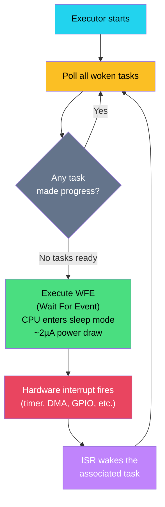

# 6. Async on Bare Metal with Embassy 🔴

> **What you'll learn:**
> - Why Tokio and other OS-based async runtimes cannot run on bare-metal `no_std` targets.
> - How Embassy's executor polls futures using hardware interrupts (WFE) to achieve microamp-level sleep.
> - How to use `embassy-time`, `embassy-nrf` (or `embassy-stm32`), and `embassy-sync` for production async firmware.
> - The fundamental trade-offs between Embassy (cooperative async) and RTIC (preemptive priority-based).

---

## Why Tokio Doesn't Work Here

If you've read the [Async Rust](../async-book/src/SUMMARY.md) companion guide, you know that async Rust requires three things:
1. **Futures** — the state machines generated by `async fn`.
2. **A Waker** — the mechanism to notify the executor that a future is ready to make progress.
3. **An Executor** — the runtime that polls futures when they're woken.

Tokio provides all three — but it depends on `std` for:
- **`epoll`/`kqueue`/`io_uring`** — OS-level I/O event notification.
- **OS threads** — for its multi-threaded work-stealing executor.
- **Heap allocation** — for spawning tasks (`Box<dyn Future>`).
- **Timers** — backed by OS clock facilities.

None of these exist on a microcontroller. **Embassy** is a ground-up replacement that provides the same three components using only hardware:

| Component | Tokio | Embassy |
|---|---|---|
| I/O notification | `epoll` / `io_uring` (OS syscalls) | Hardware interrupts (NVIC) |
| Executor | Multi-threaded, work-stealing | Single-threaded, interrupt-driven |
| Timer | OS monotonic clock + timer wheel | Hardware timer peripheral (e.g., RTC, TIMER) |
| Task allocation | Heap (`Box::pin(future)`) | Static — tasks are `static` state machines |
| Sleep | `tokio::time::sleep` (OS timer) | `embassy_time::Timer::after` (hardware timer + WFE) |
| Waker | File descriptor + `eventfd` | Interrupt → sets flag → WFE wakes core |

---

## How Embassy Works

Embassy's executor loop is beautifully simple:



1. The executor polls all tasks that have been woken.
2. When no task is ready, the executor executes **WFE (Wait For Event)** — an ARM instruction that puts the core into a low-power sleep state.
3. A hardware interrupt fires (GPIO, timer, DMA completion, UART RX).
4. The interrupt handler wakes the associated task by setting a flag and issuing **SEV (Send Event)**.
5. WFE returns, the executor runs, finds the woken task, polls it.

**Key insight:** The CPU is asleep whenever it has nothing to do. There is no busy-loop, no `loop { ... }` spinning. This is why Embassy firmware often runs at **microamps** of average current.

---

## Embassy Architecture

Embassy is a collection of crates, each handling a specific layer:

| Crate | Purpose |
|---|---|
| `embassy-executor` | The async task executor (poll loop + WFE) |
| `embassy-time` | Timers, delays, `Instant`, `Duration`, `Ticker` |
| `embassy-nrf` | HAL for Nordic nRF chips (implements `embedded-hal-async`) |
| `embassy-stm32` | HAL for STM32 chips |
| `embassy-rp` | HAL for Raspberry Pi RP2040/RP2350 |
| `embassy-sync` | Async synchronization primitives: `Mutex`, `Signal`, `Channel` |
| `embassy-net` | Async TCP/IP networking stack |
| `embassy-usb` | Async USB device stack |

### A Complete Embassy Blinker

```rust
#![no_std]
#![no_main]

use embassy_executor::Spawner;
use embassy_nrf::gpio::{AnyPin, Level, Output, OutputDrive};
use embassy_time::Timer;
use {defmt_rtt as _, panic_probe as _};

/// The main task — entry point for the Embassy executor.
#[embassy_executor::main]
async fn main(_spawner: Spawner) {
    // Initialize all peripherals with default config (clock tree, power, etc.)
    let p = embassy_nrf::init(Default::default());

    // Configure LED pin
    let mut led = Output::new(
        AnyPin::from(p.P0_13), // LED 1 on nRF52840-DK
        Level::High,            // Start off (active-low)
        OutputDrive::Standard,
    );

    loop {
        led.set_low();                     // LED on
        Timer::after_millis(500).await;    // Async sleep — CPU enters WFE
        led.set_high();                    // LED off
        Timer::after_millis(500).await;
    }
}
```

Compare this to the raw volatile version from Chapter 2 — it's the same hardware operation, but:
- **No `unsafe`** — Embassy's HAL handles register access.
- **No busy-wait** — `Timer::after_millis(500).await` yields to the executor, which executes WFE.
- **Automatic clock init** — `embassy_nrf::init()` configures the clock tree, enables peripherals.

---

## Spawning Concurrent Tasks

Embassy's killer feature is **concurrent async tasks** — multiple independent state machines running cooperatively on a single core:

```rust
#![no_std]
#![no_main]

use embassy_executor::Spawner;
use embassy_nrf::gpio::{AnyPin, Input, Level, Output, OutputDrive, Pull};
use embassy_time::Timer;
use {defmt_rtt as _, panic_probe as _};

/// Task 1: Blink an LED at 1 Hz
#[embassy_executor::task]
async fn blink_led(pin: AnyPin) {
    let mut led = Output::new(pin, Level::High, OutputDrive::Standard);
    loop {
        led.toggle();
        Timer::after_millis(500).await;
    }
}

/// Task 2: Log button presses
#[embassy_executor::task]
async fn monitor_button(pin: AnyPin) {
    let mut button = Input::new(pin, Pull::Up);
    loop {
        // Wait for the pin to go low (button pressed) — async, no polling
        button.wait_for_low().await;
        defmt::info!("Button pressed!");

        // Debounce: wait 50ms before accepting another press
        Timer::after_millis(50).await;

        // Wait for release
        button.wait_for_high().await;
        defmt::info!("Button released!");
    }
}

#[embassy_executor::main]
async fn main(spawner: Spawner) {
    let p = embassy_nrf::init(Default::default());

    // Spawn both tasks — they run concurrently
    spawner.spawn(blink_led(p.P0_13.into())).unwrap();
    spawner.spawn(monitor_button(p.P0_11.into())).unwrap();

    // Main task has nothing else to do
    // The executor keeps running the spawned tasks
}
```

Both tasks run "simultaneously" — when one is `.await`-ing (sleeping, waiting for GPIO), the other gets to run. The executor juggles between them, sleeping the CPU whenever both are waiting.

### Static Task Allocation

Unlike Tokio's `tokio::spawn()` which heap-allocates the future, Embassy tasks are **statically allocated**. The `#[embassy_executor::task]` macro creates a `static` slot for the task's state machine. This means:

- **Zero heap allocation** — each task lives in a `static`.
- **Fixed task count** — you can't spawn unlimited tasks at runtime.
- **Predictable memory usage** — you know at compile time how much RAM tasks consume.

```rust
// Embassy internally generates something like:
static BLINK_LED_TASK: StaticCell<TaskStorage<BlinkLedFuture>> =
    StaticCell::new();
```

---

## Async I/O: DMA-Backed Peripherals

The real power of Embassy shows in I/O operations. Traditional embedded code blocks the CPU during peripheral transfers. Embassy yields to the executor:

### Traditional (Blocking) SPI Transfer

```rust
// Blocking — CPU is busy for the entire transfer duration
fn read_sensor_blocking(spi: &mut Spi) -> [u8; 6] {
    let mut buf = [0u8; 6];
    spi.transfer(&mut buf, &[0x80 | REG_ADDR]).unwrap(); // CPU spins here
    buf
}
```

### Embassy (Async DMA) SPI Transfer

```rust
// Async — CPU sleeps during DMA transfer
async fn read_sensor_async(spi: &mut Spim<'_, impl Instance>) -> [u8; 6] {
    let mut buf = [0u8; 6];
    let cmd = [0x80 | REG_ADDR];
    spi.transfer(&mut buf, &cmd).await.unwrap();
    // ☝️ .await yields to executor → executor runs WFE → CPU sleeps
    //    DMA hardware moves bytes independently
    //    DMA complete interrupt → wakes this task → .await returns
    buf
}
```

The `await` here is not just syntactic sugar — it represents a **hardware state transition**:

1. Task calls `spi.transfer(...)` — Embassy configures the DMA controller.
2. `.await` — the task yields. Executor runs other tasks, then WFE.
3. DMA hardware moves bytes without CPU involvement.
4. DMA complete interrupt fires → wakes the task.
5. `.await` returns — transfer complete, CPU was asleep for most of it.

---

## `embassy-sync`: Async Synchronization Primitives

Embassy provides `no_std`-compatible, async-aware synchronization primitives:

### Channel — Multi-Producer, Single-Consumer

```rust
use embassy_sync::channel::Channel;
use embassy_sync::blocking_mutex::raw::CriticalSectionRawMutex;

// A channel that can hold 4 sensor readings
static SENSOR_CHANNEL: Channel<CriticalSectionRawMutex, SensorReading, 4> =
    Channel::new();

#[derive(Clone, Copy)]
struct SensorReading {
    temperature: i16,  // in 0.01°C
    humidity: u16,     // in 0.01%
}

#[embassy_executor::task]
async fn sensor_task(/* ... */) {
    loop {
        let reading = read_sensor().await;
        SENSOR_CHANNEL.send(reading).await; // Blocks if channel full
        Timer::after_secs(5).await;
    }
}

#[embassy_executor::task]
async fn display_task(/* ... */) {
    loop {
        let reading = SENSOR_CHANNEL.receive().await; // Blocks if channel empty
        defmt::info!("Temp: {}°C, Humidity: {}%",
            reading.temperature as f32 / 100.0,
            reading.humidity as f32 / 100.0
        );
    }
}
```

### Signal — Last-Writer-Wins

```rust
use embassy_sync::signal::Signal;
use embassy_sync::blocking_mutex::raw::CriticalSectionRawMutex;

static BUTTON_SIGNAL: Signal<CriticalSectionRawMutex, ()> = Signal::new();

#[embassy_executor::task]
async fn button_task(pin: AnyPin) {
    let mut button = Input::new(pin, Pull::Up);
    loop {
        button.wait_for_falling_edge().await;
        BUTTON_SIGNAL.signal(()); // Wake anyone waiting on this signal
        Timer::after_millis(50).await; // Debounce
    }
}

#[embassy_executor::task]
async fn handler_task() {
    loop {
        BUTTON_SIGNAL.wait().await; // Sleep until signaled
        defmt::info!("Button event received!");
    }
}
```

### Mutex — Async-Aware Lock

```rust
use embassy_sync::mutex::Mutex;
use embassy_sync::blocking_mutex::raw::CriticalSectionRawMutex;

static SHARED_STATE: Mutex<CriticalSectionRawMutex, SharedState> =
    Mutex::new(SharedState { count: 0, last_reading: 0 });

struct SharedState {
    count: u32,
    last_reading: i16,
}

#[embassy_executor::task]
async fn writer_task() {
    loop {
        {
            let mut state = SHARED_STATE.lock().await;
            state.count += 1;
            state.last_reading = read_sensor().await;
        } // Lock released here
        Timer::after_secs(1).await;
    }
}
```

---

## `embassy-time`: Hardware-Backed Timers

`embassy-time` provides ergonomic time utilities backed by a hardware timer:

```rust
use embassy_time::{Duration, Instant, Ticker, Timer};

// One-shot delay
Timer::after(Duration::from_millis(100)).await;
Timer::after_secs(1).await;
Timer::after_millis(500).await;

// Periodic ticker — compensates for execution time drift
let mut ticker = Ticker::every(Duration::from_millis(100));
loop {
    do_work().await;
    ticker.next().await; // Waits for the NEXT 100ms boundary
}

// Timeouts
use embassy_time::with_timeout;
match with_timeout(Duration::from_secs(5), sensor.read()).await {
    Ok(reading) => defmt::info!("Got reading: {}", reading),
    Err(_) => defmt::warn!("Sensor read timed out!"),
}

// Timestamps
let start = Instant::now();
do_work().await;
let elapsed = start.elapsed();
defmt::info!("Work took {} ms", elapsed.as_millis());
```

---

## Embassy vs. RTIC: Choosing the Right Model

| Aspect | RTIC (Ch 5) | Embassy |
|---|---|---|
| **Concurrency model** | Preemptive (hardware priorities) | Cooperative (async/await) |
| **Task preemption** | Higher-priority task preempts lower | Tasks yield at `.await` points |
| **Worst-case latency** | Bounded (priority analysis) | Unbounded (depends on longest `.await`-free section) |
| **Hard real-time?** | ✅ Yes | ❌ No (soft real-time) |
| **Power management** | Manual WFI | Automatic WFE (integrated) |
| **I/O pattern** | Interrupt + deferred processing | Async DMA, zero-copy |
| **Shared state** | `lock()` with priority ceiling | `Mutex`, `Channel`, `Signal` |
| **Learning curve** | Priority analysis, SRP | Async/await (familiar to Tokio users) |
| **Best for** | Motor control, audio, safety-critical | IoT sensors, networking, complex async I/O |

**Rule of thumb:** If you need **guaranteed interrupt response time** (motor control, audio, safety-critical), use RTIC. If you need **complex async I/O** (networking, multiple sensors, USB), use Embassy. They can even coexist in the same project.

---

<details>
<summary><strong>🏋️ Exercise: Async Button Counter with Embassy</strong> (click to expand)</summary>

**Challenge:** Build an Embassy application with three concurrent tasks:

1. **`blink_task`**: Toggles an LED every 250ms.
2. **`button_task`**: Waits for button presses and sends a count via a `Channel`.
3. **`display_task`**: Receives counts from the channel and logs them via `defmt`.

**Requirements:**
- Use `embassy_sync::channel::Channel` with capacity 8.
- Use `embassy_time::Timer` for the blink delay.
- Use `Input::wait_for_falling_edge()` for button detection.
- Include 50ms debounce after each press.

<details>
<summary>🔑 Solution</summary>

```rust
#![no_std]
#![no_main]

use embassy_executor::Spawner;
use embassy_nrf::gpio::{AnyPin, Input, Level, Output, OutputDrive, Pull};
use embassy_sync::blocking_mutex::raw::CriticalSectionRawMutex;
use embassy_sync::channel::Channel;
use embassy_time::Timer;
use {defmt_rtt as _, panic_probe as _};

/// Channel for passing button press counts from button_task → display_task
static PRESS_CHANNEL: Channel<CriticalSectionRawMutex, u32, 8> = Channel::new();

/// Task 1: Blink LED at 250ms intervals (2 Hz)
#[embassy_executor::task]
async fn blink_task(pin: AnyPin) {
    let mut led = Output::new(pin, Level::High, OutputDrive::Standard);
    loop {
        led.toggle();
        Timer::after_millis(250).await; // Yields — CPU sleeps via WFE
    }
}

/// Task 2: Monitor button, count presses, send to channel
#[embassy_executor::task]
async fn button_task(pin: AnyPin) {
    let mut button = Input::new(pin, Pull::Up);
    let mut count: u32 = 0;

    loop {
        // Wait for falling edge — async, no CPU usage while waiting
        button.wait_for_falling_edge().await;

        count += 1;
        defmt::info!("Button press #{}", count);

        // Send the count to the display task
        PRESS_CHANNEL.send(count).await;

        // Debounce: ignore further edges for 50ms
        Timer::after_millis(50).await;

        // Wait for button release before accepting another press
        button.wait_for_high().await;
        Timer::after_millis(50).await; // Debounce release
    }
}

/// Task 3: Receive and log press counts
#[embassy_executor::task]
async fn display_task() {
    loop {
        let count = PRESS_CHANNEL.receive().await;
        defmt::info!("Display: total presses = {}", count);

        // In a real application, you'd update an LCD, send over BLE, etc.
    }
}

/// Entry point — spawns all tasks and exits
#[embassy_executor::main]
async fn main(spawner: Spawner) {
    let p = embassy_nrf::init(Default::default());

    // Spawn all three concurrent tasks
    spawner.spawn(blink_task(p.P0_13.into())).unwrap();
    spawner.spawn(button_task(p.P0_11.into())).unwrap();
    spawner.spawn(display_task()).unwrap();

    // Main returns — executor keeps running spawned tasks
    // CPU will alternate between running ready tasks and sleeping (WFE)
}
```

**Power analysis:**
- While waiting (most of the time): CPU is in WFE sleep → ~2µA.
- While polling a woken task: CPU active → ~5mA, but only for microseconds.
- Average current at 1 button press/second: < 10µA.

</details>
</details>

---

> **Key Takeaways**
> - Embassy is a **ground-up async runtime for bare metal** — it replaces Tokio's OS-dependent I/O with hardware interrupts and DMA.
> - The executor loop: poll tasks → no tasks ready → WFE (sleep) → interrupt wakes task → repeat. This achieves **microamp-level power consumption**.
> - Tasks are **statically allocated** — no heap, predictable memory usage.
> - `embassy-sync` provides async `Channel`, `Signal`, and `Mutex` — familiar concurrency primitives that work without an OS.
> - Embassy enables **DMA-backed async I/O** — the CPU sleeps while peripherals transfer data independently.
> - Embassy is **cooperative** (tasks yield at `.await`), not preemptive. For hard real-time guarantees, use RTIC instead.

> **See also:**
> - [Ch 5: RTIC](ch05-rtic.md) — the preemptive alternative for hard real-time requirements.
> - [Ch 7: Capstone Project](ch07-capstone-async-sensor-node.md) — a production Embassy application combining everything.
> - [Async Rust: From Futures to Production](../async-book/src/SUMMARY.md) — deep dive on `Future`, `Poll`, `Waker`, and async state machines.
> - [Concurrency in Rust](../concurrency-book/src/SUMMARY.md) — the OS-thread concurrency patterns that Embassy's `Channel` and `Mutex` mirror.
