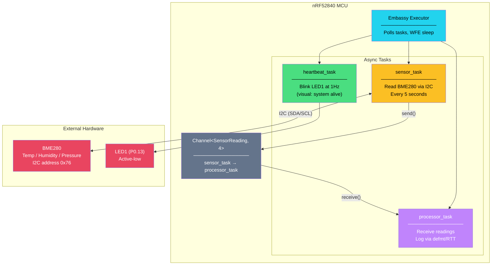

# 7. Capstone: The Async Environmental Sensor Node 🔴

> **What you'll learn:**
> - How to structure a production-grade Embassy firmware project from `Cargo.toml` to flash.
> - How to initialize the hardware clock tree and Embassy async executor on an nRF52840.
> - How to communicate with an external BME280 sensor via async I2C using `embedded-hal-async` traits.
> - How to coordinate multiple async tasks (sensor reading, LED heartbeat) via `embassy_sync::channel`.
> - How to achieve deep sleep (WFE/WFI) automatically when waiting for I2C DMA transfers.

---

## Project Overview

We're building a **low-power IoT sensor node** — the kind of firmware that ships in millions of environmental monitors, HVAC sensors, and agricultural devices. The architecture:



### Hardware Requirements

| Component | Purpose | Connection |
|---|---|---|
| nRF52840-DK (or STM32 equivalent) | Target MCU | USB to host for programming |
| BME280 breakout board | Temperature, humidity, pressure | I2C: SDA → P0.26, SCL → P0.27 |
| Debug probe (built into DK) | Flashing + RTT logging | USB |

> **No BME280?** You can still follow along — we provide a mock sensor implementation that returns synthetic data.

---

## Project Structure

```
sensor-node/
├── .cargo/
│   └── config.toml          # Target, runner, linker script
├── Cargo.toml                # Dependencies
├── build.rs                  # (empty — embassy-nrf handles linker script)
├── memory.x                  # Memory layout (Flash + RAM sizes)
└── src/
    └── main.rs               # All firmware logic
```

### `Cargo.toml`

```toml
[package]
name = "sensor-node"
version = "0.1.0"
edition = "2021"

[dependencies]
# Embassy core
embassy-executor = { version = "0.6", features = ["arch-cortex-m", "executor-thread"] }
embassy-time = { version = "0.4", features = ["tick-hz-32_768"] }
embassy-sync = "0.6"

# Embassy HAL for nRF52840
embassy-nrf = { version = "0.2", features = [
    "nrf52840",
    "time-driver-rtc1",      # Use RTC1 as the time driver
    "gpiote",                 # Async GPIO events
] }

# Cortex-M runtime
cortex-m = { version = "0.7", features = ["critical-section-single-core"] }
cortex-m-rt = "0.7"

# Logging
defmt = "0.3"
defmt-rtt = "0.4"
panic-probe = { version = "0.3", features = ["print-defmt"] }

# Embedded HAL async traits
embedded-hal-async = "1.0"

# Static allocation helpers
static_cell = "2"

[profile.release]
debug = 2         # Full debug info even in release (for defmt + probe-rs)
opt-level = "s"   # Optimize for size — typical for embedded
lto = true         # Link-time optimization — smaller + faster binary
```

### `.cargo/config.toml`

```toml
[build]
target = "thumbv7em-none-eabihf"

[target.thumbv7em-none-eabihf]
runner = "probe-rs run --chip nRF52840_xxAA"
rustflags = ["-C", "link-arg=-Tlink.x", "-C", "link-arg=-Tdefmt.x"]

[env]
DEFMT_LOG = "info"
```

### `memory.x` (Memory Layout)

```
/* nRF52840 memory layout */
MEMORY
{
    FLASH : ORIGIN = 0x00000000, LENGTH = 1024K
    RAM   : ORIGIN = 0x20000000, LENGTH = 256K
}
```

---

## The Complete Firmware

```rust
// src/main.rs
#![no_std]
#![no_main]

use embassy_executor::Spawner;
use embassy_nrf::gpio::{AnyPin, Level, Output, OutputDrive};
use embassy_nrf::twim::{self, Twim};       // TWI Master = I2C on Nordic chips
use embassy_nrf::{bind_interrupts, peripherals};
use embassy_sync::blocking_mutex::raw::CriticalSectionRawMutex;
use embassy_sync::channel::Channel;
use embassy_time::Timer;

use defmt::*;
use {defmt_rtt as _, panic_probe as _};

// ── Types ────────────────────────────────────────────────────

/// A single environmental reading from the BME280 sensor.
#[derive(Clone, Copy, Format)]  // `Format` is defmt's zero-cost Debug
struct SensorReading {
    /// Temperature in hundredths of a degree Celsius (e.g., 2350 = 23.50°C)
    temperature_c100: i32,
    /// Relative humidity in hundredths of a percent (e.g., 6500 = 65.00%)
    humidity_pct100: u32,
    /// Atmospheric pressure in Pascals (e.g., 101325 = 1013.25 hPa)
    pressure_pa: u32,
}

// ── Shared Channel ──────────────────────────────────────────

/// Channel: sensor_task → processor_task
/// Capacity 4: allows sensor to buffer readings if processor is busy.
static SENSOR_CHANNEL: Channel<CriticalSectionRawMutex, SensorReading, 4> =
    Channel::new();

// ── Interrupt Binding ───────────────────────────────────────

// Embassy requires explicit interrupt binding for async peripherals.
// This connects the TWIM0 (I2C) hardware interrupt to Embassy's async driver.
bind_interrupts!(struct Irqs {
    SPIM0_SPIS0_TWIM0_TWIS0_SPI0_TWI0 => twim::InterruptHandler<peripherals::TWISPI0>;
});

// ── Task 1: Sensor Reading ──────────────────────────────────

/// Reads the BME280 sensor every 5 seconds and sends readings
/// through the channel.
///
/// The I2C transfer is DMA-backed and async — the CPU sleeps
/// (WFE) while bytes are being transferred over the wire.
#[embassy_executor::task]
async fn sensor_task(twim_periph: peripherals::TWISPI0,
                     sda_pin: peripherals::P0_26,
                     scl_pin: peripherals::P0_27) {
    // Configure I2C (TWI Master) at 400 kHz
    let config = twim::Config::default(); // 100 kHz default; can set to 400 kHz
    let mut i2c = Twim::new(twim_periph, Irqs, sda_pin, scl_pin, config);

    // BME280 I2C address (SDO pin low = 0x76, SDO pin high = 0x77)
    const BME280_ADDR: u8 = 0x76;

    // ── Sensor Initialization ──
    // Reset the sensor
    let reset_cmd: [u8; 2] = [0xE0, 0xB6]; // Register 0xE0, value 0xB6 = soft reset
    if let Err(e) = i2c.write(BME280_ADDR, &reset_cmd).await {
        error!("BME280 reset failed: {:?}", e);
    }
    Timer::after_millis(10).await; // Wait for reset to complete

    // Verify chip ID (should be 0x60 for BME280)
    let mut chip_id = [0u8; 1];
    match i2c.write_read(BME280_ADDR, &[0xD0], &mut chip_id).await {
        Ok(()) => {
            if chip_id[0] == 0x60 {
                info!("BME280 detected (chip ID: {:#04x})", chip_id[0]);
            } else {
                warn!("Unexpected chip ID: {:#04x} (expected 0x60)", chip_id[0]);
            }
        }
        Err(e) => {
            error!("Failed to read BME280 chip ID: {:?}", e);
            error!("Check wiring: SDA=P0.26, SCL=P0.27, VCC=3.3V");
            // Continue anyway — might work with a different sensor
        }
    }

    // Configure oversampling: temp x2, humidity x1, pressure x16, normal mode
    // ctrl_hum (0xF2): osrs_h = 001 (x1)
    i2c.write(BME280_ADDR, &[0xF2, 0b001]).await.ok();
    // ctrl_meas (0xF4): osrs_t = 010 (x2), osrs_p = 101 (x16), mode = 11 (normal)
    i2c.write(BME280_ADDR, &[0xF4, 0b010_101_11]).await.ok();
    // config (0xF5): t_sb = 101 (1000ms standby), filter = 010 (coeff 4)
    i2c.write(BME280_ADDR, &[0xF5, 0b101_010_00]).await.ok();

    info!("BME280 configured. Starting measurement loop.");

    // ── Measurement Loop ──
    loop {
        // Read raw data registers: 0xF7..0xFE (8 bytes: press[3], temp[3], hum[2])
        let mut raw = [0u8; 8];
        match i2c.write_read(BME280_ADDR, &[0xF7], &mut raw).await {
            Ok(()) => {
                // Parse raw values (simplified — production code uses calibration data)
                let raw_press = ((raw[0] as u32) << 12) | ((raw[1] as u32) << 4) | ((raw[2] as u32) >> 4);
                let raw_temp = ((raw[3] as u32) << 12) | ((raw[4] as u32) << 4) | ((raw[5] as u32) >> 4);
                let raw_hum = ((raw[6] as u32) << 8) | (raw[7] as u32);

                // Simplified conversion (not using full calibration — see BME280 datasheet §4.2)
                // In production, read calibration registers 0x88..0xA1 and 0xE1..0xE7
                let reading = SensorReading {
                    temperature_c100: (raw_temp as i32 - 400_000) / 100,
                    humidity_pct100: (raw_hum * 100) / 1024,
                    pressure_pa: raw_press * 100 / 256,
                };

                // Send through the channel — blocks if channel is full (backpressure)
                SENSOR_CHANNEL.send(reading).await;
            }
            Err(e) => {
                error!("I2C read failed: {:?}", e);
            }
        }

        // Wait 5 seconds — CPU enters deep sleep (WFE) during this time
        Timer::after_secs(5).await;
    }
}

// ── Task 2: Heartbeat LED ───────────────────────────────────

/// Blinks LED1 at 1 Hz to indicate the system is alive.
/// This task runs completely independently of the sensor task.
#[embassy_executor::task]
async fn heartbeat_task(pin: AnyPin) {
    let mut led = Output::new(pin, Level::High, OutputDrive::Standard);

    loop {
        led.set_low();                      // LED on (active-low)
        Timer::after_millis(100).await;     // Short flash — visible but power-efficient
        led.set_high();                     // LED off
        Timer::after_millis(900).await;     // Long off period
    }
}

// ── Task 3: Processing / Logging ────────────────────────────

/// Receives sensor readings and processes them.
/// In production, this would transmit via BLE, LoRa, or store to flash.
#[embassy_executor::task]
async fn processor_task() {
    let mut reading_count: u32 = 0;

    loop {
        // Wait for a reading from the sensor task
        let reading = SENSOR_CHANNEL.receive().await;
        reading_count += 1;

        info!(
            "Reading #{}: temp={}.{}°C, humidity={}.{}%, pressure={} Pa",
            reading_count,
            reading.temperature_c100 / 100,
            (reading.temperature_c100 % 100).abs(),
            reading.humidity_pct100 / 100,
            reading.humidity_pct100 % 100,
            reading.pressure_pa,
        );

        // In production, you would:
        // - Apply calibration compensation (BME280 §4.2.3)
        // - Average multiple readings (sliding window)
        // - Transmit via BLE (embassy-nrf softdevice) or LoRa
        // - Store to external flash for data logging
        // - Check thresholds and trigger alerts
    }
}

// ── Main ────────────────────────────────────────────────────

#[embassy_executor::main]
async fn main(spawner: Spawner) {
    // Initialize all nRF52840 peripherals with default configuration.
    // This sets up:
    //   - Clock tree (HFCLK from internal RC, LFCLK for RTC)
    //   - Power management
    //   - All peripheral instances
    let p = embassy_nrf::init(Default::default());

    info!("═══════════════════════════════════════════");
    info!("  Async Environmental Sensor Node v0.1.0  ");
    info!("═══════════════════════════════════════════");
    info!("Target: nRF52840");
    info!("Sensor: BME280 (I2C @ 0x76)");
    info!("Sample interval: 5s");
    info!("");

    // Spawn all three concurrent tasks.
    // Each task receives ownership of its hardware resources.
    // The type system ensures no two tasks can access the same peripheral.

    // Sensor task gets the I2C peripheral and data pins
    spawner.spawn(sensor_task(p.TWISPI0, p.P0_26, p.P0_27)).unwrap();

    // Heartbeat task gets LED1 pin
    spawner.spawn(heartbeat_task(p.P0_13.into())).unwrap();

    // Processor task reads from the channel — no hardware needed
    spawner.spawn(processor_task()).unwrap();

    info!("All tasks spawned. Entering async event loop.");
    // Main task returns. The executor keeps running the spawned tasks.
    // The system will now alternate between:
    //   1. Running ready tasks (microseconds of CPU time)
    //   2. WFE sleep (milliseconds to seconds of deep sleep)
}
```

---

## Power Analysis

Let's analyze the power consumption of this firmware:

| State | Duration | Current Draw | Duty Cycle |
|---|---|---|---|
| Deep sleep (WFE) | ~4.998s per 5s cycle | ~2 µA | ~99.96% |
| I2C DMA transfer | ~200 µs | ~5 mA | ~0.004% |
| Task processing | ~50 µs | ~5 mA | ~0.001% |
| LED on | 100ms per 1s cycle | ~1 mA (LED) + ~5 mA (CPU) | ~10% |

**Average current (without LED):** ~2.2 µA → **Years on a coin cell battery.**

**Average current (with LED heartbeat):** ~600 µA → **Months on a CR2032.**

In production, you'd disable the heartbeat LED and use it only during development.

---

## Building and Flashing

```bash
# Install the target
rustup target add thumbv7em-none-eabihf

# Install probe-rs (flash + RTT log viewer)
cargo install probe-rs-tools

# Build in release mode
cargo build --release

# Flash and view logs in real-time
cargo run --release
# Output:
#   INFO  ═══════════════════════════════════════════
#   INFO    Async Environmental Sensor Node v0.1.0
#   INFO  ═══════════════════════════════════════════
#   INFO  Target: nRF52840
#   INFO  Sensor: BME280 (I2C @ 0x76)
#   INFO  BME280 detected (chip ID: 0x60)
#   INFO  BME280 configured. Starting measurement loop.
#   INFO  All tasks spawned. Entering async event loop.
#   INFO  Reading #1: temp=23.50°C, humidity=45.20%, pressure=101325 Pa
#   INFO  Reading #2: temp=23.51°C, humidity=45.18%, pressure=101320 Pa
```

---

## Extending the Capstone

Here are production enhancements you'd add next:

| Enhancement | Crate / Technique |
|---|---|
| BLE advertising | `nrf-softdevice` or `trouble` (Rust BLE stack) |
| LoRa transmission | `embassy-lora` + SX1276/SX1262 driver |
| External flash logging | `embassy-nrf` QSPI driver + `sequential-storage` |
| Watchdog timer | `embassy-nrf` WDT peripheral |
| OTA firmware update | `embassy-boot` bootloader |
| Deep sleep between readings | `embassy-nrf` SYSTEM OFF mode |
| Battery voltage monitoring | ADC via `embassy-nrf` SAADC |

---

<details>
<summary><strong>🏋️ Exercise: Add a Fourth Task — Alarm Monitor</strong> (click to expand)</summary>

**Challenge:** Extend the capstone with a fourth async task:

1. **`alarm_task`**: Monitors sensor readings via a second channel (or shared signal).
2. When temperature exceeds 30.00°C (3000 in `temperature_c100`), blink LED2 (P0.14) rapidly (100ms on/off).
3. When temperature returns below 28.00°C, stop blinking LED2.
4. Use `embassy_sync::signal::Signal` to receive an "alarm active" boolean from `processor_task`.

**Requirements:**
- `processor_task` evaluates the threshold and signals `alarm_task`.
- `alarm_task` only wakes when the alarm state changes.
- Implement hysteresis (different on/off thresholds) to prevent rapid toggling.

<details>
<summary>🔑 Solution</summary>

```rust
use embassy_sync::signal::Signal;
use core::sync::atomic::{AtomicBool, Ordering};

/// Alarm state signal: processor_task → alarm_task
static ALARM_SIGNAL: Signal<CriticalSectionRawMutex, bool> = Signal::new();

/// Track alarm state to implement hysteresis
static ALARM_ACTIVE: AtomicBool = AtomicBool::new(false);

/// Modified processor_task — now evaluates alarm thresholds
#[embassy_executor::task]
async fn processor_task() {
    let mut reading_count: u32 = 0;

    // Hysteresis thresholds (in hundredths of °C)
    const ALARM_ON_THRESHOLD: i32 = 3000;   // 30.00°C — alarm triggers
    const ALARM_OFF_THRESHOLD: i32 = 2800;  // 28.00°C — alarm clears

    loop {
        let reading = SENSOR_CHANNEL.receive().await;
        reading_count += 1;

        info!(
            "Reading #{}: temp={}.{}°C",
            reading_count,
            reading.temperature_c100 / 100,
            (reading.temperature_c100 % 100).abs(),
        );

        // Evaluate alarm with hysteresis
        let currently_active = ALARM_ACTIVE.load(Ordering::Relaxed);
        let should_be_active = if currently_active {
            // Already alarming — only clear below OFF threshold
            reading.temperature_c100 >= ALARM_OFF_THRESHOLD
        } else {
            // Not alarming — only trigger above ON threshold
            reading.temperature_c100 >= ALARM_ON_THRESHOLD
        };

        if should_be_active != currently_active {
            ALARM_ACTIVE.store(should_be_active, Ordering::Relaxed);
            ALARM_SIGNAL.signal(should_be_active);

            if should_be_active {
                warn!("🔥 ALARM: Temperature exceeded {}°C!",
                    ALARM_ON_THRESHOLD / 100);
            } else {
                info!("✅ Alarm cleared: Temperature below {}°C",
                    ALARM_OFF_THRESHOLD / 100);
            }
        }
    }
}

/// Alarm task — blinks LED2 when temperature exceeds threshold
#[embassy_executor::task]
async fn alarm_task(pin: AnyPin) {
    let mut led = Output::new(pin, Level::High, OutputDrive::Standard);

    loop {
        // Wait for alarm state change
        let alarm_on = ALARM_SIGNAL.wait().await;

        if alarm_on {
            // Rapid blink until alarm clears
            loop {
                led.set_low();   // LED on
                Timer::after_millis(100).await;
                led.set_high();  // LED off
                Timer::after_millis(100).await;

                // Check if alarm was cleared while we were blinking
                // try_get() is non-blocking — returns None if no new signal
                if let Some(false) = ALARM_SIGNAL.try_take() {
                    led.set_high(); // Ensure LED is off
                    break;
                }
            }
        }
        // If alarm_on was false, just loop back and wait for next signal
    }
}

// In main(), add:
// spawner.spawn(alarm_task(p.P0_14.into())).unwrap();
```

**Design notes:**
- **Hysteresis** prevents rapid alarm toggling when temperature hovers near the threshold. The ON threshold (30°C) is higher than the OFF threshold (28°C), creating a 2°C dead band.
- **`Signal`** is "last-writer-wins" — if multiple readings trigger before `alarm_task` wakes, it only sees the latest state. This is correct for an alarm (we care about current state, not history).
- **`try_take()`** checks for a signal without blocking — used inside the blink loop to detect alarm cancellation without stopping the blink pattern.

</details>
</details>

---

> **Key Takeaways**
> - A production Embassy firmware consists of: `Cargo.toml` with embassy crates, `.cargo/config.toml` for the target, `memory.x` for the memory layout, and `main.rs` with async tasks.
> - `embassy_nrf::init()` configures the entire clock tree and peripheral system. You get type-safe, move-based ownership of each peripheral.
> - Async I2C via `Twim` uses DMA — the CPU sleeps during byte transfers, waking only on completion.
> - `embassy_sync::channel::Channel` provides backpressure-aware, async inter-task communication — the embedded equivalent of Tokio's `mpsc`.
> - Power consumption is dominated by sleep time. With 5-second measurement intervals, average draw is single-digit microamps.
> - This architecture scales: add BLE, LoRa, flash logging, or OTA updates by spawning additional tasks.

> **See also:**
> - [Ch 6: Embassy Async](ch06-async-bare-metal-embassy.md) — the Embassy fundamentals this capstone builds on.
> - [Ch 3: Ecosystem Stack](ch03-embedded-rust-ecosystem-stack.md) — understanding the PAC/HAL/BSP layers underlying Embassy's HAL.
> - [Async Rust: From Futures to Production](../async-book/src/SUMMARY.md) — the async programming model.
> - [Enterprise Rust](../enterprise-rust-book/src/SUMMARY.md) — observability and supply chain practices for shipping firmware.
