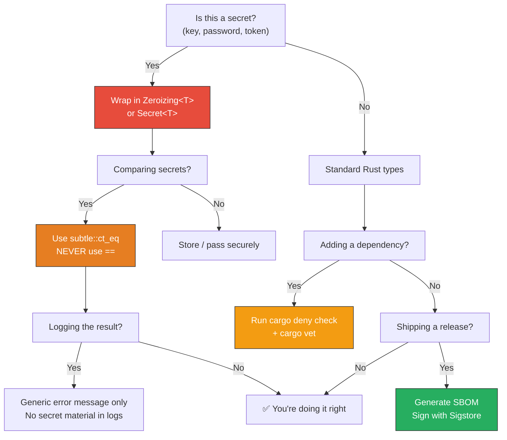

# Appendix A: Enterprise Rust Reference Card

> A quick-reference cheat sheet for the crates, macros, configurations, and patterns covered in this book. Print this out. Pin it above your desk. Refer to it every code review.

---

## `tracing` — Structured Diagnostics

### Macros

| Macro | Purpose | Example |
|-------|---------|---------|
| `tracing::info!(key = %val, "msg")` | Emit an event at INFO level | `info!(user_id = %id, "login succeeded")` |
| `tracing::warn!(key = %val, "msg")` | Emit a warning event | `warn!("rate limit exceeded")` |
| `tracing::error!(key = %val, "msg")` | Emit an error event | `error!(err = %e, "database connection failed")` |
| `tracing::debug!(key = %val, "msg")` | Emit a debug event | `debug!(query = %sql, "executing query")` |
| `tracing::trace!(key = %val, "msg")` | Emit a trace-level event | `trace!(bytes = buf.len(), "read from socket")` |
| `tracing::info_span!("name", key = %val)` | Create a named span | `let span = info_span!("process_request", req_id = %id)` |
| `#[tracing::instrument]` | Auto-instrument a function | See below |

### `#[instrument]` Attribute

```rust
#[instrument(
    name = "custom_span_name",  // Override the default (function name)
    skip_all,                    // Don't record any arguments
    fields(user = %req.user),   // Add specific fields
    level = "info",              // Span level
    err,                         // Record Result::Err as an event
    ret,                         // Record the return value
)]
async fn handle(req: Request) -> Result<Response, Error> { ... }
```

### Subscriber Setup Pattern

```rust
use tracing_subscriber::{layer::SubscriberExt, util::SubscriberInitExt, EnvFilter};

tracing_subscriber::registry()
    .with(EnvFilter::from_default_env())       // RUST_LOG=info,my_crate=debug
    .with(tracing_subscriber::fmt::layer())    // stdout
    .with(OpenTelemetryLayer::new(tracer))     // OTLP export
    .init();
```

---

## `metrics` — Prometheus Metrics

| Macro | Type | Example |
|-------|------|---------|
| `counter!("name", "label" => value).increment(1)` | Counter | `counter!("http_requests_total", "method" => "GET").increment(1)` |
| `histogram!("name", "label" => value).record(x)` | Histogram | `histogram!("request_duration_seconds").record(0.42)` |
| `gauge!("name").increment(x)` | Gauge (up) | `gauge!("active_connections").increment(1.0)` |
| `gauge!("name").decrement(x)` | Gauge (down) | `gauge!("active_connections").decrement(1.0)` |
| `gauge!("name").set(x)` | Gauge (absolute) | `gauge!("queue_depth").set(42.0)` |

### Label Hygiene Rules

| ✅ Do | ❌ Don't |
|-------|---------|
| Bounded enums: `method`, `status_class` | Unbounded: `user_id`, `email`, `request_id` |
| Path templates: `/user/{id}` | Raw paths: `/user/12345` |
| Fewer than 100 unique combinations | Millions of label combinations |

---

## `subtle` — Constant-Time Cryptography

### Traits and Types

| Item | Usage |
|------|-------|
| `ConstantTimeEq` | `a.ct_eq(&b) -> Choice` — compare without timing leaks |
| `ConditionallySelectable` | `T::conditional_select(&a, &b, choice) -> T` — branchless select |
| `ConstantTimeGreater` | `a.ct_gt(&b) -> Choice` |
| `ConstantTimeLess` | `a.ct_lt(&b) -> Choice` |
| `Choice` | A `u8` that is `0` or `1`. Use `bool::from(choice)` to convert. |
| `CtOption<T>` | Constant-time `Option`. `CtOption::new(val, choice)` |

### Cheat Sheet

```rust
use subtle::{ConstantTimeEq, ConditionallySelectable, Choice};

// Compare two byte slices:
let equal: bool = bool::from(a.ct_eq(b));

// Branchless select:
let result = u64::conditional_select(&val_if_false, &val_if_true, choice);

// Convert bool to Choice:
let choice = Choice::from(my_bool as u8);
```

### Common Mistakes

| Mistake | Fix |
|---------|-----|
| `if a == b { ... }` on secrets | `bool::from(a.ct_eq(&b))` |
| Early return on first mismatch | Compare all bytes, then decide |
| Different timing for "user not found" vs "wrong password" | Always hash + compare, even for missing users |
| Different error messages per failure mode | Single generic error: "Invalid credentials" |

---

## `zeroize` — Memory Sanitization

### Derive Macros

```rust
use zeroize::{Zeroize, ZeroizeOnDrop};

#[derive(Zeroize, ZeroizeOnDrop)]
struct MySecret {
    key: Vec<u8>,
    password: String,
    #[zeroize(skip)]     // Don't zeroize this field
    non_secret: u64,
}
```

### Wrapper Types

| Type | Usage |
|------|-------|
| `Zeroizing<T>` | `Zeroizing::new(vec![0xDE, 0xAD])` — auto-zeroize on drop |
| `Secret<T>` (secrecy crate) | `Secret::new(value)` — zeroize + prevent logging |
| `.expose_secret()` | Access the inner value of a `Secret<T>` |

### Operational Hardening Checklist

- [ ] All secrets wrapped in `Zeroizing<T>` or `Secret<T>`
- [ ] Core dumps disabled: `ulimit -c 0`
- [ ] Swap disabled or encrypted: `swapoff -a`
- [ ] Sensitive pages locked: `mlock()` on key material
- [ ] Debug builds never deployed to production
- [ ] No secrets in environment variables (use a secrets manager)
- [ ] No secrets in log output (use `Secret<T>` to prevent)

---

## `cargo-deny` Configuration

### Minimal `deny.toml`

```toml
[advisories]
vulnerability = "deny"
unmaintained = "warn"
yanked = "deny"

[licenses]
unlicensed = "deny"
copyleft = "deny"
allow = ["MIT", "Apache-2.0", "BSD-2-Clause", "BSD-3-Clause", "ISC"]
deny = ["AGPL-3.0", "GPL-3.0", "SSPL-1.0", "BUSL-1.1"]

[bans]
multiple-versions = "warn"
wildcards = "deny"

[sources]
unknown-registry = "deny"
unknown-git = "deny"
allow-registry = ["https://github.com/rust-lang/crates.io-index"]
```

### Commands

| Command | Purpose |
|---------|---------|
| `cargo deny init` | Create `deny.toml` with defaults |
| `cargo deny check` | Run all checks |
| `cargo deny check advisories` | Check only CVEs |
| `cargo deny check licenses` | Check only licenses |
| `cargo deny check bans` | Check only bans |
| `cargo deny check sources` | Check only sources |

---

## `cargo vet` Commands

| Command | Purpose |
|---------|---------|
| `cargo vet init` | Initialize `supply-chain/` directory |
| `cargo vet` | Check all dependencies against audits |
| `cargo vet certify <crate> <version>` | Record an audit for a specific version |
| `cargo vet certify <crate> <v1> <v2>` | Record a delta audit (reviewed diff from v1→v2) |
| `cargo vet suggest` | Show easiest path to full vetting |
| `cargo vet add-exemption <crate> <ver>` | Temporarily exempt a crate |
| `cargo vet inspect <crate> <version>` | View the source code of a crate version |

### Criteria

| Criteria | What it means |
|----------|--------------|
| `safe-to-deploy` | Reviewed for production use: no UB, no malicious code, no harmful I/O |
| `safe-to-run` | Safe to execute in a sandboxed environment (less strict) |
| `does-not-implement-crypto` | Confirmed the crate does not implement cryptographic primitives |

---

## SBOM Generation

```bash
# CycloneDX (most common for applications):
cargo sbom --output-format cyclone_dx_json_1_4 > sbom.cdx.json

# SPDX (common for license compliance):
cargo sbom --output-format spdx_json_2_3 > sbom.spdx.json

# Verify contents:
cat sbom.cdx.json | jq '.components | length'
cat sbom.cdx.json | jq '.components[].name' | sort
```

---

## CI Pipeline Cheat Sheet

```yaml
# Minimal security-focused CI workflow
jobs:
  security:
    steps:
      - cargo audit                              # CVE scan
      - cargo deny check                         # License + policy
      - cargo vet                                # Peer review audit
      - cargo clippy -- -D warnings              # Lint
      - cargo test                               # Unit + integration tests
      - cargo build --release --locked           # Reproducible build
      - cargo sbom > sbom.cdx.json              # SBOM for compliance
```

### Tool Installation (one-liner)

```bash
cargo install cargo-audit cargo-deny cargo-vet cargo-sbom
```

---

## Quick Decision Tree



---

## Recommended Crate Versions (as of this writing)

| Crate | Version | Purpose |
|-------|---------|---------|
| `tracing` | 0.1 | Structured diagnostics |
| `tracing-subscriber` | 0.3 | Subscriber layers |
| `tracing-opentelemetry` | 0.29 | OTel bridge |
| `opentelemetry` | 0.28 | OTel API |
| `opentelemetry-otlp` | 0.28 | OTLP exporter |
| `opentelemetry_sdk` | 0.28 | OTel SDK |
| `metrics` | 0.24 | Metrics facade |
| `metrics-exporter-prometheus` | 0.16 | Prometheus exporter |
| `subtle` | 2.6 | Constant-time operations |
| `zeroize` | 1.x | Memory sanitization |
| `secrecy` | 0.10 | Type-level secret protection |
| `hmac` | 0.12 | HMAC computation |
| `sha2` | 0.10 | SHA-256 |
| `cargo-deny` | 0.16+ | Supply chain policy |
| `cargo-audit` | 0.21+ | CVE scanning |
| `cargo-vet` | 0.10+ | Peer review auditing |
| `cargo-sbom` | 0.9+ | SBOM generation |
