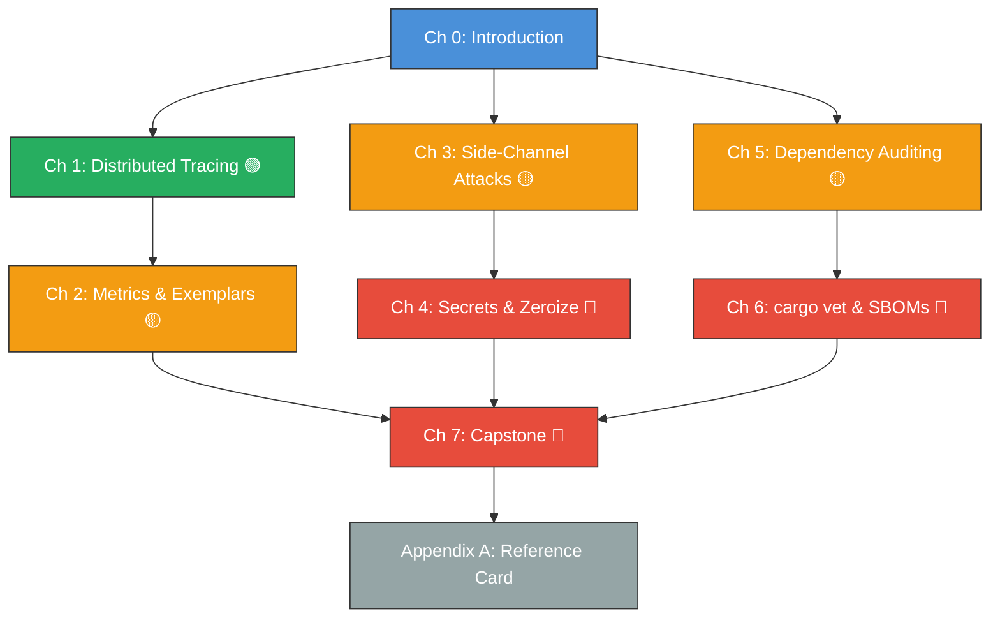

# Enterprise Rust: OpenTelemetry, Security, and Supply Chain Hygiene

## Speaker Intro

- **Principal Platform Security Architect** with 20+ years building hardened distributed systems in C++, Go, and Rust across defense, fintech, and hyperscale cloud environments.
- Former tech lead for runtime integrity at a Tier-1 cloud provider; designed the telemetry pipeline ingesting 4 billion spans/day across 12,000 microservices.
- Authored internal security standards for SLSA Level 3 compliance, constant-time cryptographic verification, and zero-trust service mesh policy at three separate Fortune 100 companies.
- Contributor to the `tracing`, `subtle`, and `cargo-deny` ecosystems. Believes that **observability** and **supply chain integrity** are not afterthoughts—they are architecture.

> **This book is the guide I wish existed when I was asked to take a Rust service from "it compiles" to "it passed FedRAMP High audit."** It covers the exact topics that auditors, red teams, and incident responders care about—and that most Rust training quietly ignores.

---

## Who This Is For

This book is designed for:

- **Staff and Principal Engineers** operating Rust services under compliance frameworks (SOC 2 Type II, FedRAMP, PCI-DSS, HIPAA).
- **Platform and SRE teams** building internal observability stacks who need to understand OpenTelemetry's Rust SDK at a deep level.
- **Security engineers** evaluating Rust for cryptographic services who need to understand timing attacks, memory sanitization, and supply chain threats specific to `crates.io`.
- **Tech leads** writing internal engineering standards for Rust adoption at their organization.

If you have shipped a Rust binary to production but have never thought about whether your HMAC comparison leaks timing information, or whether your `Cargo.lock` contains a dependency with a known CVE—this book is for you.

---

## Prerequisites

| Concept | Where to learn it |
|---|---|
| Ownership, borrowing, lifetimes | [Rust Memory Management](../memory-management-book/src/SUMMARY.md) |
| Async Rust with Tokio | [Async Rust](../async-book/src/SUMMARY.md) |
| `tracing` crate basics | [Ecosystem, Tooling & Profiling](../tooling-profiling-book/src/SUMMARY.md) |
| HTTP and gRPC service development | Experience with `axum`, `tonic`, or `actix-web` |
| Basic cryptographic concepts (hashing, HMAC, JWT) | Any applied cryptography course or *Serious Cryptography* by Aumasson |
| CI/CD pipeline familiarity | GitHub Actions, GitLab CI, or equivalent |

---

## How to Use This Book

| Emoji | Meaning in this book |
|-------|------|
| 🟢 | **Advanced** — Assumes production Rust experience. Foundational for the book's topics. |
| 🟡 | **Expert** — Requires deep understanding of the domain. Applied, operational knowledge. |
| 🔴 | **Architect-Level** — Design decisions that affect your entire organization's security posture. |

Every chapter follows a consistent structure:

1. **"What you'll learn"** — a concise list of outcomes.
2. **Core content** — with comparison tables, mermaid diagrams, and annotated code.
3. **"The Naive Way vs. The Enterprise Way"** — vulnerable code shown first (`// 💥 VULNERABILITY`), then the fix (`// ✅ FIX`).
4. **Exercise** — a hands-on challenge with a hidden solution.
5. **Key Takeaways** — the non-negotiable lessons.
6. **See also** — cross-references to related material.

---

## Pacing Guide

| Part | Chapters | Estimated Time | Key Outcome |
|------|----------|---------------|-------------|
| **I — Observability** | 1–2 | 6–8 hours | You can instrument any Rust service with distributed traces and high-cardinality metrics, and export them via OTLP. |
| **II — Cryptography & Memory** | 3–4 | 5–7 hours | You understand timing attacks, can write constant-time comparisons, and can prove secrets are erased from RAM. |
| **III — Supply Chain** | 5–6 | 4–6 hours | You can audit every dependency, generate an SBOM, and enforce license and CVE policies in CI. |
| **IV — Capstone** | 7 | 8–10 hours | You build a hardened auth service that passes a simulated SOC 2 audit checklist. |

**Total: ~25–30 hours** for a staff-level engineer working through every exercise.

---

## Table of Contents

### Part I — Observability at Scale

| # | Chapter | Difficulty | Description |
|---|---------|-----------|-------------|
| 1 | [Distributed Tracing with OpenTelemetry](ch01-distributed-tracing-with-opentelemetry.md) | 🟢 | From `println!` to production OTLP traces. The `tracing` crate's `Subscriber`, `Span`, and `Event` model. Context propagation across HTTP and gRPC boundaries. Exporting to Jaeger and Grafana Tempo. |
| 2 | [High-Cardinality Metrics and Exemplars](ch02-high-cardinality-metrics-and-exemplars.md) | 🟡 | The `metrics` crate and Prometheus exposition. Histograms, counters, and gauges. Exemplars that tie metric spikes to individual trace IDs. Avoiding cardinality explosions. |

### Part II — Cryptography and Memory Security

| # | Chapter | Difficulty | Description |
|---|---------|-----------|-------------|
| 3 | [Mitigating Side-Channel Attacks](ch03-mitigating-side-channel-attacks.md) | 🟡 | Why `==` is dangerous for secrets. The `subtle` crate's `ConstantTimeEq` and `ConditionallySelectable`. Writing code that doesn't leak information via CPU branch prediction or cache timing. |
| 4 | [Secrets Management and Memory Sanitization](ch04-secrets-management-and-memory-sanitization.md) | 🔴 | Heap dumps, core files, and `/proc/pid/mem` as attack vectors. The `zeroize` crate. `ZeroizeOnDrop`. Ensuring private keys and tokens are erased from RAM the instant they leave scope. |

### Part III — The Software Supply Chain

| # | Chapter | Difficulty | Description |
|---|---------|-----------|-------------|
| 5 | [Dependency Auditing and Compliance](ch05-dependency-auditing-and-compliance.md) | 🟡 | `cargo-deny` for license blocking and duplicate detection. `cargo-audit` for CVE scanning against RustSec. Integrating both into CI as hard gates. |
| 6 | [Trust, but Verify: cargo vet and SBOMs](ch06-trust-but-verify-cargo-vet-and-sboms.md) | 🔴 | Mozilla's `cargo vet` for cryptographic peer review of dependencies. CycloneDX SBOMs. `cargo-sbom` generation. Reproducible builds and SLSA Level 3 attestation. |

### Part IV — Capstone

| # | Chapter | Difficulty | Description |
|---|---------|-----------|-------------|
| 7 | [Capstone: The SOC2-Compliant Authentication Service](ch07-capstone-soc2-compliant-auth-service.md) | 🔴 | Build a production-hardened JWT auth service. Combine OTLP tracing, constant-time HMAC verification, `zeroize`-protected keys, `cargo-deny` policy, and SBOM generation into one deployable artifact. |

### Appendices

| # | Chapter | Description |
|---|---------|-------------|
| A | [Enterprise Rust Reference Card](appendix-a-reference-card.md) | Cheat sheet for `tracing` macros, `subtle` traits, `zeroize` derive macros, and `cargo-deny` / `cargo vet` configuration. |

---

## Chapter Dependency Map

---

## Companion Guides

This book is an **ultra-advanced companion** to:

- [**Rust Ecosystem, Tooling & Profiling**](../tooling-profiling-book/src/SUMMARY.md) — Cargo workspaces, benchmarking, fuzzing, and profiling. This book assumes you've read (or are comfortable with) that material.
- [**Async Rust: From Futures to Production**](../async-book/src/SUMMARY.md) — Tokio runtime internals, cancellation safety, and `Stream` processing. Chapters 1–2 of this book build directly on async Rust knowledge.
- [**Unsafe Rust & FFI**](../unsafe-ffi-book/src/SUMMARY.md) — Raw pointers and `unsafe` blocks. Chapter 4 (memory sanitization) connects to Miri and sanitizer content there.
- [**Rust Engineering Practices**](../engineering-book/src/SUMMARY.md) — Build scripts, CI/CD, and `cargo-deny` basics. Chapters 5–6 go far deeper into supply chain topics introduced there.
