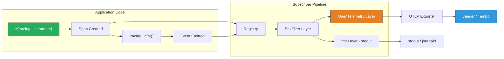
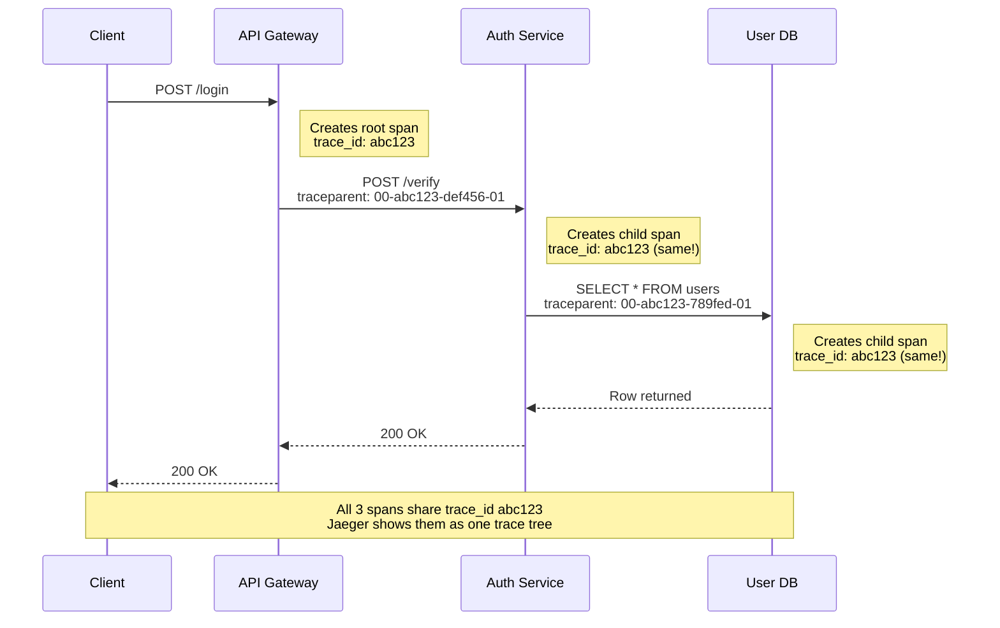

# 1. Distributed Tracing with OpenTelemetry 🟢

> **What you'll learn:**
> - Why `println!` debugging and unstructured logging fail catastrophically in distributed systems, and what replaces them.
> - The architecture of the `tracing` crate ecosystem: `Subscriber`, `Layer`, `Span`, and `Event`.
> - How to emit OpenTelemetry Protocol (OTLP) traces from a Rust service and view them in Jaeger or Grafana Tempo.
> - How W3C Trace Context propagation works across HTTP and gRPC service boundaries.

**Cross-references:** This chapter builds on async Rust fundamentals from [Async Rust](../async-book/src/SUMMARY.md) and basic `tracing` usage from [Ecosystem, Tooling & Profiling](../tooling-profiling-book/src/SUMMARY.md).

---

## The Problem with `println!` at Scale

When you have one binary, `println!` works. When you have 200 microservices handling a single user request, it's useless. You cannot:

- **Correlate** a log line in Service A with the downstream call it triggered in Service B.
- **Measure** the latency contribution of each service in the call chain.
- **Sample** — you either log everything (drowning in data) or nothing (flying blind).

This is the **observability gap** that distributed tracing closes.

### Log vs. Span vs. Event

| Concept | What it represents | Lifetime | Example |
|---------|-------------------|----------|---------|
| **Log line** | A single point-in-time message | Instantaneous | `info!("request received")` |
| **Span** | A unit of work with a start and end | Duration | `#[tracing::instrument]` on `handle_login()` |
| **Event** | A structured occurrence within a span | Instantaneous, parented | `tracing::info!(user_id = %id, "auth succeeded")` |
| **Trace** | A tree of spans across services | The entire request lifecycle | Root span in API gateway → child spans in auth, database, cache |

---

## The `tracing` Ecosystem Architecture

Rust's `tracing` crate is **not** a logging library. It is a **structured, span-aware diagnostics framework** with a pluggable subscriber architecture.



### Key Components

| Component | Crate | Role |
|-----------|-------|------|
| `tracing` | `tracing` | Macros for creating spans and events. Does zero work — just emits structured data. |
| `tracing-subscriber` | `tracing-subscriber` | Composable `Layer` system. The `Registry` holds span data; layers process it. |
| `tracing-opentelemetry` | `tracing-opentelemetry` | A `Layer` that converts `tracing` spans into OpenTelemetry spans. |
| `opentelemetry-otlp` | `opentelemetry-otlp` | Exports OpenTelemetry data over gRPC or HTTP to a collector. |
| `opentelemetry-sdk` | `opentelemetry-sdk` | The core OTel SDK: `TracerProvider`, `SpanProcessor`, `Sampler`. |

---

## Setting Up OTLP Export: The Full Stack

### The Naive Way (Blind)

```rust
// 💥 VULNERABILITY: No tracing, no correlation, no structured data.
// In a 200-service mesh, this is indistinguishable from silence.

use log::info;

async fn handle_request(req: Request) -> Response {
    info!("got a request"); // 💥 No request ID, no user ID, no timing.
    let user = db::lookup_user(req.user_id).await;
    info!("looked up user"); // 💥 Which user? How long did this take?
    Response::ok(user)
}
```

### The Enterprise Way

```rust
// ✅ FIX: Structured tracing with OTLP export.
// Every span carries a trace_id that propagates across service boundaries.

use opentelemetry::global;
use opentelemetry_otlp::SpanExporter;
use opentelemetry_sdk::{
    trace::{SdkTracerProvider, Sampler},
    Resource,
};
use opentelemetry::KeyValue;
use tracing_opentelemetry::OpenTelemetryLayer;
use tracing_subscriber::{layer::SubscriberExt, util::SubscriberInitExt, EnvFilter};

/// Initialize the complete telemetry stack.
///
/// This sets up:
/// 1. An OTLP gRPC exporter pointing at your collector.
/// 2. A TracerProvider with the service name as a resource attribute.
/// 3. A tracing-subscriber pipeline with both stdout and OTel layers.
fn init_telemetry() -> SdkTracerProvider {
    // Build the OTLP exporter. Defaults to http://localhost:4317 (gRPC).
    let exporter = SpanExporter::builder()
        .with_tonic()
        .build()
        .expect("Failed to create OTLP exporter");

    // Build the tracer provider with a resource identifying this service.
    let provider = SdkTracerProvider::builder()
        .with_batch_exporter(exporter)
        .with_sampler(Sampler::AlwaysOn) // ✅ Sample 100% in dev/staging
        .with_resource(
            Resource::builder()
                .with_attributes([
                    KeyValue::new("service.name", "auth-service"),
                    KeyValue::new("service.version", env!("CARGO_PKG_VERSION")),
                ])
                .build(),
        )
        .build();

    // Set the global tracer provider so any library can emit spans.
    global::set_tracer_provider(provider.clone());

    // Build the subscriber pipeline.
    let otel_layer = OpenTelemetryLayer::new(provider.tracer("auth-service"));

    tracing_subscriber::registry()
        .with(EnvFilter::from_default_env()) // RUST_LOG controls verbosity
        .with(tracing_subscriber::fmt::layer()) // Human-readable stdout
        .with(otel_layer) // OTLP export
        .init();

    provider
}
```

### Instrumenting Handlers

```rust
use axum::{extract::Json, http::StatusCode};
use serde::Deserialize;
use tracing::{info, warn, instrument};

#[derive(Deserialize)]
struct LoginRequest {
    username: String,
    // password handled securely — see Chapter 4
}

/// Every call to this function creates a new span with `username` recorded
/// as a structured field. The span is automatically closed when the
/// function returns, recording its duration.
#[instrument(
    name = "handle_login",
    skip_all,                         // Don't record function args by default
    fields(username = %req.username), // Explicitly record only what's safe
    level = "info"
)]
async fn handle_login(Json(req): Json<LoginRequest>) -> StatusCode {
    info!("login attempt started");

    // This async call becomes a child span automatically.
    let user = match db::find_user(&req.username).await {
        Some(u) => u,
        None => {
            warn!(username = %req.username, "user not found");
            return StatusCode::UNAUTHORIZED;
        }
    };

    // Verify credentials (see Chapter 3 for constant-time comparison).
    if verify_password(&user, &req).await {
        info!("login succeeded");
        StatusCode::OK
    } else {
        warn!("login failed — bad credentials");
        StatusCode::UNAUTHORIZED
    }
}
```

---

## Context Propagation: The Glue of Distributed Tracing

A trace is useless if it stops at the first service boundary. **Context propagation** is the mechanism that threads a `trace_id` and `span_id` through every outbound HTTP or gRPC call, so the downstream service can continue the same trace.



### W3C `traceparent` Header

The W3C Trace Context standard defines the `traceparent` header:

```
traceparent: 00-<trace-id>-<parent-span-id>-<trace-flags>
              │     │              │              │
              │     │              │              └─ 01 = sampled
              │     │              └─ 8 bytes, hex-encoded
              │     └─ 16 bytes, hex-encoded
              └─ version (always 00)
```

### Injecting Context into Outbound HTTP Calls

```rust
use opentelemetry::global;
use opentelemetry::propagation::Injector;
use reqwest::header::HeaderMap;

/// A wrapper that lets the OTel propagator write into reqwest headers.
struct HeaderInjector<'a>(&'a mut HeaderMap);

impl Injector for HeaderInjector<'_> {
    fn set(&mut self, key: &str, value: String) {
        if let Ok(name) = key.parse() {
            if let Ok(val) = value.parse() {
                self.0.insert(name, val);
            }
        }
    }
}

async fn call_downstream(url: &str) -> reqwest::Result<reqwest::Response> {
    let mut headers = HeaderMap::new();

    // Inject the current span's context into the outbound headers.
    global::get_text_map_propagator(|propagator| {
        propagator.inject_context(
            &tracing::Span::current().context(),
            &mut HeaderInjector(&mut headers),
        );
    });

    reqwest::Client::new()
        .post(url)
        .headers(headers)
        .send()
        .await
}
```

### Extracting Context from Inbound Requests (axum middleware)

```rust
use axum::{extract::Request, middleware::Next, response::Response};
use opentelemetry::global;
use opentelemetry::propagation::Extractor;
use std::collections::HashMap;

struct HeaderExtractor(HashMap<String, String>);

impl Extractor for HeaderExtractor {
    fn get(&self, key: &str) -> Option<&str> {
        self.0.get(key).map(|v| v.as_str())
    }

    fn keys(&self) -> Vec<&str> {
        self.0.keys().map(|k| k.as_str()).collect()
    }
}

async fn propagation_middleware(req: Request, next: Next) -> Response {
    // Collect headers into a HashMap for the extractor.
    let headers: HashMap<String, String> = req
        .headers()
        .iter()
        .map(|(k, v)| (k.to_string(), v.to_str().unwrap_or("").to_string()))
        .collect();

    // Extract the parent context from inbound headers.
    let parent_cx = global::get_text_map_propagator(|propagator| {
        propagator.extract(&HeaderExtractor(headers))
    });

    // Set it as the current context for all downstream spans.
    let _guard = parent_cx.attach();

    next.run(req).await
}
```

---

## Graceful Shutdown and Span Flushing

A critical operational detail: the OTLP exporter batches spans. If your service shuts down without flushing, **you lose the last batch of traces**. In an incident, those are exactly the traces you need.

```rust
#[tokio::main]
async fn main() {
    let provider = init_telemetry();

    // ... start your axum server ...

    // On shutdown (e.g., SIGTERM):
    // Flush all pending spans before the process exits.
    if let Err(e) = provider.shutdown() {
        eprintln!("Failed to shut down tracer provider: {e}");
    }
}
```

> **Operational note:** In Kubernetes, the default `terminationGracePeriodSeconds` is 30 seconds. Your flush must complete within that window. If you're using a batch span processor, ensure `max_export_timeout` is well under 30s.

---

## Sampling Strategies

In production, tracing 100% of requests is expensive. The OpenTelemetry SDK offers several sampling strategies:

| Sampler | When to use | Trade-off |
|---------|------------|-----------|
| `AlwaysOn` | Dev, staging, low-traffic services | Complete visibility; high cost |
| `AlwaysOff` | Disabling tracing entirely | Zero cost; zero visibility |
| `TraceIdRatioBased(0.01)` | High-traffic production services | 1% of traces; statistically representative |
| `ParentBased(root_sampler)` | Standard production default | Respects parent's sampling decision; avoids broken traces |

```rust
use opentelemetry_sdk::trace::Sampler;

// ✅ Production: sample 1% of new traces, but always follow
// the parent's decision for child spans.
let sampler = Sampler::ParentBased(Box::new(
    Sampler::TraceIdRatioBased(0.01),
));
```

> **Zero-Trust Tracing:** In a SOC 2 environment, you may need to **always** trace authentication and authorization paths regardless of sample rate. Use a custom sampler that checks the span name or attributes:
>
> ```rust
> // Pseudocode: always sample auth spans
> if span_name.starts_with("auth::") {
>     SamplingDecision::RecordAndSample
> } else {
>     ratio_based_decision
> }
> ```

---

<details>
<summary><strong>🏋️ Exercise: End-to-End Trace Pipeline</strong> (click to expand)</summary>

**Challenge:** Set up a complete tracing pipeline for a two-service system.

1. Create two axum services: `api-gateway` (port 3000) and `user-service` (port 3001).
2. The gateway receives `GET /user/:id` and forwards the request to the user service.
3. Both services must export OTLP traces to a Jaeger instance at `http://localhost:4317`.
4. The `traceparent` header must be propagated from the gateway to the user service.
5. Verify in Jaeger that a single trace contains spans from **both** services.

**Bonus:** Add a `ParentBased(TraceIdRatioBased(0.5))` sampler and verify that approximately 50% of traces appear.

<details>
<summary>🔑 Solution</summary>

```rust
// ---- Cargo.toml (shared dependencies for both services) ----
// [dependencies]
// axum = "0.8"
// tokio = { version = "1", features = ["full"] }
// tracing = "0.1"
// tracing-subscriber = { version = "0.3", features = ["env-filter"] }
// tracing-opentelemetry = "0.29"
// opentelemetry = "0.28"
// opentelemetry-otlp = { version = "0.28", features = ["grpc-tonic"] }
// opentelemetry_sdk = { version = "0.28", features = ["rt-tokio"] }
// reqwest = { version = "0.12", features = ["json"] }
// serde = { version = "1", features = ["derive"] }

// ---- api_gateway/main.rs ----
use axum::{extract::Path, routing::get, Router};
use opentelemetry::global;
use opentelemetry::propagation::Injector;
use reqwest::header::HeaderMap;
use tracing::instrument;

// ✅ Reuse init_telemetry() from the chapter, changing service.name
// to "api-gateway".

struct HeaderInjector<'a>(&'a mut HeaderMap);

impl Injector for HeaderInjector<'_> {
    fn set(&mut self, key: &str, value: String) {
        if let Ok(name) = key.parse() {
            if let Ok(val) = value.parse() {
                self.0.insert(name, val);
            }
        }
    }
}

#[instrument(name = "gateway::get_user", fields(user_id = %id))]
async fn get_user(Path(id): Path<u64>) -> String {
    let mut headers = HeaderMap::new();

    // ✅ Inject trace context into outbound request.
    global::get_text_map_propagator(|propagator| {
        propagator.inject_context(
            &tracing::Span::current().context(),
            &mut HeaderInjector(&mut headers),
        );
    });

    let resp = reqwest::Client::new()
        .get(format!("http://localhost:3001/user/{id}"))
        .headers(headers)
        .send()
        .await
        .expect("user-service call failed");

    resp.text().await.unwrap_or_default()
}

#[tokio::main]
async fn main() {
    let provider = init_telemetry(); // service.name = "api-gateway"

    let app = Router::new().route("/user/{id}", get(get_user));
    let listener = tokio::net::TcpListener::bind("0.0.0.0:3000").await.unwrap();
    axum::serve(listener, app).await.unwrap();

    provider.shutdown().ok();
}

// ---- user_service/main.rs ----
use axum::{extract::Path, routing::get, Router};
use tracing::instrument;

// ✅ Reuse init_telemetry() with service.name = "user-service".
// ✅ Add the propagation_middleware from the chapter to extract
//    the traceparent header from inbound requests.

#[instrument(name = "user_service::lookup_user", fields(user_id = %id))]
async fn lookup_user(Path(id): Path<u64>) -> String {
    // Simulate a database lookup.
    tokio::time::sleep(std::time::Duration::from_millis(50)).await;
    format!(r#"{{"id": {id}, "name": "Alice"}}"#)
}

#[tokio::main]
async fn main() {
    let provider = init_telemetry(); // service.name = "user-service"

    let app = Router::new()
        .route("/user/{id}", get(lookup_user))
        .layer(axum::middleware::from_fn(propagation_middleware));

    let listener = tokio::net::TcpListener::bind("0.0.0.0:3001").await.unwrap();
    axum::serve(listener, app).await.unwrap();

    provider.shutdown().ok();
}

// Run Jaeger locally:
//   docker run -d --name jaeger \
//     -p 16686:16686 \      # Jaeger UI
//     -p 4317:4317 \        # OTLP gRPC
//     jaegertracing/all-in-one:latest
//
// Start both services, then:
//   curl http://localhost:3000/user/42
//
// Open http://localhost:16686 → select "api-gateway" → Find Traces.
// ✅ You should see a single trace with spans from both services.
```

</details>
</details>

---

> **Key Takeaways**
>
> 1. **`tracing` is not logging.** It's a structured, span-aware diagnostics framework. Spans have duration; events are points within spans.
> 2. **OTLP is the lingua franca.** Export via `opentelemetry-otlp` to any backend: Jaeger, Tempo, Honeycomb, Datadog.
> 3. **Context propagation is non-negotiable.** Without `traceparent` injection/extraction, your traces break at every service boundary.
> 4. **Always flush on shutdown.** Losing the last batch of spans during an incident is an operational failure you chose.
> 5. **Sample wisely.** `ParentBased(TraceIdRatioBased(N))` is the production default. Force-sample security-critical paths.

> **See also:**
> - [Chapter 2: High-Cardinality Metrics and Exemplars](ch02-high-cardinality-metrics-and-exemplars.md) — tie metric spikes to specific trace IDs.
> - [Chapter 7: Capstone](ch07-capstone-soc2-compliant-auth-service.md) — full integration of tracing into the hardened auth service.
> - [Async Rust: From Futures to Production](../async-book/src/SUMMARY.md) — runtime internals that affect span lifecycle.
