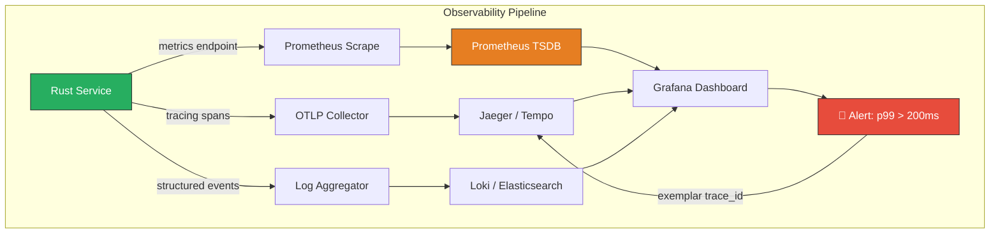

# 2. High-Cardinality Metrics and Exemplars 🟡

> **What you'll learn:**
> - The difference between logs, traces, and metrics — and why metrics are the **first** signal you check in an incident.
> - How to use the `metrics` crate with `metrics-exporter-prometheus` to expose counters, histograms, and gauges.
> - What high-cardinality means, why it destroys Prometheus, and how to avoid cardinality explosions.
> - How **Exemplars** bridge the gap between a metric spike and the exact trace that caused it.

**Cross-references:** This chapter builds on the OpenTelemetry tracing stack from [Chapter 1](ch01-distributed-tracing-with-opentelemetry.md). It assumes familiarity with Prometheus and Grafana.

---

## The Three Pillars of Observability

Distributed tracing (Chapter 1) answers *"what happened to this specific request?"* Metrics answer a fundamentally different question: *"what is the aggregate health of my system right now?"*

| Signal | Question it answers | Data volume | Retention |
|--------|-------------------|-------------|-----------|
| **Logs** | What happened? (narrative) | High | Days–weeks |
| **Traces** | Why was this request slow? (causal) | Medium (sampled) | Days |
| **Metrics** | Is the system healthy? (statistical) | Low (pre-aggregated) | Months–years |

In a SOC 2 audit, metrics provide the **evidence** that your SLOs are met. Your auditor doesn't want to search through traces — they want a Grafana dashboard showing `p99_latency < 200ms` for the past 90 days.



The critical flow: an **alert** fires from a **metric**, and the **exemplar** attached to that metric gives you the **exact trace_id** to investigate.

---

## The `metrics` Crate Ecosystem

Rust's `metrics` crate follows the same philosophy as `tracing`: a **facade** with pluggable backends.

| Crate | Role |
|-------|------|
| `metrics` | Macros: `counter!`, `histogram!`, `gauge!`. Zero-cost facade. |
| `metrics-exporter-prometheus` | Exposes a `/metrics` HTTP endpoint in Prometheus exposition format. |
| `metrics-tracing-context` | Automatically adds `tracing` span fields as metric labels. |
| `metrics-util` | Building blocks for custom exporters: registries, recency tracking. |

### The Naive Way (No Metrics)

```rust
// 💥 VULNERABILITY: No metrics. You learn about outages from your customers.
// Your SOC 2 auditor asks "what is your p99 latency?" and you say "...we log stuff?"

async fn handle_request(req: Request) -> Response {
    let start = std::time::Instant::now();
    let resp = process(req).await;
    log::info!("request took {:?}", start.elapsed()); // 💥 Not queryable, not aggregatable
    resp
}
```

### The Enterprise Way

```rust
// ✅ FIX: Structured metrics with Prometheus export.

use axum::{extract::Request, middleware::Next, response::Response, routing::get, Router};
use metrics::{counter, histogram};
use metrics_exporter_prometheus::PrometheusBuilder;
use std::time::Instant;

/// Install the Prometheus metrics exporter.
/// This spawns an HTTP listener on port 9090 serving `/metrics`.
fn init_metrics() {
    PrometheusBuilder::new()
        .with_http_listener(([0, 0, 0, 0], 9090))
        .install()
        .expect("failed to install Prometheus exporter");
}

/// Middleware that records request count and latency for every handler.
async fn metrics_middleware(req: Request, next: Next) -> Response {
    let method = req.method().to_string();
    let path = req.uri().path().to_string();
    let start = Instant::now();

    let response = next.run(req).await;

    let status = response.status().as_u16().to_string();
    let duration = start.elapsed().as_secs_f64();

    // ✅ Counter: total requests, partitioned by method, path, status.
    counter!(
        "http_requests_total",
        "method" => method.clone(),
        "path" => path.clone(),
        "status" => status.clone()
    )
    .increment(1);

    // ✅ Histogram: request duration in seconds.
    histogram!(
        "http_request_duration_seconds",
        "method" => method,
        "path" => path,
        "status" => status
    )
    .record(duration);

    response
}

#[tokio::main]
async fn main() {
    init_metrics();

    let app = Router::new()
        .route("/health", get(|| async { "ok" }))
        .layer(axum::middleware::from_fn(metrics_middleware));

    let listener = tokio::net::TcpListener::bind("0.0.0.0:3000").await.unwrap();
    axum::serve(listener, app).await.unwrap();
}
```

Now `curl http://localhost:9090/metrics` returns:

```
# HELP http_requests_total Total HTTP requests
# TYPE http_requests_total counter
http_requests_total{method="GET",path="/health",status="200"} 42

# HELP http_request_duration_seconds Request duration
# TYPE http_request_duration_seconds histogram
http_request_duration_seconds_bucket{method="GET",path="/health",status="200",le="0.005"} 40
http_request_duration_seconds_bucket{method="GET",path="/health",status="200",le="0.01"} 42
```

---

## The Cardinality Problem

**Cardinality** = the number of unique label combinations for a metric. Prometheus stores one time series per unique combination.

| Label set | Unique combinations | Series in Prometheus |
|-----------|-------------------|---------------------|
| `method` × `path` × `status` | 3 × 10 × 5 = 150 | 150 — manageable |
| `method` × `path` × `status` × `user_id` | 3 × 10 × 5 × 1,000,000 | **150,000,000** — 💥 OOM |

### Rules for Label Hygiene

| ✅ Do | ❌ Don't |
|-------|---------|
| Use bounded enums: `method`, `status_class` (2xx, 4xx, 5xx) | Use unbounded identifiers: `user_id`, `request_id`, `email` |
| Group paths with templates: `/user/{id}` | Record raw paths: `/user/12345`, `/user/67890` |
| Cap label values to known sets | Let external input become a label |

```rust
// 💥 VULNERABILITY: Cardinality bomb. Each unique user_id creates a new time series.
counter!(
    "login_attempts_total",
    "user_id" => user_id.to_string() // 💥 Unbounded! 1M users = 1M series.
).increment(1);

// ✅ FIX: Record the user_id in the trace span (Chapter 1), not in the metric.
// The metric tracks the aggregate; the trace tracks the individual.
counter!(
    "login_attempts_total",
    "result" => if success { "success" } else { "failure" } // ✅ 2 series total.
).increment(1);
```

---

## Exemplars: Bridging Metrics and Traces

The tension: metrics must be low-cardinality (aggregates), but when you see a spike, you need to find the *exact request* that caused it. **Exemplars** solve this.

An exemplar is a sample data point attached to a histogram bucket. It carries the `trace_id` of one representative request that fell into that bucket.

```
http_request_duration_seconds_bucket{path="/login",le="0.5"} 998
http_request_duration_seconds_bucket{path="/login",le="1.0"} 1000  # {trace_id="abc123"} 0.87
http_request_duration_seconds_bucket{path="/login",le="+Inf"} 1000
```

The exemplar `{trace_id="abc123"} 0.87` tells you: "One request that took 0.87s had trace ID `abc123`. Click it to see why."

### Implementing Exemplars with `metrics-tracing-context`

```rust
use metrics_exporter_prometheus::PrometheusBuilder;
use metrics_tracing_context::{MetricsLayer, TracingContextLayer};
use tracing_subscriber::{layer::SubscriberExt, util::SubscriberInitExt, EnvFilter};

fn init_metrics_with_exemplars() {
    // ✅ The TracingContextLayer bridges `tracing` span fields into `metrics` labels.
    let (recorder, _) = PrometheusBuilder::new()
        .with_http_listener(([0, 0, 0, 0], 9090))
        .build()
        .expect("failed to build Prometheus recorder");

    // Wrap the recorder so it can read tracing span context.
    let recorder = TracingContextLayer::all().layer(recorder);
    metrics::set_global_recorder(recorder)
        .expect("failed to set global recorder");
}

fn init_tracing_with_metrics() {
    tracing_subscriber::registry()
        .with(EnvFilter::from_default_env())
        .with(tracing_subscriber::fmt::layer())
        .with(MetricsLayer::new()) // ✅ Feeds span fields to the metrics layer
        .init();
}
```

Now, any `histogram!` recorded within a `tracing` span automatically picks up the `trace_id` as an exemplar — if the Prometheus recorder supports it.

---

## Custom Business Metrics

Beyond HTTP request metrics, enterprise services need domain-specific metrics:

```rust
use metrics::{counter, gauge, histogram};

/// Record authentication outcomes for compliance dashboards.
fn record_auth_metrics(success: bool, method: &str, duration_secs: f64) {
    let result = if success { "success" } else { "failure" };

    counter!(
        "auth_attempts_total",
        "method" => method.to_owned(),
        "result" => result.to_owned()
    ).increment(1);

    histogram!(
        "auth_duration_seconds",
        "method" => method.to_owned()
    ).record(duration_secs);
}

/// Track the number of active sessions for capacity planning.
fn update_active_sessions(delta: i64) {
    if delta > 0 {
        gauge!("active_sessions_total").increment(delta as f64);
    } else {
        gauge!("active_sessions_total").decrement(delta.unsigned_abs() as f64);
    }
}
```

### RED Method Metrics

The **RED method** (Rate, Errors, Duration) is the standard for microservices:

| Signal | Metric | Type | Labels |
|--------|--------|------|--------|
| **R**ate | `http_requests_total` | Counter | `method`, `path`, `status_class` |
| **E**rrors | `http_requests_total{status_class="5xx"}` | Counter (filtered) | Same |
| **D**uration | `http_request_duration_seconds` | Histogram | `method`, `path` |

Build your Grafana dashboards around these three metrics and you cover 90% of operational questions.

---

## Prometheus Scrape Configuration

Your Prometheus `prometheus.yml` needs to know where to scrape:

```yaml
scrape_configs:
  - job_name: 'auth-service'
    scrape_interval: 15s
    static_configs:
      - targets: ['auth-service:9090']
    # In Kubernetes, use service discovery instead:
    # kubernetes_sd_configs:
    #   - role: pod
```

> **Operational note:** In SOC 2 environments, metrics endpoints often sit behind mTLS. Use the `tls_config` block in Prometheus to present client certificates. Never expose `/metrics` to the public internet — it's an information disclosure risk (timing data, error rates, internal path names).

---

<details>
<summary><strong>🏋️ Exercise: RED Metrics Dashboard</strong> (click to expand)</summary>

**Challenge:**

1. Add the metrics middleware from this chapter to your `api-gateway` and `user-service` from the Chapter 1 exercise.
2. Run Prometheus locally (Docker: `prom/prometheus:latest`) scraping both services.
3. Create a Grafana dashboard with three panels:
   - **Rate:** `rate(http_requests_total[5m])` grouped by service and path.
   - **Errors:** `rate(http_requests_total{status_class="5xx"}[5m])` grouped by service.
   - **Duration (p99):** `histogram_quantile(0.99, rate(http_request_duration_seconds_bucket[5m]))` grouped by service.
4. Generate load with `hey` or `wrk` and observe the dashboard in real time.

**Bonus:** Add a counter for `auth_failures_total` and create an alert rule that fires when the failure rate exceeds 10% of total auth attempts in a 5-minute window.

<details>
<summary>🔑 Solution</summary>

```rust
// ---- Add to both services' Cargo.toml ----
// metrics = "0.24"
// metrics-exporter-prometheus = "0.16"

// ---- In each service's main.rs ----
use metrics_exporter_prometheus::PrometheusBuilder;

fn init_metrics() {
    PrometheusBuilder::new()
        .with_http_listener(([0, 0, 0, 0], 9090)) // api-gateway
        // For user-service, use port 9091 to avoid conflict:
        // .with_http_listener(([0, 0, 0, 0], 9091))
        .install()
        .expect("failed to install Prometheus exporter");
}

// ---- Reuse the metrics_middleware from the chapter ----
// Add it as a layer:
// let app = Router::new()
//     .route("/user/{id}", get(get_user))
//     .layer(axum::middleware::from_fn(metrics_middleware));
```

```yaml
# ---- prometheus.yml ----
global:
  scrape_interval: 5s

scrape_configs:
  - job_name: 'api-gateway'
    static_configs:
      - targets: ['host.docker.internal:9090']

  - job_name: 'user-service'
    static_configs:
      - targets: ['host.docker.internal:9091']
```

```bash
# Run Prometheus
docker run -d --name prometheus \
  -p 9292:9090 \
  -v $(pwd)/prometheus.yml:/etc/prometheus/prometheus.yml \
  prom/prometheus:latest

# Run Grafana
docker run -d --name grafana \
  -p 3333:3000 \
  grafana/grafana:latest

# Generate load
# Install hey: go install github.com/rakyll/hey@latest
hey -n 10000 -c 50 http://localhost:3000/user/42
```

```promql
# ---- Grafana Panel Queries ----

# Rate panel:
rate(http_requests_total[5m])

# Errors panel:
rate(http_requests_total{status=~"5.."}[5m])

# p99 Duration panel:
histogram_quantile(0.99,
  rate(http_request_duration_seconds_bucket[5m])
)

# ---- Alert Rule (bonus) ----
# In Prometheus alerting rules:
groups:
  - name: auth
    rules:
      - alert: HighAuthFailureRate
        expr: |
          rate(auth_failures_total[5m])
          /
          rate(auth_attempts_total[5m])
          > 0.10
        for: 5m
        labels:
          severity: critical
        annotations:
          summary: "Auth failure rate above 10% for 5 minutes"
```

</details>
</details>

---

> **Key Takeaways**
>
> 1. **Metrics are your first responder.** In an incident, you check dashboards (metrics) first, then traces, then logs.
> 2. **Cardinality kills.** Never use unbounded values (user IDs, request IDs) as metric labels. Put those in trace spans instead.
> 3. **Exemplars bridge the gap.** They attach a `trace_id` to a histogram bucket, letting you jump from an aggregate spike to the exact offending request.
> 4. **RED is the standard.** Rate, Errors, Duration — three metrics cover 90% of operational questions for any microservice.
> 5. **Secure your metrics endpoint.** In compliance environments, `/metrics` is an information disclosure vector. Use mTLS or network policies.

> **See also:**
> - [Chapter 1: Distributed Tracing with OpenTelemetry](ch01-distributed-tracing-with-opentelemetry.md) — the tracing foundation these metrics complement.
> - [Chapter 7: Capstone](ch07-capstone-soc2-compliant-auth-service.md) — integrating metrics into the hardened auth service.
> - [Ecosystem, Tooling & Profiling](../tooling-profiling-book/src/SUMMARY.md) — Criterion benchmarks and flamegraphs for deeper performance analysis.
