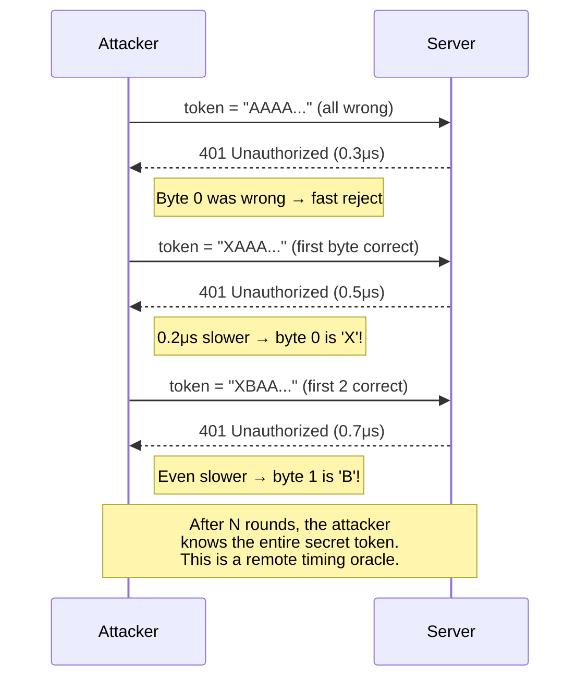

# 3. Mitigating Side-Channel Attacks 🟡

> **What you'll learn:**
> - Why standard equality (`==`) on secrets is a **remote-exploitable vulnerability** that leaks information through timing.
> - How CPU branch prediction, short-circuit evaluation, and cache behavior create measurable timing differences.
> - How the `subtle` crate provides `ConstantTimeEq`, `ConditionallySelectable`, and `Choice` for side-channel-resistant code.
> - How to validate HMAC signatures and password hashes without leaking any information about the expected value.

**Cross-references:** This chapter is a prerequisite for [Chapter 4: Secrets Management](ch04-secrets-management-and-memory-sanitization.md) and [Chapter 7: Capstone](ch07-capstone-soc2-compliant-auth-service.md). Background on unsafe memory is in [Unsafe Rust & FFI](../unsafe-ffi-book/src/SUMMARY.md).

---

## The Timing Oracle

Consider this code, which every beginner writes:

```rust
// 💥 VULNERABILITY: Timing Attack — leaks secret byte-by-byte.
fn verify_token(expected: &[u8], provided: &[u8]) -> bool {
    if expected.len() != provided.len() {
        return false; // 💥 Leaks: length mismatch is instant.
    }
    for i in 0..expected.len() {
        if expected[i] != provided[i] {
            return false; // 💥 Leaks: fails fast on first wrong byte.
        }
    }
    true
}
```

This **looks correct** — it returns `true` only if all bytes match. But it's catastrophically insecure because it leaks **how many bytes matched** through execution time.

### How the Attack Works

An attacker sends millions of requests, varying one byte at a time, and measures response time with nanosecond precision:



### Why This Matters in Practice

| Attack surface | Vulnerable operation | Real-world impact |
|---------------|---------------------|-------------------|
| **HMAC verification** | `computed_hmac == expected_hmac` | Forge API signatures (Stripe, GitHub webhooks) |
| **Password hash comparison** | `stored_hash == computed_hash` | Crack passwords without brute force |
| **API token validation** | `db_token == provided_token` | Steal API access |
| **JWT signature check** | `expected_sig == provided_sig` | Forge authentication tokens |
| **License key validation** | `valid_key == submitted_key` | Bypass licensing |

This is not theoretical. Timing attacks have been demonstrated remotely over the internet with statistical amplification techniques.

---

## The `subtle` Crate: Constant-Time Primitives

The `subtle` crate (maintained by the `dalek-cryptography` team) provides types that execute in **constant time** — the same number of CPU operations regardless of data values.

### Core Types

| Type / Trait | Purpose |
|-------------|---------|
| `Choice` | A `u8` that is always `0` or `1`. Cannot be branched on directly. |
| `ConstantTimeEq` | Trait: `ct_eq(&self, other: &Self) -> Choice`. Compares all bytes, always. |
| `ConditionallySelectable` | Trait: `conditional_select(a, b, choice) -> T`. Branchless select. |
| `CtOption<T>` | An `Option<T>` that doesn't leak which variant it is through timing. |
| `ConstantTimeGreater` | Trait: constant-time `>` comparison. |
| `ConstantTimeLess` | Trait: constant-time `<` comparison. |

### How `ConstantTimeEq` Works

Standard `==` short-circuits on the first mismatched byte. `ct_eq` XORs every byte pair and ORs all results together:

```
Standard ==:  [A][A][A][X] vs [A][A][A][Y]
              ✓   ✓   ✓   ✗ → return false (after 4 comparisons)

              [X][A][A][A] vs [A][A][A][A]
              ✗ → return false (after 1 comparison) ← TIMING LEAK

ct_eq:        [A][A][A][X] vs [A][A][A][Y]
              XOR each pair → accumulate into one byte → check if zero
              Always processes ALL bytes. Always same time.
```

---

## The Enterprise Way: Constant-Time Comparisons

### HMAC Verification

```rust
use hmac::{Hmac, Mac};
use sha2::Sha256;
use subtle::ConstantTimeEq;

type HmacSha256 = Hmac<Sha256>;

/// Verify an HMAC signature in constant time.
///
/// The naive approach: `computed == expected` — leaks via timing.
/// The correct approach: `ct_eq` — always compares all bytes.
fn verify_hmac(
    key: &[u8],
    message: &[u8],
    expected_signature: &[u8],
) -> bool {
    // Compute the HMAC of the message.
    let mut mac = HmacSha256::new_from_slice(key)
        .expect("HMAC accepts any key length");
    mac.update(message);
    let computed = mac.finalize().into_bytes();

    let computed_bytes = computed.as_slice();

    // 💥 WRONG: This leaks timing information.
    // if computed_bytes == expected_signature { return true; }

    // ✅ FIX: Constant-time comparison. Same duration regardless of input.
    // 1. Length check: if lengths differ, we still do the comparison
    //    on the computed side to avoid leaking length info.
    if computed_bytes.len() != expected_signature.len() {
        // Always compare *something* to maintain constant timing.
        // We compare the computed bytes against themselves.
        let _ = computed_bytes.ct_eq(computed_bytes);
        return false;
    }

    // 2. Constant-time byte comparison.
    bool::from(computed_bytes.ct_eq(expected_signature))
}
```

### Branchless Conditional Selection

Sometimes you need to select between two values based on a comparison — without branching:

```rust
use subtle::{Choice, ConditionallySelectable, ConstantTimeEq};

/// Select a response code without branching.
/// An optimizing compiler might convert an if/else into a branch
/// that leaks which path was taken via speculative execution.
fn select_response(
    auth_token: &[u8; 32],
    expected: &[u8; 32],
) -> u16 {
    let is_valid: Choice = auth_token.ct_eq(expected);

    // ✅ Branchless: both values are computed; one is selected.
    let ok = 200u16;
    let unauthorized = 401u16;
    u16::conditional_select(&unauthorized, &ok, is_valid)
}
```

### `CtOption`: Hiding the `None` Path

```rust
use subtle::CtOption;

/// Look up a user's role, but don't leak whether the user exists
/// through timing. Both paths (found / not found) take the same time.
fn lookup_role(user_id: u64) -> CtOption<u8> {
    // In practice, this would be a database lookup.
    let role: u8 = 0x01; // admin
    let found: bool = user_id == 42;

    // CtOption doesn't branch on `found`. The caller uses
    // ct_eq or conditional_select to consume the result.
    CtOption::new(role, Choice::from(found as u8))
}
```

---

## Common Pitfalls

### Pitfall 1: The Compiler Undoes Your Work

Even if you write constant-time code, the compiler may optimize it into branching code.

```rust
// 💥 VULNERABILITY: The optimizer may convert this loop
// into an early-return because the result is "obviously" equivalent.
fn naive_constant_time(a: &[u8], b: &[u8]) -> bool {
    let mut result = 0u8;
    for i in 0..a.len() {
        result |= a[i] ^ b[i]; // Correct logic, but...
    }
    result == 0 // 💥 The compiler might optimize the loop away.
}
```

The `subtle` crate uses `core::hint::black_box` and volatile operations internally to prevent this. **Never roll your own constant-time primitives.** Use `subtle`.

### Pitfall 2: Applying Constant-Time to the Wrong Layer

```rust
// 💥 VULNERABILITY: You did the comparison right, but the database
// query that fetched the expected hash took variable time based
// on whether the user exists.
async fn verify_login(username: &str, password: &str) -> bool {
    let stored_hash = match db::get_hash(username).await {
        Some(h) => h,
        None => return false, // 💥 Faster than the found path!
    };
    constant_time_compare(hash(password), &stored_hash)
}

// ✅ FIX: Always hash, always compare — even for nonexistent users.
async fn verify_login_fixed(username: &str, password: &str) -> bool {
    // Use a dummy hash if the user doesn't exist.
    // The dummy must be expensive to compute (same cost as a real hash).
    let dummy_hash = hash("dummy_password_for_timing_normalization");

    let stored_hash = db::get_hash(username).await
        .unwrap_or(dummy_hash);

    constant_time_compare(hash(password), &stored_hash)
}
```

### Pitfall 3: Leaking Through Error Messages

```rust
// 💥 VULNERABILITY: Different error messages for "user not found"
// vs "wrong password" let attackers enumerate valid usernames.
match verify(username, password).await {
    Err(AuthError::UserNotFound) => "User not found",    // 💥 Enumeration!
    Err(AuthError::WrongPassword) => "Wrong password",   // 💥 Enumeration!
    Ok(_) => "Welcome",
}

// ✅ FIX: Same error message for all authentication failures.
match verify(username, password).await {
    Err(_) => "Invalid credentials",  // ✅ No information leakage
    Ok(_) => "Welcome",
}
```

---

## Constant-Time vs. Standard Operations: A Summary

| Operation | Standard (vulnerable) | Constant-Time (secure) |
|-----------|---------------------|----------------------|
| Equality check | `a == b` | `a.ct_eq(&b)` → `Choice` |
| Conditional select | `if cond { a } else { b }` | `T::conditional_select(&b, &a, choice)` |
| Option result | `Some(x)` / `None` | `CtOption::new(x, choice)` |
| Greater-than | `a > b` | `a.ct_gt(&b)` → `Choice` |
| Less-than | `a < b` | `a.ct_lt(&b)` → `Choice` |

---

<details>
<summary><strong>🏋️ Exercise: Constant-Time Webhook Verifier</strong> (click to expand)</summary>

**Challenge:** You receive GitHub webhook events. Each request includes an `X-Hub-Signature-256` header containing an HMAC-SHA256 of the request body, using your webhook secret as the key.

1. Write a function `verify_github_webhook(secret: &[u8], body: &[u8], signature_header: &str) -> bool` that:
   - Parses the `sha256=<hex>` prefix from the header.
   - Computes the HMAC-SHA256 of the body.
   - Compares the computed HMAC to the provided one using `subtle::ConstantTimeEq`.
2. Write a second function that does the same thing using standard `==`, and annotate it with `// 💥 VULNERABILITY` comments.
3. Write a test that asserts both functions return the same results for valid and invalid inputs (they should — the difference is only in timing).

<details>
<summary>🔑 Solution</summary>

```rust
use hmac::{Hmac, Mac};
use sha2::Sha256;
use subtle::ConstantTimeEq;

type HmacSha256 = Hmac<Sha256>;

/// ✅ Constant-time webhook verification.
fn verify_github_webhook(
    secret: &[u8],
    body: &[u8],
    signature_header: &str,
) -> bool {
    // Parse the "sha256=" prefix.
    let hex_sig = match signature_header.strip_prefix("sha256=") {
        Some(s) => s,
        None => return false,
    };

    // Decode the hex string into bytes.
    let expected_bytes = match hex::decode(hex_sig) {
        Ok(b) => b,
        Err(_) => return false,
    };

    // Compute the HMAC.
    let mut mac = HmacSha256::new_from_slice(secret)
        .expect("HMAC key can be any length");
    mac.update(body);
    let computed = mac.finalize().into_bytes();

    // ✅ Constant-time comparison — does not leak byte-by-byte information.
    if computed.len() != expected_bytes.len() {
        return false;
    }
    bool::from(computed.as_slice().ct_eq(&expected_bytes))
}

/// 💥 VULNERABLE version — for demonstration only.
fn verify_github_webhook_naive(
    secret: &[u8],
    body: &[u8],
    signature_header: &str,
) -> bool {
    let hex_sig = match signature_header.strip_prefix("sha256=") {
        Some(s) => s,
        None => return false,
    };

    let expected_bytes = match hex::decode(hex_sig) {
        Ok(b) => b,
        Err(_) => return false,
    };

    let mut mac = HmacSha256::new_from_slice(secret).unwrap();
    mac.update(body);
    let computed = mac.finalize().into_bytes();

    // 💥 VULNERABILITY: short-circuit comparison leaks timing.
    computed.as_slice() == expected_bytes.as_slice()
}

#[cfg(test)]
mod tests {
    use super::*;

    #[test]
    fn both_versions_agree() {
        let secret = b"my-webhook-secret";
        let body = b"payload body";

        // Compute a valid signature.
        let mut mac = HmacSha256::new_from_slice(secret).unwrap();
        mac.update(body);
        let sig = hex::encode(mac.finalize().into_bytes());
        let header = format!("sha256={sig}");

        // Both should accept a valid signature.
        assert!(verify_github_webhook(secret, body, &header));
        assert!(verify_github_webhook_naive(secret, body, &header));

        // Both should reject an invalid signature.
        let bad_header = "sha256=0000000000000000000000000000000000000000000000000000000000000000";
        assert!(!verify_github_webhook(secret, body, bad_header));
        assert!(!verify_github_webhook_naive(secret, body, bad_header));
    }
}
```

</details>
</details>

---

> **Key Takeaways**
>
> 1. **Standard `==` is a timing oracle.** Any comparison on secret data that short-circuits leaks information to an attacker with a stopwatch.
> 2. **Use `subtle::ConstantTimeEq` for all secret comparisons.** HMAC signatures, password hashes, API tokens, JWT signatures — all of them.
> 3. **Never roll your own constant-time primitives.** The compiler will optimize your clever loop into a branch. `subtle` uses `black_box` and volatile barriers.
> 4. **Constant-time comparison is necessary but not sufficient.** You must also normalize error timing (dummy hashes for nonexistent users) and avoid information leakage in error messages.
> 5. **Think about the entire path, not just the comparison.** Database lookups, error responses, and conditional logic all leak timing.

> **See also:**
> - [Chapter 4: Secrets Management and Memory Sanitization](ch04-secrets-management-and-memory-sanitization.md) — the next step: erasing these secrets from RAM the moment you're done.
> - [Chapter 7: Capstone](ch07-capstone-soc2-compliant-auth-service.md) — constant-time JWT verification in the hardened auth service.
> - [Unsafe Rust & FFI](../unsafe-ffi-book/src/SUMMARY.md) — when constant-time code requires `unsafe` for volatile reads.
