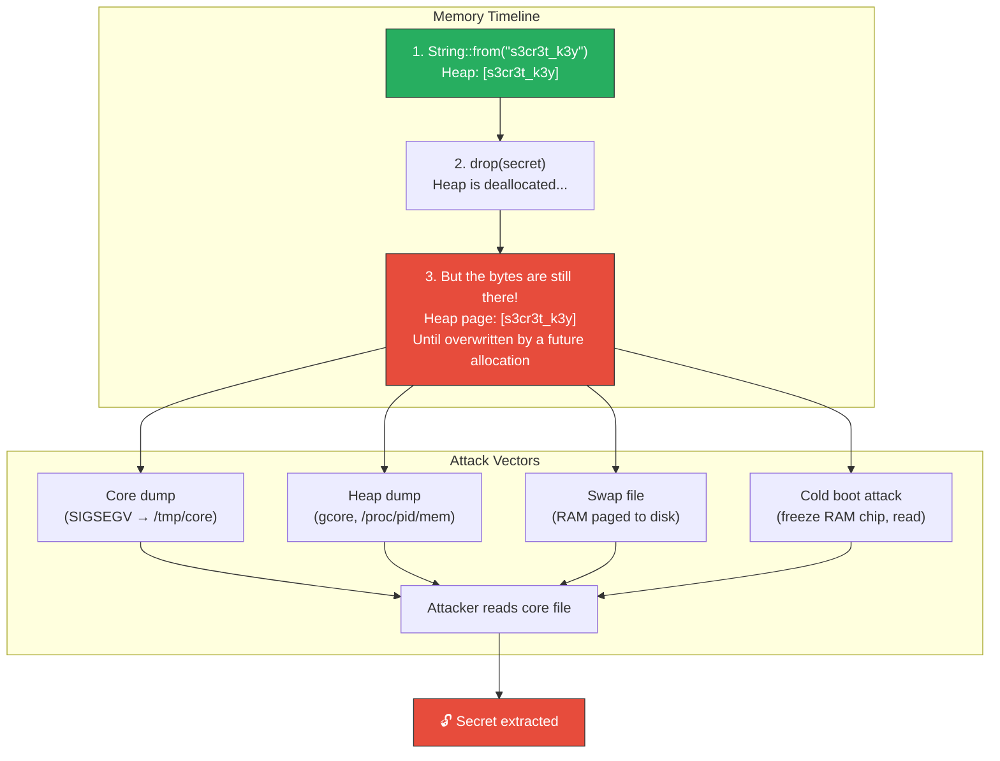

# 4. Secrets Management and Memory Sanitization 🔴

> **What you'll learn:**
> - Why secrets (passwords, private keys, API tokens) persist in RAM long after you think you're done with them — and how attackers exploit this.
> - The attack surface: heap dumps, core files, `/proc/pid/mem`, swap files, and cold-boot attacks.
> - How the `zeroize` crate overwrites sensitive memory with zeros at drop time, defeating compiler optimizations that would skip the write.
> - How to implement `ZeroizeOnDrop` for your own types and integrate it with `secrecy` for type-level secret protection.

**Cross-references:** This chapter builds on constant-time operations from [Chapter 3](ch03-mitigating-side-channel-attacks.md). Memory layout and drop semantics are covered in [Rust Memory Management](../memory-management-book/src/SUMMARY.md).

---

## The Problem: Ghosts in RAM

When you drop a `String` or `Vec<u8>` in Rust, the destructor deallocates memory — but it does **not** overwrite the contents. The bytes remain at their former address until something else happens to reuse that page.



### Why Doesn't `drop()` Zero Memory?

Two reasons:

1. **Performance.** Zeroing memory on every deallocation is wasted work in non-security contexts. The allocator doesn't zero freed pages.
2. **Compiler optimization.** Even if you manually write `ptr::write_bytes(ptr, 0, len)` before dropping, the compiler may detect that the memory is about to be freed and **eliminate the zeroing as a dead store**.

This is the **Dead Store Elimination (DSE) problem**: the compiler is correct from an optimization perspective (the write serves no purpose for program correctness) but catastrophically wrong from a security perspective.

---

## The `zeroize` Crate

The `zeroize` crate provides a `Zeroize` trait whose `zeroize()` method overwrites memory with zeros and uses compiler barriers to prevent Dead Store Elimination.

### Core Types and Traits

| Type / Trait | Purpose |
|-------------|---------|
| `Zeroize` | Trait: `fn zeroize(&mut self)` — overwrite with zeros. |
| `ZeroizeOnDrop` | Trait: automatically zeroize when dropped. |
| `Zeroizing<T>` | Wrapper: `Zeroizing<String>` auto-zeroizes the inner value on drop. |
| `#[derive(Zeroize, ZeroizeOnDrop)]` | Derive macros for your own structs. |

### The Naive Way (Secrets Linger)

```rust
// 💥 VULNERABILITY: The password lives in RAM until the page is reused.
// A core dump, heap dump, or memory forensics tool will find it.

fn authenticate(username: &str, password: &str) -> bool {
    let api_key = std::env::var("API_KEY").unwrap(); // 💥 String on the heap
    let valid = verify(username, password, &api_key);
    // api_key is dropped here — but the bytes remain in memory!
    valid
}
// 💥 If the process crashes after this function, the API key
// is in the core dump. If swap is enabled, it may be on disk.
```

### The Enterprise Way

```rust
use zeroize::{Zeroize, Zeroizing};

// ✅ FIX: Zeroizing<String> overwrites the string's heap buffer with zeros
// the instant it goes out of scope — even if the optimizer tries to skip it.

fn authenticate(username: &str, password: &str) -> bool {
    // Zeroizing<String> wraps a String and zeroizes it on drop.
    let api_key = Zeroizing::new(
        std::env::var("API_KEY").expect("API_KEY must be set")
    );

    let valid = verify(username, password, &api_key);
    // ✅ api_key is dropped here. The heap buffer is overwritten with zeros
    // BEFORE deallocation. Dead Store Elimination is defeated.
    valid
}
```

---

## Deriving `ZeroizeOnDrop` for Custom Types

For any struct that holds secrets, derive both `Zeroize` and `ZeroizeOnDrop`:

```rust
use zeroize::{Zeroize, ZeroizeOnDrop};

/// A parsed set of credentials. Every field is zeroized on drop.
#[derive(Zeroize, ZeroizeOnDrop)]
struct Credentials {
    /// The username — not technically secret, but we zero it anyway
    /// to avoid leaking which user was authenticating.
    username: String,

    /// The raw password — MUST be zeroized.
    password: String,

    /// An HMAC key derived from the password — MUST be zeroized.
    hmac_key: Vec<u8>,
}

impl Credentials {
    fn new(username: String, password: String) -> Self {
        let hmac_key = derive_key(password.as_bytes());
        Self { username, password, hmac_key }
    }
}

// When a Credentials value goes out of scope:
// 1. username's heap buffer → all zeros
// 2. password's heap buffer → all zeros
// 3. hmac_key's heap buffer → all zeros
// 4. THEN the allocator frees the memory
// An attacker reading freed memory sees only zeros.
```

### Selective Zeroing with `#[zeroize(skip)]`

Sometimes a struct contains both secret and non-secret fields. Zeroizing non-secret fields wastes time in hot paths:

```rust
use zeroize::{Zeroize, ZeroizeOnDrop};

#[derive(Zeroize, ZeroizeOnDrop)]
struct JwtPayload {
    #[zeroize(skip)]
    issuer: String,        // Public information — skip

    #[zeroize(skip)]
    expiry: u64,           // Public — skip

    signing_key: Vec<u8>,  // 🔐 SECRET — zeroized on drop
    claims_raw: Vec<u8>,   // 🔐 May contain PII — zeroized on drop
}
```

---

## The `secrecy` Crate: Type-Level Protection

`zeroize` handles the memory cleanup. The `secrecy` crate adds **type-level** protection: a `Secret<T>` wrapper that:

1. Implements `ZeroizeOnDrop` automatically.
2. Implements `Debug` as `Secret([REDACTED])` — no accidental logging.
3. Does **not** implement `Display` — you cannot accidentally print it.
4. Requires explicit `.expose_secret()` to access the inner value.

```rust
use secrecy::{ExposeSecret, Secret};

struct Config {
    database_url: String,
    api_secret: Secret<String>,  // ✅ Cannot be logged or printed accidentally
}

fn connect(config: &Config) {
    // This compiles:
    println!("Connecting to {}", config.database_url);

    // 💥 This does NOT compile — Secret<String> does not impl Display.
    // println!("Secret: {}", config.api_secret);

    // ✅ Explicit opt-in to access the secret:
    let secret_value = config.api_secret.expose_secret();
    // Use secret_value here, then let it go out of scope.
}

// When `config` is dropped, api_secret's inner String is zeroized.
```

### Combining `Secret` with `Zeroize` for Custom Types

```rust
use secrecy::{CloneableSecret, DebugSecret, Secret};
use zeroize::{Zeroize, ZeroizeOnDrop};

#[derive(Clone, Zeroize, ZeroizeOnDrop)]
struct PrivateKey(Vec<u8>);

// Implement the marker traits so Secret<PrivateKey> works.
impl CloneableSecret for PrivateKey {}
impl DebugSecret for PrivateKey {
    fn debug_secret(f: &mut std::fmt::Formatter<'_>) -> std::fmt::Result {
        write!(f, "PrivateKey([REDACTED])")
    }
}

// Now Secret<PrivateKey> gives you:
// - Type-level protection against accidental logging
// - Zeroing of the key material on drop
fn load_key() -> Secret<PrivateKey> {
    let key_bytes = std::fs::read("/etc/app/private.key")
        .expect("missing private key file");
    Secret::new(PrivateKey(key_bytes))
}
```

---

## Operational Hardening: Beyond Code

Zeroizing memory in your application is necessary but not sufficient. These operational measures complete the defense:

| Threat | Mitigation |
|--------|-----------|
| **Core dumps** | Disable via `ulimit -c 0` or `prctl(PR_SET_DUMPABLE, 0)` on Linux. |
| **Swap** | Disable swap (`swapoff -a`) or use encrypted swap. |
| **`/proc/pid/mem`** | Restrict with `prctl(PR_SET_DUMPABLE, 0)` and Seccomp/AppArmor. |
| **Memory-mapped files** | Avoid `mmap`-ing secrets. If unavoidable, `mlock()` to prevent paging. |
| **Debug builds** | Never deploy debug builds to production — they may not optimize away dead stores, but they also don't strip symbols. |

### Locking Memory Pages with `mlock`

For the most sensitive keys (e.g., TLS private keys), prevent the OS from swapping the page to disk:

```rust
use zeroize::Zeroizing;

fn load_tls_key() -> Zeroizing<Vec<u8>> {
    let key = Zeroizing::new(
        std::fs::read("/etc/tls/private.key")
            .expect("missing TLS key")
    );

    // ✅ Lock the page in RAM — prevent swapping to disk.
    // This requires CAP_IPC_LOCK on Linux.
    #[cfg(unix)]
    unsafe {
        // SAFETY: We're locking the Vec's heap buffer in memory.
        // The pointer is valid for the Vec's length.
        libc::mlock(
            key.as_ptr() as *const libc::c_void,
            key.len(),
        );
    }

    key
    // When `key` is dropped:
    // 1. Zeroizing writes zeros over the Vec's buffer.
    // 2. The allocator frees the memory.
    // 3. (Optionally) munlock is called to release the page lock.
}
```

---

## Verifying Zeroization in Tests

Trust, but verify. Use a test that examines memory after drop to confirm secrets are gone:

```rust
#[cfg(test)]
mod tests {
    use zeroize::Zeroizing;

    #[test]
    fn secret_is_zeroed_after_drop() {
        let secret = Zeroizing::new(vec![0xDE, 0xAD, 0xBE, 0xEF]);

        // Capture the pointer and length before dropping.
        let ptr = secret.as_ptr();
        let len = secret.len();

        // Drop the Zeroizing wrapper — this should zero the memory.
        drop(secret);

        // Read the formerly-occupied memory.
        // ⚠️ This is technically UB (reading deallocated memory),
        // but it's acceptable in a test to verify zeroization.
        // In practice, the allocator usually hasn't reused the page yet.
        let residual = unsafe {
            std::slice::from_raw_parts(ptr, len)
        };

        // The memory should now be all zeros.
        assert!(
            residual.iter().all(|&b| b == 0),
            "Secret was NOT zeroized! Residual bytes: {:?}",
            residual
        );
    }
}
```

> **Note:** This test relies on the allocator not immediately reusing the page. It works reliably in practice but is technically undefined behavior. For formal verification, use Miri or AddressSanitizer.

---

<details>
<summary><strong>🏋️ Exercise: Zeroize-Protected Key Store</strong> (click to expand)</summary>

**Challenge:** Build a `KeyStore` struct that:

1. Holds a `HashMap<String, Secret<Vec<u8>>>` mapping key names to secret values.
2. Provides `insert(name, value)` and `get(name) -> Option<&[u8]>` methods.
3. Implements `Drop` to explicitly zeroize all values (via `Secret`'s built-in `ZeroizeOnDrop`).
4. Implements `Debug` to print `KeyStore { keys: ["key1", "key2"], values: [REDACTED] }` — key names are visible, values are not.
5. Write a test that inserts a key, retrieves it, drops the `KeyStore`, and verifies the value is gone from memory.

<details>
<summary>🔑 Solution</summary>

```rust
use secrecy::{ExposeSecret, Secret};
use std::collections::HashMap;
use std::fmt;

/// A key store that automatically zeroizes all secret values on drop.
struct KeyStore {
    store: HashMap<String, Secret<Vec<u8>>>,
}

impl KeyStore {
    fn new() -> Self {
        Self {
            store: HashMap::new(),
        }
    }

    /// Insert a secret value. The value is wrapped in Secret<Vec<u8>>
    /// which guarantees zeroization on drop.
    fn insert(&mut self, name: impl Into<String>, value: Vec<u8>) {
        self.store.insert(name.into(), Secret::new(value));
    }

    /// Retrieve a reference to the secret bytes.
    /// The caller must not store this reference beyond the current scope.
    fn get(&self, name: &str) -> Option<&[u8]> {
        self.store.get(name).map(|s| s.expose_secret().as_slice())
    }

    /// List all key names (safe — names are not secret).
    fn key_names(&self) -> Vec<&str> {
        self.store.keys().map(|s| s.as_str()).collect()
    }
}

// ✅ Debug implementation that never prints secret values.
impl fmt::Debug for KeyStore {
    fn fmt(&self, f: &mut fmt::Formatter<'_>) -> fmt::Result {
        let names: Vec<&str> = self.store.keys().map(|s| s.as_str()).collect();
        write!(
            f,
            "KeyStore {{ keys: {:?}, values: [REDACTED] }}",
            names
        )
    }
}

// Drop is handled automatically by Secret<Vec<u8>>'s ZeroizeOnDrop impl.
// When KeyStore is dropped, each Secret in the HashMap is dropped,
// which triggers zeroization of every Vec<u8> buffer.

#[cfg(test)]
mod tests {
    use super::*;

    #[test]
    fn keystore_retrieves_and_zeroizes() {
        let mut ks = KeyStore::new();
        ks.insert("hmac-key", vec![0xCA, 0xFE, 0xBA, 0xBE]);

        // Verify retrieval.
        let value = ks.get("hmac-key").expect("key should exist");
        assert_eq!(value, &[0xCA, 0xFE, 0xBA, 0xBE]);

        // Capture pointer for post-drop verification.
        let ptr = value.as_ptr();
        let len = value.len();

        // Debug output should be safe.
        let debug_str = format!("{:?}", ks);
        assert!(debug_str.contains("REDACTED"));
        assert!(!debug_str.contains("CAFE"));

        // Drop the keystore — all secrets should be zeroized.
        drop(ks);

        // Verify zeroization (test-only, technically UB).
        let residual = unsafe { std::slice::from_raw_parts(ptr, len) };
        assert!(
            residual.iter().all(|&b| b == 0),
            "Secret was NOT zeroized! Found: {:?}",
            residual
        );
    }
}
```

</details>
</details>

---

> **Key Takeaways**
>
> 1. **`drop()` does not erase memory.** Sensitive data persists in RAM until the page is reused. Core dumps, swap, and `/proc/pid/mem` are real attack vectors.
> 2. **The compiler fights you.** Dead Store Elimination removes your manual zeroing. Use `zeroize`, which employs `black_box` and volatile writes to defeat the optimizer.
> 3. **`Zeroizing<T>` for automatic cleanup.** Wrap `String`, `Vec<u8>`, or any `Zeroize`-implementing type. Secrets are erased at drop time.
> 4. **`Secret<T>` for type-level protection.** Prevents accidental logging and display. Forces explicit `.expose_secret()` access.
> 5. **Operational hardening is mandatory.** Disable core dumps, disable or encrypt swap, lock sensitive pages with `mlock`. Code-level zeroization without operational controls is half a defense.

> **See also:**
> - [Chapter 3: Mitigating Side-Channel Attacks](ch03-mitigating-side-channel-attacks.md) — constant-time operations on the secrets this chapter protects.
> - [Chapter 7: Capstone](ch07-capstone-soc2-compliant-auth-service.md) — `Zeroizing`-wrapped keys in the hardened auth service.
> - [Rust Memory Management](../memory-management-book/src/SUMMARY.md) — drop semantics and ownership that underpin zeroization.
