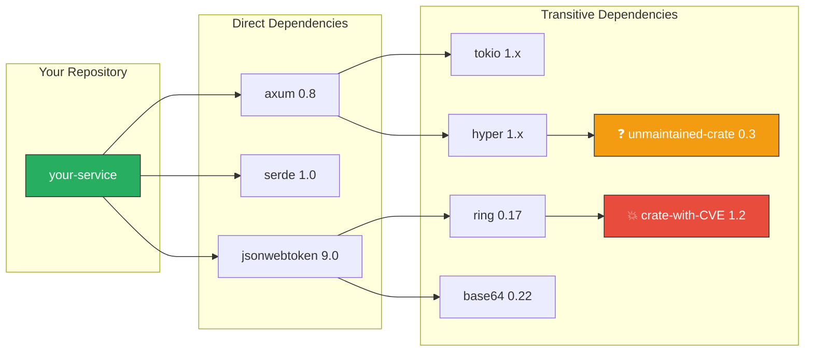

# 5. Dependency Auditing and Compliance 🟡

> **What you'll learn:**
> - Why `cargo add` is the most dangerous command in your security posture — every dependency is a trust decision.
> - How to use `cargo-deny` to enforce license policies, ban specific crates, and detect duplicate dependency versions.
> - How to use `cargo-audit` to scan `Cargo.lock` for known CVEs from the RustSec Advisory Database.
> - How to integrate both tools as hard CI gates that block merges when a violation is detected.

**Cross-references:** This chapter extends the supply chain overview from [Rust Engineering Practices](../engineering-book/src/SUMMARY.md). It is a prerequisite for [Chapter 6: cargo vet and SBOMs](ch06-trust-but-verify-cargo-vet-and-sboms.md).

---

## The Supply Chain Threat Model

Every `cargo add` pulls code from `crates.io` — a public registry with minimal gatekeeping. Your binary is not just your code; it's every line of every transitive dependency.



You explicitly chose `axum`, `serde`, and `jsonwebtoken`. But you implicitly trusted **hundreds** of transitive dependencies. Any one of them might:

- Contain a known CVE (vulnerability).
- Use a license incompatible with your product (AGPL in a proprietary service).
- Be unmaintained and accumulating unpatched bugs.
- Be a typosquatting attack (`serde_jsom` instead of `serde_json`).

---

## `cargo-audit`: Scanning for Known Vulnerabilities

`cargo-audit` checks your `Cargo.lock` against the [RustSec Advisory Database](https://rustsec.org/) — a curated list of CVEs and security advisories for Rust crates.

### Installation and Usage

```bash
# Install
cargo install cargo-audit

# Scan your project
cargo audit

# Output (example):
# Crate:     chrono
# Version:   0.4.19
# Title:     Potential segfault in localtime_r invocations
# Date:      2020-11-10
# ID:        RUSTSEC-2020-0159
# URL:       https://rustsec.org/advisories/RUSTSEC-2020-0159
# Solution:  Upgrade to >=0.4.20
#
# error: 1 vulnerability found!
```

### CI Integration (GitHub Actions)

```yaml
# .github/workflows/security.yml
name: Security Audit
on:
  push:
    branches: [main]
  pull_request:
  schedule:
    # ✅ Run daily — new CVEs are published any time.
    - cron: '0 6 * * *'

jobs:
  audit:
    runs-on: ubuntu-latest
    steps:
      - uses: actions/checkout@v4

      - name: Install cargo-audit
        run: cargo install cargo-audit

      - name: Run security audit
        run: cargo audit
        # ✅ This fails the CI pipeline if any vulnerability is found.
        # No exceptions. Fix or explicitly acknowledge in deny.toml.
```

### Handling False Positives and Accepted Risks

Sometimes a CVE exists in a dependency but doesn't affect your usage. Document the accepted risk:

```bash
# Generate an audit.toml to track acknowledged advisories
cargo audit --deny warnings

# In audit.toml:
[advisories]
ignore = [
    # RUSTSEC-2020-0159: chrono localtime_r — we only use UTC, not affected.
    # Accepted by: @security-team, 2024-03-15, review ticket: SEC-1234
    "RUSTSEC-2020-0159",
]
```

> **Compliance note:** SOC 2 and FedRAMP require documented risk acceptance for known vulnerabilities. The comment format above shows the reviewer, date, and tracking ticket — exactly what an auditor wants to see.

---

## `cargo-deny`: Policy-as-Code for Dependencies

While `cargo-audit` checks for CVEs, `cargo-deny` is a comprehensive policy engine that checks:

| Check | What it does |
|-------|-------------|
| `advisories` | Same as `cargo-audit` — scans RustSec DB. |
| `licenses` | Blocks disallowed licenses (AGPL, GPL, unlicensed). |
| `bans` | Blocks specific crates or duplicate versions. |
| `sources` | Restricts where crates can come from (e.g., only `crates.io`). |

### Installation and Initialization

```bash
cargo install cargo-deny
cargo deny init    # Creates deny.toml with documented defaults
cargo deny check   # Run all checks
```

### `deny.toml`: The Enterprise Configuration

```toml
# deny.toml — Supply chain policy for a SOC 2-compliant Rust service.
# This file is a HARD GATE in CI. Violations block the merge.

# ============================================================
# Advisory checks (CVE scanning)
# ============================================================
[advisories]
vulnerability = "deny"      # Block builds with known CVEs.
unmaintained = "warn"        # Warn on unmaintained crates.
yanked = "deny"              # Block yanked crate versions.
notice = "warn"
ignore = [
    # Document any accepted risks here with justification.
]

# ============================================================
# License checks
# ============================================================
[licenses]
unlicensed = "deny"          # No unlicensed code in the binary.
copyleft = "deny"            # Block all copyleft licenses.

# Explicitly allow only these licenses:
allow = [
    "MIT",
    "Apache-2.0",
    "Apache-2.0 WITH LLVM-exception",
    "BSD-2-Clause",
    "BSD-3-Clause",
    "ISC",
    "Unicode-3.0",
    "Unicode-DFS-2016",
    "Zlib",
    "BSL-1.0",
    "OpenSSL",
]

# Deny these licenses explicitly (defense in depth):
deny = [
    "AGPL-3.0",       # ✅ Blocks AGPL — would require open-sourcing your service.
    "GPL-2.0",
    "GPL-3.0",
    "LGPL-2.0",
    "LGPL-2.1",
    "LGPL-3.0",
    "SSPL-1.0",       # ✅ Blocks Server Side Public License (MongoDB-style).
    "BUSL-1.1",       # ✅ Blocks Business Source License.
]

[[licenses.clarify]]
name = "ring"
expression = "MIT AND ISC AND OpenSSL"
license-files = [{ path = "LICENSE", hash = 0xbd0eed23 }]

# ============================================================
# Crate bans
# ============================================================
[bans]
multiple-versions = "warn"   # Warn if the same crate appears in multiple versions.
wildcards = "deny"           # Block `*` version requirements.
highlight = "lowest-version" # Show the lowest version in duplicate warnings.

deny = [
    # Block crates with known security issues or alternatives:
    # { name = "openssl", wrappers = ["native-tls"] },
]

# Allow specific duplicates if they're unavoidable:
# skip = [
#     { name = "syn", version = "1.0" },  # proc-macro ecosystem split
# ]

# ============================================================
# Source restrictions
# ============================================================
[sources]
unknown-registry = "deny"    # Only allow crates.io.
unknown-git = "deny"         # Block git dependencies in production.
allow-registry = ["https://github.com/rust-lang/crates.io-index"]
allow-git = []               # No git dependencies allowed.
```

### The Naive Way vs. The Enterprise Way

```toml
# 💥 VULNERABILITY: No deny.toml. Any developer can add any crate with any license.
# A PR adds `crate-with-agpl-dependency` and nobody notices until Legal calls.

# (No file. No policy. No guardrails.)

# ✅ FIX: The deny.toml above acts as a policy-as-code firewall.
# It runs in CI and blocks the merge before the code ever reaches main.
```

---

## `cargo-deny` vs. `cargo-audit` Comparison

| Feature | `cargo-audit` | `cargo-deny` |
|---------|--------------|-------------|
| CVE scanning | ✅ Primary purpose | ✅ Via `[advisories]` section |
| License enforcement | ❌ | ✅ Allow/deny lists, SPDX expressions |
| Crate banning | ❌ | ✅ Ban specific crates or duplicates |
| Source restriction | ❌ | ✅ Restrict to crates.io only |
| Unmaintained detection | ✅ | ✅ |
| CI integration | ✅ Exit code | ✅ Exit code + detailed JSON output |

**Recommendation:** Use **both**. `cargo-audit` for its advisory database update speed. `cargo-deny` for its comprehensive policy engine. They complement each other.

---

## Automating Dependency Updates

Scanning is reactive — it finds problems after they exist. Proactive dependency updates reduce your exposure window:

### Dependabot / Renovate Configuration

```yaml
# .github/dependabot.yml
version: 2
updates:
  - package-ecosystem: "cargo"
    directory: "/"
    schedule:
      interval: "weekly"
    reviewers:
      - "security-team"
    labels:
      - "dependencies"
      - "security"
    # ✅ Group minor/patch updates to reduce PR noise.
    groups:
      rust-deps:
        patterns:
          - "*"
        update-types:
          - "minor"
          - "patch"
```

> **Operational note:** Do not auto-merge dependency updates. Review each one. Supply chain attacks often hide in minor version bumps.

---

<details>
<summary><strong>🏋️ Exercise: Harden Your CI Pipeline</strong> (click to expand)</summary>

**Challenge:**

1. Create a `deny.toml` that:
   - Denies all CVEs and yanked crates.
   - Allows only `MIT`, `Apache-2.0`, `BSD-2-Clause`, `BSD-3-Clause`, and `ISC` licenses.
   - Explicitly denies `AGPL-3.0`, `GPL-3.0`, and `SSPL-1.0`.
   - Denies unknown registries and git dependencies.
2. Run `cargo deny check` on a real Rust project and fix any violations.
3. Create a GitHub Actions workflow that runs both `cargo audit` and `cargo deny check` on every PR.
4. Intentionally add a crate with a known CVE (e.g., an old version of `chrono` or `hyper`) and verify that your CI pipeline blocks the merge.

<details>
<summary>🔑 Solution</summary>

```toml
# deny.toml (condensed version for the exercise)
[advisories]
vulnerability = "deny"
unmaintained = "warn"
yanked = "deny"

[licenses]
unlicensed = "deny"
copyleft = "deny"
allow = ["MIT", "Apache-2.0", "BSD-2-Clause", "BSD-3-Clause", "ISC"]
deny = ["AGPL-3.0", "GPL-3.0", "SSPL-1.0"]

[bans]
multiple-versions = "warn"
wildcards = "deny"

[sources]
unknown-registry = "deny"
unknown-git = "deny"
allow-registry = ["https://github.com/rust-lang/crates.io-index"]
```

```yaml
# .github/workflows/supply-chain.yml
name: Supply Chain Security
on:
  pull_request:
  push:
    branches: [main]
  schedule:
    - cron: '0 6 * * *'

jobs:
  audit:
    runs-on: ubuntu-latest
    steps:
      - uses: actions/checkout@v4
      - name: Install tools
        run: |
          cargo install cargo-audit cargo-deny
      - name: cargo audit
        run: cargo audit
      - name: cargo deny check
        run: cargo deny check

  # To test: add this to Cargo.toml and push:
  # [dependencies]
  # chrono = "=0.4.19"  # Has RUSTSEC-2020-0159
  #
  # The audit job will fail with:
  # error: 1 vulnerability found!
  #     Crate:     chrono
  #     Version:   0.4.19
  #     Title:     Potential segfault in localtime_r invocations
```

</details>
</details>

---

> **Key Takeaways**
>
> 1. **Every dependency is a trust decision.** `cargo add` pulls code from a public registry into your binary. Treat it with the same scrutiny as a code review.
> 2. **`cargo-audit` catches known CVEs.** Run it in CI on every PR and on a daily cron schedule. New advisories appear constantly.
> 3. **`cargo-deny` enforces policy-as-code.** License allow/deny lists, source restrictions, and crate bans — all in one `deny.toml`.
> 4. **CI gates must be hard gates.** A warning is useless if it doesn't block the merge. Set `vulnerability = "deny"` and mean it.
> 5. **Document risk acceptance.** When you must ignore an advisory, record who approved it, when, and the tracking ticket. Auditors will ask.

> **See also:**
> - [Chapter 6: Trust, but Verify: cargo vet and SBOMs](ch06-trust-but-verify-cargo-vet-and-sboms.md) — cryptographic verification and SBOMs.
> - [Chapter 7: Capstone](ch07-capstone-soc2-compliant-auth-service.md) — the `deny.toml` for the hardened auth service.
> - [Rust Engineering Practices](../engineering-book/src/SUMMARY.md) — broader CI/CD pipeline design.
