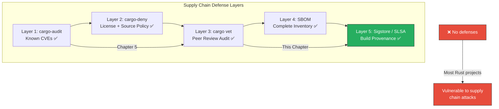

# 6. Trust, but Verify: `cargo vet` and SBOMs 🔴

> **What you'll learn:**
> - Why CVE scanning (Chapter 5) is necessary but insufficient — you also need to verify that **someone you trust reviewed the code** in every dependency.
> - How Mozilla's `cargo vet` creates a cryptographic audit chain for your dependency tree, ensuring every crate version was reviewed by a trusted entity.
> - How to generate a Software Bill of Materials (SBOM) in CycloneDX or SPDX format using `cargo-sbom`.
> - How SLSA (Supply-chain Levels for Software Artifacts) framework maps to Rust's build and publish pipeline, and what Level 3 compliance requires.

**Cross-references:** This chapter extends [Chapter 5: Dependency Auditing](ch05-dependency-auditing-and-compliance.md). It builds toward the capstone in [Chapter 7](ch07-capstone-soc2-compliant-auth-service.md).

---

## Beyond CVE Scanning: The Trust Problem

`cargo-audit` and `cargo-deny` answer: *"Does this dependency have a known vulnerability?"* But they cannot answer:

- **Has anyone actually read this code?** A crate with zero CVEs may simply be unaudited.
- **Was this version published by the legitimate maintainer?** Account takeover on crates.io would push a malicious version with no CVE.
- **Does this crate do what it claims?** A crate named `base64-fast` might exfiltrate environment variables.

This is the **trust gap** that `cargo vet` and SBOMs close.



---

## `cargo vet`: Cryptographic Peer Review

`cargo vet` (developed by Mozilla for Firefox) maintains a set of **audit records** — signed attestations that a specific crate version has been reviewed by a trusted person or organization.

### Core Concepts

| Concept | Description |
|---------|-------------|
| **Audit** | An attestation that a crate version (or a diff between versions) has been reviewed. |
| **Criteria** | What was checked: `safe-to-deploy`, `safe-to-run`, `does-not-implement-crypto`. |
| **Trust graph** | You import audit records from organizations you trust (Mozilla, Google, etc.). |
| **Exemptions** | Temporary allowances for unvetted crates, with documented justification. |

### Installation and Setup

```bash
# Install cargo-vet
cargo install cargo-vet

# Initialize in your project — creates supply-chain/ directory
cargo vet init

# Check your project — lists all unvetted dependencies
cargo vet
```

The `supply-chain/` directory created by `cargo vet init`:

```
supply-chain/
├── config.toml         # Trust configuration and criteria
├── audits.toml         # Your organization's audit records
├── imports.lock        # Locked audit imports from trusted orgs
```

### `config.toml`: Defining Trust

```toml
# supply-chain/config.toml

# Define what "safe-to-deploy" means for your organization.
[criteria.safe-to-deploy]
description = """
This crate has been reviewed for:
- No unsafe code that could cause UB
- No network access or file I/O beyond documented purpose
- No license violations
- No obfuscated code
"""

# Import audits from organizations you trust.
# These are real organizations that publish their audit records publicly.
[imports.mozilla]
url = "https://raw.githubusercontent.com/nickel-org/nickel.rs/main/supply-chain/audits.toml"

[imports.google]
url = "https://chromium.googlesource.com/chromium/src/+/main/supply-chain/audits.toml"

[imports.isrg]
url = "https://raw.githubusercontent.com/nickel-org/nickel.rs/main/supply-chain/audits.toml"

# Define the default criteria for vetting.
[policy]
criteria = "safe-to-deploy"

# Per-crate policy overrides:
# [policy.ring]
# criteria = "safe-to-deploy"
# notes = "Crypto crate — requires careful review."
```

### Recording an Audit

When you review a crate (or a diff between versions), record your audit:

```bash
# Certify that you reviewed serde 1.0.210:
cargo vet certify serde 1.0.210

# Certify a diff (you only reviewed the delta):
cargo vet certify serde 1.0.200 1.0.210

# This appends to supply-chain/audits.toml:
# [[audits.serde]]
# who = "your-name@your-org.com"
# criteria = "safe-to-deploy"
# version = "1.0.210"
# notes = "Reviewed for safe-to-deploy criteria."
```

### Handling Unvetted Dependencies

When `cargo vet` finds unvetted dependencies:

```bash
$ cargo vet
  Vetting Failed!

  3 crates need to be vetted:
    tokio-macros:2.5.0 — missing "safe-to-deploy"
    pin-project-lite:0.2.16 — missing "safe-to-deploy"
    itoa:1.0.14 — missing "safe-to-deploy"

  Use `cargo vet certify` to record an audit.
  Use `cargo vet suggest` for the easiest path forward.
```

```bash
# See which crates are easiest to review (smallest diff):
cargo vet suggest

# If you need to temporarily exempt a crate:
cargo vet add-exemption tokio-macros 2.5.0

# This adds to config.toml:
# [[exemptions.tokio-macros]]
# version = "2.5.0"
# criteria = "safe-to-deploy"
# suggest = true    # Remind you to audit this later
```

> **Compliance note:** Exemptions should be time-boxed. In a SOC 2 environment, track exemptions as tickets with due dates.

---

## Software Bill of Materials (SBOM)

An SBOM is a **machine-readable inventory** of every component in your software. Think of it as an ingredient list for your binary.

### Why SBOMs Matter

| Regulation / Framework | SBOM requirement |
|----------------------|-----------------|
| **Executive Order 14028** (US) | Federal agencies must require SBOMs from vendors. |
| **FedRAMP** | SBOM documentation required for authorized cloud services. |
| **PCI-DSS 4.0** | Software inventory and vulnerability tracking required. |
| **EU Cyber Resilience Act** | SBOM mandatory for products sold in the EU. |
| **SOC 2 Type II** | Documented component inventory for Change Management. |

### SBOM Formats

| Format | Maintained by | Common use case |
|--------|--------------|----------------|
| **CycloneDX** | OWASP | Application and library SBOMs. JSON and XML. |
| **SPDX** | Linux Foundation | License compliance and supply chain. |
| **SWID** | ISO/IEC 19770-2 | Software identification tags. Less common for open source. |

### Generating an SBOM with `cargo-sbom`

```bash
# Install
cargo install cargo-sbom

# Generate a CycloneDX SBOM in JSON format:
cargo sbom --output-format cyclone_dx_json_1_4 > sbom.cdx.json

# Generate SPDX:
cargo sbom --output-format spdx_json_2_3 > sbom.spdx.json
```

Example CycloneDX output (abbreviated):

```json
{
  "bomFormat": "CycloneDX",
  "specVersion": "1.4",
  "serialNumber": "urn:uuid:...",
  "version": 1,
  "metadata": {
    "component": {
      "type": "application",
      "name": "auth-service",
      "version": "0.1.0"
    }
  },
  "components": [
    {
      "type": "library",
      "name": "axum",
      "version": "0.8.1",
      "purl": "pkg:cargo/axum@0.8.1",
      "licenses": [
        { "license": { "id": "MIT" } }
      ]
    },
    {
      "type": "library",
      "name": "subtle",
      "version": "2.6.1",
      "purl": "pkg:cargo/subtle@2.6.1",
      "licenses": [
        { "license": { "id": "BSD-3-Clause" } }
      ]
    }
  ]
}
```

### CI Integration: SBOM Generation

```yaml
# .github/workflows/sbom.yml
name: Generate SBOM
on:
  push:
    tags: ['v*']  # Generate on release tags only.

jobs:
  sbom:
    runs-on: ubuntu-latest
    steps:
      - uses: actions/checkout@v4

      - name: Install cargo-sbom
        run: cargo install cargo-sbom

      - name: Generate CycloneDX SBOM
        run: cargo sbom --output-format cyclone_dx_json_1_4 > sbom.cdx.json

      - name: Upload SBOM as release artifact
        uses: actions/upload-artifact@v4
        with:
          name: sbom
          path: sbom.cdx.json
          retention-days: 365  # ✅ Retain for audit purposes
```

---

## SLSA Framework: Build Provenance

SLSA (Supply-chain Levels for Software Artifacts) defines a maturity model for supply chain security. Here's how each level maps to Rust:

| SLSA Level | Requirement | Rust implementation |
|-----------|-------------|-------------------|
| **1** | Build process is documented | `Cargo.toml` + `Cargo.lock` in version control |
| **2** | Build service generates provenance | CI/CD generates build metadata (who, when, what) |
| **3** | Hardened build platform; non-falsifiable provenance | Isolated CI runners + Sigstore signing |
| **4** | Two-person review of all changes | `cargo vet` audit records + PR reviews |

### Reproducible Builds

For SLSA Level 3+, builds must be reproducible: the same source should produce a bit-for-bit identical binary.

```bash
# Build with locked dependencies (deterministic resolution):
cargo build --release --locked

# Verify reproducibility:
sha256sum target/release/auth-service
# Build again on a different machine with the same toolchain:
sha256sum target/release/auth-service
# ✅ Hashes should match if the build is reproducible.
```

Factors that break reproducibility:

| Factor | Mitigation |
|--------|-----------|
| Rust toolchain version | Pin with `rust-toolchain.toml` |
| System libraries (OpenSSL) | Use `ring` or `rustls` instead of native TLS |
| Build timestamps | Use `SOURCE_DATE_EPOCH` or remove timestamps |
| Path dependencies | Use `--remap-path-prefix` to normalize paths |
| Non-deterministic proc macros | Audit or pin affected crates |

```toml
# rust-toolchain.toml — pin the exact toolchain for reproducibility
[toolchain]
channel = "1.84.0"
components = ["rustfmt", "clippy"]
```

---

## The Complete Supply Chain Pipeline

```mermaid
graph LR
    subgraph "Developer"
        A[Write Code] --> B[cargo deny check]
        B --> C[cargo vet]
    end

    subgraph "CI Pipeline"
        C --> D[cargo audit]
        D --> E[cargo test]
        E --> F["cargo build --release --locked"]
        F --> G[cargo sbom]
    end

    subgraph "Release"
        G --> H[Sign with Sigstore]
        H --> I[Publish Binary + SBOM]
        I --> J[Attestation stored]
    end

    subgraph "Consumer"
        J --> K[Verify signature]
        K --> L[Validate SBOM]
        L --> M["✅ Deploy"]
    end

    style B fill:#f39c12,stroke:#333,color:#fff
    style D fill:#f39c12,stroke:#333,color:#fff
    style G fill:#3498db,stroke:#333,color:#fff
    style H fill:#27ae60,stroke:#333,color:#fff
```



---

<details>
<summary><strong>🏋️ Exercise: Full Supply Chain Audit</strong> (click to expand)</summary>

**Challenge:**

1. Initialize `cargo vet` in any Rust project with at least 10 dependencies.
2. Run `cargo vet` and document how many crates are unvetted.
3. Import audit records from at least one trusted organization.
4. Certify at least 2 small crates manually (e.g., `itoa`, `cfg-if`).
5. Add exemptions for the rest with documented justification.
6. Generate a CycloneDX SBOM and verify it contains all your dependencies.
7. Create a CI workflow that runs `cargo vet`, `cargo deny check`, and `cargo sbom` on every PR.

<details>
<summary>🔑 Solution</summary>

```bash
# Step 1: Initialize cargo-vet
cd my-rust-project
cargo vet init

# Step 2: Check current status
cargo vet
# Output: "N crates need to be vetted"

# Step 3: Import trusted audits
# Edit supply-chain/config.toml:
```

```toml
# supply-chain/config.toml
[imports.bytecode-alliance]
url = "https://raw.githubusercontent.com/nickel-org/nickel.rs/main/supply-chain/audits.toml"
```

```bash
# Step 4: Manually certify small crates
cargo vet certify itoa 1.0.14
cargo vet certify cfg-if 1.0.0

# Step 5: Exempt the rest
cargo vet suggest   # Shows the easiest crates to review
# For each remaining crate:
cargo vet add-exemption <crate-name> <version>

# Step 6: Generate SBOM
cargo install cargo-sbom
cargo sbom --output-format cyclone_dx_json_1_4 > sbom.cdx.json

# Verify it contains all dependencies:
cat sbom.cdx.json | jq '.components | length'
# Should match the number of dependencies in Cargo.lock
```

```yaml
# Step 7: CI Workflow
# .github/workflows/supply-chain.yml
name: Supply Chain
on: [pull_request]

jobs:
  supply-chain:
    runs-on: ubuntu-latest
    steps:
      - uses: actions/checkout@v4

      - name: Install tools
        run: cargo install cargo-deny cargo-vet cargo-sbom

      - name: Dependency audit
        run: cargo deny check

      - name: Vet check
        run: cargo vet

      - name: Generate SBOM
        run: |
          cargo sbom --output-format cyclone_dx_json_1_4 > sbom.cdx.json
          echo "SBOM generated with $(cat sbom.cdx.json | jq '.components | length') components"

      - name: Upload SBOM
        uses: actions/upload-artifact@v4
        with:
          name: sbom-pr-${{ github.event.number }}
          path: sbom.cdx.json
```

</details>
</details>

---

> **Key Takeaways**
>
> 1. **CVE scanning is Layer 1, not the whole defense.** `cargo vet` adds Layer 3: proof that a trusted human reviewed the code.
> 2. **Trust is transitive and fragile.** Import audits from organizations you actually trust. Don't rubber-stamp exemptions.
> 3. **SBOMs are now a regulatory requirement.** Executive Order 14028, FedRAMP, PCI-DSS 4.0, and the EU CRA all mandate them.
> 4. **Reproducible builds underpin everything.** If you can't reproduce the build, you can't verify the provenance. Pin your toolchain and lock your dependencies.
> 5. **The supply chain pipeline is layered.** `cargo-deny` → `cargo vet` → build → SBOM → sign → publish. Each layer catches what the previous one missed.

> **See also:**
> - [Chapter 5: Dependency Auditing and Compliance](ch05-dependency-auditing-and-compliance.md) — the `cargo-deny` and `cargo-audit` foundation.
> - [Chapter 7: Capstone](ch07-capstone-soc2-compliant-auth-service.md) — full pipeline integration.
> - [Rust Engineering Practices](../engineering-book/src/SUMMARY.md) — CI/CD and build system fundamentals.
