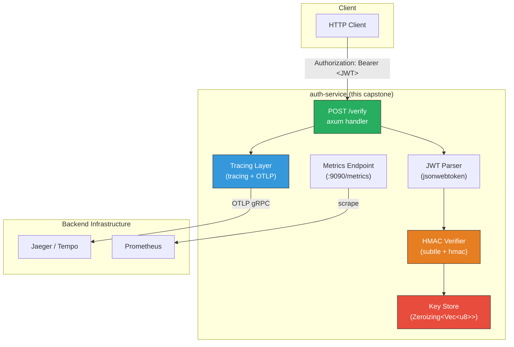

# 7. Capstone: The SOC2-Compliant Authentication Service 🔴

> **What you'll learn:**
> - How to synthesize every technique from this book into a single, production-hardened microservice.
> - How to instrument HTTP handlers with `#[tracing::instrument]` and export OTLP traces (Chapter 1).
> - How to verify JWT HMAC signatures using `subtle` constant-time operations to prevent timing attacks (Chapter 3).
> - How to store cryptographic keys in `Zeroizing<Vec<u8>>` so they're erased from RAM on drop (Chapter 4).
> - How to configure `deny.toml` to block AGPL licenses and known CVEs (Chapter 5).
> - How to generate an SBOM for the final artifact (Chapter 6).

**Cross-references:** This is the synthesis chapter. You should have completed Chapters 1–6 before starting this capstone.

---

## Architecture Overview

We're building `auth-service`: a hardened JWT authentication microservice.



### SOC 2 Compliance Checklist

| SOC 2 Control | How we satisfy it |
|--------------|-------------------|
| **CC6.1** — Logical and physical access controls | JWT verification with constant-time HMAC |
| **CC7.2** — System monitoring | OTLP traces + Prometheus metrics |
| **CC8.1** — Change management | `cargo-deny` policy, `cargo vet` audit records |
| **CC3.1** — Risk management | SBOM generation, dependency auditing |
| **CC6.6** — Encryption key management | `Zeroizing` key store, no secrets in logs |

---

## Step 1: Project Setup

```bash
cargo new auth-service
cd auth-service
```

### `Cargo.toml`

```toml
[package]
name = "auth-service"
version = "0.1.0"
edition = "2024"

[dependencies]
# Web framework
axum = "0.8"
tokio = { version = "1", features = ["full"] }

# Serialization
serde = { version = "1", features = ["derive"] }
serde_json = "1"

# JWT handling
jsonwebtoken = "9"

# Cryptography — constant-time operations
hmac = "0.12"
sha2 = "0.10"
subtle = "2.6"

# Secrets management — zeroize on drop
zeroize = { version = "1", features = ["derive"] }
secrecy = "0.10"

# Tracing and OpenTelemetry
tracing = "0.1"
tracing-subscriber = { version = "0.3", features = ["env-filter"] }
tracing-opentelemetry = "0.29"
opentelemetry = "0.28"
opentelemetry-otlp = { version = "0.28", features = ["grpc-tonic"] }
opentelemetry_sdk = { version = "0.28", features = ["rt-tokio"] }

# Metrics
metrics = "0.24"
metrics-exporter-prometheus = "0.16"

# Utilities
base64 = "0.22"
hex = "0.4"
```

---

## Step 2: Telemetry Initialization (Chapter 1 + 2)

```rust
// src/telemetry.rs
use opentelemetry::global;
use opentelemetry::KeyValue;
use opentelemetry_otlp::SpanExporter;
use opentelemetry_sdk::{
    trace::{SdkTracerProvider, Sampler},
    Resource,
};
use tracing_opentelemetry::OpenTelemetryLayer;
use tracing_subscriber::{layer::SubscriberExt, util::SubscriberInitExt, EnvFilter};

/// Initialize the full telemetry stack:
/// - stdout logging (human-readable, filtered by RUST_LOG)
/// - OTLP trace export to Jaeger/Tempo
/// - Prometheus metrics on :9090
pub fn init() -> SdkTracerProvider {
    // ---- OTLP Tracing ----
    let exporter = SpanExporter::builder()
        .with_tonic()
        .build()
        .expect("OTLP exporter");

    let provider = SdkTracerProvider::builder()
        .with_batch_exporter(exporter)
        .with_sampler(Sampler::ParentBased(Box::new(
            Sampler::TraceIdRatioBased(1.0), // ✅ 100% in dev; tune in prod
        )))
        .with_resource(
            Resource::builder()
                .with_attributes([
                    KeyValue::new("service.name", "auth-service"),
                    KeyValue::new("service.version", env!("CARGO_PKG_VERSION")),
                ])
                .build(),
        )
        .build();

    global::set_tracer_provider(provider.clone());

    let otel_layer = OpenTelemetryLayer::new(provider.tracer("auth-service"));

    tracing_subscriber::registry()
        .with(EnvFilter::try_from_default_env().unwrap_or_else(|_| "info".into()))
        .with(tracing_subscriber::fmt::layer())
        .with(otel_layer)
        .init();

    // ---- Prometheus Metrics ----
    metrics_exporter_prometheus::PrometheusBuilder::new()
        .with_http_listener(([0, 0, 0, 0], 9090))
        .install()
        .expect("Prometheus exporter");

    provider
}
```

---

## Step 3: Secure Key Store (Chapter 4)

```rust
// src/keystore.rs
use secrecy::{ExposeSecret, Secret};
use zeroize::Zeroizing;
use std::sync::Arc;

/// A key store that holds HMAC signing keys.
/// Keys are zeroized from memory the instant the store is dropped.
///
/// In production, keys would be loaded from a secrets manager
/// (HashiCorp Vault, AWS Secrets Manager, Azure Key Vault).
#[derive(Clone)]
pub struct KeyStore {
    /// The HMAC-SHA256 signing key, wrapped in Secret for type-level protection.
    /// - Cannot be accidentally logged (Debug prints [REDACTED]).
    /// - Zeroized on drop.
    hmac_key: Arc<Secret<Zeroizing<Vec<u8>>>>,
}

impl KeyStore {
    /// Create a new key store from a base64-encoded HMAC key.
    ///
    /// In production, this key comes from your secrets manager, NOT
    /// from an environment variable (env vars appear in /proc/pid/environ).
    pub fn from_base64(encoded: &str) -> Result<Self, base64::DecodeError> {
        use base64::Engine;
        let key_bytes = base64::engine::general_purpose::STANDARD.decode(encoded)?;

        Ok(Self {
            hmac_key: Arc::new(Secret::new(Zeroizing::new(key_bytes))),
        })
    }

    /// Access the raw HMAC key bytes.
    /// The caller MUST NOT store or clone this reference.
    pub fn hmac_key(&self) -> &[u8] {
        self.hmac_key.expose_secret()
    }
}

impl std::fmt::Debug for KeyStore {
    fn fmt(&self, f: &mut std::fmt::Formatter<'_>) -> std::fmt::Result {
        write!(f, "KeyStore {{ hmac_key: [REDACTED] }}")
    }
}
```

---

## Step 4: Constant-Time JWT Verification (Chapter 3)

```rust
// src/jwt.rs
use hmac::{Hmac, Mac};
use sha2::Sha256;
use subtle::ConstantTimeEq;
use tracing::{info, warn, instrument};

type HmacSha256 = Hmac<Sha256>;

/// The result of JWT verification.
#[derive(Debug)]
pub enum VerifyError {
    MalformedToken,
    InvalidSignature,
    Expired,
}

/// A minimal JWT claims struct. In production, validate `exp`, `iss`, `aud`, etc.
#[derive(Debug, serde::Deserialize)]
pub struct Claims {
    pub sub: String,
    pub exp: u64,
}

/// Verify a JWT's HMAC-SHA256 signature in constant time.
///
/// This is the security-critical function. The HMAC comparison MUST be
/// constant-time to prevent timing attacks (Chapter 3).
#[instrument(name = "jwt::verify", skip_all, fields(token_prefix))]
pub fn verify_jwt(token: &str, hmac_key: &[u8]) -> Result<Claims, VerifyError> {
    // Record a prefix of the token for tracing (safe — it's the header).
    let prefix = &token[..token.len().min(20)];
    tracing::Span::current().record("token_prefix", prefix);

    // Split the JWT into header.payload.signature.
    let parts: Vec<&str> = token.splitn(3, '.').collect();
    if parts.len() != 3 {
        warn!("malformed JWT: expected 3 parts, got {}", parts.len());
        return Err(VerifyError::MalformedToken);
    }

    let (header_payload, provided_sig_b64) = {
        let sig_start = parts[0].len() + 1 + parts[1].len();
        (&token[..sig_start], parts[2])
    };

    // Decode the provided signature from base64url.
    use base64::Engine;
    let provided_sig = base64::engine::general_purpose::URL_SAFE_NO_PAD
        .decode(provided_sig_b64)
        .map_err(|_| VerifyError::MalformedToken)?;

    // Compute the expected HMAC-SHA256 signature.
    let mut mac = HmacSha256::new_from_slice(hmac_key)
        .expect("HMAC-SHA256 accepts any key length");
    mac.update(header_payload.as_bytes());
    let computed_sig = mac.finalize().into_bytes();

    // ✅ CONSTANT-TIME COMPARISON — the security-critical operation.
    // This takes the same amount of time regardless of how many bytes match.
    // An attacker cannot determine the expected signature through timing.
    let sigs_equal: bool = if computed_sig.len() == provided_sig.len() {
        bool::from(computed_sig.as_slice().ct_eq(&provided_sig))
    } else {
        // Different lengths — still do a comparison to maintain timing consistency.
        let _ = computed_sig.as_slice().ct_eq(computed_sig.as_slice());
        false
    };

    if !sigs_equal {
        // 💥 DO NOT log the expected or provided signature.
        // 💥 DO NOT say "signature mismatch at byte N".
        // ✅ Generic error message — no information leakage.
        warn!("JWT signature verification failed");
        return Err(VerifyError::InvalidSignature);
    }

    info!("JWT signature verified successfully");

    // Decode the claims payload.
    let payload_bytes = base64::engine::general_purpose::URL_SAFE_NO_PAD
        .decode(parts[1])
        .map_err(|_| VerifyError::MalformedToken)?;

    let claims: Claims = serde_json::from_slice(&payload_bytes)
        .map_err(|_| VerifyError::MalformedToken)?;

    // Check expiry.
    let now = std::time::SystemTime::now()
        .duration_since(std::time::UNIX_EPOCH)
        .unwrap()
        .as_secs();

    if claims.exp < now {
        warn!(sub = %claims.sub, "JWT expired");
        return Err(VerifyError::Expired);
    }

    info!(sub = %claims.sub, "JWT claims validated");
    Ok(claims)
}
```

---

## Step 5: HTTP Handlers with Tracing (Chapter 1)

```rust
// src/handlers.rs
use axum::{
    extract::State,
    http::{HeaderMap, StatusCode},
    Json,
};
use metrics::counter;
use serde::Serialize;
use std::time::Instant;
use tracing::{info, warn, instrument};

use crate::keystore::KeyStore;
use crate::jwt;

#[derive(Serialize)]
pub struct VerifyResponse {
    pub valid: bool,
    pub subject: Option<String>,
    pub error: Option<String>,
}

/// POST /verify
///
/// Expects an `Authorization: Bearer <JWT>` header.
/// Returns a JSON response indicating whether the JWT is valid.
///
/// This handler is fully instrumented:
/// - Creates a tracing span with the request metadata.
/// - Records metrics for auth attempts and latency.
/// - Uses constant-time HMAC verification.
/// - Never logs secret material.
#[instrument(
    name = "handler::verify_jwt",
    skip_all,
    fields(
        http.method = "POST",
        http.route = "/verify",
    ),
    level = "info"
)]
pub async fn verify_handler(
    State(keystore): State<KeyStore>,
    headers: HeaderMap,
) -> (StatusCode, Json<VerifyResponse>) {
    let start = Instant::now();

    // Extract the Bearer token from the Authorization header.
    let token = match headers
        .get("authorization")
        .and_then(|v| v.to_str().ok())
        .and_then(|v| v.strip_prefix("Bearer "))
    {
        Some(t) => t,
        None => {
            warn!("missing or malformed Authorization header");
            record_auth_metric("failure", start);
            return (
                StatusCode::UNAUTHORIZED,
                Json(VerifyResponse {
                    valid: false,
                    subject: None,
                    error: Some("Missing Bearer token".into()),
                }),
            );
        }
    };

    // Verify the JWT using constant-time HMAC comparison.
    match jwt::verify_jwt(token, keystore.hmac_key()) {
        Ok(claims) => {
            info!(subject = %claims.sub, "authentication succeeded");
            record_auth_metric("success", start);
            (
                StatusCode::OK,
                Json(VerifyResponse {
                    valid: true,
                    subject: Some(claims.sub),
                    error: None,
                }),
            )
        }
        Err(e) => {
            // ✅ Generic error message — don't reveal which check failed.
            warn!("authentication failed: {:?}", e);
            record_auth_metric("failure", start);
            (
                StatusCode::UNAUTHORIZED,
                Json(VerifyResponse {
                    valid: false,
                    subject: None,
                    // ✅ Same error for all failure modes — prevents enumeration.
                    error: Some("Invalid credentials".into()),
                }),
            )
        }
    }
}

fn record_auth_metric(result: &str, start: Instant) {
    counter!(
        "auth_attempts_total",
        "result" => result.to_owned()
    )
    .increment(1);

    metrics::histogram!(
        "auth_duration_seconds",
        "result" => result.to_owned()
    )
    .record(start.elapsed().as_secs_f64());
}
```

---

## Step 6: Application Entrypoint

```rust
// src/main.rs
mod handlers;
mod jwt;
mod keystore;
mod telemetry;

use axum::{routing::post, Router};
use keystore::KeyStore;

#[tokio::main]
async fn main() {
    // Initialize telemetry (traces + metrics).
    let provider = telemetry::init();

    // Load the HMAC key from an environment variable.
    // ✅ In production, use a secrets manager (Vault, AWS SM, Azure KV).
    // ✅ The key is wrapped in Zeroizing<Vec<u8>> + Secret — erased on drop.
    let hmac_key_b64 = std::env::var("HMAC_KEY_B64")
        .expect("HMAC_KEY_B64 environment variable must be set");

    let keystore = KeyStore::from_base64(&hmac_key_b64)
        .expect("HMAC_KEY_B64 must be valid base64");

    // Build the router.
    let app = Router::new()
        .route("/verify", post(handlers::verify_handler))
        .with_state(keystore);

    // Bind and serve.
    let listener = tokio::net::TcpListener::bind("0.0.0.0:3000")
        .await
        .expect("failed to bind to port 3000");

    tracing::info!("auth-service listening on :3000, metrics on :9090");

    axum::serve(listener, app)
        .with_graceful_shutdown(shutdown_signal())
        .await
        .expect("server error");

    // ✅ Flush all pending spans before the process exits.
    if let Err(e) = provider.shutdown() {
        eprintln!("Failed to shut down tracer provider: {e}");
    }

    tracing::info!("auth-service shut down cleanly");
}

async fn shutdown_signal() {
    tokio::signal::ctrl_c()
        .await
        .expect("failed to listen for ctrl+c");
    tracing::info!("received shutdown signal");
}
```

---

## Step 7: `deny.toml` — Supply Chain Policy (Chapter 5)

```toml
# deny.toml — Supply chain policy for the auth-service.
# This file is a HARD GATE in CI.

[advisories]
vulnerability = "deny"
unmaintained = "warn"
yanked = "deny"

[licenses]
unlicensed = "deny"
copyleft = "deny"
allow = [
    "MIT",
    "Apache-2.0",
    "Apache-2.0 WITH LLVM-exception",
    "BSD-2-Clause",
    "BSD-3-Clause",
    "ISC",
    "Unicode-3.0",
    "Unicode-DFS-2016",
    "Zlib",
    "BSL-1.0",
    "OpenSSL",
]
deny = [
    "AGPL-3.0",
    "GPL-2.0",
    "GPL-3.0",
    "SSPL-1.0",
    "BUSL-1.1",
]

[[licenses.clarify]]
name = "ring"
expression = "MIT AND ISC AND OpenSSL"
license-files = [{ path = "LICENSE", hash = 0xbd0eed23 }]

[bans]
multiple-versions = "warn"
wildcards = "deny"

[sources]
unknown-registry = "deny"
unknown-git = "deny"
allow-registry = ["https://github.com/rust-lang/crates.io-index"]
```

---

## Step 8: CI Pipeline — The Full Defense

```yaml
# .github/workflows/auth-service.yml
name: Auth Service CI
on:
  push:
    branches: [main]
  pull_request:

env:
  RUST_LOG: info

jobs:
  # ---- Security Checks (run first, fail fast) ----
  security:
    runs-on: ubuntu-latest
    steps:
      - uses: actions/checkout@v4

      - name: Install security tools
        run: cargo install cargo-audit cargo-deny

      - name: Audit for CVEs
        run: cargo audit

      - name: Check supply chain policy
        run: cargo deny check

  # ---- Build and Test ----
  build:
    needs: security
    runs-on: ubuntu-latest
    steps:
      - uses: actions/checkout@v4

      - name: Build
        run: cargo build --release --locked

      - name: Test
        run: cargo test

      - name: Clippy
        run: cargo clippy -- -D warnings

  # ---- SBOM Generation (on release) ----
  sbom:
    needs: build
    if: startsWith(github.ref, 'refs/tags/v')
    runs-on: ubuntu-latest
    steps:
      - uses: actions/checkout@v4

      - name: Install cargo-sbom
        run: cargo install cargo-sbom

      - name: Generate SBOM
        run: cargo sbom --output-format cyclone_dx_json_1_4 > sbom.cdx.json

      - name: Upload SBOM
        uses: actions/upload-artifact@v4
        with:
          name: sbom
          path: sbom.cdx.json
          retention-days: 365
```

---

## Step 9: Testing the Service

```bash
# Set up the HMAC key (base64-encoded 32-byte key).
export HMAC_KEY_B64=$(openssl rand -base64 32)

# Start the service.
RUST_LOG=info cargo run

# In another terminal, create a test JWT.
# Header: {"alg":"HS256","typ":"JWT"}
# Payload: {"sub":"alice","exp":9999999999}
# (Use jwt.io or a script to sign with $HMAC_KEY_B64)

# Verify the JWT:
curl -X POST http://localhost:3000/verify \
  -H "Authorization: Bearer <your-jwt-here>" \
  -H "Content-Type: application/json"

# Expected response (valid token):
# {"valid":true,"subject":"alice","error":null}

# Expected response (invalid/expired token):
# {"valid":false,"subject":null,"error":"Invalid credentials"}

# Check metrics:
curl http://localhost:9090/metrics | grep auth_
# auth_attempts_total{result="success"} 1
# auth_duration_seconds_bucket{result="success",le="0.001"} 1
```

---

## SOC 2 Audit Evidence Summary

At the end of this capstone, you can present the following evidence to an auditor:

| SOC 2 Requirement | Evidence |
|-------------------|----------|
| Access control (CC6.1) | Source code showing constant-time HMAC verification; no timing oracle |
| Monitoring (CC7.2) | OTLP trace exports; Prometheus metrics endpoint; Grafana dashboards |
| Change management (CC8.1) | `deny.toml` policy enforced in CI; `cargo vet` audit records |
| Risk management (CC3.1) | CycloneDX SBOM; `cargo audit` daily scan results |
| Key management (CC6.6) | `Zeroizing<Vec<u8>>` key store; `Secret<T>` preventing accidental logging |
| Incident response (CC7.3) | Distributed traces with cross-service correlation; alert rules on auth failure rates |

---

<details>
<summary><strong>🏋️ Exercise: Full Capstone Build</strong> (click to expand)</summary>

**Challenge:** Build the complete `auth-service` described in this chapter.

1. Create the project structure with all modules (`telemetry`, `keystore`, `jwt`, `handlers`).
2. Write a test that generates a JWT, verifies it with the service, and asserts the response.
3. Write a test that submits a JWT with an intentionally wrong signature and asserts it's rejected.
4. Time both tests (valid and invalid) — verify that they take approximately the same duration (±10%).
5. Create the `deny.toml` and verify `cargo deny check` passes.
6. Generate an SBOM and verify it contains `subtle`, `zeroize`, `tracing`, and `hmac`.
7. Deploy to a Docker container and view traces in Jaeger.

<details>
<summary>🔑 Solution</summary>

```rust
// tests/integration_test.rs
use std::time::Instant;

#[tokio::test]
async fn test_valid_jwt_is_accepted() {
    // Setup: create an HMAC key and a valid JWT.
    let key = b"test-key-for-integration-test-32";

    // Create a valid JWT (header.payload.signature).
    let header = base64_url_encode(r#"{"alg":"HS256","typ":"JWT"}"#);
    let payload = base64_url_encode(
        &format!(r#"{{"sub":"alice","exp":{}}}"#, u64::MAX),
    );
    let signing_input = format!("{header}.{payload}");
    let signature = compute_hmac_sha256(key, signing_input.as_bytes());
    let token = format!("{signing_input}.{}", base64_url_encode_bytes(&signature));

    // Verify — should succeed.
    let start = Instant::now();
    let result = auth_service::jwt::verify_jwt(&token, key);
    let valid_duration = start.elapsed();

    assert!(result.is_ok());
    assert_eq!(result.unwrap().sub, "alice");

    // Now test with an invalid signature.
    let bad_token = format!("{signing_input}.{}", base64_url_encode_bytes(&[0u8; 32]));
    let start = Instant::now();
    let bad_result = auth_service::jwt::verify_jwt(&bad_token, key);
    let invalid_duration = start.elapsed();

    assert!(bad_result.is_err());

    // ✅ Verify constant-time behavior: both should take roughly the same time.
    // Allow 10x tolerance for test environments (JIT, cold caches, etc.)
    let ratio = valid_duration.as_nanos() as f64 / invalid_duration.as_nanos() as f64;
    assert!(
        (0.1..10.0).contains(&ratio),
        "Timing ratio {ratio:.2} suggests non-constant-time behavior. \
         Valid: {valid_duration:?}, Invalid: {invalid_duration:?}"
    );
}

fn base64_url_encode(input: &str) -> String {
    use base64::Engine;
    base64::engine::general_purpose::URL_SAFE_NO_PAD
        .encode(input.as_bytes())
}

fn base64_url_encode_bytes(input: &[u8]) -> String {
    use base64::Engine;
    base64::engine::general_purpose::URL_SAFE_NO_PAD.encode(input)
}

fn compute_hmac_sha256(key: &[u8], data: &[u8]) -> Vec<u8> {
    use hmac::{Hmac, Mac};
    use sha2::Sha256;
    let mut mac = Hmac::<Sha256>::new_from_slice(key).unwrap();
    mac.update(data);
    mac.finalize().into_bytes().to_vec()
}
```

```dockerfile
# Dockerfile
FROM rust:1.84-slim AS builder
WORKDIR /app
COPY . .
RUN cargo build --release --locked

FROM debian:bookworm-slim
RUN apt-get update && apt-get install -y ca-certificates && rm -rf /var/lib/apt/lists/*
COPY --from=builder /app/target/release/auth-service /usr/local/bin/
EXPOSE 3000 9090
CMD ["auth-service"]
```

```yaml
# docker-compose.yml
services:
  auth-service:
    build: .
    ports:
      - "3000:3000"
      - "9090:9090"
    environment:
      - HMAC_KEY_B64=dGVzdC1rZXktZm9yLWRvY2tlci1jb21wb3NlLTMy
      - OTEL_EXPORTER_OTLP_ENDPOINT=http://jaeger:4317
      - RUST_LOG=info

  jaeger:
    image: jaegertracing/all-in-one:latest
    ports:
      - "16686:16686"  # Jaeger UI
      - "4317:4317"    # OTLP gRPC

  prometheus:
    image: prom/prometheus:latest
    ports:
      - "9292:9090"
    volumes:
      - ./prometheus.yml:/etc/prometheus/prometheus.yml
```

```bash
# Run the full stack:
docker compose up -d

# Test:
curl -X POST http://localhost:3000/verify \
  -H "Authorization: Bearer <your-jwt>"

# View traces: http://localhost:16686
# View metrics: http://localhost:9292
# Generate SBOM:
cargo sbom --output-format cyclone_dx_json_1_4 > sbom.cdx.json
cat sbom.cdx.json | jq '.components[] | select(.name == "subtle" or .name == "zeroize" or .name == "tracing" or .name == "hmac") | .name'
```

</details>
</details>

---

> **Key Takeaways**
>
> 1. **Security is not a feature — it's architecture.** Every layer of this service (tracing, HMAC verification, key storage, supply chain) is a deliberate security decision, not an afterthought.
> 2. **Constant-time code prevents timing attacks.** The `subtle` crate's `ct_eq` ensures JWT signature verification takes the same time regardless of input.
> 3. **Secrets must be erased from memory.** `Zeroizing<Vec<u8>>` + `Secret<T>` guarantee keys are overwritten with zeros on drop and cannot be accidentally logged.
> 4. **Supply chain policy is enforced in CI, not in code review.** `deny.toml` is a machine-enforced policy that never forgets to check.
> 5. **Compliance is demonstrated, not claimed.** An auditor wants OTLP traces, Prometheus dashboards, SBOM files, and `deny.toml` — not verbal assurances.

> **See also:**
> - [Chapter 1: Distributed Tracing](ch01-distributed-tracing-with-opentelemetry.md) — the telemetry foundation.
> - [Chapter 3: Side-Channel Attacks](ch03-mitigating-side-channel-attacks.md) — the theory behind constant-time HMAC verification.
> - [Chapter 4: Secrets Management](ch04-secrets-management-and-memory-sanitization.md) — the theory behind `zeroize` key storage.
> - [Chapter 5: Dependency Auditing](ch05-dependency-auditing-and-compliance.md) — the `deny.toml` policy engine.
> - [Appendix A: Reference Card](appendix-a-reference-card.md) — quick-reference for all crates and macros used here.
