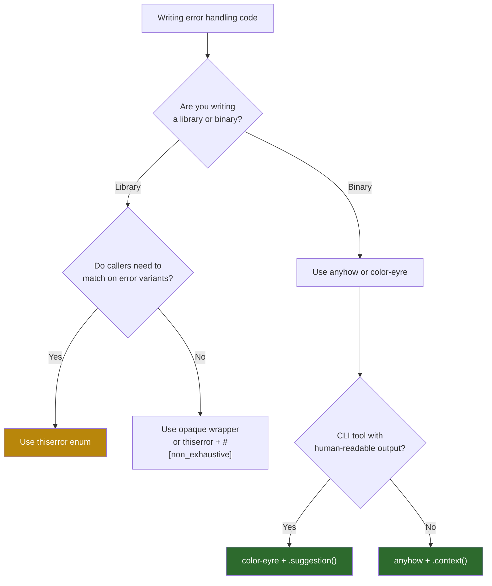

# Summary and Reference Card

> A quick-lookup cheat sheet for everything covered in this book. Pin this to your monitor.

---

## `Result<T, E>` Combinator Quick Reference

| Combinator | Type Signature (simplified) | Use when... |
|-----------|---------------------------|------------|
| `map(f)` | `Result<T,E> → (T→U) → Result<U,E>` | Transform the success value |
| `map_err(f)` | `Result<T,E> → (E→F) → Result<T,F>` | Transform the error type |
| `and_then(f)` | `Result<T,E> → (T→Result<U,E>) → Result<U,E>` | Chain fallible operations |
| `or_else(f)` | `Result<T,E> → (E→Result<T,F>) → Result<T,F>` | Try a fallback on error |
| `unwrap_or(default)` | `Result<T,E> → T` | Return a fixed default on Err |
| `unwrap_or_else(f)` | `Result<T,E> → (E→T) → T` | Compute a default on Err |
| `unwrap_or_default()` | `Result<T,E> → T` (where `T: Default`) | Use the type's default |
| `ok()` | `Result<T,E> → Option<T>` | Intentionally discard the error |
| `err()` | `Result<T,E> → Option<E>` | Intentionally discard the success |
| `transpose()` | `Result<Option<T>,E> → Option<Result<T,E>>` | Flip nesting order |
| `flatten()` | `Result<Result<T,E>,E> → Result<T,E>` | Collapse double-Result |

## The `?` Operator Desugaring

```rust
// What you write:
let val = expr?;

// What the compiler generates (stable Rust):
let val = match expr {
    Ok(v) => v,
    Err(e) => return Err(From::from(e)),
};

// Full desugaring (nightly Try trait):
let val = match Try::branch(expr) {
    ControlFlow::Continue(v) => v,
    ControlFlow::Break(r) => return FromResidual::from_residual(r),
};
```

## `std::error::Error` Trait

```rust
pub trait Error: Display + Debug {
    fn source(&self) -> Option<&(dyn Error + 'static)> { None }
    // Nightly:
    // fn provide<'a>(&'a self, request: &mut Request<'a>) { }
}
```

### Rules
- `Display` → for users and logs (lowercase, no period, single line)
- `Debug` → for developers (show all fields)
- `source()` → return the underlying cause; **never format the source into a string field**

## `thiserror` Attribute Reference

| Attribute | Placed on | Effect |
|-----------|----------|--------|
| `#[derive(Error)]` | Enum or struct | Generates `impl Error` + `impl Display` |
| `#[error("...")]` | Variant | Format string for `Display` |
| `#[error(transparent)]` | Variant | Delegates `Display` AND `source()` to inner error |
| `#[from]` | Single field | Generates `impl From<T>` + implies `#[source]` |
| `#[source]` | Field | Marks field as `Error::source()` return |
| `#[backtrace]` | `Backtrace` field | Exposes via `provide()` (nightly) |
| `#[non_exhaustive]` | Enum | Allows adding variants as minor version bump |

### Quick Template

```rust
use thiserror::Error;

#[derive(Debug, Error)]
#[non_exhaustive]
pub enum MyError {
    #[error("I/O error")]
    Io(#[from] std::io::Error),

    #[error("parse error at line {line}")]
    Parse { line: usize, #[source] source: serde_json::Error },

    #[error("{0}")]
    Custom(String),
}
```

## `anyhow` / `eyre` Quick Reference

| API | Purpose |
|-----|---------|
| `anyhow::Result<T>` | Alias for `Result<T, anyhow::Error>` |
| `anyhow!("msg")` | Create an ad-hoc error |
| `bail!("msg")` | `return Err(anyhow!("msg"))` |
| `ensure!(cond, "msg")` | `if !cond { bail!("msg") }` |
| `.context("msg")` | Wrap error with context string (eager) |
| `.with_context(|| ...)` | Wrap error with context (lazy) |
| `.downcast_ref::<T>()` | Recover the original error type |

### `eyre` extras

| API | Purpose |
|-----|---------|
| `color_eyre::install()` | Install rich error + panic hooks |
| `.suggestion("msg")` | Add a "Help:" section to output |
| `.note("msg")` | Add a "Note:" section to output |
| `.section(body)` | Add a custom section with a header |

## Panic Configuration

### `Cargo.toml` Profiles

```toml
[profile.dev]
panic = "unwind"    # default — Drop runs, catch_unwind works

[profile.release]
panic = "unwind"    # or "abort" for smaller binaries
```

| Setting | `Drop` runs | `catch_unwind` works | Binary size |
|---------|------------|---------------------|-------------|
| `unwind` | ✅ | ✅ | Larger |
| `abort` | ❌ | ❌ | ~5-10% smaller |

### Panic Hook Setup

```rust
use std::panic;

// Install a custom hook
panic::set_hook(Box::new(|info| {
    let msg = info.payload()
        .downcast_ref::<String>()
        .map(|s| s.as_str())
        .or_else(|| info.payload().downcast_ref::<&str>().copied())
        .unwrap_or("unknown");

    let loc = info.location()
        .map(|l| format!("{}:{}:{}", l.file(), l.line(), l.column()))
        .unwrap_or_else(|| "unknown".into());

    eprintln!("[PANIC] {msg} at {loc}");
}));

// Restore the default hook
let _ = panic::take_hook();
```

### `catch_unwind` Template

```rust
use std::panic::{self, AssertUnwindSafe};

let result = panic::catch_unwind(AssertUnwindSafe(|| {
    // potentially panicking code
}));

match result {
    Ok(value) => { /* success */ }
    Err(payload) => { /* panic caught — extract message with downcast_ref */ }
}
```

## FFI Error Translation Pattern

```rust
#[no_mangle]
pub extern "C" fn ffi_function(/* args */) -> i32 {
    let result = std::panic::catch_unwind(std::panic::AssertUnwindSafe(|| {
        rust_function(/* args */)
    }));

    match result {
        Ok(Ok(value)) => 0,          // success
        Ok(Err(err)) => err.code(),   // Rust error → C errno
        Err(_panic) => -99,           // panic → sentinel
    }
}
```

## Decision Tree: Which Error Strategy?



## `unwrap` vs `expect` vs `?` Decision Framework

| Method | Production code? | Use when... |
|--------|-----------------|-------------|
| `?` | ✅ Always | Function returns `Result` — the default choice |
| `expect("why")` | ✅ Sparingly | Invariant that should never fail — documents the reason |
| `unwrap()` | ⚠️ Tests only | Quick prototyping or test assertions |
| `unwrap_or(val)` | ✅ Yes | Sensible default value exists |
| `unwrap_or_else(f)` | ✅ Yes | Default requires computation |
| `unwrap_or_default()` | ✅ Yes | `T: Default` and the default is acceptable |

## Environment Variables

| Variable | Effect |
|----------|--------|
| `RUST_BACKTRACE=1` | Enable backtrace capture in `Backtrace::capture()` and `anyhow`/`eyre` |
| `RUST_BACKTRACE=full` | Full backtrace with all frames (not just user code) |
| `RUST_LIB_BACKTRACE=1` | Enable only for library backtraces (not panics) |

## Further Reading

- [Chapter 1: Result and Try Trait](ch01-result-and-try-trait.md) — `?` operator internals
- [Chapter 2: std::error::Error](ch02-std-error-trait.md) — the Error trait contract
- [Chapter 3: Provider API](ch03-provider-api.md) — generic member access (nightly)
- [Chapter 4: thiserror](ch04-thiserror.md) — derive macros for library errors
- [Chapter 5: anyhow and eyre](ch05-anyhow-and-eyre.md) — type-erased application errors
- [Chapter 6: Anatomy of a Panic](ch06-anatomy-of-a-panic.md) — unwinding mechanics
- [Chapter 7: Catching Unwinds](ch07-catching-unwinds-and-hooks.md) — `catch_unwind` and hooks
- [Chapter 8: Backtraces and Tracing](ch08-backtraces-and-tracing.md) — production diagnostics
- [Chapter 9: Capstone](ch09-capstone-bulletproof-daemon.md) — the complete pattern
