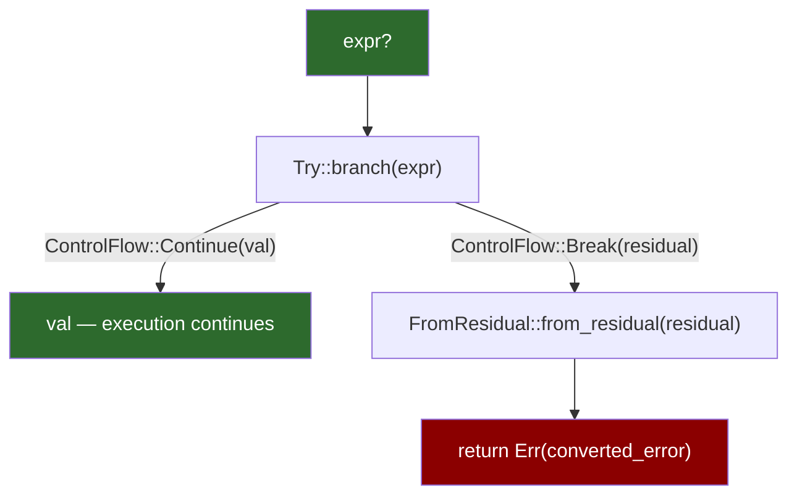

# 1. The `Result` Enum and `Try` Trait 🟢

> **What you'll learn:**
> - How `Result<T, E>` is a *value* that forces you to handle errors — not an exception that silently propagates
> - The complete desugaring of the `?` operator into the `Try` and `FromResidual` traits
> - Combinator chains (`map`, `and_then`, `unwrap_or_else`) and when to prefer each over `match`
> - Why `unwrap()` is a design decision, not a bug — and when it's acceptable

---

## The Two-Channel Error Model

Rust has exactly two error channels. Every function communicates failure through one of them:

| Channel | Mechanism | Recovery | When to use |
|---------|-----------|----------|-------------|
| **Value channel** | `Result<T, E>` / `Option<T>` | Caller decides | Expected failures: file not found, parse error, network timeout |
| **Panic channel** | `panic!()`, array out-of-bounds | Process/thread death | Logic bugs, violated invariants, unrecoverable corruption |

This chapter is about the value channel. We'll cover the panic channel in depth in [Chapter 6](ch06-anatomy-of-a-panic.md).

```mermaid
graph TD
    F["Function call"] --> R{"Returns Result<T, E>"}
    R -->|Ok\(value\)| H["Happy path continues"]
    R -->|Err\(e\)| D{"Caller decides"}
    D -->|"? operator"| P["Propagate to caller"]
    D -->|match / map_err| T["Transform & handle"]
    D -->|"unwrap()"| X["💥 Panic if Err"]

    style F fill:#2d6a2d,color:#fff
    style H fill:#2d6a2d,color:#fff
    style X fill:#8b0000,color:#fff
```

## Beyond `match`: The Combinator Toolkit

Most beginners learn `Result` through `match`:

```rust
// The verbose way — fine for learning, noisy in production
fn read_config(path: &str) -> Result<String, std::io::Error> {
    let content = match std::fs::read_to_string(path) {
        Ok(s) => s,
        Err(e) => return Err(e),
    };
    Ok(content)
}
```

This works, but deeply nested `match` blocks become the Rust equivalent of callback hell. The standard library gives you a rich combinator toolkit:

### The Essential Combinators

| Combinator | Signature (simplified) | Use when... |
|-----------|------------------------|-------------|
| `map` | `Result<T,E> → (T→U) → Result<U,E>` | Transform the success value |
| `map_err` | `Result<T,E> → (E→F) → Result<T,F>` | Transform the error type |
| `and_then` | `Result<T,E> → (T→Result<U,E>) → Result<U,E>` | Chain fallible operations |
| `or_else` | `Result<T,E> → (E→Result<T,F>) → Result<T,F>` | Try a fallback on error |
| `unwrap_or_else` | `Result<T,E> → (E→T) → T` | Provide a computed default |
| `unwrap_or_default` | `Result<T,E> → T` (where `T: Default`) | Use the type's default |
| `ok` | `Result<T,E> → Option<T>` | Discard the error (intentionally!) |

### Combinator Chains vs. `match`

```rust
// ⚠️ THE CLUNKY WAY: Nested match
fn parse_port(config: &str) -> Result<u16, String> {
    match config.find("port=") {
        Some(idx) => {
            let rest = &config[idx + 5..];
            match rest.split_whitespace().next() {
                Some(val) => match val.parse::<u16>() {
                    Ok(port) => Ok(port),
                    Err(e) => Err(format!("bad port number: {e}")),
                },
                None => Err("port value missing".into()),
            }
        }
        None => Err("port key not found".into()),
    }
}
```

```rust
// ✅ THE IDIOMATIC WAY: Combinator chain
fn parse_port(config: &str) -> Result<u16, String> {
    config
        .find("port=")
        .ok_or_else(|| "port key not found".to_string())
        .map(|idx| &config[idx + 5..])
        .and_then(|rest| {
            rest.split_whitespace()
                .next()
                .ok_or_else(|| "port value missing".to_string())
        })
        .and_then(|val| val.parse::<u16>().map_err(|e| format!("bad port number: {e}")))
}
```

Neither is "wrong," but the combinator version makes the data flow linear — each step either succeeds and feeds the next, or short-circuits with an error.

## The `?` Operator: Not Just Syntactic Sugar

Everyone learns that `?` is "like `match` but shorter." That's true but incomplete. Let's look at what the compiler actually generates.

### Simple Desugaring

```rust
// What you write:
fn load_config() -> Result<Config, io::Error> {
    let text = std::fs::read_to_string("config.toml")?;
    let config = parse(&text)?;
    Ok(config)
}
```

```rust
// What the compiler generates (simplified):
fn load_config() -> Result<Config, io::Error> {
    let text = match std::fs::read_to_string("config.toml") {
        Ok(val) => val,
        Err(residual) => return Err(From::from(residual)),
    };
    let config = match parse(&text) {
        Ok(val) => val,
        Err(residual) => return Err(From::from(residual)),
    };
    Ok(config)
}
```

Notice the critical detail: **`From::from(residual)`**. The `?` operator doesn't just propagate errors — it *converts* them through the `From` trait. This is why you can use `?` on an `io::Error` inside a function returning `Result<T, MyAppError>` as long as `impl From<io::Error> for MyAppError` exists.

### The Real Desugaring: `Try` and `FromResidual`

Under the hood, `?` uses the unstable `Try` trait (tracking issue [#84277](https://github.com/rust-lang/rust/issues/84277)):

```rust
// Nightly-only — the actual trait definitions (simplified)
pub trait Try: FromResidual<Self::Residual> {
    type Output;
    type Residual;

    fn from_output(output: Self::Output) -> Self;
    fn branch(self) -> ControlFlow<Self::Residual, Self::Output>;
}

pub trait FromResidual<R = <Self as Try>::Residual> {
    fn from_residual(residual: R) -> Self;
}
```

When you write `expr?`, the compiler generates:

```rust
match Try::branch(expr) {
    ControlFlow::Continue(output) => output,
    ControlFlow::Break(residual) => return FromResidual::from_residual(residual),
}
```



### Why This Matters in Practice

The `Try`/`FromResidual` split means:
1. **`?` works on `Option` too** — `Option` implements `Try` with `Residual = NoneError`
2. **Custom error propagation** — you could define your own `Try`-implementing types (on nightly)
3. **Cross-type `?`** — `Option<T>` inside `Result<T, E>` functions works when `E: From<NoneError>` (nightly)

On stable Rust today, the practical consequence is: **`?` calls `From::from()` on the error**. That single fact drives the entire ecosystem of error conversion.

## `unwrap()` vs `expect()` vs `?`: A Decision Framework

| Method | When to use | What happens on `Err` |
|--------|------------|----------------------|
| `?` | **Default choice** in functions returning `Result` | Converts and propagates |
| `expect("msg")` | Invariant that should never be violated | Panics with your message — a contract statement |
| `unwrap()` | Quick prototyping, tests, or provably infallible cases | Panics with a generic message |
| `unwrap_or(default)` | You have a sensible fallback | Returns the default |
| `unwrap_or_else(|| ...)` | Fallback requires computation | Calls the closure on `Err` |

### When `unwrap()` Is Acceptable

The Rust community sometimes treats `unwrap()` as a universal code smell. It's more nuanced than that:

```rust
// ✅ Acceptable: provably infallible — "1" always parses to an integer
let one: i32 = "1".parse().unwrap();

// ✅ Acceptable: test code — you WANT the test to panic on error
#[test]
fn test_parse_config() {
    let config = load_config("test_fixtures/valid.toml").unwrap();
    assert_eq!(config.port, 8080);
}

// ❌ Unacceptable: production code with external input  
let port: u16 = user_input.parse().unwrap(); // 💥 This WILL blow up
```

`expect()` is strictly better than `unwrap()` in production code because it documents **why** you believe the value is `Ok`:

```rust
// ✅ PREFER: Documents the invariant
let listener = TcpListener::bind(addr)
    .expect("bind() failed — port already in use or insufficient permissions");
```

## Ergonomic Patterns: `Result` in Iterators

A common pain point: you have a `Vec<String>` and want to parse each element, collecting into `Vec<u16>` — but any parse failure should abort:

```rust
// ⚠️ THE CLUNKY WAY: Manual loop
fn parse_all(inputs: &[String]) -> Result<Vec<u16>, std::num::ParseIntError> {
    let mut results = Vec::new();
    for input in inputs {
        let val = input.parse::<u16>()?;
        results.push(val);
    }
    Ok(results)
}
```

```rust
// ✅ THE IDIOMATIC WAY: collect() into Result
fn parse_all(inputs: &[String]) -> Result<Vec<u16>, std::num::ParseIntError> {
    inputs.iter().map(|s| s.parse::<u16>()).collect()
}
```

The magic: `Iterator::collect()` has a special implementation for `Result<Vec<T>, E>` — it short-circuits on the *first* error. This is powered by `FromIterator for Result`.

---

<details>
<summary><strong>🏋️ Exercise: Error Conversion Chain</strong> (click to expand)</summary>

**Challenge:** Write a function `load_and_parse_port(path: &str) -> Result<u16, AppError>` that:
1. Reads a file (may return `io::Error`).
2. Finds the line starting with `port=` (may fail with "not found").
3. Parses the value after `=` as `u16` (may return `ParseIntError`).

Define `AppError` as an enum with three variants, implementing `From` for both `io::Error` and `ParseIntError` so that `?` works throughout.

<details>
<summary>🔑 Solution</summary>

```rust
use std::fs;
use std::io;
use std::num::ParseIntError;

// Step 1: Define a strongly-typed error enum
#[derive(Debug)]
enum AppError {
    /// Wraps std::io::Error for file operations
    Io(io::Error),
    /// The "port=" key was not found in the file
    NotFound(String),
    /// The port value wasn't a valid u16
    Parse(ParseIntError),
}

// Step 2: Implement Display for human-readable messages
impl std::fmt::Display for AppError {
    fn fmt(&self, f: &mut std::fmt::Formatter<'_>) -> std::fmt::Result {
        match self {
            // Each variant gets a clear, user-facing message
            AppError::Io(e) => write!(f, "I/O error: {e}"),
            AppError::NotFound(key) => write!(f, "key not found: {key}"),
            AppError::Parse(e) => write!(f, "parse error: {e}"),
        }
    }
}

// Step 3: Implement From for each source error — enables the ? operator
impl From<io::Error> for AppError {
    fn from(e: io::Error) -> Self {
        AppError::Io(e) // ? calls this automatically
    }
}

impl From<ParseIntError> for AppError {
    fn from(e: ParseIntError) -> Self {
        AppError::Parse(e) // ? calls this automatically
    }
}

// Step 4: The main function uses ? freely — conversions happen automatically
fn load_and_parse_port(path: &str) -> Result<u16, AppError> {
    // ? converts io::Error -> AppError::Io via From
    let content = fs::read_to_string(path)?;

    // Find the relevant line — no From impl, so we construct manually
    let line = content
        .lines()
        .find(|l| l.starts_with("port="))
        .ok_or_else(|| AppError::NotFound("port".into()))?;

    // ? converts ParseIntError -> AppError::Parse via From
    let port = line.trim_start_matches("port=").trim().parse::<u16>()?;

    Ok(port)
}

fn main() {
    match load_and_parse_port("config.txt") {
        Ok(port) => println!("Server port: {port}"),
        Err(e) => eprintln!("Error: {e}"),
    }
}
```

**Key insight:** The `?` operator calls `From::from()` at each step. By implementing `From<io::Error>` and `From<ParseIntError>` for `AppError`, we get automatic conversion without any manual `map_err`. The `NotFound` variant has no corresponding source type, so we construct it explicitly using `ok_or_else`.

</details>
</details>

---

> **Key Takeaways**
> - `Result<T, E>` is a *value* — the type system forces the caller to acknowledge errors
> - The `?` operator desugars to `Try::branch()` + `FromResidual::from_residual()`, which calls `From::from()` on stable Rust
> - Combinator chains (`map`, `and_then`, `unwrap_or_else`) eliminate nested `match` blocks
> - `expect("reason")` is always better than `unwrap()` in production — it documents your intent
> - `collect::<Result<Vec<T>, E>>()` short-circuits on the first error — use it for batch parsing

> **See also:**
> - [Chapter 2: Unpacking `std::error::Error`](ch02-std-error-trait.md) — making your error types compose into chains
> - [Chapter 4: Library Errors with `thiserror`](ch04-thiserror.md) — code-generating the `From` impls and `Display` above
> - [Rust API Design & Error Architecture, Ch. 5](../api-design-book/src/ch05-transparent-forwarding-and-context.md) — error forwarding patterns in public APIs
