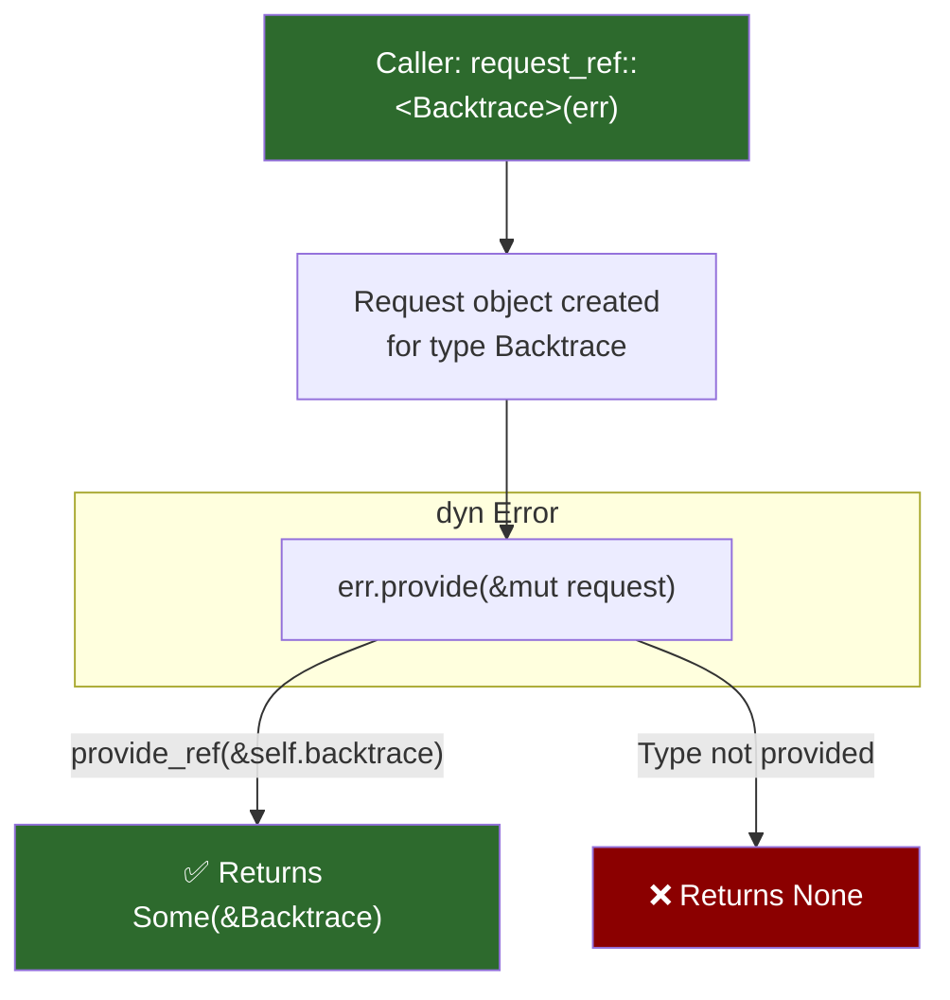

# 3. The New `Provider` API 🔴

> **What you'll learn:**
> - How the generic member access API (`std::error::Request`) enables dynamic context attachment
> - Why the traditional `source()` chain can't carry arbitrary metadata like backtraces or span IDs
> - How to implement `provide()` to expose backtraces, error codes, or custom diagnostic context
> - The relationship between `Provider`, `Demand`/`Request`, and the `Backtrace` capture story

---

## The Problem: `source()` Isn't Enough

Chapter 2 showed how `source()` builds a linked list of errors. But what if you want to attach a **backtrace**, an **HTTP status code**, or a **span ID** to an error — without changing the error's public type signature?

The `source()` method only returns `&dyn Error`. To get a backtrace, callers had to:

```rust
// ⚠️ THE CLUNKY WAY: Downcasting every layer to look for a backtrace
fn find_backtrace(err: &dyn Error) -> Option<&Backtrace> {
    // Try every concrete type we know about...
    if let Some(my_err) = err.downcast_ref::<MyError>() {
        return Some(&my_err.backtrace);
    }
    if let Some(io_err) = err.downcast_ref::<IoWrapper>() {
        return Some(&io_err.backtrace);
    }
    // ... repeat for every error type in your codebase 😩
    None
}
```

This is fragile, non-extensible, and violates the open-closed principle. The Provider API solves this.

## The `Provider` API: Generic Member Access

> **Note:** As of Rust 1.84, the Provider API is available behind `#![feature(error_generic_member_access)]` on nightly. The design has stabilized conceptually but the final API surface may change. We cover it here because `anyhow`, `eyre`, and `color-eyre` already use the pattern internally.

The idea: instead of downcasting to a concrete type to extract metadata, you **request** a specific type from any `dyn Error`, and the error *provides* it if available:

```rust
#![feature(error_generic_member_access)]
use std::error::{Error, Request};
use std::backtrace::Backtrace;

#[derive(Debug)]
struct MyError {
    message: String,
    backtrace: Backtrace,
}

impl std::fmt::Display for MyError {
    fn fmt(&self, f: &mut std::fmt::Formatter<'_>) -> std::fmt::Result {
        write!(f, "{}", self.message)
    }
}

impl Error for MyError {
    fn provide<'a>(&'a self, request: &mut Request<'a>) {
        // When someone requests a &Backtrace, we provide ours
        request.provide_ref::<Backtrace>(&self.backtrace);
    }
}
```

Now any code with a `&dyn Error` can request a backtrace without knowing the concrete type:

```rust
fn log_error(err: &dyn Error) {
    eprintln!("Error: {err}");

    // ✅ THE IDIOMATIC WAY: Request the backtrace generically
    if let Some(bt) = std::error::request_ref::<Backtrace>(err) {
        eprintln!("Backtrace:\n{bt}");
    }
}
```



## How `Request` Works Under the Hood

The `Request` type is essentially a type-erased container that says "I'm looking for a value of type `T`":

```rust
// Conceptual model (simplified from std internals)
impl<'a> Request<'a> {
    /// Provide a reference to a value of type T
    pub fn provide_ref<T: 'static + ?Sized>(&mut self, value: &'a T) -> &mut Self { ... }

    /// Provide an owned value of type T
    pub fn provide_value<T: 'static>(&mut self, value: T) -> &mut Self { ... }
}
```

The caller side uses free functions:

```rust
// Request a reference
pub fn request_ref<'a, T>(err: &'a (dyn Error + 'static)) -> Option<&'a T>
where T: 'static + ?Sized;

// Request an owned value
pub fn request_value<T>(err: &(dyn Error + 'static)) -> Option<T>
where T: 'static;
```

### Multiple Provisions in One `provide()`

You can provide multiple types from a single error:

```rust
#[derive(Debug)]
struct RichError {
    message: String,
    backtrace: Backtrace,
    http_status: u16,
    span_id: String,
}

impl Error for RichError {
    fn provide<'a>(&'a self, request: &mut Request<'a>) {
        request
            .provide_ref::<Backtrace>(&self.backtrace)
            .provide_value::<u16>(self.http_status)
            .provide_ref::<str>(&self.span_id);
    }
}
```

## Walking the Chain with `provide()`

The Provider API composes with `source()`. You can walk the error chain and check each layer for provided metadata:

```rust
/// Find the first backtrace in the error chain
fn find_backtrace_in_chain(err: &(dyn Error + 'static)) -> Option<&Backtrace> {
    // Check the outermost error first
    if let Some(bt) = std::error::request_ref::<Backtrace>(err) {
        return Some(bt);
    }

    // Walk the source chain
    let mut current = err.source();
    while let Some(cause) = current {
        if let Some(bt) = std::error::request_ref::<Backtrace>(cause) {
            return Some(bt);
        }
        current = cause.source();
    }

    None
}
```

## Stable-Rust Workarounds

Until the Provider API stabilizes, production code uses two strategies:

### Strategy 1: Trait Object with a Known Method

```rust
/// A trait that extends Error with backtrace access
trait ErrorWithBacktrace: Error {
    fn backtrace(&self) -> Option<&Backtrace>;
}

// Implement for your error types
impl ErrorWithBacktrace for MyError {
    fn backtrace(&self) -> Option<&Backtrace> {
        Some(&self.backtrace)
    }
}
```

### Strategy 2: Let `anyhow` / `eyre` Handle It

Both `anyhow` and `eyre` internally capture backtraces and expose them:

```rust
use anyhow::{Context, Result};

fn load_config(path: &str) -> Result<Config> {
    let text = std::fs::read_to_string(path)
        .context("failed to read config file")?;  // backtrace captured here
    // ...
    # Ok(Config)
}
```

When you print an `anyhow::Error` with `{:?}`, the backtrace is included automatically (if `RUST_BACKTRACE=1`). We cover this in detail in [Chapter 5](ch05-anyhow-and-eyre.md).

## The Design Philosophy: Why Not Just Add Methods?

You might wonder: why not just add `fn backtrace(&self) -> Option<&Backtrace>` to the `Error` trait?

| Approach | Problem |
|----------|---------|
| Add `backtrace()` to `Error` | Only works for backtraces — what about span IDs? HTTP codes? |
| Add methods for every possible metadata | The trait becomes bloated and unimplementable |
| Use `Any`-style downcasting | Requires knowing the concrete type — breaks abstraction |
| **Generic member access (Provider)** | **Open-ended: any `'static` type can be requested** |

The Provider API is Rust's answer to "how do I attach arbitrary metadata to trait objects without knowing the concrete type." It's the same problem that `Any` solves for types, applied to error metadata.

---

<details>
<summary><strong>🏋️ Exercise: Provide Custom Diagnostic Context</strong> (click to expand)</summary>

**Challenge:** Create a `DatabaseError` type that provides:
1. A `Backtrace` 
2. A custom `ErrorCode(u32)` newtype
3. A `&str` hint message

Write a function that receives `&dyn Error` and extracts all three using `request_ref` / `request_value`. Since this requires nightly, structure the code so it compiles on stable with `#[cfg(feature = "nightly")]` guards.

<details>
<summary>🔑 Solution</summary>

```rust
// This example requires nightly:
//   rustup run nightly cargo run
//   with #![feature(error_generic_member_access)] at the crate root

#![feature(error_generic_member_access)]

use std::backtrace::Backtrace;
use std::error::{self, Error, Request};
use std::fmt;

/// A newtype for error codes — must be 'static for provide_value
#[derive(Debug, Clone, Copy)]
struct ErrorCode(u32);

#[derive(Debug)]
struct DatabaseError {
    message: String,
    backtrace: Backtrace,
    code: ErrorCode,
    hint: String,
}

impl fmt::Display for DatabaseError {
    fn fmt(&self, f: &mut fmt::Formatter<'_>) -> fmt::Result {
        write!(f, "database error (code {}): {}", self.code.0, self.message)
    }
}

impl Error for DatabaseError {
    fn provide<'a>(&'a self, request: &mut Request<'a>) {
        // Provide all three pieces of metadata
        request
            .provide_ref::<Backtrace>(&self.backtrace)  // backtrace by reference
            .provide_value::<ErrorCode>(self.code)       // error code by value (Copy)
            .provide_ref::<str>(&self.hint);             // hint as &str
    }
}

/// Extract diagnostics from any error implementing provide()
fn diagnose(err: &(dyn Error + 'static)) {
    eprintln!("Error: {err}");

    // Request each piece of metadata independently
    if let Some(code) = error::request_value::<ErrorCode>(err) {
        eprintln!("  Error code: {}", code.0);
    }
    if let Some(hint) = error::request_ref::<str>(err) {
        eprintln!("  Hint: {hint}");
    }
    if let Some(bt) = error::request_ref::<Backtrace>(err) {
        eprintln!("  Backtrace:\n{bt}");
    }
}

fn main() {
    let err = DatabaseError {
        message: "connection pool exhausted".into(),
        backtrace: Backtrace::capture(),
        code: ErrorCode(5432),
        hint: "increase max_connections in your config".into(),
    };

    diagnose(&err);
}
```

**Key insight:** The `provide()` method is called *by the runtime* when someone calls `request_ref` or `request_value`. The error type doesn't need to know what metadata the caller wants — it just advertises what it has, and the Request machinery matches them up.

</details>
</details>

---

> **Key Takeaways**
> - The Provider API (`std::error::Request`) enables attaching *arbitrary* metadata to `dyn Error` without modifying the trait
> - `provide_ref::<T>()` exposes references; `provide_value::<T>()` exposes owned/`Copy` values
> - Callers use `request_ref::<T>(err)` and `request_value::<T>(err)` — no downcasting required
> - Until stabilization, use `anyhow`/`eyre` for backtrace capture or define your own extension traits
> - The design is *open-ended*: backtraces, error codes, span IDs, suggestions — any `'static` type works

> **See also:**
> - [Chapter 2: Unpacking `std::error::Error`](ch02-std-error-trait.md) — the `source()` chain that Provider extends
> - [Chapter 5: Application Errors with `anyhow` and `eyre`](ch05-anyhow-and-eyre.md) — crates that use this pattern internally
> - [Chapter 8: Backtraces and Tracing Integration](ch08-backtraces-and-tracing.md) — production backtrace capture
> - [Rust tracking issue #99301](https://github.com/rust-lang/rust/issues/99301) — generic member access stabilization
