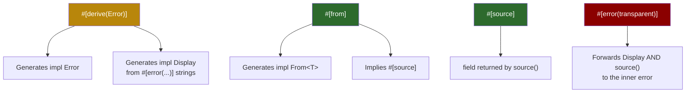

# 4. Library Errors with `thiserror` 🟡

> **What you'll learn:**
> - How `thiserror` eliminates the boilerplate of implementing `Display`, `Error`, and `From` by hand
> - The `#[from]`, `#[source]`, and `#[error(transparent)]` attributes and when to use each
> - SemVer implications of public error enums — how adding a variant is a breaking change
> - Design patterns for library error types that downstream consumers can `match` on

---

## The Boilerplate Problem

In [Chapter 2](ch02-std-error-trait.md) you implemented `Display`, `Debug`, and `Error` by hand for every error type. For a library with 5 error variants, that's roughly 80 lines of repetitive code — and every new variant means updating three `match` arms.

`thiserror` is a **derive macro** that generates all of this from a single annotated enum:

```rust
// ⚠️ THE CLUNKY WAY: ~40 lines of hand-written boilerplate
#[derive(Debug)]
pub enum DataError {
    Io(std::io::Error),
    Parse { line: usize, source: serde_json::Error },
    NotFound { key: String },
}

impl std::fmt::Display for DataError {
    fn fmt(&self, f: &mut std::fmt::Formatter<'_>) -> std::fmt::Result {
        match self {
            DataError::Io(e) => write!(f, "I/O error: {e}"),
            DataError::Parse { line, .. } => write!(f, "parse error at line {line}"),
            DataError::NotFound { key } => write!(f, "key not found: {key}"),
        }
    }
}

impl std::error::Error for DataError {
    fn source(&self) -> Option<&(dyn std::error::Error + 'static)> {
        match self {
            DataError::Io(e) => Some(e),
            DataError::Parse { source, .. } => Some(source),
            DataError::NotFound { .. } => None,
        }
    }
}

impl From<std::io::Error> for DataError {
    fn from(e: std::io::Error) -> Self { DataError::Io(e) }
}
```

```rust
// ✅ THE IDIOMATIC WAY: thiserror generates everything
use thiserror::Error;

#[derive(Debug, Error)]
pub enum DataError {
    #[error("I/O error")]           // Display message
    Io(#[from] std::io::Error),     // #[from] generates From + source()

    #[error("parse error at line {line}")]
    Parse {
        line: usize,
        #[source]                   // marks this field as the source()
        source: serde_json::Error,
    },

    #[error("key not found: {key}")]
    NotFound { key: String },       // no source — leaf error
}
```

Both produce identical behavior. The `thiserror` version is 12 lines instead of 40.

## The `thiserror` Attribute Reference



| Attribute | Placed on | What it generates |
|-----------|----------|-------------------|
| `#[error("...")]` | Variant or struct | `Display::fmt()` using the format string |
| `#[from]` | A single-field variant | `impl From<FieldType> for YourError` + marks as `source()` |
| `#[source]` | A field | `Error::source()` returns this field |
| `#[error(transparent)]` | Variant or struct | Delegates *both* `Display` and `source()` to the inner error |
| `#[backtrace]` | A `Backtrace` field | `Error::provide()` exposes the backtrace (nightly) |

### `#[from]` — Automatic `From` Conversion

`#[from]` does two things:
1. Generates `impl From<T> for YourError` — so `?` works
2. Implies `#[source]` — so the source chain is preserved

```rust
#[derive(Debug, Error)]
pub enum ConfigError {
    #[error("failed to read config file")]
    Io(#[from] std::io::Error),
    //  ^^^^^^ generates: impl From<io::Error> for ConfigError
    //         AND: source() returns Some(&self.0)
}

// Now this works:
fn load() -> Result<String, ConfigError> {
    let s = std::fs::read_to_string("config.toml")?; // ? calls From::from()
    Ok(s)
}
```

**Rule:** Only use `#[from]` when the conversion is unambiguous. If your error might receive `io::Error` from multiple contexts, the `From` impl loses the context of *where* the error came from. In that case, use `.context()` from `anyhow` ([Chapter 5](ch05-anyhow-and-eyre.md)) or add an explicit variant.

### `#[source]` — Explicit Source Marking

When a variant has multiple fields, use `#[source]` to identify which is the underlying cause:

```rust
#[derive(Debug, Error)]
pub enum CompileError {
    #[error("syntax error at {file}:{line}")]
    Syntax {
        file: String,
        line: usize,
        #[source]  // this field is returned by source()
        cause: ParseError,
    },
}
```

Field naming convention: if a field is literally named `source`, `thiserror` treats it as the source automatically — no `#[source]` annotation needed.

### `#[error(transparent)]` — Full Forwarding

`transparent` delegates both `Display` and `source()` to the inner error. Use it when you're wrapping an error without adding any new context:

```rust
#[derive(Debug, Error)]
pub enum ServiceError {
    #[error("database failure")]
    Db(#[from] DatabaseError),

    // Transparently forward — Display shows the inner error's message
    #[error(transparent)]
    Other(#[from] anyhow::Error),
}
```

| Strategy | Display shows | source() returns |
|----------|-------------|-----------------|
| `#[error("my message")]` + `#[from]` | "my message" | The inner error |
| `#[error(transparent)]` | Inner error's Display | Inner error's source |

Use `transparent` when your variant adds *zero* context. Use a custom `#[error("...")]` when you're adding context like "failed to connect to database."

## SemVer and Public Error Types

Your error enum is part of your library's **public API**. Adding, removing, or reordering variants is a **breaking change** under semantic versioning because downstream code matches on them:

```rust
// Downstream crate:
match my_lib::do_work() {
    Err(MyError::Io(e)) => handle_io(e),
    Err(MyError::Parse(e)) => handle_parse(e),
    // If the library adds a new variant, this match is no longer exhaustive!
}
```

### The `#[non_exhaustive]` Escape Hatch

Mark your error enum `#[non_exhaustive]` to force downstream callers to include a wildcard arm:

```rust
#[derive(Debug, Error)]
#[non_exhaustive]  // ← downstream must use `_ => ...`
pub enum MyError {
    #[error("I/O error")]
    Io(#[from] std::io::Error),

    #[error("parse error")]
    Parse(#[from] serde_json::Error),
}
```

Now adding a new variant is a *minor* version bump, not a *major* one. The trade-off: callers can't write exhaustive matches.

## Pattern: Layered Library Errors

A well-designed library has a *public* error type and *internal* error types:

```rust
// === Internal module — not exported ===
#[derive(Debug, Error)]
pub(crate) enum InternalDbError {
    #[error("connection failed: {0}")]
    Connection(#[from] tokio_postgres::Error),

    #[error("query timeout after {ms}ms")]
    Timeout { ms: u64 },
}

// === Public API — stable, semver-safe ===
#[derive(Debug, Error)]
#[non_exhaustive]
pub enum MyLibError {
    #[error("database error")]
    Database(#[source] InternalDbError), // #[source], NOT #[from]
    //       ^^^^^^^^ internal type hidden behind this variant

    #[error("configuration error: {0}")]
    Config(String),
}
```

The internal `InternalDbError` can change freely. The public `MyLibError` only exposes stable variants.

---

<details>
<summary><strong>🏋️ Exercise: Design a Library Error Hierarchy</strong> (click to expand)</summary>

**Challenge:** You're building a crate called `mini-kv` (a key-value store). Design the error types:

1. `StorageError` — internal, wraps `io::Error` and `bincode::Error`
2. `KvError` — public, `#[non_exhaustive]`, with variants:
   - `KeyNotFound { key: String }`
   - `Storage` wrapping `StorageError` (use `#[source]`)
   - `InvalidKey` for keys containing forbidden characters

Write a function `get(key: &str) -> Result<Vec<u8>, KvError>` that uses `?` to propagate `StorageError` into `KvError`.

<details>
<summary>🔑 Solution</summary>

```rust
use thiserror::Error;
use std::io;

// === Internal error — can change between minor versions ===
#[derive(Debug, Error)]
pub(crate) enum StorageError {
    #[error("disk I/O failed")]
    Io(#[from] io::Error),

    #[error("serialization failed")]
    Serde(#[from] bincode::Error),
}

// === Public error — semver-stable ===
#[derive(Debug, Error)]
#[non_exhaustive]
pub enum KvError {
    #[error("key not found: '{key}'")]
    KeyNotFound { key: String },

    #[error("storage error")]
    Storage(#[source] StorageError),
    // Using #[source] (not #[from]) because we need manual conversion
    // to avoid exposing StorageError in the public From impl

    #[error("invalid key: keys must not contain '/'")]
    InvalidKey,
}

// Manual From impl keeps StorageError out of the public API
// while still allowing ? inside the crate
impl From<StorageError> for KvError {
    fn from(e: StorageError) -> Self {
        KvError::Storage(e)
    }
}

pub fn get(key: &str) -> Result<Vec<u8>, KvError> {
    // Validate the key first
    if key.contains('/') {
        return Err(KvError::InvalidKey);
    }

    // This ? converts io::Error → StorageError (via #[from])
    // then StorageError → KvError (via our manual From impl)
    let raw = std::fs::read(format!("data/{key}.bin"))
        .map_err(StorageError::from)?;

    // Deserialize — bincode::Error → StorageError → KvError
    let _value: Vec<u8> = bincode::deserialize(&raw)
        .map_err(StorageError::from)?;

    Ok(raw)
}
```

**Key insight:** Using `#[source]` instead of `#[from]` on the public `Storage` variant avoids generating a public `From<StorageError>` impl. The manual `From` impl inside the crate achieves the same `?` ergonomics while keeping `StorageError` out of the public API surface.

</details>
</details>

---

> **Key Takeaways**
> - `thiserror` generates `Display`, `Error`, and `From` impls from annotated enums — eliminating ~70% of error boilerplate
> - `#[from]` = `From` conversion + `source()` — use when the conversion is 1:1 and unambiguous
> - `#[error(transparent)]` = full delegation — use when adding zero context
> - Mark public error enums `#[non_exhaustive]` to allow adding variants without a major version bump
> - Layer your errors: internal types with `#[from]`, public types with `#[source]` and manual `From`

> **See also:**
> - [Chapter 2: Unpacking `std::error::Error`](ch02-std-error-trait.md) — the hand-written code that `thiserror` generates
> - [Chapter 5: Application Errors with `anyhow` and `eyre`](ch05-anyhow-and-eyre.md) — the application-side complement
> - [Rust API Design & Error Architecture](../api-design-book/src/ch05-transparent-forwarding-and-context.md) — API design guidelines for error types
