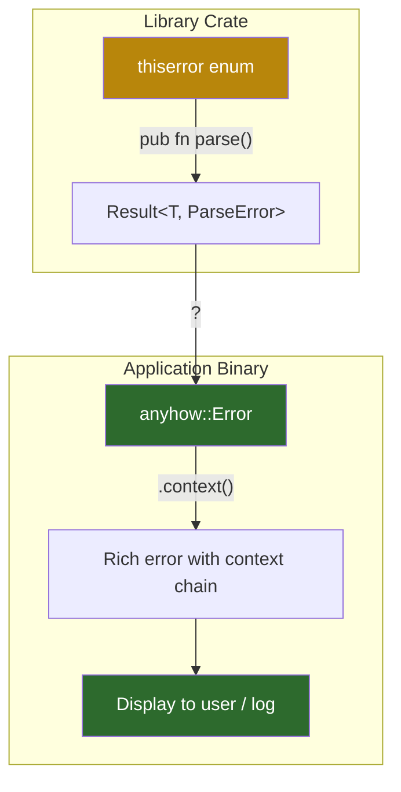

# 5. Application Errors with `anyhow` and `eyre` 🟡

> **What you'll learn:**
> - Why application binaries need a fundamentally different error strategy than libraries
> - `anyhow::Error` as a type-erased wrapper: when and why to use it
> - The `.context()` / `.with_context()` pattern for enriching errors with human-readable breadcrumbs
> - `eyre` and `color-eyre` as the modern successors for CLI tools with rich terminal output

---

## The Library vs. Application Divide

This is the single most important design decision in Rust error handling:

| | Library | Application |
|--|---------|-------------|
| **Error type** | Strongly-typed enum (`thiserror`) | Type-erased wrapper (`anyhow` / `eyre`) |
| **Goal** | Let callers `match` on variants | Report errors beautifully to users |
| **Stability** | Must be semver-stable | Internal — can change freely |
| **Context** | Provided by variant structure | Provided by `.context()` strings |
| **Example** | `serde_json::Error`, `reqwest::Error` | Your `main()`, your CLI tool, your daemon |

**Rule of thumb:** If your code is `pub` in a crate others depend on, use `thiserror`. If your code is the final binary, use `anyhow` or `eyre`.



## `anyhow`: The Pragmatic Choice

`anyhow::Error` is a type-erased error wrapper — it holds any `E: Error + Send + Sync + 'static` and provides:

1. **Automatic conversion:** Any error type works with `?`
2. **Context chaining:** `.context("what went wrong")` wraps the error with a human-readable message
3. **Backtrace capture:** Captured automatically when `RUST_BACKTRACE=1`
4. **Downcasting:** You can recover the original error type with `.downcast_ref::<T>()`

### Basic Usage

```rust
use anyhow::{Context, Result};
use std::fs;

// anyhow::Result<T> is an alias for Result<T, anyhow::Error>
fn load_config(path: &str) -> Result<Config> {
    let text = fs::read_to_string(path)
        .context("failed to read config file")?;
        // ✅ FIX: Preserving the source chain — context wraps the io::Error

    let config: Config = toml::from_str(&text)
        .context("failed to parse TOML")?;

    if config.port == 0 {
        // anyhow::bail! is shorthand for return Err(anyhow::anyhow!("..."))
        anyhow::bail!("port must not be zero");
    }

    Ok(config)
}
```

### The Context Chain

Every `.context()` call wraps the error with a new layer. When printed with `{:?}`, you get the full chain:

```
Error: failed to start server

Caused by:
    0: failed to read config file
    1: No such file or directory (os error 2)
```

Compare this to what you get *without* context:

```
// ⚠️ CONTEXT LOST: Source error is swallowed into a generic message
Error: No such file or directory (os error 2)
// Which file? Which operation? No idea.
```

### `context()` vs `with_context()`

| Method | Evaluated | Use when... |
|--------|-----------|-------------|
| `.context("msg")` | Always | Message is a static string or cheap to create |
| `.with_context(|| format!("..."))` | Lazily (only on Err) | Message requires allocation or computation |

```rust
// ✅ Use context() for static messages
fs::read_to_string(path).context("failed to read config")?;

// ✅ Use with_context() when formatting with runtime data
fs::read_to_string(path)
    .with_context(|| format!("failed to read config from '{path}'"))?;
```

### `anyhow!` and `bail!`

```rust
use anyhow::{anyhow, bail, ensure};

// Create an ad-hoc error
let err = anyhow!("unexpected value: {value}");

// Return early with an error (like return Err(anyhow!(...)))
bail!("connection refused after {retries} retries");

// Assert a condition — like assert! but returns Err instead of panicking
ensure!(googol > 1, "googol must be positive, got {googol}");
```

### Downcasting: Recovering the Original Type

Even though `anyhow::Error` is type-erased, you can recover the original:

```rust
fn handle_result(result: anyhow::Result<()>) {
    if let Err(err) = result {
        // Try to downcast to a specific library error
        if let Some(db_err) = err.downcast_ref::<DatabaseError>() {
            match db_err {
                DatabaseError::ConnectionFailed { .. } => retry(),
                DatabaseError::QueryFailed { .. } => log_and_skip(),
                _ => report(err),
            }
        } else {
            report(err);
        }
    }
}
```

## `eyre` and `color-eyre`: The Modern Successors

`eyre` is a fork of `anyhow` with one key difference: **pluggable error reporting**. Where `anyhow` has a fixed format, `eyre` lets you install a custom report handler.

`color-eyre` is the flagship handler — it produces *gorgeous* terminal output with:

- Colored error chains
- Syntax-highlighted backtraces (via `backtrace-rs`)
- Span traces (via `tracing-error`)
- Suggestion sections ("help: did you mean...")

### Setup

```rust
use color_eyre::eyre::{self, Context, Result};

fn main() -> Result<()> {
    // Install the color-eyre panic and error hooks
    color_eyre::install()?;

    let config = load_config("app.toml")
        .context("failed during startup")?;

    run_server(config)?;
    Ok(())
}
```

### Output Comparison

```
# anyhow output (functional but plain):
Error: failed during startup

Caused by:
    0: failed to read config file
    1: No such file or directory (os error 2)

# color-eyre output (rich and navigable):
  × failed during startup
  ├── failed to read config file
  ╰── No such file or directory (os error 2)

  ━━━━━━━━━━━━━━━━ BACKTRACE ━━━━━━━━━━━━━━━━
     0: app::load_config
           at src/main.rs:12
     1: app::main
           at src/main.rs:25

  Help: Ensure 'app.toml' exists in the working directory
```

### `eyre` vs `anyhow`: Decision Framework

| Feature | `anyhow` | `eyre` / `color-eyre` |
|---------|----------|----------------------|
| API surface | Reference implementation | Near-identical (drop-in) |
| Error reporting | Fixed format | Pluggable handlers |
| Terminal output | Plain text | Colored, structured |
| Span traces | ❌ | ✅ via `tracing-error` |
| Suggestions/help | ❌ | ✅ via `.suggestion("...")` |
| Maturity | Very stable, huge adoption | Stable, growing adoption |
| Best for | Libraries that don't own `main()` | CLIs, daemons, anything with a terminal |

**Practical guidance:**
- Use `anyhow` if you want maximum ecosystem compatibility and don't need fancy output
- Use `color-eyre` if you're building a CLI tool, daemon, or anything where a human reads errors

### `color-eyre` Suggestions and Sections

```rust
use color_eyre::eyre::{eyre, Result, WrapErr};
use color_eyre::Section;  // Trait for .suggestion(), .note(), etc.

fn connect_to_database(url: &str) -> Result<()> {
    // Simulate a connection failure
    Err(eyre!("connection refused"))
        .wrap_err("failed to connect to database")
        .suggestion("Check that PostgreSQL is running: `systemctl status postgresql`")
        .note(format!("Attempted URL: {url}"))
}
```

## Pattern: `anyhow` in `main()`, `thiserror` Everywhere Else

The recommended architecture for a production Rust application:

```rust
// === src/errors.rs — library-grade errors with thiserror ===
use thiserror::Error;

#[derive(Debug, Error)]
pub enum ConfigError {
    #[error("missing field: {0}")]
    MissingField(String),

    #[error("invalid port: {0}")]
    InvalidPort(#[from] std::num::ParseIntError),
}

#[derive(Debug, Error)]
pub enum ServerError {
    #[error("failed to bind to {addr}")]
    Bind { addr: String, #[source] source: std::io::Error },

    #[error("configuration error")]
    Config(#[from] ConfigError),
}

// === src/main.rs — anyhow for the top level ===
use anyhow::{Context, Result};

fn main() -> Result<()> {
    let config = load_config("server.toml")
        .context("startup failed")?;  // ServerError → anyhow::Error

    run(config)?;
    Ok(())
}
```

This gives you the best of both worlds: strongly-typed errors inside your modules (for `match`-based recovery) and rich contextual errors at the application boundary (for human-readable reporting).

---

<details>
<summary><strong>🏋️ Exercise: Context Chain Construction</strong> (click to expand)</summary>

**Challenge:** Write a small program that:
1. Reads a JSON file containing `{"host": "...", "port": "..."}` using `serde_json`
2. Validates that the port is between 1 and 65535
3. Uses `.context()` at every level so the error chain reads:
   ```
   Error: failed to initialize server
   Caused by:
       0: failed to load config from 'server.json'
       1: failed to parse JSON
       2: expected value at line 1 column 1
   ```

Use `anyhow` for the binary, and add at least one `.with_context()` call.

<details>
<summary>🔑 Solution</summary>

```rust
use anyhow::{ensure, Context, Result};
use serde::Deserialize;
use std::fs;

#[derive(Deserialize)]
struct RawConfig {
    host: String,
    port: u16,
}

struct Config {
    host: String,
    port: u16,
}

fn load_config(path: &str) -> Result<Config> {
    // Layer 1: file reading — with_context uses path for a helpful message
    let text = fs::read_to_string(path)
        .with_context(|| format!("failed to load config from '{path}'"))?;

    // Layer 2: JSON parsing — static context string
    let raw: RawConfig = serde_json::from_str(&text)
        .context("failed to parse JSON")?;

    // Layer 3: validation — ensure! returns Err with the message
    ensure!(
        raw.port >= 1,
        "port must be between 1 and 65535, got {}",
        raw.port
    );

    Ok(Config {
        host: raw.host,
        port: raw.port,
    })
}

fn initialize_server(config_path: &str) -> Result<()> {
    // Outermost context: what the user was trying to do
    let _config = load_config(config_path)
        .context("failed to initialize server")?;

    println!("Server initialized successfully");
    Ok(())
}

fn main() -> Result<()> {
    // Install color-eyre for beautiful output (if using eyre):
    // color_eyre::install()?;

    initialize_server("server.json")
}

// When server.json doesn't exist, output:
// Error: failed to initialize server
//
// Caused by:
//     0: failed to load config from 'server.json'
//     1: No such file or directory (os error 2)
```

**Key insight:** Each `.context()` call adds a layer to the error chain without losing the original cause. The outermost context describes the user-facing operation; inner contexts describe implementation steps. When debugging, you read from top (what the user tried) to bottom (what actually failed).

</details>
</details>

---

> **Key Takeaways**
> - Libraries produce errors; applications report them — use `thiserror` for the first, `anyhow`/`eyre` for the second
> - `.context("msg")` wraps an error with a new layer — always add context at API boundaries
> - `.with_context(|| ...)` is the lazy version — use when formatting requires allocation
> - `color-eyre` produces rich terminal output with backtraces, span traces, and suggestions
> - The standard architecture: `thiserror` enums inside modules, `anyhow::Result` in `main()`

> **See also:**
> - [Chapter 4: Library Errors with `thiserror`](ch04-thiserror.md) — the library-side complement
> - [Chapter 8: Backtraces and Tracing Integration](ch08-backtraces-and-tracing.md) — `color-eyre` + `tracing-error` span traces
> - [Chapter 9: Capstone](ch09-capstone-bulletproof-daemon.md) — combines `thiserror`, `color-eyre`, and panic hooks
> - [The Rust Architect's Toolbox](../toolbox-book/src/SUMMARY.md) — `miette` as an alternative diagnostic framework
