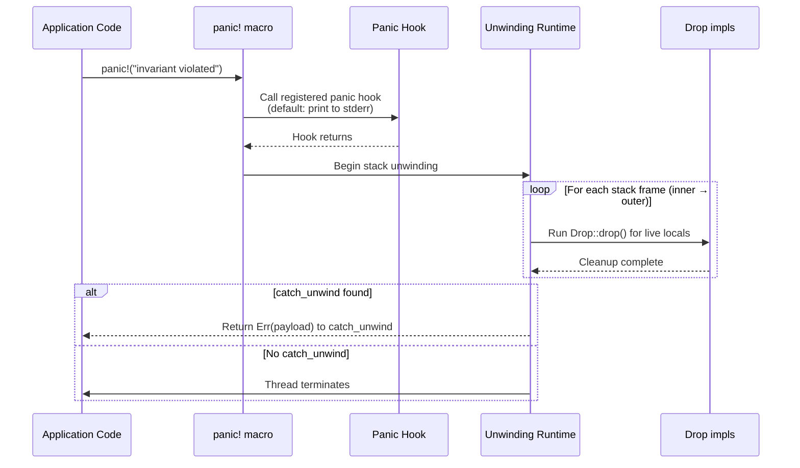
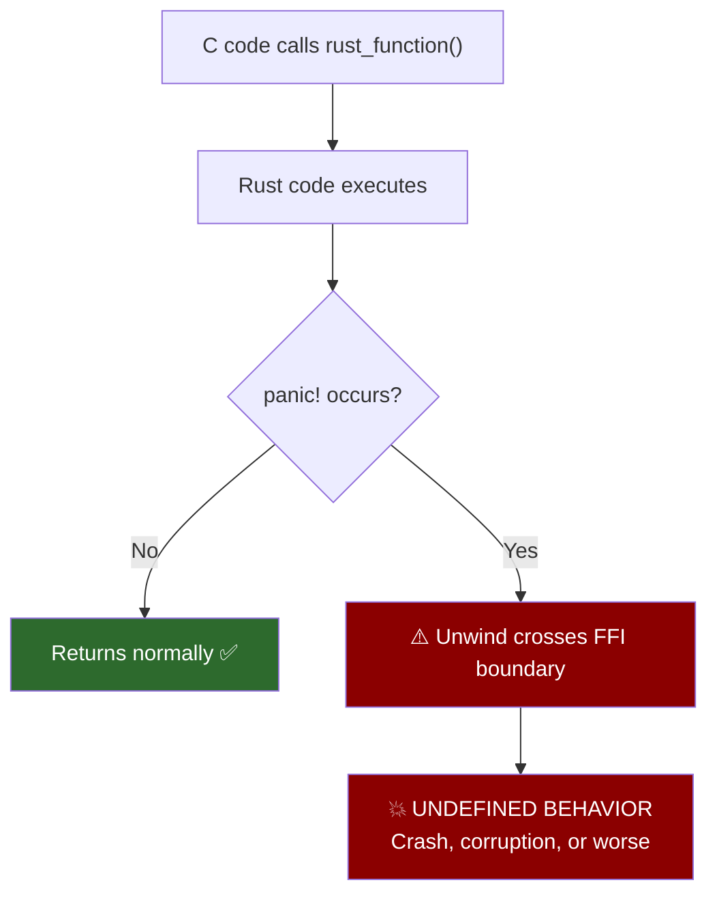

# 6. The Anatomy of a Panic 🔴

> **What you'll learn:**
> - The difference between `panic=unwind` and `panic=abort` — and how to choose
> - How stack unwinding actually works: frame-by-frame `Drop` execution, the unwinding tables, and personality routines
> - Why panicking across an FFI boundary (`extern "C"`) is undefined behavior — and how to prevent it
> - The double-panic scenario and what happens when `Drop` panics during unwinding

---

## First Principles: What *Is* a Panic?

A panic is Rust's mechanism for **unrecoverable errors** — logic bugs, violated invariants, array-out-of-bounds access. Unlike `Result<T, E>`, which is a value the caller handles, a panic is a *control flow hijack* that unwinds the stack or kills the process.

Two crucial design facts:
1. A panic is **not** an exception. You should never use it for expected failure modes.
2. A panic *may* unwind or *may* abort — your `Cargo.toml` controls this.

```toml
# Cargo.toml
[profile.release]
panic = "unwind"  # default — run Drop, catch with catch_unwind
# panic = "abort"  # alternative — immediate process death, smaller binary
```

| Strategy | `Drop` runs? | `catch_unwind` works? | Binary size | Use case |
|----------|-------------|----------------------|-------------|---------|
| `unwind` | ✅ Yes | ✅ Yes | Larger (unwinding tables) | Libraries, servers, anything with resources to clean up |
| `abort` | ❌ No | ❌ No | Smaller (~5-10%) | Embedded, WASM, security-critical (no attacker-controlled unwinding) |

## How Stack Unwinding Works

When `panic!("something broke")` executes with `panic=unwind`, here's what happens step by step:



### The Unwinding Tables

Stack unwinding relies on **exception-handling metadata** embedded in the binary (on ELF systems, the `.eh_frame` and `.gcc_except_table` sections). These tables tell the unwinding runtime:

1. How to restore register state for each frame
2. Which destructors to run (the "cleanup" landing pads)
3. Whether a `catch_unwind` handler exists (the "catch" landing pad)

This metadata is generated at compile time and adds to binary size — that's the cost of `panic=unwind`.

### Frame-by-Frame Cleanup

As the unwinder pops frames, it calls `Drop::drop()` for every local variable that was initialized:

```rust
fn process() {
    let file = File::create("output.txt").unwrap();   // Drop will close the file
    let guard = mutex.lock().unwrap();                  // Drop will release the lock
    let buffer = Vec::<u8>::with_capacity(1024);        // Drop will free the memory

    panic!("something went wrong");
    // Unwinding starts here:
    //   1. buffer.drop() — frees the 1024-byte allocation
    //   2. guard.drop()  — releases the Mutex
    //   3. file.drop()   — flushes and closes the file handle
}
```

**This is RAII in action.** Every resource protected by `Drop` gets cleaned up — no `finally` blocks, no manual cleanup.

## `panic=abort`: The Simplicity Trade-Off

With `panic=abort`, the process calls `std::process::abort()` immediately. No unwinding, no `Drop`, no `catch_unwind`.

When to choose `abort`:

- **Embedded / `no_std`:** Unwinding requires a runtime and heap — neither may be available
- **WebAssembly:** WASM doesn't support the system unwinding ABI
- **Security-hardened binaries:** Unwinding tables can theoretically be exploited; abort eliminates the attack surface
- **Binary size matters:** Unwinding tables can account for 5-10% of binary size

```toml
# Use abort for all profiles
[profile.dev]
panic = "abort"

[profile.release]
panic = "abort"
```

**Warning:** Libraries in the crate graph must agree on panic strategy. If *any* dependency was compiled with `panic=unwind` and your binary uses `panic=abort`, Cargo handles this correctly — but mixing strategies with `extern crate` shenanigans can cause link errors.

## The FFI Boundary: Where Panics Become UB

This is the most dangerous panic scenario in Rust. Consider:

```rust
// ⚠️ UNDEFINED BEHAVIOR: Unwinding across extern "C"
#[no_mangle]
pub extern "C" fn rust_function_called_from_c() -> i32 {
    let data = load_data().unwrap(); // 💥 If this panics, the unwinder
    process(data)                     //    crosses the C/Rust ABI boundary
                                      //    → UNDEFINED BEHAVIOR
}
```

The Rust unwinding runtime and the C runtime have different unwinding ABIs. When a Rust panic tries to unwind through a C stack frame, the behavior is *undefined*: crashes, memory corruption, or silent data loss.



### The Fix: `catch_unwind` at Every FFI Boundary

```rust
use std::panic;

// ✅ FIX: Catch panics before they escape to C
#[no_mangle]
pub extern "C" fn rust_function_called_from_c() -> i32 {
    // catch_unwind prevents the panic from crossing the boundary
    let result = panic::catch_unwind(|| {
        let data = load_data().expect("data loading invariant");
        process(data)
    });

    match result {
        Ok(value) => value,
        Err(_panic_payload) => {
            // Log the panic, return an error code to C
            eprintln!("PANIC in rust_function_called_from_c");
            -1  // C-compatible error code
        }
    }
}
```

We cover `catch_unwind` in depth in [Chapter 7](ch07-catching-unwinds-and-hooks.md). The key point here: **every `extern "C"` function that calls fallible Rust code must wrap it in `catch_unwind`.**

> **Nightly note:** RFC 2945 introduced `extern "C-unwind"` which allows unwinding through frames specifically marked as unwinding-compatible. On stable Rust, use `catch_unwind`.

## The Double Panic: When `Drop` Panics During Unwinding

What happens if a destructor panics while the stack is already unwinding from a previous panic?

```rust
struct BadDrop;

impl Drop for BadDrop {
    fn drop(&mut self) {
        panic!("drop panicked!"); // 💥 Panic during unwind
    }
}

fn cause_double_panic() {
    let _bad = BadDrop;
    panic!("first panic"); // Starts unwinding → BadDrop::drop() → second panic
}
```

**Result: immediate `abort()`**. Rust does not support nested unwinding. If `Drop::drop()` panics during unwind, the process is killed immediately.

**Rule:** Never panic in `Drop`. If a destructor must do fallible work (e.g., flushing a file), ignore the error or log it:

```rust
impl Drop for BufferedWriter {
    fn drop(&mut self) {
        // ✅ Ignore the error — don't panic in Drop
        let _ = self.flush();
        // Or log it:
        if let Err(e) = self.flush() {
            eprintln!("warning: failed to flush on drop: {e}");
        }
    }
}
```

## Panic Payload: What's Inside?

The `panic!` macro accepts a format string, producing a `String` payload. But the panic machinery actually uses `Box<dyn Any + Send>`:

```rust
use std::panic;

let result = panic::catch_unwind(|| {
    panic!("formatted message: {}", 42);
});

if let Err(payload) = result {
    // The payload is Box<dyn Any + Send>
    if let Some(msg) = payload.downcast_ref::<String>() {
        println!("Panic message: {msg}");
    } else if let Some(msg) = payload.downcast_ref::<&str>() {
        println!("Panic message: {msg}");
    } else {
        println!("Unknown panic payload");
    }
}
```

You can also panic with arbitrary types:

```rust
use std::panic;

// Panicking with a custom type (rare but possible)
panic::panic_any(42u32); // payload is Box<u32>
```

---

<details>
<summary><strong>🏋️ Exercise: FFI-Safe Wrapper</strong> (click to expand)</summary>

**Challenge:** Write an `extern "C"` function called `ffi_compute` that:
1. Accepts two `i32` arguments
2. Calls a Rust function that performs division (may panic on divide-by-zero)
3. Catches the panic with `catch_unwind`
4. Returns the result on success, or `i32::MIN` as a sentinel error value
5. Prints the panic message to stderr if a panic occurs

<details>
<summary>🔑 Solution</summary>

```rust
use std::panic;

/// Internal Rust function — may panic on division by zero
fn compute(a: i32, b: i32) -> i32 {
    a / b // panics if b == 0
}

/// FFI-safe wrapper — catches panics before they cross the boundary
#[no_mangle]
pub extern "C" fn ffi_compute(a: i32, b: i32) -> i32 {
    // catch_unwind creates a boundary that stops panic propagation
    let result = panic::catch_unwind(|| {
        compute(a, b)
    });

    match result {
        Ok(value) => value, // Normal return to C

        Err(payload) => {
            // Extract and log the panic message
            let msg = if let Some(s) = payload.downcast_ref::<String>() {
                s.as_str()
            } else if let Some(s) = payload.downcast_ref::<&str>() {
                *s
            } else {
                "unknown panic"
            };

            eprintln!("[PANIC in ffi_compute] {msg}");

            // Return a sentinel value that C code can check
            i32::MIN
        }
    }
}

// Test it on the Rust side
fn main() {
    // Normal case
    assert_eq!(ffi_compute(10, 3), 3);

    // Panic case — caught, returns sentinel
    assert_eq!(ffi_compute(10, 0), i32::MIN);

    println!("All FFI calls handled safely");
}
```

**Key insight:** `catch_unwind` returns `Result<T, Box<dyn Any + Send>>`. The `Err` variant contains the panic payload, which is usually a `String` (from `panic!("formatted {}")`) or `&str` (from `panic!("literal")`). The sentinel value pattern (`i32::MIN`) is the standard way to communicate errors across the C ABI — `Result` doesn't exist in C.

</details>
</details>

---

> **Key Takeaways**
> - Panics are for **logic bugs**, not expected failures — use `Result` for everything else
> - `panic=unwind` runs `Drop` destructors and supports `catch_unwind`; `panic=abort` kills immediately
> - Stack unwinding walks frames inner-to-outer, running destructors via RAII — this is your cleanup guarantee
> - **Never panic across an FFI boundary** — it's undefined behavior. Use `catch_unwind` at every `extern "C"` function
> - **Never panic in `Drop`** — a second panic during unwind triggers immediate abort
> - Panic payloads are `Box<dyn Any + Send>` — usually `String` or `&str`

> **See also:**
> - [Chapter 7: Catching Unwinds and Custom Hooks](ch07-catching-unwinds-and-hooks.md) — `catch_unwind` in depth, plus custom panic hooks
> - [Chapter 9: Capstone](ch09-capstone-bulletproof-daemon.md) — FFI boundary with errno translation
> - [Unsafe Rust & FFI](../unsafe-ffi-book/src/SUMMARY.md) — comprehensive FFI coverage
