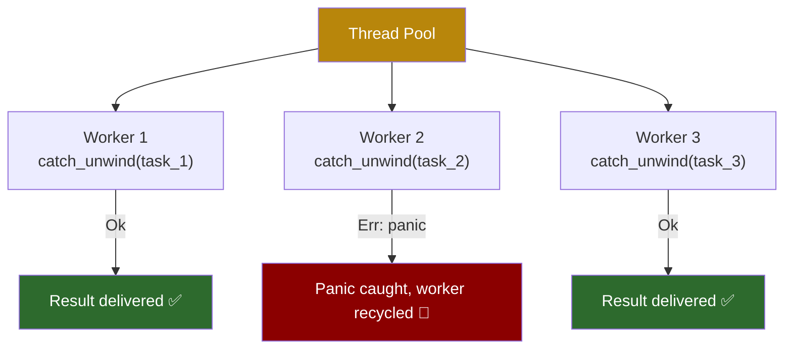
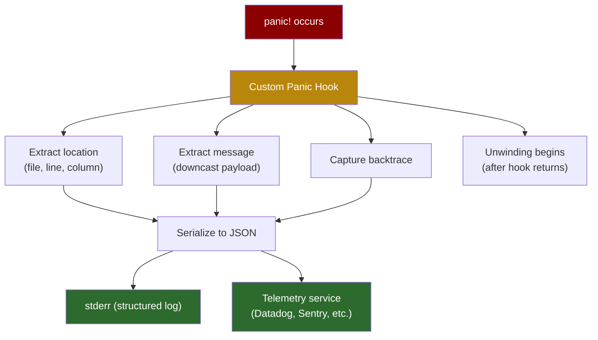

# 7. Catching Unwinds and Custom Hooks 🔴

> **What you'll learn:**
> - How `std::panic::catch_unwind` works — and why it is NOT a `try/catch` replacement
> - The `UnwindSafe` and `RefUnwindSafe` marker traits and what they protect
> - Installing custom panic hooks with `std::panic::set_hook` for production telemetry
> - Combining panic hooks with `catch_unwind` for thread-level fault isolation

---

## `catch_unwind`: Containing the Blast Radius

`std::panic::catch_unwind` takes a closure and returns `Result<T, Box<dyn Any + Send>>`:

```rust
use std::panic;

let result = panic::catch_unwind(|| {
    // This closure might panic
    risky_operation()
});

match result {
    Ok(value) => println!("Success: {value}"),
    Err(payload) => eprintln!("Caught a panic!"),
}
```

### When to Use `catch_unwind`

| ✅ Appropriate | ❌ Inappropriate |
|----------|-------------|
| FFI boundaries — prevent UB | General error handling — use `Result` |
| Thread pool workers — isolate task panics | Control flow — this is not Java exceptions |
| Plugin systems — sandbox untrusted code | Replacing proper error propagation |
| Test harnesses — assert that something panics | |

**The golden rule:** `catch_unwind` is a **containment mechanism**, not an error handling strategy. Use it when a panic in one subsystem must not take down the entire process.



### Real-World Example: Thread Pool Worker

```rust
use std::panic;
use std::thread;

fn run_worker_pool(tasks: Vec<Box<dyn FnOnce() -> String + Send>>) -> Vec<Result<String, String>> {
    let handles: Vec<_> = tasks
        .into_iter()
        .map(|task| {
            thread::spawn(move || {
                // Each worker catches its own panics
                panic::catch_unwind(panic::AssertUnwindSafe(task))
                    .map_err(|payload| {
                        // Extract the panic message
                        if let Some(msg) = payload.downcast_ref::<String>() {
                            msg.clone()
                        } else if let Some(msg) = payload.downcast_ref::<&str>() {
                            msg.to_string()
                        } else {
                            "unknown panic".to_string()
                        }
                    })
            })
        })
        .collect();

    handles
        .into_iter()
        .map(|h| h.join().expect("thread panicked during join"))
        .collect()
}
```

## `UnwindSafe`: Protecting Invariants

`catch_unwind` requires its closure argument to be `UnwindSafe`:

```rust
pub fn catch_unwind<F: FnOnce() -> R + UnwindSafe, R>(f: F) -> Result<R>
```

The `UnwindSafe` and `RefUnwindSafe` traits exist because a panic can leave data in an **inconsistent state**:

```rust
fn dangerous_example() {
    let mut items = vec![1, 2, 3];
    let mut total = 0;

    // If this panics halfway through, `total` is inconsistent:
    // some items are counted, others aren't
    for &item in &items {
        total += item;
        if item == 2 {
            panic!("oops"); // total = 3 (only 1+2 counted)
        }
    }
}
```

### What Is and Isn't `UnwindSafe`

| Type | `UnwindSafe`? | Why |
|------|--------------|-----|
| `i32`, `String`, owned data | ✅ Yes | Moved into the closure — no shared state |
| `&T` (shared reference) | ✅ Yes | Can't be mutated |
| `&mut T` | ❌ No | Could be half-modified when panic occurs |
| `&RefCell<T>` | ❌ No | Interior mutability — borrow state could be inconsistent |
| `Arc<Mutex<T>>` | ✅ Yes | Mutex is poisoned on panic — callers are warned |

### `AssertUnwindSafe`: The Escape Hatch

When you *know* it's safe (or you're willing to accept the risk), use `AssertUnwindSafe`:

```rust
use std::panic::{self, AssertUnwindSafe};

let mut counter = 0;

// counter is &mut i32 — not UnwindSafe
// AssertUnwindSafe tells the compiler: "I accept the risk"
let result = panic::catch_unwind(AssertUnwindSafe(|| {
    counter += 1;
    if counter > 0 {
        panic!("boom");
    }
}));

// counter is now 1 — we MUST check it for consistency
println!("counter after panic: {counter}");
```

**Rule:** `AssertUnwindSafe` is not a magic wand. It silences the compiler warning, but *you* are now responsible for ensuring data consistency. In practice, the most common legitimate use is wrapping closures in thread pools (where each task is independent).

## Custom Panic Hooks: Production Telemetry

The **panic hook** is a function called *before* unwinding begins. It receives a `PanicInfo` payload containing:
- The panic message
- The source location (file, line, column)

### The Default Hook

The default hook prints to stderr:

```
thread 'main' panicked at 'index out of bounds: the len is 3 but the index is 5', src/main.rs:42:10
```

### Installing a Custom Hook

```rust
use std::panic;

fn main() {
    // Replace the default hook with a custom one
    panic::set_hook(Box::new(|panic_info| {
        // Extract the panic location
        let location = panic_info.location()
            .map(|loc| format!("{}:{}:{}", loc.file(), loc.line(), loc.column()))
            .unwrap_or_else(|| "unknown".to_string());

        // Extract the panic message
        let message = if let Some(msg) = panic_info.payload().downcast_ref::<String>() {
            msg.clone()
        } else if let Some(msg) = panic_info.payload().downcast_ref::<&str>() {
            msg.to_string()
        } else {
            "unknown panic payload".to_string()
        };

        // Log to your telemetry service
        eprintln!("[PANIC] {message} at {location}");

        // In production: send to OpenTelemetry, Sentry, CloudWatch, etc.
        // telemetry::report_panic(&message, &location);
    }));

    // This panic now goes through our custom hook
    panic!("something critical failed");
}
```

### Production Pattern: JSON Panic Logger

For services running in Kubernetes or any log-aggregation environment, structured JSON is essential:

```rust
use std::panic;
use std::backtrace::Backtrace;

fn install_panic_hook() {
    panic::set_hook(Box::new(|info| {
        let backtrace = Backtrace::force_capture();

        let location = info.location().map(|l| {
            serde_json::json!({
                "file": l.file(),
                "line": l.line(),
                "column": l.column()
            })
        });

        let message = info
            .payload()
            .downcast_ref::<String>()
            .cloned()
            .or_else(|| info.payload().downcast_ref::<&str>().map(|s| s.to_string()))
            .unwrap_or_else(|| "unknown".into());

        let log_entry = serde_json::json!({
            "level": "FATAL",
            "event": "panic",
            "message": message,
            "location": location,
            "backtrace": backtrace.to_string(),
            "thread": std::thread::current().name().unwrap_or("unnamed"),
            "timestamp": chrono::Utc::now().to_rfc3339(),
        });

        // Write to stderr as a single JSON line
        eprintln!("{}", log_entry);
    }));
}
```



### Combining Hooks with `catch_unwind`

The panic hook runs *before* `catch_unwind` processes the panic. This means you get telemetry even for caught panics:

```rust
fn main() {
    install_panic_hook(); // Runs first: logs the panic

    let result = std::panic::catch_unwind(|| {
        panic!("worker failed"); // Hook fires → then catch_unwind catches it
    });

    match result {
        Ok(_) => println!("success"),
        Err(_) => {
            // The hook already logged; now handle recovery
            eprintln!("Worker panicked — restarting");
        }
    }
}
```

### Thread-Specific Panic Handling

Since `set_hook` is global (one hook per process), use thread-local context if you need per-thread behavior:

```rust
use std::cell::RefCell;
use std::panic;

thread_local! {
    static PANIC_CONTEXT: RefCell<String> = RefCell::new(String::new());
}

fn with_panic_context<F: FnOnce() -> R, R>(context: &str, f: F) -> R {
    PANIC_CONTEXT.with(|c| {
        *c.borrow_mut() = context.to_string();
    });
    f()
}

fn install_contextual_hook() {
    panic::set_hook(Box::new(|info| {
        PANIC_CONTEXT.with(|c| {
            let ctx = c.borrow();
            let msg = info.payload()
                .downcast_ref::<String>()
                .map(|s| s.as_str())
                .or_else(|| info.payload().downcast_ref::<&str>().copied())
                .unwrap_or("unknown");
            eprintln!("[PANIC] context='{}' message='{}'", *ctx, msg);
        });
    }));
}
```

---

<details>
<summary><strong>🏋️ Exercise: Resilient Task Runner</strong> (click to expand)</summary>

**Challenge:** Build a `TaskRunner` that:
1. Accepts a `Vec<Box<dyn FnOnce() -> String + Send + 'static>>` of tasks
2. Runs each task in a thread, using `catch_unwind` to isolate panics
3. Installs a custom panic hook that counts panics using an `AtomicUsize`
4. Returns a summary: how many tasks succeeded, how many panicked, and the total panic count from the hook

<details>
<summary>🔑 Solution</summary>

```rust
use std::panic::{self, AssertUnwindSafe};
use std::sync::atomic::{AtomicUsize, Ordering};
use std::sync::Arc;
use std::thread;

static PANIC_COUNT: AtomicUsize = AtomicUsize::new(0);

struct TaskSummary {
    succeeded: usize,
    panicked: usize,
    total_panic_count: usize,
}

fn run_tasks(tasks: Vec<Box<dyn FnOnce() -> String + Send + 'static>>) -> TaskSummary {
    // Install a panic hook that increments the global counter
    panic::set_hook(Box::new(|info| {
        PANIC_COUNT.fetch_add(1, Ordering::SeqCst);

        let msg = info.payload()
            .downcast_ref::<String>()
            .map(|s| s.as_str())
            .or_else(|| info.payload().downcast_ref::<&str>().copied())
            .unwrap_or("unknown");
        let loc = info.location()
            .map(|l| format!("{}:{}", l.file(), l.line()))
            .unwrap_or_else(|| "unknown".into());

        eprintln!("[PANIC #{count}] {msg} at {loc}",
            count = PANIC_COUNT.load(Ordering::SeqCst));
    }));

    // Spawn each task in its own thread with catch_unwind
    let handles: Vec<_> = tasks
        .into_iter()
        .map(|task| {
            thread::spawn(move || {
                // AssertUnwindSafe: each task is independent, no shared mutable state
                panic::catch_unwind(AssertUnwindSafe(task))
            })
        })
        .collect();

    // Collect results
    let mut succeeded = 0;
    let mut panicked = 0;

    for handle in handles {
        match handle.join() {
            Ok(Ok(_output)) => succeeded += 1,     // Task completed normally
            Ok(Err(_panic)) => panicked += 1,       // Task panicked, caught by catch_unwind
            Err(_) => panicked += 1,                 // Thread itself panicked during join
        }
    }

    // Restore the default hook
    let _ = panic::take_hook();

    TaskSummary {
        succeeded,
        panicked,
        total_panic_count: PANIC_COUNT.load(Ordering::SeqCst),
    }
}

fn main() {
    let tasks: Vec<Box<dyn FnOnce() -> String + Send + 'static>> = vec![
        Box::new(|| "task 1 ok".to_string()),
        Box::new(|| panic!("task 2 exploded")),
        Box::new(|| "task 3 ok".to_string()),
        Box::new(|| panic!("task 4 also exploded")),
        Box::new(|| "task 5 ok".to_string()),
    ];

    let summary = run_tasks(tasks);
    println!("\n=== Summary ===");
    println!("Succeeded: {}", summary.succeeded);
    println!("Panicked:  {}", summary.panicked);
    println!("Total panic count (from hook): {}", summary.total_panic_count);
}
```

**Key insights:**
- The panic hook fires *before* `catch_unwind` processes the panic — so the counter is always accurate
- `AssertUnwindSafe` is safe here because each task is an independent closure with no shared mutable state
- `take_hook()` restores the default hook — important for test suites and library code
- `AtomicUsize` provides thread-safe counting without a `Mutex`

</details>
</details>

---

> **Key Takeaways**
> - `catch_unwind` is a **containment boundary**, not a `try/catch` — use it for FFI, thread pools, and plugin isolation
> - `UnwindSafe` prevents catching panics over inconsistent mutable state — use `AssertUnwindSafe` only when you understand the risks
> - Custom panic hooks (`set_hook`) run *before* unwinding — use them for structured telemetry logging
> - Hooks are global (one per process) — use thread-local storage for per-thread context
> - The hook + `catch_unwind` combo gives you both observability (hook logs the panic) and recoverability (catch prevents thread death)

> **See also:**
> - [Chapter 6: The Anatomy of a Panic](ch06-anatomy-of-a-panic.md) — unwinding mechanics and FFI safety
> - [Chapter 8: Backtraces and Tracing Integration](ch08-backtraces-and-tracing.md) — capturing backtraces inside hooks
> - [Chapter 9: Capstone](ch09-capstone-bulletproof-daemon.md) — the full pattern: hook + catch + telemetry + graceful shutdown
