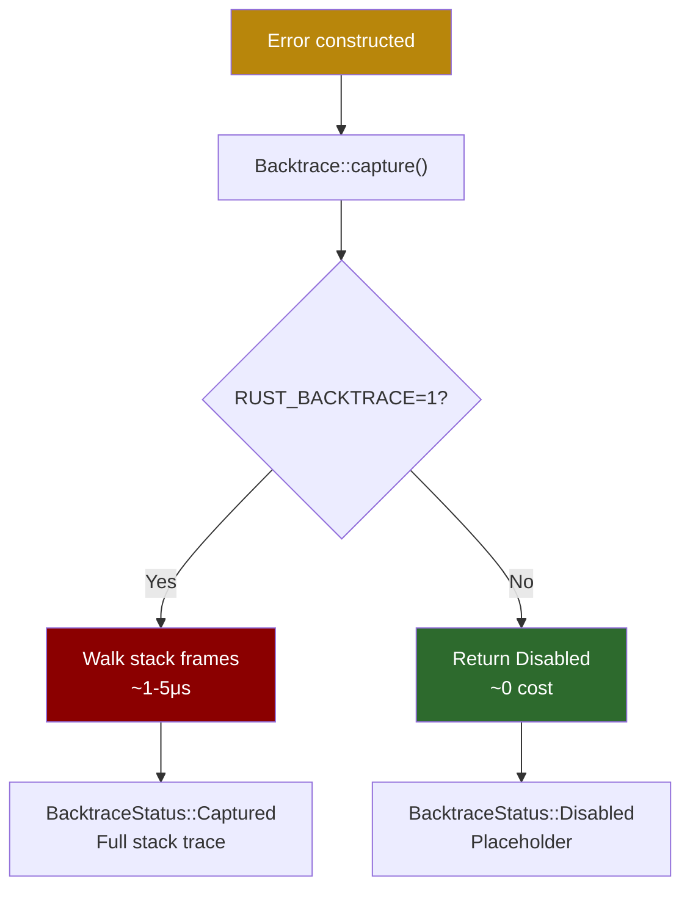
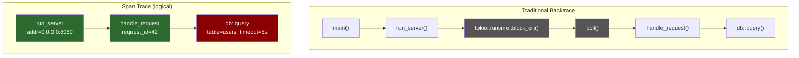

# 8. Backtraces and Tracing Integration 🔴

> **What you'll learn:**
> - How to capture `std::backtrace::Backtrace` cheaply and when to force-capture
> - The cost model: why `RUST_BACKTRACE=1` can be expensive and how `Backtrace::capture()` is lazy
> - Integrating errors with the `tracing` ecosystem — recording errors as span fields and events
> - Using `tracing-error` and `SpanTrace` to get *logical* call traces instead of just stack traces

---

## `std::backtrace::Backtrace`: The Standard Library Story

Rust's standard library has a `Backtrace` type (stabilized in 1.65):

```rust
use std::backtrace::Backtrace;

fn capture_example() {
    // Capture a backtrace at this point in execution
    let bt = Backtrace::capture();
    println!("{bt}");
}
```

### The Capture Cost Model

| Method | When it captures | Cost |
|--------|-----------------|------|
| `Backtrace::capture()` | Only if `RUST_BACKTRACE=1` or `RUST_LIB_BACKTRACE=1` is set | Zero-cost if env var is unset; ~1-5μs if set |
| `Backtrace::force_capture()` | Always, regardless of env vars | ~1-5μs always |
| `Backtrace::disabled()` | Never — creates a placeholder | Zero cost |

**The design insight:** `Backtrace::capture()` checks the environment variable at runtime. If the env var isn't set, it returns `Backtrace::disabled()` — a zero-cost placeholder. This lets you embed backtrace capture in error constructors without paying the cost in production unless you explicitly opt in.

```rust
use std::backtrace::Backtrace;
use std::io;

#[derive(Debug)]
struct MyError {
    message: String,
    // This field is cheap by default — only captures when RUST_BACKTRACE=1
    backtrace: Backtrace,
}

impl MyError {
    fn new(message: impl Into<String>) -> Self {
        Self {
            message: message.into(),
            backtrace: Backtrace::capture(), // zero-cost unless env var is set
        }
    }
}
```

### Backtrace Status

```rust
use std::backtrace::{Backtrace, BacktraceStatus};

let bt = Backtrace::capture();
match bt.status() {
    BacktraceStatus::Captured => println!("Full backtrace available:\n{bt}"),
    BacktraceStatus::Disabled => println!("No backtrace (set RUST_BACKTRACE=1)"),
    _ => println!("Unsupported platform"),
}
```



## Embedding Backtraces in Error Types

### With `thiserror` (Nightly)

```rust
// Requires nightly + #![feature(error_generic_member_access)]
use thiserror::Error;
use std::backtrace::Backtrace;

#[derive(Debug, Error)]
pub enum DataError {
    #[error("I/O error")]
    Io {
        #[from] source: std::io::Error,
        #[backtrace] backtrace: Backtrace, // thiserror exposes via provide()
    },
}
```

### With `anyhow` / `eyre` (Stable)

Both crates capture backtraces automatically when `RUST_BACKTRACE=1`:

```rust
use anyhow::{Context, Result};

fn load_data(path: &str) -> Result<Vec<u8>> {
    let data = std::fs::read(path)
        .context("failed to read data file")?;
    // ^ backtrace captured here automatically
    Ok(data)
}

fn main() -> Result<()> {
    // Set RUST_BACKTRACE=1 to see the backtrace in the error output
    let data = load_data("missing.bin")?;
    Ok(())
}
```

```
$ RUST_BACKTRACE=1 cargo run
Error: failed to read data file

Caused by:
    No such file or directory (os error 2)

Stack backtrace:
   0: anyhow::error::<impl anyhow::Error>::msg
   1: app::load_data
             at ./src/main.rs:5:17
   2: app::main
             at ./src/main.rs:11:16
```

## The `tracing` Ecosystem: Structured Observability

Stack backtraces show you *where* an error happened in the call stack. But in production, you often need *why* — the logical context. That's what `tracing` provides.

### Quick `tracing` Primer

```rust
use tracing::{info, warn, error, instrument, span, Level};

// ✅ Structured events with key-value pairs
info!(port = 8080, host = "0.0.0.0", "server starting");
warn!(retries = 3, "connection unstable");
error!(err = %my_error, "request failed"); // %my_error uses Display

// ✅ Spans define scopes of work
#[instrument]  // creates a span for this function call
fn process_request(request_id: u64) -> Result<(), MyError> {
    info!("processing");
    // Everything inside this function is within the "process_request" span
    do_work()?;
    Ok(())
}
```

### Recording Errors in Spans

The `#[instrument]` macro can automatically record errors:

```rust
use tracing::instrument;
use anyhow::Result;

#[instrument(err)]  // records the error if the function returns Err
fn parse_config(path: &str) -> Result<Config> {
    let text = std::fs::read_to_string(path)?;
    let config: Config = toml::from_str(&text)?;
    Ok(config)
}
// When parse_config returns Err, the span is annotated with:
//   err = "failed to parse config: unexpected character at line 3"
```

### Manual Error Recording

```rust
use tracing::{error, Span};

fn handle_request(req: Request) -> Response {
    let span = tracing::info_span!("handle_request", 
        request_id = req.id,
        error = tracing::field::Empty,  // placeholder — filled later
    );
    let _guard = span.enter();

    match process(req) {
        Ok(resp) => resp,
        Err(err) => {
            // Record the error in the current span
            Span::current().record("error", &format!("{err:#}"));
            error!(%err, "request processing failed");
            Response::internal_error()
        }
    }
}
```

## `tracing-error` and `SpanTrace`: Logical Call Traces

`tracing-error` provides a `SpanTrace` — a trace of the *active tracing spans* at the point of error creation. Unlike a backtrace (which shows stack frames), a span trace shows the *logical* call chain:

```
SpanTrace:
   0: handle_request with request_id=42
           at src/handler.rs:15
   1: process_batch with batch_id=7
           at src/batch.rs:33
   2: run_server with addr=0.0.0.0:8080
           at src/main.rs:8
```

### Setup

```rust
use color_eyre::eyre::Result;
use tracing_subscriber::{fmt, prelude::*, EnvFilter};
use tracing_error::ErrorLayer;

fn main() -> Result<()> {
    // Install tracing subscriber with error layer
    tracing_subscriber::registry()
        .with(fmt::layer())
        .with(EnvFilter::from_default_env())
        .with(ErrorLayer::default())  // enables SpanTrace capture
        .init();

    // Install color-eyre — it picks up the ErrorLayer automatically
    color_eyre::install()?;

    run_app()
}
```

### `color-eyre` with Span Traces

When `tracing-error`'s `ErrorLayer` is installed, `color-eyre` automatically captures and displays span traces:

```
  × failed to process request
  ├── database query timed out
  ╰── connection pool exhausted

  ━━━━━━━━━━━━━━ SPANTRACE ━━━━━━━━━━━━━━
   0: server::handle_request with request_id=42
         at src/handler.rs:15
   1: server::routes::user_endpoint with path="/api/v1/users"
         at src/routes.rs:88

  ━━━━━━━━━━━━━━ BACKTRACE ━━━━━━━━━━━━━━
     ... (stack frames) ...
```



The span trace is *far more useful* in async Rust because the backtrace shows Tokio internals (`poll`, `block_on`, etc.), while the span trace shows your application's logical structure.

## Production Pattern: Error + Backtrace + Span Trace

The complete setup for a production service:

```rust
use color_eyre::eyre::{Context, Result};
use tracing::{info, instrument};
use tracing_subscriber::{fmt, prelude::*, EnvFilter};
use tracing_error::ErrorLayer;

#[instrument(err, skip(pool))]
async fn get_user(pool: &DbPool, user_id: u64) -> Result<User> {
    let user = pool.query_one("SELECT * FROM users WHERE id = $1", &[&user_id])
        .await
        .context("database query failed")?;
    
    Ok(user)
}

#[instrument(err)]
async fn handle_request(req: Request) -> Result<Response> {
    let user = get_user(&req.pool, req.user_id)
        .await
        .context("failed to fetch user for request")?;

    Ok(Response::ok(user))
}

#[tokio::main]
async fn main() -> Result<()> {
    // 1. Set up tracing with the error layer
    tracing_subscriber::registry()
        .with(fmt::layer().json()) // structured JSON output
        .with(EnvFilter::from_default_env())
        .with(ErrorLayer::default())
        .init();

    // 2. Install color-eyre for rich error reports
    color_eyre::install()?;

    // 3. Run the application
    info!("starting server");
    run_server().await
}
```

---

<details>
<summary><strong>🏋️ Exercise: Structured Error Logging</strong> (click to expand)</summary>

**Challenge:** Build a small application that:
1. Sets up `tracing-subscriber` with JSON output and a `tracing-error` `ErrorLayer`
2. Installs `color-eyre`
3. Has an `#[instrument(err)]` function that reads a config file
4. Has an `#[instrument]` function that validates the config
5. When run with a missing file, produces output showing both the error chain and the span trace

<details>
<summary>🔑 Solution</summary>

```rust
use color_eyre::eyre::{Context, Result, ensure};
use serde::Deserialize;
use tracing::{info, instrument};
use tracing_error::ErrorLayer;
use tracing_subscriber::{fmt, prelude::*, EnvFilter};

#[derive(Debug, Deserialize)]
struct Config {
    host: String,
    port: u16,
}

/// Read and parse the config file.
/// #[instrument(err)] automatically records errors in the span.
#[instrument(err)]
fn load_config(path: &str) -> Result<Config> {
    let text = std::fs::read_to_string(path)
        .with_context(|| format!("failed to read config from '{path}'"))?;

    let config: Config = serde_json::from_str(&text)
        .context("failed to parse config JSON")?;

    Ok(config)
}

/// Validate config constraints.
/// The span includes the config values for debugging.
#[instrument(err, fields(host = %config.host, port = config.port))]
fn validate_config(config: &Config) -> Result<()> {
    ensure!(
        !config.host.is_empty(),
        "host must not be empty"
    );
    ensure!(
        config.port > 0,
        "port must be positive, got {}",
        config.port
    );
    info!("config validated successfully");
    Ok(())
}

#[instrument(err)]
fn initialize(config_path: &str) -> Result<()> {
    let config = load_config(config_path)
        .context("initialization failed")?;
    validate_config(&config)?;
    info!("application initialized");
    Ok(())
}

fn main() -> Result<()> {
    // Step 1: Set up tracing with error layer
    tracing_subscriber::registry()
        .with(fmt::layer().pretty()) // human-readable for this exercise
        .with(EnvFilter::try_from_default_env()
            .unwrap_or_else(|_| EnvFilter::new("info")))
        .with(ErrorLayer::default()) // enables SpanTrace capture
        .init();

    // Step 2: Install color-eyre
    color_eyre::install()?;

    // Step 3: Run — this will fail if config.json doesn't exist
    initialize("config.json")
}

// Expected output when config.json is missing:
//
//   × initialization failed
//   ├── failed to read config from 'config.json'
//   ╰── No such file or directory (os error 2)
//
//   ━━━ SPANTRACE ━━━
//    0: app::load_config with path="config.json"
//          at src/main.rs:18
//    1: app::initialize with config_path="config.json"
//          at src/main.rs:42
```

</details>
</details>

---

> **Key Takeaways**
> - `Backtrace::capture()` is zero-cost unless `RUST_BACKTRACE=1` — safe to embed in every error constructor
> - `anyhow` and `eyre` capture backtraces automatically — no manual work needed
> - Stack backtraces are noisy in async Rust; **span traces** show the logical call chain
> - `tracing-error::ErrorLayer` + `color-eyre` gives you both span traces and backtraces in error reports
> - `#[instrument(err)]` automatically records function-level errors in `tracing` spans

> **See also:**
> - [Chapter 3: The Provider API](ch03-provider-api.md) — the `provide()` mechanism that exposes backtraces
> - [Chapter 5: Application Errors with `anyhow` and `eyre`](ch05-anyhow-and-eyre.md) — automatic backtrace capture
> - [Chapter 7: Custom Hooks](ch07-catching-unwinds-and-hooks.md) — capturing backtraces in panic hooks
> - [Enterprise Rust: OpenTelemetry](../enterprise-rust-book/src/SUMMARY.md) — production telemetry pipelines
