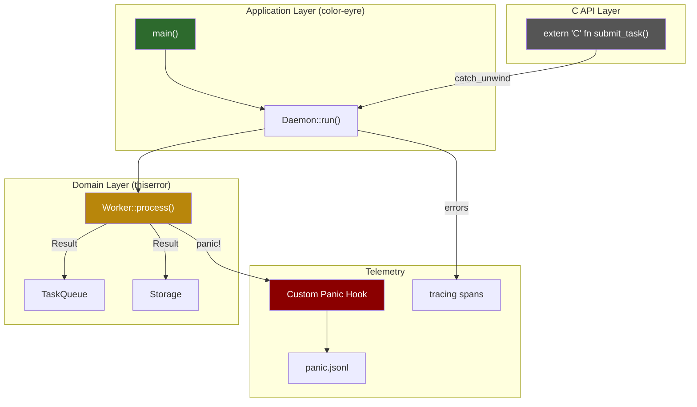
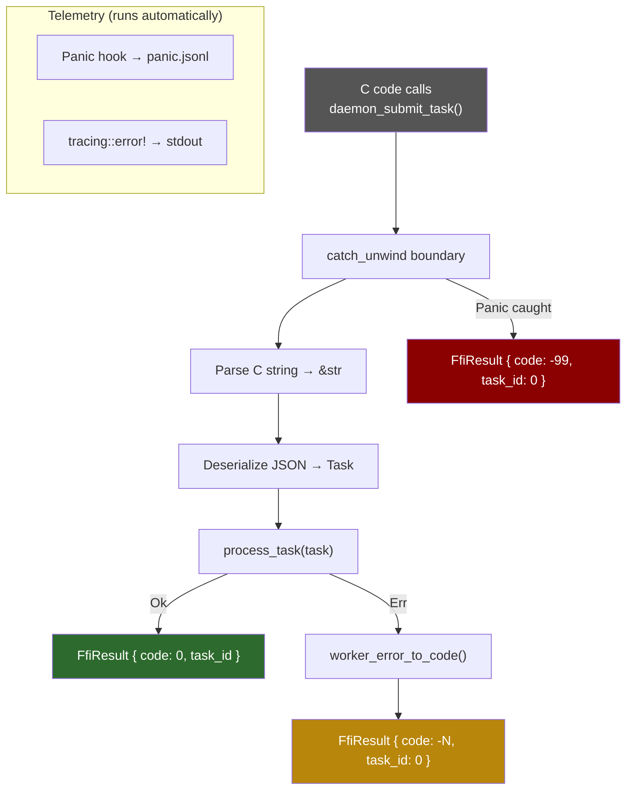

# 9. Capstone: The Bulletproof Daemon 🔴

> **What you'll learn:**
> - How to integrate every technique from this book into a single, production-grade system
> - Building a strictly typed internal module with `thiserror`
> - A top-level error handler using `color-eyre` for rich terminal output
> - A custom panic hook that serializes crash telemetry to a JSON log file
> - An FFI boundary (`extern "C"`) that catches unwinds and translates `Result`s to errno codes

---

## Architecture Overview

This capstone builds a **high-reliability background worker daemon** — the kind of component you'd find in a database engine, a message broker, or an embedded device controller. It processes tasks from a queue, and it must:

1. **Never silently swallow errors** — every failure is captured with full context
2. **Never crash the process from a worker panic** — panics are contained and logged
3. **Expose an FFI interface** — so C code can submit tasks and receive status codes
4. **Produce structured telemetry** — JSON logs with backtraces for post-mortem debugging



## Step 1: Domain Errors with `thiserror`

The internal domain layer uses strongly-typed errors. These are for *programmatic handling* — the worker can `match` on them to decide whether to retry, skip, or escalate.

```rust
// src/errors.rs — internal, strongly typed
use thiserror::Error;
use std::io;

/// Errors from the task queue subsystem
#[derive(Debug, Error)]
pub enum QueueError {
    #[error("queue is empty")]
    Empty,

    #[error("queue is full (capacity: {capacity})")]
    Full { capacity: usize },

    #[error("failed to deserialize task payload")]
    Deserialize(#[from] serde_json::Error),
}

/// Errors from the persistent storage subsystem
#[derive(Debug, Error)]
pub enum StorageError {
    #[error("I/O error accessing storage")]
    Io(#[from] io::Error),

    #[error("data corruption detected in block {block_id}")]
    Corruption { block_id: u64 },

    #[error("storage is read-only")]
    ReadOnly,
}

/// The unified worker error — combines queue and storage failures
#[derive(Debug, Error)]
pub enum WorkerError {
    #[error("queue error")]
    Queue(#[from] QueueError),

    #[error("storage error")]
    Storage(#[from] StorageError),

    #[error("task timed out after {timeout_ms}ms")]
    Timeout { task_id: u64, timeout_ms: u64 },

    #[error("task invariant violated: {0}")]
    Invariant(String),
}
```

### Error Chain Demonstration

```rust
use crate::errors::*;

fn process_task(task_id: u64) -> Result<(), WorkerError> {
    // ? converts QueueError → WorkerError::Queue via #[from]
    let payload = dequeue_task()?;

    // ? converts StorageError → WorkerError::Storage via #[from]
    write_result(task_id, &payload)?;

    Ok(())
}

fn dequeue_task() -> Result<Vec<u8>, QueueError> {
    // ? converts serde_json::Error → QueueError::Deserialize via #[from]
    let task: Task = serde_json::from_slice(&raw_bytes)?;
    Ok(task.payload)
}
```

## Step 2: Application Shell with `color-eyre`

The `main()` function owns the error reporting. Internal `WorkerError`s are automatically converted to `eyre::Report` by the `?` operator.

```rust
// src/main.rs
use color_eyre::eyre::{Context, Result, WrapErr};
use color_eyre::Section;
use tracing::{error, info, instrument};
use tracing_error::ErrorLayer;
use tracing_subscriber::{fmt, prelude::*, EnvFilter};

fn setup_tracing() -> Result<()> {
    tracing_subscriber::registry()
        .with(fmt::layer().json())
        .with(EnvFilter::try_from_default_env()
            .unwrap_or_else(|_| EnvFilter::new("info")))
        .with(ErrorLayer::default())
        .init();
    Ok(())
}

#[instrument(err)]
fn run_daemon(config_path: &str) -> Result<()> {
    let config = load_config(config_path)
        .wrap_err("failed to load daemon configuration")
        .suggestion("Ensure config.toml exists and is valid TOML")?;

    info!(workers = config.num_workers, "starting daemon");

    let pool = WorkerPool::new(config.num_workers);
    pool.run()
        .wrap_err("daemon worker pool returned an error")?;

    Ok(())
}

fn main() -> Result<()> {
    // 1. Install color-eyre for rich error reports
    color_eyre::install()?;

    // 2. Set up structured tracing
    setup_tracing()?;

    // 3. Install our custom panic hook (see Step 3)
    install_panic_hook();

    // 4. Run the daemon
    run_daemon("config.toml")
}
```

## Step 3: Custom Panic Hook with JSON Telemetry

This is where we bridge [Chapter 7](ch07-catching-unwinds-and-hooks.md) and [Chapter 8](ch08-backtraces-and-tracing.md). The panic hook:
1. Captures the panic message and location
2. Force-captures a backtrace (even if `RUST_BACKTRACE` isn't set)
3. Serializes everything to a JSON Lines file
4. Then calls the default color-eyre hook for terminal output

```rust
// src/panic_hook.rs
use std::backtrace::Backtrace;
use std::fs::OpenOptions;
use std::io::Write;
use std::panic;

/// Install a panic hook that writes structured JSON to a crash log.
/// The default color-eyre hook is preserved and called afterward.
pub fn install_panic_hook() {
    // Take the existing hook (color-eyre installs one)
    let default_hook = panic::take_hook();

    panic::set_hook(Box::new(move |info| {
        // 1. Extract the panic message
        let message = info
            .payload()
            .downcast_ref::<String>()
            .cloned()
            .or_else(|| {
                info.payload()
                    .downcast_ref::<&str>()
                    .map(|s| s.to_string())
            })
            .unwrap_or_else(|| "unknown panic".into());

        // 2. Extract the location
        let location = info.location().map(|l| {
            serde_json::json!({
                "file": l.file(),
                "line": l.line(),
                "column": l.column()
            })
        });

        // 3. Force-capture a backtrace (even without RUST_BACKTRACE)
        let backtrace = Backtrace::force_capture();

        // 4. Build the JSON crash record
        let crash_record = serde_json::json!({
            "level": "FATAL",
            "event": "panic",
            "message": message,
            "location": location,
            "backtrace": backtrace.to_string(),
            "thread": std::thread::current().name().unwrap_or("unnamed"),
            "pid": std::process::id(),
            "timestamp": chrono::Utc::now().to_rfc3339(),
        });

        // 5. Append to the crash log file (best-effort — don't panic in the hook!)
        if let Ok(mut file) = OpenOptions::new()
            .create(true)
            .append(true)
            .open("panic.jsonl")
        {
            let _ = writeln!(file, "{crash_record}");
            let _ = file.flush();
        }

        // 6. Also write to stderr for immediate visibility
        eprintln!("\n[FATAL PANIC] {message}");
        if let Some(loc) = &location {
            eprintln!("  at {}", loc);
        }

        // 7. Call the previous hook (color-eyre's pretty printer)
        default_hook(info);
    }));
}
```

**Design notes:**
- We use `Backtrace::force_capture()` because crash telemetry is non-negotiable — we always want it
- The file write is best-effort (errors are ignored) — we must never panic inside the hook
- We chain to the previous hook so `color-eyre`'s terminal output still works
- `panic.jsonl` uses JSON Lines format — one JSON object per line, easy to parse with `jq`

## Step 4: FFI Boundary with `catch_unwind`

The C API exposes the daemon's functionality to foreign callers. Every exported function wraps its body in `catch_unwind` and translates results to C-compatible errno codes.

```rust
// src/ffi.rs
use std::ffi::CStr;
use std::os::raw::c_char;
use std::panic::{self, AssertUnwindSafe};

use crate::errors::WorkerError;

/// Error codes exposed to C callers.
/// Convention: 0 = success, negative = error.
#[repr(C)]
pub struct FfiResult {
    pub code: i32,
    pub task_id: u64,
}

const FFI_OK: i32 = 0;
const FFI_ERR_QUEUE: i32 = -1;
const FFI_ERR_STORAGE: i32 = -2;
const FFI_ERR_TIMEOUT: i32 = -3;
const FFI_ERR_INVARIANT: i32 = -4;
const FFI_ERR_PANIC: i32 = -99;

/// Translate a WorkerError into a C-compatible error code.
fn worker_error_to_code(err: &WorkerError) -> i32 {
    match err {
        WorkerError::Queue(_) => FFI_ERR_QUEUE,
        WorkerError::Storage(_) => FFI_ERR_STORAGE,
        WorkerError::Timeout { .. } => FFI_ERR_TIMEOUT,
        WorkerError::Invariant(_) => FFI_ERR_INVARIANT,
    }
}

/// Submit a task to the daemon.
///
/// # Safety
/// `task_json` must be a valid null-terminated C string.
#[no_mangle]
pub unsafe extern "C" fn daemon_submit_task(task_json: *const c_char) -> FfiResult {
    // catch_unwind: prevent panics from crossing the FFI boundary
    let result = panic::catch_unwind(AssertUnwindSafe(|| {
        // Safely convert the C string to a Rust &str
        let c_str = unsafe { CStr::from_ptr(task_json) };
        let json_str = c_str.to_str().map_err(|_| WorkerError::Invariant(
            "invalid UTF-8 in task JSON".into()
        ))?;

        // Parse and process the task
        let task: Task = serde_json::from_str(json_str)
            .map_err(|e| WorkerError::Queue(e.into()))?;

        let task_id = process_task(task)?;

        Ok::<u64, WorkerError>(task_id)
    }));

    match result {
        // Happy path: Rust function returned Ok
        Ok(Ok(task_id)) => FfiResult { code: FFI_OK, task_id },

        // Rust function returned Err — translate to errno
        Ok(Err(err)) => {
            tracing::error!(%err, "task submission failed");
            FfiResult {
                code: worker_error_to_code(&err),
                task_id: 0,
            }
        }

        // Panic was caught — log and return sentinel
        Err(_panic_payload) => {
            // The panic hook already logged the details to panic.jsonl
            tracing::error!("PANIC caught at FFI boundary");
            FfiResult {
                code: FFI_ERR_PANIC,
                task_id: 0,
            }
        }
    }
}
```



## Step 5: The Worker Pool with Panic Isolation

Each worker runs in its own thread with `catch_unwind`, so one worker's panic doesn't take down the pool:

```rust
// src/worker.rs
use std::panic::{self, AssertUnwindSafe};
use std::sync::Arc;
use std::thread;
use tracing::{error, info, instrument, warn};

use crate::errors::WorkerError;

pub struct WorkerPool {
    num_workers: usize,
    queue: Arc<TaskQueue>,
}

impl WorkerPool {
    pub fn new(num_workers: usize) -> Self {
        Self {
            num_workers,
            queue: Arc::new(TaskQueue::new()),
        }
    }

    #[instrument(skip(self))]
    pub fn run(&self) -> Result<(), color_eyre::eyre::Report> {
        let handles: Vec<_> = (0..self.num_workers)
            .map(|id| {
                let queue = Arc::clone(&self.queue);
                thread::Builder::new()
                    .name(format!("worker-{id}"))
                    .spawn(move || worker_loop(id, queue))
                    .expect("failed to spawn worker thread")
            })
            .collect();

        // Wait for all workers
        for handle in handles {
            if let Err(e) = handle.join() {
                // This shouldn't happen because workers use catch_unwind,
                // but handle it defensively
                error!("worker thread panicked during join: {e:?}");
            }
        }

        Ok(())
    }
}

fn worker_loop(id: usize, queue: Arc<TaskQueue>) {
    info!(worker_id = id, "worker started");

    loop {
        let task = match queue.dequeue() {
            Ok(task) => task,
            Err(QueueError::Empty) => {
                // No more work — clean shutdown
                info!(worker_id = id, "queue empty, shutting down");
                break;
            }
            Err(err) => {
                error!(worker_id = id, %err, "failed to dequeue task");
                continue;
            }
        };

        // Isolate each task with catch_unwind
        let task_id = task.id;
        let result = panic::catch_unwind(AssertUnwindSafe(|| {
            process_single_task(task)
        }));

        match result {
            Ok(Ok(())) => {
                info!(worker_id = id, task_id, "task completed successfully");
            }
            Ok(Err(err)) => {
                // Normal error — the worker continues
                error!(worker_id = id, task_id, %err, "task failed");
            }
            Err(_panic) => {
                // Panic — the hook already logged it, worker continues
                warn!(worker_id = id, task_id,
                    "task panicked — caught by catch_unwind, worker continues");
            }
        }
    }
}

#[instrument(skip(task), fields(task_id = task.id))]
fn process_single_task(task: Task) -> Result<(), WorkerError> {
    // Validate the task
    if task.payload.is_empty() {
        return Err(WorkerError::Invariant("empty payload".into()));
    }

    // Process... (domain logic here)
    store_result(task.id, &task.payload)?;

    Ok(())
}
```

## Putting It All Together: The Complete `main()`

```rust
// src/main.rs
mod errors;
mod ffi;
mod panic_hook;
mod worker;

use color_eyre::eyre::{Context, Result};
use color_eyre::Section;
use tracing::info;
use tracing_error::ErrorLayer;
use tracing_subscriber::{fmt, prelude::*, EnvFilter};

fn main() -> Result<()> {
    // 1. Install color-eyre FIRST (it sets up its own panic hook)
    color_eyre::install()?;

    // 2. Set up tracing with the error layer
    tracing_subscriber::registry()
        .with(fmt::layer().json())
        .with(EnvFilter::try_from_default_env()
            .unwrap_or_else(|_| EnvFilter::new("info")))
        .with(ErrorLayer::default())
        .init();

    // 3. Install our custom panic hook (chains with color-eyre's)
    panic_hook::install_panic_hook();

    // 4. Load configuration
    info!("daemon starting");
    let config = load_config("daemon.toml")
        .context("failed to load daemon configuration")
        .suggestion("Run: cp daemon.example.toml daemon.toml")?;

    // 5. Run the worker pool
    let pool = worker::WorkerPool::new(config.num_workers);
    pool.run()
        .context("daemon exited with an error")?;

    info!("daemon shut down cleanly");
    Ok(())
}
```

## What This Architecture Guarantees

| Guarantee | Mechanism |
|-----------|-----------|
| No silent error swallowing | `thiserror` enums + `?` propagation + `.context()` |
| Rich user-facing error reports | `color-eyre` with span traces and suggestions |
| Panic containment | `catch_unwind` per worker thread + per FFI call |
| Crash telemetry | Custom panic hook → `panic.jsonl` with backtrace |
| FFI safety | `catch_unwind` at every `extern "C"` boundary |
| Graceful degradation | Worker panics don't kill the pool; queue errors are retried |
| Structured observability | `tracing` spans + `#[instrument]` + JSON output |

---

<details>
<summary><strong>🏋️ Exercise: Add Graceful Shutdown</strong> (click to expand)</summary>

**Challenge:** Extend the capstone daemon with graceful shutdown:

1. Install a `SIGTERM` / `SIGINT` handler (use `ctrlc` crate or `tokio::signal`)
2. When the signal fires, set an `AtomicBool` flag
3. Workers check the flag each iteration and exit their loop
4. The main thread waits for all workers to finish (with a timeout)
5. If workers don't finish in 5 seconds, log a warning and exit anyway

The panic hook should still fire even during shutdown.

<details>
<summary>🔑 Solution</summary>

```rust
use std::panic::{self, AssertUnwindSafe};
use std::sync::atomic::{AtomicBool, Ordering};
use std::sync::Arc;
use std::thread;
use std::time::{Duration, Instant};
use tracing::{error, info, warn};

/// Shared shutdown signal
static SHUTDOWN: AtomicBool = AtomicBool::new(false);

fn install_signal_handler() {
    // ctrlc crate handles SIGINT and SIGTERM cross-platform
    ctrlc::set_handler(|| {
        info!("received shutdown signal");
        SHUTDOWN.store(true, Ordering::SeqCst);
    })
    .expect("failed to install signal handler");
}

fn worker_loop(id: usize, queue: Arc<TaskQueue>) {
    info!(worker_id = id, "worker started");

    loop {
        // Check shutdown flag FIRST — before blocking on dequeue
        if SHUTDOWN.load(Ordering::SeqCst) {
            info!(worker_id = id, "shutting down (signal received)");
            break;
        }

        let task = match queue.try_dequeue_timeout(Duration::from_millis(100)) {
            Ok(task) => task,
            Err(QueueError::Empty) => continue, // loop back and check shutdown
            Err(err) => {
                error!(worker_id = id, %err, "dequeue failed");
                continue;
            }
        };

        // Process with catch_unwind (same as before)
        let task_id = task.id;
        let result = panic::catch_unwind(AssertUnwindSafe(|| {
            process_single_task(task)
        }));

        match result {
            Ok(Ok(())) => info!(worker_id = id, task_id, "task complete"),
            Ok(Err(e)) => error!(worker_id = id, task_id, %e, "task failed"),
            Err(_) => warn!(worker_id = id, task_id, "task panicked"),
        }
    }

    info!(worker_id = id, "worker exited cleanly");
}

fn run_with_graceful_shutdown(num_workers: usize) {
    install_signal_handler();

    let queue = Arc::new(TaskQueue::new());
    let handles: Vec<_> = (0..num_workers)
        .map(|id| {
            let q = Arc::clone(&queue);
            thread::Builder::new()
                .name(format!("worker-{id}"))
                .spawn(move || worker_loop(id, q))
                .expect("spawn failed")
        })
        .collect();

    // Wait for workers with a timeout
    let deadline = Instant::now() + Duration::from_secs(5);
    for handle in handles {
        let remaining = deadline.saturating_duration_since(Instant::now());
        if remaining.is_zero() {
            warn!("shutdown timeout — some workers may not have finished");
            break;
        }

        // park_timeout + join: periodically check if we've exceeded the deadline
        // (std::thread::JoinHandle doesn't support timeout directly,
        //  so we rely on the workers checking SHUTDOWN)
        if handle.join().is_err() {
            error!("worker thread panicked during shutdown");
        }
    }

    info!("all workers stopped — daemon exiting");
}
```

**Key insights:**
- The `AtomicBool` is checked *before* blocking on the queue — so workers wake up promptly
- `try_dequeue_timeout` with a short timeout prevents workers from blocking forever
- The 5-second deadline is a safety net — workers should exit on their own first
- The panic hook fires normally during shutdown because `catch_unwind` is per-task, not per-thread

</details>
</details>

---

> **Key Takeaways**
> - Layer your errors: `thiserror` enums for domain logic, `color-eyre` for the application shell
> - Every `extern "C"` function wraps its body in `catch_unwind` and translates to errno codes
> - Custom panic hooks chain with the previous hook — install yours *after* `color-eyre::install()`
> - Use `Backtrace::force_capture()` in panic hooks — crash telemetry is non-negotiable
> - Worker pools wrap each task in `catch_unwind` — one panic must never kill the pool
> - The pattern: `thiserror` → `?` → `.context()` → `color-eyre` → panic hook → JSON log

> **See also:**
> - [Chapter 4: `thiserror`](ch04-thiserror.md) — the derive macro powering the domain errors
> - [Chapter 5: `anyhow` and `eyre`](ch05-anyhow-and-eyre.md) — the `color-eyre` setup
> - [Chapter 6: Anatomy of a Panic](ch06-anatomy-of-a-panic.md) — FFI boundary rules
> - [Chapter 7: Custom Hooks](ch07-catching-unwinds-and-hooks.md) — the `set_hook` API
> - [Chapter 8: Backtraces and Tracing](ch08-backtraces-and-tracing.md) — `tracing-error` integration
