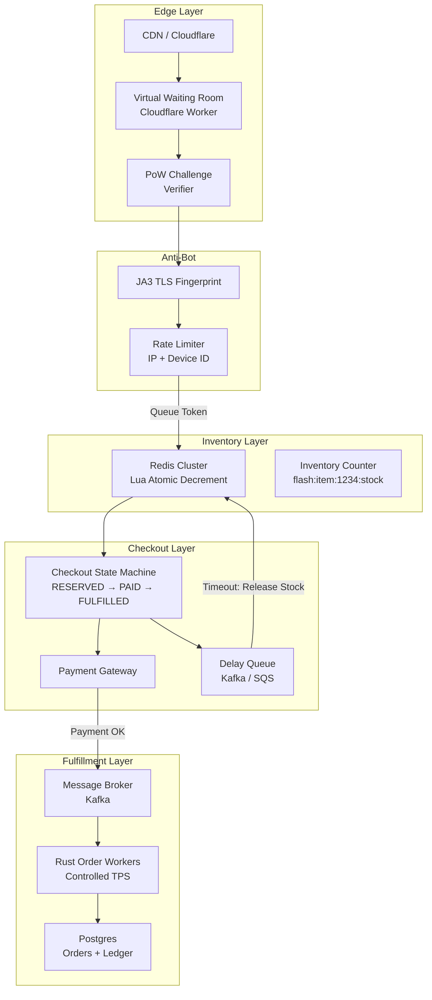

# System Design: The Hyper-Scale Flash Sale Engine

## Speaker Intro

This handbook is written from the perspective of a **Principal E-Commerce Architect** who has designed and operated flash-sale platforms processing **millions of concurrent checkout attempts in sub-second windows**. The content draws from first-hand experience building inventory reservation systems, virtual waiting rooms, and anti-bot defenses for tier-one e-commerce events—think product drops, concert ticket releases, and limited-edition sneaker launches where the entire available stock sells out in under 60 seconds.

## Who This Is For

- **Backend engineers** who have built CRUD e-commerce apps and now need to survive a 10,000× traffic spike that arrives in a single second.
- **Platform / SRE teams** tasked with guaranteeing zero over-sell, zero data loss, and sub-second p99 latency during a flash event.
- **Architects evaluating Rust** for latency-critical, high-concurrency services where every microsecond of lock contention translates to lost revenue.
- **Anyone who has watched a flash sale crash** and wondered *why the site went down even though the cloud auto-scaler was enabled*.

## Prerequisites

| Concept | Where to Learn |
|---|---|
| Intermediate Rust (ownership, traits, `async`) | [Async Rust](../async-book/src/SUMMARY.md) |
| Basic Redis commands (`SET`, `GET`, `INCR`, `EXPIRE`) | [Redis documentation](https://redis.io/docs/) |
| HTTP fundamentals (status codes, headers, cookies) | MDN Web Docs |
| Message queues (producer/consumer model) | [System Design: Distributed Message Broker](../system-design-book/src/SUMMARY.md) |
| SQL basics (transactions, `SELECT FOR UPDATE`) | [SQL Rosetta Stone](../sql-rosetta-book/src/SUMMARY.md) |

## How to Use This Book

| Emoji | Meaning |
|---|---|
| 🟢 | **Architecture** — high-level system topology, edge-layer design, CDN strategy |
| 🟡 | **Concurrency** — atomic operations, distributed state machines, lock-free reservation |
| 🔴 | **Database Internals** — durable writes, message broker integration, anti-fraud pipelines |

Each chapter solves **one specific failure mode** in the flash-sale pipeline. Read them in order—later chapters assume the waiting room and inventory layer from earlier chapters are in place.

## The Problem We Are Solving

> Design a **flash-sale platform** capable of handling **500,000 concurrent users** competing for **10,000 items** that go on sale at an exact, pre-announced time. The system must guarantee **zero over-sells**, **zero lost payments**, and **graceful degradation** even if downstream services fail—all while keeping bots and scalpers out.

| Requirement | Target |
|---|---|
| Concurrent users at T-0 | 500,000 |
| Available inventory | 10,000 units |
| Inventory reservation latency (p99) | < 10 ms |
| Checkout completion window | 10 minutes (then auto-release) |
| Over-sell tolerance | **0** (hard invariant) |
| Payment confirmation → order record | < 30 seconds |
| Bot traffic rejected | ≥ 95% of automated requests |

## Pacing Guide

| Chapter | Topic | Time | Checkpoint |
|---|---|---|---|
| Ch 0 | Introduction & Problem Statement | 30 min | Understand the full design canvas |
| Ch 1 | The Thundering Herd & Waiting Room | 5–7 hours | Cloudflare Worker + Redis queue token issuer running |
| Ch 2 | Inventory Locking (Atomic Countdown) | 6–8 hours | Redis Lua script decrementing stock atomically |
| Ch 3 | The Checkout State Machine | 5–7 hours | Distributed delay queue releasing expired reservations |
| Ch 4 | Asynchronous Order Fulfillment | 6–8 hours | Kafka consumer writing orders to Postgres at controlled TPS |
| Ch 5 | Preventing Bots and Scalpers | 5–7 hours | PoW challenge + JA3 fingerprinting + rate limiter integrated |

**Total: ~28–38 hours** of focused study.

## Table of Contents

### Part I: Traffic Shaping
- **Chapter 1 — The Thundering Herd and The Waiting Room 🟢** — Why you can't just auto-scale web servers. Architecting an edge-layer Virtual Waiting Room using Cloudflare Workers and Redis to issue cryptographic queue tokens before users ever hit your origin infrastructure.

### Part II: Inventory & Checkout
- **Chapter 2 — Inventory Locking: The Atomic Countdown 🟡** — The core bottleneck. Why standard Postgres `SELECT FOR UPDATE` causes massive lock contention and deadlocks under flash-sale load. Moving inventory counters to Redis and using atomic Lua scripts for $O(1)$ reservation.
- **Chapter 3 — The Checkout State Machine 🟡** — Handling cart abandonment. When a user reserves an item, they have 10 minutes to pay. Architecting a distributed delay queue that automatically releases reserved inventory back to the pool on timeout.

### Part III: Order Pipeline
- **Chapter 4 — Asynchronous Order Fulfillment 🔴** — Decoupling payment from fulfillment. Placing confirmed order payloads into a durable message broker and draining them into Postgres at a safe, controlled TPS using Rust workers.

### Part IV: Platform Integrity
- **Chapter 5 — Preventing Bots and Scalpers 🔴** — Protecting the business. Proof-of-Work challenges, TLS fingerprinting (JA3), device-ID rate limiting, and behavioral analysis to ensure real humans get the inventory.

## Architecture Overview



## The Flash-Sale Timeline

To anchor the entire book, here is the timeline of a single flash-sale event:

```
T - 60 min   Waiting room opens. Users land on the edge CDN page.
T - 5 min    PoW challenges are issued to all waiting users.
T - 0        Sale starts. Queue tokens are issued in FIFO order.
T + 0.01s    First 10,000 tokens admitted to inventory layer.
T + 0.05s    Redis Lua scripts decrement stock atomically.
T + 0.1s     Remaining users see "Sold Out" from edge cache.
T + 10 min   Unpaid reservations expire; delay queue releases stock.
T + 10.5 min Released stock re-enters the pool for waitlisted users.
T + 30 min   All confirmed orders drained to Postgres.
T + 60 min   Post-sale analytics and fraud review.
```

## Companion Guides

This book assumes familiarity with foundational systems topics. These companion books provide the necessary background:

| Book | Relevance |
|---|---|
| [Async Rust](../async-book/src/SUMMARY.md) | Tokio runtime, `async/await`, cancellation safety |
| [System Design: Distributed Message Broker](../system-design-book/src/SUMMARY.md) | Kafka-like log internals, consumer groups, backpressure |
| [Distributed Systems](../distributed-systems-book/src/SUMMARY.md) | Consensus, clocks, replication, partition tolerance |
| [Database Internals](../database-internals-book/src/SUMMARY.md) | MVCC, write-ahead logs, B-Tree contention |
| [Payment Gateway](../payment-gateway-book/src/SUMMARY.md) | Idempotency, double-entry ledger, Saga orchestration |
| [Concurrency in Rust](../concurrency-book/src/SUMMARY.md) | Atomics, lock-free structures, `Arc<Mutex<T>>` patterns |
