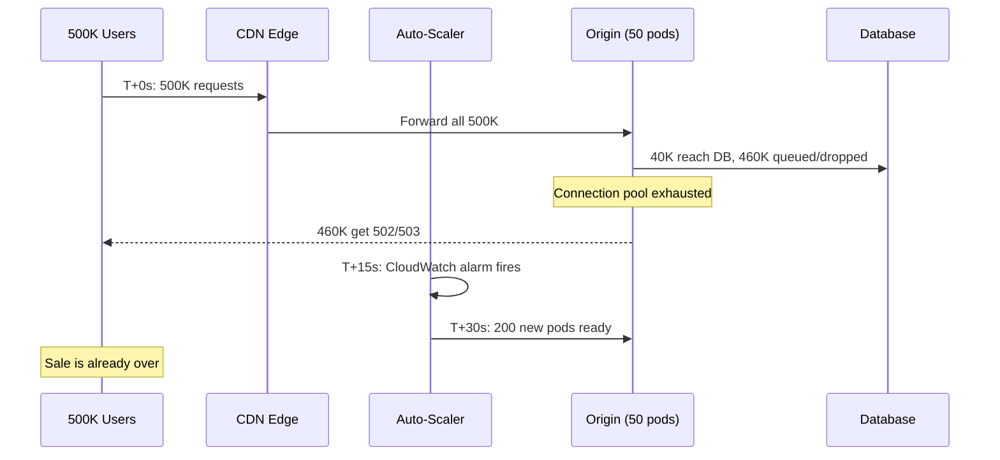
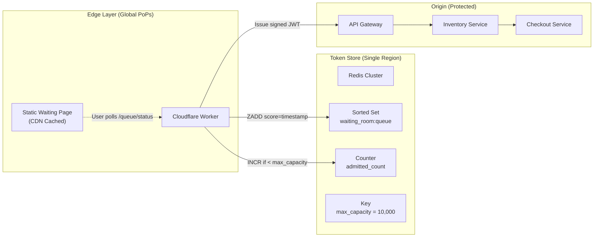
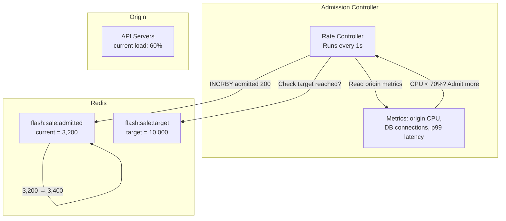

# 1. The Thundering Herd and The Waiting Room 🟢

> **The Problem:** At T-0 of a flash sale, 500,000 browsers simultaneously click "Buy Now." Every single one sends an HTTPS request to your origin servers. Even if each request takes only 5 ms, you need 2,500 CPU-seconds of work *in a single instant*. Auto-scaling cannot spin up 2,500 containers in zero seconds. The thundering herd arrives faster than any auto-scaler can react, and your origin collapses under connection exhaustion, memory pressure, and database lock contention. You need a gate *before* your infrastructure—a virtual waiting room that absorbs the stampede at the edge.

---

## Why Auto-Scaling Is Not the Answer

Let's do the math:

| Parameter | Value |
|---|---|
| Concurrent users at T-0 | 500,000 |
| Average request processing time | 5 ms |
| Requests per second per core | 200 |
| Cores needed for instant processing | 2,500 |
| Time to spin up a new ECS/K8s pod | 15–45 seconds |
| Maximum pre-warmed pods (cost-constrained) | 50 |
| Capacity of 50 pods × 4 cores × 200 RPS | 40,000 RPS |

The gap: **500,000 requests arrive in ~1 second**, but your pre-warmed fleet can handle **40,000 RPS**. That's a **12.5× overload** in the first second alone.

Auto-scaling responds to *observed* load metrics (CPU, request count). By the time CloudWatch triggers a scale-out event, the 460,000 rejected users have already experienced `502 Bad Gateway` errors, your database connection pool is exhausted, and the sale is over.



### The Fundamental Insight

> The flash sale is a **known, scheduled event**. We know *exactly when* the spike will arrive. Instead of reacting to load, we **proactively gate traffic** at the edge before it ever reaches the origin.

---

## The Virtual Waiting Room Architecture

The waiting room is a **stateless edge function** (Cloudflare Worker, AWS Lambda@Edge, or Fastly Compute) backed by a **centralized Redis counter**. It acts as a bouncer at the door:

1. **Before T-0:** All users land on a static waiting-room HTML page served from the CDN cache. Zero origin load.
2. **At T-0:** The edge function begins issuing **cryptographic queue tokens** in FIFO order.
3. **With a valid token:** The user's browser is redirected to the actual checkout flow on the origin.
4. **Without a valid token:** The user stays on the waiting page and polls for their turn.



### Queue Token Design

Each queue token is a **signed JWT** that encodes:

```json
{
  "sub": "queue_position",
  "iat": 1712000000,
  "exp": 1712000600,
  "pos": 4231,
  "sale_id": "flash-2026-04-01",
  "nonce": "a1b2c3d4e5f6",
  "fingerprint": "sha256(ip + user_agent + tls_ja3)"
}
```

| Field | Purpose |
|---|---|
| `pos` | The user's position in the FIFO queue. Determines admission order. |
| `sale_id` | Scoped to a specific flash event. Prevents token reuse across sales. |
| `nonce` | One-time value to prevent replay attacks. |
| `fingerprint` | Binds the token to a specific client. Prevents token sharing/selling. |
| `exp` | 10-minute TTL. If unused, the token expires and the slot is recycled. |

The JWT is signed with **HMAC-SHA256** using a secret shared between the edge worker and the origin API gateway. The origin never queries Redis to validate a token—it just verifies the signature and checks expiry. This keeps the origin **stateless** for admission control.

---

## Edge Worker Implementation

### Naive Approach: Let Everyone Through

```rust,ignore
// ❌ NAIVE: Every request hits the origin.
// This is what happens without a waiting room.
async fn handle_request(req: Request) -> Response {
    // Forward directly to origin — this IS the thundering herd.
    let origin_resp = fetch_origin(&req).await;
    origin_resp
}
```

**Problem:** 500,000 requests hammer the origin in the first second. The auto-scaler hasn't even woken up yet.

### Production: Cloudflare Worker with Redis Gate

```rust,ignore
use worker::*;
use serde::{Deserialize, Serialize};
use hmac::{Hmac, Mac};
use sha2::Sha256;

type HmacSha256 = Hmac<Sha256>;

#[derive(Serialize, Deserialize)]
struct QueueToken {
    sub: String,
    iat: u64,
    exp: u64,
    pos: u64,
    sale_id: String,
    nonce: String,
    fingerprint: String,
}

const MAX_ADMITTED: u64 = 10_000; // Match available inventory
const TOKEN_TTL_SECS: u64 = 600;  // 10-minute checkout window

/// The core admission gate. Runs at the edge — not at the origin.
async fn handle_queue_request(
    req: &Request,
    env: &Env,
    now: u64,
) -> Result<Response> {
    let redis_url = env.secret("REDIS_URL")?.to_string();
    let hmac_key = env.secret("HMAC_SECRET")?.to_string();
    let sale_id = env.var("SALE_ID")?.to_string();

    // Step 1: Check if this user already has a valid token (cookie).
    if let Some(token) = extract_token_cookie(req) {
        if verify_token(&token, &hmac_key, &sale_id, now).is_ok() {
            // Already admitted — let them through to origin.
            return proxy_to_origin(req).await;
        }
    }

    // Step 2: Atomically try to admit the next user.
    // Uses a Redis Lua script to ensure INCR + ZADD are atomic.
    let admitted_count: u64 = redis_eval(
        &redis_url,
        r#"
            local current = redis.call('GET', KEYS[1])
            if current == false then current = 0 else current = tonumber(current) end
            if current < tonumber(ARGV[1]) then
                redis.call('INCR', KEYS[1])
                return current + 1
            end
            return -1
        "#,
        &[&format!("flash:{sale_id}:admitted")],
        &[&MAX_ADMITTED.to_string()],
    ).await?;

    if admitted_count > 0 && admitted_count as u64 <= MAX_ADMITTED {
        // Step 3: Issue a signed queue token.
        let fingerprint = compute_fingerprint(req);
        let nonce = generate_nonce();
        let token = QueueToken {
            sub: "queue_position".into(),
            iat: now,
            exp: now + TOKEN_TTL_SECS,
            pos: admitted_count,
            sale_id: sale_id.clone(),
            nonce,
            fingerprint,
        };
        let signed = sign_token(&token, &hmac_key)?;

        let mut resp = proxy_to_origin(req).await?;
        resp.headers_mut()
            .set("Set-Cookie", &format!(
                "qt={signed}; Path=/; HttpOnly; Secure; SameSite=Strict; Max-Age={TOKEN_TTL_SECS}"
            ))?;
        Ok(resp)
    } else {
        // Step 4: Queue is full — serve the waiting page.
        let position = redis_eval(
            &redis_url,
            r#"
                local pos = redis.call('INCR', KEYS[1])
                return pos
            "#,
            &[&format!("flash:{sale_id}:waiting_count")],
            &[],
        ).await?;

        let html = waiting_room_html(position as u64, &sale_id);
        Response::from_html(html)
    }
}
```

### Key Design Decisions

| Decision | Reasoning |
|---|---|
| **HMAC-SHA256 JWT** (not database lookup) | Origin validates tokens in ~1 µs via signature check. No Redis round-trip on every request. |
| **Fingerprint binding** | Token is pinned to `sha256(ip + user_agent + ja3)`. Stolen tokens are useless from a different device. |
| **Single Redis `INCR`** | Atomic counter. No race conditions. $O(1)$ time. No distributed locks needed. |
| **10-minute TTL** | If a user doesn't complete checkout in 10 minutes, their slot is recycled (Chapter 3). |
| **Edge-served waiting page** | The HTML is a static asset cached at 300+ global PoPs. Even at 1M requests/sec, the CDN handles it for ~$0. |

---

## Redis Queue Data Model

The waiting room uses exactly three Redis keys per flash event:

```
flash:{sale_id}:admitted      → Counter (u64): How many tokens issued so far.
flash:{sale_id}:waiting_count → Counter (u64): Total users who have entered the waiting room.
flash:{sale_id}:config        → Hash: { max_capacity: 10000, sale_start: 1712000000 }
```

### Why Not a Redis Sorted Set for the Queue?

A sorted set (`ZADD` with timestamp scores) sounds appealing for FIFO ordering, but it has a fatal flaw at this scale:

| Approach | Operation | Time Complexity | Latency at 500K members |
|---|---|---|---|
| Sorted Set `ZADD` | Insert | $O(\log N)$ | ~18 comparisons for 500K members |
| Sorted Set `ZRANGEBYSCORE` + `ZREM` | Dequeue batch | $O(\log N + M)$ | Unpredictable under load |
| **Atomic `INCR`** | **Admit next** | $O(1)$ | **~0.1 ms constant** |

At 500,000 concurrent users, the sorted set approach creates contention on the Redis event loop. The `INCR`-based counter is strictly $O(1)$ and doesn't degrade with scale.

---

## Token Verification at the Origin

The origin API Gateway validates queue tokens without any Redis call:

```rust,ignore
use hmac::{Hmac, Mac};
use sha2::Sha256;

type HmacSha256 = Hmac<Sha256>;

#[derive(Debug)]
enum TokenError {
    InvalidSignature,
    Expired,
    WrongSaleId,
    FingerprintMismatch,
}

/// Constant-time token verification. No database. No Redis. ~1 µs.
fn verify_queue_token(
    token_bytes: &[u8],
    signature: &[u8],
    hmac_key: &[u8],
    expected_sale_id: &str,
    client_fingerprint: &str,
    now: u64,
) -> Result<QueueToken, TokenError> {
    // Step 1: Verify HMAC signature (constant-time comparison).
    let mut mac = HmacSha256::new_from_slice(hmac_key)
        .expect("HMAC accepts any key length");
    mac.update(token_bytes);
    mac.verify_slice(signature)
        .map_err(|_| TokenError::InvalidSignature)?;

    // Step 2: Deserialize and validate claims.
    let token: QueueToken = serde_json::from_slice(token_bytes)
        .map_err(|_| TokenError::InvalidSignature)?;

    if token.exp < now {
        return Err(TokenError::Expired);
    }
    if token.sale_id != expected_sale_id {
        return Err(TokenError::WrongSaleId);
    }
    if token.fingerprint != client_fingerprint {
        return Err(TokenError::FingerprintMismatch);
    }

    Ok(token)
}
```

### Why Constant-Time Comparison Matters

If we used `==` for signature comparison, an attacker could mount a **timing side-channel attack**:

```
Signature:  a1b2c3d4e5f6...
Attempt 1:  xxxxxxxxxxxx...  → fails at byte 0 (fast rejection)
Attempt 2:  a1xxxxxxxxxx...  → fails at byte 1 (slightly slower)
Attempt 3:  a1b2xxxxxxxx...  → fails at byte 2 (even slower)
```

By measuring response times, the attacker reconstructs the signature byte-by-byte. HMAC's `verify_slice` always compares all bytes, taking the same time regardless of where the mismatch occurs.

---

## Handling the Waiting Room Page

The waiting page is a static HTML file served from the CDN cache. It contains a small JavaScript snippet that polls the edge worker every 2 seconds:

```
┌─────────────────────────────────────────────┐
│                                             │
│     🎶 You're in the Virtual Queue 🎶      │
│                                             │
│     Your position: #4,231                   │
│     Estimated wait: ~2 minutes              │
│                                             │
│     ┌─────────────────────────────┐         │
│     │ ████████████░░░░░░░░░░░░░░░ │ 42%     │
│     └─────────────────────────────┘         │
│                                             │
│     Do not refresh this page.               │
│     You will be redirected automatically.   │
│                                             │
└─────────────────────────────────────────────┘
```

### Polling vs. WebSockets vs. Server-Sent Events

| Approach | Pros | Cons |
|---|---|---|
| **Long polling (2s interval)** | Works everywhere. Cacheable at CDN. Minimal edge compute. | 2s latency granularity. |
| WebSockets | Real-time updates. | Cannot be cached. Requires persistent connections at edge. Expensive at 500K connections. |
| Server-Sent Events (SSE) | Unidirectional push. | Same connection cost as WebSockets. Cloudflare Workers don't support persistent connections. |

**Decision: 2-second polling.** At 500K users, that's 250K requests/second to the edge—trivial for a CDN. Each poll is a single Redis `GET` of the admitted count, compared against the user's position.

```rust,ignore
/// Edge handler for /queue/status — returns the user's position relative to admitted count.
async fn handle_queue_status(
    req: &Request,
    env: &Env,
) -> Result<Response> {
    let sale_id = env.var("SALE_ID")?.to_string();
    let redis_url = env.secret("REDIS_URL")?.to_string();

    // Get the user's queue position from their cookie.
    let user_position = extract_position_cookie(req)
        .ok_or_else(|| Error::from("No queue position cookie"))?;

    // Get current admitted count from Redis.
    let admitted: u64 = redis_get(
        &redis_url,
        &format!("flash:{sale_id}:admitted"),
    ).await?.unwrap_or(0);

    if user_position <= admitted {
        // User's turn! Issue their token.
        let resp = Response::from_json(&serde_json::json!({
            "status": "admitted",
            "redirect": "/checkout"
        }))?;
        Ok(resp)
    } else {
        let ahead = user_position - admitted;
        let est_seconds = ahead * 2; // ~2 seconds per batch admission
        let resp = Response::from_json(&serde_json::json!({
            "status": "waiting",
            "position": user_position,
            "ahead": ahead,
            "est_wait_seconds": est_seconds
        }))?;
        // Cache for 1 second at the edge to reduce Redis load.
        let mut resp = resp;
        resp.headers_mut().set("Cache-Control", "public, max-age=1")?;
        Ok(resp)
    }
}
```

---

## Capacity Planning: The Admission Rate Controller

You don't admit all 10,000 users at once. The origin can only handle a controlled flow. The **admission rate controller** is a background process that periodically increments the `max_admitted` threshold:



```rust,ignore
use std::time::Duration;
use tokio::time;

/// Admission rate controller — runs as a background task on the control plane.
/// Gradually opens the gate based on real-time origin health.
async fn admission_controller(
    redis: &RedisClient,
    sale_id: &str,
    target_capacity: u64,
    batch_size: u64,
) {
    let admitted_key = format!("flash:{sale_id}:admitted");
    let mut interval = time::interval(Duration::from_secs(1));

    loop {
        interval.tick().await;

        // Read current origin health metrics.
        let metrics = fetch_origin_metrics().await;

        // Only admit more if origin is healthy.
        if metrics.cpu_percent > 80.0 || metrics.p99_latency_ms > 500.0 {
            tracing::warn!(
                cpu = metrics.cpu_percent,
                p99 = metrics.p99_latency_ms,
                "Origin under pressure — pausing admission"
            );
            continue;
        }

        let current: u64 = redis.get(&admitted_key).await.unwrap_or(0);
        if current >= target_capacity {
            tracing::info!("All {target_capacity} slots admitted. Controller stopping.");
            break;
        }

        let to_admit = batch_size.min(target_capacity - current);
        let _: u64 = redis.incr_by(&admitted_key, to_admit).await.unwrap();

        tracing::info!(
            admitted = current + to_admit,
            target = target_capacity,
            batch = to_admit,
            "Admitted new batch"
        );
    }
}
```

### Why a Feedback Loop?

A fixed admission rate (e.g., "admit 500/second") is fragile:

| Scenario | Fixed Rate | Adaptive Controller |
|---|---|---|
| Origin healthy, all pods up | Admits 500/sec (under-utilizes capacity) | Admits 1,000/sec (detects headroom) |
| 2 pods crash mid-sale | Still admits 500/sec → cascading failure | Pauses admission → origin recovers |
| Database connection pool full | Still admits → 500 errors pile up | Holds gate → zero user-visible errors |

---

## Edge Caching Strategy

The waiting room page and status endpoint are designed to be **aggressively cacheable**:

| Endpoint | Cache TTL | Cache Key | Rationale |
|---|---|---|---|
| `/waiting-room` (HTML) | 60 seconds | URL only | Static page. Identical for all users. |
| `/queue/status` | 1 second | URL + position bucket | Position changes slowly. 1s staleness is acceptable. |
| `/checkout/*` | 0 (no-cache) | — | Dynamic, personalized. Must hit origin. |

### Position Bucketing

Instead of caching `/queue/status?pos=4231` individually (500K unique cache keys), we bucket positions:

```
Position 1–1000      → bucket=1   → cached response: "~0 min wait"
Position 1001–2000   → bucket=2   → cached response: "~2 min wait"
Position 2001–3000   → bucket=3   → cached response: "~4 min wait"
...
```

This reduces 500K unique cache entries to ~500 buckets, each cached for 1 second. The CDN serves 99.8% of status polls from cache.

---

## Failure Modes and Mitigations

| Failure | Impact | Mitigation |
|---|---|---|
| **Redis down** | Cannot issue tokens | Edge worker returns "maintenance" page. Sale delayed. Redis Sentinel auto-promotes replica in ~5s. |
| **Edge Worker timeout** | User stuck on waiting page | Client-side JavaScript retry with exponential backoff. Fallback to direct origin with static rate limit. |
| **Clock skew between edge PoPs** | Token `iat`/`exp` off by seconds | Use Redis server time (`TIME` command) for token issuance, not edge-local clock. |
| **Token theft (man-in-middle)** | Attacker uses stolen token | Fingerprint binding (`ip + ja3 + user_agent`). HTTPS prevents interception. |
| **Bot flood of waiting room** | Bots grab positions 1–10,000 | PoW challenge required before position assignment (Chapter 5). |

---

## Benchmarks: With vs. Without Waiting Room

| Metric | Without Waiting Room | With Waiting Room |
|---|---|---|
| Origin RPS at T+1s | 500,000 (💀) | 1,000 (controlled) |
| Error rate at T+1s | 92% (`502`/`503`) | 0% |
| Database connections used | 500 (pool exhausted) | 50 (steady) |
| Inventory over-sell risk | High (race conditions) | Zero (gated admission) |
| User experience | Crash page | Smooth queue with ETA |
| CDN cost for 500K users | ~$0 (all hit origin) | ~$0.50 (edge-served) |
| Origin infra cost | Over-provisioned 10× | Right-sized |

---

> **Key Takeaways**
>
> 1. **Auto-scaling is reactive; flash sales are proactive.** You know the spike is coming. Gate traffic at the edge *before* it reaches your origin.
> 2. **The waiting room is a CDN-cached static page.** It costs almost nothing to serve to millions of users.
> 3. **Queue tokens are signed JWTs verified in constant time.** The origin never queries Redis to validate a token—it checks the HMAC signature in ~1 µs.
> 4. **The admission rate is adaptive, not fixed.** A feedback loop monitors origin health and pauses admission if the system is under pressure.
> 5. **Redis `INCR` is the simplest, fastest queue primitive.** A sorted set adds $O(\log N)$ overhead and contention. An atomic counter is $O(1)$ and never degrades.
> 6. **Fingerprint-bind every token.** Without binding, bots can steal and resell queue positions.
