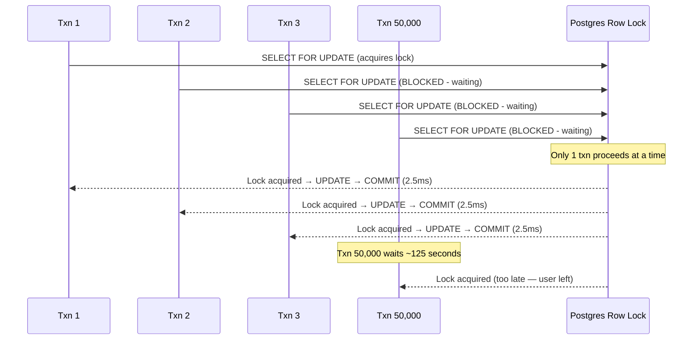
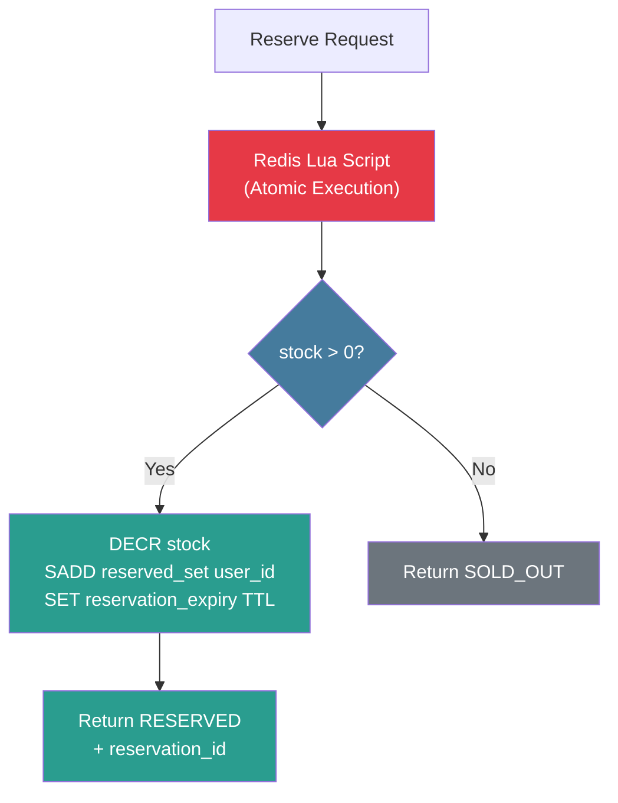
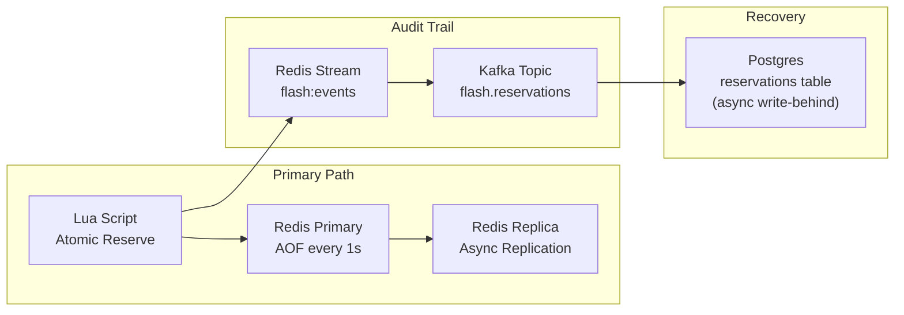

# 2. Inventory Locking — The Atomic Countdown 🟡

> **The Problem:** You have 10,000 concert tickets. 50,000 admitted users (filtered through the waiting room) hit the "Reserve" button within seconds. Each request must atomically decrement the inventory counter. A standard Postgres `SELECT FOR UPDATE` serializes every request through a single row lock, creating a bottleneck where each transaction waits 5–50 ms for the lock. At 50,000 requests, the queue depth reaches minutes, connections exhaust, and deadlocks cascade. We need a lock-free, $O(1)$ inventory reservation that runs entirely in memory.

---

## Why Postgres `SELECT FOR UPDATE` Fails

Let's trace what happens when 50,000 concurrent transactions try to reserve the same inventory row:

```sql
-- Every checkout request runs this:
BEGIN;
SELECT stock FROM products WHERE id = 'FLASH-001' FOR UPDATE;
-- Row is now locked. All other transactions WAIT here.
UPDATE products SET stock = stock - 1 WHERE id = 'FLASH-001' AND stock > 0;
COMMIT;
-- Lock released. Next transaction proceeds.
```

### The Serialization Bottleneck

| Step | Duration | Queue Depth at 50K RPS |
|---|---|---|
| Acquire row lock | 0 ms (first request) → 50 ms (50,000th) | 50,000 waiters |
| Execute UPDATE | ~0.5 ms | — |
| Commit + WAL fsync | ~2 ms | — |
| **Total per transaction** | **~2.5 ms** | — |
| **Throughput** | **400 TPS** (serial) | — |
| **Time to drain 50K requests** | **125 seconds** | — |

The flash sale is over in 10 seconds, but the database is still grinding through the lock queue for **two minutes**.



### Deadlock Risk

With multiple products in a flash sale, transactions may lock rows in different orders:

```
Txn A: Lock Product-1, then Lock Product-2
Txn B: Lock Product-2, then Lock Product-1
→ DEADLOCK. Postgres kills one transaction after deadlock_timeout (default: 1s).
```

Under extreme concurrency, deadlock detection itself becomes a bottleneck—Postgres must scan the wait-for graph, which is $O(N^2)$ in the worst case.

---

## Moving Inventory to Redis

Redis is single-threaded, processes commands sequentially, and keeps all data in memory. A single Redis `DECR` operation takes **~0.1 ms** (network round-trip included). At 50,000 requests, the total drain time is **~5 seconds**—a 25× improvement over Postgres.

But raw `DECR` has a race condition:

```rust,ignore
// ❌ NAIVE: Race condition between GET and DECR.
async fn reserve_naive(redis: &RedisClient, item_id: &str) -> bool {
    let key = format!("flash:item:{item_id}:stock");

    // Two separate commands — NOT atomic!
    let stock: i64 = redis.get(&key).await.unwrap_or(0);
    if stock > 0 {
        // Another request can decrement between the GET and DECR.
        // This leads to stock going negative → OVER-SELL.
        let _: i64 = redis.decr(&key, 1).await.unwrap();
        true
    } else {
        false
    }
}
```

**The bug:** Between the `GET` and `DECR`, another coroutine can read the same stock value. Both see `stock = 1`, both decrement, and stock becomes `-1`. We've sold two items when only one existed.

---

## The Atomic Lua Script Solution

Redis Lua scripts execute **atomically**—the entire script runs without any other command interleaving. This gives us a true CAS (Compare-And-Swap) operation:



### The Production Lua Script

```lua
-- inventory_reserve.lua
-- Atomically reserves one unit of inventory.
-- KEYS[1] = flash:item:{item_id}:stock        (integer counter)
-- KEYS[2] = flash:item:{item_id}:reservations  (hash: user_id → reservation_json)
-- ARGV[1] = user_id
-- ARGV[2] = reservation_json (contains timestamp, sale_id, etc.)
-- ARGV[3] = reservation_ttl_seconds (e.g., 600 for 10 minutes)
--
-- Returns: 1 = reserved, 0 = sold out, -1 = already reserved by this user

-- Guard: prevent double-reservation by the same user.
local existing = redis.call('HGET', KEYS[2], ARGV[1])
if existing then
    return -1
end

-- Atomic check-and-decrement.
local stock = tonumber(redis.call('GET', KEYS[1]))
if stock == nil or stock <= 0 then
    return 0  -- SOLD OUT
end

-- Decrement stock.
redis.call('DECR', KEYS[1])

-- Record the reservation with TTL metadata.
redis.call('HSET', KEYS[2], ARGV[1], ARGV[2])

-- Set a per-user expiry key for the delay queue to monitor (Chapter 3).
redis.call('SET',
    'flash:reservation:' .. ARGV[1],
    ARGV[2],
    'EX', tonumber(ARGV[3])
)

return 1  -- RESERVED
```

### Why This Is $O(1)$

| Redis Command | Time Complexity | Notes |
|---|---|---|
| `HGET` | $O(1)$ | Hash field lookup |
| `GET` | $O(1)$ | String key read |
| `DECR` | $O(1)$ | Atomic integer decrement |
| `HSET` | $O(1)$ | Hash field write |
| `SET ... EX` | $O(1)$ | String write with TTL |
| **Total script** | $O(1)$ | **5 constant-time operations** |

No locks. No waiting. No deadlocks. Every request completes in the same time regardless of concurrency level.

---

## Rust Service: Calling the Lua Script

```rust,ignore
use redis::Script;
use serde::{Deserialize, Serialize};
use uuid::Uuid;

#[derive(Debug, Serialize, Deserialize)]
struct Reservation {
    reservation_id: String,
    user_id: String,
    item_id: String,
    sale_id: String,
    reserved_at: u64,
    expires_at: u64,
}

#[derive(Debug)]
enum ReserveResult {
    Reserved(Reservation),
    SoldOut,
    AlreadyReserved,
    Error(String),
}

const RESERVATION_TTL_SECS: u64 = 600; // 10 minutes

const LUA_RESERVE: &str = r#"
    local existing = redis.call('HGET', KEYS[2], ARGV[1])
    if existing then return -1 end

    local stock = tonumber(redis.call('GET', KEYS[1]))
    if stock == nil or stock <= 0 then return 0 end

    redis.call('DECR', KEYS[1])
    redis.call('HSET', KEYS[2], ARGV[1], ARGV[2])
    redis.call('SET', 'flash:reservation:' .. ARGV[1], ARGV[2], 'EX', tonumber(ARGV[3]))
    return 1
"#;

async fn reserve_inventory(
    redis: &mut redis::aio::MultiplexedConnection,
    item_id: &str,
    user_id: &str,
    sale_id: &str,
    now: u64,
) -> ReserveResult {
    let reservation = Reservation {
        reservation_id: Uuid::new_v4().to_string(),
        user_id: user_id.to_string(),
        item_id: item_id.to_string(),
        sale_id: sale_id.to_string(),
        reserved_at: now,
        expires_at: now + RESERVATION_TTL_SECS,
    };

    let reservation_json = match serde_json::to_string(&reservation) {
        Ok(json) => json,
        Err(e) => return ReserveResult::Error(e.to_string()),
    };

    let script = Script::new(LUA_RESERVE);

    let stock_key = format!("flash:item:{item_id}:stock");
    let reservations_key = format!("flash:item:{item_id}:reservations");

    let result: Result<i64, _> = script
        .key(&stock_key)
        .key(&reservations_key)
        .arg(user_id)
        .arg(&reservation_json)
        .arg(RESERVATION_TTL_SECS)
        .invoke_async(redis)
        .await;

    match result {
        Ok(1) => ReserveResult::Reserved(reservation),
        Ok(0) => ReserveResult::SoldOut,
        Ok(-1) => ReserveResult::AlreadyReserved,
        Ok(code) => ReserveResult::Error(format!("Unexpected Lua return: {code}")),
        Err(e) => ReserveResult::Error(e.to_string()),
    }
}
```

### The Axum Handler

```rust,ignore
use axum::{extract::State, http::StatusCode, Json};

#[derive(Deserialize)]
struct ReserveRequest {
    item_id: String,
    sale_id: String,
}

#[derive(Serialize)]
struct ReserveResponse {
    status: String,
    reservation_id: Option<String>,
    expires_at: Option<u64>,
}

async fn handle_reserve(
    State(state): State<AppState>,
    claims: AuthenticatedUser, // Extracted from queue token JWT (Chapter 1)
    Json(body): Json<ReserveRequest>,
) -> (StatusCode, Json<ReserveResponse>) {
    let now = current_timestamp();
    let mut redis = state.redis.get_multiplexed_async_connection().await.unwrap();

    match reserve_inventory(
        &mut redis,
        &body.item_id,
        &claims.user_id,
        &body.sale_id,
        now,
    ).await {
        ReserveResult::Reserved(r) => (
            StatusCode::OK,
            Json(ReserveResponse {
                status: "reserved".into(),
                reservation_id: Some(r.reservation_id),
                expires_at: Some(r.expires_at),
            }),
        ),
        ReserveResult::SoldOut => (
            StatusCode::CONFLICT,
            Json(ReserveResponse {
                status: "sold_out".into(),
                reservation_id: None,
                expires_at: None,
            }),
        ),
        ReserveResult::AlreadyReserved => (
            StatusCode::CONFLICT,
            Json(ReserveResponse {
                status: "already_reserved".into(),
                reservation_id: None,
                expires_at: None,
            }),
        ),
        ReserveResult::Error(e) => {
            tracing::error!(error = %e, "Inventory reservation failed");
            (
                StatusCode::INTERNAL_SERVER_ERROR,
                Json(ReserveResponse {
                    status: "error".into(),
                    reservation_id: None,
                    expires_at: None,
                }),
            )
        }
    }
}
```

---

## Side-by-Side: Naive DB Locking vs. Production Redis Lua

| Dimension | Naive Postgres `SELECT FOR UPDATE` | Production Redis Lua Script |
|---|---|---|
| **Latency per request** | 2.5 ms (grows with queue depth) | 0.1 ms (constant) |
| **Throughput** | ~400 TPS (serialized) | ~100,000 TPS |
| **Time to drain 50K requests** | 125 seconds | 0.5 seconds |
| **Over-sell risk** | Low (if no bugs) but deadlock risk | **Zero** (atomic script) |
| **Deadlock possible** | Yes (multi-row locks) | **No** (single-threaded execution) |
| **Connection pool pressure** | 50K connections needed | 1 multiplexed connection |
| **Durability** | Durable (`fsync` on commit) | In-memory only (need persistence strategy) |
| **Failure mode** | Slow degradation → timeouts | Fast rejection → instant "sold out" |

---

## Ensuring Durability: Redis Persistence Strategy

Redis is in-memory. If it crashes, we lose the inventory counter state. For a flash sale, this is handled by a layered approach:



### The Three-Tier Durability Model

| Tier | Storage | Latency | Durability | Purpose |
|---|---|---|---|---|
| 1 | Redis Primary (AOF `everysec`) | 0.1 ms | Survives process restart | Hot path — handles all reads/writes |
| 2 | Redis Replica (async) | ~1 ms | Survives primary crash | Automatic failover via Sentinel |
| 3 | Kafka → Postgres (async) | ~500 ms | Survives full Redis cluster loss | Audit trail + disaster recovery |

**The key insight:** We don't need synchronous durability for the inventory counter. If Redis crashes mid-sale:

1. Redis Sentinel promotes the replica in ~5 seconds.
2. The replica has all data up to ~1 second before the crash (async replication lag).
3. We might "lose" ~100 reservations from that 1-second window.
4. Those users retry, and the Lua script correctly re-reserves (or shows sold-out).
5. The Kafka audit trail has the ground truth for reconciliation.

---

## Initializing Inventory Before the Sale

Before T-0, a control-plane job sets up the Redis keys:

```rust,ignore
/// Called by the sale admin 5 minutes before T-0.
/// Sets up the Redis inventory state for the flash sale.
async fn initialize_flash_sale(
    redis: &mut redis::aio::MultiplexedConnection,
    sale_id: &str,
    items: &[(String, u64)], // (item_id, quantity)
) -> Result<(), redis::RedisError> {
    let mut pipe = redis::pipe();

    for (item_id, quantity) in items {
        let stock_key = format!("flash:item:{item_id}:stock");
        let reservations_key = format!("flash:item:{item_id}:reservations");

        // Set initial stock count.
        pipe.set(&stock_key, *quantity);
        // Clear any stale reservation hash.
        pipe.del(&reservations_key);
    }

    // Set sale metadata.
    pipe.set(
        format!("flash:{sale_id}:status"),
        "initialized",
    );

    pipe.query_async(redis).await?;

    tracing::info!(
        sale_id = sale_id,
        items = items.len(),
        "Flash sale inventory initialized in Redis"
    );

    Ok(())
}
```

---

## Monitoring: Real-Time Inventory Dashboard

During the sale, operators need a live view of stock levels:

```rust,ignore
/// Returns a snapshot of inventory state across all items in a sale.
async fn get_inventory_snapshot(
    redis: &mut redis::aio::MultiplexedConnection,
    sale_id: &str,
    item_ids: &[String],
) -> Vec<ItemSnapshot> {
    let mut pipe = redis::pipe();

    for item_id in item_ids {
        pipe.get(format!("flash:item:{item_id}:stock"));
        pipe.hlen(format!("flash:item:{item_id}:reservations"));
    }

    let results: Vec<i64> = pipe.query_async(redis).await.unwrap_or_default();

    item_ids
        .iter()
        .enumerate()
        .map(|(i, id)| ItemSnapshot {
            item_id: id.clone(),
            remaining_stock: results.get(i * 2).copied().unwrap_or(0),
            active_reservations: results.get(i * 2 + 1).copied().unwrap_or(0),
        })
        .collect()
}

#[derive(Debug, Serialize)]
struct ItemSnapshot {
    item_id: String,
    remaining_stock: i64,
    active_reservations: i64,
}
```

---

## Handling Multiple Items Per Cart

When a user wants to reserve 3 different items in one cart, we need **all-or-nothing** semantics. The Lua script extends to a multi-key version:

```lua
-- multi_reserve.lua
-- Atomically reserves multiple items. ALL succeed or NONE do.
-- KEYS = [stock_key_1, stock_key_2, ..., reservations_key_1, reservations_key_2, ...]
-- ARGV = [num_items, user_id, item1_json, item2_json, ..., ttl]

local num_items = tonumber(ARGV[1])
local user_id = ARGV[2]
local ttl = tonumber(ARGV[num_items + 3])

-- Phase 1: Check all items have stock.
for i = 1, num_items do
    local stock = tonumber(redis.call('GET', KEYS[i]))
    if stock == nil or stock <= 0 then
        return 0  -- At least one item sold out. Reserve nothing.
    end
end

-- Phase 2: All items available. Decrement all atomically.
for i = 1, num_items do
    local reservation_json = ARGV[i + 2]
    redis.call('DECR', KEYS[i])
    redis.call('HSET', KEYS[num_items + i], user_id, reservation_json)
end

-- Phase 3: Set combined reservation expiry.
redis.call('SET', 'flash:reservation:' .. user_id, 'active', 'EX', ttl)

return 1  -- ALL RESERVED
```

> ⚠️ **Redis Cluster caveat:** Lua scripts that touch multiple keys only work if all keys hash to the **same slot**. Use Redis hash tags: `{flash:item}:1234:stock` and `{flash:item}:5678:stock` both hash on `flash:item`, landing on the same shard.

---

## Load Testing: Proving Correctness

The ultimate test: fire 50,000 concurrent reservation requests and verify that **exactly 10,000** succeed:

```rust,ignore
#[cfg(test)]
mod tests {
    use super::*;
    use tokio::task::JoinSet;

    #[tokio::test]
    async fn test_no_oversell_under_concurrency() {
        let client = redis::Client::open("redis://127.0.0.1/").unwrap();
        let mut conn = client.get_multiplexed_async_connection().await.unwrap();

        let item_id = "TEST-ITEM";
        let sale_id = "TEST-SALE";
        let initial_stock: u64 = 10_000;
        let num_requests: u64 = 50_000;

        // Initialize stock.
        initialize_flash_sale(
            &mut conn,
            sale_id,
            &[(item_id.to_string(), initial_stock)],
        ).await.unwrap();

        // Fire 50,000 concurrent reservations.
        let mut tasks = JoinSet::new();
        for i in 0..num_requests {
            let client = client.clone();
            tasks.spawn(async move {
                let mut conn = client.get_multiplexed_async_connection().await.unwrap();
                let user_id = format!("user-{i}");
                reserve_inventory(
                    &mut conn,
                    item_id,
                    &user_id,
                    sale_id,
                    1_000_000,
                ).await
            });
        }

        let mut reserved = 0u64;
        let mut sold_out = 0u64;
        let mut already = 0u64;

        while let Some(result) = tasks.join_next().await {
            match result.unwrap() {
                ReserveResult::Reserved(_) => reserved += 1,
                ReserveResult::SoldOut => sold_out += 1,
                ReserveResult::AlreadyReserved => already += 1,
                ReserveResult::Error(e) => panic!("Unexpected error: {e}"),
            }
        }

        // THE CRITICAL INVARIANT: exactly 10,000 reservations.
        assert_eq!(reserved, initial_stock, "Over-sell or under-sell detected!");
        assert_eq!(sold_out, num_requests - initial_stock);
        assert_eq!(already, 0);

        // Verify Redis stock is exactly 0.
        let remaining: i64 = redis::cmd("GET")
            .arg(format!("flash:item:{item_id}:stock"))
            .query_async(&mut conn)
            .await
            .unwrap();
        assert_eq!(remaining, 0);
    }
}
```

---

> **Key Takeaways**
>
> 1. **Postgres row locks serialize to ~400 TPS.** For a flash sale needing 50,000 TPS, that's a 125× shortfall. The database is the wrong layer for hot-path inventory.
> 2. **Redis Lua scripts are atomic.** The entire script executes without interleaving, eliminating race conditions. No distributed locks needed.
> 3. **Every operation is $O(1)$.** `GET`, `DECR`, `HSET`, `SET ... EX` — all constant-time. Throughput doesn't degrade with concurrent users.
> 4. **Durability is layered.** Redis handles the hot path in memory; Kafka + Postgres provide the durable audit trail asynchronously.
> 5. **Multi-item carts need hash tags.** Lua scripts spanning multiple keys in Redis Cluster must ensure all keys land on the same shard via `{hash_tag}` syntax.
> 6. **Test the invariant under load.** The test proves that exactly $N$ items are sold—no more, no less—regardless of concurrency level.
