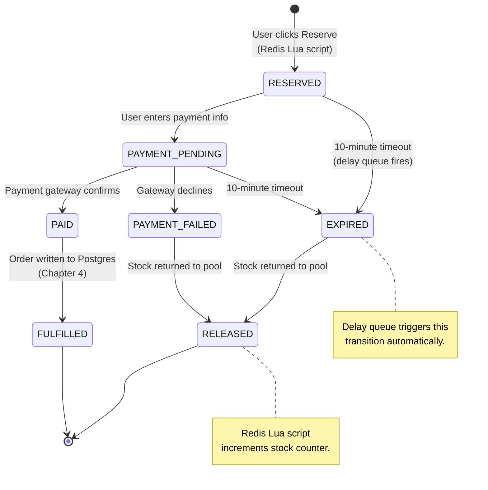
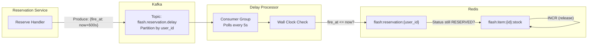
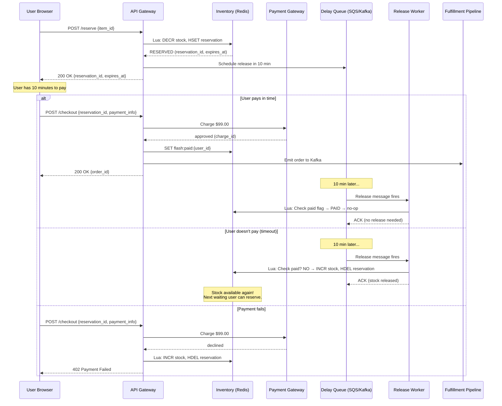
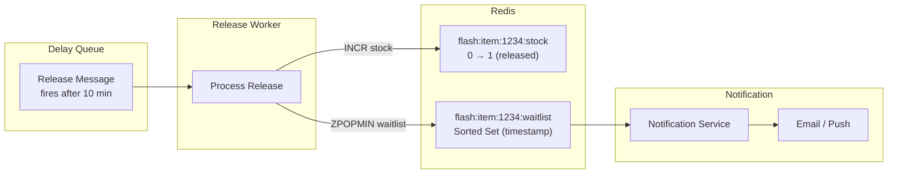

# 3. The Checkout State Machine 🟡

> **The Problem:** A user reserves a ticket at T+2 seconds but then gets distracted, changes their mind, or their payment fails. That reserved ticket is locked in limbo—it can't be sold to anyone else, but the original user may never pay. If 3,000 of the 10,000 reservations are abandoned, 3,000 real customers who wanted to buy are permanently locked out. We need a **distributed state machine** that tracks every reservation through its lifecycle and a **delay queue** that automatically releases abandoned reservations back to the pool after a configurable timeout.

---

## The Reservation Lifecycle

Every reservation passes through exactly one of these terminal states:



### State Transition Table

| Current State | Event | Next State | Side Effect |
|---|---|---|---|
| — | User reserves inventory | `RESERVED` | Redis `DECR` stock (Chapter 2) |
| `RESERVED` | User submits payment form | `PAYMENT_PENDING` | None (waiting for gateway) |
| `RESERVED` | 10 minutes elapse | `EXPIRED` | Delay queue fires release |
| `PAYMENT_PENDING` | Gateway returns `approved` | `PAID` | Emit to Kafka for fulfillment |
| `PAYMENT_PENDING` | Gateway returns `declined` | `PAYMENT_FAILED` | Trigger release |
| `PAYMENT_PENDING` | 10 minutes from reservation | `EXPIRED` | Delay queue fires release |
| `PAID` | Order written to DB | `FULFILLED` | Terminal state |
| `PAYMENT_FAILED` | — | `RELEASED` | Redis `INCR` stock |
| `EXPIRED` | — | `RELEASED` | Redis `INCR` stock |

---

## Why You Can't Use `sleep` or Cron

### Naive Approach: In-Process Timer

```rust,ignore
// ❌ NAIVE: Spawning a sleep timer for every reservation.
async fn reserve_with_timer(reservation_id: String) {
    // Reserve inventory...
    reserve_inventory(...).await;

    // Start a 10-minute timer in the same process.
    tokio::spawn(async move {
        tokio::time::sleep(Duration::from_secs(600)).await;
        release_if_not_paid(&reservation_id).await;
    });
}
```

**Problems:**

| Issue | Impact |
|---|---|
| Process crash | All in-flight timers are lost. Thousands of reservations become permanently locked. |
| Deployment/restart | Same as crash. Every deploy leaks reservations. |
| Memory | 50,000 tokio tasks × ~1 KB each = 50 MB just for sleeping. |
| No visibility | No way to inspect which timers are pending, how many, or when they fire. |

### Naive Approach: Cron Job

```rust,ignore
// ❌ NAIVE: Scan all reservations every minute.
// SELECT * FROM reservations WHERE status = 'RESERVED' AND created_at < NOW() - INTERVAL '10 minutes';
async fn cron_release_expired() {
    loop {
        tokio::time::sleep(Duration::from_secs(60)).await;
        let expired = db.query("SELECT ... WHERE status = 'RESERVED' AND ...").await;
        for r in expired {
            release_reservation(&r).await;
        }
    }
}
```

**Problems:**

| Issue | Impact |
|---|---|
| Latency | Up to 60-second delay before expired stock is released. |
| Database load | Full table scan of reservations every minute during peak. |
| No exactly-once | If the cron runs twice (duplicate pod), stock is released twice → double increment. |

---

## The Distributed Delay Queue

We need a **durable, exactly-once delay queue** that fires a release event exactly 10 minutes after each reservation. Two production-grade options:

### Option A: Kafka with Timestamp-Based Partitioning

Kafka doesn't natively support delayed delivery, but we can build it:



### Option B: AWS SQS with Visibility Timeout

SQS has native delay queues (up to 15 minutes):

```rust,ignore
use aws_sdk_sqs::Client as SqsClient;

/// Enqueue a delayed release message when a reservation is created.
async fn schedule_release(
    sqs: &SqsClient,
    queue_url: &str,
    reservation: &Reservation,
) -> Result<(), Box<dyn std::error::Error>> {
    let message_body = serde_json::to_string(reservation)?;

    sqs.send_message()
        .queue_url(queue_url)
        .message_body(message_body)
        .delay_seconds(600) // 10 minutes — SQS holds it invisibly.
        .message_group_id(&reservation.user_id) // FIFO: one per user.
        .message_deduplication_id(&reservation.reservation_id) // Exactly-once.
        .send()
        .await?;

    Ok(())
}
```

### Comparison: Kafka Delay vs. SQS

| Dimension | Kafka Delay Topic | AWS SQS Delay Queue |
|---|---|---|
| Max delay | Unlimited (application-level) | 15 minutes (native) |
| Exactly-once | Consumer offset commit | FIFO deduplication ID |
| Ordering guarantee | Per-partition | Per-message-group |
| Operational complexity | High (manage Kafka cluster) | Low (managed service) |
| Cost at 50K msgs/10min | ~$0 (self-hosted) | ~$0.02 |
| Visibility into queue depth | Kafka consumer lag metrics | CloudWatch `ApproximateNumberOfMessages` |

**Recommendation:** Use **SQS FIFO** if you're on AWS. Use **Kafka delay topic** if you already operate Kafka for the order fulfillment pipeline (Chapter 4).

---

## The Release Worker

The release worker consumes messages from the delay queue and atomically returns stock to the pool:

```rust,ignore
use redis::Script;

const LUA_RELEASE: &str = r#"
    -- Atomically release a reservation.
    -- Only release if the reservation still exists and status is NOT 'PAID'.
    -- KEYS[1] = flash:item:{item_id}:stock
    -- KEYS[2] = flash:item:{item_id}:reservations
    -- ARGV[1] = user_id
    --
    -- Returns: 1 = released, 0 = already paid/released (no-op)

    local reservation = redis.call('HGET', KEYS[2], ARGV[1])
    if reservation == false then
        return 0  -- Already released or never existed.
    end

    -- Check if user has already paid (Chapter 4 sets this flag).
    local paid = redis.call('GET', 'flash:paid:' .. ARGV[1])
    if paid then
        return 0  -- User paid. Do NOT release their inventory.
    end

    -- Release: increment stock and remove reservation.
    redis.call('INCR', KEYS[1])
    redis.call('HDEL', KEYS[2], ARGV[1])
    redis.call('DEL', 'flash:reservation:' .. ARGV[1])

    return 1
"#;

/// Process a single release message from the delay queue.
async fn process_release_message(
    redis: &mut redis::aio::MultiplexedConnection,
    message: &ReleaseMessage,
) -> ReleaseOutcome {
    let script = Script::new(LUA_RELEASE);

    let stock_key = format!("flash:item:{}:stock", message.item_id);
    let reservations_key = format!("flash:item:{}:reservations", message.item_id);

    let result: Result<i64, _> = script
        .key(&stock_key)
        .key(&reservations_key)
        .arg(&message.user_id)
        .invoke_async(redis)
        .await;

    match result {
        Ok(1) => {
            tracing::info!(
                user_id = %message.user_id,
                item_id = %message.item_id,
                "Released expired reservation — stock returned to pool"
            );
            ReleaseOutcome::Released
        }
        Ok(0) => {
            tracing::debug!(
                user_id = %message.user_id,
                "Reservation already paid or released — no-op"
            );
            ReleaseOutcome::AlreadyHandled
        }
        Ok(code) => {
            tracing::warn!(code, "Unexpected Lua return code");
            ReleaseOutcome::Error
        }
        Err(e) => {
            tracing::error!(error = %e, "Redis error during release");
            ReleaseOutcome::Error
        }
    }
}

#[derive(Debug)]
enum ReleaseOutcome {
    Released,
    AlreadyHandled,
    Error,
}
```

### The Critical Guard: Checking `paid` Before Releasing

Without the `paid` check, a race condition emerges:

```
T+9:59   User submits payment. Gateway processes it.
T+10:00  Delay queue fires. Release worker runs.
T+10:01  Payment gateway confirms "approved."
```

If the release worker doesn't check payment status, it releases inventory that was just paid for. The `flash:paid:{user_id}` key is set atomically by the payment confirmation handler *before* the order enters the fulfillment pipeline:

```rust,ignore
/// Called when the payment gateway webhook confirms a successful charge.
async fn handle_payment_confirmed(
    redis: &mut redis::aio::MultiplexedConnection,
    user_id: &str,
    reservation_id: &str,
) {
    // Set the paid flag FIRST — this prevents the release worker
    // from reclaiming the inventory.
    let _: () = redis::cmd("SET")
        .arg(format!("flash:paid:{user_id}"))
        .arg(reservation_id)
        .arg("EX")
        .arg(3600) // 1-hour TTL for cleanup
        .query_async(redis)
        .await
        .unwrap();

    // Now safe to emit to the fulfillment pipeline (Chapter 4).
    emit_to_fulfillment(user_id, reservation_id).await;
}
```

---

## The Full Checkout Saga

The checkout is a **distributed saga** — a sequence of compensating transactions across multiple services:



### Saga Compensation Table

| Step | Forward Action | Compensating Action | Trigger |
|---|---|---|---|
| 1. Reserve | `DECR` stock in Redis | `INCR` stock in Redis | Timeout or payment failure |
| 2. Charge | Debit card via gateway | Refund via gateway | Fulfillment failure |
| 3. Fulfill | Write order to Postgres | Cancel order + refund | (Rare — system error) |

---

## Implementing the State Machine in Rust

```rust,ignore
use serde::{Deserialize, Serialize};

#[derive(Debug, Clone, Serialize, Deserialize, PartialEq)]
enum CheckoutState {
    Reserved,
    PaymentPending,
    Paid,
    PaymentFailed,
    Expired,
    Released,
    Fulfilled,
}

#[derive(Debug, Clone, Serialize, Deserialize)]
enum CheckoutEvent {
    PaymentSubmitted { payment_method: String },
    PaymentApproved { charge_id: String },
    PaymentDeclined { reason: String },
    TimerExpired,
    InventoryReleased,
    OrderFulfilled { order_id: String },
}

impl CheckoutState {
    /// Pure function: given current state and event, return next state.
    /// Returns None if the transition is invalid.
    fn transition(&self, event: &CheckoutEvent) -> Option<CheckoutState> {
        match (self, event) {
            (CheckoutState::Reserved, CheckoutEvent::PaymentSubmitted { .. }) => {
                Some(CheckoutState::PaymentPending)
            }
            (CheckoutState::Reserved, CheckoutEvent::TimerExpired) => {
                Some(CheckoutState::Expired)
            }
            (CheckoutState::PaymentPending, CheckoutEvent::PaymentApproved { .. }) => {
                Some(CheckoutState::Paid)
            }
            (CheckoutState::PaymentPending, CheckoutEvent::PaymentDeclined { .. }) => {
                Some(CheckoutState::PaymentFailed)
            }
            (CheckoutState::PaymentPending, CheckoutEvent::TimerExpired) => {
                Some(CheckoutState::Expired)
            }
            (CheckoutState::Expired, CheckoutEvent::InventoryReleased) => {
                Some(CheckoutState::Released)
            }
            (CheckoutState::PaymentFailed, CheckoutEvent::InventoryReleased) => {
                Some(CheckoutState::Released)
            }
            (CheckoutState::Paid, CheckoutEvent::OrderFulfilled { .. }) => {
                Some(CheckoutState::Fulfilled)
            }
            // All other transitions are invalid.
            _ => None,
        }
    }

    fn is_terminal(&self) -> bool {
        matches!(self, CheckoutState::Released | CheckoutState::Fulfilled)
    }
}
```

### Persisting State Transitions

Every state transition is recorded as an **event** in a Redis Stream, providing an audit log:

```rust,ignore
/// Apply a state transition and record it in the event stream.
async fn apply_transition(
    redis: &mut redis::aio::MultiplexedConnection,
    reservation_id: &str,
    event: &CheckoutEvent,
) -> Result<CheckoutState, CheckoutError> {
    let state_key = format!("flash:checkout:{reservation_id}:state");
    let stream_key = format!("flash:checkout:{reservation_id}:events");

    // Read current state.
    let current_json: String = redis::cmd("GET")
        .arg(&state_key)
        .query_async(redis)
        .await
        .map_err(|_| CheckoutError::StateNotFound)?;
    let current: CheckoutState = serde_json::from_str(&current_json)
        .map_err(|_| CheckoutError::CorruptState)?;

    // Compute next state.
    let next = current
        .transition(event)
        .ok_or(CheckoutError::InvalidTransition {
            from: current.clone(),
            event: event.clone(),
        })?;

    // Persist atomically: update state + append event.
    let event_json = serde_json::to_string(event).unwrap();
    let next_json = serde_json::to_string(&next).unwrap();

    redis::pipe()
        .set(&state_key, &next_json)
        .cmd("XADD")
        .arg(&stream_key)
        .arg("*")
        .arg("event")
        .arg(&event_json)
        .arg("from")
        .arg(&serde_json::to_string(&current).unwrap())
        .arg("to")
        .arg(&next_json)
        .query_async(redis)
        .await
        .map_err(|e| CheckoutError::RedisError(e.to_string()))?;

    Ok(next)
}

#[derive(Debug)]
enum CheckoutError {
    StateNotFound,
    CorruptState,
    InvalidTransition {
        from: CheckoutState,
        event: CheckoutEvent,
    },
    RedisError(String),
}
```

---

## Handling the Re-Queue: Released Stock Goes Back to Waitlisted Users

When reservations expire and stock is released, waitlisted users (those who were told "Sold Out") can now purchase. The system notifies them:



```rust,ignore
/// After releasing stock, notify the next waitlisted user.
async fn notify_waitlisted_user(
    redis: &mut redis::aio::MultiplexedConnection,
    item_id: &str,
) {
    let waitlist_key = format!("flash:item:{item_id}:waitlist");

    // Pop the earliest waitlisted user (lowest timestamp score).
    let result: Option<(String, f64)> = redis::cmd("ZPOPMIN")
        .arg(&waitlist_key)
        .query_async(redis)
        .await
        .unwrap_or(None);

    if let Some((user_id, _timestamp)) = result {
        // Send push notification / email.
        send_notification(
            &user_id,
            "A ticket just became available! You have 2 minutes to reserve it.",
        ).await;

        // Give them a 2-minute exclusive window.
        let _: () = redis::cmd("SET")
            .arg(format!("flash:item:{item_id}:hold:{user_id}"))
            .arg("active")
            .arg("EX")
            .arg(120) // 2-minute hold
            .query_async(redis)
            .await
            .unwrap();
    }
}
```

---

## Monitoring the Checkout Pipeline

During a live flash sale, ops needs real-time visibility into the state machine distribution:

```rust,ignore
#[derive(Debug, Serialize)]
struct CheckoutMetrics {
    reserved: u64,
    payment_pending: u64,
    paid: u64,
    payment_failed: u64,
    expired: u64,
    released: u64,
    fulfilled: u64,
    avg_time_to_payment_secs: f64,
    abandonment_rate_percent: f64,
}
```

Key metrics to alert on:

| Metric | Healthy | Alert Threshold | Action |
|---|---|---|---|
| `expired / reserved` (abandonment rate) | < 20% | > 40% | Check if payment page is broken |
| `payment_failed / payment_pending` (decline rate) | < 5% | > 15% | Check payment gateway health |
| Avg time from `RESERVED` → `PAID` | ~3 minutes | > 8 minutes | Users struggling with checkout UX |
| Release queue depth | ~0 | > 1,000 backed up | Release worker crashed or stuck |

---

## Idempotency: Handling Duplicate Messages

Both the delay queue and payment webhooks can deliver messages more than once. Every handler must be **idempotent**:

```rust,ignore
/// Idempotent release: calling this 5 times has the same effect as calling it once.
/// The Lua script checks if the reservation exists before incrementing stock.
/// If already released → returns 0 → no stock change.
///
/// Idempotent payment confirmation: the `flash:paid:{user_id}` SET is idempotent.
/// Setting the same key twice with the same value has no side effect.
///
/// Idempotent state transition: apply_transition() reads current state first.
/// If the state has already advanced past the event, it returns InvalidTransition,
/// and the handler logs and ACKs the duplicate message.
```

### The Idempotency Key Pattern

For payment webhooks, the payment gateway sends a unique `charge_id`. We use it as an idempotency key:

```rust,ignore
async fn handle_payment_webhook(
    redis: &mut redis::aio::MultiplexedConnection,
    webhook: &PaymentWebhook,
) -> Result<(), WebhookError> {
    // Check if we've already processed this charge_id.
    let dedup_key = format!("flash:webhook:processed:{}", webhook.charge_id);
    let already_processed: bool = redis::cmd("SET")
        .arg(&dedup_key)
        .arg("1")
        .arg("NX")     // Only set if not exists.
        .arg("EX")
        .arg(86400)     // 24-hour TTL.
        .query_async(redis)
        .await
        .unwrap_or(false);

    if !already_processed {
        tracing::info!(charge_id = %webhook.charge_id, "Duplicate webhook — ignoring");
        return Ok(());
    }

    // First time seeing this charge_id — process it.
    match webhook.status.as_str() {
        "approved" => {
            handle_payment_confirmed(redis, &webhook.user_id, &webhook.reservation_id).await;
        }
        "declined" => {
            release_reservation(redis, &webhook.user_id, &webhook.item_id).await;
        }
        status => {
            tracing::warn!(status, "Unknown payment webhook status");
        }
    }

    Ok(())
}
```

---

> **Key Takeaways**
>
> 1. **In-process timers die with the process.** Never use `tokio::time::sleep` for business-critical timeouts. Use a durable delay queue (SQS, Kafka, or Redis Streams with consumer groups).
> 2. **The checkout is a state machine, not a REST call.** Model every state and every transition explicitly. Invalid transitions are bugs—catch them at compile time with exhaustive matching.
> 3. **Always check `paid` before releasing.** The delay queue fires at T+10 minutes regardless of payment status. The release script must be a no-op if the user has already paid.
> 4. **Every handler must be idempotent.** Delay queues and webhooks deliver at-least-once. Use idempotency keys (`SET ... NX`) to ensure exactly-once processing semantics.
> 5. **Released stock re-enters the pool.** Notify waitlisted users and give them an exclusive reservation window to prevent another thundering herd.
> 6. **The saga pattern coordinates compensating actions.** If payment fails → release inventory. If fulfillment fails → refund + release. Each step has a well-defined undo.
