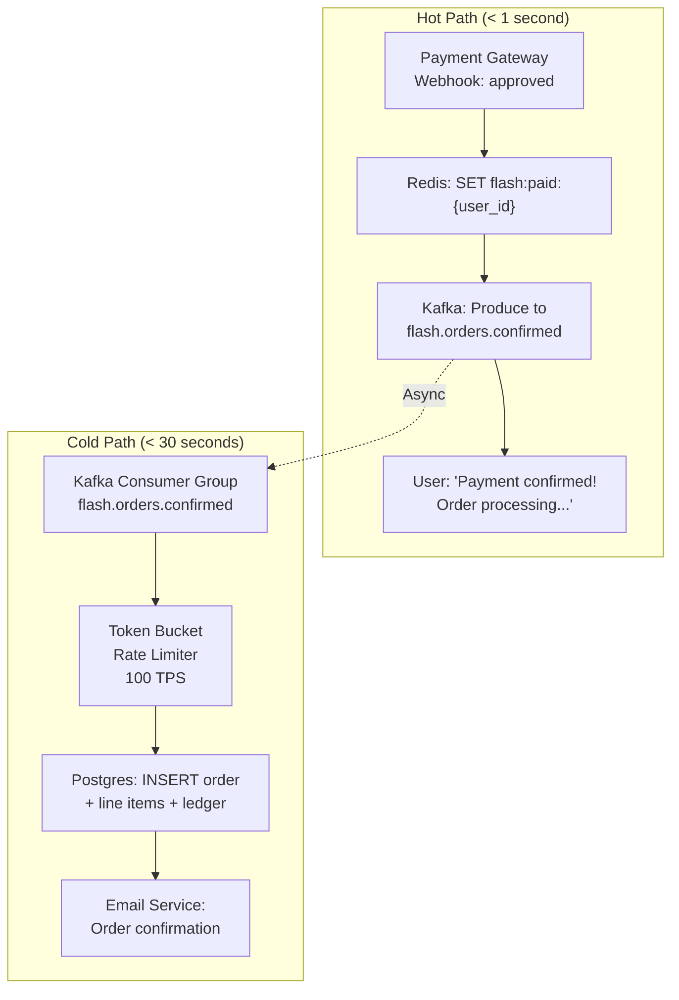
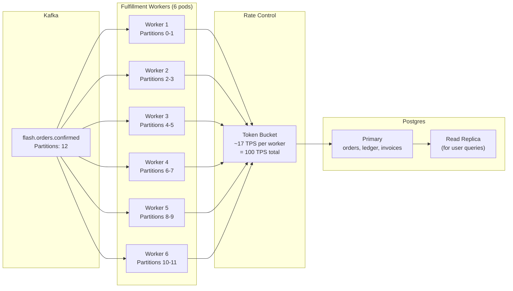
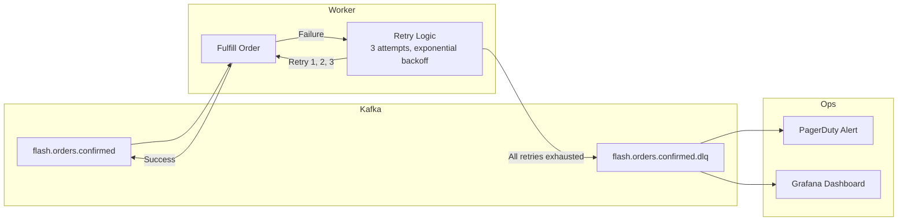

# 4. Asynchronous Order Fulfillment 🔴

> **The Problem:** The payment gateway has confirmed 10,000 charges in under 60 seconds. Now we need to create 10,000 order records in Postgres—each with line items, a ledger entry, an invoice, and an email confirmation. If we write all 10,000 orders synchronously in the payment webhook handler, the database absorbs 10,000 `INSERT` transactions in a burst, causing WAL (Write-Ahead Log) pressure, checkpoint storms, replication lag, and potentially crashing the primary. We must **decouple payment confirmation from order creation** using a durable message broker, then drain the queue into Postgres at a safe, controlled TPS.

---

## Why Synchronous Writes Are Dangerous

### The Anatomy of a Single Order Write

Each order creation involves multiple tables:

```sql
BEGIN;
INSERT INTO orders (id, user_id, sale_id, total, status, created_at) VALUES (...);
INSERT INTO order_items (order_id, item_id, quantity, price) VALUES (...);
INSERT INTO ledger_entries (order_id, debit_account, credit_account, amount) VALUES (...);
INSERT INTO invoices (order_id, pdf_url, created_at) VALUES (...);
COMMIT;
```

| Operation | Cost |
|---|---|
| 4 `INSERT` statements | 4 B-Tree index updates per table |
| WAL write | ~2 KB per transaction |
| `fsync` on `COMMIT` | ~0.5 ms (NVMe) to ~5 ms (EBS gp3) |
| Total per order | ~3–8 ms |

At 10,000 orders in 60 seconds:

| Metric | Synchronous Burst | Controlled Drain (100 TPS) |
|---|---|---|
| Peak write TPS | 10,000 (instantaneous) | 100 (steady) |
| WAL generation rate | ~20 MB/sec burst | ~0.2 MB/sec |
| Connection pool usage | 10,000 concurrent (💀) | 10 concurrent |
| Replication lag | Spikes to minutes | < 1 second |
| Checkpoint storm risk | **High** | None |
| Time to complete | ~60 seconds (if DB survives) | ~100 seconds |

The 40-second difference in completion time is irrelevant—the user already has their payment confirmation. The order record can arrive in their account asynchronously.



---

## The Order Event Schema

The Kafka message is the **contract** between the payment path and the fulfillment path:

```rust,ignore
use serde::{Deserialize, Serialize};
use uuid::Uuid;

/// The event produced after a payment is confirmed.
/// This is the ONLY input to the fulfillment pipeline.
#[derive(Debug, Clone, Serialize, Deserialize)]
struct OrderConfirmedEvent {
    /// Unique event ID for idempotency.
    event_id: String,
    /// The reservation that was paid.
    reservation_id: String,
    /// User who made the purchase.
    user_id: String,
    /// Flash sale identifier.
    sale_id: String,
    /// Items purchased.
    items: Vec<OrderItem>,
    /// Payment details.
    payment: PaymentDetails,
    /// When the payment was confirmed (Unix timestamp).
    confirmed_at: u64,
}

#[derive(Debug, Clone, Serialize, Deserialize)]
struct OrderItem {
    item_id: String,
    name: String,
    quantity: u32,
    unit_price_cents: u64,
}

#[derive(Debug, Clone, Serialize, Deserialize)]
struct PaymentDetails {
    charge_id: String,
    payment_method: String,
    amount_cents: u64,
    currency: String,
}
```

### Producing the Event

```rust,ignore
use rdkafka::producer::{FutureProducer, FutureRecord};
use std::time::Duration;

/// Called immediately after the payment gateway confirms.
/// This is the boundary between the hot path and the cold path.
async fn emit_order_confirmed(
    producer: &FutureProducer,
    event: &OrderConfirmedEvent,
) -> Result<(), FulfillmentError> {
    let payload = serde_json::to_string(event)
        .map_err(|e| FulfillmentError::Serialization(e.to_string()))?;

    // Partition by user_id for ordering guarantees per user.
    let record = FutureRecord::to("flash.orders.confirmed")
        .key(&event.user_id)
        .payload(&payload)
        .headers(rdkafka::message::OwnedHeaders::new()
            .insert(rdkafka::message::Header {
                key: "event_id",
                value: Some(event.event_id.as_bytes()),
            })
            .insert(rdkafka::message::Header {
                key: "event_type",
                value: Some(b"OrderConfirmed"),
            })
        );

    producer
        .send(record, Duration::from_secs(5))
        .await
        .map_err(|(e, _)| FulfillmentError::KafkaProduceError(e.to_string()))?;

    tracing::info!(
        event_id = %event.event_id,
        user_id = %event.user_id,
        "Order confirmed event emitted to Kafka"
    );

    Ok(())
}

#[derive(Debug)]
enum FulfillmentError {
    Serialization(String),
    KafkaProduceError(String),
    DatabaseError(String),
    DuplicateEvent(String),
}
```

---

## The Fulfillment Worker

The fulfillment worker is a Rust service that consumes from Kafka and writes to Postgres at a controlled rate:



### Token Bucket Rate Limiter

```rust,ignore
use std::sync::Arc;
use tokio::sync::Semaphore;
use tokio::time::{self, Duration};

/// A token-bucket rate limiter that caps the number of DB writes per second.
struct RateLimiter {
    semaphore: Arc<Semaphore>,
}

impl RateLimiter {
    /// Creates a rate limiter that allows `rate` operations per second.
    fn new(rate: u32) -> Self {
        let semaphore = Arc::new(Semaphore::new(0)); // Start empty.
        let sem_clone = semaphore.clone();

        // Background task: add `rate` permits every second.
        tokio::spawn(async move {
            let mut interval = time::interval(Duration::from_secs(1));
            loop {
                interval.tick().await;
                // Add tokens up to the rate limit.
                let current = sem_clone.available_permits();
                let to_add = (rate as usize).saturating_sub(current);
                sem_clone.add_permits(to_add);
            }
        });

        Self { semaphore }
    }

    /// Blocks until a token is available.
    async fn acquire(&self) {
        let permit = self.semaphore.acquire().await.unwrap();
        permit.forget(); // Consume the token.
    }
}
```

### The Consumer Loop

```rust,ignore
use rdkafka::consumer::{Consumer, StreamConsumer};
use rdkafka::message::Message;
use sqlx::PgPool;

/// Main fulfillment worker loop.
async fn run_fulfillment_worker(
    consumer: StreamConsumer,
    db: PgPool,
    rate_limiter: RateLimiter,
) {
    loop {
        match consumer.recv().await {
            Ok(msg) => {
                let payload = match msg.payload_view::<str>() {
                    Some(Ok(text)) => text,
                    _ => {
                        tracing::warn!("Skipping message with invalid payload");
                        continue;
                    }
                };

                let event: OrderConfirmedEvent = match serde_json::from_str(payload) {
                    Ok(e) => e,
                    Err(e) => {
                        tracing::error!(error = %e, "Failed to deserialize order event");
                        // Dead-letter this message.
                        send_to_dlq(&msg).await;
                        continue;
                    }
                };

                // Rate limit: wait for a token before writing to Postgres.
                rate_limiter.acquire().await;

                // Process with idempotency.
                match fulfill_order(&db, &event).await {
                    Ok(()) => {
                        tracing::info!(
                            event_id = %event.event_id,
                            "Order fulfilled successfully"
                        );
                    }
                    Err(FulfillmentError::DuplicateEvent(id)) => {
                        tracing::info!(event_id = %id, "Duplicate event — skipping");
                    }
                    Err(e) => {
                        tracing::error!(error = ?e, "Fulfillment failed — will retry");
                        // Don't commit offset. Kafka will redeliver.
                        continue;
                    }
                }

                // Commit offset only after successful processing.
                if let Err(e) = consumer.commit_message(&msg, rdkafka::consumer::CommitMode::Async) {
                    tracing::error!(error = %e, "Failed to commit Kafka offset");
                }
            }
            Err(e) => {
                tracing::error!(error = %e, "Kafka consumer error");
                time::sleep(Duration::from_secs(1)).await;
            }
        }
    }
}
```

---

## Writing the Order to Postgres

The order write is a single **atomic transaction** across four tables:

```rust,ignore
use sqlx::PgPool;

/// Idempotent order creation. Uses event_id as the idempotency key.
async fn fulfill_order(
    db: &PgPool,
    event: &OrderConfirmedEvent,
) -> Result<(), FulfillmentError> {
    let mut tx = db.begin().await
        .map_err(|e| FulfillmentError::DatabaseError(e.to_string()))?;

    // Idempotency check: has this event already been processed?
    let exists: bool = sqlx::query_scalar(
        "SELECT EXISTS(SELECT 1 FROM processed_events WHERE event_id = $1)"
    )
    .bind(&event.event_id)
    .fetch_one(&mut *tx)
    .await
    .map_err(|e| FulfillmentError::DatabaseError(e.to_string()))?;

    if exists {
        return Err(FulfillmentError::DuplicateEvent(event.event_id.clone()));
    }

    // 1. Insert order.
    let order_id = uuid::Uuid::new_v4().to_string();
    sqlx::query(
        r#"INSERT INTO orders (id, user_id, sale_id, total_cents, status, created_at)
           VALUES ($1, $2, $3, $4, 'confirmed', NOW())"#
    )
    .bind(&order_id)
    .bind(&event.user_id)
    .bind(&event.sale_id)
    .bind(event.payment.amount_cents as i64)
    .execute(&mut *tx)
    .await
    .map_err(|e| FulfillmentError::DatabaseError(e.to_string()))?;

    // 2. Insert order items.
    for item in &event.items {
        sqlx::query(
            r#"INSERT INTO order_items (order_id, item_id, name, quantity, unit_price_cents)
               VALUES ($1, $2, $3, $4, $5)"#
        )
        .bind(&order_id)
        .bind(&item.item_id)
        .bind(&item.name)
        .bind(item.quantity as i32)
        .bind(item.unit_price_cents as i64)
        .execute(&mut *tx)
        .await
        .map_err(|e| FulfillmentError::DatabaseError(e.to_string()))?;
    }

    // 3. Insert double-entry ledger entries.
    sqlx::query(
        r#"INSERT INTO ledger_entries (order_id, debit_account, credit_account, amount_cents, created_at)
           VALUES ($1, 'accounts_receivable', 'revenue', $2, NOW())"#
    )
    .bind(&order_id)
    .bind(event.payment.amount_cents as i64)
    .execute(&mut *tx)
    .await
    .map_err(|e| FulfillmentError::DatabaseError(e.to_string()))?;

    // 4. Record the processed event for idempotency.
    sqlx::query(
        "INSERT INTO processed_events (event_id, processed_at) VALUES ($1, NOW())"
    )
    .bind(&event.event_id)
    .execute(&mut *tx)
    .await
    .map_err(|e| FulfillmentError::DatabaseError(e.to_string()))?;

    // Atomic commit — all 4 inserts succeed or none do.
    tx.commit().await
        .map_err(|e| FulfillmentError::DatabaseError(e.to_string()))?;

    // 5. Send confirmation email (outside the transaction — fire and forget).
    tokio::spawn(send_order_confirmation_email(
        event.user_id.clone(),
        order_id.clone(),
    ));

    Ok(())
}
```

### The processed_events Table

```sql
CREATE TABLE processed_events (
    event_id  TEXT PRIMARY KEY,
    processed_at TIMESTAMPTZ NOT NULL DEFAULT NOW()
);

-- Index for TTL cleanup (delete events older than 7 days).
CREATE INDEX idx_processed_events_time ON processed_events (processed_at);
```

This table serves as the **idempotency ledger**. If Kafka redelivers an event (consumer restart, rebalance), the `EXISTS` check prevents double-writes.

---

## Dead Letter Queue (DLQ)

Messages that fail after multiple retries are sent to a dead-letter topic for manual investigation:



```rust,ignore
const MAX_RETRIES: u32 = 3;

/// Retry wrapper with exponential backoff.
async fn fulfill_with_retry(
    db: &PgPool,
    event: &OrderConfirmedEvent,
) -> Result<(), FulfillmentError> {
    let mut attempts = 0;

    loop {
        match fulfill_order(db, event).await {
            Ok(()) => return Ok(()),
            Err(FulfillmentError::DuplicateEvent(id)) => {
                return Err(FulfillmentError::DuplicateEvent(id));
            }
            Err(e) => {
                attempts += 1;
                if attempts >= MAX_RETRIES {
                    tracing::error!(
                        event_id = %event.event_id,
                        attempts,
                        error = ?e,
                        "All retries exhausted — sending to DLQ"
                    );
                    return Err(e);
                }
                let backoff = Duration::from_millis(100 * 2u64.pow(attempts));
                tracing::warn!(
                    event_id = %event.event_id,
                    attempt = attempts,
                    backoff_ms = backoff.as_millis(),
                    "Retrying fulfillment"
                );
                tokio::time::sleep(backoff).await;
            }
        }
    }
}
```

---

## Postgres Schema for the Order Pipeline

```sql
-- Core order tables.
CREATE TABLE orders (
    id          TEXT PRIMARY KEY,
    user_id     TEXT NOT NULL,
    sale_id     TEXT NOT NULL,
    total_cents BIGINT NOT NULL,
    status      TEXT NOT NULL DEFAULT 'confirmed',
    created_at  TIMESTAMPTZ NOT NULL DEFAULT NOW()
);

CREATE TABLE order_items (
    id              BIGSERIAL PRIMARY KEY,
    order_id        TEXT NOT NULL REFERENCES orders(id),
    item_id         TEXT NOT NULL,
    name            TEXT NOT NULL,
    quantity        INT NOT NULL,
    unit_price_cents BIGINT NOT NULL
);

CREATE TABLE ledger_entries (
    id              BIGSERIAL PRIMARY KEY,
    order_id        TEXT NOT NULL REFERENCES orders(id),
    debit_account   TEXT NOT NULL,
    credit_account  TEXT NOT NULL,
    amount_cents    BIGINT NOT NULL,
    created_at      TIMESTAMPTZ NOT NULL DEFAULT NOW()
);

-- Idempotency table.
CREATE TABLE processed_events (
    event_id     TEXT PRIMARY KEY,
    processed_at TIMESTAMPTZ NOT NULL DEFAULT NOW()
);

-- Indexes for common queries.
CREATE INDEX idx_orders_user ON orders (user_id);
CREATE INDEX idx_orders_sale ON orders (sale_id);
CREATE INDEX idx_order_items_order ON order_items (order_id);
CREATE INDEX idx_ledger_order ON ledger_entries (order_id);
```

---

## Monitoring the Fulfillment Pipeline

```rust,ignore
use prometheus::{IntCounter, IntGauge, Histogram};

lazy_static::lazy_static! {
    static ref ORDERS_FULFILLED: IntCounter = IntCounter::new(
        "flash_orders_fulfilled_total",
        "Total orders written to Postgres"
    ).unwrap();

    static ref ORDERS_FAILED: IntCounter = IntCounter::new(
        "flash_orders_failed_total",
        "Total orders that failed all retries"
    ).unwrap();

    static ref KAFKA_LAG: IntGauge = IntGauge::new(
        "flash_kafka_consumer_lag",
        "Messages behind in the flash.orders.confirmed topic"
    ).unwrap();

    static ref FULFILLMENT_LATENCY: Histogram = Histogram::with_opts(
        prometheus::HistogramOpts::new(
            "flash_fulfillment_latency_seconds",
            "Time from payment confirmation to order record in Postgres"
        ).buckets(vec![0.1, 0.5, 1.0, 5.0, 10.0, 30.0, 60.0])
    ).unwrap();
}
```

| Metric | Alert Threshold | Meaning |
|---|---|---|
| `flash_kafka_consumer_lag` | > 5,000 | Workers can't keep up. Scale up pods or increase TPS limit. |
| `flash_orders_failed_total` | > 0 | Check DLQ. Possible schema issue or DB connection failure. |
| `flash_fulfillment_latency_seconds` p99 | > 30s | User is waiting too long for their order confirmation email. |
| Postgres replication lag | > 5s | Read replicas serving stale data. Reduce write TPS. |

---

## Scaling the Pipeline

### Vertical: Increase TPS Per Worker

Tune the token bucket rate from 17 TPS to 50 TPS per worker. Monitor Postgres replication lag as the primary indicator.

### Horizontal: Add More Kafka Partitions and Workers

| Kafka Partitions | Workers | TPS per Worker | Total TPS | Time for 10K orders |
|---|---|---|---|---|
| 6 | 6 | 17 | 100 | 100s |
| 12 | 12 | 17 | 200 | 50s |
| 24 | 24 | 17 | 400 | 25s |

The bottleneck shifts to Postgres write capacity. A single Postgres primary on an `r6g.2xlarge` (8 vCPU, 64 GB) can sustain ~500 TPS of multi-table inserts before WAL pressure becomes a concern.

### Batch Inserts

For even higher throughput, batch multiple orders into a single transaction:

```rust,ignore
/// Batch-insert up to `batch_size` orders in a single transaction.
/// Reduces per-transaction overhead (TCP round-trips, fsync count).
async fn fulfill_batch(
    db: &PgPool,
    events: &[OrderConfirmedEvent],
) -> Result<(), FulfillmentError> {
    let mut tx = db.begin().await
        .map_err(|e| FulfillmentError::DatabaseError(e.to_string()))?;

    for event in events {
        // Idempotency check per event.
        let exists: bool = sqlx::query_scalar(
            "SELECT EXISTS(SELECT 1 FROM processed_events WHERE event_id = $1)"
        )
        .bind(&event.event_id)
        .fetch_one(&mut *tx)
        .await
        .map_err(|e| FulfillmentError::DatabaseError(e.to_string()))?;

        if exists { continue; } // Skip duplicates within the batch.

        // Insert order, items, ledger (same as single-order path).
        insert_order(&mut tx, event).await?;
    }

    tx.commit().await
        .map_err(|e| FulfillmentError::DatabaseError(e.to_string()))?;

    Ok(())
}
```

| Approach | Transactions | `fsync` calls | Overhead |
|---|---|---|---|
| Single-order | 10,000 | 10,000 | High |
| Batch of 50 | 200 | 200 | **Low** |

---

## Reconciliation: The Safety Net

After the flash sale, a reconciliation job verifies consistency across all layers:

```rust,ignore
/// Post-sale reconciliation — runs 1 hour after the event.
async fn reconcile_flash_sale(
    redis: &mut redis::aio::MultiplexedConnection,
    db: &PgPool,
    sale_id: &str,
) -> ReconciliationReport {
    // Count: orders in Postgres.
    let db_orders: i64 = sqlx::query_scalar(
        "SELECT COUNT(*) FROM orders WHERE sale_id = $1"
    )
    .bind(sale_id)
    .fetch_one(db)
    .await
    .unwrap();

    // Count: paid flags in Redis.
    let redis_paid: i64 = redis::cmd("KEYS")
        .arg("flash:paid:*")
        .query_async::<Vec<String>>(redis)
        .await
        .map(|keys| keys.len() as i64)
        .unwrap_or(0);

    // Count: remaining stock in Redis.
    let remaining_stock: i64 = redis::cmd("GET")
        .arg(format!("flash:item:{sale_id}:stock"))
        .query_async(redis)
        .await
        .unwrap_or(0);

    // Count: active reservations still in Redis.
    let active_reservations: i64 = redis::cmd("HLEN")
        .arg(format!("flash:item:{sale_id}:reservations"))
        .query_async(redis)
        .await
        .unwrap_or(0);

    let initial_stock = 10_000i64; // From config.

    let report = ReconciliationReport {
        sale_id: sale_id.to_string(),
        initial_stock,
        remaining_stock,
        active_reservations,
        redis_paid_count: redis_paid,
        postgres_order_count: db_orders,
        // The fundamental invariant:
        // initial_stock = remaining_stock + active_reservations + db_orders
        is_consistent: initial_stock == remaining_stock + active_reservations + db_orders,
    };

    if !report.is_consistent {
        tracing::error!(?report, "RECONCILIATION MISMATCH — manual investigation required");
    } else {
        tracing::info!(?report, "Reconciliation passed ✓");
    }

    report
}

#[derive(Debug, Serialize)]
struct ReconciliationReport {
    sale_id: String,
    initial_stock: i64,
    remaining_stock: i64,
    active_reservations: i64,
    redis_paid_count: i64,
    postgres_order_count: i64,
    is_consistent: bool,
}
```

### The Fundamental Invariant

$$\text{initial\_stock} = \text{remaining\_stock} + \text{active\_reservations} + \text{fulfilled\_orders}$$

If this equation doesn't hold, we have either an over-sell (right side > left) or a leak (right side < left). The reconciliation report pinpoints which layer is inconsistent.

---

> **Key Takeaways**
>
> 1. **Decouple payment from fulfillment.** The user doesn't care if their order record exists in Postgres immediately. They care that their payment was confirmed. Write the order asynchronously.
> 2. **Rate-limit writes to Postgres.** A token-bucket limiter prevents WAL pressure, checkpoint storms, and replication lag. 100 TPS is plenty for 10,000 orders.
> 3. **Idempotency is non-negotiable.** Kafka delivers at-least-once. The `processed_events` table ensures each order is created exactly once, even after consumer restarts and rebalances.
> 4. **Dead-letter queues catch poison pills.** Messages that fail all retries go to the DLQ for manual investigation, not back into the main queue forever.
> 5. **Batch inserts reduce `fsync` overhead.** Grouping 50 orders per transaction reduces WAL writes 50× and is safe because each order is independently idempotent.
> 6. **Reconciliation is the safety net.** After the sale, verify the invariant: `initial_stock = remaining + reserved + fulfilled`. A mismatch triggers immediate investigation.
