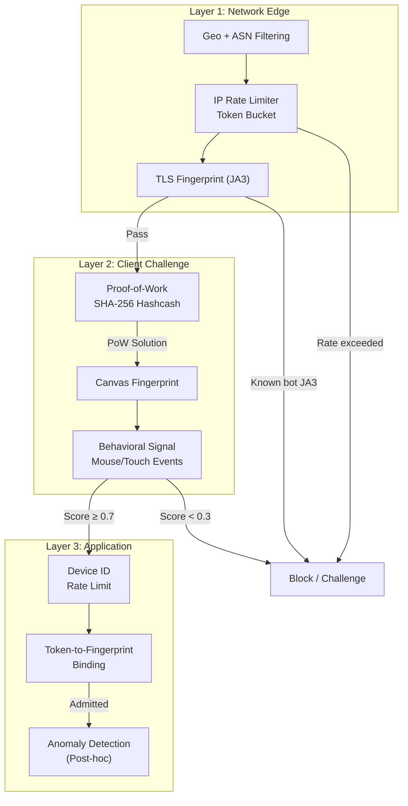
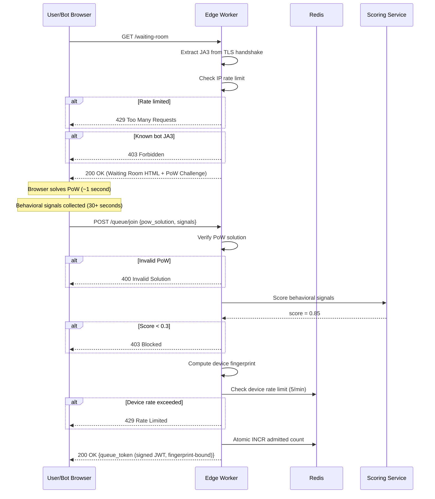

# 5. Preventing Bots and Scalpers 🔴

> **The Problem:** Within minutes of announcing a flash sale, scalper networks deploy thousands of headless Chrome instances, custom HTTP clients, and residential proxy farms to grab every available unit. A single scalper operation can control 500+ browser sessions, each with a unique IP address, solving CAPTCHAs via human CAPTCHA farms (at $2 per 1,000 solves). If we rely only on traditional CAPTCHAs and IP rate-limiting, bots will claim 80%+ of inventory before real humans finish loading the page. We need a **multi-layered defense** that increases the computational cost for bots while remaining invisible to legitimate users.

---

## The Bot Economics

Understanding the attacker's cost model reveals where to apply pressure:

| Resource | Legitimate User | Scalper Bot |
|---|---|---|
| Browser sessions | 1 | 500+ |
| IP addresses | 1 (home ISP) | 500+ (residential proxies, ~$5/GB) |
| Devices | 1 (phone/laptop) | 500 VMs |
| CAPTCHA solving | Self (free, 3 seconds) | Human farm ($2/1K, 15 seconds) |
| TLS fingerprint | Unique to browser | Identical across fleet (or spoofed) |
| CPU budget per session | Unlimited (one tab) | Constrained (500 tabs × CPU cost) |

The goal is to make the **per-session cost for bots** exceed the **resale profit margin**. If a concert ticket's resale premium is $50, and we force each bot session to spend $0.20 in compute, a 500-session operation costs $100—eroding much of the profit.

---

## Defense Layer Architecture



---

## Layer 1: TLS Fingerprinting (JA3)

### What Is JA3?

When a client initiates a TLS handshake, the ClientHello message reveals:
- Supported TLS versions
- Cipher suites (in order)
- Extensions (in order)
- Elliptic curves and point formats

The **JA3 fingerprint** is an MD5 hash of these fields concatenated. It uniquely identifies the TLS library—not the user, but the *software making the connection*.

```
Chrome 120 on macOS:    ja3 = "771,4865-4866-4867-49195...,0-23-65281..."
                        → md5 = "b32309a26951912be7dba376398abc3b"

Python requests 2.31:   ja3 = "771,4866-4867-4865-49196...,0-23-65281..."
                        → md5 = "473cd7cb9faa642487833865d516e578"

Go net/http:            ja3 = "771,4865-4867-4866-49196...,0-10-11..."
                        → md5 = "19e29534fd49dd27d09234e639c4057e"
```

### Using JA3 at the Edge

```rust,ignore
use std::collections::HashSet;

/// Known bot TLS fingerprints — maintained by threat intelligence.
/// These are JA3 hashes of common automation libraries.
fn known_bot_fingerprints() -> HashSet<&'static str> {
    let mut set = HashSet::new();

    // Python requests / urllib3
    set.insert("473cd7cb9faa642487833865d516e578");
    // Go net/http default
    set.insert("19e29534fd49dd27d09234e639c4057e");
    // Node.js undici / fetch
    set.insert("eb1d94daa7e0344b2567571d32a03f25");
    // curl (default OpenSSL)
    set.insert("456523fc94726331a4d5a2e1d40b2cd7");
    // Selenium ChromeDriver (identifiable mismatch)
    set.insert("a0e9f5d64349fb13191bc781f81f42e1");

    set
}

#[derive(Debug, Clone)]
enum Ja3Verdict {
    KnownBrowser,       // Chrome, Firefox, Safari — allow
    KnownBot,           // Python, Go, curl — block or challenge
    Unknown,            // New fingerprint — elevated scrutiny
    SpoofedMismatch,    // Claims Chrome UA but has Go JA3 — block
}

fn classify_ja3(
    ja3_hash: &str,
    user_agent: &str,
) -> Ja3Verdict {
    let bots = known_bot_fingerprints();

    if bots.contains(ja3_hash) {
        return Ja3Verdict::KnownBot;
    }

    // Cross-reference: if UA says Chrome but JA3 doesn't match any Chrome fingerprint.
    if user_agent.contains("Chrome/") && !is_chrome_ja3(ja3_hash) {
        return Ja3Verdict::SpoofedMismatch;
    }

    if is_known_browser_ja3(ja3_hash) {
        Ja3Verdict::KnownBrowser
    } else {
        Ja3Verdict::Unknown
    }
}
```

### Limitations

Sophisticated bots use **real browser engines** (Playwright, Puppeteer) that produce valid Chrome JA3 fingerprints. JA3 alone catches only low-effort bots (~60% of bot traffic). It's a fast, cheap first filter—not a complete solution.

---

## Layer 2: Proof-of-Work (PoW) Challenge

### The Hashcash Concept

Before issuing a queue token (Chapter 1), the server issues a **computational puzzle**. The client must find a nonce such that:

$$\text{SHA-256}(\text{challenge} \| \text{nonce}) < \text{target}$$

where `target` defines the difficulty. A difficulty of 20 bits means the client must compute ~$2^{20}$ (~1 million) SHA-256 hashes, taking:
- **A human's browser:** ~0.5–2 seconds (WebCrypto API, single-threaded)
- **A bot controlling 500 sessions:** ~250–1,000 CPU-seconds of work per batch

### Server: Issue Challenge

```rust,ignore
use rand::Rng;
use sha2::{Sha256, Digest};

#[derive(Debug, Serialize, Deserialize)]
struct PowChallenge {
    /// Random challenge bytes (hex-encoded).
    challenge: String,
    /// Number of leading zero bits required in the hash.
    difficulty: u32,
    /// Challenge expires after this timestamp.
    expires_at: u64,
    /// Signed by server to prevent forged challenges.
    signature: String,
}

const POW_DIFFICULTY: u32 = 20; // ~1M hashes, ~1 second on modern hardware.
const POW_TTL_SECS: u64 = 120; // Challenge valid for 2 minutes.

fn issue_pow_challenge(hmac_key: &[u8], now: u64) -> PowChallenge {
    let mut rng = rand::thread_rng();
    let challenge_bytes: [u8; 16] = rng.gen();
    let challenge = hex::encode(challenge_bytes);
    let expires_at = now + POW_TTL_SECS;

    // Sign the challenge to prevent forgery.
    let msg = format!("{challenge}:{difficulty}:{expires_at}", difficulty = POW_DIFFICULTY);
    let signature = hmac_sign(hmac_key, msg.as_bytes());

    PowChallenge {
        challenge,
        difficulty: POW_DIFFICULTY,
        expires_at,
        signature,
    }
}
```

### Client: Solve Challenge (JavaScript)

```javascript
// Runs in the user's browser while they wait in the queue.
// Uses the SubtleCrypto API for hardware-accelerated SHA-256.
async function solvePoW(challenge, difficulty) {
    const target = BigInt(1) << BigInt(256 - difficulty);
    const encoder = new TextEncoder();
    let nonce = 0;

    while (true) {
        const data = encoder.encode(challenge + nonce.toString());
        const hashBuffer = await crypto.subtle.digest('SHA-256', data);
        const hashArray = new Uint8Array(hashBuffer);

        // Convert first 4 bytes to a number and check leading zeros.
        const value = (hashArray[0] << 24) | (hashArray[1] << 16) |
                      (hashArray[2] << 8) | hashArray[3];

        if (value >>> (32 - difficulty) === 0) {
            return { nonce: nonce, hash: bufToHex(hashBuffer) };
        }
        nonce++;

        // Yield to the event loop every 10,000 iterations to keep the UI responsive.
        if (nonce % 10000 === 0) {
            await new Promise(resolve => setTimeout(resolve, 0));
        }
    }
}
```

### Server: Verify Solution

```rust,ignore
/// Verify a PoW solution. ~1 µs (single hash computation).
fn verify_pow_solution(
    challenge: &PowChallenge,
    nonce: u64,
    hmac_key: &[u8],
    now: u64,
) -> Result<(), PowError> {
    // 1. Verify challenge signature (prevents forged challenges).
    let msg = format!(
        "{}:{}:{}",
        challenge.challenge, challenge.difficulty, challenge.expires_at
    );
    if !hmac_verify(hmac_key, msg.as_bytes(), &challenge.signature) {
        return Err(PowError::InvalidChallenge);
    }

    // 2. Check expiry.
    if now > challenge.expires_at {
        return Err(PowError::ChallengeExpired);
    }

    // 3. Verify the work: hash(challenge || nonce) has enough leading zeros.
    let input = format!("{}{nonce}", challenge.challenge);
    let hash = Sha256::digest(input.as_bytes());

    // Check leading zero bits.
    let leading_zeros = count_leading_zero_bits(&hash);
    if leading_zeros < challenge.difficulty {
        return Err(PowError::InsufficientWork);
    }

    Ok(())
}

fn count_leading_zero_bits(hash: &[u8]) -> u32 {
    let mut zeros = 0;
    for &byte in hash {
        if byte == 0 {
            zeros += 8;
        } else {
            zeros += byte.leading_zeros();
            break;
        }
    }
    zeros
}

#[derive(Debug)]
enum PowError {
    InvalidChallenge,
    ChallengeExpired,
    InsufficientWork,
}
```

### Adaptive Difficulty

During extreme bot activity, increase difficulty dynamically:

```rust,ignore
/// Adjust PoW difficulty based on request rate.
fn adaptive_difficulty(
    requests_per_second: f64,
    normal_rps: f64,
) -> u32 {
    let ratio = requests_per_second / normal_rps;

    if ratio < 2.0 {
        18 // ~250K hashes, ~0.2s — barely noticeable.
    } else if ratio < 5.0 {
        20 // ~1M hashes, ~1s — mild inconvenience.
    } else if ratio < 10.0 {
        22 // ~4M hashes, ~3s — bots start losing money.
    } else {
        24 // ~16M hashes, ~12s — bots are uneconomical at scale.
    }
}
```

| Difficulty | Hashes Required | Time (Browser) | Bot Cost (500 sessions) |
|---|---|---|---|
| 18 | ~262K | ~0.2s | $0.01 |
| 20 | ~1M | ~1s | $0.05 |
| 22 | ~4M | ~3s | $0.20 |
| 24 | ~16M | ~12s | $0.80 |
| 26 | ~67M | ~50s | $3.20 |

At difficulty 24, a 500-session bot farm needs ~6,000 CPU-seconds per round—equivalent to ~$0.80 on cloud compute. For a $50 resale margin, the bot needs **62 rounds of successful purchases** just to break even on compute alone.

---

## Layer 1 Continued: Multi-Dimensional Rate Limiting

IP-only rate limiting is trivially bypassed with residential proxies ($5/GB, ~10,000 unique IPs). We rate-limit across **multiple dimensions simultaneously**:

```rust,ignore
use std::collections::HashMap;
use std::time::{Duration, Instant};

#[derive(Debug, Clone, Hash, Eq, PartialEq)]
enum RateLimitKey {
    Ip(String),
    DeviceId(String),
    Ja3(String),
    IpPlusUa(String, String),
    Asn(u32),
}

struct SlidingWindowCounter {
    windows: HashMap<RateLimitKey, Vec<Instant>>,
    window_size: Duration,
    max_requests: usize,
}

impl SlidingWindowCounter {
    fn check_and_increment(&mut self, key: RateLimitKey, now: Instant) -> RateLimitDecision {
        let entry = self.windows.entry(key.clone()).or_insert_with(Vec::new);

        // Remove timestamps outside the window.
        entry.retain(|&t| now.duration_since(t) < self.window_size);

        if entry.len() >= self.max_requests {
            RateLimitDecision::Reject {
                key,
                count: entry.len(),
                window: self.window_size,
            }
        } else {
            entry.push(now);
            RateLimitDecision::Allow
        }
    }
}

#[derive(Debug)]
enum RateLimitDecision {
    Allow,
    Reject {
        key: RateLimitKey,
        count: usize,
        window: Duration,
    },
}
```

### Rate Limits by Dimension

| Dimension | Window | Max Requests | Bypassed By |
|---|---|---|---|
| IP address | 60s | 10 | Residential proxies ✓ |
| Device ID (fingerprint) | 60s | 5 | Clearing cookies ✓ |
| JA3 hash | 60s | 100 | Using real browser ✓ |
| IP + User-Agent combo | 60s | 5 | Rotating UA ✓ |
| ASN (network operator) | 60s | 500 | Different networks ✓ |
| **All combined** | — | — | **Very expensive** |

Each dimension alone is bypassable. **Multiplied together**, they force bots to rotate IPs *and* device fingerprints *and* TLS fingerprints *and* user agents—each adding cost and complexity.

---

## Layer 2 Continued: Behavioral Analysis

### Client-Side Signal Collection

```javascript
// Injected into the waiting room page.
// Collects behavioral signals for server-side scoring.
const signals = {
    mouseMovements: [],
    touchEvents: [],
    keystrokes: [],
    scrollEvents: [],
    focusBlurEvents: [],
    pageLoadTime: performance.now(),
    screenResolution: `${screen.width}x${screen.height}`,
    timezone: Intl.DateTimeFormat().resolvedOptions().timeZone,
    languages: navigator.languages.join(','),
    webGLRenderer: getWebGLRenderer(),
    canvasHash: getCanvasFingerprint(),
};

// Record mouse movements with timestamps.
document.addEventListener('mousemove', (e) => {
    signals.mouseMovements.push({
        x: e.clientX,
        y: e.clientY,
        t: performance.now()
    });
});

// ... other event listeners ...

// Send signals to server when requesting queue position.
async function submitSignals() {
    await fetch('/api/signals', {
        method: 'POST',
        body: JSON.stringify(signals),
        headers: { 'Content-Type': 'application/json' }
    });
}
```

### Server-Side Scoring

```rust,ignore
#[derive(Debug, Deserialize)]
struct BehavioralSignals {
    mouse_movements: Vec<MouseEvent>,
    touch_events: Vec<TouchEvent>,
    page_load_time: f64,
    screen_resolution: String,
    timezone: String,
    canvas_hash: String,
}

#[derive(Debug, Deserialize)]
struct MouseEvent {
    x: f64,
    y: f64,
    t: f64, // milliseconds since page load
}

/// Score a user's behavioral signals. Returns 0.0 (bot) to 1.0 (human).
fn score_behavior(signals: &BehavioralSignals) -> f64 {
    let mut score = 0.0;
    let mut factors = 0;

    // Factor 1: Mouse movement entropy.
    // Real humans have jittery, non-linear movements.
    // Bots move in straight lines or don't move at all.
    if signals.mouse_movements.len() > 10 {
        let entropy = calculate_movement_entropy(&signals.mouse_movements);
        score += if entropy > 3.0 { 1.0 } else { entropy / 3.0 };
        factors += 1;
    }

    // Factor 2: Time between events.
    // Bots have unnaturally consistent timing (or zero events).
    if signals.mouse_movements.len() > 2 {
        let intervals: Vec<f64> = signals.mouse_movements.windows(2)
            .map(|w| w[1].t - w[0].t)
            .collect();
        let std_dev = statistical_std_dev(&intervals);
        // Humans have high variance (5-500ms). Bots have near-zero variance.
        score += if std_dev > 20.0 { 1.0 } else { std_dev / 20.0 };
        factors += 1;
    }

    // Factor 3: Page load time.
    // Headless Chrome loads faster (no rendering overhead).
    if signals.page_load_time > 500.0 {
        score += 1.0; // Normal browser load time.
    }
    factors += 1;

    // Factor 4: Canvas fingerprint uniqueness.
    // Real browsers produce unique canvas renders due to GPU differences.
    // Headless browsers produce identical renders.
    if !is_known_headless_canvas(&signals.canvas_hash) {
        score += 1.0;
    }
    factors += 1;

    if factors == 0 { return 0.0; }
    score / factors as f64
}

fn calculate_movement_entropy(movements: &[MouseEvent]) -> f64 {
    // Shannon entropy of movement direction changes.
    // Real mouse paths change direction frequently and unpredictably.
    let mut direction_changes = 0;
    for window in movements.windows(3) {
        let dx1 = window[1].x - window[0].x;
        let dy1 = window[1].y - window[0].y;
        let dx2 = window[2].x - window[1].x;
        let dy2 = window[2].y - window[1].y;

        // Direction changed if dot product is negative.
        if dx1 * dx2 + dy1 * dy2 < 0.0 {
            direction_changes += 1;
        }
    }
    let ratio = direction_changes as f64 / (movements.len() as f64 - 2.0).max(1.0);
    -ratio * ratio.ln().max(-10.0) // Simplified entropy measure.
}
```

### Decision Matrix

| Behavioral Score | JA3 Verdict | Rate Limit Status | Decision |
|---|---|---|---|
| ≥ 0.7 | KnownBrowser | Under limit | ✅ **Allow** |
| ≥ 0.7 | Unknown | Under limit | ⚠️ Allow + monitor |
| 0.3–0.7 | KnownBrowser | Under limit | ⚠️ Issue harder PoW (difficulty +2) |
| < 0.3 | Any | Any | ❌ **Block** |
| Any | KnownBot | Any | ❌ **Block** |
| Any | SpoofedMismatch | Any | ❌ **Block** |
| Any | Any | Over limit | ❌ **Rate limited (429)** |

---

## Layer 3: Device Fingerprinting and Token Binding

### Composite Device ID

```rust,ignore
use sha2::{Sha256, Digest};

/// Generate a device fingerprint from multiple browser signals.
/// This is NOT a tracking pixel — it's used only for the duration of the flash sale
/// to prevent one device from getting multiple queue positions.
fn compute_device_fingerprint(
    ip: &str,
    user_agent: &str,
    ja3_hash: &str,
    canvas_hash: &str,
    screen_resolution: &str,
    timezone: &str,
) -> String {
    let input = format!(
        "{ip}|{user_agent}|{ja3_hash}|{canvas_hash}|{screen_resolution}|{timezone}"
    );
    let hash = Sha256::digest(input.as_bytes());
    hex::encode(hash)
}
```

The device fingerprint is embedded in the queue token (Chapter 1). At checkout, the fingerprint is recomputed and compared. If a bot solves a PoW on one machine but tries to use the token from another, the fingerprint mismatch triggers rejection.

---

## Putting It All Together: The Anti-Bot Pipeline



---

## Post-Sale Fraud Detection

Even with multi-layer defenses, some bots will get through. Post-sale analysis catches patterns invisible in real-time:

```rust,ignore
/// Flags suspicious orders for manual review.
async fn post_sale_fraud_scan(
    db: &PgPool,
    sale_id: &str,
) -> Vec<FraudFlag> {
    let mut flags = Vec::new();

    // Pattern 1: Multiple orders from the same IP.
    let ip_clusters = sqlx::query_as::<_, (String, i64)>(
        r#"SELECT ip_address, COUNT(*) as cnt
           FROM orders WHERE sale_id = $1
           GROUP BY ip_address HAVING COUNT(*) > 3
           ORDER BY cnt DESC"#
    )
    .bind(sale_id)
    .fetch_all(db)
    .await
    .unwrap_or_default();

    for (ip, count) in ip_clusters {
        flags.push(FraudFlag {
            flag_type: "ip_cluster".into(),
            detail: format!("{count} orders from IP {ip}"),
            severity: if count > 10 { "high" } else { "medium" }.into(),
        });
    }

    // Pattern 2: Orders placed within milliseconds of each other.
    let rapid_fire = sqlx::query_as::<_, (String, String, i64)>(
        r#"SELECT a.id, b.id, 
                  EXTRACT(MILLISECONDS FROM b.created_at - a.created_at)::BIGINT as delta_ms
           FROM orders a JOIN orders b ON a.sale_id = b.sale_id 
                AND a.id < b.id
                AND b.created_at - a.created_at < INTERVAL '100 milliseconds'
           WHERE a.sale_id = $1"#
    )
    .bind(sale_id)
    .fetch_all(db)
    .await
    .unwrap_or_default();

    for (id_a, id_b, delta) in rapid_fire {
        flags.push(FraudFlag {
            flag_type: "rapid_fire".into(),
            detail: format!("Orders {id_a} and {id_b} placed {delta}ms apart"),
            severity: "high".into(),
        });
    }

    // Pattern 3: Same shipping address across multiple accounts.
    let address_clusters = sqlx::query_as::<_, (String, i64)>(
        r#"SELECT shipping_address_hash, COUNT(DISTINCT user_id) as user_count
           FROM orders WHERE sale_id = $1 AND shipping_address_hash IS NOT NULL
           GROUP BY shipping_address_hash HAVING COUNT(DISTINCT user_id) > 2
           ORDER BY user_count DESC"#
    )
    .bind(sale_id)
    .fetch_all(db)
    .await
    .unwrap_or_default();

    for (addr_hash, user_count) in address_clusters {
        flags.push(FraudFlag {
            flag_type: "address_cluster".into(),
            detail: format!("{user_count} different users shipping to same address ({addr_hash})"),
            severity: "high".into(),
        });
    }

    flags
}

#[derive(Debug, Serialize)]
struct FraudFlag {
    flag_type: String,
    detail: String,
    severity: String,
}
```

---

## Comparison: Defense Techniques

| Technique | Bot Catch Rate | User Friction | Implementation Cost | Bypass Cost for Attacker |
|---|---|---|---|---|
| IP rate limiting only | ~20% | None | Low | $5 (proxy) |
| CAPTCHA (reCAPTCHA v2) | ~60% | High (annoying) | Low | $2/1K solves |
| JA3 fingerprinting | ~60% | None | Medium | Medium (use real browser) |
| Proof-of-Work | ~70% | Low (invisible ~1s) | Medium | High (CPU cost × sessions) |
| Behavioral scoring | ~80% | None | High | Very high (simulate humans) |
| Device fingerprint binding | ~85% | None | Medium | High (unique VMs) |
| **All combined** | **~95%** | **Low** | **High** | **Very high** |

---

## Operational Runbook: Flash Sale Day

| Time | Action | Owner |
|---|---|---|
| T - 24 hours | Pre-warm CDN edges (cache waiting room page) | Platform |
| T - 12 hours | Initialize Redis inventory keys | Backend |
| T - 6 hours | Deploy latest bot fingerprint database | Security |
| T - 1 hour | Open waiting room. Begin collecting behavioral signals. | Edge |
| T - 5 min | Issue PoW challenges to all waiting users. | Edge |
| T - 1 min | Verify admission controller is healthy. | SRE |
| T - 0 | Sale starts. Admission controller begins releasing tokens. | Automated |
| T + 30s | Monitor: stock depletion rate, error rate, bot block rate. | SRE |
| T + 5 min | Verify: all stock sold or in active reservations. | Backend |
| T + 10 min | First wave of reservation expiries. Release worker active. | Automated |
| T + 30 min | Fulfillment pipeline should have drained all orders to Postgres. | Backend |
| T + 1 hour | Run reconciliation check. Run post-sale fraud scan. | Ops |
| T + 24 hours | Review fraud flags. Cancel suspicious orders. Issue refunds. | Trust & Safety |

---

> **Key Takeaways**
>
> 1. **No single defense stops bots.** IP rate limiting alone catches ~20%. JA3 alone catches ~60%. Only a multi-layered approach reaches ~95%.
> 2. **Proof-of-Work shifts cost to the attacker.** A 1-second PoW is invisible to a human with one tab but devastates a bot farm running 500 sessions.
> 3. **JA3 is a fast, free first filter.** It catches low-effort bots (Python scripts, curl) at the TLS layer before any application code runs.
> 4. **Behavioral scoring is the highest-value signal.** Real humans produce chaotic mouse movements; bots produce straight lines or nothing. Entropy analysis separates them with ~80% accuracy.
> 5. **Bind tokens to device fingerprints.** Without binding, a bot can solve PoW on a cheap VM and transfer the token to a checkout script. Fingerprint binding makes tokens non-transferable.
> 6. **Post-sale fraud detection is the backstop.** Even with 95% block rate, 5% of bots get through. Clustering analysis (IP, address, timing) catches coordinated scalper operations for cancellation and refund.
