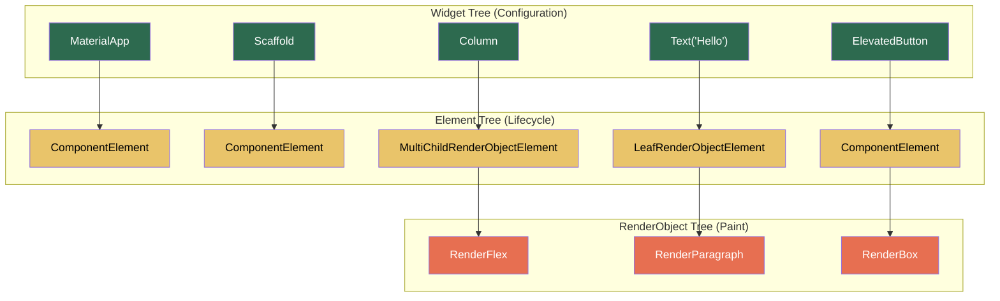
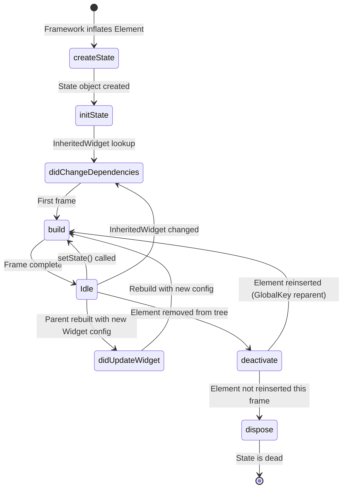

# 1. The Three Trees 🟢

> **What you'll learn:**
> - How Flutter's three-tree architecture (Widget → Element → RenderObject) actually paints pixels to your screen.
> - Why `const` constructors are the single most impactful performance optimization in the entire framework.
> - How `Key` objects control Element identity and prevent catastrophic subtree rebuilds.
> - How to trace a `setState` call through all three trees and predict exactly which nodes are visited.

---

## The Mental Model: Three Trees, Not One

Every Flutter developer writes Widgets. Most never think about what happens *after* `build()` returns. But the framework maintains **three parallel trees**, and your performance — indeed, the entire 60fps contract — depends on understanding the boundary between them.

| Tree | What It Holds | Mutability | Lifetime |
|------|--------------|-----------|----------|
| **Widget Tree** | Configuration (a blueprint). `Text("Hello")` is just an immutable description. | **Immutable** — widgets are `@immutable` by convention and rebuilt every frame. | Ephemeral — recreated on every `build()` call. |
| **Element Tree** | Lifecycle & identity. Elements are the "living" nodes that manage the connection between configuration and rendering. | **Mutable** — elements are long-lived and updated in-place when possible. | Persistent — survives across rebuilds if the Widget `runtimeType` and `key` match. |
| **RenderObject Tree** | Layout, painting, and hit-testing. `RenderBox` subclasses compute sizes and paint to the Skia/Impeller canvas. | **Mutable** — render objects are expensive and reused across rebuilds. | Persistent — only recreated when the Element is replaced. |



**Key insight:** Not every Widget creates a RenderObject. `StatelessWidget` and `StatefulWidget` are *Component* widgets — they only generate more widgets via `build()`. Only `RenderObjectWidget` subclasses (like `Padding`, `SizedBox`, `DecoratedBox`) produce actual render nodes. This means the Widget tree is always *larger* than the RenderObject tree.

---

## Anatomy of a Rebuild: What `setState` Actually Does

When you call `setState(() { _counter++; })`, the following chain executes:

1. **`setState`** marks the owning `StatefulElement` as "dirty."
2. The framework schedules a **new frame** via `SchedulerBinding.scheduleFrame()`.
3. During the next frame, the **build phase** runs: the dirty Element calls `build()` on its `State`, producing a new Widget subtree.
4. The framework **walks** the new Widget subtree and the existing Element subtree *together*, performing a **reconciliation** (a diff).
5. For each position:
   - If the new Widget has the **same `runtimeType` and `key`** as the existing Element's widget → the Element is **updated** (cheap: just a pointer swap + `updateRenderObject`).
   - If they differ → the old Element is **deactivated** and **unmounted**, and a new Element + RenderObject are **inflated** (expensive).
6. After reconciliation, the **layout phase** runs on dirty RenderObjects (`performLayout`), followed by the **paint phase** (`paint`).

### The Brittle Way vs. The Resilient Way

```dart
// 💥 JANK HAZARD: Rebuilding an entire screen because one counter changed.
// Every child of this build() method—Text, Image, ListView—will be
// re-evaluated by the Element tree, even if only _counter changed.
class DashboardScreen extends StatefulWidget {
  const DashboardScreen({super.key});
  @override
  State<DashboardScreen> createState() => _DashboardScreenState();
}

class _DashboardScreenState extends State<DashboardScreen> {
  int _counter = 0;

  @override
  Widget build(BuildContext context) {
    return Scaffold(
      body: Column(
        children: [
          const HeaderBar(),          // 💥 Rebuilt unnecessarily
          ExpensiveChart(data: api),   // 💥 Rebuilt unnecessarily
          Text('Count: $_counter'),   // Only this needs to change
          HeavyListView(),            // 💥 Rebuilt unnecessarily
        ],
      ),
      floatingActionButton: FloatingActionButton(
        onPressed: () => setState(() => _counter++),
        child: const Icon(Icons.add),
      ),
    );
  }
}
```

```dart
// ✅ FIX: Extract the volatile widget into a leaf with minimal rebuild scope.
// The parent screen is now a StatelessWidget with const children. Only the
// _CounterLabel rebuilds on setState.
class DashboardScreen extends StatelessWidget {
  const DashboardScreen({super.key}); // ✅ const constructor!

  @override
  Widget build(BuildContext context) {
    return Scaffold(
      body: Column(
        children: [
          const HeaderBar(),          // ✅ const — Element skips reconciliation
          const ExpensiveChart(),     // ✅ const — never rebuilt
          const _CounterLabel(),      // ✅ Only this subtree is StatefulWidget
          const HeavyListView(),      // ✅ const — never rebuilt
        ],
      ),
    );
  }
}

class _CounterLabel extends StatefulWidget {
  const _CounterLabel(); // ✅ const constructor, private widget

  @override
  State<_CounterLabel> createState() => _CounterLabelState();
}

class _CounterLabelState extends State<_CounterLabel> {
  int _counter = 0;

  @override
  Widget build(BuildContext context) {
    // ✅ Only this Text and its parent Element/RenderParagraph rebuild.
    return Row(
      children: [
        Text('Count: $_counter'),
        IconButton(
          onPressed: () => setState(() => _counter++),
          icon: const Icon(Icons.add),
        ),
      ],
    );
  }
}
```

**Why this matters:** When a parent's `build()` returns a `const Widget`, the framework's `Element.updateChild` sees the **identical** widget instance (same Dart object by identity). It short-circuits *entirely* — no reconciliation, no `updateRenderObject`, no layout. This is free. `const` is not a "nice to have." It is the **primary mechanism** for telling Flutter "don't touch this subtree."

---

## `const` Constructors: The Deep Mechanics

The Dart compiler canonicalizes `const` expressions. Two `const Text('Hello')` calls at different locations in your code produce the **same object in memory**.

```dart
// These are the SAME object. identical() returns true.
const a = Text('Hello');
const b = Text('Hello');
print(identical(a, b)); // true
```

When the framework calls `Element.updateChild(newWidget)`, the very first check is:

```dart
// From flutter/lib/src/widgets/framework.dart (simplified)
if (identical(child.widget, newWidget)) {
  // Short-circuit! Nothing to do.
  return child;
}
```

This means `const` widgets bypass:
1. `Widget.canUpdate` comparison (`runtimeType` and `key` checks).
2. `Element.update()` → `RenderObject.updateRenderObject()`.
3. Any marking of the RenderObject as needing layout or paint.

### When `const` Cannot Help

`const` requires all constructor arguments to be compile-time constants. You cannot use `const` if:
- A parameter comes from a variable (`Text(userName)` — not const).
- A callback references a closure (`onPressed: () => doThing()` — closures are not const).
- A parameter uses runtime data (`Color.fromARGB(255, r, g, b)` — variables).

In these cases, use `Key` stability and structural extraction (small leaf widgets) instead.

---

## Keys: Controlling Element Identity

When Flutter reconciles children, it matches by **position** by default. Keys override this, matching by **key value** instead. This is critical for lists, tab views, and any scenario where widget order changes.

| Key Type | Use Case | Example |
|----------|----------|---------|
| `ValueKey<T>` | Stable, unique domain identifier | `ValueKey(user.id)` |
| `ObjectKey` | Identity based on a specific object instance | `ObjectKey(myController)` |
| `UniqueKey` | Force a fresh Element every time (rarely correct) | Animating a widget "in" after removal |
| `GlobalKey` | Access Element/State from anywhere; reparenting across subtrees | `GlobalKey<FormState>()` for `Form.validate()` |
| `PageStorageKey` | Preserve scroll position across tab switches | `PageStorageKey('feed_list')` |

### The Brittle Way vs. The Resilient Way: Reorderable Lists

```dart
// 💥 JANK HAZARD: No keys in a reorderable list.
// When items are reordered, Flutter matches by POSITION.
// This means Element[0] gets Widget[new_0] — but if they are
// different item types, the entire subtree is torn down and rebuilt.
// Worse: StatefulWidgets lose their State objects.
ListView(
  children: items.map((item) => ListTile(title: Text(item.name))).toList(),
)
```

```dart
// ✅ FIX: Use ValueKey tied to a stable domain ID.
// Flutter matches Element to Widget by KEY, not position.
// Reordering only moves existing Elements — no teardown, no State loss.
ListView(
  children: items.map((item) => ListTile(
    key: ValueKey(item.id), // ✅ Stable identity
    title: Text(item.name),
  )).toList(),
)
```

---

## The Widget Lifecycle: `StatefulWidget` in Detail

A `StatefulWidget` has a well-defined lifecycle that maps directly to Element operations:



| Method | When It Fires | What To Do |
|--------|--------------|-----------|
| `createState()` | Once, when the framework creates the Element. | Return a new `State` instance. Never do work here. |
| `initState()` | Once, after `createState`. `context` is available but `InheritedWidget` lookups are not safe yet. | Initialize controllers (`TextEditingController`, `AnimationController`). Subscribe to streams. |
| `didChangeDependencies()` | After `initState`, and whenever an `InheritedWidget` ancestor changes. | Re-read inherited data (`Theme.of(context)`, `MediaQuery.of(context)`). |
| `build()` | Every time the Element is marked dirty. | Return the widget subtree. Must be **pure** — no side effects, no I/O. |
| `didUpdateWidget(old)` | When the parent rebuilds and provides a new Widget instance (same `runtimeType`/`key`, different config). | Compare `old` vs `widget` and update controllers if needed. |
| `deactivate()` | When the Element is removed from the tree (might be reinserted if using `GlobalKey`). | Remove listeners that depend on tree position. |
| `dispose()` | When the Element is permanently removed. | Dispose controllers, cancel subscriptions, close streams. **This is your last chance to prevent memory leaks.** |

---

## RenderObjects: Where Physics Happens

RenderObjects are the workhorses. They implement the **box constraint protocol** that makes Flutter's layout algorithm `O(n)` in a single pass:

1. **Constraints go down:** Parent tells child "you must be between 200px and 400px wide."
2. **Sizes go up:** Child picks a size within constraints and reports it.
3. **Parent positions child:** Parent decides where to place the child's origin.

```dart
// Simplified view of the constraint protocol
class RenderBox {
  void performLayout() {
    // 1. Pass constraints to child
    child!.layout(
      BoxConstraints(minWidth: 0, maxWidth: constraints.maxWidth),
      parentUsesSize: true, // We need the child's size to position it
    );

    // 2. Read child's chosen size
    final childSize = child!.size;

    // 3. Pick our own size
    size = Size(constraints.maxWidth, childSize.height + 16);
  }

  void paint(PaintingContext context, Offset offset) {
    // 4. Paint ourselves, then paint child at an offset
    context.canvas.drawRect(offset & size, _backgroundPaint);
    context.paintChild(child!, offset + const Offset(8, 8));
  }
}
```

### Common RenderObject Subclasses

| Widget | RenderObject | What It Does |
|--------|-------------|-------------|
| `SizedBox` | `RenderConstrainedBox` | Imposes tight/loose size constraints |
| `Padding` | `RenderPadding` | Adds insets by reducing child constraints |
| `Align` | `RenderPositionedBox` | Positions child within parent's constraints |
| `Stack` | `RenderStack` | Multi-child with absolute positioning |
| `Flex` (Row/Column) | `RenderFlex` | Lays out children along a main axis using flex factors |
| `CustomPaint` | `RenderCustomPaint` | Delegates to your `CustomPainter.paint()` |

---

## Performance Profiling: Seeing the Trees

Flutter DevTools gives you direct visibility into the three trees:

- **Widget Inspector** → Shows the Widget tree with rebuild counts.
- **Performance Overlay** (`showPerformanceOverlay: true`) → Shows raster and UI thread frame times.
- **`debugProfileBuildsEnabled = true`** → Logs every `build()` call to the timeline.
- **`debugProfileLayoutsEnabled = true`** → Logs every `performLayout()` call.

The golden rule: if a widget's rebuild count is high but its visual output doesn't change, you have a rebuild leak. Fix it with `const`, key stability, or extracting to a leaf `StatefulWidget`.

---

<details>
<summary><strong>🏋️ Exercise: Rebuild Audit</strong> (click to expand)</summary>

### Challenge

You have the following widget tree for a music player screen. The `ProgressBar` updates every 100ms (10 times per second) with the current playback position. Users report that scrolling the song list is janky on lower-end Android devices.

```dart
class PlayerScreen extends StatefulWidget {
  const PlayerScreen({super.key});
  @override
  State<PlayerScreen> createState() => _PlayerScreenState();
}

class _PlayerScreenState extends State<PlayerScreen> {
  double _progress = 0.0;
  late Timer _timer;

  @override
  void initState() {
    super.initState();
    _timer = Timer.periodic(
      const Duration(milliseconds: 100),
      (_) => setState(() => _progress += 0.001),
    );
  }

  @override
  void dispose() {
    _timer.cancel();
    super.dispose();
  }

  @override
  Widget build(BuildContext context) {
    return Scaffold(
      appBar: AppBar(title: const Text('Now Playing')),
      body: Column(
        children: [
          const AlbumArt(size: 300),       // Expensive image widget
          Text('${(_progress * 100).toStringAsFixed(1)}%'),
          LinearProgressIndicator(value: _progress),
          Expanded(
            child: SongList(songs: library), // 500+ items
          ),
        ],
      ),
    );
  }
}
```

**Your tasks:**
1. Identify every widget that is being rebuilt unnecessarily 10 times per second.
2. Refactor to minimize rebuild scope while maintaining the same visual behavior.
3. Explain what happens in the Element tree during your fix.

<details>
<summary>🔑 Solution</summary>

**Problem diagnosis:**
`setState` is called 10×/sec on `_PlayerScreenState`. This marks the `StatefulElement` dirty, triggering `build()`. The entire return value — `Scaffold`, `AppBar`, `Column`, `AlbumArt`, `Text`, `LinearProgressIndicator`, AND the `SongList` with 500+ items — is reconciled every 100ms.

- `const AlbumArt(size: 300)` is already `const`, so the Element short-circuits via `identical()`. ✅ No problem.
- `AppBar(title: const Text('Now Playing'))` — `AppBar` itself is NOT const (it's created fresh each build). Its Element calls `updateRenderObject`. Minor overhead. 
- `SongList(songs: library)` — NOT const (takes a variable). Its Element runs `canUpdate`, then `updateChild` recurses into 500+ children. **This is the jank source.** Even if nothing visually changes, the framework must walk 500 Element/Widget pairs to confirm.
- `Text(...)` and `LinearProgressIndicator(...)` — Must rebuild (they depend on `_progress`). This is correct.

**Solution: Extract the progress section into a leaf widget.**

```dart
// ✅ FIX: The parent is now a StatelessWidget with const children.
// Only _ProgressSection rebuilds at 10 fps.
class PlayerScreen extends StatelessWidget {
  const PlayerScreen({super.key});

  @override
  Widget build(BuildContext context) {
    return Scaffold(
      appBar: AppBar(title: const Text('Now Playing')),
      body: Column(
        children: [
          const AlbumArt(size: 300),       // ✅ const — never touched
          const _ProgressSection(),         // ✅ Isolated rebuild scope
          Expanded(
            child: SongList(songs: library), // ✅ Parent doesn't setState,
          ),                                 //    so this Element is never dirty
        ],
      ),
    );
  }
}

class _ProgressSection extends StatefulWidget {
  const _ProgressSection();

  @override
  State<_ProgressSection> createState() => _ProgressSectionState();
}

class _ProgressSectionState extends State<_ProgressSection> {
  double _progress = 0.0;
  late Timer _timer;

  @override
  void initState() {
    super.initState();
    _timer = Timer.periodic(
      const Duration(milliseconds: 100),
      (_) => setState(() => _progress += 0.001),
    );
  }

  @override
  void dispose() {
    _timer.cancel();
    super.dispose();
  }

  @override
  Widget build(BuildContext context) {
    // ✅ Only this tiny subtree (2 widgets) rebuilds 10×/sec.
    return Column(
      mainAxisSize: MainAxisSize.min,
      children: [
        Text('${(_progress * 100).toStringAsFixed(1)}%'),
        LinearProgressIndicator(value: _progress),
      ],
    );
  }
}
```

**What happens in the Element tree after this fix:**

1. `PlayerScreen` is a `StatelessWidget` — its Element is *never* marked dirty after initial build.
2. When `_ProgressSectionState.setState` fires, only `_ProgressSection`'s `StatefulElement` is marked dirty.
3. During reconciliation, the framework walks `_ProgressSection`'s subtree: `Column` → `Text` + `LinearProgressIndicator`. That's 3 widgets, not 500+.
4. The `SongList`'s Element? Never visited. Its parent (`Column` in `PlayerScreen`) was never marked dirty, so its children are not re-evaluated.
5. `AlbumArt` is `const` — `identical()` check passes, zero work.

**Performance impact:** From ~503 widget reconciliations per frame to ~3. On a 60fps device, that's the difference between 30,180 reconciliations/sec and 180.

</details>
</details>

---

> **Key Takeaways**
> - Flutter maintains three parallel trees: **Widget** (configuration), **Element** (lifecycle/identity), and **RenderObject** (layout/paint).
> - `const` constructors cause the framework to skip reconciliation entirely via `identical()` object identity.
> - `setState` marks an Element dirty; only that Element's subtree is rebuilt. **Minimize the scope** by extracting volatile state into leaf widgets.
> - **Keys** control Element matching. Without keys, Flutter matches by position — which breaks for reorderable or dynamic lists.
> - RenderObjects implement the constraint protocol: constraints down, sizes up, parent positions children. Layout is `O(n)` single-pass.
> - Profile with DevTools: enable `debugProfileBuildsEnabled` to see exactly which widgets rebuild and how often.

---

> **See also:**
> - [Chapter 2: Impeller, Skia, and The Web](ch02-impeller-skia-web.md) — What happens *after* RenderObjects paint: the graphics engine pipeline.
> - [Chapter 3: State Management at Scale](ch03-state-management.md) — Moving state out of widgets entirely using Riverpod and BLoC.
> - [Chapter 7: Adaptive Design Systems](ch07-adaptive-design.md) — Building RenderObject-based custom layouts that adapt to platform input.
