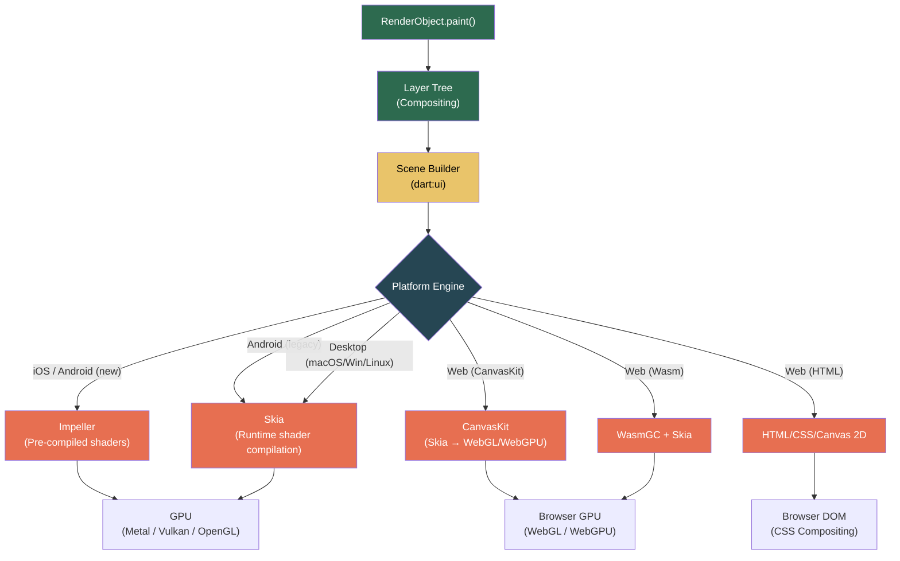

# 2. Impeller, Skia, and The Web 🟡

> **What you'll learn:**
> - How Flutter's rendering pipeline works from RenderObject → GPU, and why the graphics engine choice matters for your frame budget.
> - The architectural difference between Skia (shader compilation at runtime) and Impeller (pre-compiled shaders), and why Impeller eliminates first-frame jank.
> - Flutter Web's three rendering backends — HTML, CanvasKit, and WasmGC — their tradeoffs, and how to choose.
> - How to profile and diagnose graphics-layer performance issues across all six platforms.

---

## From RenderObject to Pixels: The Full Pipeline

In Chapter 1, we stopped at "RenderObjects paint." But paint to *what*? Flutter does not use platform-native UI widgets. It owns every pixel, which means it must implement a **full graphics pipeline** from composited layers down to GPU draw calls.



### The Layer Tree

RenderObjects do not paint directly to a canvas. They paint to **Layers** — a composited scene graph. This enables:

- **Compositing optimizations:** Subtrees that don't change can be cached as textures (raster cache).
- **Platform views:** Embedding native platform widgets (`WebView`, `MapView`) requires dedicated layers.
- **Opacity/Transform grouping:** `Opacity`, `Transform`, and `ClipRect` widgets create new layers to avoid re-rasterizing children.

The layer tree is serialized into a `Scene` via `SceneBuilder` (from `dart:ui`) and handed to the engine for GPU submission.

---

## Skia: The Proven Workhorse

Skia is a 2D graphics library maintained by Google, also used in Chrome, Android's Canvas API, and many other products. Flutter used Skia exclusively for its first six years.

### How Skia Renders a Frame

1. Dart's `RenderObject.paint()` calls methods on `Canvas` (which is backed by `SkCanvas` in the engine).
2. The canvas records draw commands: `drawRect`, `drawPath`, `drawParagraph`, etc.
3. When the frame is complete, the recorded commands are flushed to the GPU via **shaders** (small programs that run on the GPU).
4. Skia **compiles shaders at runtime** the first time it encounters a new draw pattern.

### The Shader Compilation Jank Problem

Step 4 is the critical flaw. Shader compilation is expensive — it can take 50–200ms for complex shaders. Because it happens **on the raster thread**, the frame is delayed, and the user sees a visible stutter (jank).

```
Frame Timeline (Skia — first encounter of complex shader):
─────────────────────────────────────────────────────────
UI Thread:   [build][layout][paint]      → 4ms ✅
Raster Thr:  [encode][████ SHADER COMPILE ████][submit] → 180ms 💥
                                                          
Result: Frame takes 180ms. At 60fps budget of 16.6ms, user sees ~11 dropped frames.
```

**Mitigations (pre-Impeller):**
- `flutter build --bundle-sksl-warmup` — Pre-capture shaders during a test run and bundle them with the app.
- `ShaderWarmUp` class — Manually draw common shapes during app startup to trigger compilation before user interaction.
- Neither is reliable. Both require manual maintenance and don't cover all code paths.

---

## Impeller: Pre-Compiled Shaders, Zero Jank

Impeller is Flutter's next-generation rendering engine, designed from the ground up to **eliminate shader compilation jank**. It achieves this with one architectural decision: **all shaders are pre-compiled at build time**.

| Aspect | Skia | Impeller |
|--------|------|---------|
| Shader Strategy | Compiled at runtime on first use | Pre-compiled at `flutter build` time, bundled in binary |
| First-frame Jank | Common — any new visual pattern triggers compilation | **Eliminated** — all shaders ready at launch |
| Backend (iOS) | OpenGL ES / Metal (via Skia) | Metal directly |
| Backend (Android) | OpenGL ES / Vulkan (via Skia) | Vulkan (primary), OpenGL ES 3.0 (fallback) |
| Tessellation | Skia tessellates on CPU | Impeller tessellates on GPU (via compute shaders where available) |
| Text Rendering | Skia's glyph atlas | Impeller's glyph atlas (optimized for mobile GPU texture formats) |
| Anti-aliasing | MSAA or coverage-based | MSAA with hardware resolve |
| Desktop Support | Full (macOS, Windows, Linux) | Experimental on macOS; Skia still default on Windows/Linux |

### How Impeller Pre-Compiles Shaders

During `flutter build`, the Impeller shader compiler:
1. Takes all GLSL/MSL shader source files bundled with the engine.
2. Compiles them to platform-specific GPU bytecode (Metal IR for iOS, SPIR-V for Vulkan on Android).
3. Bundles the compiled shaders into the app binary.

At runtime, the GPU driver loads pre-compiled bytecode — no compilation step, no jank.

```
Frame Timeline (Impeller):
──────────────────────────────────────
UI Thread:   [build][layout][paint]      → 4ms ✅
Raster Thr:  [encode][submit]            → 2ms ✅
                                          
Result: Consistent 6ms frames. 60fps lock. No first-frame jank.
```

### When to Target Impeller vs. Skia

```dart
// In your build commands:
// iOS: Impeller is the DEFAULT since Flutter 3.16. Skia opt-in only.
// Android: Impeller is default since Flutter 3.22.
// Desktop (macOS/Windows/Linux): Skia is still the default as of 2026.

// To explicitly disable Impeller (fallback to Skia) for debugging:
// flutter run --no-enable-impeller

// To opt into Impeller on macOS (experimental):
// flutter run --enable-impeller
```

---

## Flutter Web: Three Rendering Backends

Flutter Web is fundamentally different from mobile. There is no direct GPU access — everything must go through the browser's rendering pipeline. Flutter offers three backends, each with different tradeoffs:

### Comparison Table

| Aspect | HTML Renderer | CanvasKit Renderer | Wasm (WasmGC) |
|--------|--------------|-------------------|---------------|
| Output | DOM elements + CSS + Canvas 2D | WebGL draw calls (Skia compiled to JS/Wasm) | WebGL/WebGPU draw calls (Skia compiled to Wasm) |
| Download Size | ~200 KB (Dart→JS) | ~1.5 MB (Skia CanvasKit Wasm module) | ~1.2 MB (WasmGC module) |
| Fidelity | Approximate — some effects differ from mobile | **Pixel-perfect** — identical to mobile Skia | **Pixel-perfect** — identical to mobile Skia |
| Text Rendering | Browser-native (CSS fonts) | Skia text shaping (matches mobile) | Skia text shaping |
| SEO / Accessibility | HTML elements → good a11y | Canvas-only → requires `SemanticsBinding` | Canvas-only → requires `SemanticsBinding` |
| Startup Time | Fast (no large download) | Slower (Wasm module download + init) | Moderate (smaller than CanvasKit) |
| Best For | Content-heavy, SEO-important, small apps | Complex UIs, games, pixel-perfect brand sites | Production apps needing Wasm performance |

### Selecting the Backend

```dart
// In your web/index.html or flutter build command:

// Auto (default since Flutter 3.22) — uses CanvasKit for most cases:
// flutter build web --web-renderer auto

// Force HTML:
// flutter build web --web-renderer html

// Force CanvasKit:
// flutter build web --web-renderer canvaskit

// WasmGC (requires compatible browsers — Chrome 119+, Firefox 120+):
// flutter build web --wasm
```

### The Brittle Way vs. The Resilient Way: Web-Specific Rendering

```dart
// 💥 JANK HAZARD: Using BoxShadow with blur on Web + HTML renderer.
// The HTML renderer converts this to CSS box-shadow, which is fine.
// But CanvasKit renders it as a Skia blur — which is significantly
// more expensive per frame on WebGL than native CSS compositing.
Container(
  decoration: BoxDecoration(
    boxShadow: [
      BoxShadow(
        color: Colors.black26,
        blurRadius: 24, // 💥 Expensive blur on every frame in CanvasKit
        spreadRadius: 8,
      ),
    ],
  ),
  child: const HeavyContentCard(),
)
```

```dart
// ✅ FIX: Use RepaintBoundary to isolate expensive effects.
// The RenderObject behind RepaintBoundary creates a new compositing
// layer, allowing the raster cache to avoid re-blurring every frame.
RepaintBoundary(
  child: Container(
    decoration: BoxDecoration(
      boxShadow: [
        BoxShadow(
          color: Colors.black26,
          blurRadius: 24,
          spreadRadius: 8,
        ),
      ],
    ),
    child: const HeavyContentCard(), // ✅ Cached as a texture
  ),
)
```

---

## Custom Painting: Working with the Canvas

When standard widgets cannot achieve your design, you drop down to `CustomPaint` / `CustomPainter`. Understanding the graphics engine helps you write performant painters:

```dart
class WaveformPainter extends CustomPainter {
  final List<double> amplitudes;
  
  WaveformPainter(this.amplitudes);

  @override
  void paint(Canvas canvas, Size size) {
    final paint = Paint()
      ..color = Colors.blueAccent
      ..strokeWidth = 2.0
      ..style = PaintingStyle.stroke
      ..strokeCap = StrokeCap.round;

    final path = Path();
    final dx = size.width / amplitudes.length;

    for (int i = 0; i < amplitudes.length; i++) {
      final x = i * dx;
      final y = size.height / 2 - (amplitudes[i] * size.height / 2);
      if (i == 0) {
        path.moveTo(x, y);
      } else {
        path.lineTo(x, y);
      }
    }

    canvas.drawPath(path, paint); // ✅ Single path draw call — efficient
  }

  @override
  bool shouldRepaint(WaveformPainter oldDelegate) {
    // ✅ Only repaint if data actually changed.
    // Returning true unconditionally causes repaint every frame — JANK.
    return !listEquals(amplitudes, oldDelegate.amplitudes);
  }
}
```

### Performance Rules for Custom Painters

| Rule | Why |
|------|-----|
| Batch draw calls into a single `Path` | Each `canvas.draw*` call is a GPU draw call. Fewer = faster. |
| Implement `shouldRepaint` correctly | Returning `true` always causes `paint()` every frame. |
| Avoid `canvas.saveLayer` unless necessary | `saveLayer` allocates an offscreen buffer (GPU texture). Expensive. |
| Use `RepaintBoundary` around frequently-repainted painters | Isolates repaint to a compositing layer, preventing parent repaint. |
| Pre-compute `Paint` objects | `Paint()` allocation in `paint()` creates garbage. Store as final fields. |

---

## Platform-Specific Engine Behavior

| Platform | Default Engine (2026) | GPU Backend | Notes |
|----------|----------------------|------------|-------|
| iOS | Impeller | Metal | Skia removed from iOS builds by default |
| Android | Impeller | Vulkan → OpenGL ES fallback | Old devices (pre-2017) fall back to OpenGL |
| macOS | Skia (Impeller experimental) | Metal | Impeller opt-in via `--enable-impeller` |
| Windows | Skia | DirectX 12 / OpenGL | Impeller not yet available |
| Linux | Skia | OpenGL / Vulkan | Impeller not yet available |
| Web (CanvasKit) | Skia (via WebGL) | WebGL 2.0 / WebGPU | Full Skia fidelity in browser |
| Web (HTML) | N/A (DOM) | CSS Compositing | No Skia — browser-native rendering |
| Web (Wasm) | Skia (via WasmGC) | WebGL 2.0 / WebGPU | Better perf than JS CanvasKit |

---

<details>
<summary><strong>🏋️ Exercise: Renderer Profiling</strong> (click to expand)</summary>

### Challenge

You are building a financial dashboard deployed to **Web (CanvasKit)** and **iOS (Impeller)**. The dashboard renders 12 real-time charts that update every 500ms. Each chart uses `CustomPaint` with a `CustomPainter` that draws ~200 data points as a polyline.

Users report:
- **iOS:** Buttery smooth. No issues.
- **Web:** Initial load is slow (~3 seconds). After loading, scrolling between dashboard tabs causes visible stutter for the first few tab switches, then smooths out.

**Your tasks:**

1. Explain *why* iOS is smooth but Web stutters, in terms of the rendering backend differences.
2. Propose three specific architectural changes to fix the Web performance without degrading iOS.
3. Write a `shouldRepaint` implementation that minimizes unnecessary repaints.

<details>
<summary>🔑 Solution</summary>

**1. Root Cause Analysis**

- **iOS (Impeller):** All shaders are pre-compiled at build time. When charts first render, the GPU already has compiled pipeline state objects for every draw operation (polylines, fills, text). Zero shader compilation jank. Tessellation happens on GPU compute shaders. Smooth.

- **Web (CanvasKit):** CanvasKit is Skia compiled to WebGL. When a new chart pattern is drawn for the first time (a new tab with different visual styles), Skia compiles WebGL shaders on the **browser's main thread** (since WebGL shader compilation is synchronous). The first few tab switches trigger new shader variants → stutter. After all shaders are compiled, subsequent renders use cached shaders → smooth.

- **Web initial load (~3s):** The CanvasKit Wasm module (~1.5 MB) must be downloaded and initialized before any rendering. This is a fixed cost of the CanvasKit backend.

**2. Three Architectural Fixes**

**Fix A: Add `RepaintBoundary` around each chart.**
```dart
// Each chart gets its own compositing layer. When one chart repaints,
// sibling charts are NOT re-rasterized. Also enables raster caching.
Widget buildChart(ChartData data) {
  return RepaintBoundary( // ✅ Isolate repaint scope
    child: CustomPaint(
      painter: ChartPainter(data),
      size: const Size(double.infinity, 200),
    ),
  );
}
```

**Fix B: Pre-warm common draw patterns during splash screen.**
```dart
// During app initialization, draw invisible shapes that trigger
// all the shader variants your charts will need.
class ShaderWarmUpPainter extends CustomPainter {
  @override
  void paint(Canvas canvas, Size size) {
    // Trigger polyline shader
    final path = Path()..moveTo(0, 0)..lineTo(100, 100)..lineTo(200, 50);
    canvas.drawPath(path, Paint()..style = PaintingStyle.stroke..strokeWidth = 2);
    
    // Trigger fill shader
    canvas.drawRect(Rect.fromLTWH(0, 0, 1, 1), Paint()..style = PaintingStyle.fill);
    
    // Trigger text shader
    final paragraph = (ParagraphBuilder(ParagraphStyle())..addText('0')).build()
      ..layout(const ParagraphConstraints(width: 100));
    canvas.drawParagraph(paragraph, Offset.zero);
  }

  @override
  bool shouldRepaint(covariant CustomPainter oldDelegate) => false;
}
```

**Fix C: Lazy-load off-screen tabs.**
```dart
// Don't build chart widgets for tabs the user hasn't visited yet.
// Use IndexedStack with a conditional builder, or simply use
// a PageView that only builds adjacent pages.
TabBarView(
  // ✅ Only the active tab + 1 neighbor are built.
  // Charts for distant tabs don't trigger shader compilation.
  children: tabs.map((tab) => ChartPage(data: tab.data)).toList(),
)
```

**3. Optimal `shouldRepaint`**
```dart
class ChartPainter extends CustomPainter {
  final List<double> dataPoints;
  final Color lineColor;
  final double strokeWidth;

  const ChartPainter({
    required this.dataPoints,
    required this.lineColor,
    this.strokeWidth = 2.0,
  });

  @override
  bool shouldRepaint(ChartPainter oldDelegate) {
    // ✅ Check cheap comparisons first (color, stroke), then expensive (list).
    // Short-circuit evaluation: if color changed, skip list comparison.
    if (lineColor != oldDelegate.lineColor) return true;
    if (strokeWidth != oldDelegate.strokeWidth) return true;
    if (dataPoints.length != oldDelegate.dataPoints.length) return true;
    // ✅ Deep list comparison only if lengths match
    return !listEquals(dataPoints, oldDelegate.dataPoints);
  }

  @override
  void paint(Canvas canvas, Size size) {
    // ... polyline drawing ...
  }
}
```

**Key principle:** On Web, treat shader compilation as a known cost. Architect to front-load it (warm-up during splash), isolate it (RepaintBoundary per chart), and defer it (lazy-load tabs). On Impeller platforms, these optimizations are less critical but still good practice for compositing layer management.

</details>
</details>

---

> **Key Takeaways**
> - Flutter owns every pixel. The rendering pipeline is: `RenderObject.paint()` → Layer Tree → `SceneBuilder` → Graphics Engine (Impeller or Skia) → GPU.
> - **Impeller pre-compiles all shaders at build time**, eliminating the first-frame jank that plagued Skia. It is now the default on iOS and Android.
> - **Skia compiles shaders at runtime** on first encounter. This causes jank on the first render of a new visual pattern. Skia remains the default on desktop platforms.
> - Flutter Web has three backends: **HTML** (small, approximate), **CanvasKit** (pixel-perfect, large download), and **WasmGC** (pixel-perfect, better performance than CanvasKit JS).
> - Use `RepaintBoundary` to isolate expensive painting operations into their own compositing layers.
> - Implement `shouldRepaint` correctly — returning `true` unconditionally causes unnecessary GPU work every frame.

---

> **See also:**
> - [Chapter 1: The Three Trees](ch01-three-trees.md) — The Widget/Element/RenderObject pipeline that feeds into the graphics engine.
> - [Chapter 7: Adaptive Design Systems](ch07-adaptive-design.md) — Custom `RenderBox` implementations that paint platform-adaptive UIs.
> - [Chapter 8: Capstone Project](ch08-capstone.md) — Applying custom painting in the Markdown IDE's text editing canvas.
