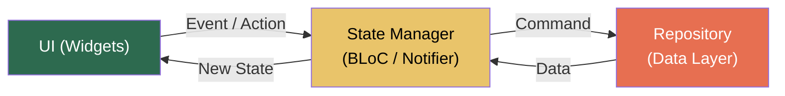
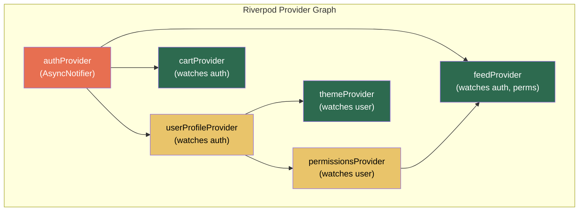

# 3. State Management at Scale (Riverpod & BLoC) 🟡

> **What you'll learn:**
> - Why `setState` and `Provider` (v1) architecturally collapse in apps with 50+ screens and complex interdependent state.
> - How to architect strict **unidirectional data flow** using both BLoC and Riverpod patterns.
> - The fundamental differences between BLoC (event-driven, trace-friendly) and Riverpod (reactive, DI-native) and when to choose each.
> - How to build `AsyncNotifier` patterns for real-world data loading with proper error handling, caching, and disposal.

---

## Why `setState` Fails at Scale

`setState` is a perfectly valid tool for **local, ephemeral UI state** — a toggle, a text field's focus, an animation progress value. It fails catastrophically when used for **shared, application-level state** because of three structural problems:

| Problem | What Happens | Real-World Example |
|---------|-------------|-------------------|
| **Prop Drilling** | State must be passed down through every intermediate widget's constructor to reach the widget that needs it. | A user's authentication token passing through `Scaffold` → `Body` → `TabView` → `FeedList` → `FeedItem` → `LikeButton`. |
| **Rebuild Blast Radius** | `setState` rebuilds the entire subtree of the stateful widget. As state moves higher (to share it), more widgets rebuild. | Moving `_cartItems` to a top-level `ShellWidget` causes every screen to rebuild when an item is added. |
| **No Dependency Tracking** | Two widgets that depend on the same data have no way to coordinate updates without a manual callback chain. | A cart badge in the app bar and a cart screen must both update when items change — leading to duplicated state or fragile callbacks. |

```dart
// 💥 JANK HAZARD: "Lifting state up" until you're rebuilding the world.
// AuthState lives in _AppShellState so both ProfileScreen and SettingsScreen
// can access it. But now EVERY navigation event triggers _AppShellState.build().
class _AppShellState extends State<AppShell> {
  User? _currentUser;       // 💥 Shared state
  List<CartItem> _cart = []; // 💥 Shared state
  ThemeMode _theme = ThemeMode.light; // 💥 Shared state

  @override
  Widget build(BuildContext context) {
    // 💥 setState on ANY of these rebuilds the ENTIRE app shell,
    // including the Navigator and all visible routes.
    return MaterialApp(
      themeMode: _theme,
      home: MainNavigator(
        user: _currentUser,  // 💥 Prop drilling
        cart: _cart,          // 💥 Prop drilling
        onCartUpdate: (items) => setState(() => _cart = items), // 💥 Callback drilling
      ),
    );
  }
}
```

---

## The Architectural Shift: Unidirectional Data Flow

Both BLoC and Riverpod enforce the same fundamental pattern:



**Rules:**
1. **UI → State Manager:** Widgets emit events or call methods. They never mutate state directly.
2. **State Manager → UI:** The state manager emits a new immutable state object. Widgets rebuild reactively.
3. **State Manager → Repository:** Business logic, API calls, and database queries live in the state manager or a repository it depends on.
4. **Data never flows backwards.** The repository never tells the UI to rebuild directly.

---

## BLoC: Event-Driven, Strict, Traceable

BLoC (Business Logic Component) uses a **stream-based event/state** pattern. Every user interaction is modeled as a discrete `Event`, and the BLoC transforms events into new `State` objects.

### Architecture

```dart
// Events — sealed class hierarchy for exhaustiveness
sealed class CartEvent {}
class AddItem extends CartEvent {
  final Product product;
  AddItem(this.product);
}
class RemoveItem extends CartEvent {
  final String productId;
  RemoveItem(this.productId);
}
class ClearCart extends CartEvent {}

// State — immutable value object
class CartState {
  final List<CartItem> items;
  final double total;
  const CartState({this.items = const [], this.total = 0.0});
  
  CartState copyWith({List<CartItem>? items, double? total}) =>
    CartState(
      items: items ?? this.items,
      total: total ?? this.total,
    );
}

// BLoC — transforms Events → State
class CartBloc extends Bloc<CartEvent, CartState> {
  final CartRepository _repo;

  CartBloc(this._repo) : super(const CartState()) {
    on<AddItem>(_onAddItem);
    on<RemoveItem>(_onRemoveItem);
    on<ClearCart>(_onClearCart);
  }

  Future<void> _onAddItem(AddItem event, Emitter<CartState> emit) async {
    final updatedItems = [...state.items, CartItem(product: event.product)];
    final total = _calculateTotal(updatedItems);
    emit(state.copyWith(items: updatedItems, total: total));
    await _repo.persistCart(updatedItems); // Side effect: persist
  }

  Future<void> _onRemoveItem(RemoveItem event, Emitter<CartState> emit) async {
    final updatedItems = state.items.where((i) => i.product.id != event.productId).toList();
    emit(state.copyWith(items: updatedItems, total: _calculateTotal(updatedItems)));
    await _repo.persistCart(updatedItems);
  }

  void _onClearCart(ClearCart event, Emitter<CartState> emit) {
    emit(const CartState());
  }

  double _calculateTotal(List<CartItem> items) =>
    items.fold(0.0, (sum, item) => sum + item.product.price);
}
```

### Using BLoC in the Widget Tree

```dart
// Provide the BLoC
BlocProvider(
  create: (context) => CartBloc(context.read<CartRepository>()),
  child: const ShopScreen(),
)

// Consume the BLoC — rebuild only when state changes
BlocBuilder<CartBloc, CartState>(
  builder: (context, state) {
    return Badge(
      label: Text('${state.items.length}'),
      child: const Icon(Icons.shopping_cart),
    );
  },
)

// Emit an event
context.read<CartBloc>().add(AddItem(product));
```

### BLoC Strengths

| Strength | Detail |
|----------|--------|
| **Full event tracing** | Every event is a discrete object. BlocObserver logs every event → state transition. Perfect for analytics and debugging. |
| **Testability** | `blocTest()` takes an initial state, fires events, and asserts emitted states. No widget tree needed. |
| **Enforced separation** | The sealed Event class makes it impossible for the UI to reach into business logic. |
| **Concurrency control** | `EventTransformer` can debounce, throttle, or switch-map events (e.g., search-as-you-type). |

---

## Riverpod: Reactive, Dependency-Injection Native

Riverpod (an anagram of Provider) is a **reactive state management and DI framework**. It replaces the Widget tree as the mechanism for scoping and providing state.

### Core Concepts

| Concept | What It Is |
|---------|-----------|
| `Provider` | A read-only value. Computed lazily, cached globally. |
| `StateProvider` | A simple mutable value (like `ValueNotifier`). |
| `NotifierProvider` | A class-based mutable state with methods. The recommended default. |
| `AsyncNotifierProvider` | Like `NotifierProvider` but state is `AsyncValue<T>` — handles loading/error/data. |
| `StreamProvider` | Wraps a `Stream<T>` into reactive state. |
| `FutureProvider` | Wraps a `Future<T>` into reactive state that auto-refreshes. |
| `Ref` | The dependency injection handle. Providers declare dependencies via `ref.watch()` / `ref.read()`. |

### Architecture

```dart
// Repository provider (dependency injection)
final cartRepositoryProvider = Provider<CartRepository>((ref) {
  return CartRepositoryImpl(ref.watch(databaseProvider));
});

// State notifier (business logic)
final cartProvider = NotifierProvider<CartNotifier, CartState>(CartNotifier.new);

class CartNotifier extends Notifier<CartState> {
  @override
  CartState build() => const CartState(); // ✅ Initial state

  Future<void> addItem(Product product) async {
    final updated = [...state.items, CartItem(product: product)];
    state = state.copyWith(
      items: updated,
      total: _calculateTotal(updated),
    );
    // ✅ Access repository via ref — automatic dependency tracking
    await ref.read(cartRepositoryProvider).persistCart(updated);
  }

  void removeItem(String productId) {
    final updated = state.items.where((i) => i.product.id != productId).toList();
    state = state.copyWith(items: updated, total: _calculateTotal(updated));
  }

  void clear() => state = const CartState();

  double _calculateTotal(List<CartItem> items) =>
    items.fold(0.0, (sum, item) => sum + item.product.price);
}
```

### Using Riverpod in the Widget Tree

```dart
// Wrap app in ProviderScope (once, at root)
void main() => runApp(const ProviderScope(child: MyApp()));

// Consume — extend ConsumerWidget instead of StatelessWidget
class CartBadge extends ConsumerWidget {
  const CartBadge({super.key});

  @override
  Widget build(BuildContext context, WidgetRef ref) {
    // ✅ ref.watch rebuilds this widget when cartProvider.items changes.
    final itemCount = ref.watch(cartProvider.select((s) => s.items.length));
    return Badge(
      label: Text('$itemCount'),
      child: const Icon(Icons.shopping_cart),
    );
  }
}

// Emit an action
ref.read(cartProvider.notifier).addItem(product);
```

### Riverpod Strengths

| Strength | Detail |
|----------|--------|
| **Compile-safe DI** | Providers are global constants. Typo in a provider name → compile error. No runtime `context.read` failures. |
| **Automatic disposal** | `autoDispose` modifier destroys state when no widget is listening. No manual lifecycle management. |
| **Granular rebuilds** | `ref.watch(provider.select(...))` rebuilds only when a *specific field* changes. |
| **Provider overrides** | In tests, override any provider with a mock — no widget tree setup required. |
| **No BuildContext required** | Providers can depend on other providers via `ref.watch()` without needing a widget tree. |

---

## BLoC vs. Riverpod: Decision Matrix

| Criterion | BLoC | Riverpod | Verdict |
|-----------|------|----------|---------|
| **Learning curve** | Moderate — events, states, streams | Moderate — providers, ref, modifiers | Tie |
| **Event tracing / logging** | ✅ BlocObserver sees every event | ⚠️ ProviderObserver sees state changes but not "why" | BLoC wins |
| **Dependency injection** | External (e.g., get_it, manual) | ✅ Built-in via Ref | Riverpod wins |
| **Granular rebuilds** | `BlocSelector` for field-level | ✅ `ref.watch(p.select(...))` | Riverpod wins |
| **Concurrency (debounce/throttle)** | ✅ Built-in EventTransformer | Manual (use `Timer` or `debounce` package) | BLoC wins |
| **Testing** | `blocTest()` — event → state | Provider overrides, mock notifiers | Tie |
| **Code generation** | Not required | Optional (`riverpod_generator` for compile-safe providers) | Tie |
| **Best for** | Large teams, strict contracts, analytics-heavy | Solo-to-medium teams, fast iteration, DI-heavy | Depends on team |

### When to Choose BLoC

- Your team has 10+ engineers and you need **strict event contracts** between UI and business logic.
- You need **complete audit trails** of every user action (fintech, healthtech, compliance).
- You already use streams heavily and want a unified async model.

### When to Choose Riverpod

- You want **built-in DI** without a separate service locator.
- Your app has complex **provider dependency graphs** (auth → user profile → permissions → feature flags).
- You want **auto-disposal** — state that cleans up when the last listener goes away.
- You're building a new project and want the most ergonomic API with the least boilerplate.

---

## AsyncNotifier: Real-World Data Loading (Riverpod)

The `AsyncNotifierProvider` pattern handles the complete lifecycle of async data: loading, error, and data states.

```dart
// ✅ Complete async data loading with error handling and refresh
final feedProvider =
    AsyncNotifierProvider<FeedNotifier, List<FeedPost>>(FeedNotifier.new);

class FeedNotifier extends AsyncNotifier<List<FeedPost>> {
  @override
  Future<List<FeedPost>> build() async {
    // ✅ This runs on first read AND on ref.invalidate(feedProvider)
    final repo = ref.watch(feedRepositoryProvider);
    return repo.fetchPosts(page: 1);
  }

  Future<void> loadNextPage() async {
    final currentPosts = state.valueOrNull ?? [];
    final nextPage = (currentPosts.length ~/ 20) + 1;

    // ✅ Keep showing current data while loading next page
    // (don't reset to loading state)
    state = AsyncData(currentPosts);

    try {
      final newPosts = await ref.read(feedRepositoryProvider).fetchPosts(page: nextPage);
      state = AsyncData([...currentPosts, ...newPosts]);
    } catch (e, st) {
      // ✅ Show error but keep existing data visible
      state = AsyncError(e, st);
    }
  }

  Future<void> refresh() async {
    state = const AsyncLoading();
    state = await AsyncValue.guard(
      () => ref.read(feedRepositoryProvider).fetchPosts(page: 1),
    );
  }
}
```

### Consuming AsyncValue in the UI

```dart
class FeedScreen extends ConsumerWidget {
  const FeedScreen({super.key});

  @override
  Widget build(BuildContext context, WidgetRef ref) {
    final feedAsync = ref.watch(feedProvider);

    return feedAsync.when(
      loading: () => const Center(child: CircularProgressIndicator()),
      error: (error, stack) => Center(
        child: Column(
          mainAxisSize: MainAxisSize.min,
          children: [
            Text('Error: $error'),
            ElevatedButton(
              onPressed: () => ref.read(feedProvider.notifier).refresh(),
              child: const Text('Retry'),
            ),
          ],
        ),
      ),
      data: (posts) => ListView.builder(
        itemCount: posts.length,
        itemBuilder: (context, index) => PostCard(post: posts[index]),
      ),
    );
  }
}
```

---

## Provider Scoping and Overrides

Riverpod providers are global by default, but you can **scope** them to specific subtrees:

```dart
// A provider that depends on a "current item" — scoped per list item
final currentItemProvider = Provider<Item>((ref) => throw UnimplementedError());

// In the UI, override per-item:
ListView.builder(
  itemCount: items.length,
  itemBuilder: (context, index) => ProviderScope(
    overrides: [
      currentItemProvider.overrideWithValue(items[index]),
    ],
    child: const ItemCard(), // ✅ ItemCard reads currentItemProvider
  ),
)
```

### Testing with Overrides

```dart
// ✅ Override any provider in tests — no mocking framework needed
testWidgets('shows error on feed failure', (tester) async {
  await tester.pumpWidget(
    ProviderScope(
      overrides: [
        feedRepositoryProvider.overrideWithValue(
          MockFeedRepository(throwOnFetch: true),
        ),
      ],
      child: const MaterialApp(home: FeedScreen()),
    ),
  );

  await tester.pumpAndSettle();
  expect(find.text('Retry'), findsOneWidget);
});
```

---



Riverpod automatically tracks these dependencies. When `authProvider` emits a new state (user logs out), every downstream provider (`userProfileProvider`, `feedProvider`, `cartProvider`) is invalidated and rebuilt. No manual subscription management.

---

<details>
<summary><strong>🏋️ Exercise: State Architecture for a Chat App</strong> (click to expand)</summary>

### Challenge

You are building a real-time chat application with these requirements:

1. Multiple chat rooms, each with its own message stream.
2. A "currently typing" indicator per room (updates every 500ms).
3. Unread message count badge in the room list.
4. User presence status (online/offline/away) from a WebSocket.
5. Must work offline — messages queued when disconnected, sent when reconnected.

**Your tasks:**
1. Design the provider/BLoC topology. Draw which providers depend on which.
2. Identify which state should use `autoDispose` (Riverpod) or conditional subscription (BLoC).
3. Write the `ChatRoomNotifier` (or `ChatRoomBloc`) that manages a single room's message state, including optimistic message sending.

<details>
<summary>🔑 Solution</summary>

**1. Provider Topology (Riverpod approach)**

```
websocketProvider (StreamProvider) — global, NOT autoDispose
  ├── presenceProvider (watches websocket) — global, NOT autoDispose
  ├── chatRoomListProvider (AsyncNotifier) — global
  │     └── unreadCountProvider(roomId) (Provider.family) — watches chatRoomListProvider
  └── chatRoomProvider(roomId) (AsyncNotifier.family.autoDispose)
        ├── messagesProvider(roomId) (watches chatRoomProvider)
        └── typingIndicatorProvider(roomId) (StreamProvider.family.autoDispose)
```

**2. Disposal Strategy**

| Provider | autoDispose? | Why |
|----------|-------------|-----|
| `websocketProvider` | **No** | Must stay alive for the app's lifetime to receive presence and message events. |
| `presenceProvider` | **No** | User presence is needed globally (room list shows online dots). |
| `chatRoomListProvider` | **No** | The room list is the main screen — always visible. |
| `chatRoomProvider(roomId)` | **Yes** | When the user navigates away from a room, dispose the message buffer to free memory. |
| `typingIndicatorProvider(roomId)` | **Yes** | Typing events are only relevant while viewing the room. |
| `unreadCountProvider(roomId)` | **No** | Needed in the room list even when the room isn't open. |

**3. ChatRoomNotifier with Optimistic Sending**

```dart
// Provider declaration — family (parameterized by roomId), autoDispose
final chatRoomProvider = AsyncNotifierProvider.family
    .autoDispose<ChatRoomNotifier, ChatRoomState, String>(ChatRoomNotifier.new);

class ChatRoomState {
  final List<Message> messages;
  final Set<String> pendingMessageIds; // Optimistic sends not yet ACK'd
  const ChatRoomState({this.messages = const [], this.pendingMessageIds = const {}});

  ChatRoomState copyWith({List<Message>? messages, Set<String>? pendingMessageIds}) =>
    ChatRoomState(
      messages: messages ?? this.messages,
      pendingMessageIds: pendingMessageIds ?? this.pendingMessageIds,
    );
}

class ChatRoomNotifier extends FamilyAsyncNotifier<ChatRoomState, String> {
  @override
  Future<ChatRoomState> build(String roomId) async {
    // ✅ Load initial messages from local DB (offline-first)
    final repo = ref.watch(chatRepositoryProvider);
    final cached = await repo.getLocalMessages(roomId, limit: 50);

    // ✅ Subscribe to real-time updates via WebSocket
    final wsStream = ref.watch(websocketProvider).whenData((ws) => ws);
    ref.listen(websocketProvider, (prev, next) {
      next.whenData((event) {
        if (event is NewMessageEvent && event.roomId == roomId) {
          _onRemoteMessage(event.message);
        }
      });
    });

    return ChatRoomState(messages: cached);
  }

  /// Optimistic send: show message immediately, confirm/fail async.
  Future<void> sendMessage(String text) async {
    final currentState = state.valueOrNull;
    if (currentState == null) return;

    // ✅ Create optimistic message with temporary ID
    final tempId = const Uuid().v4();
    final optimistic = Message(
      id: tempId,
      text: text,
      sender: ref.read(authProvider).requireValue.userId,
      timestamp: DateTime.now(),
      status: MessageStatus.sending,
    );

    // ✅ Immediately show in UI (optimistic update)
    state = AsyncData(currentState.copyWith(
      messages: [...currentState.messages, optimistic],
      pendingMessageIds: {...currentState.pendingMessageIds, tempId},
    ));

    try {
      // ✅ Send to server — returns confirmed message with server ID
      final confirmed = await ref.read(chatRepositoryProvider)
          .sendMessage(arg, text); // arg is the roomId

      // ✅ Replace optimistic message with confirmed one
      final updated = state.requireValue;
      final newMessages = updated.messages.map((m) {
        return m.id == tempId ? confirmed : m;
      }).toList();
      state = AsyncData(updated.copyWith(
        messages: newMessages,
        pendingMessageIds: {...updated.pendingMessageIds}..remove(tempId),
      ));
    } catch (e) {
      // ✅ Mark message as failed — user can retry
      final updated = state.requireValue;
      final newMessages = updated.messages.map((m) {
        return m.id == tempId ? m.copyWith(status: MessageStatus.failed) : m;
      }).toList();
      state = AsyncData(updated.copyWith(messages: newMessages));
    }
  }

  void _onRemoteMessage(Message message) {
    final current = state.valueOrNull;
    if (current == null) return;
    // ✅ Deduplicate — don't add if we already have it (from optimistic send)
    if (current.messages.any((m) => m.id == message.id)) return;
    state = AsyncData(current.copyWith(
      messages: [...current.messages, message],
    ));
  }
}
```

**Key architectural decisions:**
- **Optimistic updates** make the UI feel instant — the message appears before the server responds.
- **`family.autoDispose`** means each room's state is parameterized by `roomId` and disposed when the user leaves the room.
- **Offline-first:** Load from local DB first, then layer real-time WebSocket events on top.
- **Pending message tracking** lets the UI show a "sending..." indicator on unconfirmed messages.

</details>
</details>

---

> **Key Takeaways**
> - `setState` causes **prop drilling** and **rebuild blast radius** that collapse at scale. Move shared state out of the widget tree.
> - Both BLoC and Riverpod enforce **unidirectional data flow**: UI → State Manager → Repository → State Manager → UI.
> - **BLoC** excels at event tracing, audit logs, and strict team contracts. Every action is a discrete Event object.
> - **Riverpod** excels at dependency injection, granular rebuilds (`select`), and automatic disposal (`autoDispose`).
> - Use **`AsyncNotifier`** (Riverpod) or **`Bloc` with `Emitter.onEach`** for async data loading with loading/error/data states.
> - Design your provider graph like a **DAG** (directed acyclic graph). When a root provider changes, all downstream providers invalidate automatically.

---

> **See also:**
> - [Chapter 1: The Three Trees](ch01-three-trees.md) — Understanding rebuild scope is essential for minimizing the performance cost of state changes.
> - [Chapter 4: Omni-Platform Routing](ch04-omni-routing.md) — Integrating route guards with authentication state providers.
> - [Chapter 5: Concurrency and Isolates](ch05-concurrency-isolates.md) — Offloading heavy computation that state managers trigger to background Isolates.
