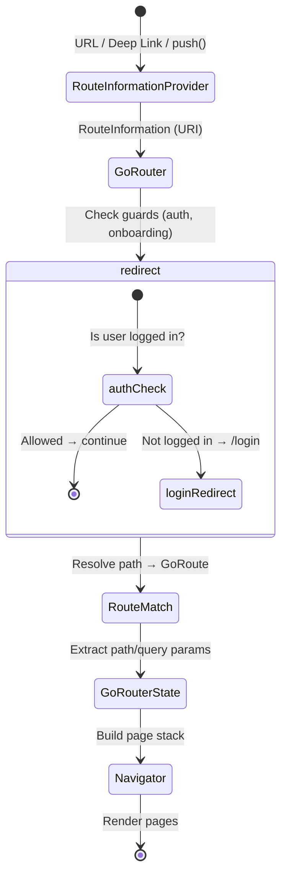

# 4. Omni-Platform Routing (GoRouter) 🟡

> **What you'll learn:**
> - Why Navigator 1.0 (`Navigator.push`) breaks deep linking, browser history, and multi-window scenarios.
> - How GoRouter (Navigator 2.0) models navigation as a **declarative function of state** rather than imperative push/pop commands.
> - How to handle deep links on mobile, typed URL paths on the web, and multi-window routing on desktop OSs.
> - How to guard routes based on authentication state, integrating Riverpod/BLoC providers with the routing layer.

---

## Navigator 1.0 vs. Navigator 2.0: Why the Imperative Model Breaks

Navigator 1.0 (`Navigator.push`, `Navigator.pop`) models navigation as a **stack of anonymous routes** that the app pushes and pops imperatively. This works for simple mobile apps but shatters on three omni-platform requirements:

| Requirement | Navigator 1.0 | Navigator 2.0 (GoRouter) |
|-------------|---------------|--------------------------|
| **Deep links** (open app to `/products/42`) | Manual `onGenerateRoute` with string parsing. Fragile, no type safety. | ✅ Declarative route tree with path parameters. URL → route resolved automatically. |
| **Browser URL bar** (Web) | URL doesn't update. Back button broken. Users can't bookmark or share. | ✅ URL reflects current route. Browser forward/back works. History entries are real. |
| **Multi-window** (Desktop) | Single Navigator for single window. No way to route independent windows. | ✅ Each window can have its own `GoRouter` with independent navigation state. |
| **Route guards** (auth) | `if (!loggedIn) Navigator.pushReplacement(loginRoute)` — scattered checks, race conditions. | ✅ `redirect` callback runs before every navigation. Centralized, testable. |

---

## GoRouter Architecture

GoRouter wraps Navigator 2.0's `Router` and `RouteInformationParser` APIs into a declarative, readable route tree.



### Defining the Route Tree

```dart
final goRouter = GoRouter(
  initialLocation: '/',
  debugLogDiagnostics: true, // ✅ Logs every navigation in debug mode
  
  // ✅ Global redirect — runs BEFORE any route resolves
  redirect: (context, state) {
    final isLoggedIn = /* read auth state */;
    final isLoginRoute = state.matchedLocation == '/login';

    if (!isLoggedIn && !isLoginRoute) return '/login';
    if (isLoggedIn && isLoginRoute) return '/';
    return null; // No redirect
  },

  routes: [
    // ✅ Shell route — persistent scaffold with bottom nav / sidebar
    ShellRoute(
      builder: (context, state, child) => AppShell(child: child),
      routes: [
        GoRoute(
          path: '/',
          name: 'home',
          builder: (context, state) => const HomeScreen(),
        ),
        GoRoute(
          path: '/products',
          name: 'products',
          builder: (context, state) => const ProductListScreen(),
          routes: [
            // ✅ Nested route — /products/:id
            GoRoute(
              path: ':id',
              name: 'product-detail',
              builder: (context, state) {
                final id = state.pathParameters['id']!;
                return ProductDetailScreen(productId: id);
              },
            ),
          ],
        ),
        GoRoute(
          path: '/settings',
          name: 'settings',
          builder: (context, state) => const SettingsScreen(),
        ),
      ],
    ),
    // ✅ Login route — outside the ShellRoute (no bottom nav)
    GoRoute(
      path: '/login',
      name: 'login',
      builder: (context, state) => const LoginScreen(),
    ),
  ],
);
```

---

## Type-Safe Navigation

String-based paths (`context.go('/products/42')`) are error-prone. GoRouter supports **named routes** with type-safe parameters:

```dart
// ✅ Navigate by name — compile-time safety on the route name
context.goNamed(
  'product-detail',
  pathParameters: {'id': product.id},
  queryParameters: {'tab': 'reviews'},
);

// URL result: /products/42?tab=reviews
```

For even stronger type safety, use `go_router_builder` with code generation:

```dart
// Define a typed route
@TypedGoRoute<ProductDetailRoute>(path: '/products/:id')
class ProductDetailRoute extends GoRouteData {
  final String id;
  const ProductDetailRoute({required this.id});

  @override
  Widget build(BuildContext context, GoRouterState state) =>
    ProductDetailScreen(productId: id);
}

// Navigate — fully type-safe, no strings
ProductDetailRoute(id: product.id).go(context);
```

---

## Integrating Auth State with Route Guards

### The Brittle Way vs. The Resilient Way

```dart
// 💥 JANK HAZARD: Checking auth inside individual screens.
// Race condition: screen builds, makes API call, THEN discovers
// the token is expired. User sees a flash of content → error → login.
class ProfileScreen extends StatefulWidget {
  @override
  State<ProfileScreen> createState() => _ProfileScreenState();
}

class _ProfileScreenState extends State<ProfileScreen> {
  @override
  void initState() {
    super.initState();
    // 💥 Auth check happens AFTER the screen is already building
    if (!AuthService.instance.isLoggedIn) {
      WidgetsBinding.instance.addPostFrameCallback((_) {
        Navigator.of(context).pushReplacementNamed('/login');
      });
    }
  }
  // ...
}
```

```dart
// ✅ FIX: Centralized redirect in GoRouter, powered by Riverpod.
// The redirect runs BEFORE the route builds. User never sees protected content.

final authProvider = NotifierProvider<AuthNotifier, AuthState>(AuthNotifier.new);

final goRouterProvider = Provider<GoRouter>((ref) {
  final authState = ref.watch(authProvider);

  return GoRouter(
    initialLocation: '/',
    // ✅ refreshListenable forces re-evaluation when auth changes
    refreshListenable: GoRouterRefreshStream(
      ref.watch(authProvider.notifier).stream,
    ),
    redirect: (context, state) {
      final isLoggedIn = authState.isAuthenticated;
      final isLoginRoute = state.matchedLocation == '/login';
      final isOnboarding = state.matchedLocation == '/onboarding';

      // Not logged in → force login (unless already on login/onboarding)
      if (!isLoggedIn && !isLoginRoute && !isOnboarding) return '/login';

      // Logged in but onboarding incomplete → force onboarding
      if (isLoggedIn && !authState.onboardingComplete && !isOnboarding) {
        return '/onboarding';
      }

      // Logged in, trying to access login → redirect home
      if (isLoggedIn && isLoginRoute) return '/';

      return null; // ✅ No redirect — allow navigation
    },
    routes: [ /* ... */ ],
  );
});

// ✅ Helper to bridge Riverpod streams to GoRouter's Listenable
class GoRouterRefreshStream extends ChangeNotifier {
  GoRouterRefreshStream(Stream<dynamic> stream) {
    _subscription = stream.listen((_) => notifyListeners());
  }
  late final StreamSubscription _subscription;

  @override
  void dispose() {
    _subscription.cancel();
    super.dispose();
  }
}
```

---

## Platform-Specific Routing Concerns

### Deep Links (Mobile)

On iOS and Android, the OS can launch your app with a URL. GoRouter handles this automatically if configured:

```dart
// iOS: Configure Associated Domains in Xcode
// applinks:yourapp.com

// Android: Add intent filters in AndroidManifest.xml
// <data android:scheme="https" android:host="yourapp.com" />

// GoRouter handles the rest — the URL maps to your route tree.
// /products/42 → GoRoute(path: '/products/:id')
```

### Web: URL Bar and History

On Web, GoRouter uses `PathUrlStrategy` (clean URLs) or `HashUrlStrategy`:

```dart
// In main.dart — use path URLs (no # in URL)
void main() {
  usePathUrlStrategy(); // ✅ /products/42 instead of /#/products/42
  runApp(const ProviderScope(child: MyApp()));
}
```

| Aspect | PathUrlStrategy | HashUrlStrategy |
|--------|----------------|-----------------|
| URL appearance | `yourapp.com/products/42` | `yourapp.com/#/products/42` |
| Requires server config | **Yes** — server must route all paths to `index.html` | No — hash fragment handled client-side |
| SEO | Better (paths visible to crawlers) | Worse (fragments ignored by crawlers) |
| Default | ✅ Default since Flutter 3.x | Legacy |

### Desktop: Multi-Window Routing

On macOS, Windows, and Linux, you may have multiple windows. Each window needs its own navigation state:

```dart
// Each window gets its own GoRouter instance.
// This is typically managed by a window management package
// (e.g., desktop_multi_window or bitsdojo_window).

// Main window
final mainRouter = GoRouter(
  initialLocation: '/',
  routes: mainWindowRoutes,
);

// Settings window (independent)
final settingsRouter = GoRouter(
  initialLocation: '/settings',
  routes: settingsWindowRoutes,
);
```

---

## ShellRoute: Persistent Navigation Chrome

`ShellRoute` wraps child routes in a persistent scaffold — a bottom navigation bar on mobile, a sidebar on desktop:

```dart
ShellRoute(
  builder: (context, state, child) {
    return AdaptiveShell(
      currentPath: state.matchedLocation,
      child: child, // ✅ This is the routed page content
    );
  },
  routes: [
    GoRoute(path: '/', builder: (_, __) => const HomeScreen()),
    GoRoute(path: '/search', builder: (_, __) => const SearchScreen()),
    GoRoute(path: '/profile', builder: (_, __) => const ProfileScreen()),
  ],
)

// The AdaptiveShell switches between bottom nav and sidebar
class AdaptiveShell extends StatelessWidget {
  final String currentPath;
  final Widget child;
  const AdaptiveShell({super.key, required this.currentPath, required this.child});

  @override
  Widget build(BuildContext context) {
    final isDesktop = MediaQuery.sizeOf(context).width > 800;

    if (isDesktop) {
      return Row(
        children: [
          NavigationRail(
            selectedIndex: _indexFromPath(currentPath),
            onDestinationSelected: (i) => _navigateTo(context, i),
            destinations: const [ /* ... */ ],
          ),
          const VerticalDivider(width: 1),
          Expanded(child: child), // ✅ Routed content
        ],
      );
    }

    return Scaffold(
      body: child, // ✅ Routed content
      bottomNavigationBar: NavigationBar(
        selectedIndex: _indexFromPath(currentPath),
        onDestinationSelected: (i) => _navigateTo(context, i),
        destinations: const [ /* ... */ ],
      ),
    );
  }
}
```

---

## Nested Navigation: Stateful Shell Routes

When you have a bottom navigation bar with multiple tabs, each maintaining its own navigation stack, use `StatefulShellRoute`:

```dart
StatefulShellRoute.indexedStack(
  builder: (context, state, navigationShell) {
    return ScaffoldWithNavBar(navigationShell: navigationShell);
  },
  branches: [
    StatefulShellBranch(
      routes: [
        GoRoute(
          path: '/home',
          builder: (_, __) => const HomeScreen(),
          routes: [
            GoRoute(path: 'detail/:id', builder: (_, state) => 
              DetailScreen(id: state.pathParameters['id']!)),
          ],
        ),
      ],
    ),
    StatefulShellBranch(
      routes: [
        GoRoute(
          path: '/search',
          builder: (_, __) => const SearchScreen(),
          routes: [
            GoRoute(path: 'results', builder: (_, __) => const ResultsScreen()),
          ],
        ),
      ],
    ),
  ],
)
```

Each branch maintains its own `Navigator` — navigating away from a tab and back preserves the tab's navigation stack.

---

<details>
<summary><strong>🏋️ Exercise: Full Routing Architecture</strong> (click to expand)</summary>

### Challenge

You are building an e-commerce app deployed to iOS, Android, Web, and macOS. The routing requirements are:

1. **Unauthenticated routes:** `/login`, `/register`, `/forgot-password`.
2. **Authenticated routes:** `/` (home), `/products`, `/products/:id`, `/cart`, `/profile`, `/profile/orders`, `/profile/orders/:orderId`.
3. **Admin routes:** `/admin/dashboard`, `/admin/products` — only visible to users with `role == 'admin'`.
4. **Deep linking:** `https://shop.example.com/products/42` must open the product detail screen on mobile and web.
5. **Shell:** Authenticated routes use a `ShellRoute` with a bottom nav (3 tabs: Home, Products, Profile). Cart is a **full-screen** route (no bottom nav).
6. **Web requirements:** Clean URL paths, browser back/forward works, refresh preserves current route.

**Your tasks:**
1. Define the complete `GoRouter` route tree.
2. Write the `redirect` function that handles auth + admin role checks.
3. Explain what happens when a logged-out user deep links to `/products/42`.

<details>
<summary>🔑 Solution</summary>

**1. Complete Route Tree**

```dart
final goRouterProvider = Provider<GoRouter>((ref) {
  final authState = ref.watch(authProvider);

  return GoRouter(
    initialLocation: '/',
    debugLogDiagnostics: true,
    redirect: (context, state) => _globalRedirect(authState, state),
    routes: [
      // === Unauthenticated routes (no shell) ===
      GoRoute(path: '/login', name: 'login',
        builder: (_, __) => const LoginScreen()),
      GoRoute(path: '/register', name: 'register',
        builder: (_, __) => const RegisterScreen()),
      GoRoute(path: '/forgot-password', name: 'forgot-password',
        builder: (_, __) => const ForgotPasswordScreen()),

      // === Authenticated routes with shell ===
      ShellRoute(
        builder: (context, state, child) => AppShell(
          currentLocation: state.matchedLocation,
          child: child,
        ),
        routes: [
          GoRoute(path: '/', name: 'home',
            builder: (_, __) => const HomeScreen()),
          GoRoute(
            path: '/products', name: 'products',
            builder: (_, __) => const ProductListScreen(),
            routes: [
              GoRoute(path: ':id', name: 'product-detail',
                builder: (_, state) => ProductDetailScreen(
                  productId: state.pathParameters['id']!,
                )),
            ],
          ),
          GoRoute(
            path: '/profile', name: 'profile',
            builder: (_, __) => const ProfileScreen(),
            routes: [
              GoRoute(
                path: 'orders', name: 'orders',
                builder: (_, __) => const OrderListScreen(),
                routes: [
                  GoRoute(path: ':orderId', name: 'order-detail',
                    builder: (_, state) => OrderDetailScreen(
                      orderId: state.pathParameters['orderId']!,
                    )),
                ],
              ),
            ],
          ),
        ],
      ),

      // === Cart — full screen, NO shell ===
      GoRoute(path: '/cart', name: 'cart',
        builder: (_, __) => const CartScreen()),

      // === Admin routes (role-gated) ===
      ShellRoute(
        builder: (context, state, child) => AdminShell(child: child),
        routes: [
          GoRoute(path: '/admin/dashboard', name: 'admin-dashboard',
            builder: (_, __) => const AdminDashboardScreen()),
          GoRoute(path: '/admin/products', name: 'admin-products',
            builder: (_, __) => const AdminProductsScreen()),
        ],
      ),
    ],
  );
});
```

**2. Redirect Function**

```dart
String? _globalRedirect(AuthState authState, GoRouterState routerState) {
  final location = routerState.matchedLocation;
  final isLoggedIn = authState.isAuthenticated;
  
  // Define route groups
  const publicRoutes = {'/login', '/register', '/forgot-password'};
  final isPublicRoute = publicRoutes.contains(location);
  final isAdminRoute = location.startsWith('/admin');

  // Rule 1: Not logged in + accessing protected route → login
  // ✅ Preserve intended destination so we can redirect after login
  if (!isLoggedIn && !isPublicRoute) {
    return Uri(
      path: '/login',
      queryParameters: {'redirect': location}, // ✅ Return URL
    ).toString();
  }

  // Rule 2: Logged in + accessing public route → home
  if (isLoggedIn && isPublicRoute) return '/';

  // Rule 3: Accessing admin route without admin role → home
  if (isAdminRoute && authState.user?.role != 'admin') return '/';

  return null; // ✅ No redirect needed
}
```

**3. Deep Link Flow: Logged-Out User → `/products/42`**

1. **OS opens the app** and passes the URL `https://shop.example.com/products/42` to Flutter's `RouteInformationProvider`.
2. **GoRouter receives** `RouteInformation(uri: /products/42)`.
3. **`redirect` runs FIRST** — before any route is matched or any widget is built.
4. `isLoggedIn` is `false`. `/products/42` is not a public route.
5. **Redirect returns** `/login?redirect=%2Fproducts%2F42`.
6. **`LoginScreen` builds.** The user sees the login form. The intended destination is preserved in the query parameter.
7. **User logs in.** `authProvider` emits a new authenticated state.
8. `GoRouter.refreshListenable` fires, re-evaluating redirect.
9. **Post-login redirect logic** in `LoginScreen`:
   ```dart
   // After successful login:
   final redirect = GoRouterState.of(context).uri.queryParameters['redirect'];
   if (redirect != null) {
     context.go(redirect); // ✅ Navigate to /products/42
   } else {
     context.go('/');
   }
   ```
10. **User arrives at `ProductDetailScreen(productId: '42')`** — as if they had navigated there directly.

</details>
</details>

---

> **Key Takeaways**
> - Navigator 1.0 (`push`/`pop`) breaks on deep links, web URLs, and multi-window desktop routing. Use **GoRouter** (Navigator 2.0).
> - GoRouter models navigation as a **declarative function of state**: URL → route match → redirect check → page stack.
> - Use **`ShellRoute`** for persistent navigation chrome (bottom nav, sidebar). Use **`StatefulShellRoute`** for tab-level navigation stacks.
> - **Route guards** via `redirect` run *before* any protected route builds. Centralize auth/role checks there — never inside individual screens.
> - On Web, use `usePathUrlStrategy()` for clean URLs. On desktop, consider separate `GoRouter` instances per window.
> - Integrate GoRouter with Riverpod/BLoC via `refreshListenable` to re-evaluate redirects when auth state changes.

---

> **See also:**
> - [Chapter 3: State Management at Scale](ch03-state-management.md) — The auth provider that powers route guards.
> - [Chapter 7: Adaptive Design Systems](ch07-adaptive-design.md) — Building the `AdaptiveShell` that switches between bottom nav and sidebar based on platform.
> - [Chapter 8: Capstone Project](ch08-capstone.md) — Full routing implementation for the Markdown IDE.
