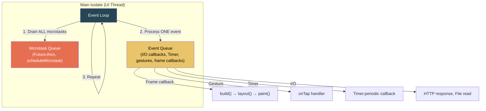
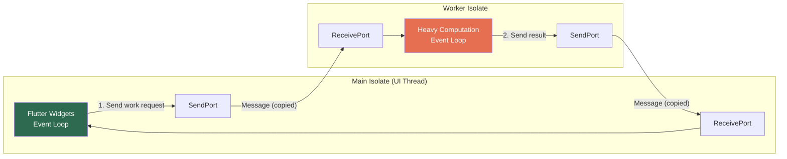

# 5. Concurrency and Isolates 🔴

> **What you'll learn:**
> - How Dart's single-threaded event loop works, and why long-running synchronous code causes dropped frames.
> - How **Isolates** provide true OS-thread parallelism with memory isolation — and the constraints this imposes on data sharing.
> - When to use `compute()` (simple) vs. `Isolate.spawn` (control) vs. long-lived worker Isolates (persistent background engines).
> - Real patterns for parsing massive JSON, processing images, and running local database queries on background Isolates without janking the UI.

---

## Dart's Event Loop: The Single-Thread Reality

Dart runs your Flutter app on a **single thread** called the **UI thread** (or "main isolate"). This thread manages a cooperative event loop with two queues:



**Critical insight:** `async`/`await` does NOT create threads. It cooperatively yields to the event loop. An `await http.get(url)` pauses the *current function* and returns control to the event loop, which processes other events (including frame callbacks) until the HTTP response arrives.

### When the Event Loop Stalls

```dart
// 💥 JANK HAZARD: Synchronous JSON parsing on the UI thread.
// The event loop cannot process frame callbacks while this runs.
// At 60fps, a frame must complete in 16.6ms. If jsonDecode takes 200ms,
// you drop ~12 frames.
void loadData() async {
  final response = await http.get(Uri.parse('https://api.example.com/huge.json'));
  // ✅ The await above is fine — I/O is non-blocking.

  // 💥 THIS is the problem — jsonDecode is synchronous CPU work.
  final data = jsonDecode(response.body); // Blocks UI thread for 200ms
  setState(() => _items = data['items']);
}
```

The fix? Move CPU-bound work to a separate Isolate.

---

## Isolates: True Parallelism

An Isolate is a **separate Dart execution context** with its own:
- **Heap** (memory) — no shared mutable state.
- **Event loop** — runs independently.
- **Stack** — can execute arbitrary Dart code.

Communication between Isolates happens via **message passing** (SendPort/ReceivePort). Messages are either:
- **Copied** (serialized and deserialized — safe but has overhead for large objects).
- **Transferred** (ownership moves — zero-copy for `TransferableTypedData` and some typed data).



### Memory Isolation: What You CAN'T Share

| Can Share (via message) | Cannot Share |
|------------------------|-------------|
| Primitive types (int, double, bool, String) | Closures that capture variables |
| Lists, Maps, Sets of serializable types | `ReceivePort` (not sendable) |
| `SendPort` (to establish bidirectional communication) | Native resources (file handles, sockets) |
| `TransferableTypedData` (zero-copy transfer) | Anything referencing `dart:ui` (`Canvas`, `Image`, etc.) |
| User-defined classes (copied via field serialization) | Riverpod `Ref`, BLoC instances, any framework object |

---

## `compute()`: The Simple Path

`compute()` is a convenience wrapper. It spawns a temporary Isolate, runs a single top-level function, and returns the result:

```dart
// ✅ FIX: Parse JSON on a background Isolate.
void loadData() async {
  final response = await http.get(Uri.parse('https://api.example.com/huge.json'));

  // compute() spawns an Isolate, runs _parseJson, returns result.
  // The UI thread is free to render frames while parsing happens.
  final items = await compute(_parseJson, response.body);
  setState(() => _items = items);
}

// ✅ MUST be a top-level or static function (no closures/instance methods).
List<Item> _parseJson(String body) {
  final data = jsonDecode(body) as Map<String, dynamic>;
  return (data['items'] as List)
      .map((json) => Item.fromJson(json as Map<String, dynamic>))
      .toList();
}
```

### `compute()` Limitations

| Limitation | Why It Matters |
|-----------|---------------|
| Single message in, single message out | Cannot stream progress updates. |
| Spawns a new Isolate every call | Isolate startup takes ~5–30ms. Unacceptable for frequent calls. |
| Top-level/static function only | Cannot capture instance state or closures. |
| Message copying overhead | Large objects are serialized/deserialized. For a 10MB JSON string, this adds ~10ms of copy time. |

---

## `Isolate.spawn`: More Control

`Isolate.spawn` gives you control over the Isolate lifecycle and bidirectional communication:

```dart
// ✅ Spawn an Isolate with bidirectional communication
Future<List<Item>> parseJsonInIsolate(String jsonBody) async {
  // Create a ReceivePort to get the result back
  final receivePort = ReceivePort();

  // Spawn the Isolate, passing the SendPort for the worker to reply on
  await Isolate.spawn(
    _isolateEntryPoint,
    (receivePort.sendPort, jsonBody),
  );

  // Wait for the single result
  final result = await receivePort.first as List<Item>;
  return result;
}

// Entry point — runs on the worker Isolate
void _isolateEntryPoint((SendPort sendPort, String jsonBody) message) {
  final (sendPort, jsonBody) = message;

  final data = jsonDecode(jsonBody) as Map<String, dynamic>;
  final items = (data['items'] as List)
      .map((json) => Item.fromJson(json as Map<String, dynamic>))
      .toList();

  // Send result back to main Isolate
  Isolate.exit(sendPort, items); // ✅ Isolate.exit transfers ownership (zero-copy)
}
```

**`Isolate.exit`** is critical for performance: instead of copying the result, it **transfers ownership** of the data to the destination Isolate. For large lists, this eliminates the serialization overhead.

---

## Long-Lived Worker Isolates: Background Engines

For persistent background work (database engine, file watcher, image processing pipeline), spawn a long-lived Isolate with bidirectional communication:

```dart
/// A persistent background worker for database operations.
class DatabaseWorker {
  late final Isolate _isolate;
  late final SendPort _sendPort;
  final ReceivePort _receivePort = ReceivePort();
  final Map<int, Completer<dynamic>> _pending = {};
  int _nextId = 0;

  Future<void> start() async {
    _isolate = await Isolate.spawn(
      _workerMain,
      _receivePort.sendPort,
    );

    // First message from worker is its SendPort
    final firstMessage = await _receivePort.first;
    if (firstMessage is SendPort) {
      _sendPort = firstMessage;
    }

    // Listen for responses
    _receivePort.listen((message) {
      if (message is (int, dynamic)) {
        final (id, result) = message;
        _pending.remove(id)?.complete(result);
      }
    });
  }

  /// Send a query to the background Isolate and await the result.
  Future<List<Map<String, dynamic>>> query(String sql, [List<dynamic>? params]) {
    final id = _nextId++;
    final completer = Completer<List<Map<String, dynamic>>>();
    _pending[id] = completer;
    _sendPort.send((id, 'query', sql, params));
    return completer.future;
  }

  void dispose() {
    _isolate.kill(priority: Isolate.beforeNextEvent);
    _receivePort.close();
  }
}

// Worker entry point — runs on background Isolate
void _workerMain(SendPort mainSendPort) {
  final workerReceivePort = ReceivePort();

  // Send our SendPort back to main Isolate
  mainSendPort.send(workerReceivePort.sendPort);

  // Open database on THIS Isolate (native resource, can't share)
  final db = sqlite3.openInMemory(); // or open file

  workerReceivePort.listen((message) {
    if (message is (int, String, String, List<dynamic>?)) {
      final (id, command, sql, params) = message;
      if (command == 'query') {
        final stmt = db.prepare(sql);
        final results = stmt.select(params ?? []);
        mainSendPort.send((id, results.toList()));
        stmt.dispose();
      }
    }
  });
}
```

---

## Comparison: `compute` vs. `Isolate.spawn` vs. Long-Lived Worker

| Aspect | `compute()` | `Isolate.spawn` | Long-Lived Worker |
|--------|------------|-----------------|-------------------|
| Startup cost | ~5–30ms per call | ~5–30ms once | ~5–30ms once |
| Communication | One-shot (in → out) | Flexible (ports) | Bidirectional, persistent |
| Data transfer | Copied (slow for large data) | Can use `Isolate.exit` (zero-copy) | Message passing (copy or transfer) |
| Use case | Rare, simple tasks | One-off complex tasks | Database engines, file watchers, image pipelines |
| Code complexity | Minimal | Moderate | Higher (protocol, cleanup) |

---

## Real Patterns

### Pattern 1: Image Processing Pipeline

```dart
// ✅ Process images on a background Isolate to avoid jank during scrolling.
final processedImageProvider = FutureProvider.family<Uint8List, String>(
  (ref, imagePath) async {
    // Read file bytes on main Isolate (I/O is async, non-blocking)
    final bytes = await File(imagePath).readAsBytes();

    // Heavy processing (resize, crop, filter) on background Isolate
    return compute(_processImage, bytes);
  },
);

Uint8List _processImage(Uint8List inputBytes) {
  // Using the `image` package — all CPU-bound work
  final original = img.decodeImage(inputBytes)!;
  final resized = img.copyResize(original, width: 400);
  final filtered = img.adjustColor(resized, contrast: 1.2);
  return Uint8List.fromList(img.encodePng(filtered));
}
```

### Pattern 2: Full-Text Search on Background Isolate

```dart
// ✅ Drift (SQLite) database running entirely on a background Isolate.
// All queries execute off the UI thread.
@DriftDatabase(tables: [Notes])
class AppDatabase extends _$AppDatabase {
  AppDatabase() : super(_openConnection());

  @override
  int get schemaVersion => 1;

  // ✅ Full-text search — can scan thousands of rows without janking UI.
  Future<List<Note>> searchNotes(String query) {
    return (select(notes)
      ..where((n) => n.content.contains(query))
      ..orderBy([(n) => OrderingTerm.desc(n.updatedAt)])
      ..limit(50)
    ).get();
  }
}

// ✅ Drift runs the database on a background Isolate via NativeDatabase.createInBackground()
LazyDatabase _openConnection() {
  return LazyDatabase(() async {
    final dir = await getApplicationDocumentsDirectory();
    final file = File(p.join(dir.path, 'app.db'));
    return NativeDatabase.createInBackground(file);
  });
}
```

### Pattern 3: Streaming Progress from an Isolate

```dart
// ✅ Report progress during a long-running background task.
Stream<double> processLargeFile(String path) async* {
  final receivePort = ReceivePort();

  await Isolate.spawn(
    _processFileWorker,
    (receivePort.sendPort, path),
  );

  await for (final message in receivePort) {
    if (message is double) {
      yield message; // Progress 0.0 → 1.0
    } else if (message == 'done') {
      break;
    }
  }
}

void _processFileWorker((SendPort port, String path) args) {
  final (port, path) = args;
  final file = File(path);
  final bytes = file.readAsBytesSync();
  final total = bytes.length;

  for (var i = 0; i < total; i += 4096) {
    // Process chunk...
    final chunk = bytes.sublist(i, (i + 4096).clamp(0, total));
    _processChunk(chunk);

    // Report progress
    port.send((i + chunk.length) / total);
  }

  port.send('done');
  Isolate.exit();
}
```

---

## Measuring the Impact

Use Flutter DevTools' **Performance** tab to see the difference:

```
BEFORE (JSON parse on UI thread):
┌─ Frame 1 ─────────────────────────────────┐
│ UI Thread:  build(2ms) + jsonDecode(180ms) │ = 182ms 💥
│ Raster:     paint(3ms)                     │
└────────────────────────────────────────────┘
11 frames dropped. User sees freeze.

AFTER (JSON parse on background Isolate):
┌─ Frame 1 ─────────────────┐
│ UI Thread:  build(2ms)     │ = 2ms ✅   (background Isolate working)
│ Raster:     paint(3ms)     │
├─ Frame 2 ─────────────────┤
│ UI Thread:  build(2ms)     │ = 2ms ✅   (still smooth)
│ Raster:     paint(3ms)     │
├─ ... 10 more frames ...   ┤ ✅ All under 16.6ms
├─ Frame 12 ────────────────┤
│ UI Thread:  build(3ms)     │ = 3ms ✅   (Isolate result arrived, setState)
│ Raster:     paint(3ms)     │
└───────────────────────────┘
0 frames dropped. User sees smooth animation during load.
```

---

<details>
<summary><strong>🏋️ Exercise: Building a Search-As-You-Type Backend</strong> (click to expand)</summary>

### Challenge

You are building a note-taking app with 10,000+ notes stored in a local SQLite database (using Drift). The search bar provides results as the user types. Requirements:

1. Search must run on a **background Isolate** (Drift's background connection).
2. Search should **debounce** — only fire after 300ms of no typing.
3. If the user keeps typing, **cancel** the previous in-flight search.
4. Show a loading indicator while searching.
5. Show results immediately when the search completes.

**Your tasks:**
1. Design the state management (Riverpod or BLoC) for the search feature.
2. Implement debouncing and cancellation.
3. Explain how the Isolate boundary works with Drift's background database.

<details>
<summary>🔑 Solution</summary>

**Architecture: Riverpod with debounce via provider invalidation**

```dart
// ✅ Step 1: A provider that holds the current search query.
// Setting this triggers downstream providers.
final searchQueryProvider = StateProvider<String>((ref) => '');

// ✅ Step 2: A debounced search provider.
// Uses ref.watch(searchQueryProvider) and a Timer for debounce.
final searchResultsProvider = FutureProvider.autoDispose<List<Note>>((ref) async {
  final query = ref.watch(searchQueryProvider);

  if (query.isEmpty) return []; // ✅ No query → no results

  // ✅ Debounce: wait 300ms before executing.
  // If the provider is invalidated (query changes) during this wait,
  // Riverpod disposes this provider and starts a new one.
  // This is the cancellation mechanism — no manual Timer needed.
  await Future.delayed(const Duration(milliseconds: 300));

  // ✅ Check if this provider was cancelled during the delay.
  // ref.exists returns false if the provider was disposed.
  if (!ref.exists(searchQueryProvider)) return [];

  // ✅ Step 3: Execute search on background Isolate via Drift.
  // Drift's NativeDatabase.createInBackground() runs SQLite on
  // a dedicated background Isolate. This query is non-blocking.
  final db = ref.watch(databaseProvider);
  return db.searchNotes(query);
});
```

**Actually, the canonical Riverpod approach for debounce+cancellation is:**

```dart
final searchResultsProvider = FutureProvider.autoDispose<List<Note>>((ref) async {
  final query = ref.watch(searchQueryProvider);
  if (query.isEmpty) return [];

  // ✅ Debounce — if the user types another character within 300ms,
  // this provider is disposed (because searchQueryProvider changed),
  // and a NEW instance starts. The old future is abandoned.
  // keepAlive link prevents premature disposal AFTER debounce completes.
  final link = ref.keepAlive();

  // Start a timer. If the provider is disposed before it fires,
  // the timer is effectively cancelled because the ref is dead.
  await Future.delayed(const Duration(milliseconds: 300));

  // If we got here, 300ms passed without another keystroke.
  // Release the keepAlive to allow normal autoDispose behavior.
  ref.onDispose(link.close);

  // ✅ Run search on Drift's background Isolate
  final db = ref.watch(databaseProvider);
  return db.searchNotes(query);
});
```

**UI:**

```dart
class SearchScreen extends ConsumerWidget {
  const SearchScreen({super.key});

  @override
  Widget build(BuildContext context, WidgetRef ref) {
    final results = ref.watch(searchResultsProvider);

    return Column(
      children: [
        TextField(
          onChanged: (value) =>
            ref.read(searchQueryProvider.notifier).state = value,
          decoration: const InputDecoration(
            hintText: 'Search notes...',
            prefixIcon: Icon(Icons.search),
          ),
        ),
        Expanded(
          child: results.when(
            loading: () => const Center(child: CircularProgressIndicator()),
            error: (e, _) => Center(child: Text('Error: $e')),
            data: (notes) => ListView.builder(
              itemCount: notes.length,
              itemBuilder: (_, i) => NoteCard(note: notes[i]),
            ),
          ),
        ),
      ],
    );
  }
}
```

**How the Isolate boundary works with Drift:**

1. `NativeDatabase.createInBackground(file)` spawns a dedicated background Isolate.
2. Drift sends SQL queries from the main Isolate to the background Isolate via `SendPort`.
3. The background Isolate runs the query synchronously (blocking its own event loop, but that's fine — it has no UI).
4. Results are serialized and sent back to the main Isolate via message passing.
5. The main Isolate's event loop receives the result as an asynchronous event — no UI jank.

**Cancellation flow:**
1. User types "h" → `searchQueryProvider` = "h".
2. `searchResultsProvider` starts, enters 300ms debounce wait.
3. User types "e" (100ms later) → `searchQueryProvider` = "he".
4. Riverpod disposes the old `searchResultsProvider` (it was `autoDispose` and its dependency changed).
5. A NEW `searchResultsProvider` starts with query "he", enters 300ms debounce wait.
6. User stops typing. 300ms passes.
7. Search executes for "he" on background Isolate. Results returned.

No manual `Timer.cancel()`. No `CancelToken`. Riverpod's reactive disposal IS the cancellation mechanism.

</details>
</details>

---

> **Key Takeaways**
> - Dart runs on a **single UI thread**. `async`/`await` cooperates with the event loop but does NOT create threads.
> - **Isolates** are separate Dart execution contexts with their own heap. Communication is via **message passing** (copy or transfer).
> - Use **`compute()`** for simple, one-off CPU tasks. Use **`Isolate.spawn`** for more control. Use **long-lived worker Isolates** for persistent background engines (databases, file watchers).
> - **`Isolate.exit(sendPort, data)`** transfers data ownership (zero-copy) instead of serializing.
> - Database libraries like **Drift** handle Isolate management for you — `createInBackground()` runs SQLite on a dedicated background Isolate.
> - Always **measure** with DevTools Performance tab: if a frame exceeds 16.6ms on the UI thread, find the synchronous work and move it off-thread.

---

> **See also:**
> - [Chapter 1: The Three Trees](ch01-three-trees.md) — Understanding the frame pipeline (build → layout → paint) that the event loop must complete in 16.6ms.
> - [Chapter 6: Method Channels and FFI](ch06-method-channels-ffi.md) — FFI calls also run on the UI thread unless explicitly offloaded to Isolates.
> - [Chapter 8: Capstone Project](ch08-capstone.md) — Integrating background Isolates for the Markdown IDE's full-text search.
