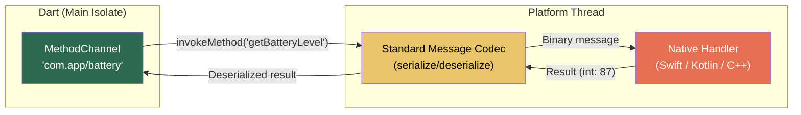

# 6. Method Channels and FFI 🔴

> **What you'll learn:**
> - How **Platform Channels** (MethodChannel/EventChannel) enable Dart to invoke native Swift/Kotlin/C++ code and receive callbacks.
> - The codec system that serializes Dart types to platform-native types across the channel boundary.
> - How **`dart:ffi`** (Foreign Function Interface) binds Dart directly to C/C++/Rust shared libraries — bypassing the platform channel message loop entirely.
> - When to use Platform Channels (platform API access) vs. FFI (high-performance computation) and how to combine them safely.

---

## Platform Channels: Talking to Native Code

Platform Channels are Flutter's mechanism for calling native platform APIs — things that Dart fundamentally cannot do alone: biometric authentication, Bluetooth, file pickers, OS notifications, camera hardware, and platform-specific system services.



### MethodChannel: Request/Response

```dart
// ══════════════════════════════════
// DART SIDE
// ══════════════════════════════════
class BatteryService {
  static const _channel = MethodChannel('com.app/battery');

  /// Invoke native method and get the result.
  Future<int> getBatteryLevel() async {
    try {
      final level = await _channel.invokeMethod<int>('getBatteryLevel');
      return level ?? -1;
    } on PlatformException catch (e) {
      // ✅ Handle native-side errors gracefully
      throw BatteryException('Native error: ${e.message}');
    } on MissingPluginException {
      // ✅ Handle platforms where the channel isn't implemented
      return -1; // Unsupported platform
    }
  }
}
```

```swift
// ══════════════════════════════════
// iOS SIDE (Swift — AppDelegate.swift)
// ══════════════════════════════════
import Flutter
import UIKit

@main
@objc class AppDelegate: FlutterAppDelegate {
  override func application(
    _ application: UIApplication,
    didFinishLaunchingWithOptions launchOptions: [UIApplication.LaunchOptionsKey: Any]?
  ) -> Bool {
    let controller = window?.rootViewController as! FlutterViewController
    let channel = FlutterMethodChannel(
      name: "com.app/battery",
      binaryMessenger: controller.binaryMessenger
    )

    channel.setMethodCallHandler { (call, result) in
      if call.method == "getBatteryLevel" {
        let device = UIDevice.current
        device.isBatteryMonitoringEnabled = true
        let level = Int(device.batteryLevel * 100)
        result(level) // ✅ Send result back to Dart
      } else {
        result(FlutterMethodNotImplemented) // ✅ Unknown method
      }
    }

    GeneratedPluginRegistrant.register(with: self)
    return super.application(application, didFinishLaunchingWithOptions: launchOptions)
  }
}
```

```kotlin
// ══════════════════════════════════
// ANDROID SIDE (Kotlin — MainActivity.kt)
// ══════════════════════════════════
package com.example.app

import android.os.BatteryManager
import android.content.Context
import io.flutter.embedding.android.FlutterActivity
import io.flutter.embedding.engine.FlutterEngine
import io.flutter.plugin.common.MethodChannel

class MainActivity : FlutterActivity() {
    private val CHANNEL = "com.app/battery"

    override fun configureFlutterEngine(flutterEngine: FlutterEngine) {
        super.configureFlutterEngine(flutterEngine)
        MethodChannel(flutterEngine.dartExecutor.binaryMessenger, CHANNEL)
            .setMethodCallHandler { call, result ->
                if (call.method == "getBatteryLevel") {
                    val manager = getSystemService(Context.BATTERY_SERVICE) as BatteryManager
                    val level = manager.getIntProperty(BatteryManager.BATTERY_PROPERTY_CAPACITY)
                    result.success(level) // ✅ Send result back to Dart
                } else {
                    result.notImplemented() // ✅ Unknown method
                }
            }
    }
}
```

### EventChannel: Streaming Data from Native

For continuous data (sensor readings, location updates, Bluetooth events), use `EventChannel`:

```dart
// DART SIDE — listen to a stream of battery state changes
class BatteryMonitor {
  static const _eventChannel = EventChannel('com.app/battery_events');

  Stream<int> get batteryLevelStream {
    return _eventChannel
        .receiveBroadcastStream()
        .map((event) => event as int);
  }
}
```

```swift
// iOS SIDE — send periodic battery updates
class BatteryStreamHandler: NSObject, FlutterStreamHandler {
    private var timer: Timer?

    func onListen(withArguments arguments: Any?,
                  eventSink events: @escaping FlutterEventSink) -> FlutterError? {
        timer = Timer.scheduledTimer(withTimeInterval: 5.0, repeats: true) { _ in
            let level = Int(UIDevice.current.batteryLevel * 100)
            events(level) // ✅ Push data to Dart
        }
        return nil
    }

    func onCancel(withArguments arguments: Any?) -> FlutterError? {
        timer?.invalidate()
        timer = nil
        return nil
    }
}
```

---

## Platform Channel Data Types (Codec)

The `StandardMessageCodec` handles serialization automatically. Here's the type mapping:

| Dart Type | iOS (Swift) | Android (Kotlin) | Notes |
|-----------|------------|-------------------|-------|
| `null` | `nil` | `null` | |
| `bool` | `NSNumber(bool)` | `Boolean` | |
| `int` | `NSNumber(int)` | `Int` / `Long` | 32-bit on 32-bit platforms |
| `double` | `NSNumber(double)` | `Double` | |
| `String` | `NSString` | `String` | UTF-8 |
| `Uint8List` | `FlutterStandardTypedData` | `byte[]` | Efficient for binary data |
| `Int32List` | `FlutterStandardTypedData` | `int[]` | |
| `Float64List` | `FlutterStandardTypedData` | `double[]` | |
| `List` | `NSArray` | `ArrayList` | Heterogeneous |
| `Map` | `NSDictionary` | `HashMap` | Keys must be string-like |

---

## `dart:ffi`: Direct Native Library Binding

Platform Channels are **asynchronous message-passing** — great for calling platform APIs, but they add overhead (~0.1–1ms per call) that matters for high-frequency operations. `dart:ffi` binds Dart directly to C ABI functions with **synchronous, near-zero-cost calls**.

### When to Use FFI vs. Platform Channels

| Criterion | Platform Channels | `dart:ffi` |
|-----------|------------------|-----------|
| Call overhead | ~0.1–1ms (async message pass) | ~0.001ms (direct function call) |
| Execution model | Async only (returns Future) | Synchronous (blocks Dart until return) |
| Data passing | Serialized via codec | Direct pointer access (zero-copy possible) |
| Platform APIs | ✅ Full access to Swift/Kotlin/ObjC APIs | ❌ C ABI only (no ObjC/Swift/Kotlin) |
| Supported platforms | All (iOS, Android, Desktop, Web*) | iOS, Android, Desktop (NOT Web) |
| Use case | OS services, biometrics, camera, sensors | Crypto, image processing, database engines, Rust libs |

### Binding a C Library

```dart
// ══════════════════════════════════
// Step 1: Define the C function signatures in Dart
// ══════════════════════════════════
import 'dart:ffi';
import 'dart:io' show Platform;

// C function: int add(int a, int b);
typedef AddNative = Int32 Function(Int32 a, Int32 b);  // C signature
typedef AddDart = int Function(int a, int b);            // Dart signature

// C function: double process_buffer(float* data, int length);
typedef ProcessBufferNative = Double Function(Pointer<Float> data, Int32 length);
typedef ProcessBufferDart = double Function(Pointer<Float> data, int length);

// ══════════════════════════════════
// Step 2: Load the library
// ══════════════════════════════════
DynamicLibrary _loadLibrary() {
  if (Platform.isAndroid) return DynamicLibrary.open('libnative_math.so');
  if (Platform.isIOS) return DynamicLibrary.process(); // Statically linked
  if (Platform.isMacOS) return DynamicLibrary.open('libnative_math.dylib');
  if (Platform.isWindows) return DynamicLibrary.open('native_math.dll');
  if (Platform.isLinux) return DynamicLibrary.open('libnative_math.so');
  throw UnsupportedError('Unsupported platform');
}

// ══════════════════════════════════
// Step 3: Look up and call functions
// ══════════════════════════════════
class NativeMath {
  late final DynamicLibrary _lib;
  late final AddDart add;
  late final ProcessBufferDart processBuffer;

  NativeMath() {
    _lib = _loadLibrary();
    add = _lib.lookupFunction<AddNative, AddDart>('add');
    processBuffer = _lib.lookupFunction<ProcessBufferNative, ProcessBufferDart>(
      'process_buffer',
    );
  }

  /// Process a float buffer — zero-copy via Pointer
  double processData(List<double> data) {
    // Allocate native memory
    final ptr = calloc<Float>(data.length);
    try {
      // Copy Dart data to native memory
      for (var i = 0; i < data.length; i++) {
        ptr[i] = data[i];
      }
      // ✅ Call C function directly — synchronous, near-zero overhead
      return processBuffer(ptr, data.length);
    } finally {
      // ✅ Always free native memory
      calloc.free(ptr);
    }
  }
}
```

### Binding a Rust Library via FFI

Rust is increasingly popular for Flutter FFI because it compiles to C ABI and provides memory safety:

```rust
// ══════════════════════════════════
// RUST SIDE (lib.rs) — compiled as cdylib
// ══════════════════════════════════
// Cargo.toml:
// [lib]
// crate-type = ["cdylib"]

/// Exposed as C ABI function. No mangling.
#[no_mangle]
pub extern "C" fn hash_password(
    input_ptr: *const u8,
    input_len: usize,
    output_ptr: *mut u8,
    output_len: usize,
) -> i32 {
    // Safety: we trust the Dart caller to provide valid pointers and lengths
    let input = unsafe { std::slice::from_raw_parts(input_ptr, input_len) };
    let input_str = match std::str::from_utf8(input) {
        Ok(s) => s,
        Err(_) => return -1, // Invalid UTF-8
    };

    // Use argon2 for password hashing
    let salt = b"static_salt_replace_in_prod"; // Simplified for example
    let config = argon2::Config::default();
    match argon2::hash_raw(input_str.as_bytes(), salt, &config) {
        Ok(hash) => {
            let copy_len = hash.len().min(output_len);
            let output = unsafe { std::slice::from_raw_parts_mut(output_ptr, copy_len) };
            output.copy_from_slice(&hash[..copy_len]);
            copy_len as i32
        }
        Err(_) => -2,
    }
}
```

```dart
// ══════════════════════════════════
// DART SIDE — call the Rust function
// ══════════════════════════════════
typedef HashPasswordNative = Int32 Function(
  Pointer<Uint8> input, IntPtr inputLen,
  Pointer<Uint8> output, IntPtr outputLen,
);
typedef HashPasswordDart = int Function(
  Pointer<Uint8> input, int inputLen,
  Pointer<Uint8> output, int outputLen,
);

class RustCrypto {
  late final HashPasswordDart _hashPassword;

  RustCrypto() {
    final lib = _loadRustLib(); // Same pattern as C
    _hashPassword = lib.lookupFunction<HashPasswordNative, HashPasswordDart>(
      'hash_password',
    );
  }

  Uint8List hashPassword(String password) {
    final inputBytes = utf8.encode(password);
    final inputPtr = calloc<Uint8>(inputBytes.length);
    final outputPtr = calloc<Uint8>(64); // 64-byte hash output

    try {
      inputPtr.asTypedList(inputBytes.length).setAll(0, inputBytes);
      final resultLen = _hashPassword(
        inputPtr, inputBytes.length,
        outputPtr, 64,
      );
      if (resultLen < 0) throw Exception('Hash failed: $resultLen');
      return Uint8List.fromList(outputPtr.asTypedList(resultLen));
    } finally {
      calloc.free(inputPtr);
      calloc.free(outputPtr);
    }
  }
}
```

---

## `ffigen`: Automated Binding Generation

Writing FFI bindings manually is tedious and error-prone. `package:ffigen` generates Dart bindings from C/C++ header files:

```yaml
# ffigen.yaml
name: NativeMathBindings
description: Generated bindings for native_math.h
output: lib/src/native_math_bindings.dart
headers:
  entry-points:
    - 'native/include/native_math.h'
  include-directives:
    - 'native/include/native_math.h'
```

```bash
# Generate bindings
dart run ffigen
```

For Rust, use `cbindgen` to generate a C header from your Rust library, then feed that header to `ffigen`:

```bash
# In the Rust project:
cbindgen --lang c --output include/mylib.h

# In the Flutter project:
dart run ffigen  # Reads the generated header
```

---

## FFI + Isolates: Avoiding UI Thread Blocking

**Critical warning:** `dart:ffi` calls are **synchronous**. If your C/Rust function takes 100ms, the UI thread is blocked for 100ms. For heavy FFI work, run it on a background Isolate:

```dart
// 💥 JANK HAZARD: FFI call on the UI thread
void processImage() {
  final result = nativeLib.heavyImageProcess(imagePtr, width, height);
  // 💥 Blocks UI thread until native function returns
  setState(() => _processedImage = result);
}
```

```dart
// ✅ FIX: Run FFI calls on a background Isolate
Future<Uint8List> processImageInBackground(Uint8List imageBytes) async {
  return compute(_processOnIsolate, imageBytes);
}

// ✅ Top-level function — loads library fresh on the worker Isolate.
// Dynamic libraries are per-Isolate (loaded independently).
Uint8List _processOnIsolate(Uint8List imageBytes) {
  final lib = NativeImageLib(); // Load on THIS Isolate
  return lib.process(imageBytes);
}
```

---

## The Brittle Way vs. The Resilient Way: Error Handling Across the Boundary

```dart
// 💥 JANK HAZARD: No error handling on FFI calls.
// If the native function segfaults or returns an error code,
// Dart crashes with no actionable information.
final result = nativeLib.process(ptr, len);
// What if result == -1? What if ptr was null? What if len was wrong?
```

```dart
// ✅ FIX: Defensive FFI wrapper with error code translation.
class SafeNativeLib {
  late final ProcessDart _process;

  SafeNativeLib() {
    final lib = _loadLibrary();
    _process = lib.lookupFunction<ProcessNative, ProcessDart>('process');
  }

  /// ✅ Wrap every FFI call with error translation.
  Uint8List process(Uint8List input) {
    if (input.isEmpty) throw ArgumentError('Input must not be empty');

    final inputPtr = calloc<Uint8>(input.length);
    final outputPtr = calloc<Uint8>(input.length * 2); // Assume max 2x output

    try {
      inputPtr.asTypedList(input.length).setAll(0, input);

      final resultCode = _process(inputPtr, input.length, outputPtr, input.length * 2);

      // ✅ Translate error codes to Dart exceptions
      switch (resultCode) {
        case >= 0:
          return Uint8List.fromList(outputPtr.asTypedList(resultCode));
        case -1:
          throw StateError('Native: invalid input format');
        case -2:
          throw StateError('Native: output buffer too small');
        default:
          throw StateError('Native: unknown error ($resultCode)');
      }
    } finally {
      // ✅ ALWAYS free native memory, even on error
      calloc.free(inputPtr);
      calloc.free(outputPtr);
    }
  }
}
```

---

<details>
<summary><strong>🏋️ Exercise: Cross-Platform File Hasher</strong> (click to expand)</summary>

### Challenge

You need to compute SHA-256 hashes of large files (100MB+) for a document management app deployed to iOS, Android, macOS, and Windows. Requirements:

1. Must NOT block the UI thread.
2. Must report hashing progress (% complete) to show a progress bar.
3. On mobile (iOS/Android), use a **Rust library** compiled to a shared library via FFI for performance.
4. On Web, fall back to a **Dart-native** implementation (FFI not available on Web).
5. The API surface must be **identical** regardless of platform.

**Your tasks:**
1. Define the Dart API (abstract class) that works on all platforms.
2. Write the Rust FFI implementation (with progress callback).
3. Write the platform selection logic.

<details>
<summary>🔑 Solution</summary>

**1. Platform-Agnostic API**

```dart
/// Abstract API — identical on all platforms.
abstract class FileHasher {
  /// Hash a file, streaming progress 0.0 → 1.0.
  Stream<double> hashFileWithProgress(String filePath);

  /// Hash a file, return the final hash.
  Future<String> hashFile(String filePath);

  /// Factory that selects the right implementation per platform.
  factory FileHasher() {
    if (kIsWeb) return DartFileHasher();       // Dart-native on Web
    return NativeFileHasher();                  // FFI on mobile/desktop
  }
}
```

**2. Rust Implementation**

```rust
// lib.rs — compiled as cdylib named "file_hasher"
use sha2::{Sha256, Digest};
use std::fs::File;
use std::io::Read;

/// Progress callback type: called with (bytes_processed, total_bytes)
type ProgressCallback = extern "C" fn(u64, u64);

#[no_mangle]
pub extern "C" fn hash_file(
    path_ptr: *const u8,
    path_len: usize,
    output_ptr: *mut u8,    // 64-byte hex output buffer
    progress_cb: ProgressCallback,
) -> i32 {
    let path_bytes = unsafe { std::slice::from_raw_parts(path_ptr, path_len) };
    let path = match std::str::from_utf8(path_bytes) {
        Ok(s) => s,
        Err(_) => return -1,
    };

    let mut file = match File::open(path) {
        Ok(f) => f,
        Err(_) => return -2,
    };

    let total_size = match file.metadata() {
        Ok(m) => m.len(),
        Err(_) => return -3,
    };

    let mut hasher = Sha256::new();
    let mut buffer = [0u8; 65536]; // 64KB chunks
    let mut processed: u64 = 0;

    loop {
        let bytes_read = match file.read(&mut buffer) {
            Ok(0) => break,
            Ok(n) => n,
            Err(_) => return -4,
        };
        hasher.update(&buffer[..bytes_read]);
        processed += bytes_read as u64;

        // Report progress to Dart
        progress_cb(processed, total_size);
    }

    let hash = hasher.finalize();
    let hex = format!("{:x}", hash);
    let hex_bytes = hex.as_bytes();
    let output = unsafe { std::slice::from_raw_parts_mut(output_ptr, 64) };
    let copy_len = hex_bytes.len().min(64);
    output[..copy_len].copy_from_slice(&hex_bytes[..copy_len]);

    copy_len as i32
}
```

**3. Dart FFI Wrapper (runs on background Isolate)**

```dart
class NativeFileHasher implements FileHasher {
  @override
  Stream<double> hashFileWithProgress(String filePath) {
    // ✅ Run on background Isolate to avoid blocking UI
    final controller = StreamController<double>();

    Isolate.spawn(
      _hashOnIsolate,
      _HashRequest(
        filePath: filePath,
        progressPort: controller.sink,
      ),
    ).then((_) => controller.close());

    return controller.stream;
  }

  @override
  Future<String> hashFile(String filePath) async {
    // Collect last progress event OR use compute for simple result
    return compute(_simpleHash, filePath);
  }
}

// Runs on background Isolate
void _hashOnIsolate(_HashRequest request) {
  final lib = DynamicLibrary.open(_libPath());
  final hashFileFn = lib.lookupFunction<
    Int32 Function(Pointer<Uint8>, IntPtr, Pointer<Uint8>, Pointer<NativeFunction<Void Function(Uint64, Uint64)>>),
    int Function(Pointer<Uint8>, int, Pointer<Uint8>, Pointer<NativeFunction<Void Function(Uint64, Uint64)>>)
  >('hash_file');

  // ... allocate buffers, call hashFileFn with callback pointer ...
}
```

**4. Dart Fallback for Web**

```dart
class DartFileHasher implements FileHasher {
  @override
  Stream<double> hashFileWithProgress(String filePath) async* {
    // On Web, use dart:html File API + package:crypto
    final bytes = await _readFileBytes(filePath);
    final total = bytes.length;
    final digest = sha256.startChunkedConversion(/* ... */);

    for (var i = 0; i < total; i += 65536) {
      final end = (i + 65536).clamp(0, total);
      digest.add(bytes.sublist(i, end));
      yield (end / total);
    }
    // Final hash available from digest.close()
  }

  @override
  Future<String> hashFile(String filePath) async {
    final bytes = await _readFileBytes(filePath);
    return sha256.convert(bytes).toString();
  }
}
```

**Key design decisions:**
- The `FileHasher` factory selects the implementation at runtime — no `#if` directives needed.
- Rust FFI runs on a background Isolate — the UI thread remains at 60fps during 100MB file hashing.
- Progress reporting uses a C function pointer callback on native, and a loop with `yield` on Web.
- Both implementations expose the same `Stream<double>` API — the UI code is platform-agnostic.

</details>
</details>

---

> **Key Takeaways**
> - **Platform Channels** (MethodChannel/EventChannel) enable async communication with native Swift/Kotlin code. Use them for OS APIs (biometrics, camera, Bluetooth).
> - **`dart:ffi`** provides synchronous, near-zero-cost calls to C ABI functions. Use it for CPU-intensive computation (crypto, image processing, database engines).
> - FFI calls block the calling thread. **Always run heavy FFI work on a background Isolate.**
> - Use **`ffigen`** to auto-generate Dart bindings from C headers. Use **`cbindgen`** to generate C headers from Rust.
> - FFI is **not available on Web**. Provide a Dart-native fallback or use `dart:js_interop` for JavaScript interop.
> - **Always free native memory** (`calloc.free`) in `finally` blocks. Native memory is not managed by Dart's garbage collector.

---

> **See also:**
> - [Chapter 5: Concurrency and Isolates](ch05-concurrency-isolates.md) — Running FFI calls on background Isolates to preserve 60fps.
> - [Chapter 8: Capstone Project](ch08-capstone.md) — The Markdown IDE may use FFI for a custom Markdown parser or syntax highlighter.
> - [Unsafe Rust & FFI](../unsafe-ffi-book/src/SUMMARY.md) — Deep dive into Rust FFI calling conventions, bindgen, and safety contracts.
