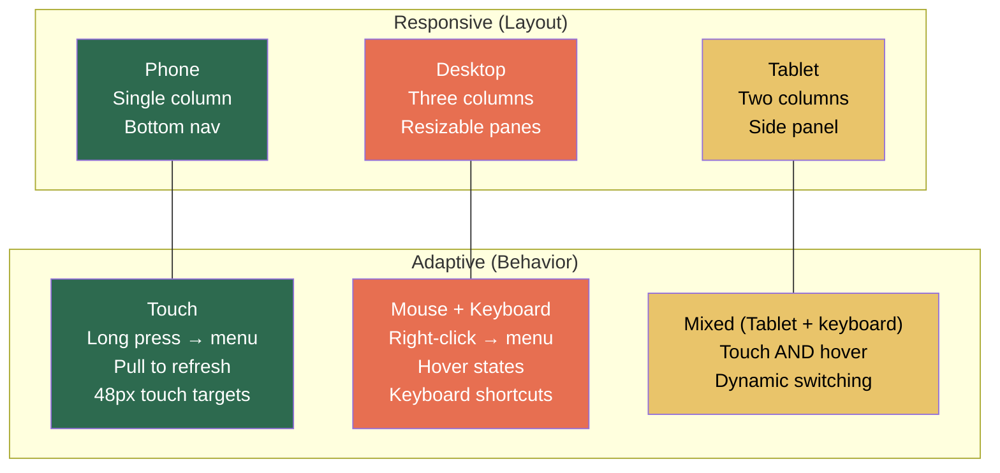

# 7. Adaptive Design Systems 🔴

> **What you'll learn:**
> - Why "responsive" (resizing layouts to fit screen widths) is only half the problem — "adaptive" means respecting each platform's **input paradigm** and UX conventions.
> - How to implement desktop-class interaction patterns: right-click context menus, keyboard shortcuts, hover states, focus traversal, and drag handles.
> - How to design **multi-column resizable layouts** that switch between mobile navigation and desktop panels based on available space and input method.
> - How to build a reusable **adaptive scaffold** that works across all six platforms without platform `if/else` spaghetti.

---

## Responsive vs. Adaptive: The Critical Distinction

| Concept | Responsive | Adaptive |
|---------|-----------|----------|
| **Concerns** | Screen size, orientation | Input method, platform conventions, feature availability |
| **Tools** | `MediaQuery`, `LayoutBuilder`, `Flex` | `defaultTargetPlatform`, `kIsWeb`, pointer device detection |
| **Example** | 1-column on phone, 2-column on tablet | Right-click menu on desktop, long-press menu on mobile |
| **Failure mode** | Layout overflows or has too much whitespace | Touch targets too small for fingers on mobile; no keyboard shortcuts on desktop |

A truly omni-platform app must be **both** responsive (layout) AND adaptive (behavior).



---

## Detecting the Platform Context

### Screen Size (Responsive)

```dart
// ✅ Use LayoutBuilder, not MediaQuery, for widget-level responsiveness.
// MediaQuery gives screen size; LayoutBuilder gives PARENT constraints.
class ResponsiveLayout extends StatelessWidget {
  final Widget mobile;
  final Widget? tablet;
  final Widget desktop;

  const ResponsiveLayout({
    super.key,
    required this.mobile,
    this.tablet,
    required this.desktop,
  });

  @override
  Widget build(BuildContext context) {
    return LayoutBuilder(
      builder: (context, constraints) {
        if (constraints.maxWidth >= 1200) return desktop;
        if (constraints.maxWidth >= 600) return tablet ?? desktop;
        return mobile;
      },
    );
  }
}
```

### Input Method (Adaptive)

```dart
// ✅ Detect whether the user has a mouse or is using touch.
// This is more reliable than checking the platform — a user on an
// iPad with a Magic Keyboard has BOTH touch and mouse.
class InputMethodDetector extends StatelessWidget {
  final Widget Function(bool hasMouse) builder;

  const InputMethodDetector({super.key, required this.builder});

  @override
  Widget build(BuildContext context) {
    // MouseRegion detects pointer events without consuming them.
    // PointerDeviceKind tells us if it's a mouse, touch, or stylus.
    return MouseRegion(
      onEnter: (_) {}, // Presence of onEnter means mouse is available
      child: builder(_isDesktopInputMode(context)),
    );
  }

  bool _isDesktopInputMode(BuildContext context) {
    // Method 1: Check platform
    final platform = defaultTargetPlatform;
    if (platform == TargetPlatform.macOS ||
        platform == TargetPlatform.windows ||
        platform == TargetPlatform.linux) {
      return true;
    }
    // Method 2: On web, check for fine pointer
    if (kIsWeb) {
      return MediaQuery.of(context).navigationMode == NavigationMode.directional;
    }
    return false;
  }
}
```

---

## Desktop-Class Interactions

### Right-Click Context Menus

```dart
// 💥 JANK HAZARD: Using onLongPress for context menus on ALL platforms.
// Desktop users expect right-click. Long-press feels broken on macOS/Windows.
GestureDetector(
  onLongPress: () => _showContextMenu(context), // 💥 Wrong on desktop
  child: const ListTile(title: Text('Document.md')),
)
```

```dart
// ✅ FIX: Adaptive context menu — right-click on desktop, long-press on mobile.
class AdaptiveContextMenu extends StatelessWidget {
  final Widget child;
  final List<PopupMenuEntry<String>> menuItems;
  final void Function(String) onSelected;

  const AdaptiveContextMenu({
    super.key,
    required this.child,
    required this.menuItems,
    required this.onSelected,
  });

  @override
  Widget build(BuildContext context) {
    return GestureDetector(
      // ✅ Long-press for touch devices
      onLongPressStart: _isTouchPrimary(context)
          ? (details) => _showMenu(context, details.globalPosition)
          : null,
      // ✅ Secondary click (right-click) for mouse devices
      onSecondaryTapUp: (details) => _showMenu(context, details.globalPosition),
      child: child,
    );
  }

  void _showMenu(BuildContext context, Offset position) async {
    final result = await showMenu<String>(
      context: context,
      position: RelativeRect.fromLTRB(
        position.dx, position.dy, position.dx, position.dy,
      ),
      items: menuItems,
    );
    if (result != null) onSelected(result);
  }

  bool _isTouchPrimary(BuildContext context) {
    return defaultTargetPlatform == TargetPlatform.iOS ||
           defaultTargetPlatform == TargetPlatform.android;
  }
}
```

### Keyboard Shortcuts

```dart
// ✅ Register keyboard shortcuts at the widget level using Shortcuts + Actions.
class DocumentEditor extends StatelessWidget {
  const DocumentEditor({super.key});

  @override
  Widget build(BuildContext context) {
    return Shortcuts(
      shortcuts: {
        // ✅ Cmd+S (macOS) / Ctrl+S (Windows/Linux) → Save
        SingleActivator(LogicalKeyboardKey.keyS, meta: true):
            const SaveIntent(),
        SingleActivator(LogicalKeyboardKey.keyS, control: true):
            const SaveIntent(),

        // ✅ Cmd+Z / Ctrl+Z → Undo
        SingleActivator(LogicalKeyboardKey.keyZ, meta: true):
            const UndoIntent(),
        SingleActivator(LogicalKeyboardKey.keyZ, control: true):
            const UndoIntent(),

        // ✅ Cmd+Shift+Z / Ctrl+Y → Redo
        SingleActivator(LogicalKeyboardKey.keyZ, meta: true, shift: true):
            const RedoIntent(),
        SingleActivator(LogicalKeyboardKey.keyY, control: true):
            const RedoIntent(),
      },
      child: Actions(
        actions: {
          SaveIntent: CallbackAction<SaveIntent>(
            onInvoke: (_) {
              // ✅ Trigger save via state management
              context.read(documentProvider.notifier).save();
              return null;
            },
          ),
          UndoIntent: CallbackAction<UndoIntent>(
            onInvoke: (_) {
              context.read(documentProvider.notifier).undo();
              return null;
            },
          ),
          RedoIntent: CallbackAction<RedoIntent>(
            onInvoke: (_) {
              context.read(documentProvider.notifier).redo();
              return null;
            },
          ),
        },
        child: Focus(
          autofocus: true, // ✅ Ensure this widget receives keyboard events
          child: const EditorCanvas(),
        ),
      ),
    );
  }
}

// Intent classes — simple value types that represent user intentions
class SaveIntent extends Intent {
  const SaveIntent();
}

class UndoIntent extends Intent {
  const UndoIntent();
}

class RedoIntent extends Intent {
  const RedoIntent();
}
```

### Hover States

```dart
// ✅ Add hover effects for mouse users while maintaining touch-friendly defaults.
class AdaptiveListTile extends StatefulWidget {
  final String title;
  final VoidCallback onTap;

  const AdaptiveListTile({super.key, required this.title, required this.onTap});

  @override
  State<AdaptiveListTile> createState() => _AdaptiveListTileState();
}

class _AdaptiveListTileState extends State<AdaptiveListTile> {
  bool _isHovered = false;

  @override
  Widget build(BuildContext context) {
    return MouseRegion(
      cursor: SystemMouseCursors.click,
      onEnter: (_) => setState(() => _isHovered = true),
      onExit: (_) => setState(() => _isHovered = false),
      child: AnimatedContainer(
        duration: const Duration(milliseconds: 150),
        decoration: BoxDecoration(
          color: _isHovered
              ? Theme.of(context).colorScheme.surfaceContainerHighest
              : Colors.transparent,
          borderRadius: BorderRadius.circular(8),
        ),
        child: ListTile(
          title: Text(widget.title),
          onTap: widget.onTap,
          // ✅ Larger touch targets on mobile, compact on desktop
          visualDensity: _isDesktop(context)
              ? VisualDensity.compact
              : VisualDensity.standard,
        ),
      ),
    );
  }

  bool _isDesktop(BuildContext context) {
    return defaultTargetPlatform == TargetPlatform.macOS ||
           defaultTargetPlatform == TargetPlatform.windows ||
           defaultTargetPlatform == TargetPlatform.linux;
  }
}
```

---

## Multi-Column Resizable Layouts

Desktop apps need resizable panels — think VS Code's sidebar, editor, and terminal:

```dart
// ✅ Resizable two-pane layout with a drag handle.
class ResizablePanes extends StatefulWidget {
  final Widget leftPane;
  final Widget rightPane;
  final double initialLeftWidth;
  final double minLeftWidth;
  final double minRightWidth;

  const ResizablePanes({
    super.key,
    required this.leftPane,
    required this.rightPane,
    this.initialLeftWidth = 280,
    this.minLeftWidth = 200,
    this.minRightWidth = 400,
  });

  @override
  State<ResizablePanes> createState() => _ResizablePanesState();
}

class _ResizablePanesState extends State<ResizablePanes> {
  late double _leftWidth;

  @override
  void initState() {
    super.initState();
    _leftWidth = widget.initialLeftWidth;
  }

  @override
  Widget build(BuildContext context) {
    return LayoutBuilder(
      builder: (context, constraints) {
        // ✅ Clamp left width to valid range
        final maxLeftWidth = constraints.maxWidth - widget.minRightWidth;
        _leftWidth = _leftWidth.clamp(widget.minLeftWidth, maxLeftWidth);

        return Row(
          children: [
            // Left pane
            SizedBox(
              width: _leftWidth,
              child: widget.leftPane,
            ),

            // ✅ Drag handle — 8px wide, cursor changes on hover
            MouseRegion(
              cursor: SystemMouseCursors.resizeColumn,
              child: GestureDetector(
                onHorizontalDragUpdate: (details) {
                  setState(() {
                    _leftWidth = (_leftWidth + details.delta.dx)
                        .clamp(widget.minLeftWidth, maxLeftWidth);
                  });
                },
                child: Container(
                  width: 8,
                  color: Theme.of(context).dividerColor,
                ),
              ),
            ),

            // Right pane — fills remaining space
            Expanded(child: widget.rightPane),
          ],
        );
      },
    );
  }
}
```

---

## The Adaptive Scaffold: Putting It All Together

```dart
/// A scaffold that adapts its navigation pattern based on available space
/// and platform input conventions.
class AdaptiveScaffold extends StatelessWidget {
  final int currentIndex;
  final ValueChanged<int> onDestinationSelected;
  final List<AdaptiveDestination> destinations;
  final Widget body;

  const AdaptiveScaffold({
    super.key,
    required this.currentIndex,
    required this.onDestinationSelected,
    required this.destinations,
    required this.body,
  });

  @override
  Widget build(BuildContext context) {
    return LayoutBuilder(
      builder: (context, constraints) {
        // ✅ Compact (phone): Bottom navigation bar
        if (constraints.maxWidth < 600) {
          return Scaffold(
            body: body,
            bottomNavigationBar: NavigationBar(
              selectedIndex: currentIndex,
              onDestinationSelected: onDestinationSelected,
              destinations: destinations.map((d) => NavigationDestination(
                icon: Icon(d.icon),
                label: d.label,
              )).toList(),
            ),
          );
        }

        // ✅ Medium (tablet): Rail navigation
        if (constraints.maxWidth < 1200) {
          return Scaffold(
            body: Row(
              children: [
                NavigationRail(
                  selectedIndex: currentIndex,
                  onDestinationSelected: onDestinationSelected,
                  labelType: NavigationRailLabelType.all,
                  destinations: destinations.map((d) => NavigationRailDestination(
                    icon: Icon(d.icon),
                    label: Text(d.label),
                  )).toList(),
                ),
                const VerticalDivider(width: 1),
                Expanded(child: body),
              ],
            ),
          );
        }

        // ✅ Expanded (desktop): Full sidebar with labels and sections
        return Scaffold(
          body: Row(
            children: [
              SizedBox(
                width: 280,
                child: NavigationDrawer(
                  selectedIndex: currentIndex,
                  onDestinationSelected: onDestinationSelected,
                  children: [
                    const Padding(
                      padding: EdgeInsets.fromLTRB(28, 16, 16, 10),
                      child: Text('Navigation', style: TextStyle(fontWeight: FontWeight.bold)),
                    ),
                    ...destinations.map((d) => NavigationDrawerDestination(
                      icon: Icon(d.icon),
                      label: Text(d.label),
                    )),
                  ],
                ),
              ),
              const VerticalDivider(width: 1),
              Expanded(child: body),
            ],
          ),
        );
      },
    );
  }
}

class AdaptiveDestination {
  final IconData icon;
  final String label;
  const AdaptiveDestination({required this.icon, required this.label});
}
```

---

## Platform-Specific UX Comparison

| UX Element | iOS | Android | macOS | Windows | Linux | Web |
|-----------|-----|---------|-------|---------|-------|-----|
| Back navigation | Swipe from left edge | System back button / gesture | Cmd+[ or toolbar | Alt+← or toolbar | Alt+← | Browser back button |
| Context menu | Long press | Long press | Right-click | Right-click | Right-click | Right-click |
| Selection | Tap + drag handles | Tap + drag handles | Click + drag | Click + drag | Click + drag | Click + drag |
| Scrollbar | Hidden, appears on scroll | Hidden, appears on scroll | Always visible, draggable | Always visible, draggable | Always visible, draggable | Depends on OS setting |
| Touch target minimum | 44pt | 48dp | No minimum (mouse precision) | No minimum | No minimum | 48px on touch, no min on mouse |
| Keyboard shortcuts | Cmd-based | N/A (rare) | Cmd-based | Ctrl-based | Ctrl-based | Ctrl-based (Cmd on macOS web) |

---

<details>
<summary><strong>🏋️ Exercise: Adaptive Data Table</strong> (click to expand)</summary>

### Challenge

You are building an admin panel for a SaaS product deployed to Web and macOS. The main screen shows a data table of 500 users. Requirements:

1. **Desktop (mouse):** Rows have hover highlights. Right-click shows a context menu (Edit, Disable, Delete). Columns are resizable via drag. Row selection happens with click (single) and Cmd/Ctrl+click (multi-select).
2. **Tablet (touch):** Long-press shows a bottom sheet with actions. Touch targets are 48dp minimum. Multi-select via a checkbox column.
3. **Both:** Keyboard shortcut Ctrl/Cmd+A selects all. Escape clears selection. Delete key shows a confirmation dialog for selected rows.

**Your tasks:**
1. Design the widget structure for the adaptive data table.
2. Implement the multi-select behavior that works with both mouse clicks and touch checkboxes.
3. Write the keyboard shortcut handler.

<details>
<summary>🔑 Solution</summary>

**1. Widget Structure**

```dart
class AdaptiveDataTable extends ConsumerStatefulWidget {
  const AdaptiveDataTable({super.key});
  @override
  ConsumerState<AdaptiveDataTable> createState() => _AdaptiveDataTableState();
}

class _AdaptiveDataTableState extends ConsumerState<AdaptiveDataTable> {
  final Set<String> _selectedIds = {};

  bool get _isDesktopInput =>
      defaultTargetPlatform == TargetPlatform.macOS ||
      defaultTargetPlatform == TargetPlatform.windows ||
      defaultTargetPlatform == TargetPlatform.linux ||
      kIsWeb;

  @override
  Widget build(BuildContext context) {
    final users = ref.watch(usersProvider).valueOrNull ?? [];

    return Shortcuts(
      shortcuts: {
        // ✅ Cmd/Ctrl+A → select all
        SingleActivator(LogicalKeyboardKey.keyA, meta: true):
            const SelectAllIntent(),
        SingleActivator(LogicalKeyboardKey.keyA, control: true):
            const SelectAllIntent(),
        // ✅ Escape → clear selection
        const SingleActivator(LogicalKeyboardKey.escape):
            const ClearSelectionIntent(),
        // ✅ Delete → confirm deletion
        const SingleActivator(LogicalKeyboardKey.delete):
            const DeleteSelectedIntent(),
        const SingleActivator(LogicalKeyboardKey.backspace):
            const DeleteSelectedIntent(),
      },
      child: Actions(
        actions: {
          SelectAllIntent: CallbackAction<SelectAllIntent>(
            onInvoke: (_) {
              setState(() => _selectedIds.addAll(users.map((u) => u.id)));
              return null;
            },
          ),
          ClearSelectionIntent: CallbackAction<ClearSelectionIntent>(
            onInvoke: (_) {
              setState(() => _selectedIds.clear());
              return null;
            },
          ),
          DeleteSelectedIntent: CallbackAction<DeleteSelectedIntent>(
            onInvoke: (_) {
              if (_selectedIds.isNotEmpty) _confirmDelete(context);
              return null;
            },
          ),
        },
        child: Focus(
          autofocus: true,
          child: ListView.builder(
            itemCount: users.length,
            itemBuilder: (context, index) => _buildRow(context, users[index]),
          ),
        ),
      ),
    );
  }

  Widget _buildRow(BuildContext context, User user) {
    final isSelected = _selectedIds.contains(user.id);

    return _isDesktopInput
        ? _DesktopRow(
            user: user,
            isSelected: isSelected,
            onSelect: () => _toggleSelect(user.id),
            onMultiSelect: () => _multiToggle(user.id),
            contextMenuItems: _contextMenuItems(user),
          )
        : _TouchRow(
            user: user,
            isSelected: isSelected,
            onCheckChanged: (v) => _toggleSelect(user.id),
            onLongPress: () => _showBottomSheet(context, user),
          );
  }

  void _toggleSelect(String id) {
    setState(() {
      if (_selectedIds.contains(id)) {
        _selectedIds.remove(id);
      } else {
        _selectedIds.add(id);
      }
    });
  }

  void _multiToggle(String id) {
    // Cmd/Ctrl+click behavior — toggle without clearing others
    setState(() {
      if (_selectedIds.contains(id)) {
        _selectedIds.remove(id);
      } else {
        _selectedIds.add(id);
      }
    });
  }

  // ... _confirmDelete, _showBottomSheet, _contextMenuItems ...
}
```

**2. Desktop Row with Hover + Right-Click + Multi-Select**

```dart
class _DesktopRow extends StatefulWidget {
  final User user;
  final bool isSelected;
  final VoidCallback onSelect;
  final VoidCallback onMultiSelect;
  final List<PopupMenuEntry<String>> contextMenuItems;

  const _DesktopRow({
    required this.user,
    required this.isSelected,
    required this.onSelect,
    required this.onMultiSelect,
    required this.contextMenuItems,
  });

  @override
  State<_DesktopRow> createState() => _DesktopRowState();
}

class _DesktopRowState extends State<_DesktopRow> {
  bool _isHovered = false;

  @override
  Widget build(BuildContext context) {
    return MouseRegion(
      cursor: SystemMouseCursors.click,
      onEnter: (_) => setState(() => _isHovered = true),
      onExit: (_) => setState(() => _isHovered = false),
      child: GestureDetector(
        // ✅ Regular click — select (clear others)
        onTap: widget.onSelect,
        // ✅ Right-click — show context menu
        onSecondaryTapUp: (details) async {
          final result = await showMenu<String>(
            context: context,
            position: RelativeRect.fromLTRB(
              details.globalPosition.dx, details.globalPosition.dy,
              details.globalPosition.dx, details.globalPosition.dy,
            ),
            items: widget.contextMenuItems,
          );
          // Handle result...
        },
        child: AnimatedContainer(
          duration: const Duration(milliseconds: 100),
          color: widget.isSelected
              ? Theme.of(context).colorScheme.primaryContainer
              : _isHovered
                  ? Theme.of(context).colorScheme.surfaceContainerHighest
                  : Colors.transparent,
          padding: const EdgeInsets.symmetric(horizontal: 16, vertical: 8),
          child: Row(
            children: [
              Expanded(flex: 2, child: Text(widget.user.name)),
              Expanded(flex: 3, child: Text(widget.user.email)),
              Expanded(flex: 1, child: Text(widget.user.role)),
            ],
          ),
        ),
      ),
    );
  }
}
```

**3. Touch Row with Checkbox + Long-Press**

```dart
class _TouchRow extends StatelessWidget {
  final User user;
  final bool isSelected;
  final ValueChanged<bool?> onCheckChanged;
  final VoidCallback onLongPress;

  const _TouchRow({
    required this.user,
    required this.isSelected,
    required this.onCheckChanged,
    required this.onLongPress,
  });

  @override
  Widget build(BuildContext context) {
    return GestureDetector(
      onLongPress: onLongPress, // ✅ Long-press → bottom sheet
      child: ListTile(
        leading: Checkbox(
          value: isSelected,
          onChanged: onCheckChanged, // ✅ Checkbox for multi-select
        ),
        title: Text(user.name),
        subtitle: Text(user.email),
        // ✅ 48dp minimum touch target enforced by ListTile default
      ),
    );
  }
}
```

**Key decisions:**
- Desktop uses **hover + right-click** (mouse paradigm). Touch uses **checkbox + long-press** (finger paradigm).
- Keyboard shortcuts work on all platforms with a physical keyboard via `Shortcuts` + `Actions`.
- The parent `AdaptiveDataTable` owns selection state and delegates rendering to platform-specific row widgets.
- No `Platform.isIOS` checks in the row widgets — the parent decides which variant to build based on input mode.

</details>
</details>

---

> **Key Takeaways**
> - **Responsive** adapts to screen size (layout). **Adaptive** adapts to input method and platform conventions (behavior). Your app needs **both**.
> - Use **`LayoutBuilder`** (not just `MediaQuery`) for widget-level responsive breakpoints.
> - Implement **right-click context menus** on desktop, **long-press menus** on mobile. Never use only one.
> - Register **keyboard shortcuts** via `Shortcuts` + `Actions` widgets. Use `SingleActivator` with both `meta` (Cmd) and `control` (Ctrl) for cross-platform support.
> - Build **resizable panel layouts** with `GestureDetector.onHorizontalDragUpdate` and `MouseRegion.cursor` for the drag handle.
> - Design an **AdaptiveScaffold** that switches between bottom nav (phone), rail (tablet), and full sidebar (desktop) based on `LayoutBuilder` constraints.
> - Touch targets must be **48dp minimum** on mobile. Desktop can use `VisualDensity.compact`.

---

> **See also:**
> - [Chapter 1: The Three Trees](ch01-three-trees.md) — Understanding how `LayoutBuilder` triggers rebuilds via constraint changes.
> - [Chapter 4: Omni-Platform Routing](ch04-omni-routing.md) — `ShellRoute` provides the navigation structure that the adaptive scaffold wraps.
> - [Chapter 8: Capstone Project](ch08-capstone.md) — Full adaptive layout implementation for the Markdown IDE.
