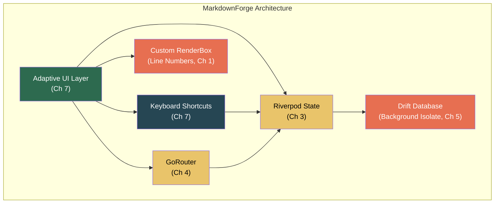
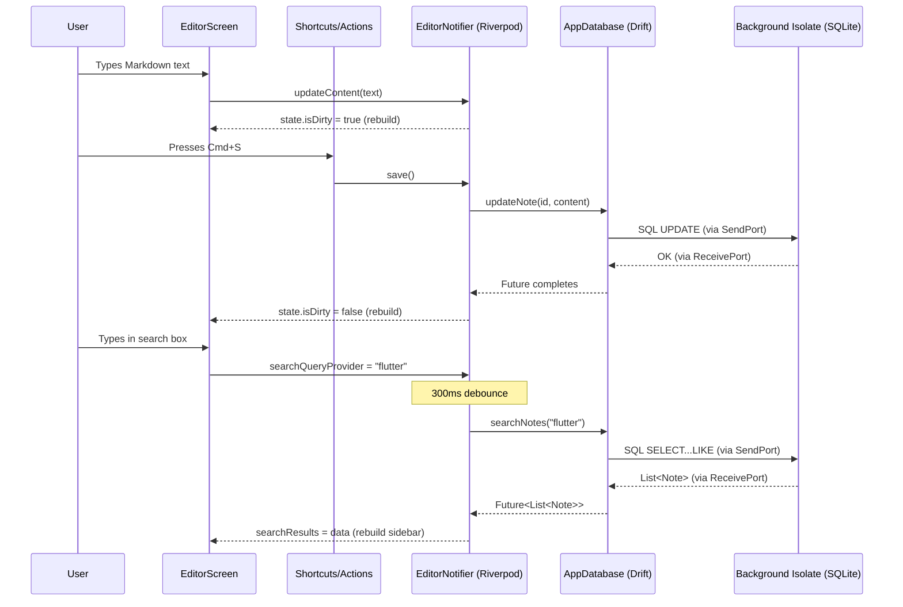

# 8. Capstone Project: The Local-First Markdown IDE 🔴

> **What you'll learn:**
> - How to architect a complex, multi-platform productivity application that integrates every concept from this book.
> - How to build an **adaptive layout** that switches between mobile bottom-nav and a resizable desktop sidebar using `LayoutBuilder`.
> - How to integrate a **local SQLite/Drift database** processed on a background Isolate for stutter-free full-text search.
> - How to manage active document state and application settings using **Riverpod**.
> - How to implement **hardware keyboard shortcuts** (Cmd/Ctrl+S) that trigger state saves exclusively on desktop/web.
> - How to write a **custom `RenderBox`** to paint a text editing canvas that standard widgets cannot achieve.

---

## Project Overview

We are building **MarkdownForge** — a local-first Markdown editor deployed to **iOS**, **macOS**, **Windows**, and **Web**. It is a simplified version of apps like Obsidian, Bear, or Typora.

### Feature Requirements

| Feature | Concepts Used | Chapter |
|---------|--------------|---------|
| Adaptive sidebar ↔ bottom nav layout | `LayoutBuilder`, `AdaptiveScaffold` | Ch 7 |
| Local SQLite database with full-text search | Drift, background Isolate | Ch 5 |
| Active document & settings state | Riverpod `NotifierProvider`, `AsyncNotifier` | Ch 3 |
| Cmd/Ctrl+S to save, Cmd/Ctrl+N for new doc | `Shortcuts` + `Actions` | Ch 7 |
| Custom line-number gutter + syntax highlights | Custom `RenderBox` | Ch 1, 2 |
| Deep linking to `/doc/:id` on web | GoRouter | Ch 4 |
| Markdown preview rendering | `CustomPaint` + RenderParagraph concepts | Ch 1 |



---

## Part 1: Project Scaffold and Routing

### `pubspec.yaml` Dependencies

```yaml
dependencies:
  flutter:
    sdk: flutter
  flutter_riverpod: ^2.5.0
  go_router: ^14.0.0
  drift: ^2.18.0
  sqlite3_flutter_libs: ^0.5.0
  path_provider: ^2.1.0
  path: ^1.9.0
  markdown: ^7.2.0  # Parsing markdown to AST
  google_fonts: ^6.2.0

dev_dependencies:
  flutter_test:
    sdk: flutter
  drift_dev: ^2.18.0
  build_runner: ^2.4.0
```

### Route Structure

```dart
// lib/routing/app_router.dart
final appRouterProvider = Provider<GoRouter>((ref) {
  return GoRouter(
    initialLocation: '/',
    debugLogDiagnostics: true,
    routes: [
      // ✅ ShellRoute provides the adaptive scaffold
      ShellRoute(
        builder: (context, state, child) => AppShell(child: child),
        routes: [
          GoRoute(
            path: '/',
            name: 'home',
            builder: (_, __) => const NoteListScreen(),
          ),
          GoRoute(
            path: '/doc/:id',
            name: 'editor',
            builder: (_, state) {
              final docId = int.parse(state.pathParameters['id']!);
              return EditorScreen(documentId: docId);
            },
          ),
          GoRoute(
            path: '/settings',
            name: 'settings',
            builder: (_, __) => const SettingsScreen(),
          ),
        ],
      ),
    ],
  );
});
```

---

## Part 2: Database Layer (Drift + Background Isolate)

### Schema Definition

```dart
// lib/data/database.dart
import 'package:drift/drift.dart';

class Notes extends Table {
  IntColumn get id => integer().autoIncrement()();
  TextColumn get title => text().withDefault(const Constant('Untitled'))();
  TextColumn get content => text().withDefault(const Constant(''))();
  DateTimeColumn get createdAt => dateTime().withDefault(currentDateAndTime)();
  DateTimeColumn get updatedAt => dateTime().withDefault(currentDateAndTime)();
}

@DriftDatabase(tables: [Notes])
class AppDatabase extends _$AppDatabase {
  AppDatabase(super.e);

  @override
  int get schemaVersion => 1;

  /// ✅ Full-text search across title and content.
  /// Runs on background Isolate via Drift's createInBackground().
  Future<List<Note>> searchNotes(String query) async {
    if (query.isEmpty) {
      return (select(notes)
        ..orderBy([(n) => OrderingTerm.desc(n.updatedAt)])
        ..limit(100)
      ).get();
    }
    return (select(notes)
      ..where((n) => 
        n.title.contains(query) | n.content.contains(query))
      ..orderBy([(n) => OrderingTerm.desc(n.updatedAt)])
      ..limit(50)
    ).get();
  }

  /// Get a single note by ID.
  Future<Note> getNoteById(int id) =>
    (select(notes)..where((n) => n.id.equals(id))).getSingle();

  /// Create a new note and return its ID.
  Future<int> createNote({String title = 'Untitled', String content = ''}) =>
    into(notes).insert(NotesCompanion.insert(
      title: Value(title),
      content: Value(content),
    ));

  /// Update a note's content. Sets updatedAt to now.
  Future<void> updateNote(int id, {String? title, String? content}) =>
    (update(notes)..where((n) => n.id.equals(id))).write(NotesCompanion(
      title: title != null ? Value(title) : const Value.absent(),
      content: content != null ? Value(content) : const Value.absent(),
      updatedAt: Value(DateTime.now()),
    ));

  /// Delete a note.
  Future<void> deleteNote(int id) =>
    (delete(notes)..where((n) => n.id.equals(id))).go();
}
```

### Database Connection with Background Isolate

```dart
// lib/data/connection.dart
import 'dart:io';
import 'package:drift/native.dart';
import 'package:path_provider/path_provider.dart';
import 'package:path/path.dart' as p;

AppDatabase createDatabase() {
  return AppDatabase(_openConnection());
}

LazyDatabase _openConnection() {
  return LazyDatabase(() async {
    final dir = await getApplicationDocumentsDirectory();
    final file = File(p.join(dir.path, 'markdownforge.db'));

    // ✅ createInBackground() runs SQLite on a dedicated background Isolate.
    // All queries are sent via message passing — zero UI thread blocking.
    return NativeDatabase.createInBackground(file);
  });
}
```

### Riverpod Provider

```dart
// lib/providers/database_provider.dart
final databaseProvider = Provider<AppDatabase>((ref) {
  final db = createDatabase();
  ref.onDispose(db.close); // ✅ Clean up on app shutdown
  return db;
});
```

---

## Part 3: State Management with Riverpod

### Active Document State

```dart
// lib/providers/editor_provider.dart

/// Holds the state of the currently active document.
class EditorState {
  final Note? note;
  final String content;
  final bool isDirty; // Has unsaved changes
  final List<String> undoStack;
  final List<String> redoStack;

  const EditorState({
    this.note,
    this.content = '',
    this.isDirty = false,
    this.undoStack = const [],
    this.redoStack = const [],
  });

  EditorState copyWith({
    Note? note,
    String? content,
    bool? isDirty,
    List<String>? undoStack,
    List<String>? redoStack,
  }) => EditorState(
    note: note ?? this.note,
    content: content ?? this.content,
    isDirty: isDirty ?? this.isDirty,
    undoStack: undoStack ?? this.undoStack,
    redoStack: redoStack ?? this.redoStack,
  );
}

final editorProvider = NotifierProvider<EditorNotifier, EditorState>(
  EditorNotifier.new,
);

class EditorNotifier extends Notifier<EditorState> {
  @override
  EditorState build() => const EditorState();

  /// Load a document by ID from the database.
  Future<void> openDocument(int id) async {
    final db = ref.read(databaseProvider);
    final note = await db.getNoteById(id);
    state = EditorState(
      note: note,
      content: note.content,
      isDirty: false,
      undoStack: [],
      redoStack: [],
    );
  }

  /// Update content (called on every keystroke, debounced in UI).
  void updateContent(String newContent) {
    if (newContent == state.content) return;
    state = state.copyWith(
      content: newContent,
      isDirty: true,
      // ✅ Push current content to undo stack before changing
      undoStack: [...state.undoStack, state.content],
      redoStack: [], // Clear redo on new edit
    );
  }

  /// Save to database.
  Future<void> save() async {
    final note = state.note;
    if (note == null || !state.isDirty) return;

    final db = ref.read(databaseProvider);

    // ✅ Extract title from first line of markdown
    final firstLine = state.content.split('\n').first;
    final title = firstLine.startsWith('# ')
        ? firstLine.substring(2).trim()
        : firstLine.trim();

    await db.updateNote(note.id, title: title, content: state.content);
    state = state.copyWith(isDirty: false);
  }

  /// Undo last edit.
  void undo() {
    if (state.undoStack.isEmpty) return;
    final previous = state.undoStack.last;
    state = state.copyWith(
      content: previous,
      undoStack: state.undoStack.sublist(0, state.undoStack.length - 1),
      redoStack: [...state.redoStack, state.content],
      isDirty: true,
    );
  }

  /// Redo last undo.
  void redo() {
    if (state.redoStack.isEmpty) return;
    final next = state.redoStack.last;
    state = state.copyWith(
      content: next,
      redoStack: state.redoStack.sublist(0, state.redoStack.length - 1),
      undoStack: [...state.undoStack, state.content],
      isDirty: true,
    );
  }
}
```

### Search State with Debounce

```dart
// lib/providers/search_provider.dart
final searchQueryProvider = StateProvider<String>((ref) => '');

final searchResultsProvider = FutureProvider.autoDispose<List<Note>>((ref) async {
  final query = ref.watch(searchQueryProvider);

  // ✅ Debounce: wait 300ms. If query changes, this provider is disposed
  // (autoDispose) and a new one starts — automatic cancellation.
  if (query.isNotEmpty) {
    await Future.delayed(const Duration(milliseconds: 300));
  }

  // ✅ Query runs on Drift's background Isolate — no UI jank.
  final db = ref.watch(databaseProvider);
  return db.searchNotes(query);
});
```

### App Settings

```dart
// lib/providers/settings_provider.dart
class AppSettings {
  final double fontSize;
  final bool showLineNumbers;
  final bool wordWrap;
  final String fontFamily;

  const AppSettings({
    this.fontSize = 14.0,
    this.showLineNumbers = true,
    this.wordWrap = true,
    this.fontFamily = 'JetBrains Mono',
  });

  AppSettings copyWith({
    double? fontSize,
    bool? showLineNumbers,
    bool? wordWrap,
    String? fontFamily,
  }) => AppSettings(
    fontSize: fontSize ?? this.fontSize,
    showLineNumbers: showLineNumbers ?? this.showLineNumbers,
    wordWrap: wordWrap ?? this.wordWrap,
    fontFamily: fontFamily ?? this.fontFamily,
  );
}

final settingsProvider = NotifierProvider<SettingsNotifier, AppSettings>(
  SettingsNotifier.new,
);

class SettingsNotifier extends Notifier<AppSettings> {
  @override
  AppSettings build() => const AppSettings();

  void setFontSize(double size) => state = state.copyWith(fontSize: size);
  void toggleLineNumbers() =>
    state = state.copyWith(showLineNumbers: !state.showLineNumbers);
  void toggleWordWrap() =>
    state = state.copyWith(wordWrap: !state.wordWrap);
  void setFontFamily(String family) =>
    state = state.copyWith(fontFamily: family);
}
```

---

## Part 4: Adaptive Layout

### The App Shell

```dart
// lib/ui/shell/app_shell.dart
class AppShell extends ConsumerWidget {
  final Widget child;
  const AppShell({super.key, required this.child});

  @override
  Widget build(BuildContext context, WidgetRef ref) {
    return LayoutBuilder(
      builder: (context, constraints) {
        final isWide = constraints.maxWidth >= 800;

        if (isWide) {
          // ✅ Desktop/tablet: Resizable sidebar + content area
          return _DesktopShell(child: child);
        } else {
          // ✅ Mobile: Bottom navigation + stacked screens
          return _MobileShell(child: child);
        }
      },
    );
  }
}

class _DesktopShell extends ConsumerWidget {
  final Widget child;
  const _DesktopShell({required this.child});

  @override
  Widget build(BuildContext context, WidgetRef ref) {
    return Row(
      children: [
        // ✅ Resizable sidebar with note list and search
        const SizedBox(
          width: 280, // Could use ResizablePanes from Ch 7
          child: _Sidebar(),
        ),
        const VerticalDivider(width: 1),
        // ✅ Main content area (editor or settings via GoRouter)
        Expanded(child: child),
      ],
    );
  }
}

class _MobileShell extends StatelessWidget {
  final Widget child;
  const _MobileShell({required this.child});

  @override
  Widget build(BuildContext context) {
    final location = GoRouterState.of(context).matchedLocation;
    final currentIndex = switch (location) {
      '/' => 0,
      _ when location.startsWith('/doc') => 0,
      '/settings' => 1,
      _ => 0,
    };

    return Scaffold(
      body: child,
      bottomNavigationBar: NavigationBar(
        selectedIndex: currentIndex,
        onDestinationSelected: (index) {
          switch (index) {
            case 0: context.go('/');
            case 1: context.go('/settings');
          }
        },
        destinations: const [
          NavigationDestination(icon: Icon(Icons.notes), label: 'Notes'),
          NavigationDestination(icon: Icon(Icons.settings), label: 'Settings'),
        ],
      ),
    );
  }
}
```

### The Sidebar (Desktop)

```dart
class _Sidebar extends ConsumerWidget {
  const _Sidebar();

  @override
  Widget build(BuildContext context, WidgetRef ref) {
    final searchResults = ref.watch(searchResultsProvider);

    return Column(
      children: [
        // ✅ Search bar
        Padding(
          padding: const EdgeInsets.all(8.0),
          child: TextField(
            onChanged: (v) => ref.read(searchQueryProvider.notifier).state = v,
            decoration: InputDecoration(
              hintText: 'Search notes...',
              prefixIcon: const Icon(Icons.search),
              border: OutlineInputBorder(
                borderRadius: BorderRadius.circular(8),
              ),
              isDense: true,
            ),
          ),
        ),

        // ✅ New note button
        Padding(
          padding: const EdgeInsets.symmetric(horizontal: 8.0),
          child: SizedBox(
            width: double.infinity,
            child: OutlinedButton.icon(
              onPressed: () async {
                final db = ref.read(databaseProvider);
                final id = await db.createNote();
                ref.invalidate(searchResultsProvider); // Refresh list
                if (context.mounted) context.go('/doc/$id');
              },
              icon: const Icon(Icons.add),
              label: const Text('New Note'),
            ),
          ),
        ),

        const SizedBox(height: 8),

        // ✅ Note list
        Expanded(
          child: searchResults.when(
            loading: () => const Center(child: CircularProgressIndicator()),
            error: (e, _) => Center(child: Text('Error: $e')),
            data: (notes) => ListView.builder(
              itemCount: notes.length,
              itemBuilder: (context, index) {
                final note = notes[index];
                return ListTile(
                  title: Text(
                    note.title,
                    maxLines: 1,
                    overflow: TextOverflow.ellipsis,
                  ),
                  subtitle: Text(
                    _formatDate(note.updatedAt),
                    style: Theme.of(context).textTheme.bodySmall,
                  ),
                  onTap: () => context.go('/doc/${note.id}'),
                  dense: true,
                  visualDensity: VisualDensity.compact,
                );
              },
            ),
          ),
        ),
      ],
    );
  }

  String _formatDate(DateTime dt) {
    final now = DateTime.now();
    final diff = now.difference(dt);
    if (diff.inMinutes < 1) return 'Just now';
    if (diff.inHours < 1) return '${diff.inMinutes}m ago';
    if (diff.inDays < 1) return '${diff.inHours}h ago';
    return '${diff.inDays}d ago';
  }
}
```

---

## Part 5: Keyboard Shortcuts (Desktop/Web Only)

```dart
// lib/ui/editor/editor_screen.dart
class EditorScreen extends ConsumerStatefulWidget {
  final int documentId;
  const EditorScreen({super.key, required this.documentId});

  @override
  ConsumerState<EditorScreen> createState() => _EditorScreenState();
}

class _EditorScreenState extends ConsumerState<EditorScreen> {
  late TextEditingController _controller;

  @override
  void initState() {
    super.initState();
    _controller = TextEditingController();
    // ✅ Load the document on first build
    WidgetsBinding.instance.addPostFrameCallback((_) {
      ref.read(editorProvider.notifier).openDocument(widget.documentId).then((_) {
        final content = ref.read(editorProvider).content;
        _controller.text = content;
      });
    });
  }

  @override
  void dispose() {
    _controller.dispose();
    super.dispose();
  }

  @override
  Widget build(BuildContext context) {
    final editorState = ref.watch(editorProvider);
    final settings = ref.watch(settingsProvider);

    // ✅ Keyboard shortcuts wrapping the editor
    return Shortcuts(
      shortcuts: {
        // Save: Cmd+S (macOS) / Ctrl+S (Windows/Linux/Web)
        SingleActivator(LogicalKeyboardKey.keyS, meta: true):
            const _SaveDocIntent(),
        SingleActivator(LogicalKeyboardKey.keyS, control: true):
            const _SaveDocIntent(),

        // New document: Cmd+N / Ctrl+N
        SingleActivator(LogicalKeyboardKey.keyN, meta: true):
            const _NewDocIntent(),
        SingleActivator(LogicalKeyboardKey.keyN, control: true):
            const _NewDocIntent(),

        // Undo: Cmd+Z / Ctrl+Z
        SingleActivator(LogicalKeyboardKey.keyZ, meta: true):
            const _UndoDocIntent(),
        SingleActivator(LogicalKeyboardKey.keyZ, control: true):
            const _UndoDocIntent(),

        // Redo: Cmd+Shift+Z / Ctrl+Y
        SingleActivator(LogicalKeyboardKey.keyZ, meta: true, shift: true):
            const _RedoDocIntent(),
        SingleActivator(LogicalKeyboardKey.keyY, control: true):
            const _RedoDocIntent(),
      },
      child: Actions(
        actions: {
          _SaveDocIntent: CallbackAction<_SaveDocIntent>(
            onInvoke: (_) {
              ref.read(editorProvider.notifier).save();
              ScaffoldMessenger.of(context).showSnackBar(
                const SnackBar(
                  content: Text('Saved'),
                  duration: Duration(seconds: 1),
                ),
              );
              return null;
            },
          ),
          _NewDocIntent: CallbackAction<_NewDocIntent>(
            onInvoke: (_) async {
              // Save current document first
              await ref.read(editorProvider.notifier).save();
              final db = ref.read(databaseProvider);
              final id = await db.createNote();
              ref.invalidate(searchResultsProvider);
              if (context.mounted) context.go('/doc/$id');
              return null;
            },
          ),
          _UndoDocIntent: CallbackAction<_UndoDocIntent>(
            onInvoke: (_) {
              ref.read(editorProvider.notifier).undo();
              _controller.text = ref.read(editorProvider).content;
              return null;
            },
          ),
          _RedoDocIntent: CallbackAction<_RedoDocIntent>(
            onInvoke: (_) {
              ref.read(editorProvider.notifier).redo();
              _controller.text = ref.read(editorProvider).content;
              return null;
            },
          ),
        },
        child: Focus(
          autofocus: true,
          child: _buildEditor(context, editorState, settings),
        ),
      ),
    );
  }

  Widget _buildEditor(
    BuildContext context,
    EditorState editorState,
    AppSettings settings,
  ) {
    return Column(
      children: [
        // ✅ Toolbar with save indicator
        _EditorToolbar(
          title: editorState.note?.title ?? 'Untitled',
          isDirty: editorState.isDirty,
          onSave: () => ref.read(editorProvider.notifier).save(),
        ),
        const Divider(height: 1),
        // ✅ Editor area with optional line numbers
        Expanded(
          child: Row(
            crossAxisAlignment: CrossAxisAlignment.start,
            children: [
              // ✅ Custom line number gutter (see Part 6)
              if (settings.showLineNumbers)
                CustomPaint(
                  painter: LineNumberPainter(
                    text: _controller.text,
                    fontSize: settings.fontSize,
                    textColor: Theme.of(context)
                        .colorScheme
                        .onSurfaceVariant
                        .withValues(alpha: 0.5),
                  ),
                  size: Size(48, double.infinity),
                ),
              // ✅ Text editor
              Expanded(
                child: TextField(
                  controller: _controller,
                  maxLines: null,
                  expands: true,
                  onChanged: (value) {
                    ref.read(editorProvider.notifier).updateContent(value);
                  },
                  style: TextStyle(
                    fontFamily: settings.fontFamily,
                    fontSize: settings.fontSize,
                    height: 1.6,
                  ),
                  decoration: const InputDecoration(
                    border: InputBorder.none,
                    contentPadding: EdgeInsets.all(16),
                  ),
                ),
              ),
            ],
          ),
        ),
      ],
    );
  }
}

// Intent classes
class _SaveDocIntent extends Intent { const _SaveDocIntent(); }
class _NewDocIntent extends Intent { const _NewDocIntent(); }
class _UndoDocIntent extends Intent { const _UndoDocIntent(); }
class _RedoDocIntent extends Intent { const _RedoDocIntent(); }
```

### Toolbar

```dart
class _EditorToolbar extends StatelessWidget {
  final String title;
  final bool isDirty;
  final VoidCallback onSave;

  const _EditorToolbar({
    required this.title,
    required this.isDirty,
    required this.onSave,
  });

  @override
  Widget build(BuildContext context) {
    return Container(
      height: 48,
      padding: const EdgeInsets.symmetric(horizontal: 16),
      child: Row(
        children: [
          // Back button (mobile only)
          if (MediaQuery.sizeOf(context).width < 800)
            IconButton(
              onPressed: () => context.go('/'),
              icon: const Icon(Icons.arrow_back),
            ),
          Expanded(
            child: Text(
              title,
              style: Theme.of(context).textTheme.titleMedium,
              overflow: TextOverflow.ellipsis,
            ),
          ),
          // ✅ Dirty indicator
          if (isDirty)
            Padding(
              padding: const EdgeInsets.only(right: 8),
              child: Text(
                'Unsaved',
                style: TextStyle(
                  color: Theme.of(context).colorScheme.error,
                  fontSize: 12,
                ),
              ),
            ),
          // Save button
          IconButton(
            onPressed: onSave,
            icon: const Icon(Icons.save),
            tooltip: 'Save (Ctrl+S / Cmd+S)',
          ),
        ],
      ),
    );
  }
}
```

---

## Part 6: Custom RenderBox — Line Number Gutter

Standard widgets cannot paint a synchronized line-number gutter that precisely aligns with a variable-height text editor. We write a custom `RenderBox`:

```dart
// lib/ui/editor/line_number_painter.dart
import 'package:flutter/rendering.dart';

/// A CustomPainter that draws line numbers aligned to text lines.
/// This demonstrates direct canvas painting from Chapter 1 & 2.
class LineNumberPainter extends CustomPainter {
  final String text;
  final double fontSize;
  final Color textColor;

  LineNumberPainter({
    required this.text,
    required this.fontSize,
    required this.textColor,
  });

  @override
  void paint(Canvas canvas, Size size) {
    final lineCount = '\n'.allMatches(text).length + 1;
    final lineHeight = fontSize * 1.6; // Match the editor's line height

    final textStyle = TextStyle(
      color: textColor,
      fontSize: fontSize * 0.85,
      fontFamily: 'JetBrains Mono',
      fontFeatures: const [FontFeature.tabularFigures()],
    );

    for (var i = 0; i < lineCount; i++) {
      final lineNumber = '${i + 1}';
      final tp = TextPainter(
        text: TextSpan(text: lineNumber, style: textStyle),
        textDirection: TextDirection.ltr,
        textAlign: TextAlign.right,
      )..layout(minWidth: size.width - 12, maxWidth: size.width - 12);

      final y = i * lineHeight + 16; // 16px padding to match editor content padding
      if (y > size.height) break; // ✅ Don't paint beyond visible area

      tp.paint(canvas, Offset(0, y));
    }
  }

  @override
  bool shouldRepaint(LineNumberPainter oldDelegate) {
    // ✅ Only repaint when text content or style changes
    return text != oldDelegate.text ||
           fontSize != oldDelegate.fontSize ||
           textColor != oldDelegate.textColor;
  }
}
```

### Going Deeper: A Full Custom RenderBox

For a production-grade Markdown IDE, you might need a custom `RenderBox` that handles:
- Syntax-highlighted text painting with multiple `TextSpan` styles.
- A cursor and selection rendering layer.
- Hit-testing for click-to-place-cursor.

Here is a simplified custom `RenderBox` for a read-only syntax-highlighted view:

```dart
/// A LeafRenderObjectWidget that paints syntax-highlighted markdown.
class SyntaxHighlightView extends LeafRenderObjectWidget {
  final String source;
  final double fontSize;

  const SyntaxHighlightView({
    super.key,
    required this.source,
    required this.fontSize,
  });

  @override
  RenderObject createRenderObject(BuildContext context) {
    return RenderSyntaxHighlight(
      source: source,
      fontSize: fontSize,
      textColor: Theme.of(context).colorScheme.onSurface,
      headingColor: Theme.of(context).colorScheme.primary,
      codeColor: Theme.of(context).colorScheme.tertiary,
    );
  }

  @override
  void updateRenderObject(BuildContext context, RenderSyntaxHighlight renderObject) {
    renderObject
      ..source = source
      ..fontSize = fontSize;
  }
}

class RenderSyntaxHighlight extends RenderBox {
  String _source;
  double _fontSize;
  Color textColor;
  Color headingColor;
  Color codeColor;
  TextPainter? _painter;

  RenderSyntaxHighlight({
    required String source,
    required double fontSize,
    required this.textColor,
    required this.headingColor,
    required this.codeColor,
  })  : _source = source,
        _fontSize = fontSize;

  set source(String value) {
    if (_source == value) return;
    _source = value;
    _painter = null; // Invalidate cached painter
    markNeedsLayout(); // ✅ Trigger relayout + repaint
  }

  set fontSize(double value) {
    if (_fontSize == value) return;
    _fontSize = value;
    _painter = null;
    markNeedsLayout();
  }

  TextPainter _buildPainter(double maxWidth) {
    // ✅ Build a rich TextSpan with syntax highlighting
    final lines = _source.split('\n');
    final spans = <TextSpan>[];

    for (final line in lines) {
      if (line.startsWith('# ')) {
        // Heading
        spans.add(TextSpan(
          text: '$line\n',
          style: TextStyle(
            color: headingColor,
            fontSize: _fontSize * 1.5,
            fontWeight: FontWeight.bold,
          ),
        ));
      } else if (line.startsWith('```')) {
        // Code fence
        spans.add(TextSpan(
          text: '$line\n',
          style: TextStyle(
            color: codeColor,
            fontSize: _fontSize,
            fontFamily: 'JetBrains Mono',
          ),
        ));
      } else {
        // Normal text
        spans.add(TextSpan(
          text: '$line\n',
          style: TextStyle(color: textColor, fontSize: _fontSize),
        ));
      }
    }

    final painter = TextPainter(
      text: TextSpan(children: spans),
      textDirection: TextDirection.ltr,
    )..layout(maxWidth: maxWidth);

    return painter;
  }

  @override
  void performLayout() {
    // ✅ Constraints go down, sizes go up (Chapter 1)
    _painter = _buildPainter(constraints.maxWidth);
    size = Size(
      constraints.maxWidth,
      _painter!.height.clamp(constraints.minHeight, constraints.maxHeight),
    );
  }

  @override
  void paint(PaintingContext context, Offset offset) {
    // ✅ Paint the highlighted text at the correct offset
    _painter?.paint(context.canvas, offset);
  }
}
```

---

## Architecture Diagram: Full Data Flow



---

<details>
<summary><strong>🏋️ Exercise: Extend MarkdownForge</strong> (click to expand)</summary>

### Challenge

Extend the MarkdownForge IDE with the following features:

1. **Live preview pane:** On desktop (≥1200px width), show a third column to the right of the editor that renders the Markdown as formatted HTML/widgets in real-time. Use `LayoutBuilder` to show/hide it.

2. **Auto-save:** Implement auto-save that triggers 2 seconds after the user stops typing. Show a subtle "Saving..." → "Saved" indicator in the toolbar. Do NOT auto-save on every keystroke.

3. **Document deletion with undo:** When the user deletes a note, show a `SnackBar` with an "Undo" button. The note is soft-deleted (removed from the list) but not actually deleted from the database for 5 seconds. If the user taps "Undo," restore it. If the 5 seconds elapse, delete permanently.

<details>
<summary>🔑 Solution</summary>

**1. Live Preview Pane**

```dart
// In _buildEditor, wrap the editor and preview in a LayoutBuilder:
Widget _buildEditor(BuildContext context, EditorState editorState, AppSettings settings) {
  return LayoutBuilder(
    builder: (context, constraints) {
      final showPreview = constraints.maxWidth >= 1200;

      final editor = _buildEditorColumn(editorState, settings);

      if (!showPreview) return editor;

      // ✅ Three-column layout: line numbers | editor | preview
      return Row(
        children: [
          Expanded(child: editor),
          const VerticalDivider(width: 1),
          Expanded(
            child: SingleChildScrollView(
              padding: const EdgeInsets.all(16),
              child: MarkdownPreview(
                source: editorState.content,
                fontSize: settings.fontSize,
              ),
            ),
          ),
        ],
      );
    },
  );
}

// MarkdownPreview uses the `markdown` package to parse and render
class MarkdownPreview extends StatelessWidget {
  final String source;
  final double fontSize;
  const MarkdownPreview({super.key, required this.source, required this.fontSize});

  @override
  Widget build(BuildContext context) {
    // Parse markdown to AST and render to widgets
    final doc = md.Document();
    final nodes = doc.parseLines(source.split('\n'));
    // ... render nodes to Flutter widgets ...
    return Column(
      crossAxisAlignment: CrossAxisAlignment.start,
      children: _renderNodes(nodes, fontSize),
    );
  }
}
```

**2. Auto-Save with Debounce**

```dart
class EditorNotifier extends Notifier<EditorState> {
  Timer? _autoSaveTimer;

  void updateContent(String newContent) {
    if (newContent == state.content) return;
    state = state.copyWith(
      content: newContent,
      isDirty: true,
      undoStack: [...state.undoStack, state.content],
      redoStack: [],
    );

    // ✅ Reset auto-save timer on every edit
    _autoSaveTimer?.cancel();
    _autoSaveTimer = Timer(const Duration(seconds: 2), () {
      save(); // Fires 2 seconds after last keystroke
    });
  }

  Future<void> save() async {
    _autoSaveTimer?.cancel(); // Cancel pending auto-save
    final note = state.note;
    if (note == null || !state.isDirty) return;

    // ✅ Show "Saving..." state
    state = state.copyWith(isSaving: true); // Add isSaving field to EditorState

    final db = ref.read(databaseProvider);
    final firstLine = state.content.split('\n').first;
    final title = firstLine.startsWith('# ')
        ? firstLine.substring(2).trim()
        : firstLine.trim();

    await db.updateNote(note.id, title: title, content: state.content);
    state = state.copyWith(isDirty: false, isSaving: false);
  }
}
```

**3. Soft Delete with Undo**

```dart
/// In the sidebar's note list:
void _deleteNote(BuildContext context, WidgetRef ref, Note note) {
  // ✅ Step 1: Immediately remove from UI (optimistic)
  ref.read(searchResultsProvider.notifier).removeLocally(note.id);

  // ✅ Step 2: Show SnackBar with Undo
  Timer? deleteTimer;
  ScaffoldMessenger.of(context).showSnackBar(
    SnackBar(
      content: Text('Deleted "${note.title}"'),
      duration: const Duration(seconds: 5),
      action: SnackBarAction(
        label: 'Undo',
        onPressed: () {
          // ✅ Cancel permanent deletion
          deleteTimer?.cancel();
          // Restore to UI
          ref.invalidate(searchResultsProvider);
        },
      ),
    ),
  );

  // ✅ Step 3: Schedule permanent deletion in 5 seconds
  deleteTimer = Timer(const Duration(seconds: 5), () async {
    final db = ref.read(databaseProvider);
    await db.deleteNote(note.id);
    ref.invalidate(searchResultsProvider); // Refresh list from DB
  });
}
```

**Key architectural decisions:**
- The live preview uses `LayoutBuilder` to appear only on wide screens — no manual breakpoint checking elsewhere.
- Auto-save uses a simple `Timer` reset pattern. The timer is cancelled and restarted on every keystroke, so it only fires after 2 seconds of inactivity.
- Soft delete avoids database round-trips during the undo window. The note stays in SQLite; only the UI list is updated optimistically. If the user doesn't undo within 5 seconds, the actual DELETE fires.

</details>
</details>

---

> **Key Takeaways**
> - A production Flutter app integrates **multiple architectural layers**: adaptive layout, state management, background computation, routing, and custom rendering.
> - **Drift with `createInBackground()`** runs SQLite on a dedicated Isolate — full-text search over thousands of documents without UI stutter.
> - **Riverpod `NotifierProvider`** manages document state with undo/redo stacks, dirty tracking, and auto-save timers.
> - **`Shortcuts` + `Actions`** provide platform-native keyboard shortcuts (Cmd+S, Ctrl+S) that integrate directly with the state layer.
> - **Custom `RenderBox`** or `CustomPainter` enables pixel-precise rendering (line number gutters, syntax highlighting) that standard widgets cannot achieve.
> - **`LayoutBuilder`** drives the adaptive layout: mobile bottom-nav vs. desktop sidebar is a single `constraints.maxWidth >= 800` check.
> - Every concept from Chapters 1–7 converges in a real application: three trees, rendering engines, state management, routing, Isolates, and adaptive design.

---

> **See also:**
> - [Chapter 1: The Three Trees](ch01-three-trees.md) — The RenderBox constraint protocol used in the custom line number gutter.
> - [Chapter 3: State Management at Scale](ch03-state-management.md) — The Riverpod patterns used for editor state, search, and settings.
> - [Chapter 5: Concurrency and Isolates](ch05-concurrency-isolates.md) — How Drift's background Isolate keeps the UI responsive.
> - [Chapter 7: Adaptive Design Systems](ch07-adaptive-design.md) — The adaptive scaffold and keyboard shortcut patterns.
> - [Appendix A: Reference Card](appendix-reference-card.md) — Quick reference for all APIs used in this capstone.
