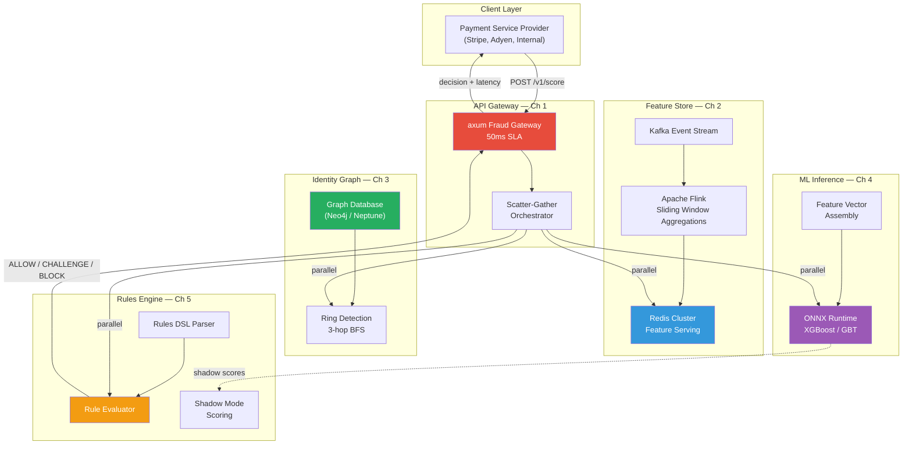

# System Design: The Real-Time Fraud Detection Engine

## Speaker Intro

This handbook is written from the perspective of a **Principal FinTech Security Architect** who has designed, deployed, and operated real-time fraud detection systems at scale. The content draws from first-hand experience building ML-powered transaction scoring pipelines that evaluate tens of thousands of transactions per second within a 50-millisecond SLA, operating streaming feature stores that maintain billions of sliding-window aggregations, deploying graph-based identity resolution engines that surface organized crime rings in real time, and keeping false-positive rates low enough that legitimate customers are never blocked.

## Who This Is For

- **Backend engineers** building or maintaining payments, e-commerce, or lending systems who want to understand how Stripe Radar, PayPal's fraud stack, and Adyen's RevenueProtect actually work under the hood — and implement their own in Rust.
- **ML engineers** whose models work beautifully offline but who struggle to serve them within a 5ms latency budget in production. You will learn how to compile models into native code via ONNX Runtime and serve them from Rust.
- **Data engineers** who build batch ETL pipelines and want to understand how to produce real-time features (e.g., "count of transactions in the last 60 seconds for this card") using Apache Flink and Redis, making those features instantly readable by ML models.
- **Security engineers** tasked with fighting organized fraud who need to go beyond individual-transaction scoring. You will learn how to build and traverse an identity graph to catch fraud rings that share device fingerprints, IP addresses, and stolen credentials.
- **Staff+ engineers** preparing for system design interviews where "design a fraud detection system" is an increasingly common question — and hand-waving about "we'll call an ML model" is no longer sufficient.

## Prerequisites

| Concept | Where to Learn |
|---|---|
| Intermediate Rust (ownership, traits, `async/.await`) | [Async Rust](../async-book/src/SUMMARY.md) |
| Tokio and async networking | [Tokio Internals](../tokio-internals-book/src/SUMMARY.md) |
| `axum` web framework basics | [Rust Microservices](../microservices-book/src/SUMMARY.md) |
| Stream processing intuition (Kafka, Flink concepts) | [Streaming Data Lakehouse](../streaming-data-lakehouse-book/src/SUMMARY.md) |
| Basic ML concepts (features, inference, model lifecycle) | External: [ML System Design](https://huyenchip.com/machine-learning-systems-design/) |
| Graph database fundamentals (nodes, edges, traversals) | External: [Neo4j Graph Academy](https://graphacademy.neo4j.com/) |

## How to Use This Book

| Emoji | Meaning |
|---|---|
| 🟢 | **Architecture** — foundational API gateway and scatter-gather patterns every fraud system needs on Day 1 |
| 🟡 | **Stream Processing** — real-time feature engineering, rules engines, and shadow mode deployment |
| 🔴 | **Graph / ML Inference** — advanced graph traversal for identity resolution and sub-5ms model serving |

Each chapter addresses **one critical subsystem** of a production fraud detection engine. Read them in order — the ML inference chapter assumes the feature store exists, and the rules engine chapter assumes the scoring pipeline is in place.

## The Problem We Are Solving

> Design a **real-time fraud detection engine** that intercepts every payment transaction, enriches it with hundreds of behavioral features, scores it with an ML model, traverses an identity graph for ring detection, and returns an `ALLOW / CHALLENGE / BLOCK` decision — all within **50 milliseconds** — while allowing risk analysts to deploy new rules instantly without code deploys.

The system we will build has these non-negotiable requirements:

| Requirement | Target |
|---|---|
| End-to-end latency | ≤ 50ms from API ingress to `ALLOW/CHALLENGE/BLOCK` response |
| ML inference latency | ≤ 5ms for model evaluation of 200+ features |
| Feature freshness | Sliding-window aggregations updated within 1 second of the triggering event |
| Graph traversal depth | 3-hop identity resolution within 10ms |
| Throughput | ≥ 50,000 transactions/second per cluster |
| False positive rate | < 0.1% — legitimate customers must not be blocked |
| Rule deployment latency | New boolean rules active within 30 seconds, no service restart |
| Shadow mode accuracy | New models evaluated on 100% of live traffic before activation |
| Availability | 99.99% — a fraud system outage means either blocking all payments or letting all fraud through |

## Pacing Guide

| Chapter | Topic | Time | Checkpoint |
|---|---|---|---|
| Ch 0 | Introduction & Architecture Overview | 30 min | Understand the full system canvas and data flow |
| Ch 1 | The 50-Millisecond SLA | 8–10 hours | Working `axum` gateway with parallel scatter-gather |
| Ch 2 | The Streaming Feature Store | 8–10 hours | Flink pipeline + Redis feature serving layer |
| Ch 3 | The Identity Graph Database | 8–10 hours | Graph traversal engine with ring detection |
| Ch 4 | Low-Latency ML Inference | 6–8 hours | ONNX Runtime model serving in Rust at < 5ms |
| Ch 5 | The Shadow Mode & Rules Engine | 6–8 hours | Dynamic rules DSL + shadow scoring pipeline |

**Total: ~37–47 hours** of focused study.

## Table of Contents

### Part I: The Critical Path
- **Chapter 1 — The 50-Millisecond SLA 🟢** — The synchronous critical path. Architecting the `axum` API gateway that intercepts every payment request. Designing a highly concurrent, parallel scatter-gather architecture using `tokio::join!` to fetch data from 5 different subsystems (feature store, identity graph, device fingerprint service, velocity checks, and account history) simultaneously, then assembling the enriched transaction for scoring — all within a strict 50ms wall-clock budget.

### Part II: Real-Time Feature Engineering
- **Chapter 2 — The Streaming Feature Store 🟡** — ML models need context. How do you know "this user has swiped this card 5 times in the last minute" instantly? Using Apache Flink to compute real-time sliding-window aggregations from a Kafka event stream, materializing them into Redis for sub-millisecond reads. Designing the feature schema, handling late arrivals, and ensuring feature consistency between training (offline) and serving (online).

### Part III: Graph Intelligence
- **Chapter 3 — The Identity Graph Database 🔴** — Catching organized crime. Using a graph database to build and traverse an identity graph: "Does this IP address share a device fingerprint with an account that previously used a stolen credit card?" Modeling entities (accounts, devices, IPs, cards, emails) as nodes and shared attributes as edges. Implementing Breadth-First Search with pruning to stay within a 10ms budget for 3-hop traversals.

### Part IV: Machine Learning at Wire Speed
- **Chapter 4 — Low-Latency ML Inference 🔴** — Deploying the model. Why Python Flask servers fail at this scale. Compiling XGBoost and gradient-boosted tree models into optimized native code using ONNX Runtime. Building a Rust inference service that evaluates 200+ features in under 5ms. Batching strategies, model versioning, A/B routing, and graceful model rollback.

### Part V: Operational Control Plane
- **Chapter 5 — The Shadow Mode & Rules Engine 🟡** — Empowering the risk analysts. Building a dynamic rules engine that allows business operators to deploy boolean logic (e.g., `IF country == 'NG' AND amount > 5000 THEN BLOCK`) instantly without deploying code. Implementing a rules DSL with a parser, optimizer, and evaluator. Running new ML models in "shadow mode" — scoring 100% of live traffic but only logging the result — to measure precision/recall before activating them in the critical path.

## Architecture Overview

The fraud detection engine is a **synchronous enrichment pipeline** with five major subsystems, all called in parallel from the API gateway:

## Companion Guides

This book pairs naturally with these other handbooks in the series:

| Book | Relevance |
|---|---|
| [Payment Gateway](../payment-gateway-book/src/SUMMARY.md) | The upstream system that calls our fraud engine before processing a charge |
| [Streaming Data Lakehouse](../streaming-data-lakehouse-book/src/SUMMARY.md) | Deep dive into Flink, Kafka, and Parquet — the batch side of our feature pipeline |
| [RTB Ad Exchange](../rtb-ad-exchange-book/src/SUMMARY.md) | Another sub-50ms scatter-gather system with ONNX inference — different domain, shared patterns |
| [Observability Platform](../observability-platform-book/src/SUMMARY.md) | Monitoring the fraud engine's P99 latency, false positive rate, and model drift |
| [Microservices](../microservices-book/src/SUMMARY.md) | Foundation for the `axum` API gateway and gRPC inter-service communication |
