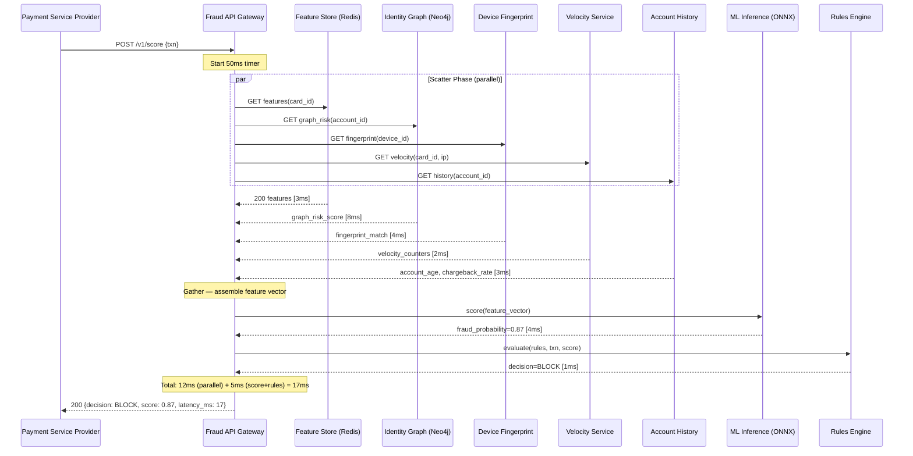
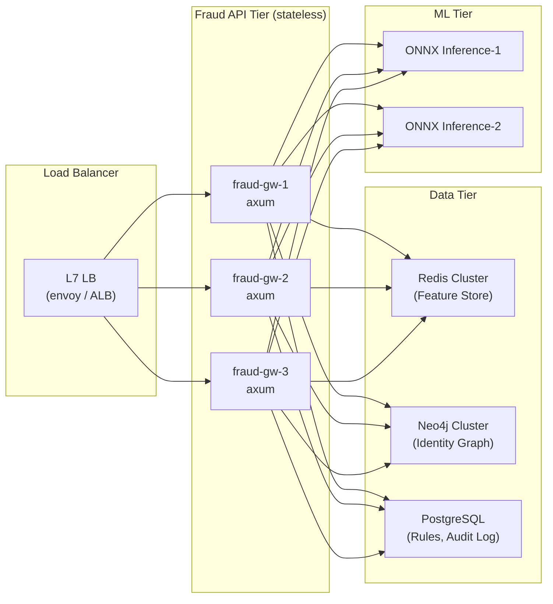

# Chapter 1: The 50-Millisecond SLA 🟢

> **The Problem:** A payment processor sends you every transaction for a fraud score before authorizing it. You have **50 milliseconds** wall-clock time to accept the HTTP request, fan out to five independent subsystems (feature store, identity graph, device fingerprint, velocity service, account history), collect their responses, assemble a feature vector, score it, apply rules, and return an `ALLOW / CHALLENGE / BLOCK` decision. If you miss the deadline, the payment processor defaults to `ALLOW` — and fraudsters know it.

---

## Why 50 Milliseconds?

Payment authorization flows are **synchronous and latency-critical**. Every millisecond you add to the fraud check is a millisecond added to the checkout experience. Card networks like Visa and Mastercard impose hard timeout windows on acquirers:

| Network | Authorization Timeout | Fraud Check Budget |
|---|---|---|
| Visa | 3 seconds end-to-end | ~200ms allocated to risk scoring |
| Mastercard | 2 seconds end-to-end | ~150ms allocated to risk scoring |
| Internal PSP (e.g., Stripe) | 500ms total | ~50ms for the fraud engine |
| Buy-Now-Pay-Later (BNPL) | 1 second total | ~100ms for risk |

Modern payment service providers (PSPs) like Stripe, Adyen, and Square allocate strict sub-budgets to their fraud engines. **50ms is the industry standard** for a first-party fraud scoring service that sits in the synchronous critical path.

If the fraud engine times out, the PSP has two choices:

1. **Default ALLOW** — Fraudsters exploit this by sending rapid-fire requests that overwhelm the fraud engine.
2. **Default BLOCK** — Legitimate customers are blocked, revenue is lost, and merchants churn.

Neither is acceptable. The SLA is not a goal — it is a **contract**.

---

## The Synchronous Critical Path

Every transaction flows through this pipeline:



The key insight: the five enrichment calls are **independent** and can run in parallel. The total latency is `max(subsystem latencies) + ML_inference + rules_evaluation`, not the sum.

---

## Designing the API Gateway in Rust

### The Transaction Request

```rust
use chrono::{DateTime, Utc};
use serde::{Deserialize, Serialize};
use uuid::Uuid;

/// Inbound transaction scoring request from the PSP.
#[derive(Debug, Deserialize)]
pub struct ScoreRequest {
    /// Idempotency key — deduplicates retried requests.
    pub request_id: Uuid,
    /// The payment transaction to evaluate.
    pub transaction: Transaction,
}

#[derive(Debug, Deserialize)]
pub struct Transaction {
    pub transaction_id: Uuid,
    pub card_id: String,
    pub account_id: String,
    pub device_id: Option<String>,
    pub ip_address: String,
    pub amount_cents: u64,
    pub currency: String,
    pub merchant_category_code: u16,
    pub merchant_country: String,
    pub billing_country: String,
    pub timestamp: DateTime<Utc>,
}

/// The decision returned to the PSP.
#[derive(Debug, Serialize)]
pub struct ScoreResponse {
    pub request_id: Uuid,
    pub decision: Decision,
    pub fraud_score: f64,
    pub latency_ms: u64,
    pub reasons: Vec<String>,
}

#[derive(Debug, Serialize, PartialEq)]
#[serde(rename_all = "SCREAMING_SNAKE_CASE")]
pub enum Decision {
    Allow,
    Challenge,
    Block,
}
```

### The Scatter-Gather Orchestrator

This is the heart of the system. We use `tokio::join!` to issue all five enrichment calls concurrently. Each call has its own timeout — if one subsystem is slow, we degrade gracefully rather than blowing the overall SLA.

```rust
use std::time::{Duration, Instant};
use tokio::time::timeout;

/// Maximum time for the entire scoring pipeline.
const GLOBAL_DEADLINE: Duration = Duration::from_millis(50);
/// Per-subsystem timeout — aggressive, leaves room for ML + rules.
const SUBSYSTEM_TIMEOUT: Duration = Duration::from_millis(20);

/// Result of a single enrichment call. On timeout or error, we use defaults.
#[derive(Debug)]
pub struct EnrichmentResult<T> {
    pub value: Option<T>,
    pub latency: Duration,
    pub source: &'static str,
}

impl<T: Default> EnrichmentResult<T> {
    /// Unwrap the value or fall back to a safe default.
    pub fn unwrap_or_default(self) -> T {
        self.value.unwrap_or_default()
    }
}

/// Fetch from a subsystem with a timeout. On timeout or error, return None
/// rather than failing the entire pipeline.
async fn fetch_with_timeout<T, F, Fut>(
    source: &'static str,
    deadline: Duration,
    f: F,
) -> EnrichmentResult<T>
where
    F: FnOnce() -> Fut,
    Fut: std::future::Future<Output = anyhow::Result<T>>,
{
    let start = Instant::now();
    let result = timeout(deadline, f()).await;
    let latency = start.elapsed();

    match result {
        Ok(Ok(value)) => EnrichmentResult {
            value: Some(value),
            latency,
            source,
        },
        Ok(Err(e)) => {
            tracing::warn!(source, error = %e, "enrichment call failed");
            EnrichmentResult {
                value: None,
                latency,
                source,
            }
        }
        Err(_) => {
            tracing::warn!(source, ?latency, "enrichment call timed out");
            EnrichmentResult {
                value: None,
                latency,
                source,
            }
        }
    }
}
```

### The Parallel Fan-Out

```rust
use crate::enrichment::*;

pub async fn score_transaction(
    txn: &Transaction,
    feature_store: &FeatureStoreClient,
    identity_graph: &IdentityGraphClient,
    device_service: &DeviceFingerprintClient,
    velocity_service: &VelocityClient,
    account_service: &AccountHistoryClient,
    ml_engine: &MlInferenceClient,
    rules_engine: &RulesEngine,
) -> ScoreResponse {
    let start = Instant::now();

    // ── Scatter Phase: 5 parallel enrichment calls ──────────────────────
    let (features, graph_risk, fingerprint, velocity, account) = tokio::join!(
        fetch_with_timeout("feature_store", SUBSYSTEM_TIMEOUT, || {
            feature_store.get_features(&txn.card_id)
        }),
        fetch_with_timeout("identity_graph", SUBSYSTEM_TIMEOUT, || {
            identity_graph.get_risk(&txn.account_id, &txn.ip_address)
        }),
        fetch_with_timeout("device_fingerprint", SUBSYSTEM_TIMEOUT, || {
            device_service.match_fingerprint(txn.device_id.as_deref())
        }),
        fetch_with_timeout("velocity", SUBSYSTEM_TIMEOUT, || {
            velocity_service.get_counters(&txn.card_id, &txn.ip_address)
        }),
        fetch_with_timeout("account_history", SUBSYSTEM_TIMEOUT, || {
            account_service.get_history(&txn.account_id)
        }),
    );

    // ── Gather Phase: assemble the feature vector ──────────────────────
    let feature_vector = FeatureVector::assemble(
        txn,
        features.unwrap_or_default(),
        graph_risk.unwrap_or_default(),
        fingerprint.unwrap_or_default(),
        velocity.unwrap_or_default(),
        account.unwrap_or_default(),
    );

    // ── Score Phase: ML inference ──────────────────────────────────────
    let fraud_score = ml_engine
        .predict(&feature_vector)
        .await
        .unwrap_or(0.5); // On ML failure, return an ambiguous score

    // ── Decision Phase: rules engine ───────────────────────────────────
    let (decision, reasons) = rules_engine.evaluate(txn, fraud_score, &feature_vector);

    let latency_ms = start.elapsed().as_millis() as u64;

    // ── Emit metrics ───────────────────────────────────────────────────
    metrics::histogram!("fraud.score.latency_ms").record(latency_ms as f64);
    metrics::counter!("fraud.score.decision", "decision" => decision.as_str())
        .increment(1);

    ScoreResponse {
        request_id: txn.transaction_id,
        decision,
        fraud_score,
        latency_ms,
        reasons,
    }
}
```

---

## The Feature Vector: 200+ Signals in a Single Struct

The feature vector is the **lingua franca** between enrichment and ML. It is a flat struct of numeric and categorical features that the ONNX model expects:

```rust
/// A flat feature vector matching the ONNX model's input schema.
/// Field order MUST match the training pipeline exactly.
#[derive(Debug, Default)]
pub struct FeatureVector {
    // ── Transaction features ───────────────────────────────────────
    pub amount_cents: f32,
    pub is_international: f32,            // 1.0 if billing != merchant country
    pub merchant_category_code: f32,
    pub hour_of_day: f32,                 // 0.0–23.0
    pub day_of_week: f32,                 // 0.0–6.0

    // ── Velocity features (from Feature Store / Velocity Service) ──
    pub card_txn_count_1m: f32,           // transactions in last 1 minute
    pub card_txn_count_5m: f32,           // transactions in last 5 minutes
    pub card_txn_count_1h: f32,           // transactions in last 1 hour
    pub card_txn_amount_sum_1h: f32,      // total spend in last 1 hour
    pub card_distinct_merchants_1h: f32,  // unique merchants in last 1 hour
    pub ip_txn_count_1m: f32,             // transactions from this IP in 1 min
    pub ip_distinct_cards_1h: f32,        // unique cards from this IP in 1 hour

    // ── Identity graph features ────────────────────────────────────
    pub graph_risk_score: f32,            // 0.0–1.0 from ring detection
    pub shared_device_count: f32,         // accounts sharing this device
    pub shared_ip_count: f32,             // accounts sharing this IP
    pub hops_to_known_fraud: f32,         // graph distance to a confirmed fraud node

    // ── Device fingerprint features ────────────────────────────────
    pub fingerprint_age_days: f32,        // how old is this fingerprint
    pub fingerprint_account_count: f32,   // accounts linked to this fingerprint
    pub is_emulator: f32,                 // 1.0 if device is an emulator
    pub is_vpn: f32,                      // 1.0 if IP is a known VPN

    // ── Account features ───────────────────────────────────────────
    pub account_age_days: f32,
    pub historical_chargeback_rate: f32,
    pub lifetime_txn_count: f32,
    pub avg_txn_amount: f32,
    pub days_since_last_txn: f32,
}

impl FeatureVector {
    pub fn assemble(
        txn: &Transaction,
        features: FeatureStoreResponse,
        graph: GraphRiskResponse,
        fingerprint: FingerprintResponse,
        velocity: VelocityResponse,
        account: AccountHistoryResponse,
    ) -> Self {
        Self {
            amount_cents: txn.amount_cents as f32,
            is_international: if txn.billing_country != txn.merchant_country {
                1.0
            } else {
                0.0
            },
            merchant_category_code: txn.merchant_category_code as f32,
            hour_of_day: txn.timestamp.hour() as f32,
            day_of_week: txn.timestamp.weekday().num_days_from_monday() as f32,

            card_txn_count_1m: features.card_txn_count_1m as f32,
            card_txn_count_5m: features.card_txn_count_5m as f32,
            card_txn_count_1h: features.card_txn_count_1h as f32,
            card_txn_amount_sum_1h: features.card_txn_amount_sum_1h as f32,
            card_distinct_merchants_1h: features.card_distinct_merchants_1h as f32,
            ip_txn_count_1m: velocity.ip_txn_count_1m as f32,
            ip_distinct_cards_1h: velocity.ip_distinct_cards_1h as f32,

            graph_risk_score: graph.risk_score,
            shared_device_count: graph.shared_device_count as f32,
            shared_ip_count: graph.shared_ip_count as f32,
            hops_to_known_fraud: graph.hops_to_known_fraud as f32,

            fingerprint_age_days: fingerprint.age_days as f32,
            fingerprint_account_count: fingerprint.account_count as f32,
            is_emulator: if fingerprint.is_emulator { 1.0 } else { 0.0 },
            is_vpn: if fingerprint.is_vpn { 1.0 } else { 0.0 },

            account_age_days: account.age_days as f32,
            historical_chargeback_rate: account.chargeback_rate,
            lifetime_txn_count: account.lifetime_txn_count as f32,
            avg_txn_amount: account.avg_txn_amount,
            days_since_last_txn: account.days_since_last_txn as f32,
        }
    }

    /// Serialize to a flat f32 slice for ONNX Runtime input.
    pub fn as_slice(&self) -> &[f32] {
        // SAFETY: FeatureVector is repr(C)-compatible, all fields are f32.
        // In production, use a macro or code-gen to guarantee this.
        unsafe {
            std::slice::from_raw_parts(
                self as *const Self as *const f32,
                std::mem::size_of::<Self>() / std::mem::size_of::<f32>(),
            )
        }
    }
}
```

---

## Timeout Budgeting: The Waterfall

Not all 50ms are created equal. You must allocate your time budget across phases:

```mermaid
gantt
    title 50ms Latency Budget Allocation
    dateFormat X
    axisFormat %Lms

    section Network
    TLS + HTTP parse       :a1, 0, 2

    section Scatter (parallel)
    Feature Store (Redis)  :a2, 2, 5
    Identity Graph (Neo4j) :a3, 2, 12
    Device Fingerprint     :a4, 2, 6
    Velocity Service       :a5, 2, 4
    Account History        :a6, 2, 5

    section Gather
    Assemble Feature Vector :a7, 12, 13

    section Score
    ML Inference (ONNX)    :a8, 13, 18
    Rules Engine           :a9, 18, 19

    section Response
    Serialize + Send       :a10, 19, 20
```



The scatter phase is bounded by the **slowest** subsystem (Identity Graph at ~10ms). The critical path is:

```
Network(2ms) + max(Scatter)(10ms) + Gather(1ms) + ML(5ms) + Rules(1ms) + Response(1ms) = 20ms
```

This leaves **30ms of headroom** for P99 tail latencies, GC pauses in downstream Java services, and network jitter.

### Timeout Strategy

| Subsystem | Timeout | Fallback on Timeout |
|---|---|---|
| Feature Store (Redis) | 15ms | Use stale features from local cache |
| Identity Graph | 15ms | Skip graph risk, set `graph_risk_score = 0.0` |
| Device Fingerprint | 10ms | Mark as `unknown_device`, add 0.1 to risk bias |
| Velocity Service | 10ms | Use last-known velocity from local cache |
| Account History | 10ms | Use account age from the transaction metadata |
| ML Inference | 8ms | Use rules-only scoring (no ML) |
| Rules Engine | 5ms | Return `CHALLENGE` (safe default) |

---

## The `axum` Handler

```rust
use axum::{extract::State, http::StatusCode, Json};
use std::sync::Arc;

pub type AppState = Arc<FraudEngineState>;

pub struct FraudEngineState {
    pub feature_store: FeatureStoreClient,
    pub identity_graph: IdentityGraphClient,
    pub device_service: DeviceFingerprintClient,
    pub velocity_service: VelocityClient,
    pub account_service: AccountHistoryClient,
    pub ml_engine: MlInferenceClient,
    pub rules_engine: RulesEngine,
}

/// POST /v1/score
///
/// Accepts a transaction, enriches it in parallel, scores it,
/// and returns a decision within the 50ms SLA.
pub async fn score_handler(
    State(state): State<AppState>,
    Json(req): Json<ScoreRequest>,
) -> Result<Json<ScoreResponse>, StatusCode> {
    let response = score_transaction(
        &req.transaction,
        &state.feature_store,
        &state.identity_graph,
        &state.device_service,
        &state.velocity_service,
        &state.account_service,
        &state.ml_engine,
        &state.rules_engine,
    )
    .await;

    if response.latency_ms > 50 {
        tracing::error!(
            latency_ms = response.latency_ms,
            request_id = %req.request_id,
            "SLA breach: scoring exceeded 50ms"
        );
        metrics::counter!("fraud.sla.breach").increment(1);
    }

    Ok(Json(response))
}

/// Build the axum router.
pub fn build_router(state: AppState) -> axum::Router {
    use axum::routing::post;

    axum::Router::new()
        .route("/v1/score", post(score_handler))
        .route("/healthz", axum::routing::get(|| async { "ok" }))
        .with_state(state)
        .layer(
            tower::ServiceBuilder::new()
                .layer(tower_http::trace::TraceLayer::new_for_http())
                .layer(tower_http::compression::CompressionLayer::new())
                .layer(tower_http::timeout::TimeoutLayer::new(GLOBAL_DEADLINE)),
        )
}
```

---

## Graceful Degradation: The Art of Partial Failure

A production fraud engine **cannot** fail hard. If the Identity Graph is down, you still score — you just have fewer features. This philosophy is encoded in the scatter-gather pattern:

| Failure Mode | Impact | Mitigation |
|---|---|---|
| Feature Store (Redis) down | No velocity features | Local Bloom filter cache + bias ML score upward |
| Identity Graph timeout | No graph risk score | Skip graph features, rely on velocity + device |
| Device Fingerprint 503 | No device match | Flag as `unknown_device`, increase risk weight |
| ML Inference crash | No ML score | Fall back to rules-only scoring |
| Rules Engine panic | No rule evaluation | Default to ML-score-based thresholds |

The decision function handles partial data:

```rust
impl Decision {
    pub fn from_score_and_rules(
        fraud_score: f64,
        rule_decision: Option<Decision>,
        missing_subsystems: &[&str],
    ) -> (Decision, Vec<String>) {
        let mut reasons = Vec::new();

        // Hard rule overrides always win.
        if let Some(rule) = rule_decision {
            if rule == Decision::Block {
                reasons.push("rules_engine: hard block rule matched".into());
                return (Decision::Block, reasons);
            }
        }

        // If critical subsystems are missing, be more conservative.
        let risk_bias = missing_subsystems.len() as f64 * 0.05;
        let adjusted_score = (fraud_score + risk_bias).min(1.0);

        if !missing_subsystems.is_empty() {
            reasons.push(format!(
                "degraded_mode: {} subsystems unavailable, bias +{:.2}",
                missing_subsystems.len(),
                risk_bias
            ));
        }

        let decision = match adjusted_score {
            s if s >= 0.85 => Decision::Block,
            s if s >= 0.50 => Decision::Challenge,
            _ => Decision::Allow,
        };

        reasons.push(format!("ml_score: {adjusted_score:.4}"));
        (decision, reasons)
    }
}
```

---

## Connection Pooling and Keep-Alive

At 50,000 TPS, you cannot establish new TCP connections for each enrichment call. Every client uses a **persistent connection pool**:

```rust
use reqwest::ClientBuilder;
use std::time::Duration;

/// Build an HTTP client optimized for low-latency enrichment calls.
pub fn build_enrichment_client() -> reqwest::Client {
    ClientBuilder::new()
        .pool_max_idle_per_host(64)         // Persist connections across requests
        .pool_idle_timeout(Duration::from_secs(90))
        .connect_timeout(Duration::from_millis(5))  // Fail fast if host is down
        .timeout(Duration::from_millis(20))          // Per-request timeout
        .tcp_nodelay(true)                   // Disable Nagle for low latency
        .http2_keep_alive_interval(Some(Duration::from_secs(30)))
        .build()
        .expect("failed to build HTTP client")
}
```

For Redis, we use `deadpool-redis` with a warm pool:

```rust
use deadpool_redis::{Config, Runtime};

pub fn build_redis_pool(url: &str) -> deadpool_redis::Pool {
    let cfg = Config::from_url(url);
    cfg.create_pool(Some(Runtime::Tokio1))
        .expect("failed to create Redis pool")
}
```

---

## Observability: You Cannot Optimize What You Cannot Measure

Every scoring request emits structured telemetry:

```rust
use tracing::instrument;

#[instrument(
    skip_all,
    fields(
        request_id = %txn.transaction_id,
        card_id = %txn.card_id,
        amount_cents = txn.amount_cents,
    )
)]
pub async fn score_transaction(/* ... */) -> ScoreResponse {
    // ... (body as above)

    // Per-subsystem latency histograms
    metrics::histogram!("fraud.enrichment.latency_ms", "source" => "feature_store")
        .record(features.latency.as_millis() as f64);
    metrics::histogram!("fraud.enrichment.latency_ms", "source" => "identity_graph")
        .record(graph_risk.latency.as_millis() as f64);
    // ... and so on for each subsystem

    // Track missing subsystems
    let missing: Vec<&str> = [&features, &graph_risk, &fingerprint, &velocity, &account]
        .iter()
        .filter(|r| r.value.is_none())
        .map(|r| r.source)
        .collect();

    if !missing.is_empty() {
        metrics::counter!("fraud.enrichment.degraded", "missing" => missing.join(","))
            .increment(1);
    }

    // ... continue to scoring
}
```

### Key Dashboards

| Metric | Alert Threshold | Action |
|---|---|---|
| `fraud.score.latency_ms` P99 | > 40ms | Investigate slowest subsystem |
| `fraud.sla.breach` rate | > 0.1% of requests | Page on-call — SLA at risk |
| `fraud.enrichment.degraded` | > 1% of requests | Check health of degraded subsystem |
| `fraud.score.decision` distribution | Block rate > 5% | Likely false-positive spike — check model |

---

## Load Shedding and Backpressure

At extreme load, the gateway must protect itself. We implement **adaptive concurrency limiting** using `tower::limit`:

```rust
use tower::limit::ConcurrencyLimitLayer;

pub fn build_router(state: AppState) -> axum::Router {
    axum::Router::new()
        .route("/v1/score", axum::routing::post(score_handler))
        .with_state(state)
        .layer(
            tower::ServiceBuilder::new()
                // At most 10,000 concurrent scoring requests
                .layer(ConcurrencyLimitLayer::new(10_000))
                .layer(tower_http::timeout::TimeoutLayer::new(GLOBAL_DEADLINE))
                .layer(tower_http::trace::TraceLayer::new_for_http()),
        )
}
```

When the concurrency limit is reached, new requests receive HTTP 503 immediately rather than queuing and blowing the SLA for everyone.

---

## Comparison: Sequential vs. Parallel Enrichment

| Approach | Enrichment Latency | Can Meet 50ms SLA? | Complexity |
|---|---|---|---|
| **Sequential** — call each subsystem one by one | `sum(all subsystems) ≈ 25–35ms` | ❌ No headroom for ML + rules | Low |
| **Parallel (`tokio::join!`)** — fan out to all 5 at once | `max(subsystems) ≈ 8–12ms` | ✅ 30ms+ headroom | Medium |
| **Parallel + Timeout + Fallback** — as designed above | `max(responsive subsystems) ≈ 8–12ms` | ✅ Robust under partial failure | High (recommended) |

---

## Deployment Topology



The fraud API tier is **stateless** — each gateway instance holds only connection pools and a local copy of the rules engine configuration. Horizontal scaling is trivial: add more pods behind the load balancer.

---

## Exercises

### Exercise 1: Implement a Mock Scatter-Gather

Build a simplified scatter-gather orchestrator that calls three mock async functions with random latencies (0–20ms) and a configurable timeout. Print which calls succeeded and which timed out.

<details>
<summary>Solution</summary>

```rust
use std::time::Duration;
use tokio::time::{sleep, timeout};
use rand::Rng;

async fn mock_subsystem(name: &str) -> String {
    let delay = rand::rng().random_range(0..20);
    sleep(Duration::from_millis(delay)).await;
    format!("{name}: responded in {delay}ms")
}

#[tokio::main]
async fn main() {
    let deadline = Duration::from_millis(10);

    let (a, b, c) = tokio::join!(
        timeout(deadline, mock_subsystem("feature_store")),
        timeout(deadline, mock_subsystem("identity_graph")),
        timeout(deadline, mock_subsystem("velocity")),
    );

    for (name, result) in [("feature_store", a), ("identity_graph", b), ("velocity", c)] {
        match result {
            Ok(msg) => println!("✅ {msg}"),
            Err(_) => println!("⏰ {name}: timed out after {deadline:?}"),
        }
    }
}
```

</details>

### Exercise 2: Latency Budget Calculator

Given a list of subsystem P50 and P99 latencies, write a function that calculates whether a given SLA can be met with parallel execution. Account for ML inference and rules engine overhead.

<details>
<summary>Solution</summary>

```rust
struct SubsystemLatency {
    name: &'static str,
    p50_ms: u64,
    p99_ms: u64,
}

fn can_meet_sla(subsystems: &[SubsystemLatency], ml_ms: u64, rules_ms: u64, sla_ms: u64) -> bool {
    let parallel_p99 = subsystems.iter().map(|s| s.p99_ms).max().unwrap_or(0);
    let total_p99 = parallel_p99 + ml_ms + rules_ms + 2; // +2ms for network overhead

    println!("Parallel P99: {parallel_p99}ms");
    println!("Total P99:    {total_p99}ms (SLA: {sla_ms}ms)");
    println!("Headroom:     {}ms", sla_ms.saturating_sub(total_p99));

    total_p99 <= sla_ms
}

fn main() {
    let subsystems = vec![
        SubsystemLatency { name: "feature_store", p50_ms: 3, p99_ms: 8 },
        SubsystemLatency { name: "identity_graph", p50_ms: 8, p99_ms: 15 },
        SubsystemLatency { name: "device_fp", p50_ms: 4, p99_ms: 10 },
        SubsystemLatency { name: "velocity", p50_ms: 2, p99_ms: 5 },
        SubsystemLatency { name: "account_history", p50_ms: 3, p99_ms: 7 },
    ];

    let meets = can_meet_sla(&subsystems, 5, 1, 50);
    println!("Meets 50ms SLA: {meets}"); // true — 15 + 5 + 1 + 2 = 23ms
}
```

</details>

---

> **Key Takeaways**
>
> 1. **The 50ms SLA is a contract, not a goal.** If the fraud engine misses its deadline, the payment processor either lets fraud through or blocks legitimate customers. Neither is acceptable.
> 2. **Scatter-gather is the fundamental pattern.** Five independent enrichment calls execute in parallel using `tokio::join!`. Total latency is `max(subsystems)`, not `sum(subsystems)`.
> 3. **Every subsystem call must have its own timeout and fallback.** Partial failure is normal. A missing graph risk score is better than a blown SLA.
> 4. **The feature vector is the contract between enrichment and ML.** Define it explicitly, version it, and keep it consistent between training and serving.
> 5. **Observability is non-negotiable.** Every enrichment call, every ML inference, and every decision must emit latency histograms and counters. You cannot optimize what you cannot measure.
