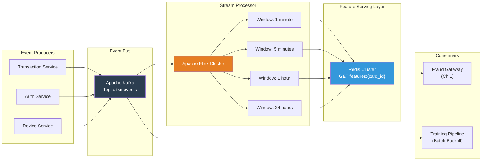
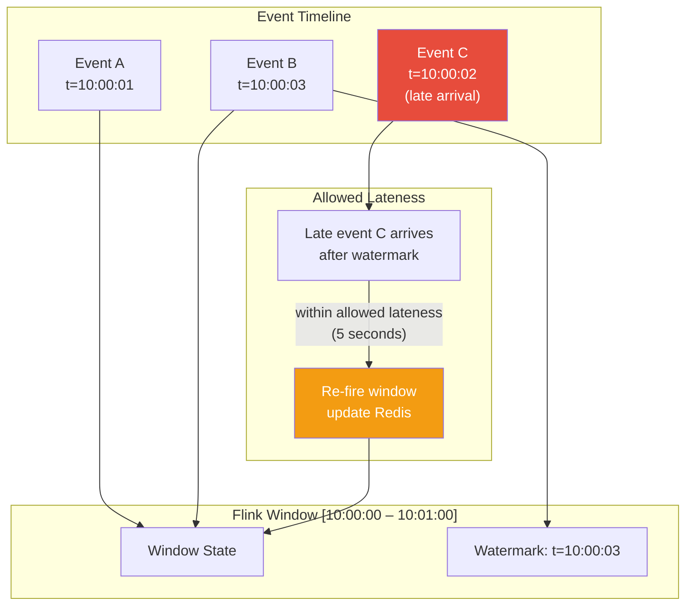
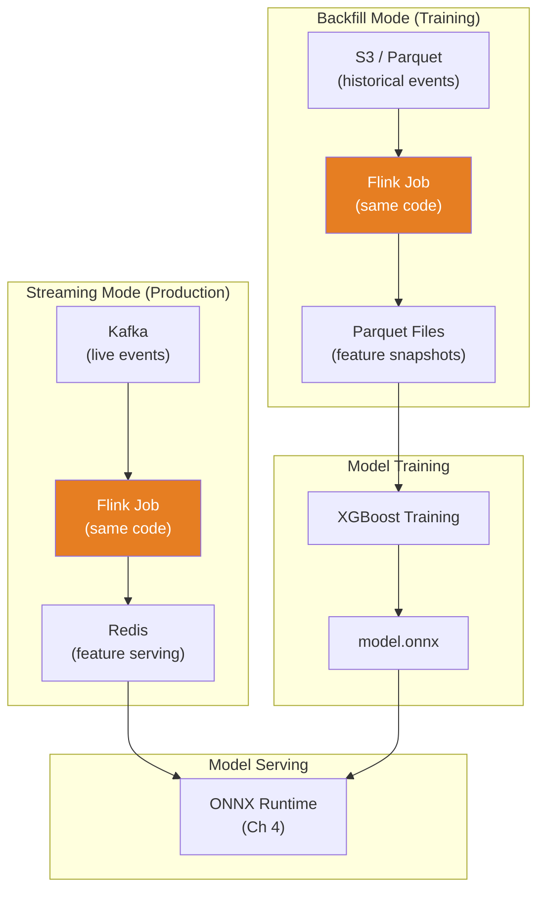

# Chapter 2: The Streaming Feature Store 🟡

> **The Problem:** Your ML model needs to know "this card has been swiped 5 times in the last 60 seconds" **at inference time** — not 5 minutes later when a batch job finishes. You need a system that ingests every transaction event from Kafka, continuously computes sliding-window aggregations (counts, sums, distinct counts) across millions of entity keys, and materializes the results into Redis so the fraud gateway can read fresh features in under 1 millisecond.

---

## Why Features Must Be Real-Time

Fraud models are only as good as the features they consume. Consider two scenarios:

| Feature Freshness | Fraudster Pattern | Detection |
|---|---|---|
| **Batch (hourly)** | Stolen card used 47 times in 3 minutes | ❌ Model sees `card_txn_count_1h = 0` until the next ETL run |
| **Real-time (< 1 second)** | Stolen card used 47 times in 3 minutes | ✅ Model sees `card_txn_count_1m = 47` _during the attack_ |

The difference between batch and streaming features is the difference between detecting a fraud ring **after** $200,000 in losses and catching it **on the 3rd transaction**.

### The Feature/Label Skew Problem

There is a subtler danger: **training-serving skew**. If you train your model on batch-computed features (computed over exact historical windows) but serve it real-time features (computed over approximate sliding windows), the model sees a different data distribution in production than it saw during training. The result: degraded precision and recall.

The solution: **compute features using the same Flink pipeline for both training (backfill mode) and serving (streaming mode)**. This is called a **unified feature pipeline**, and it is the single most important architectural decision in ML-powered fraud detection.

---

## Architecture: From Event to Feature in < 1 Second



---

## The Event Schema

Every transaction produces a lightweight event on Kafka:

```rust
use chrono::{DateTime, Utc};
use serde::{Deserialize, Serialize};

/// Event emitted to Kafka after each payment attempt.
#[derive(Debug, Serialize, Deserialize)]
pub struct TransactionEvent {
    pub event_id: String,
    pub timestamp: DateTime<Utc>,
    pub card_id: String,
    pub account_id: String,
    pub merchant_id: String,
    pub ip_address: String,
    pub device_id: Option<String>,
    pub amount_cents: u64,
    pub currency: String,
    pub merchant_country: String,
    pub merchant_category_code: u16,
    pub outcome: TransactionOutcome,
}

#[derive(Debug, Serialize, Deserialize)]
#[serde(rename_all = "snake_case")]
pub enum TransactionOutcome {
    Approved,
    Declined,
    Fraud,      // Confirmed fraud (from chargebacks)
    Pending,
}
```

The Kafka topic `txn.events` is partitioned **by card_id** to guarantee ordering per card. This is critical — Flink's window operators need causal ordering within each key.

---

## Flink: Sliding Window Aggregations

Apache Flink processes the Kafka stream and maintains sliding-window aggregations. Here is the conceptual Flink SQL for the feature pipeline:

### Window Definitions

```sql
-- Tumbling windows are simpler but produce stale features at window boundaries.
-- Sliding windows update continuously but cost more in state.
-- We use HOPPING windows (sliding) with a 1-second slide for freshness.

-- Feature: card transaction count in the last 1 minute
SELECT
    card_id,
    COUNT(*) AS card_txn_count_1m,
    SUM(amount_cents) AS card_txn_amount_sum_1m,
    COUNT(DISTINCT merchant_id) AS card_distinct_merchants_1m
FROM txn_events
GROUP BY
    card_id,
    HOP(event_time, INTERVAL '1' SECOND, INTERVAL '1' MINUTE);

-- Feature: card transaction count in the last 1 hour
SELECT
    card_id,
    COUNT(*) AS card_txn_count_1h,
    SUM(amount_cents) AS card_txn_amount_sum_1h,
    COUNT(DISTINCT merchant_id) AS card_distinct_merchants_1h
FROM txn_events
GROUP BY
    card_id,
    HOP(event_time, INTERVAL '10' SECOND, INTERVAL '1' HOUR);

-- Feature: IP-level velocity (distinct cards per IP in last 1 hour)
SELECT
    ip_address,
    COUNT(DISTINCT card_id) AS ip_distinct_cards_1h,
    COUNT(*) AS ip_txn_count_1h
FROM txn_events
GROUP BY
    ip_address,
    HOP(event_time, INTERVAL '10' SECOND, INTERVAL '1' HOUR);
```

### Why Hopping Windows?

| Window Type | Freshness | State Size | Use Case |
|---|---|---|---|
| **Tumbling** (non-overlapping) | Stale at boundaries — features jump | Small | Batch aggregations |
| **Sliding** / **Hopping** (overlapping, with slide interval) | Continuously fresh | Larger (proportional to window/slide ratio) | ✅ Real-time fraud features |
| **Session** (gap-based) | Activity-dependent | Variable | User session analysis |

For a 1-minute window with a 1-second slide, Flink maintains 60 micro-batches of state per key. For a 1-hour window with a 10-second slide, it maintains 360 micro-batches. The tradeoff: **fresher features cost more state**, and Flink's RocksDB state backend handles this gracefully with spill-to-disk.

---

## Materializing Features to Redis

Flink sinks window results to Redis using a custom `RedisSink`. Each feature set is stored as a Redis Hash, keyed by entity:

```
# Redis key pattern: features:{entity_type}:{entity_id}
# TTL: 2x the longest window (e.g., 48 hours for 24-hour windows)

HSET features:card:4111-xxxx-xxxx-1234
    card_txn_count_1m       "7"
    card_txn_count_5m       "12"
    card_txn_count_1h       "34"
    card_txn_amount_sum_1h  "156700"
    card_distinct_merchants_1h "8"

HSET features:ip:203.0.113.42
    ip_txn_count_1h         "89"
    ip_distinct_cards_1h    "23"
```

### The Redis Sink in Flink (Java)

```java
public class RedisFeatureSink extends RichSinkFunction<FeatureUpdate> {
    private transient JedisCluster jedis;

    @Override
    public void open(Configuration params) {
        Set<HostAndPort> nodes = parseRedisNodes(
            getRuntimeContext().getExecutionConfig()
                .getGlobalJobParameters().toMap().get("redis.nodes")
        );
        jedis = new JedisCluster(nodes);
    }

    @Override
    public void invoke(FeatureUpdate update, Context ctx) {
        String key = String.format("features:%s:%s",
            update.getEntityType(), update.getEntityId());

        // Atomic multi-field update
        jedis.hset(key, update.getFeatures());

        // TTL: 2x the window duration to handle late arrivals
        jedis.expire(key, update.getWindowSeconds() * 2);
    }
}
```

---

## The Rust Feature Store Client

Back in the fraud gateway (Chapter 1), the feature store client reads from Redis:

```rust
use deadpool_redis::Pool;
use redis::AsyncCommands;

pub struct FeatureStoreClient {
    pool: Pool,
}

/// Response from the feature store for a given card.
#[derive(Debug, Default)]
pub struct FeatureStoreResponse {
    pub card_txn_count_1m: u64,
    pub card_txn_count_5m: u64,
    pub card_txn_count_1h: u64,
    pub card_txn_amount_sum_1h: u64,
    pub card_distinct_merchants_1h: u64,
}

impl FeatureStoreClient {
    pub fn new(pool: Pool) -> Self {
        Self { pool }
    }

    /// Fetch all features for a card from Redis.
    /// Uses HMGET for a single round-trip.
    pub async fn get_features(&self, card_id: &str) -> anyhow::Result<FeatureStoreResponse> {
        let mut conn = self.pool.get().await?;
        let key = format!("features:card:{card_id}");

        // Single HMGET — one round-trip, ~0.2ms on localhost Redis
        let values: Vec<Option<String>> = redis::cmd("HMGET")
            .arg(&key)
            .arg("card_txn_count_1m")
            .arg("card_txn_count_5m")
            .arg("card_txn_count_1h")
            .arg("card_txn_amount_sum_1h")
            .arg("card_distinct_merchants_1h")
            .query_async(&mut *conn)
            .await?;

        Ok(FeatureStoreResponse {
            card_txn_count_1m: parse_u64(&values[0]),
            card_txn_count_5m: parse_u64(&values[1]),
            card_txn_count_1h: parse_u64(&values[2]),
            card_txn_amount_sum_1h: parse_u64(&values[3]),
            card_distinct_merchants_1h: parse_u64(&values[4]),
        })
    }
}

fn parse_u64(val: &Option<String>) -> u64 {
    val.as_deref()
        .and_then(|s| s.parse().ok())
        .unwrap_or(0)
}
```

---

## Handling Late Arrivals and Out-of-Order Events

Distributed systems do not guarantee ordered delivery. A transaction event might arrive in Kafka **after** the window that should contain it has already closed. Flink handles this with **watermarks** and **allowed lateness**:



### Watermark Strategy

```sql
-- Bounded out-of-orderness: allow events up to 5 seconds late
CREATE TABLE txn_events (
    event_id STRING,
    card_id STRING,
    amount_cents BIGINT,
    event_time TIMESTAMP(3),
    -- Watermark: events can be up to 5 seconds out of order
    WATERMARK FOR event_time AS event_time - INTERVAL '5' SECOND
) WITH (
    'connector' = 'kafka',
    'topic' = 'txn.events',
    'properties.bootstrap.servers' = 'kafka:9092',
    'format' = 'json'
);
```

| Watermark Lag | Late Events Handled | Feature Freshness Impact |
|---|---|---|
| 0 seconds | None — any out-of-order event is dropped | Instant, but lossy |
| 5 seconds | Most network-induced reordering | ~5 second additional latency |
| 30 seconds | Cross-datacenter replication delays | Stale features near window boundaries |

We use **5 seconds** as the watermark lag — sufficient so handle 99.9% of production reordering while keeping features nearly real-time.

---

## Training-Serving Consistency: The Unified Pipeline

The most insidious bug in ML-powered fraud detection is **feature skew**: the features used during training differ from those used during inference. This happens when:

1. Training uses batch SQL (`SELECT COUNT(*) ... WHERE timestamp BETWEEN ...`)
2. Serving uses streaming Flink (sliding windows with watermarks)
3. The two compute slightly different counts due to boundary effects, late arrivals, or time zone handling

### The Solution: One Pipeline, Two Modes



The **same Flink job code** runs in both modes:
- **Streaming mode:** Reads from Kafka, writes to Redis.
- **Backfill mode:** Reads from S3/Parquet (using Flink's FileSource), writes to Parquet. Timestamps are derived from the `event_time` column, not wall-clock time.

This guarantees that the features used during training are byte-for-byte identical to those the model sees in production.

---

## Feature Schema Registry

With 200+ features across multiple entity types, you need a schema registry to track feature definitions, types, and versions:

```rust
use std::collections::HashMap;

/// Registry of all features served by the feature store.
#[derive(Debug)]
pub struct FeatureRegistry {
    pub features: HashMap<String, FeatureDefinition>,
}

#[derive(Debug)]
pub struct FeatureDefinition {
    /// Unique feature name (e.g., "card_txn_count_1m").
    pub name: String,
    /// Entity type this feature is keyed on.
    pub entity: EntityType,
    /// Data type of the feature value.
    pub dtype: FeatureDtype,
    /// Window duration (if this is a windowed aggregation).
    pub window: Option<std::time::Duration>,
    /// Aggregation function.
    pub aggregation: Aggregation,
    /// Human-readable description.
    pub description: String,
    /// Version — bumped when the computation logic changes.
    pub version: u32,
}

#[derive(Debug)]
pub enum EntityType {
    Card,
    Account,
    Ip,
    Device,
    Merchant,
}

#[derive(Debug)]
pub enum FeatureDtype {
    Count,
    Sum,
    DistinctCount,
    Rate,
    Boolean,
}

#[derive(Debug)]
pub enum Aggregation {
    Count,
    Sum,
    CountDistinct,
    Max,
    Min,
    Avg,
    Last,
}
```

### Example Registry Entry

```rust
let card_txn_count_1m = FeatureDefinition {
    name: "card_txn_count_1m".into(),
    entity: EntityType::Card,
    dtype: FeatureDtype::Count,
    window: Some(Duration::from_secs(60)),
    aggregation: Aggregation::Count,
    description: "Number of transactions on this card in the last 60 seconds".into(),
    version: 3,
};
```

---

## Redis Optimization: Memory and Throughput

At 50,000 TPS with millions of active cards, Redis must be carefully tuned:

### Memory Estimation

```
Entities:
  Active cards (24h):        10,000,000
  Active IPs (24h):           5,000,000
  Active devices (24h):       8,000,000

Features per entity:
  Card:   5 features × ~20 bytes/value = 100 bytes + key overhead
  IP:     2 features × ~20 bytes/value =  40 bytes + key overhead
  Device: 3 features × ~20 bytes/value =  60 bytes + key overhead

Key overhead (Redis hash, small): ~200 bytes per key

Total:
  Cards:   10M × 300 bytes  =  3.0 GB
  IPs:      5M × 240 bytes  =  1.2 GB
  Devices:  8M × 260 bytes  =  2.1 GB
                              ─────────
  Total:                       6.3 GB

With 2x headroom for fragmentation + replication:  ~13 GB
```

### Throughput

| Operation | Latency (P99) | Throughput |
|---|---|---|
| `HMGET` (5 fields) | 0.3ms | 200,000 ops/sec per shard |
| `HSET` (5 fields) | 0.4ms | 150,000 ops/sec per shard |
| Pipeline (10 ops) | 0.5ms | 500,000 ops/sec per shard |

A 6-shard Redis Cluster handles 50,000 TPS of reads (from the fraud gateway) + 50,000 TPS of writes (from Flink) comfortably.

### Configuration

```
# redis.conf optimizations for feature store workload
maxmemory 16gb
maxmemory-policy allkeys-lru        # Evict oldest features under pressure
hash-max-listpack-entries 128       # Small hashes use memory-efficient encoding
hash-max-listpack-value 64
tcp-backlog 511                     # Handle connection bursts
timeout 0                           # Don't close idle connections
tcp-keepalive 60
```

---

## Local Cache: The Last Line of Defense

If Redis is unreachable, the fraud gateway must not fail. We maintain a **local in-process cache** using `moka` (a concurrent, bounded cache for Rust):

```rust
use moka::future::Cache;
use std::time::Duration;

pub struct CachedFeatureStoreClient {
    /// Primary: Redis cluster.
    redis: FeatureStoreClient,
    /// Fallback: in-process LRU cache.
    local_cache: Cache<String, FeatureStoreResponse>,
}

impl CachedFeatureStoreClient {
    pub fn new(redis: FeatureStoreClient) -> Self {
        let local_cache = Cache::builder()
            .max_capacity(1_000_000)              // Cache up to 1M entities
            .time_to_live(Duration::from_secs(60)) // Stale after 60 seconds
            .build();

        Self { redis, local_cache }
    }

    pub async fn get_features(&self, card_id: &str) -> FeatureStoreResponse {
        let key = format!("card:{card_id}");

        // Try Redis first
        match self.redis.get_features(card_id).await {
            Ok(features) => {
                // Write-through to local cache
                self.local_cache.insert(key, features.clone()).await;
                features
            }
            Err(e) => {
                tracing::warn!(error = %e, "Redis unavailable, using local cache");
                metrics::counter!("fraud.feature_store.cache_fallback").increment(1);

                // Fall back to local cache (may be stale)
                self.local_cache
                    .get(&key)
                    .await
                    .unwrap_or_default()
            }
        }
    }
}
```

---

## Monitoring the Feature Pipeline

### End-to-End Latency: Event to Feature

The most critical metric is **event-to-feature latency**: how long after a transaction occurs until its effect is visible in Redis.

```rust
/// Called by the Flink sink after writing to Redis.
fn emit_feature_freshness_metric(event_time: DateTime<Utc>) {
    let freshness_ms = Utc::now()
        .signed_duration_since(event_time)
        .num_milliseconds();

    metrics::histogram!("fraud.feature_store.freshness_ms")
        .record(freshness_ms as f64);
}
```

### Key Metrics

| Metric | Target | Alert Threshold |
|---|---|---|
| `feature_store.freshness_ms` P99 | < 1,000ms | > 5,000ms |
| `feature_store.redis.latency_ms` P99 | < 1ms | > 5ms |
| `feature_store.flink.checkpoint_duration_ms` | < 10,000ms | > 30,000ms |
| `feature_store.flink.backpressure` | 0% | > 10% sustained |
| `feature_store.kafka.consumer_lag` | < 1,000 events | > 10,000 events |
| `feature_store.cache_fallback` rate | 0% | > 0.1% |

---

## Comparison: Feature Store Architectures

| Approach | Freshness | Complexity | Serving Latency | Training Consistency |
|---|---|---|---|---|
| **Batch ETL → Postgres** | Hours | Low | ~5ms | ❌ Different code path |
| **Spark Structured Streaming → Redis** | Seconds–minutes | Medium | < 1ms | ⚠️ Requires careful alignment |
| **Flink → Redis (this chapter)** | Sub-second | High | < 1ms | ✅ Same Flink job for both |
| **Feature store platform (Feast, Tecton)** | Sub-second | Medium (managed) | < 1ms | ✅ Built-in point-in-time joins |

---

## Exercises

### Exercise 1: Implement a Simple Sliding Window in Rust

Without using Flink, implement a sliding window counter in Rust that tracks "number of events in the last N seconds" for a given key, using a `VecDeque` of timestamps.

<details>
<summary>Solution</summary>

```rust
use std::collections::{HashMap, VecDeque};
use std::time::{Duration, Instant};

pub struct SlidingWindowCounter {
    window: Duration,
    counters: HashMap<String, VecDeque<Instant>>,
}

impl SlidingWindowCounter {
    pub fn new(window: Duration) -> Self {
        Self {
            window,
            counters: HashMap::new(),
        }
    }

    /// Record an event for the given key.
    pub fn record(&mut self, key: &str) {
        let now = Instant::now();
        let deque = self.counters.entry(key.to_string()).or_default();
        deque.push_back(now);
        self.evict(deque, now);
    }

    /// Get the count of events in the current window for the given key.
    pub fn count(&mut self, key: &str) -> usize {
        let now = Instant::now();
        if let Some(deque) = self.counters.get_mut(key) {
            self.evict(deque, now);
            deque.len()
        } else {
            0
        }
    }

    fn evict(&self, deque: &mut VecDeque<Instant>, now: Instant) {
        while let Some(&front) = deque.front() {
            if now.duration_since(front) > self.window {
                deque.pop_front();
            } else {
                break;
            }
        }
    }
}

fn main() {
    let mut counter = SlidingWindowCounter::new(Duration::from_secs(60));

    counter.record("card:4111");
    counter.record("card:4111");
    counter.record("card:4111");

    println!("Count: {}", counter.count("card:4111")); // 3
}
```

</details>

### Exercise 2: Redis Feature Schema

Design a Redis key schema for a feature store that supports 4 entity types (card, account, IP, device) with 5 features each across 4 window sizes (1m, 5m, 1h, 24h). How many Redis keys does this create for 10 million active cards? What is the memory footprint?

<details>
<summary>Solution</summary>

**Key Schema:**
```
features:{entity_type}:{entity_id}:{window}
```

Example: `features:card:4111-xxxx:1m`

**Key Count:**
- 4 entity types × 4 windows = 16 hashes per entity
- But we can optimize: **one hash per entity, with window-prefixed field names:**

```
HSET features:card:4111-xxxx
    1m_txn_count   "7"
    1m_amount_sum  "45000"
    5m_txn_count   "12"
    ...
    24h_txn_count  "89"
```

This gives **1 key per entity** with 20 fields (5 features × 4 windows).

**Memory for 10M active cards:**
- 1 key × 20 fields × ~20 bytes/field = ~400 bytes data
- Redis overhead per hash: ~200 bytes (using listpack encoding for small hashes)
- Total per entity: ~600 bytes
- 10M cards: 10M × 600 = **6 GB**
- With replication factor 2: **12 GB**

</details>

---

> **Key Takeaways**
>
> 1. **Real-time features are the difference between catching fraud on the 3rd transaction and discovering it after $200K in losses.** Batch features are table stakes. Streaming features are the competitive edge.
> 2. **Use a unified Flink pipeline for both training and serving.** Feature skew is the #1 silent killer of ML model accuracy in production. Same code, same windows, same watermarks.
> 3. **Redis is not a database — it is a serving cache.** Features are computed by Flink and _materialized_ to Redis. If Redis is down, fall back to a local cache with stale features rather than failing the scoring pipeline.
> 4. **Watermarks and allowed lateness are not optional.** In a distributed system, events arrive out of order. A 5-second watermark lag handles 99.9% of production reordering while keeping features fresh.
> 5. **Monitor event-to-feature freshness as a first-class SLA.** If features are stale, the model is blind. Track the P99 freshness latency and alert before it degrades.
