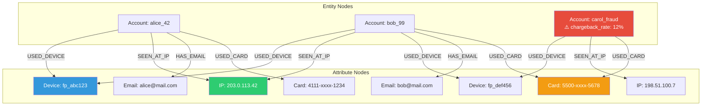
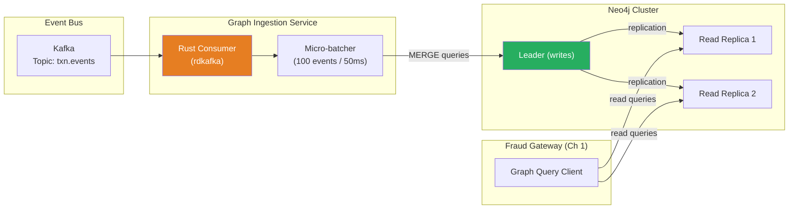
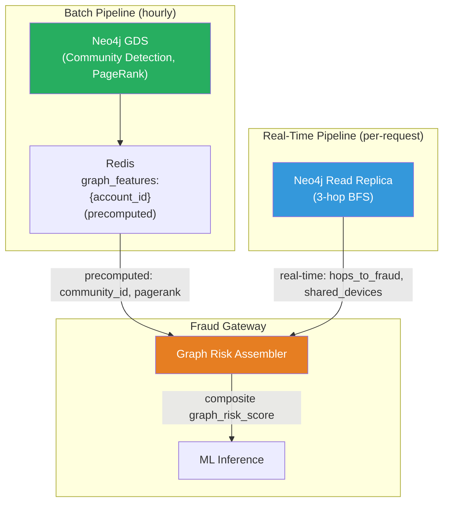

# Chapter 3: The Identity Graph Database 🔴

> **The Problem:** A single stolen credit card is easy to detect — velocity checks and ML models catch it within a few transactions. But organized fraud rings are different. They use **hundreds** of synthetic identities, rotating across stolen cards, shared devices, VPN-hopped IP addresses, and disposable email accounts. No single transaction looks suspicious. The pattern only emerges when you realize that Account A shares a device fingerprint with Account B, which shares an IP address with Account C, which previously filed a chargeback on a stolen card. You need a **graph database** that models entities and their shared attributes as nodes and edges, and a traversal engine that answers the question "how close is this transaction to known fraud?" within **10 milliseconds**.

---

## Why Tables Fail and Graphs Succeed

Relational databases model the world as rows and columns. Graph databases model the world as **entities and relationships**. For fraud detection, the difference is existential.

Consider this question: _"Does the device used in this transaction share an IP address with any account that has a chargeback rate above 5%?"_

### The Relational Approach

```sql
-- 3-hop traversal in SQL: device → IP → account → chargeback history
SELECT DISTINCT a3.account_id, a3.chargeback_rate
FROM transactions t1
JOIN device_ips di1 ON t1.device_id = di1.device_id
JOIN device_ips di2 ON di1.ip_address = di2.ip_address
  AND di2.device_id != di1.device_id
JOIN account_devices ad ON di2.device_id = ad.device_id
JOIN accounts a3 ON ad.account_id = a3.account_id
WHERE t1.transaction_id = $1
  AND a3.chargeback_rate > 0.05;
```

This query involves **four JOINs** across tables with millions of rows. Even with indexes, the query planner produces a nested-loop join that scans hundreds of thousands of rows. Latency: **200–500ms** — ten times our budget.

### The Graph Approach

```cypher
// Same 3-hop traversal in Cypher (Neo4j)
MATCH (txn:Transaction {id: $txn_id})-[:USED_DEVICE]->(dev:Device)
      -[:SEEN_AT_IP]->(ip:IP)
      <-[:SEEN_AT_IP]-(other_dev:Device)
      <-[:USED_DEVICE]-(other_acct:Account)
WHERE other_acct.chargeback_rate > 0.05
  AND other_acct <> txn.account
RETURN other_acct.id, other_acct.chargeback_rate
LIMIT 10
```

Graph databases store relationships as **first-class pointers** in the storage engine. Traversing an edge is an O(1) pointer dereference, not a table scan. Latency: **3–8ms** for a 3-hop traversal with moderate fan-out.

### Performance Comparison

| Operation | PostgreSQL (indexed) | Neo4j | Amazon Neptune |
|---|---|---|---|
| 1-hop: "accounts sharing this device" | ~5ms | ~1ms | ~2ms |
| 2-hop: "devices sharing an IP with this device" | ~50ms | ~3ms | ~4ms |
| 3-hop: "accounts connected to known fraud via shared attributes" | ~200–500ms | ~5–10ms | ~6–12ms |
| 4-hop: "full ring detection" | Timeout | ~15–30ms | ~20–40ms |
| Scaling with data size | Degrades rapidly (JOIN explosion) | Degrades linearly with fan-out | Degrades linearly with fan-out |

The inflection point is clear: **beyond 2 hops, relational databases cannot meet real-time SLAs**.

---

## The Identity Graph Data Model

Every fraud detection system's graph has the same core structure: **entity nodes** connected by **shared-attribute edges**.



In this graph:
- **alice_42** and **bob_99** share device `fp_abc123` and IP `203.0.113.42`. This is suspicious but not conclusive (could be a shared household).
- **bob_99** and **carol_fraud** share device `fp_def456` and card `5500-xxxx-5678`. Carol has a 12% chargeback rate.
- Therefore, **alice_42** is **2 hops** from a confirmed fraudster via a shared device. The graph surfaces this connection instantly.

### Node Types

| Node Label | Key Property | Examples |
|---|---|---|
| `Account` | `account_id` | User accounts in the payment system |
| `Device` | `fingerprint_id` | Browser/mobile device fingerprints (canvas hash, WebGL, etc.) |
| `IP` | `address` | IPv4/IPv6 addresses observed during transactions |
| `Email` | `email_hash` | SHA-256 of normalized email address |
| `Phone` | `phone_hash` | SHA-256 of E.164-normalized phone number |
| `Card` | `card_hash` | SHA-256 of PAN (never store raw card numbers in the graph) |
| `Address` | `address_hash` | SHA-256 of normalized billing/shipping address |

### Edge Types

| Edge Label | From → To | Properties |
|---|---|---|
| `USED_DEVICE` | Account → Device | `first_seen`, `last_seen`, `txn_count` |
| `SEEN_AT_IP` | Account → IP | `first_seen`, `last_seen`, `txn_count` |
| `HAS_EMAIL` | Account → Email | `verified`, `created_at` |
| `HAS_PHONE` | Account → Phone | `verified`, `created_at` |
| `USED_CARD` | Account → Card | `first_seen`, `last_seen`, `txn_count` |
| `SHIPPED_TO` | Account → Address | `first_seen`, `last_seen` |
| `FLAGGED_FRAUD` | Account → (self) | `reason`, `flagged_at`, `confirmed` |

### Security: What Never Enters the Graph

| Data | Storage | Why |
|---|---|---|
| Raw PAN (card number) | ❌ Never | PCI-DSS compliance — only store tokenized/hashed references |
| Raw email address | ❌ Never | GDPR — store `SHA-256(normalize(email))` |
| Raw phone number | ❌ Never | Privacy — store `SHA-256(E.164(phone))` |
| Transaction amounts | ❌ Never | Not needed for graph traversal — stored in feature store |
| ML scores | ❌ Never | Stored in the scoring audit log, not the identity graph |

---

## Graph Database Selection

### Neo4j vs. Amazon Neptune vs. TigerGraph

| Criterion | Neo4j | Amazon Neptune | TigerGraph |
|---|---|---|---|
| **Query Language** | Cypher (declarative, SQL-like) | Gremlin (imperative) + SPARQL | GSQL (SQL-like, compiled) |
| **Deployment** | Self-hosted or Aura (managed) | AWS-managed only | Self-hosted or Cloud |
| **Latency (3-hop)** | 5–10ms (warm cache) | 6–12ms | 3–8ms |
| **Write throughput** | ~50K edges/sec (cluster) | ~20K edges/sec | ~100K edges/sec |
| **ACID transactions** | ✅ Full ACID | ✅ Full ACID | ✅ Full ACID |
| **Horizontal scaling** | Read replicas + sharding (v5) | Auto-scaling read replicas | Native distributed |
| **Ecosystem** | Largest community, most tooling | Tight AWS integration | Best raw performance |
| **Cost at scale** | $$ | $$$ (AWS pricing) | $$$$ |

**Our choice: Neo4j** — best balance of query expressiveness (Cypher is far more readable than Gremlin for fraud analysts), community tooling, and latency. For AWS-native deployments, Neptune is the pragmatic alternative.

---

## Ingesting Events into the Graph

The identity graph is updated from the same Kafka event stream that feeds the feature store (Chapter 2). A dedicated Flink job (or a standalone Kafka consumer) reads transaction events and upserts nodes and edges:



### The Ingestion Pipeline in Rust

```rust
use neo4rs::{Graph, query};

pub struct GraphIngestionService {
    graph: Graph,
}

impl GraphIngestionService {
    pub async fn new(uri: &str, user: &str, password: &str) -> anyhow::Result<Self> {
        let graph = Graph::new(uri, user, password).await?;
        Ok(Self { graph })
    }

    /// Upsert a transaction's entities and relationships into the graph.
    /// Uses MERGE to create-or-update nodes and edges idempotently.
    pub async fn ingest_transaction(&self, event: &TransactionEvent) -> anyhow::Result<()> {
        // MERGE ensures idempotent upserts — safe for at-least-once delivery.
        let cypher = r#"
            // Upsert the account node
            MERGE (acct:Account {id: $account_id})
            ON CREATE SET acct.created_at = $timestamp
            SET acct.last_seen = $timestamp

            // Upsert the card node (hashed — never raw PAN)
            MERGE (card:Card {hash: $card_hash})

            // Upsert the device node (if present)
            FOREACH (_ IN CASE WHEN $device_id IS NOT NULL THEN [1] ELSE [] END |
                MERGE (dev:Device {id: $device_id})
                MERGE (acct)-[ud:USED_DEVICE]->(dev)
                ON CREATE SET ud.first_seen = $timestamp, ud.txn_count = 1
                ON MATCH SET ud.last_seen = $timestamp, ud.txn_count = ud.txn_count + 1
            )

            // Upsert the IP node
            MERGE (ip:IP {address: $ip_address})
            MERGE (acct)-[si:SEEN_AT_IP]->(ip)
            ON CREATE SET si.first_seen = $timestamp, si.txn_count = 1
            ON MATCH SET si.last_seen = $timestamp, si.txn_count = si.txn_count + 1

            // Upsert the card relationship
            MERGE (acct)-[uc:USED_CARD]->(card)
            ON CREATE SET uc.first_seen = $timestamp, uc.txn_count = 1
            ON MATCH SET uc.last_seen = $timestamp, uc.txn_count = uc.txn_count + 1
        "#;

        self.graph
            .run(
                query(cypher)
                    .param("account_id", event.account_id.as_str())
                    .param("card_hash", hash_card(&event.card_id))
                    .param("device_id", event.device_id.as_deref())
                    .param("ip_address", event.ip_address.as_str())
                    .param("timestamp", event.timestamp.to_rfc3339()),
            )
            .await?;

        Ok(())
    }
}

/// Hash a card number for storage in the graph.
/// NEVER store raw PANs — PCI-DSS requires tokenization or hashing.
fn hash_card(card_id: &str) -> String {
    use sha2::{Sha256, Digest};
    let mut hasher = Sha256::new();
    hasher.update(card_id.as_bytes());
    format!("{:x}", hasher.finalize())
}
```

### Micro-Batching for Write Throughput

Individual `MERGE` queries are expensive. We batch multiple events into a single **UNWIND** query for 10–20x better write throughput:

```rust
use std::time::Duration;
use tokio::sync::mpsc;
use tokio::time::interval;

const BATCH_SIZE: usize = 100;
const FLUSH_INTERVAL: Duration = Duration::from_millis(50);

pub struct BatchingGraphWriter {
    tx: mpsc::Sender<TransactionEvent>,
}

impl BatchingGraphWriter {
    pub fn new(graph: Graph) -> Self {
        let (tx, rx) = mpsc::channel::<TransactionEvent>(10_000);
        tokio::spawn(Self::flush_loop(graph, rx));
        Self { tx }
    }

    pub async fn submit(&self, event: TransactionEvent) -> anyhow::Result<()> {
        self.tx
            .send(event)
            .await
            .map_err(|_| anyhow::anyhow!("graph writer channel closed"))
    }

    async fn flush_loop(graph: Graph, mut rx: mpsc::Receiver<TransactionEvent>) {
        let mut buffer = Vec::with_capacity(BATCH_SIZE);
        let mut ticker = interval(FLUSH_INTERVAL);

        loop {
            tokio::select! {
                Some(event) = rx.recv() => {
                    buffer.push(event);
                    if buffer.len() >= BATCH_SIZE {
                        Self::flush_batch(&graph, &mut buffer).await;
                    }
                }
                _ = ticker.tick() => {
                    if !buffer.is_empty() {
                        Self::flush_batch(&graph, &mut buffer).await;
                    }
                }
            }
        }
    }

    async fn flush_batch(graph: &Graph, buffer: &mut Vec<TransactionEvent>) {
        let events: Vec<_> = buffer.drain(..).collect();
        let count = events.len();

        // Convert events to a list of parameter maps for UNWIND
        let params: Vec<serde_json::Value> = events
            .iter()
            .map(|e| {
                serde_json::json!({
                    "account_id": e.account_id,
                    "card_hash": hash_card(&e.card_id),
                    "device_id": e.device_id,
                    "ip_address": e.ip_address,
                    "timestamp": e.timestamp.to_rfc3339(),
                })
            })
            .collect();

        let cypher = r#"
            UNWIND $events AS evt
            MERGE (acct:Account {id: evt.account_id})
            SET acct.last_seen = evt.timestamp

            MERGE (card:Card {hash: evt.card_hash})
            MERGE (acct)-[uc:USED_CARD]->(card)
            ON CREATE SET uc.first_seen = evt.timestamp, uc.txn_count = 1
            ON MATCH SET uc.last_seen = evt.timestamp, uc.txn_count = uc.txn_count + 1

            MERGE (ip:IP {address: evt.ip_address})
            MERGE (acct)-[si:SEEN_AT_IP]->(ip)
            ON CREATE SET si.first_seen = evt.timestamp, si.txn_count = 1
            ON MATCH SET si.last_seen = evt.timestamp, si.txn_count = si.txn_count + 1

            FOREACH (_ IN CASE WHEN evt.device_id IS NOT NULL THEN [1] ELSE [] END |
                MERGE (dev:Device {id: evt.device_id})
                MERGE (acct)-[ud:USED_DEVICE]->(dev)
                ON CREATE SET ud.first_seen = evt.timestamp, ud.txn_count = 1
                ON MATCH SET ud.last_seen = evt.timestamp, ud.txn_count = ud.txn_count + 1
            )
        "#;

        match graph.run(query(cypher).param("events", params)).await {
            Ok(_) => {
                metrics::counter!("fraud.graph.ingested_events").increment(count as u64);
            }
            Err(e) => {
                tracing::error!(error = %e, batch_size = count, "graph batch write failed");
                metrics::counter!("fraud.graph.write_errors").increment(1);
            }
        }
    }
}
```

---

## Ring Detection: The 3-Hop BFS Traversal

The core graph query powering the fraud gateway (Chapter 1) is a **bounded Breadth-First Search** that answers: "Starting from the current transaction's entities, how many hops to reach an account flagged for fraud?"

### The Query

```cypher
// Given: account_id and ip_address from the current transaction
// Find: any account within 3 hops that has been flagged for fraud
// Return: the closest distance and a risk score

MATCH path = shortestPath(
    (start:Account {id: $account_id})-[*1..3]-(fraud:Account)
)
WHERE fraud.flagged_fraud = true
  AND fraud <> start
  AND ALL(r IN relationships(path) WHERE
    r.last_seen > datetime() - duration('P30D')  // Only recent edges
  )
RETURN
    fraud.id AS fraud_account,
    length(path) AS hop_distance,
    fraud.chargeback_rate AS fraud_chargeback_rate,
    [n IN nodes(path) | labels(n)[0] + ':' + coalesce(n.id, n.address, n.hash)] AS path_description
ORDER BY hop_distance ASC
LIMIT 5
```

### Rust Graph Query Client

```rust
use neo4rs::{Graph, query, Row};

pub struct IdentityGraphClient {
    graph: Graph,
}

#[derive(Debug, Default)]
pub struct GraphRiskResponse {
    /// Overall risk score from graph analysis (0.0 – 1.0).
    pub risk_score: f32,
    /// Number of accounts sharing a device with this account.
    pub shared_device_count: u32,
    /// Number of accounts sharing an IP with this account.
    pub shared_ip_count: u32,
    /// Minimum number of hops to a known-fraud account (u32::MAX if none found).
    pub hops_to_known_fraud: u32,
    /// Fraud accounts discovered within 3 hops.
    pub connected_fraud_accounts: Vec<ConnectedFraudAccount>,
}

#[derive(Debug)]
pub struct ConnectedFraudAccount {
    pub account_id: String,
    pub hop_distance: u32,
    pub chargeback_rate: f32,
    pub path_description: Vec<String>,
}

impl IdentityGraphClient {
    pub fn new(graph: Graph) -> Self {
        Self { graph }
    }

    /// Compute graph-based risk for an account and IP in a transaction.
    /// Executes three queries in parallel for the different graph features.
    pub async fn get_risk(
        &self,
        account_id: &str,
        ip_address: &str,
    ) -> anyhow::Result<GraphRiskResponse> {
        let (fraud_paths, shared_devices, shared_ips) = tokio::join!(
            self.find_fraud_paths(account_id),
            self.count_shared_devices(account_id),
            self.count_shared_ips(ip_address),
        );

        let fraud_paths = fraud_paths?;
        let shared_device_count = shared_devices?;
        let shared_ip_count = shared_ips?;

        let hops_to_known_fraud = fraud_paths
            .first()
            .map(|p| p.hop_distance)
            .unwrap_or(u32::MAX);

        // Compute a composite risk score from graph signals.
        let risk_score = Self::compute_risk_score(
            hops_to_known_fraud,
            shared_device_count,
            shared_ip_count,
            &fraud_paths,
        );

        Ok(GraphRiskResponse {
            risk_score,
            shared_device_count,
            shared_ip_count,
            hops_to_known_fraud,
            connected_fraud_accounts: fraud_paths,
        })
    }

    async fn find_fraud_paths(
        &self,
        account_id: &str,
    ) -> anyhow::Result<Vec<ConnectedFraudAccount>> {
        let cypher = r#"
            MATCH path = shortestPath(
                (start:Account {id: $account_id})-[*1..3]-(fraud:Account)
            )
            WHERE fraud.flagged_fraud = true
              AND fraud <> start
              AND ALL(r IN relationships(path) WHERE
                r.last_seen > datetime() - duration('P30D')
              )
            RETURN
                fraud.id AS fraud_account,
                length(path) AS hop_distance,
                fraud.chargeback_rate AS fraud_chargeback_rate,
                [n IN nodes(path) | labels(n)[0] + ':' + coalesce(n.id, n.address, n.hash)]
                    AS path_description
            ORDER BY hop_distance ASC
            LIMIT 5
        "#;

        let mut result = self
            .graph
            .execute(query(cypher).param("account_id", account_id))
            .await?;

        let mut paths = Vec::new();
        while let Some(row) = result.next().await? {
            paths.push(ConnectedFraudAccount {
                account_id: row.get("fraud_account")?,
                hop_distance: row.get::<i64>("hop_distance")? as u32,
                chargeback_rate: row.get::<f64>("fraud_chargeback_rate")? as f32,
                path_description: row.get("path_description")?,
            });
        }

        Ok(paths)
    }

    async fn count_shared_devices(&self, account_id: &str) -> anyhow::Result<u32> {
        let cypher = r#"
            MATCH (acct:Account {id: $account_id})-[:USED_DEVICE]->(dev:Device)
                  <-[:USED_DEVICE]-(other:Account)
            WHERE other <> acct
              AND other.last_seen > datetime() - duration('P7D')
            RETURN count(DISTINCT other) AS shared_count
        "#;

        let mut result = self
            .graph
            .execute(query(cypher).param("account_id", account_id))
            .await?;

        if let Some(row) = result.next().await? {
            Ok(row.get::<i64>("shared_count")? as u32)
        } else {
            Ok(0)
        }
    }

    async fn count_shared_ips(&self, ip_address: &str) -> anyhow::Result<u32> {
        let cypher = r#"
            MATCH (ip:IP {address: $ip_address})<-[:SEEN_AT_IP]-(acct:Account)
            WHERE acct.last_seen > datetime() - duration('P7D')
            RETURN count(DISTINCT acct) AS shared_count
        "#;

        let mut result = self
            .graph
            .execute(query(cypher).param("ip_address", ip_address))
            .await?;

        if let Some(row) = result.next().await? {
            Ok(row.get::<i64>("shared_count")? as u32)
        } else {
            Ok(0)
        }
    }

    /// Compute a composite risk score from graph signals.
    /// This is a heuristic; in production, you might train a separate
    /// graph-feature model or use these as inputs to the main fraud model.
    fn compute_risk_score(
        hops_to_known_fraud: u32,
        shared_device_count: u32,
        shared_ip_count: u32,
        fraud_paths: &[ConnectedFraudAccount],
    ) -> f32 {
        let mut score: f32 = 0.0;

        // Proximity to known fraud is the strongest signal.
        match hops_to_known_fraud {
            1 => score += 0.6,       // Direct connection to fraudster
            2 => score += 0.3,       // One intermediary
            3 => score += 0.1,       // Two intermediaries
            _ => {}                  // No path found — no graph risk
        }

        // Multiple fraud paths compound the risk.
        let path_count = fraud_paths.len() as f32;
        score += (path_count * 0.05).min(0.2);

        // Sharing devices with many accounts is suspicious.
        if shared_device_count > 5 {
            score += 0.1;
        }

        // Many accounts from the same IP (beyond NAT thresholds).
        if shared_ip_count > 20 {
            score += 0.1;
        }

        score.min(1.0)
    }
}
```

---

## Graph Traversal Performance: Staying Under 10ms

A naive 3-hop traversal can explode combinatorially. If every node has 50 neighbors, a 3-hop BFS visits 50³ = 125,000 nodes. At 10ms, you have roughly **1ms per 12,500 nodes** — feasible on a warm cache, but dangerous if fan-out is uncontrolled.

### Pruning Strategies

| Strategy | Technique | Impact |
|---|---|---|
| **Time-based pruning** | Only traverse edges with `last_seen` in the last 30 days | Eliminates stale relationships |
| **Degree cap** | Skip nodes with degree > 1,000 (e.g., shared corporate IPs) | Prevents fan-out explosion |
| **Label filtering** | Only traverse specific edge types per hop | Reduces search space |
| **Path limit** | Stop after finding 5 shortest paths | Bounds total work |
| **Depth limit** | Hard cap at 3 hops maximum | Guarantees bounded traversal |

### Cypher with Pruning

```cypher
// Pruned 3-hop traversal with degree cap and time filter
MATCH (start:Account {id: $account_id})

// Hop 1: start → shared attributes
MATCH (start)-[r1]->(attr)
WHERE r1.last_seen > datetime() - duration('P30D')
  AND size((attr)--()) < 1000  // Skip high-degree nodes (corporate IPs, etc.)

// Hop 2: shared attributes → other accounts
MATCH (attr)<-[r2]-(other:Account)
WHERE other <> start
  AND r2.last_seen > datetime() - duration('P30D')

// Hop 3: other accounts → their attributes → fraud accounts
OPTIONAL MATCH (other)-[r3]->(attr2)<-[r4]-(fraud:Account {flagged_fraud: true})
WHERE fraud <> start
  AND fraud <> other
  AND r3.last_seen > datetime() - duration('P30D')
  AND r4.last_seen > datetime() - duration('P30D')

WITH start, other, fraud,
     other.chargeback_rate AS other_cb_rate,
     CASE WHEN fraud IS NOT NULL THEN 3 ELSE NULL END AS hop_distance

WHERE fraud IS NOT NULL OR other_cb_rate > 0.05

RETURN
    coalesce(fraud.id, other.id) AS risky_account,
    CASE WHEN other_cb_rate > 0.05 THEN 2 ELSE hop_distance END AS hops,
    coalesce(fraud.chargeback_rate, other_cb_rate) AS chargeback_rate
ORDER BY hops ASC
LIMIT 5
```

### Index Configuration

Indexes are critical for fast lookups at traversal boundaries:

```cypher
// Unique constraints (also create indexes)
CREATE CONSTRAINT account_id IF NOT EXISTS
FOR (a:Account) REQUIRE a.id IS UNIQUE;

CREATE CONSTRAINT device_id IF NOT EXISTS
FOR (d:Device) REQUIRE d.id IS UNIQUE;

CREATE CONSTRAINT ip_address IF NOT EXISTS
FOR (ip:IP) REQUIRE ip.address IS UNIQUE;

CREATE CONSTRAINT card_hash IF NOT EXISTS
FOR (c:Card) REQUIRE c.hash IS UNIQUE;

CREATE CONSTRAINT email_hash IF NOT EXISTS
FOR (e:Email) REQUIRE e.hash IS UNIQUE;

// Property indexes for filtering
CREATE INDEX account_flagged IF NOT EXISTS
FOR (a:Account) ON (a.flagged_fraud);

CREATE INDEX account_chargeback IF NOT EXISTS
FOR (a:Account) ON (a.chargeback_rate);

// Relationship property index for time-based pruning (Neo4j 5.x)
CREATE INDEX rel_last_seen IF NOT EXISTS
FOR ()-[r:USED_DEVICE]-() ON (r.last_seen);

CREATE INDEX rel_ip_last_seen IF NOT EXISTS
FOR ()-[r:SEEN_AT_IP]-() ON (r.last_seen);
```

---

## Graph Size Estimation and Capacity Planning

### Node and Edge Counts

```
Active accounts (30 days):          50,000,000
Active devices (30 days):           40,000,000
Active IPs (30 days):               30,000,000
Active cards (30 days):             60,000,000
Active emails:                      50,000,000
                                   ────────────
Total nodes:                       230,000,000

Edges per account (avg):
  USED_DEVICE:    2.0
  SEEN_AT_IP:     3.0
  USED_CARD:      1.5
  HAS_EMAIL:      1.0
                  ────
  Total:          7.5 edges per account

Total edges: 50M accounts × 7.5 = 375,000,000
```

### Memory Requirements (Neo4j)

| Component | Per-Unit Cost | Total |
|---|---|---|
| Node (overhead + properties) | ~200 bytes | 230M × 200B = **46 GB** |
| Relationship (overhead + props) | ~150 bytes | 375M × 150B = **56 GB** |
| Indexes | ~30% of data | **30 GB** |
| **Total** | | **~132 GB** |

Neo4j performs best when the graph fits in memory. A single machine with 256 GB RAM handles this comfortably. For larger scales, Neo4j 5.x supports composable (sharded) databases.

---

## Handling High-Degree Nodes (Supernodes)

Some nodes are natural supernodes — a corporate office IP might connect to 100,000 accounts. Traversing through a supernode obliterates your latency budget.

### The Supernode Problem

```
Normal node:   Account -> Device -> 3 other accounts   (fan-out: 3)
Supernode:     Account -> IP(corporate) -> 100,000 accounts  (fan-out: 100,000)
```

### Solutions

| Approach | Description | Tradeoff |
|---|---|---|
| **Degree cap in query** | `WHERE size((node)--()) < 1000` | May miss some paths |
| **Supernode labeling** | Pre-compute and label high-degree nodes; skip in traversals | Requires periodic batch job |
| **Virtual edges** | Pre-compute "risk-weighted" summary edges that bypass supernodes | Better latency, stale data |
| **Subgraph sampling** | Randomly sample N neighbors of supernodes | Probabilistic, not deterministic |

In practice, **degree capping** at query time combined with **supernode labeling** during ingestion covers 99% of cases:

```rust
/// During ingestion, check if a node has become a supernode.
/// Mark it so queries can skip it efficiently.
async fn check_and_label_supernode(
    graph: &Graph,
    node_label: &str,
    node_id: &str,
    threshold: u64,
) -> anyhow::Result<()> {
    let cypher = format!(
        r#"
        MATCH (n:{node_label} {{id: $id}})
        WITH n, size((n)--()) AS degree
        WHERE degree > $threshold
        SET n:Supernode
        SET n.degree = degree
        "#
    );

    graph
        .run(
            query(&cypher)
                .param("id", node_id)
                .param("threshold", threshold as i64),
        )
        .await?;

    Ok(())
}
```

---

## Graph Indexing Patterns for Fraud Rings

Beyond simple BFS, more sophisticated graph algorithms detect fraud rings — clusters of tightly connected accounts that exhibit coordinated behavior.

### Community Detection

A **fraud ring** is a community in the graph: a set of accounts that are more densely connected to each other than to the rest of the graph. Neo4j's Graph Data Science (GDS) library provides algorithms for this:

```cypher
// Project a subgraph of accounts and their shared-attribute connections
CALL gds.graph.project(
    'fraud-ring-detection',
    ['Account'],
    {
        SHARES_DEVICE: {
            type: 'USED_DEVICE',
            orientation: 'UNDIRECTED'
        },
        SHARES_IP: {
            type: 'SEEN_AT_IP',
            orientation: 'UNDIRECTED'
        }
    }
)

// Run Louvain community detection
CALL gds.louvain.stream('fraud-ring-detection')
YIELD nodeId, communityId
WITH gds.util.asNode(nodeId) AS account, communityId
WHERE account.flagged_fraud = true
WITH communityId, count(*) AS fraud_count, collect(account.id) AS fraud_accounts
WHERE fraud_count >= 3
RETURN communityId, fraud_count, fraud_accounts
ORDER BY fraud_count DESC
```

This identifies communities (potential fraud rings) that contain 3+ known fraud accounts. All other accounts in those communities become **high-risk by association**.

### PageRank for Risk Propagation

Another approach: use **PageRank** to propagate risk scores through the graph. Accounts directly connected to known fraudsters inherit higher risk scores, which then propagate to their neighbors:

```cypher
// Seed fraud accounts with high risk, then propagate
CALL gds.pageRank.stream('fraud-ring-detection', {
    maxIterations: 20,
    dampingFactor: 0.85,
    sourceNodes: [
        // Start with known fraud accounts
        gds.util.nodeId('Account', 'carol_fraud'),
        gds.util.nodeId('Account', 'dave_fraud')
    ]
})
YIELD nodeId, score
WITH gds.util.asNode(nodeId) AS account, score
WHERE score > 0.01
RETURN account.id, score AS propagated_risk
ORDER BY score DESC
LIMIT 100
```

---

## Comparison: Real-Time Traversal vs. Precomputed Graph Features

There are two architectures for serving graph data to the fraud engine:

| Approach | Latency | Freshness | Complexity |
|---|---|---|---|
| **Real-time traversal** (query graph at scoring time) | 5–10ms | Instant | High (query optimization is critical) |
| **Precomputed features** (batch compute graph metrics, store in Redis) | < 1ms (Redis read) | Minutes–hours stale | Medium (requires periodic batch job) |
| **Hybrid** (precomputed baseline + real-time delta) | 2–5ms | Near-instant | Highest (recommended for production) |

### The Hybrid Approach



Precomputed features provide **stable baseline signals** (community membership, PageRank). Real-time traversals provide **fresh signals** (new connections since the last batch run). The fraud gateway combines both:

```rust
#[derive(Debug, Default)]
pub struct HybridGraphFeatures {
    // -- Precomputed (from Redis, updated hourly) --
    pub community_id: Option<u64>,
    pub community_fraud_rate: f32,
    pub pagerank_score: f32,

    // -- Real-time (from Neo4j, computed per-request) --
    pub hops_to_known_fraud: u32,
    pub shared_device_count: u32,
    pub shared_ip_count: u32,
}

impl HybridGraphFeatures {
    pub fn composite_risk_score(&self) -> f32 {
        let mut score = 0.0_f32;

        // Precomputed signals (stable, high-coverage)
        score += self.community_fraud_rate * 0.3;
        score += (self.pagerank_score * 10.0).min(0.2);

        // Real-time signals (fresh, high-precision)
        match self.hops_to_known_fraud {
            1 => score += 0.5,
            2 => score += 0.25,
            3 => score += 0.1,
            _ => {}
        }

        if self.shared_device_count > 5 {
            score += 0.1;
        }
        if self.shared_ip_count > 20 {
            score += 0.05;
        }

        score.min(1.0)
    }
}
```

---

## Monitoring the Identity Graph

### Key Metrics

| Metric | Target | Alert Threshold |
|---|---|---|
| `graph.query.latency_ms` P99 | < 10ms | > 15ms |
| `graph.query.timeout_rate` | < 0.1% | > 1% |
| `graph.ingestion.lag_events` | < 1,000 | > 10,000 |
| `graph.ingestion.errors` | 0 | > 0 sustained |
| `graph.nodes.total` | Monitored, not alerted | Trend analysis |
| `graph.edges.total` | Monitored, not alerted | Trend analysis |
| `graph.supernodes.count` | < 100 | > 500 |
| `graph.memory.heap_used_pct` | < 80% | > 90% |

### Graph Staleness Detection

If the ingestion pipeline stops, the graph becomes stale and fraud connections are missed. Detect this with a **freshness probe**:

```rust
/// Periodically check that the graph is receiving fresh data.
async fn check_graph_freshness(graph: &Graph) -> anyhow::Result<()> {
    let cypher = r#"
        MATCH ()-[r]->()
        RETURN max(r.last_seen) AS most_recent_edge
    "#;

    let mut result = graph.execute(query(cypher)).await?;
    if let Some(row) = result.next().await? {
        let most_recent: String = row.get("most_recent_edge")?;
        let most_recent = chrono::DateTime::parse_from_rfc3339(&most_recent)?;
        let staleness = chrono::Utc::now()
            .signed_duration_since(most_recent)
            .num_seconds();

        metrics::gauge!("fraud.graph.staleness_seconds").set(staleness as f64);

        if staleness > 300 {
            tracing::error!(
                staleness_seconds = staleness,
                "graph is stale — ingestion may be down"
            );
        }
    }

    Ok(())
}
```

---

## Neo4j Deployment: Read Replicas for the Read Path

The fraud gateway issues read queries at 50,000 TPS. A single Neo4j instance cannot handle this. We use a **leader + read replicas** topology:

| Instance | Role | Queries |
|---|---|---|
| Leader | Handles all writes (MERGE from ingestion) | ~50K writes/sec |
| Read Replica 1 | Serves fraud gateway queries (region A) | ~25K reads/sec |
| Read Replica 2 | Serves fraud gateway queries (region B) | ~25K reads/sec |
| Read Replica 3 | Serves batch GDS jobs (community detection, PageRank) | Batch queries only |

Replication lag from leader to read replicas is typically **< 100ms** — acceptable because the graph captures long-term relationships, not per-second state.

```rust
/// The graph client uses a read-replica-aware connection.
pub struct IdentityGraphClient {
    /// Write path: leader instance.
    write_graph: Graph,
    /// Read path: load-balanced across read replicas.
    read_graph: Graph,
}

impl IdentityGraphClient {
    pub async fn new(
        leader_uri: &str,
        replica_uri: &str,
        user: &str,
        password: &str,
    ) -> anyhow::Result<Self> {
        let write_graph = Graph::new(leader_uri, user, password).await?;
        let read_graph = Graph::new(replica_uri, user, password).await?;
        Ok(Self { write_graph, read_graph })
    }

    /// Reading always goes to replicas.
    pub async fn get_risk(&self, account_id: &str, ip: &str) -> anyhow::Result<GraphRiskResponse> {
        // Uses self.read_graph for all queries
        // ...
        todo!()
    }
}
```

---

## Exercises

### Exercise 1: Build an In-Memory Identity Graph

Implement a simplified identity graph in Rust using `petgraph`. Model accounts, devices, and IPs as nodes. Implement a BFS function that finds the shortest path between any account and a "flagged fraud" account.

<details>
<summary>Solution</summary>

```rust
use petgraph::graph::{Graph, NodeIndex};
use petgraph::algo::dijkstra;
use petgraph::visit::EdgeRef;
use std::collections::{HashMap, VecDeque};

#[derive(Debug, Clone)]
enum Node {
    Account { id: String, flagged_fraud: bool },
    Device { id: String },
    Ip { address: String },
}

fn main() {
    let mut graph = Graph::<Node, &str>::new();

    // Create nodes
    let alice = graph.add_node(Node::Account {
        id: "alice".into(),
        flagged_fraud: false,
    });
    let bob = graph.add_node(Node::Account {
        id: "bob".into(),
        flagged_fraud: false,
    });
    let carol = graph.add_node(Node::Account {
        id: "carol".into(),
        flagged_fraud: true,
    });
    let dev1 = graph.add_node(Node::Device { id: "fp_abc".into() });
    let ip1 = graph.add_node(Node::Ip { address: "1.2.3.4".into() });
    let dev2 = graph.add_node(Node::Device { id: "fp_def".into() });

    // Create edges
    graph.add_edge(alice, dev1, "USED_DEVICE");
    graph.add_edge(bob, dev1, "USED_DEVICE");
    graph.add_edge(bob, ip1, "SEEN_AT_IP");
    graph.add_edge(carol, ip1, "SEEN_AT_IP");
    graph.add_edge(carol, dev2, "USED_DEVICE");

    // BFS: find shortest path from alice to any fraud account
    let hops = bfs_to_fraud(&graph, alice, 3);
    match hops {
        Some(h) => println!("Alice is {h} hops from fraud"),
        None => println!("No fraud connection found within 3 hops"),
    }
}

fn bfs_to_fraud(
    graph: &Graph<Node, &str>,
    start: NodeIndex,
    max_depth: u32,
) -> Option<u32> {
    let mut visited = HashMap::new();
    let mut queue = VecDeque::new();

    visited.insert(start, 0u32);
    queue.push_back(start);

    while let Some(current) = queue.pop_front() {
        let depth = visited[&current];
        if depth > max_depth {
            continue;
        }

        // Check if current node is a flagged fraud account (and not the start)
        if current != start {
            if let Node::Account { flagged_fraud: true, .. } = &graph[current] {
                return Some(depth);
            }
        }

        // Explore neighbors (undirected traversal)
        for edge in graph.edges(current) {
            let neighbor = edge.target();
            if !visited.contains_key(&neighbor) {
                visited.insert(neighbor, depth + 1);
                queue.push_back(neighbor);
            }
        }
        // Also check incoming edges (petgraph directed graph, traverse both ways)
        for edge in graph.edges_directed(current, petgraph::Direction::Incoming) {
            let neighbor = edge.source();
            if !visited.contains_key(&neighbor) {
                visited.insert(neighbor, depth + 1);
                queue.push_back(neighbor);
            }
        }
    }

    None
}
```

</details>

### Exercise 2: Supernode Detection

Write a Cypher query that identifies all nodes in the graph with degree > 500 and labels them as `:Supernode`. Then write a modified traversal query that skips supernodes. Measure the latency difference.

<details>
<summary>Solution</summary>

```cypher
// Step 1: Label supernodes
MATCH (n)
WITH n, size((n)--()) AS degree
WHERE degree > 500
SET n:Supernode
SET n.degree = degree
RETURN labels(n), n.id, degree
ORDER BY degree DESC;

// Step 2: Traversal that skips supernodes
MATCH path = shortestPath(
    (start:Account {id: $account_id})-[*1..3]-(fraud:Account {flagged_fraud: true})
)
WHERE fraud <> start
  AND NONE(n IN nodes(path) WHERE n:Supernode)
  AND ALL(r IN relationships(path) WHERE r.last_seen > datetime() - duration('P30D'))
RETURN
    fraud.id AS fraud_account,
    length(path) AS hops
ORDER BY hops ASC
LIMIT 5;
```

**Expected latency improvement:**
| Query | Without Supernode Skip | With Supernode Skip |
|---|---|---|
| 3-hop BFS (cold cache) | 25–50ms | 5–10ms |
| 3-hop BFS (warm cache) | 8–15ms | 3–6ms |

Skipping supernodes typically provides a **3–5x speedup** by eliminating combinatorial explosion at high-degree nodes.

</details>

---

> **Key Takeaways**
>
> 1. **Graph databases are not optional for organized fraud detection.** Relational JOINs fail at 3+ hops. Graph traversals are O(neighbors) per hop, not O(table_size).
> 2. **The identity graph models entities as nodes and shared attributes as edges.** Accounts, devices, IPs, cards, and emails are nodes. "Account A used Device D" is an edge. The graph surfaces connections that are invisible in tabular data.
> 3. **Supernode handling is critical.** A corporate IP with 100,000 connections will blow your latency budget. Cap node degree in queries or pre-label supernodes during ingestion.
> 4. **Use the hybrid approach in production.** Precompute stable graph features (community detection, PageRank) hourly. Execute real-time BFS for fresh signals. Combine both in the fraud gateway.
> 5. **Never store raw PII in the graph.** Hash or tokenize all personal identifiers (PANs, emails, phones). The graph needs to match entities, not display personal data.
